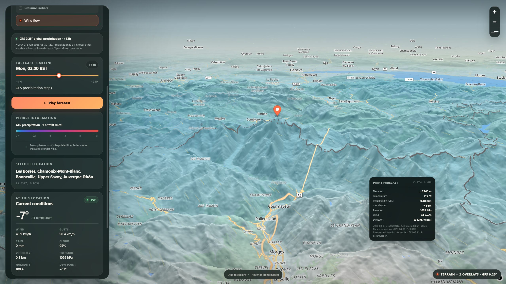
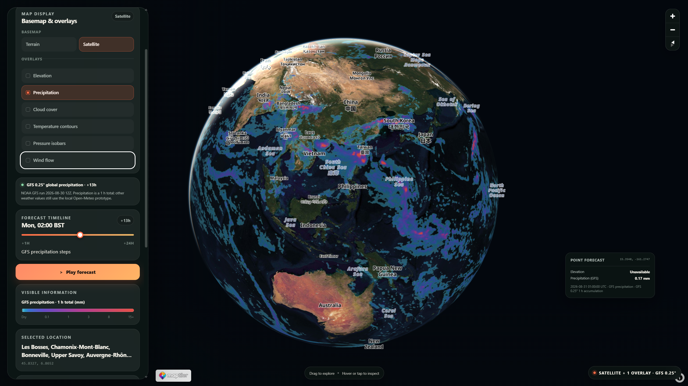

# Meridian

Meridian is an interactive 3D weather map for exploring forecast conditions across terrain, place, and time.



## Technical highlights

- **Global numerical weather pipeline:** Python selects the latest usable complete NOAA GFS cycle, downloads indexed GRIB2 byte ranges, validates precipitation, cloud, wind and temperature semantics, and generates numeric Web Mercator weather tiles.
- **Numeric weather data:** precipitation, total cloud cover, 10 m wind vectors and 2 m temperature remain numerical in the browser instead of being baked into imagery, supporting client-side styling, point inspection, contours, and forecast playback.
- **Custom WebGL wind rendering:** a projection-aware MapLibre particle layer samples geographic GFS U/V vectors to show forecast wind direction and relative speed across the globe.
- **Resilient interactive data lifecycle:** cancellation, bounded caching, last-valid-field reuse, rate-limit backoff, and persistent renderers keep the map responsive while data and camera state change.

## What it does

- Terrain and optional Satellite basemaps with 3D relief and globe-scale navigation.
- Global NOAA GFS precipitation, total cloud cover, 10 m wind and 2 m temperature with 24-hour playback.
- Independently combinable elevation, precipitation, cloud, temperature-contour, pressure-isobar, and animated wind overlays.
- A point inspector for elevation and weather values at the selected forecast time.
- Local GPX import with DEM-derived elevation, terrain-aware hiking schedules, linked route/profile inspection, and arrival-time GFS conditions including gusts, model visibility, freezing levels and experimental cloud ceiling.
- Place search, map selection, current conditions, and responsive map-first controls.

## Architecture

Meridian is a client-side React and MapLibre application. It requires no runtime application server, database, or authentication system.

Precipitation, total cloud cover, 10 m wind and 2 m temperature have migrated to global, geographically fixed numeric tiled fields:

```text
NOAA GFS GRIB2
  → Python preprocessing and validation
  → numeric Web Mercator tiles
  → immutable manifest and latest pointer
  → MapLibre client rendering
```



*Global NOAA GFS precipitation rendered as numeric forecast tiles over the Satellite globe.*

Open-Meteo remains the transitional regional source for map-level pressure. It interpolates a cached 9 × 9 sample grid for presentation; interpolation does not create additional meteorological information. See [Global weather architecture](docs/global-weather-architecture.md) for the detailed data model and migration design.

Route planning is a separate client-side pipeline: GPX geometry is resampled at controlled spacing, enriched from the Terrarium DEM, and passed to a terrain-aware walking model. A route-condition layer then samples existing GFS fields at each expected arrival time while leaving journey timing independent of weather.

## Stack

- **Frontend:** React 19, TypeScript, Vite, MapLibre GL JS, WebGL
- **Preprocessing:** Python, NumPy, Pillow, ecCodes
- **Data and maps:** NOAA GFS, Open-Meteo, OpenFreeMap/OpenStreetMap, AWS Terrarium, MapTiler Satellite, Nominatim

## Run locally

Requirements:

- Node.js `^20.19.0` or `>=22.12.0`
- npm
- A modern WebGL-capable browser
- Internet access for live weather, map tiles, terrain, and search

```sh
npm ci
npm run dev
```

Open the URL printed by Vite, normally [http://localhost:5173](http://localhost:5173).

On Windows PowerShell systems where the execution policy blocks npm's PowerShell shim, use:

```powershell
npm.cmd ci
npm.cmd run dev
```

### Optional satellite imagery

Satellite requires a client-visible MapTiler key. Create `.env.local` from `.env.example`, set `VITE_MAPTILER_KEY`, and restart the development server. Terrain and all non-satellite functionality work without it.

Never commit `.env.local`. A public deployment should use a dedicated MapTiler key restricted to its allowed HTTP origins and an appropriate provider plan.

### Generate current GFS weather fields

Generated GFS runs and `public/weather/gfs/latest.json` are local and ignored by Git. A clean clone still starts normally, but precipitation, cloud cover, wind and temperature are reported as unavailable until data are generated; Meridian does not silently substitute regional map fields.

With Python 3.12 or newer:

```sh
python -m pip install -r scripts/weather/requirements.txt
npm run weather:update
python -m unittest discover -s scripts/weather -p "test_*.py"
```

The updater finds the latest usable complete GFS cycle, falls back when the newest run is incomplete, and downloads only indexed APCP, TCDC, 10 m UGRD/VGRD, 2 m TMP, surface GUST/VIS and three atmospheric HGT records. It builds and validates all nine +24 h fields in a private transaction, moves the complete run into its immutable path, and then atomically switches `latest.json`. A failed run leaves the previous catalogue live. It requires no API key.

For continuous local updates, keep the frontend and updater in separate terminals:

```sh
npm run dev
npm run weather:watch
```

Watch mode checks once an hour, never rebuilds the published run, and retains the current plus one previous complete run. `npm run weather:check` probes for a newer usable cycle without generating or pruning. Ordinary `npm run dev` never contacts NOAA on the updater's behalf. On Windows the npm launcher uses `py -3.12`; set `MERIDIAN_PYTHON` to another Python executable when needed.

## Commands and verification

| Command | Purpose |
| --- | --- |
| `npm ci` | Reproduce dependencies from `package-lock.json` |
| `npm run dev` | Start the development server without running the NOAA updater |
| `npm run weather:check` | Probe for a newer complete nine-field GFS run without generating or pruning |
| `npm run weather:update` | Run one automatic GFS update and retention pass |
| `npm run weather:watch` | Check hourly and update when a newer usable cycle appears |
| `npm run lint` | Run ESLint |
| `npm run build` | Type-check and build production assets |
| `npm run preview` | Serve the production build locally |
| `python -m unittest discover -s scripts/weather -p "test_*.py"` | Run preprocessing tests |
| `node --test scripts/weather/test_temperature_contours.mjs` | Run temperature contour continuity tests |
| `node --test scripts/route/test_route_foundation.mjs` | Run route and journey-model tests |
| `node --test scripts/route/test_route_conditions.mjs` | Run route-condition time, wind, and availability tests |
| `node --test scripts/route/test_atmospheric_conditions.mjs` | Run atmospheric source, route, cache and formatting tests |

## Data sources and attribution

- [OpenFreeMap](https://openfreemap.org/) provides the vector basemap style and tiles; its source metadata supplies map attribution.
- [OpenStreetMap contributors](https://www.openstreetmap.org/copyright) provide geographic and search data used through OpenFreeMap and [Nominatim](https://nominatim.org/).
- [AWS Terrain Tiles](https://registry.opendata.aws/terrain-tiles/) provide the Terrarium DEM; Meridian links the [full terrain dataset credits](https://github.com/tilezen/joerd/blob/master/docs/attribution.md) at runtime.
- [Open-Meteo](https://open-meteo.com/) provides live point forecasts and the transitional regional pressure field under CC BY 4.0; runtime credit identifies Meridian's interpolated presentation.
- [NOAA GFS](https://registry.opendata.aws/noaa-gfs-bdp-pds/) provides the source numerical forecast data. Generated precipitation, cloud, wind and temperature tiles are derived products and retain linked provenance.
- [MapTiler Satellite](https://www.maptiler.com/satellite/) is the optional imagery provider; provider-supplied attribution and branding are preserved.

Provider availability, acceptable-use policies, rate limits, attribution requirements, and licensing remain applicable.

## Prototype limitations

- Meridian is an engineering prototype and should not be used for safety-critical navigation or forecasting decisions.
- Open-Meteo pressure still interpolates a regional 9 × 9 sample grid.
- GFS precipitation, total cloud cover, 10 m wind and 2 m temperature are 0.25° model fields; close zooms overzoom the same data rather than creating finer meteorological detail.
- The generated GFS horizon is +24 hours. Local updates can run continuously while a developer terminal remains open, but no production scheduler, hosting, monitoring, or alerting exists.
- Terrain and weather detail remain constrained by their source datasets.
- Route timing is a general hiking estimate, not a personalised prediction or safety assessment. Journey conditions use discrete GFS fields within the generated +24 h horizon and do not adjust travel time.
- Atmospheric route fields remain raw GFS 0.25° diagnostics, not new map overlays. Ceiling is above the model surface, not cloud base; no-ceiling sentinels are unavailable. Freezing levels do not predict ice, and model visibility is not exact local sight distance.

## Further reading

- [Product direction](docs/product-direction.md) — the problem Meridian is exploring and the decisions still open.
- [Global weather architecture](docs/global-weather-architecture.md) — the provider-neutral migration design and implemented global precipitation pipeline.
- [Development log](docs/development-log.md) — concise engineering milestones and durable decisions.

## Licence

Source is available for portfolio review. No open-source licence is currently granted. Third-party software, services, and datasets retain their own licences and terms.
