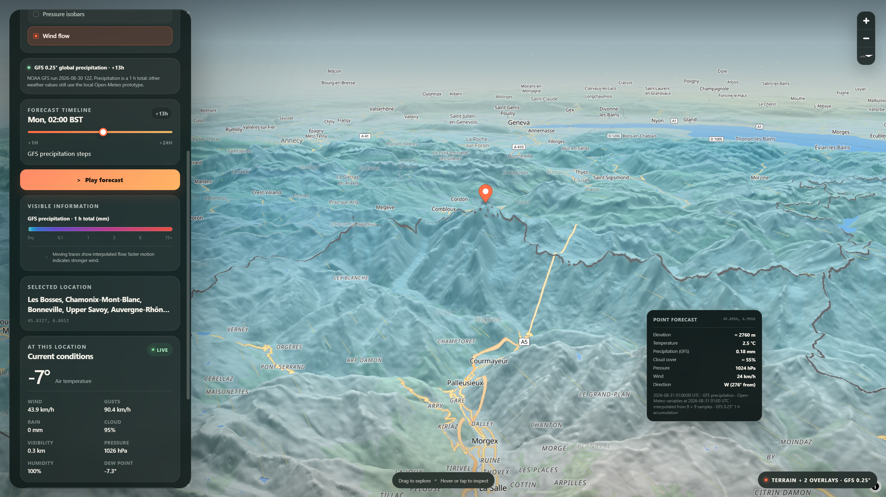
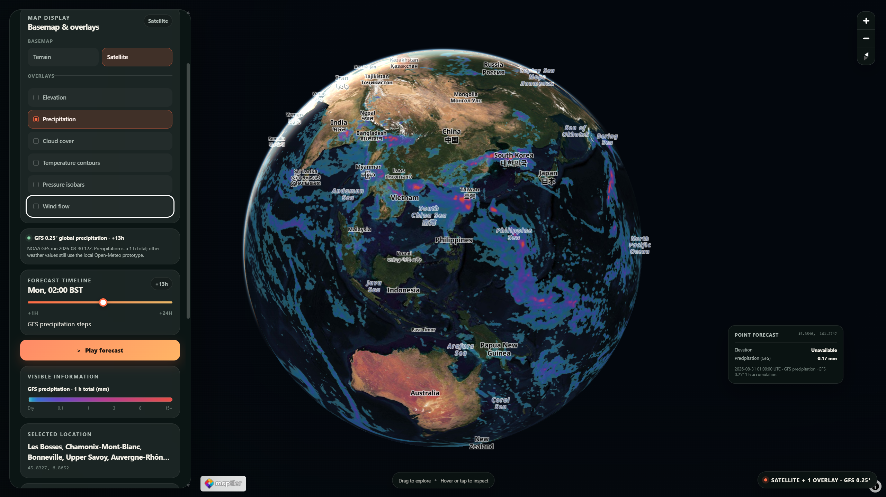

# Meridian

Meridian is an interactive 3D weather map for exploring forecast conditions across terrain, place, and time.



## Technical highlights

- **Global numerical weather pipeline:** Python selects the latest usable complete NOAA GFS cycle, downloads indexed GRIB2 byte ranges, validates ten weather fields including mean sea-level pressure, and generates numeric Web Mercator weather tiles.
- **Numeric weather data:** precipitation, total cloud cover, 10 m wind vectors, 2 m temperature and mean sea-level pressure remain numerical in the browser instead of being baked into imagery, supporting client-side styling, point inspection, contours, and forecast playback.
- **Custom WebGL wind rendering:** a projection-aware MapLibre particle layer samples geographic GFS U/V vectors to show forecast wind direction and relative speed across the globe.
- **Resilient interactive data lifecycle:** cancellation, bounded caching, last-valid-field reuse, rate-limit backoff, and persistent renderers keep the map responsive while data and camera state change.

## What it does

- Terrain and optional Satellite basemaps with 3D relief and globe-scale navigation.
- Global NOAA GFS precipitation, total cloud cover, 10 m wind, 2 m temperature and mean sea-level pressure with 24-hour playback.
- Independently combinable elevation, precipitation, cloud, temperature-contour, pressure-isobar, and animated wind overlays.
- An optional Map Inspector for elevation and weather values at the selected forecast time; it is off by default and enabled in global settings.
- Local GPX import with DEM-derived elevation, terrain-aware hiking schedules, linked route/profile inspection, and arrival-time GFS conditions including gusts, model visibility, freezing levels and experimental cloud ceiling.
- A map-first desktop workspace with parallel Location and Journey contexts, compact map controls, and a horizontal route-analysis panel.

## Architecture

Meridian is a client-side React and MapLibre application. It requires no runtime application server, database, or authentication system.

The current application is one composed experience with established ownership under **App** (composition), **Atlas** (world/terrain), **Weather** (atmosphere), and provisional **Traverse** (routes, journeys and movement). The canonical boundaries, dependency direction, external-storage contract and Tryfan reference-renderer plan are recorded in [Meridian architecture contract](docs/architecture.md). No separate deployable applications are implied by these names yet.

Large research and generated data stay outside Git. Python tooling resolves the documented sibling `meridian-data` default or an absolute `MERIDIAN_DATA_ROOT`; private activities and user routes use the separate `MERIDIAN_PRIVATE_ROOT`. See the architecture contract and [Phase 4 migration inventory](docs/phase-4-migration-inventory.md). Historical Earth Lab identities and configs remain intact; root-aware tooling resolves their migrated experiment data under `MERIDIAN_DATA_ROOT/experiments/earth-lab`. The Tryfan Unreal project remains a reference renderer, with recovery instructions in its [README](renderers/unreal/tryfan-reference/README.md).

Map weather, including precipitation, total cloud cover, 10 m wind, 2 m temperature and mean sea-level pressure, uses global, geographically fixed numeric tiled fields:

```text
NOAA GFS GRIB2
  → Python preprocessing and validation
  → numeric Web Mercator tiles
  → immutable manifest and latest pointer
  → MapLibre client rendering
```



*Global NOAA GFS precipitation rendered as numeric forecast tiles over the Satellite globe.*

Open-Meteo remains the selected-location source for current conditions and the seven-day point forecast. It is no longer used to construct map fields. See [Global weather architecture](docs/global-weather-architecture.md) for the detailed data model and source boundaries.

Route planning is a separate client-side pipeline: GPX geometry is resampled at controlled spacing, enriched from the Terrarium DEM, and passed to a terrain-aware walking model. App asks Weather to sample the existing fields at each expected arrival time, then passes provider-neutral samples to Traverse for route-relative interpretation. Journey timing remains independent of weather.

## Active source ownership

One client-side application is composed under `src/app`. `src/atlas` owns the map
lifecycle, location, terrain and satellite infrastructure; `src/weather` owns Weather
models, data access, rendering and sampling; `src/traverse` owns routes, journeys and
route-condition interpretation. `src/main.tsx` and `src/index.css` remain entry/style
files. There is no `shared` package without a concrete neutral responsibility.

App's MeridianMap composes AtlasMap, WeatherMapController and TraverseMapController.
Weather receives a narrow coverage interval rather than a journey model. Traverse
consumes neutral Weather samples rather than GFS manifests or tile internals.
Historical Earth Lab and Tryfan/Unreal identities remain separate and unchanged.
See the [Phase 5 architecture plan](docs/phase-5-architecture-plan.md) for the final
layout, intentional seams and validation gates.

## Stack

- **Frontend:** React 19, TypeScript, Vite, MapLibre GL JS 6.11.2, WebGL2
- **Preprocessing:** Python, NumPy, Pillow, ecCodes
- **Data and maps:** NOAA GFS, Open-Meteo, OpenFreeMap/OpenStreetMap, AWS Terrarium, MapTiler Satellite, Nominatim

## Run locally

Use `main` for active Meridian development. The Phase 5 architecture cleanup is
complete; `earth-lab` and `legacy/journey-weather` are retained historical branches,
not prerequisites for working on the application. Phase 6 is complete: `main` is
published and canonical, and `phase-5-complete` is published. Phase 7 verifies
clean-start reproduction and the final foundation checkpoint; see the
[repository status](docs/architecture.md#repository-status-and-historical-markers).

Requirements:

- Node.js `>=22.12.0` (the MapLibre v6 dependency tree requires Node 22)
- npm
- A modern WebGL2-capable browser
- Internet access for live weather, map tiles, terrain, and search

```sh
npm ci
npm run dev
```

Open the URL printed by Vite, normally [http://localhost:5173](http://localhost:5173).

MapLibre is pinned to patched v6.11.2. Atlas configures its self-contained worker
through Vite's `?worker&url` pipeline for both development and production; no
manual worker copy or CDN configuration is required. See the
[security maintenance record](docs/development-log.md#maplibre-security-maintenance)
for the attribution advisory resolution and compatibility checks.

On Windows PowerShell systems where the execution policy blocks npm's PowerShell shim, use:

```powershell
npm.cmd ci
npm.cmd run dev
```

### Visual browser validation

Install Playwright's pinned Chromium once after `npm ci`:

```sh
npm run visual:install
```

Run the supported visual smoke workflow with:

```sh
npm run visual:test
```

Run this browser workflow on its own, without a concurrent production build or
Node/Python test run, and with enough free memory for Chromium and the 3D map.

Playwright starts the normal Vite development server on loopback-only `http://localhost:4173`, launches headless Chromium, exercises the desktop shell and key controls, loads the non-private Snowdonia route fixture, writes diagnostics and screenshots, then closes the browser and server. The configured desktop sizes are 1920×1080, 1440×900, and 1366×768. Run one size with, for example, `npm run visual:test -- --project desktop-1440x900`.

Generated PNGs and JSON diagnostics are written to `test-results/visual/`; traces from failures are written under `test-results/playwright/`. Both paths are ignored by Git. Page exceptions fail the suite, while console messages, failed requests, and HTTP error responses are retained in the diagnostics so external provider failures remain visible.

The shell checks do not contact NOAA or run the weather updater. Normal map, weather, and search requests follow the application's real network paths and can fail independently. The route smoke test intercepts only AWS Terrarium PNG requests with a checked-in, neutral test DEM tile so route/profile interaction does not depend on terrain-network availability.

For UI work, use the loop: implement, run `npm run visual:test`, inspect the PNGs in `test-results/visual/`, adjust, and rerun. The paths are deterministic so Codex can load the screenshots directly. On this Windows Codex host, headed Chromium process creation is blocked with `spawn UNKNOWN`; the supported headless workflow still renders, interacts, and captures inspectable output.

### Optional satellite imagery

Satellite requires a client-visible MapTiler key. Create `.env.local` from `.env.example`, set `VITE_MAPTILER_KEY`, and restart the development server. Terrain and all non-satellite functionality work without it.

Never commit `.env.local`. A public deployment should use a dedicated MapTiler key restricted to its allowed HTTP origins and an appropriate provider plan.

### Generate current GFS weather fields

Generated GFS runs live under `MERIDIAN_DATA_ROOT/derived/weather/gfs` and remain outside Git. Vite exposes the validated catalogue-selected run at the stable `/weather/gfs` browser URL through a guarded local adapter; production builds materialize that bounded view into `dist`. A clean clone still starts normally, but global map weather is reported as unavailable until the external dataset exists. Meridian does not silently substitute point-API fields.

Stopping development or test servers does not create a production publication.
Only `npm run build` materializes the catalogue-selected run into `dist/weather/gfs`.

With Python 3.12 or newer:

```sh
python -m pip install -r scripts/weather/requirements.txt
npm run weather:update
python -m unittest discover -s scripts/weather -p "test_*.py"
```

The default data root is the sibling `meridian-data` directory. Set an absolute
`MERIDIAN_DATA_ROOT` before running the updater when data live elsewhere. Use
`npm run weather:publication:check` to verify the external catalogue before starting
local development or building. Generation and browser publication are separate: the
updater owns external authoritative data, while Vite serves only the catalogue-selected
run at `/weather/gfs`.

The updater finds the latest usable complete GFS cycle, falls back when the newest run is incomplete, and downloads only indexed APCP, TCDC, 10 m UGRD/VGRD, 2 m TMP, mean-sea-level PRMSL, surface GUST/VIS and three atmospheric HGT records. It builds and validates all ten +24 h fields in a private transaction, moves the complete run into its immutable path, and then atomically switches `latest.json`. A failed run leaves the previous catalogue live. It requires no API key.

For continuous local updates, keep the frontend and updater in separate terminals:

```sh
npm run dev
npm run weather:watch
```

Watch mode checks once an hour, never rebuilds the published run, and retains the current plus one previous complete run. `npm run weather:check` probes for a newer usable cycle without generating or pruning. Ordinary `npm run dev` never contacts NOAA on the updater's behalf. On Windows the npm launcher uses `py -3.12`; set `MERIDIAN_PYTHON` to another Python executable when needed.

## Commands and verification

| Command | Purpose |
| --- | --- |
| `npm ci` | Reproduce dependencies from `package-lock.json` |
| `npm run dev` | Start the development server without running the NOAA updater |
| `npm run weather:check` | Probe for a newer complete ten-field GFS run without generating or pruning |
| `npm run weather:update` | Run one automatic GFS update and retention pass |
| `npm run weather:watch` | Check hourly and update when a newer usable cycle appears |
| `npm run test:ui` | Run focused desktop workspace and presentation tests |
| `npm run visual:install` | Install Playwright's pinned Chromium in the user-local cache |
| `npm run visual:test` | Start Vite, run the desktop browser smoke, and capture screenshots/diagnostics |
| `npm run lint` | Run ESLint |
| `npm run build` | Type-check and build production assets |
| `npm run preview` | Serve the production build locally |
| `python -m unittest discover -s scripts/weather -p "test_*.py"` | Run preprocessing tests |
| `node --test scripts/weather/test_temperature_contours.mjs` | Run temperature contour continuity tests |
| `node --test scripts/route/test_route_foundation.mjs` | Run route and journey-model tests |
| `node --test scripts/route/test_route_conditions.mjs` | Run route-condition time, wind, and availability tests |
| `node --test scripts/route/test_atmospheric_conditions.mjs` | Run atmospheric source, route, cache and formatting tests |

## Data sources and attribution

- [OpenFreeMap](https://openfreemap.org/) provides the vector basemap style and tiles; its source metadata supplies map attribution.
- [OpenStreetMap contributors](https://www.openstreetmap.org/copyright) provide geographic and search data used through OpenFreeMap and [Nominatim](https://nominatim.org/).
- [AWS Terrain Tiles](https://registry.opendata.aws/terrain-tiles/) provide the Terrarium DEM; Meridian links the [full terrain dataset credits](https://github.com/tilezen/joerd/blob/master/docs/attribution.md) at runtime.
- [Open-Meteo](https://open-meteo.com/) provides live selected-location current conditions and point forecasts under CC BY 4.0.
- [NOAA GFS](https://registry.opendata.aws/noaa-gfs-bdp-pds/) provides the source numerical forecast data. Generated map-weather and route-condition tiles are derived products and retain linked provenance.
- [MapTiler Satellite](https://www.maptiler.com/satellite/) is the optional imagery provider; provider-supplied attribution and branding are preserved.

Provider availability, acceptable-use policies, rate limits, attribution requirements, and licensing remain applicable.

## Prototype limitations

- Meridian is an engineering prototype and should not be used for safety-critical navigation or forecasting decisions.
- GFS map weather is based on 0.25° model fields; close zooms overzoom the same data rather than creating finer meteorological detail.
- The generated GFS horizon is +24 hours. Local updates can run continuously while a developer terminal remains open, but no production scheduler, hosting, monitoring, or alerting exists.
- Terrain and weather detail remain constrained by their source datasets.
- Route timing is a general hiking estimate, not a personalised prediction or safety assessment. Journey conditions use discrete GFS fields within the generated +24 h horizon and do not adjust travel time.
- Atmospheric route fields remain raw GFS 0.25° diagnostics, not new map overlays. Ceiling is above the model surface, not cloud base; no-ceiling sentinels are unavailable. Freezing levels do not predict ice, and model visibility is not exact local sight distance.

## Further reading

- [Atlas research map and fresh-session handoff](docs/research/atlas-research-map.md) — read before changing Atlas; evidence classes, closed branches and literature status.
- [Atlas research state and pre-synthesis audit](docs/research/atlas-research-state.md) — current thread statuses, superseded/deferred work and the remaining bounded synthesis prerequisite.
- [Atlas terrain representation research synthesis](docs/earth-lab/atlas-terrain-representation-synthesis.md) — final 012A–012G findings, limitations and external-product map.
- [Product direction](docs/product-direction.md) — the problem Meridian is exploring and the decisions still open.
- [Global weather architecture](docs/global-weather-architecture.md) — the provider-neutral migration design and implemented global precipitation pipeline.
- [Development log](docs/development-log.md) — concise engineering milestones and durable decisions.

## Licence

Source is available for portfolio review. No open-source licence is currently granted. Third-party software, services, and datasets retain their own licences and terms.

## Meridian foundations review — 9 October 2026

The [foundations review](docs/foundations/summary.md) records **C — FOUNDATIONS REVIEW READY**.
It establishes engineering/product standards, mobile and offline feasibility gates,
a private-beta roadmap and explicit reconciliation of the prototype plan. A new UI
is planned; no application implementation or private access occurred. Atlas and
Weather remain distinct. Exactly one next task: **MERIDIAN MOBILE TERRAIN AND OFFLINE
EVIDENCE FEASIBILITY STUDY — NOT BEGUN**. Final framework, rights and private
restructuring remain gated; the previously selected private audit is deferred.

## Foundations amendment — 9 October 2026

**C — FOUNDATIONS AMENDMENT READY** from `6c83603d72c33bdac2d1c7d3302c0cc47ab76ad8`.
See the [amended summary](docs/foundations/summary.md) for F31–F34: eight maturity stages,
[public-exposure economics](docs/foundations/economics.md), [subsystem evolution](docs/foundations/evolution.md)
and historical-planning precedence. One terrain prototype is not external-beta readiness;
new UI and feasibility-first sequencing supersede incompatible old planning, preserving science.
Exactly one next task: **MERIDIAN MOBILE TERRAIN AND OFFLINE EVIDENCE FEASIBILITY STUDY — NOT BEGUN**.
Its existing device/conformance/offline/hardware/no-private-access scope remains unchanged.


## Mobile feasibility prerequisite gate — 9 October 2026

**PREREQUISITE GATE — MOBILE FEASIBILITY NOT ESTABLISHED.** The [study record](docs/research/meridian-mobile-feasibility-gate.md)
documents the clean `f2c1e3db8dd78eb592a07745e1b4645b241f1408` start, bounded Windows
device/tool inventory and source-level capability review. No connected phone was detected;
Android build tools were absent in the checked locations and off-host device/Mac access
remains unconfirmed. Inventory has begun; physical terrain, portable-reader conformance
and offline/recovery experiments have not been performed. This does not change accepted
prototype readiness or establish mobile readiness. F03/F04/F05/F11/F12/F16 remain open.

Exactly one subsequent task: **MERIDIAN MOBILE FEASIBILITY PREREQUISITE RESOLUTION —
PHYSICAL DEVICES AND BUILD ACCESS — NOT BEGUN**. Confirm named hardware and build access,
report resource requirements before installation, and preserve the original study's
real-device, qualified-conformance, offline-completeness, hardware-limit and no-private-access
criteria. No framework selection, payload packaging, production change or private audit.


## Portable Atlas read reference — 9 October 2026

[Reference contract and fixtures established](docs/research/atlas-portable-read.md): 60 cases, three exact historical
pins and complete qualifications; three fresh replays passed 360 indexed/full comparisons.
F03/F12 gain an executable reference target; their portable/production decisions remain
provisional. Accepted evidence and statuses are unchanged; mobile, offline and renderer
feasibility remain unproven.

The user-authorised contract task supersedes prerequisite resolution as the current
engineering path, without resolving the physical-device gate. Exactly one next task:
**MERIDIAN ATLAS PORTABLE READ-ONLY PROJECTION AND INDEPENDENT READER SPIKE — NOT BEGUN**.
The linked report specifies its bounded, platform/framework-neutral scope and safeguards.


## Portable Atlas projection spike — 9 October 2026

[SEMANTIC PORTABILITY DEMONSTRATED](docs/research/atlas-portable-projection.md), bounded to the frozen Riffelhorn
profile and desktop GIS toolchain: three isolated 60/60 replays, exact full-envelope
agreement, 14 novel behaviour/failure tests and byte-identical 116.7 MB projection
reproduction. The independent Python reader requires no original source files,
authoritative query implementation, Node or network during tested reads.

F03/F12 gain semantic feasibility evidence; format/framework, mobile and robust offline
lifecycle remain provisional or unproven. Canonical authority, accepted evidence,
frozen fixtures and research statuses remain unchanged. Exactly one next bounded task:
**MERIDIAN ATLAS PORTABLE PROJECTION HARDENING AND OFFLINE FAILURE VALIDATION — NOT BEGUN**.
Its scope follows observed incomplete-install/post-open consistency gaps, not production
or private-repository integration. The linked report records commands, costs and limits.


## Portable Atlas desktop consistency — 9 October 2026

[DESKTOP OFFLINE CONSISTENCY DEMONSTRATED](docs/research/atlas-portable-projection-hardening.md), bounded to Windows/NTFS and the
retained finite read profile: complete closure before ready, separate installation
selection/exact scientific generation, failed-replacement preservation, restart,
explicit deletion and verified in-memory raster snapshots. Frozen semantic cases,
canonical authority and accepted research remain unchanged. The report records
commands, failure tests, measured storage/memory and unproven power-loss/authenticity/
mobile guarantees. Implementation stays under scripts/atlas/portable-spike; the
Atlas authority, Weather and production application are unchanged.

F03/F05/F12 and E02/E05 gain bounded desktop evidence; final formats/frameworks,
physical-device feasibility and legal redistribution remain open. Exactly one
subsequent task: **MERIDIAN ATLAS OFFLINE PROJECTION PORTABILITY AND RESOURCE-REDUCTION
STUDY — NOT BEGUN**. Its scope follows observed source-raster overhead, desktop GIS
dependencies and unresolved offline rights; no mobile deployment, production or
private-repository integration is begun.

## Atlas projection resource study — 9 October 2026

[Bounded study](docs/research/atlas-portable-projection-reduction.md): **PARTIALLY DEMONSTRATED**. One verified captured snapshot
serves three explicit Riffelhorn historical pins; median peak working set fell from
599.45 MB to 332.74 MB (about 45%). One-reader memory, the 116,692,961-byte package
and GIS dependencies remain unchanged. All 60 frozen cases passed in each of three
fresh processes per mode, plus 159 novel comparisons; full-grid qualifications,
readiness, restart and post-open consistency are preserved. This is desktop evidence,
not mobile or redistribution clearance; all accepted authority remains unchanged.
Implementation and reproducible commands are linked from the report.

Exactly one next bounded task, **NOT BEGUN**: **MERIDIAN ATLAS NATIVE-GRID WINDOW
PROJECTION AND SCIENTIFIC-CLOSURE FEASIBILITY**, limited to proving whole-profile
Copernicus window support, original grid identities and exact semantic/lifecycle
conformance. No mobile, private repository, production or framework decision.


## Atlas native-grid window feasibility — 9 October 2026

[Bounded experiment](docs/research/atlas-native-grid-window.md): **DEMONSTRATED** for the retained Riffelhorn read profile
and checked PROJ 9.5.1 operation. A conservative 366-column strip retains all original
rows/grid identities; no adoption of the unproved 94 × 66 crop. Package size falls
from 116,692,961 to 77,412,208 bytes; DSM from 42,594,792 to 3,306,806 bytes. All 60
unchanged cases pass in three isolated processes per representation, plus 436 novel
complete-envelope comparisons. Three-pin shared peak memory falls modestly from
332.87 to 320.32 MB; verified opening is essentially unchanged. Exact native indices,
full qualifications, all other members, historical pins, readiness, failed-replacement
preservation, restart and captured post-open consistency remain intact.

The isolated implementation/commands and scientific closure argument are linked from
the report. Canonical Atlas authority, accepted research, 42 status rows, 113 protected
hashes and Swiss/AWS negative reconciliation remain unchanged. This does not resolve
F04/F11 mobile rendering/framework or F17 legal distribution gates; F03/F05/F12 gain
bounded desktop evidence only. No mobile, Weather, UI, private or production integration.

Exactly one subsequent bounded task — **MERIDIAN ATLAS PORTABLE READER GEOMETRY AND
CRS DEPENDENCY FEASIBILITY — NOT BEGUN**, addressing the unchanged desktop GIS stack
and its deployment/semantic constraints rather than another minimum-crop optimisation.


## Atlas geometry and CRS dependency feasibility — 10 October 2026

[Bounded study](docs/research/atlas-geometry-crs-feasibility.md): **PARTIALLY DEMONSTRATED**. The complete retained operation
inventory and dependency/rights comparison are documented. One direct binding to the
already installed PROJ 9.5.1 C API agrees exactly with the accepted Windows reader:
60 frozen cases per path across three pins, 524 coordinate comparisons and 220 novel
complete envelopes. This is the same CRS engine with a different binding; GEOS/raster
operations remain unchanged. Full-reader peaks remain approximately 321 MB; no mobile,
Python-free reader, replacement geometry kernel or distribution clearance is established.

Accepted authority, window/shared-store implementation, frozen fixtures, 42 status rows,
113 protected hashes and negative Swiss/AWS reconciliation remain unchanged. F03/F12 gain
bounded binding evidence; mobile/framework, packaging and rights decisions remain open.
The report links isolated code, raw measurements, commands and exact validation limits.

Exactly one subsequent bounded task — **MERIDIAN ATLAS NATIVE GEOMETRY C-API CONFORMANCE
SPIKE — NOT BEGUN**, limited to the existing reference kernel's predicate, encoding,
ownership and complete-envelope compatibility. No custom GIS engine, private access,
SDK installation, mobile deployment or production integration.


## Atlas native geometry C-API conformance — 10 October 2026

[Bounded spike](docs/research/atlas-native-geometry.md): **DEMONSTRATED** for the installed Windows GEOS 3.13.1 /
CAPI 1.19.2 binding and retained Riffelhorn profile. A separately owned native context
preserves boundary-inclusive covers, positive-area clipping, holes/multipart, XY/XYZ
serialisation, ownership and explicit errors. All 60 frozen, 153 new and 436 adapted
window complete envelopes agree exactly. This is the same GEOS engine through another
binding, not independent algorithm validation or mobile portability.

The report links isolated code, commands, raw trials and validation receipts. Three-pin
peak memory remains about 321 MB; the accepted Python/NumPy/GDAL validation/raster stack
and one-time Shapely interchange remain. No production interface or kernel replacement.
Scientific authority, native-window/shared-store implementation, frozen fixtures,
42 status rows, 113 protected hashes and negative Swiss/AWS reconciliation are unchanged.
F03/F12 gain binding evidence; framework, renderer, packaging and rights gates remain open.

Exactly one subsequent bounded task — **MERIDIAN ATLAS PORTABILITY CONSOLIDATION AND
CROSS-PLATFORM ARCHITECTURE HANDOFF — NOT BEGUN**. Consolidate accepted semantic,
closure, ownership, resource and platform evidence for the dedicated architecture
study; no new GIS optimisation, private access, SDK, mobile deployment or implementation.


## Atlas portability architecture handoff — 10 October 2026

The [consolidated handoff](docs/research/atlas-portability-handoff.md) records sufficient
bounded Atlas evidence to proceed to whole-Meridian architecture research. Qualified
semantics, native-grid closure and tested Windows offline/kernel boundaries remain
accepted; Python-free readers, phone/browser deployment, target resources and redistribution
remain unproved. The capability matrix distinguishes shared implementation candidates,
equivalent platform bindings, OS storage responsibilities and unresolved deployments.
No runtime, scientific record or application changes here.

Current next task: **MERIDIAN WEB/MOBILE ARCHITECTURE AND CODE-SHARING FEASIBILITY STUDY —
NOT BEGUN**. This supersedes historical next-step sequencing only. It must include Atlas,
Weather, Guide, terrain, offline storage, state and a new replaceable UI; architectural
research is distinct from later physical-device validation. No final framework or private
access is authorised by the handoff.


## Web/mobile architecture feasibility — 10 October 2026

The [Meridian-wide comparison](docs/research/meridian-cross-platform-architecture.md)
separates scientific contracts and selected shared logic from platform renderers,
storage, device services and new UI. Native presentation and native-file/GL JS
shell paths remain credible conditional alternatives; no final framework or renderer
is selected. Current native MapLibre terrain limitations, physical-device/build access,
target reader conformance and offline resource custody remain evidence gates.

Exactly one next task: **MERIDIAN MOBILE FEASIBILITY PREREQUISITE RESOLUTION — PHYSICAL
DEVICES AND BUILD ACCESS — NOT BEGUN**. No application, device trial, private access,
Weather programme, data acquisition or infrastructure was begun.
