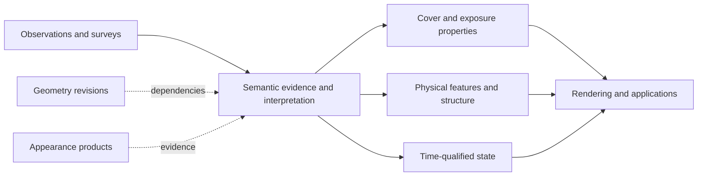

# Atlas physical surface semantics — domain review

Status: **domain review complete; conceptual proposal, not an implemented contract**.
Reviewed 2026-10-06. Starting checkpoint `57688cb48e0a0c7768b066df548b6959b924bfc7`
(“Characterize Atlas information-aware display limits”). Clean `main`, fetched
`origin/main`, zero commits ahead/behind before work. This record and the
[bounded source inventory](physical-surface-sources.md) are the durable outputs.
No datasets, classifiers, semantic runtime or production layers were added.

## Problem and programme boundary

Atlas needs to represent **claims about what physically occupies, covers or
constitutes a location, at a specified spatial support, vertical scope and time**.
It must also retain how each claim was obtained. This is broader than a coloured
land-cover map and narrower than an exhaustive model of geology, ecology, human
activity or hydrology.

Keep five questions separate:

1. Geometry: what shape does a represented surface have?
2. Observation: what did an instrument or survey record?
3. Appearance: what processed photographic/radiometric product represents it?
4. Physical semantics: what property, material, cover, feature or state is claimed?
5. Rendering: how is any of that portrayed?

The [Terrain Hierarchy Contract](terrain-hierarchy-contract.md) remains authoritative.
The [appearance proposal](appearance-baseline-and-architecture.md) remains separate.
Neither TerrainProduct nor AppearanceProduct becomes a semantic classification
container. Shared identity, rights and lineage concepts can be reused without
creating a universal Atlas object.

**Regional elevation foundation = established. Multiscale research = closed.**
The [information-aware synthesis](information-aware-display-selection.md) supports
explicit sampling/unknown information, not universal modes or automatic quality
ranking. The negative relief control remains negative; morphology preparation is
not activated. The [multiview benchmark](swiss-multiview-benchmark.md) remains parked
for external source-image provisioning. No investigation here extends that branch.

### Current production audit

`AtlasMap.ts` requests the OpenFreeMap Liberty style. `mapLayerAnchors.ts` recognises
upstream water/waterway/transport/boundary layers for ordering;
`terrainLayers.ts` preserves cartographic water depiction above terrain colouring
and relief. These are display/style integration, not an Atlas-owned catalogue of
surface facts. This audit does not certify every remote style class or its epoch,
classification method or accuracy. Atlas presently has no owned semantic-product
registry or source-native-to-common surface mapping.

Terrain metadata already distinguishes DTM/DSM and height references; those
statements explain **what heights refer to**, not whether a site is scree, soil,
forest or temporarily inundated. Production remains AWS visual terrain through
registration → selection → delivery, independent AWS analytical z15, exaggeration
1.45, existing IGOR and MapTiler satellite-v2. Satellite opacity/suppression,
Weather, Traverse and the imperative map lifecycle are unchanged.

## Terminology and ownership

“Observed” below does not imply an unprocessed measurement. Remote-sensing maps
usually classify or estimate properties from observations. Time dependence is a
property of the phenomenon; publication frequency is a property of the product.
[FAO distinguishes physical cover from use](https://www.fao.org/geospatial/our-focus/en).

| Term | Meaning and usual evidence basis | Time and Atlas boundary |
| --- | --- | --- |
| Land cover | Physical vegetation, exposed ground, water or artificial cover; usually interpreted/classified | Epoch-dependent; useful input vocabulary, not automatically the ontology |
| Land use | Activities, management and function: forestry, pasture, residential | Changing human geography; separate from physical foundation |
| Surface material | Material actually exposed in a stated layer: rock, loose mineral material, paving | Relatively persistent or changing; include when justified by evidence |
| Substrate | Material beneath cover or another layer | Often concealed/inferred; retain explicit scope and unknowns |
| Vegetation cover | Presence, type or fraction of vegetation in a defined footprint/layer | Seasonal and longer-term; physical property |
| Vegetation structure | Height, density, vertical profile, distribution of vegetation | Survey/remote estimates; physical structure, not synonymous with type |
| Canopy | Upper vegetation layer or its projected cover | Layer-specific; can coexist with understory/ground claims |
| Hydrography | Identified water-related features, axes and connectivity | Feature identity may persist while wet extent changes; physical features, not flow simulation |
| Water extent | Area occupied by water for a reference condition/time | Observation/classification or model; state, not network topology |
| Snow cover | Snow presence/fraction over another surface | Rapidly changing; dated state, not underlying substrate |
| Glacier/ice extent | Glacier object, exposed ice or multiannual snow/ice class, depending on definition | Keep these meanings separate; dated inventory/state |
| Built/artificial surface | Physical manufactured cover or structure | Distinguish material/geometry from function |
| Impervious surface | Sealed-cover fraction/property under a product definition | Estimated property; not equivalent to all buildings or urban use |
| Geomorphology | Landforms and processes inferred from geometry/material/history | Useful external interpretations; not a mandatory foundation taxonomy |
| Geology | Lithology, strata and geological relationships | Often subsurface/inferred; deeper specialist domain |
| Soil | Near-surface material and depth-dependent properties | Exposed soil is relevant; full soil profiles remain specialist |
| Habitat/ecosystem | Ecological assemblages, conditions and relationships, sometimes management-based | Specialist interpretation; selected physical attributes may map partially |
| Remote-sensing classification | Method/product assigning classes or estimated properties | Evidence process, not a physical domain |
| Physical surface state | Time-qualified condition: inundation, snow, exposed ground, seasonal foliage | Cross-cutting qualification; not one more mutually exclusive class |

Forest/forestry, grass/pasture and built/residential illustrate why use cannot be
silently substituted for cover. Conversely “forest” itself may be a legal,
management or inventory definition that includes temporarily unstocked areas.
An industrially managed forest still has independently describable canopy, ground
and material properties. Do not infer physical exposure solely from a use label.

## Evidence, values and layered surfaces

An observation is an input. A classification is an interpretation with a legend
and method. A derived property can be continuous (height, fraction) or categorical.
An inference may use indirect evidence or a model. **State is the subject of a
claim, not a competing epistemic category**: snow state can be observed,
classified or modelled. Preserve these axes separately.

A minimal conceptual chain is:

observation/survey → source-native semantic product → declared interpretation or
mapping → physical-property/feature/state claim → representation → display.

Each step needs provenance; a Meridian mapping is another interpretation, not
proof that the source measured the common concept. Missing data, unclassified
support and a supported absence must remain different outcomes.

Use categorical values where distinctions are meaningful, and continuous values
where products estimate fractions, height, density or wetness. Distinguish:

- cover fraction: proportion of a specified footprint/layer;
- class probability: an estimator's belief under its model and legend;
- observation occurrence: frequency conditional on available observations;
- product accuracy: validation over a defined population/reference protocol.

Wetness/moisture also needs a defined depth or surface condition and evidence
method; a wetland label is not a moisture measurement. Physical roughness must
state its spatial wavelength/support and statistic; it is not automatically the
aerodynamic roughness parameter used by an atmospheric model. These are scoped
properties, not reasons to create additional subsystems now.

Fractions, probabilities, occurrence and validation accuracy cannot share one
generic confidence field. Fractions need denominators,
units and vertical scope. Different vertical layers may overlap, so their
fractions need not sum to one. Probabilities from incompatible legends cannot be
combined as if they represented the same events.

The evidence supports layered description: canopy above understory above soil;
snow above rock; water above bed; bridge deck above water. Unknown lower layers
must remain unknown. A 2D cover product usually describes a particular observable
or classified layer, not a complete vertical column. The
[FAO/ISO LCML approach](https://www.fao.org/geospatial/data-and-tools/international-standards/en)
explicitly supports arrangements of biotic/abiotic elements rather than only a
flat legend. [GEDI products](https://gedi.umd.edu/dataproducts/products/) independently
demonstrate vertical vegetation measurements and derived summaries. These are
established precedents, not a proposal to implement full LCML or a voxel world.

## Time, scale and boundaries

Retain observation date/range, nominal epoch, product publication and processing
revision separately. A validity interval may be asserted by a source, inferred
under a declared model, or unknown. Do not manufacture continuous validity between
observations. Relevant rates span geological stability, forest management,
seasonality, tides and flood events; no fixed update cadence defines ownership.
Historical versions should preserve changing claims instead of overwriting them.
Crop cycles, forestry, construction and wildfire can change several properties
at once; snow, floods and tides can change exposure without replacing the enduring
feature or substrate. An event label can be retained as evidence/context, but does
not establish a complete post-event physical state.

Semantic scale includes source observation sampling, classification grain and
context window, product pixels, minimum mapping unit (MMU), minimum feature width,
polygon generalisation and positional uncertainty. A finer rasterised polygon does
not create finer independent classifications. The
[CORINE product](https://land.copernicus.eu/en/products/corine-land-cover) illustrates
this: its status mapping uses 25 ha MMU and 100 m minimum width despite a 100 m
raster distribution. Do not equate that raster with an independently observed
100 m class at every cell. Class meanings may also change with scale.

Mixed pixels are not necessarily errors. Some products explicitly estimate
fractions; others force a dominant class. If future semantic parents are prepared,
aggregation rules must be declared: majority, fractions, feature retention and
probability aggregation make different claims. The coherent-family principle
transfers as provenance discipline, not as a licence to average class codes.

Boundary meaning must include where relevant: observed sharp edge, gradual change,
threshold contour, uncertain classification, mobile state boundary or generalised
cartographic boundary. Polygons alone establish none of these. A forest edge,
waterline, snow margin and wetland transition can have different uncertainty and
reference conditions. Preserve masks/support and uncertainty statements without
requiring invented per-edge precision. RGB and category boundaries need not align.

## Source landscape and what it establishes

The [source inventory](physical-surface-sources.md) records product-specific
coverage, grain, epoch, methods, validation, rights and access. It is a bounded
survey, not a production-source selection or a claim that all services were tested.
No data products were acquired.

- **Global:** WorldCover, Copernicus dynamic land cover, Dynamic World and MODIS
  provide different categorical/probabilistic interpretations. Hansen, GEDI,
  JRC water, MODIS snow, RGI and GHSL demonstrate independent forest, structure,
  water, cryosphere and built-area quantities. SoilGrids demonstrates the separate
  depth-dependent soil domain. Global coverage is not universal local reliability.
- **Europe:** CORINE adds a mature hierarchical but mixed cover/use legend;
  CLMS high-resolution layers add continuous tree-cover and impervious fractions,
  water/wetness histories and snow states. Riparian mapping has targeted coverage.
  These are complementary measurements, not uniformly superior replacement maps.
- **Great Britain:** UKCEH, OS, Forestry, NRW and NatureScot expose classification,
  feature, inventory and habitat products with materially different definitions,
  ages and terms. LiDAR provides structural evidence, not vegetation identity.
  England-only coverage must not be treated as GB-wide.
- **Switzerland:** swissTLM3D separates cover objects, use areas, structures and
  water networks; statistical land-use surveys separate cover/use variables;
  LFI vegetation height, GLAMOS glacier inventories and SLF measurements add
  structure, objects and dated state. Geological mapping is not exposed material.

Two particularly consequential source facts:

1. The current [UKCEH raster record](https://catalogue.ceh.ac.uk/documents/4dd9df19-8df5-41a0-9829-8f6114e28db1)
   links a [custom raster licence](https://eidc.ac.uk/licences/lcm-raster/plain),
   including noncommercial/evaluation restrictions and redistribution limits.
   Do not assume its terms from parcel products or third-party summaries.
2. The [swissTLM3D 2.4 object catalogue](https://www.swisstopo.admin.ch/dam/de/sd-web/A3kQ2dAgenqG/2026-02%20swissTLM3D%202.4%20OK-DE.pdf)
   permits specified cover objects to overlap and uses class-specific thresholds
   and size rules. It distinguishes coherent rock, loose rock and mixed classes,
   glacier and multiannual snow/dead ice. Even this detailed regional model is
   not one exhaustive exclusive class per location.

The inventory explicitly marks unavailable licence/epoch details, validation
placeholders and planned delivery schedules. Availability is not permission,
“validated” is not a universal score, and a planned annual series is not proof
that every epoch has been published.

## Physical domains

### Water and coasts

Separate waterbody/channel identity and network connectivity, water extent at a
time/reference condition, water-surface geometry, and hydrological inference.
A channel can persist when dry; a lake object can outlast changing shorelines;
floodwater can occupy previously dry ground. Wetland is not simply water extent:
it may combine vegetation, soil and variable saturation.
[INSPIRE Hydrography](https://inspire-mif.github.io/technical-guidelines/data/hy/dataspecification_hy.html)
provides a mature precedent for features versus networks. Atlas can describe these
physical facts without predicting discharge or solving hydrology.

Ocean identity and a coastline feature are useful, but a static line is a
reference/cartographic representation, not the instantaneous wet/dry boundary.
[INSPIRE sea-region guidance](https://inspire-mif.github.io/technical-guidelines/data/sr/dataspecification_sr.html)
and [NOAA shoreline practice](https://shoreline.noaa.gov/national.html) distinguish
reference water levels and survey conventions. Future claims need relevant tidal
level/datum, survey epoch, generalisation and uncertainty. Intertidal material and
inundation should be describable independently. No tidal or flow model is proposed.

### Vegetation

Separate presence/fraction, type and structure. Crown projection, canopy height,
vertical density and forest inventory membership answer different questions.
Seasonal foliage is state; biomass is an additional modelled quantity, not a
necessary base-world property. Understory cannot be invented from top-down crown
coverage. The [National Forest Inventory definition](https://www.forestresearch.gov.uk/tools-and-resources/national-forest-inventory/about-the-nfi/)
includes potential canopy and temporarily unstocked woodland, illustrating why
forest extent cannot automatically substitute for current tree cover.

Include justified vegetation type/fraction and height/structure claims; defer
full ecological condition, biomass/carbon accounting and species ontologies.
A heightfield may represent canopy tops or bare ground, but does not represent the
volume or hidden layers. That is a known geometry boundary, not a contradiction
of the terrain hierarchy.

### Snow and ice

Separate glacier identity/inventory extent, exposed ice/debris-covered ice,
multiannual snow/ice classifications and seasonal snow presence/fraction.
An ice body can carry loose mineral cover; a snow state can cover vegetation or
rock. [GLAMOS SGI2016](https://doi.glamos.ch/data/inventory/inventory_sgi2016_r2020.html)
includes debris information and observations from a range of years; its nominal
epoch is not today's glacier edge. Snow products also have cloud/observation gaps.
Neither an inventory nor a bright RGB patch alone establishes current ice thickness.

Snow/ice influence geometry and appearance, but their semantic state must retain
its own evidence/time. The Riffelhorn glacier disagreement remains a warning that
cross-epoch geometry can describe different physical states; it is not reopened
as a reconciliation problem here.

### Rock, soil and substrate

Exposed bedrock, loose mineral material and visible soil are useful physical
claims when defined and supported. “Bare/sparse” in a global legend does not
establish lithology, coherence, soil depth or scree mobility. Substrate below grass,
snow or water must have its own evidence and depth/layer qualification.
[GeoCover](https://www.swisstopo.admin.ch/en/geological-model-2d-geocover)
and [SoilGrids](https://docs.isric.org/globaldata/soilgrids/SoilGrids_faqs.html)
show why geological and profile models should remain distinct from present
exposure. Defer a deeper Earth model, soil chemistry/profile integration and
mechanical traversability rather than expanding this foundation indefinitely.

### Artificial cover and structures

Distinguish paving/material and sealed fraction from buildings, bridge decks and
retaining structures, and both from residential use or transport connectivity.
Road surface and routing network are not interchangeable. GHSL built area does
not identify each building or every impervious pavement. A bridge above water
requires independently scoped structures; its deck should not erase the water
claim beneath it. Object geometry can eventually be 3D, while a broad cover map
remains 2D. No buildings, routing or true-3D implementation is authorised here.

## Smallest candidate decomposition

**Recommendation: a hybrid of independent physical properties, feature identity
and time-qualified state, retaining native semantic evidence.** Do not adopt a
single mutually exclusive global surface-class ontology. A small common vocabulary
can coexist with source-native hierarchical legends and partial mappings.

| Responsibility | Why it is needed | Relationship to existing Atlas domains |
| --- | --- | --- |
| Physical cover/exposure properties | Material/type/fraction/wetness describe a specified footprint and layer | Claims may reference terrain geometry and imagery evidence, but are neither heights nor RGB |
| Physical features and structure | Waterbody/channel, vegetation structure and built objects need identity, topology or vertical extent | Reference independent geometry; do not force them into a terrain heightfield |
| Time-qualified physical state | Snow, inundation, foliage and disturbance change cover/exposure or feature condition | Qualify/version the above; avoid a second duplicate world |
| Semantic evidence and interpretation lineage | Native meaning, observation basis, mapping, quality and rights must remain recoverable | Cross-cutting metadata responsibility, not a proposed new service |

These are responsibilities, not frozen class names or four mandatory subsystems.
A field, object or dated observation can express more than one. Unknown lower
layers and incompatible claims remain legal. Hierarchies can organise vocabulary,
but cannot remove ambiguity by forcing every class into one leaf.

Geometry dependencies must identify the revision used for normalization or
inference: canopy height derived against a DTM, waterline derived on a model,
or classification using elevation covariates. A DSM–DTM difference alone is not
species or canopy certainty. Semantic interpretation of RGB is a new claim; it
must not silently rewrite observed imagery. Future semantic portrayal must remain
separate from photographic provenance and measured geometry.

Future atmosphere work may consume physically defined snow fraction, vegetation
structure, wetness or roughness. RGB is not albedo; cover class is not a calibrated
roughness length. Retain units, support, time, method and uncertainty at a future
interface. Do not design around current Weather or move every dynamic property
there. Traverse and other applications may derive suitability or movement costs;
those are downstream interpretations, not physical truth in this foundation.

## Classification, quality and provenance

FAO LCCS/LCML supplies compositional comparison concepts; CORINE supplies a
hierarchical cover/use legend; WorldCover supplies a small global classification;
national habitat systems serve other purposes. None is automatically Meridian's
ontology. Some classes are dominant/exclusive within one product while overlapping
physical properties exist in the world. Legends are regional, scale-sensitive and
versioned. Preserve native class code, definition and legend version before mapping.

A mapping must state which property it targets, its method, assumptions and losses.
Permit compatible, partial, ambiguous and unmappable relationships. For example,
“tree cover” and “forest” are not universal synonyms; habitat “grassland” may encode
species/management absent from a spectral grass class. Many-to-one mapping discards
information; it does not harmonise the underlying observations. Do not invent
regional distinctions that the source never measured.

Validation should retain the protocol, reference date, population, sampling design,
class definitions and uncertainty. User's accuracy and producer's accuracy describe
different errors; overall accuracy cannot be copied into a pixel confidence field.
Per-pixel model probabilities may help, but calibration and legend/context remain
important. Cover fractions, probability vectors, quality flags and prediction
intervals need distinct meanings. These practices follow
[Olofsson et al. (2014)](https://nottingham-repository.worktribe.com/output/728216/good-practices-for-estimating-area-and-assessing-accuracy-of-land-change),
not a new Meridian scoring system. Mapping/preparation fidelity is separate from
classification accuracy, which is separate from the physical truth of a local site.

A future minimal evidence contract should retain:

- producer, dataset/product/version and immutable prepared revision;
- source-native ontology/code or property definition, units and denominator;
- observation period/epoch, publication/preparation date and asserted validity;
- support, grain/MMU, boundary/generalisation semantics and missing-data meaning;
- input observations and geometry dependencies where known;
- classification/estimation method and Meridian mapping/transformation lineage;
- quality mechanism with its scope, validation reference and limitations;
- source rights, attribution and derivative/redistribution constraints.

Unknown is valid. No full licence engine, per-pixel lineage mandate or temporal
database is proposed. Spatial contribution mapping becomes necessary when local
meaning, epoch or contributors vary and product-level lineage cannot answer the
claim. User-facing provider/date/native meaning/processed state can eventually
expose a subset; the underlying evidence must remain recoverable first.

## Hierarchy, reconciliation and representation

“Best justified regional source with common fallback” transfers **conditionally per
compatible property**, not as a whole-map provider ranking. Regional material,
global vegetation fraction and a dated water observation may coexist. Eligibility
by support does not establish semantic equivalence or informational usefulness.
Absent support is not physical absence. A fallback must declare the coarser/older
or differently defined claim and retain its provenance; incompatible classes may
need unresolved alternatives rather than substitution.

Regional/global disagreement can reflect ontology, epoch, MMU, mixed pixels,
observation gaps or error. First align definitions and temporal/support scopes;
then consider explicit crosswalks, common-property aggregation or retention of
multiple claims. Blending numeric class codes is meaningless. Averaging probability
vectors requires compatible event definitions and a justified estimator. Semantic
seams need not be “repaired” visually to make the evidence truthful.

Newer is not universally better: date relevance, coverage, class meaning, spatial
grain, validation and rights are separate dimensions. Older regional material
mapping and newer global snow observations need not compete. Temporal mismatch
must remain visible in lineage. No automatic ranking or harmonisation formula is
proposed.

Conceptual representation is independent of storage:

| Form | Appropriate examples | Limitation to preserve |
| --- | --- | --- |
| Raster field | Fractions, probabilities, classified cover, dated masks | Pixel size is not semantic accuracy or physical edge precision |
| Vector/object | Waterbody, channel, glacier identity, building footprint | Polygon/line generalisation and reference conditions |
| Point observation | Survey sample, lidar footprint, snow station | No implied complete areal coverage |
| Height/profile/volume | Canopy height or vertical vegetation profile, structures | Distinguish observed/profile support from filled or modelled space |

A 2D drape is often useful for broad cover, but insufficient for canopy/ground,
bridges, overlapping structures and overhangs. True 3D, caves and volumetric world
implementation remain future work. This does not invalidate the closed heightfield
foundation; it identifies where that foundation stops.

Base-world versus dynamic-state ownership follows **meaning and evidence**, not a
speed threshold. A versioned reference inventory can contain forest or glacier
objects; dated observations qualify current snow, foliage or inundation. Updates
do not erase history. Atlas can eventually retain time-varying physical state
without being a simulator. Hydrology/atmosphere may produce modelled estimates,
which must be labelled as such. Weather is not the default owner of all change.

## Explicit exclusions and benchmark checks

Do not currently add human use/management, legal forest designations, ownership,
access restrictions or administrative zones to the physical foundation. They may
be linked external claims. Defer full habitat/ecosystem condition, biomass/carbon,
subsurface geology/soil profiles, hydrological dynamics, atmospheric
parameterisation, traversability/risk, building/routing systems and true-3D
reconstruction. These exclusions control scope; they do not claim irrelevance.

[Tryfan](tryfan-second-region-proof.md) currently has strong geometry and useful
appearance, but Atlas cannot independently express rock versus loose material,
grass versus heath, canopy/ground layers, or dated water/snow extent with native
meaning and quality. This is a conceptual gap, **not a new local classification**.

[Riffelhorn](swissimage-source-derived-baseline.md) similarly exposes the missing
distinctions between rock/scree, vegetation, seasonal snow, glacier identity,
exposed/debris-covered ice and dated appearance. Orthophoto shadows or stretched
pixels cannot certify those classes. The
[protected-priority experiment](protected-priority-two-band-transition.md) warns
against interpreting cross-epoch glacier terrain differences as measurement error;
no elevation method is reopened.

Mountain checks do not resolve coast/intertidal or flood-state semantics. A later
small lowland/estuary example is justified for that distinction, but no site/data
is selected here. There is no need to create another terrain benchmark catalogue.

## Ranked unresolved questions and ordered next work

### 1. Bounded source-native semantic comparison

**Unknown:** how much useful physical meaning survives a small cross-source
mapping without silently equating incompatible classes?

Use fixed small existing Tryfan/Riffelhorn windows, source metadata and at most two
semantic sources per window. A defensible starting comparison is WorldCover 2021
with swissTLM3D 2.4 at Riffelhorn, and a documented NRW field/habitat source at
Tryfan, recognising different epochs and purposes. UKCEH must pass its exact
product-use licence gate before any evaluation; restricted/public delivery is not
assumed. This is a proposed subsequent task, not acquisition authority today.

Predeclare a few claims (vegetation fraction/type, exposed mineral cover, water)
and record native definitions, MMU, time and quality. Mark mappings compatible,
partial, ambiguous or unavailable. Established crosswalk methods solve much of
the mechanics; the Meridian-specific question is whether the small common
property model remains truthful in real cases. Stop once those distinctions and
mapping losses are demonstrated. Do not train a classifier, declare a winning map
or claim local accuracy without independent reference evidence.

### 2. Water-feature and time-qualified extent definition

**Unknown:** the smallest claim structure that distinguishes persistent water
features from reference shoreline and observed inundation, including uncertainty.

Use one later bounded lowland/estuary case with an authoritative feature record
and a small dated extent/reference-condition record. Require level/datum or mark
it unknown. Existing hydrographic standards supply identity/connectivity concepts;
Meridian needs to test the feature/state interface and missing-observation meaning.
Stop when those claims coexist without turning a channel axis into wet extent or
a static coastline into current tide. No hydrological simulation or national data.

### 3. Freeze the minimal physical-semantic evidence contract

**Unknown:** which small metadata requirements are indispensable after the two
checks, rather than merely conceivable?

Freeze a contract with asset-free examples: canopy/ground, snow/rock, water/bed,
bridge/water, mixed cover and missing fallback. Require native meaning, evidence,
layer/support, time, quality and mapping lineage. Reuse small provenance primitives;
keep geometry, appearance, semantics and dynamic model outputs separate. No
runtime, renderer or universal source ranking is included. A dedicated vegetation
programme is not necessary just to re-prove the already documented vertical
structure distinction.

## Contribution classification, validation and stopping decision

- **Established external knowledge:** cover/use separation; classifications and
  model probabilities; fractional/vertical structure; MMU, dated state and
  validation-population distinctions; hydrographic feature/network separation.
- **Source/product facts:** the inventory's documented variables, dates, units,
  licences and access; particularly UKCEH restricted raster terms and TLM overlap.
- **Meridian architectural interpretation:** the four responsibilities above,
  property-scoped fallback, base-world/state boundary and exclusions.
- **Unresolved questions/proposed experiments:** the three ordered steps above.
  No new empirical classifications or accuracy findings were produced here.

Validation: primary producer/catalogue/method sources were inspected; product
identity, native definitions, spatial/temporal grain, quality and rights were
cross-checked. Unknown rights/generation details and documentation contradictions
remain explicit in the inventory. No paid/restricted data, large products or new
external dependencies were acquired. Reference checks and production SHA-256
comparison are recorded in the development log; application build/tests are
unnecessary for documentation-only changes.

**Stop this domain review here.** It defines the physical-surface problem and a
bounded research path, not an implemented architecture. Production, Weather and
Traverse remain unchanged; multiscale stays closed and multiview stays parked.
Do not implement this proposal as part of the review.
