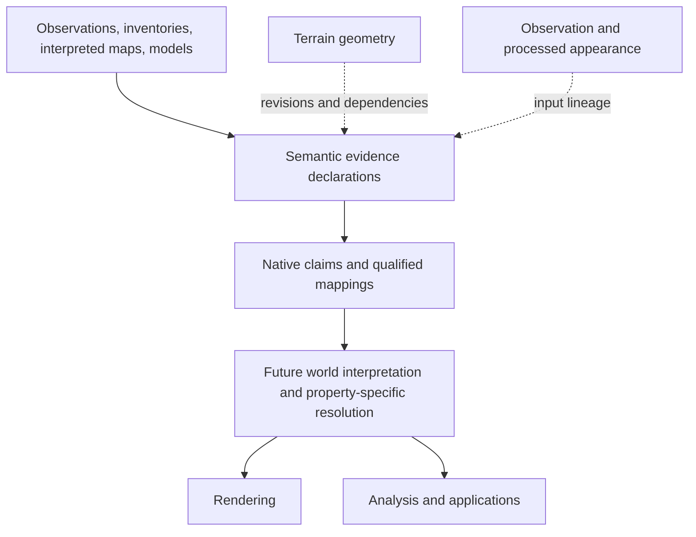

# Atlas Semantic Evidence Contract v1

Status: **FROZEN — `atlas-semantic-evidence/v1`, 2026-10-06**. The foundational
**PHYSICAL-SURFACE SEMANTICS programme is ESTABLISHED / CLOSED**. Frozen means
changes require an explicit evidence-backed reason and a new declaration revision;
it does not mean a complete ontology, resolved world truth or implemented runtime.

Starting state: clean `main` at `052374e07d613a549f5a88640b42932f97a7f896`
(“Test Atlas water feature and state semantics”). `git fetch origin` succeeded;
local/remote divergence was **0/0**. No source acquisition or new benchmark.

## Purpose and evidence basis

Atlas needs qualified semantic claims, not one mutually exclusive land-cover
label. Preserve what a source asserts, native meaning, any qualified common
interpretation, optional feature association, claim-local space/time/reference,
evidence origin, scoped quality, mapping loss, evidence gaps, lineage and rights.
Evidence is retained without automatically becoming the final physical world model.

This contract is justified by three completed records:

- [Domain review](physical-surface-semantics.md), `75ea9d8`: physical cover is not
  land use; categorical and continuous properties, layers and time coexist.
- [Tryfan/Riffelhorn comparison](source-native-semantic-comparison.md), `c4da565`:
  native habitat, broad cover, geology and glacier/debris claims make different
  propositions; geology does not establish current exposure; quality and mapping
  loss cannot be collapsed.
- [Upper-Exe water check](water-feature-state-check.md), `052374e`: feature identity,
  observed detections/history, reference geometry, habitat, scenario and historical
  event records require distinct evidence/time/reference semantics.

These reports and the [source inventory](physical-surface-sources.md) retain the
primary definitions, rights, native observations and limitations. They are not
rewritten. This task establishes **a Meridian architecture contract**, not a new
empirical surface finding or invention of semantic harmonisation.

## Boundary and placement



Semantic evidence is not a land-cover ontology, feature database, temporal database,
GIS format, renderer, classifier, confidence engine, hydrological model or universal
world ontology. Multiple contradictory or complementary claims remain retainable.
A future consumer must reason about property, evidence mode, support, time, grain,
reference condition and quality; this contract does not decide the winner.

Types and focused validators live outside the application in
[`scripts/atlas/semantic-evidence/contract.ts`](../../scripts/atlas/semantic-evidence/contract.ts)
and [validation](../../scripts/atlas/semantic-evidence/validate.ts).
The [isolated TypeScript configuration](../../scripts/atlas/semantic-evidence/tsconfig.json)
checks these declarations. No production component imports them. This follows the
repository's metadata/type-plus-owned-validation pattern without implementing
fetching, adapters, selection, GIS operations or UI.

## Central abstraction and minimal declarations

A **claim** is the central unit: a specified source-native property/value or
explicit evidence gap, over its own support, with qualified time, evidence and
optional conditions. State is a possible subject; observation/classification/model
are evidence modes. A feature or event association is context, not the value of
all other properties at that place.

| Declaration | Required responsibility |
|---|---|
| `SemanticResource` | Existing source/product reference with explicit revision knowledge; domain, definition/receipt, shared rights and upstream resource references. Optional source coverage and publication/processing/retrieval dates remain separate from claim time. No extra semantic-source or product class hierarchy. |
| `SemanticDefinition` | Revisioned property, value or reference-condition definition; vocabulary identity/version, label, retained meaning and definition reference. Property definitions declare allowable value kinds. Optional source-specific mode/condition requirements prevent demonstrated misuse. |
| `SemanticMapping` | Reusable native-to-candidate-target relationship, method, immutable owned revision, explicit loss list and qualification. Not a mapping engine. |
| `SemanticClaim` | Native property/term/fields, typed assertion or evidence gap, source-record reference; optional feature/event association and interpretation. Context fields can override collection defaults. |
| `ClaimCollection` | Exact source product and shared context, claims/templates and optional payload binding. Storage-form declaration is raster/vector/records/time-series; it does not determine world semantics. |
| `SemanticEvidenceBundle` | Versioned contract identifier plus these small registries, so references can be validated together. It is an owned declaration boundary, not a database. |

Properties have stable definition IDs independent of values, rather than one giant
property enum. Values and conditions use the same small definition-reference
mechanism. The only common physical terms here are **test definitions** (vegetation,
mineral exposure, wet heath, wetland), explicitly named `fixture:*`; they are not
Meridian's production physical vocabulary. Source definitions can reference manuals
instead of copying an external ontology. Unknown vocabulary versions remain valid.

### Source-native meaning and values

`native.property`, optional `native.term`, and scalar `native.fields` preserve
property identity, native code/label, original identifiers and relevant attributes.
`SemanticDefinition.vocabulary` records nomenclature/version; its reference retains
exact documentation. Owned definition revision is distinct from upstream vocabulary
version. A native value is not overwritten by a common interpretation. For a
categorical assertion, the validator checks native term and categorical value agree.

`SemanticValue` distinguishes:

- category via a revisioned native term;
- descriptor for native text/geological-unit meaning;
- numeric quantity with units;
- physical fraction with denominator and explicit support;
- probability with event and estimation basis;
- occurrence with observational denominator and period;
- detection with `detected` / `not-detected` and target;
- membership in a source-scoped feature/inventory object;
- composition of native terms, component fractions and original denominator/support.

No `any` or generic numeric confidence. Fractions, probability and occurrence all
use [0,1] but have different discriminants and required meaning. Numeric quality is
separate again. Composition can retain an unknown/illegible component alongside
known components. Its single stated denominator must not exceed one; there is no
sum-to-one constraint across independent claims or vertical layers. NRW percentages
belong to the original mosaic, not every Voronoi cell or arbitrary analysis patch.

Ordinal surface values and an unrestricted recursive value language are deferred:
these cases do not require them. Survey labels such as Fair belong to quality,
not an invented ordinal surface field. Rich original records remain asset-backed;
scalar native fields are a retained excerpt, not a replacement GIS serialization.

### Interpretation and mapping loss

`Interpretation` references a reusable mapping, with disposition **qualified**,
**unresolved** or **rejected**. The target of a mapping is a *candidate concept*;
its presence in a mapping does not itself assert that concept. No interpretation
is required. A native claim remains useful when a target is unsupported.

Relation direction is always **native extension relative to target extension**:

| Relationship | Meaning / permitted disposition |
|---|---|
| compatible | Usable under declared qualification, not an equivalence proof; qualified |
| broader | Native proposition includes cases outside the target; qualified with limitation |
| narrower | Native proposition is a subset of the target; qualified |
| partial | Some meaning overlaps; qualified only with the declared limits |
| ambiguous | Target applicability unresolved; unresolved |
| incompatible | Propositions conflict in type/meaning; rejected |
| unmappable | Source does not support this candidate interpretation; rejected |

Broader and partial mappings do **not** guarantee target membership at every
location. Future consumers must retain this relation/qualification rather than
casting the target into a binary truth. There is no automatic value conversion.
Every mapping has an explicit loss list; `[]` means no identified loss *under the
stated qualification*, not a proof of semantic identity. Method/revision is reusable;
changing it requires a new revision, never silent historical reinterpretation.

Fixtures retain grassland → broader vegetation with native thresholds lost;
GeoCover substrate → exposure rejected; D.5 → wet-heath unresolved; grazing-marsh
→ broader wetland with ecological specificity lost. Tests exercise all seven
relations, including compatible/broader/partial/incompatible, using clearly synthetic
relationship cases rather than falsely claiming additional local discoveries.

## Feature, space, time and reference

`FeatureRef` is the minimum association: source/product namespace with revision,
source-scoped ID and kind feature/inventory-object/event. GLAMOS `B56-07`, WFD
`GB510804505600` and RFO outline `31383` / event group `4124` retain their separate
meanings. Namespace prevents unjustified cross-source identity. An inventory unit
need not be a persistent physical object. Geometry and current state are separate;
no cross-version identity resolver, feature database or event system is introduced.

`ClaimSupport` reuses `SpatialArea` for CRS84 Polygon/MultiPolygon, native rectangles
and asset-backed native feature/cell/mask geometry. Two small extensions provide
native point/line geometry with explicit CRS; no duplicate polygon model. Geometry
assets retain selectors and interpretation. Support meaning and grain describe what
is asserted there: a reference outline, cell assignment, original mosaic or centreline
are not interchangeable. Source coverage belongs to resources; a feature association
does not replace claim support. A query footprint with an evidence gap is not an
asserted whole-area property. Asset-backed references can retain unknown CRS and
unknown geometry detail; representability does not certify geometry or suitability.

`ClaimTime` has observation, survey, event, nominal-epoch or asserted-validity roles.
`TimeExtent` supports instant, interval, nominal epoch with year/month/day/second
precision, and explicit unknown. Basis is mandatory for known time. A year is not
a flight instant; midnight in a historical record is not a measured event second.
Claim context can carry multiple time qualifications. Resource processing,
publication and retrieval dates never automatically become acquisition or validity.
Partially known time uses the actual precision or unknown with retained explanation;
no interpolation of validity between observations.

`ReferenceCondition` references a revisioned definition, scalar native parameters
and qualification. It handles MHW-derived mapping and flood annual-exceedance /
ignored-defence conventions without generic tide or flood-specific fields. Exact
numeric level and sub-model vintage can remain unknown in the qualification. A
condition is neither acquisition time nor observed tide. Scenario claims require
at least one condition; source-specific property requirements pin the relevant
condition, so a planning zone cannot be relabelled as an observed state simply by
removing the scenario mode. The fixture WFD membership likewise retains MHW.

## Evidence, lineage, quality and absence

`EvidenceBasis.modes` is a nonempty set, allowing **observation, detection,
classification, survey-inventory, interpreted-mapping, derived, model, scenario,
event-record**. Mixed origin is represented by multiple explicit modes plus richer
source-native fields/description, not a vague single MIXED label. Mode names have
consequences: detection requires observation-based evidence; derived claims require
inputs/processing; scenario output requires conditions. Inventory and historical
survey/photo-derived records cannot silently become raw observations.

Lineage references source/product resources or other claims with input roles,
complete/partial/unknown contributor knowledge, processing steps and limitations.
This reuses `EntityReference` / `ProcessingStep`, with explicit processing revision knowledge; there is no graph executor.
Processing can retain software/method versions, parameters and records. The
validator resolves immediate declared references, not complete upstream scientific
lineage. Unknown upstream observations are retained honestly. A future Meridian
inference is another resource/derived claim with versioned inputs and method; the
synthetic test demonstrates this shape without performing inference or granting it
higher authority. Geometry/appearance dependencies use ordinary resource references
with explicit roles, not new claims that those resources measured a surface class.

`QualityStatement` requires kind, scope, metric/meaning and source/reference;
a numeric or label value is optional. Kinds distinguish validation, confidence,
probability, survey and unspecified. Scope explicitly states product, class, claim
or spatial population. Product/class validation is not local confidence; the
validator rejects borrowing that scope for confidence. A validation record may
travel with a cell claim while still referring to its product population. Claim
probability is not physical cover fraction, occurrence or global accuracy. Missing
quality is valid; no fabricated default score. RFO31383 retains null quality rather
than receiving a synthetic Fair/Good label.

A `ClaimResult` is either an assertion or a gap. Gaps carry a reason and explanation:
**outside-support, no-observation, not-classified, missing-inventory, unsupported,
unknown, not-applicable**. These preserve the consequential distinctions without
creating an enum for every diagnostic sentence. `unsupported` must explain whether
an inference was not performed or the source ontology cannot support the property.
More detailed reasons remain descriptive. Mapping ambiguity/unmappability belongs
to mapping/disposition, not to the gap enum. It can coexist with a perfectly valid
native assertion.

**Non-detection is an assertion about a detection procedure**, not a gap or proof
that water is physically absent. JRC code 0 is a no-observation gap; code 1 is a
non-detection; code 2 is a detection. No inventory return is missing-inventory,
not physical-feature absence. No full-world negative is inferred. A future explicit
physical-absence claim would need its own justified property/evidence, not a renamed
non-detection. Conditions such as model-not-evaluated can be retained as an
unsupported/unknown explanation if later encountered; no unused enum is frozen here.

## Shared metadata, rights and revisions

Resources reuse `RightsInformation`: licence knowledge, references, attribution
and limitations shared once per source/product, not repeated per pixel. Definition,
record and binding references use `AssetReference` with optional SHA256/selectors.
Root-relative repository paths and documented external receipt selectors follow
existing Atlas metadata convention. Unknown rights is representable, **not permission
to acquire or redistribute**. Full source/contributor terms remain authoritative.
This task only reuses retained text/metadata and creates no new source payload.

`EntityReference` preserves source/product identity and revision knowledge. Owned
claims, definitions, collections and mappings use nonempty ID + revision pairs.
Referenced revision must resolve exactly. Duplicate keys in a bundle are rejected;
changing meaning/content requires a new owned revision. Upstream release, retained
receipt/content hash, ontology version and owned declaration revision are distinct.
A dated retained service name is not by itself a content hash: fixture snippets are
pinned to hashed diagnostic/receipt files and the prior Git checkpoints. Mutable
upstream services remain unpinned where no revision exists, using explicit unknown.

Readonly declarations communicate intended ownership; they do not implement a
write-protected store, JavaScript deep freezing, a version-history auditor or a
content-addressed database. Validation checks consistency of a supplied snapshot,
not undetectable edits to an isolated old snapshot. Git/immutable receipts retain
history; consumer/cache identities must include referenced revisions. New revision
means retain old claims/mappings when historical reproducibility matters.

## Collections and representation viability

`ClaimCollection.context` supplies shared space/time/evidence/conditions/quality.
Each claim can override complete fields; resolution is one shallow field replacement,
not concatenation of inherited temporal periods or conditions. Empty conditions
cannot waive a native property requirement. Context resolution is explicit and
validated on each owned declaration. A later decoder must apply the same rule to
lazy cell/feature/time templates.

| Form | How v1 represents it without runtime infrastructure |
|---|---|
| Categorical raster | One shared product/context, one revisioned class/claim template per relevant native code, asset binding and documented cell-assignment rule. Decoder substitutes native cell support. A million cells do not require a million provenance/rights objects. Only code 30 is needed for the tiny WorldCover fixture; this is not an exhaustive class registry. |
| Vector inventory/mapping | Individual feature claims or shared attribute templates plus native source geometry/ID references. Polygon does not imply persistent physical object. NRW Voronoi support, GeoCover interpreted unit, glacier/debris and WFD reference outlines remain distinct. |
| Repeated dated history | Same JRC product with month-qualified detection templates/binding keys. Each claim's observation bin differs; no new source/product for every timestamp. The time-series declaration is not a query/database implementation. |
| Derived occurrence | P1's retained mean native occurrence 71.883% is a region summary over 77 cell centres, with denominator and1984–2024 history period. Not a pixel, pooled detection statistic, fractional water cover or present probability. Its existing summarisation method/revision is recorded. |
| Model/scenario | Flood Zone property requires scenario evidence and the planning reference condition. Source `Origin` can add model and historical-record modes. Never an observation of current water. |
| Layered/co-located properties | GLAMOS glacier2015 and debris2016 share glacier identity while support/time differ. Habitat composition retains original support. A combined PHI reedbed/saltmarsh polygon can yield two component claims retaining the full native compound record and respective2019/2026 contributor vintages. No common exclusivity constraint. |
| Conflicting evidence | Retain both qualified claims with separate resource/collection revisions and their own native meaning, support/time/quality. Test-only conflicting detection claims demonstrate retention; no resolution or accuracy verdict. |
| Future Meridian derivation | Same resource/claim path, typed value, input references, method revision knowledge and quality if established. Synthetic fraction fixture tests lineage only; it is not a performed classifier or new measured surface claim. |

The optional binding declares asset, assignment and code-to-local-claim references.
It is a metadata strategy, not a raster decoder, standard GIS interchange format
or framework for inherited per-pixel dynamic objects. Actual importers must preserve
native nodata and substitute support/time according to declared rules; preparing a
new representation must record transformations and revision. No normal startup or
CI test needs external geometry/raster payloads or live services.

Composition alone is not a reason to give every component a shared date/lineage.
When component origins differ, preserve the full compound native record and express
separate component claims with distinct contexts, as the PHI fixture demonstrates.
The original compound remains recoverable. Native percentages do not become a new
continuous field. Hidden canopy/ground or wetland-water layering is not invented;
future independently evidenced layer claims use the same nonexclusive mechanism.

## Hard invariants versus descriptive metadata

Hard invariants are limited to consistency and demonstrated misuse risks:

1. Contract version, nonempty owned IDs/revisions, required definitions/text,
   nonempty assets, SHA256 syntax; no duplicate identity/revision keys.
2. Exact source/product, definition, mapping, claim-input and local binding references
   resolve. A collection references a product; a product traces to source/inputs.
3. Native property/term kinds and categorical value agree. Assertion kind is allowed
   by the property definition. Typed fractions/probabilities/occurrences are bounded;
   fractions/compositions retain denominator/support, occurrence retains period.
4. Known dates match precision/calendar and intervals are ordered; unknowns have
   reasons. Claim time is declared even if wholly unknown.
5. Modes are nonempty/unduplicated; detection is observation-based; derived evidence
   has input and processing lineage, including known/unknown method revision.
   Scenario output and source-native condition/mode requirements cannot be omitted.
6. Quality scope/metric/meaning/reference are explicit; a numeric value has units;
   product/class validation cannot silently become local confidence.
7. Gap explanation is nonempty. A gap cannot become a qualified common assertion.
   Mapping disposition follows relation; mapping concerns native property/term.
8. Native point/line coordinates and CRS are explicit; polygons/rectangles reuse
   existing geometry validation. Binding codes are unique in their declared key
   space and reference local templates.

These are owned-record checks. They do not validate arbitrary untrusted JSON,
scientific correctness, topology, complete upstream lineage, actual rights clearance,
feature identity equivalence, every claimed fraction's measurement or world truth.
A future importer will need its own input parsing/adapter validation.

Descriptive or optional metadata includes local quality, available observations,
exact validity/acquisition dates, detailed grain/MMU, feature/event associations,
common interpretation, conditions except where the source meaning requires them,
resource coverage, contribution completeness, processing details and upstream
limitations. Unknown times, information gaps, unknown revisions/rights and absent
quality remain valid. Metadata completeness is not manufactured to pass tests.
There is no universal quality score, preferred source, automatic ranking/fallback,
render policy, hazard/suitability or model-implied confidence.

## Reuse audit and domain relationships

| Type/field group | Decision and reason |
|---|---|
| `Knowledge`, `AssetReference`, `ReferenceSystem`, `EntityReference`, `RightsInformation` | **REUSE EXISTING**, type/helpers at [canonical terrain metadata location](../../src/atlas/terrain/metadata/terrainMetadata.ts). These are already generic in meaning despite their file location. No production refactor/extraction needed. |
| `SpatialArea` and its owned validator | **REUSE EXISTING** for polygons/native rectangles/assets; do not duplicate geometry/CRS rules. |
| `EvidenceGeometry` | **EXTEND EXISTING by composition**, only native point/line additions; no mutation of frozen terrain primitives. |
| `ProcessingStep` | **REUSE / EXTEND BY COMPOSITION**: existing method/software/parameters/record; semantic processing additionally declares revision knowledge. No vertical-transform redesign. |
| Definitions, native values, mapping/loss, claim/result, temporal roles, reference condition, evidence modes, scoped quality, feature/event reference, collection binding | **NEW SEMANTIC-SPECIFIC**: demonstrated meanings have no adequate existing generic record. No new full source/product infrastructure. |
| Terrain temporal support / resolution / height / family/selection policies | **DO NOT REUSE AS SEMANTICS**: terrain epochs or rendered sample spacing cannot substitute for semantic claim time, grain, native nomenclature or scenario conditions. |
| Appearance architecture | **REUSE CONCEPTUAL SEPARATION**, not speculative type reuse: the appearance entities are a proposal, not implemented generic metadata. Keep photographic observations and semantic interpretation independent. |
| Feature database, event engine, ontology catalogue, temporal reasoning, registry persistence, semantic runtime/adapters/UI, ranking, conflict resolver | **DEFER**. None is necessary to freeze an evidence contract. |

**TerrainHierarchy:** semantic evidence may reference the exact terrain resource
revision used for a future normalized height or other derivation. The dependency
role is recorded in lineage; semantics is not attached to TerrainProduct and does
not change geometry selection, eligibility, regional parents or analytical sampling.

**Appearance:** a future classification derived from imagery is a semantic claim
with lineage to its observations/AppearanceProduct. It does not modify RGB or turn
AppearanceProduct into classification. Observation geometry remains separate from
claim support and common interpretation. No imagery/classifier/multiview activity.

**Features and dynamic state:** lightweight namespace/ID associations and time-qualified
claims are enough here. Persistent identity, source inventory geometry, state and
historical event association remain separate. Their future management architectures
are neither frozen nor implemented by this contract.

**Weather:** may eventually receive qualified physical facts; atmosphere is separate.
No automatic cover→albedo/roughness/evapotranspiration mapping, snow physics, tide,
flow or hydrological simulation. These would be separately justified transformations.

**Traverse:** downstream consumer only; no traversability, hazard, walking speed,
route suitability or routing-function fields. No application dependency.

## Tiny fixtures, reproduction and validation

[Typed fixtures](../../scripts/atlas/semantic-evidence/fixtures.ts) use
[small pinned native extracts](../../scripts/atlas/semantic-evidence/empirical-extract.json)
from the retained diagnostics. Source payloads remain in `meridian-data`; no copy,
new acquisition, source reprocessing or benchmark enlargement. Asset selectors are
symbolic receipts/native geometry references, not invented polygon coordinates.

| Empirical fixture | Critical preserved semantics |
|---|---|
| WorldCover 2021 v200 code 30 | Native Grassland, code, PUM/vocabulary reference; optional narrower vegetation interpretation; 76.7% global validation population, never local confidence |
| NRW D.1.1 / mosaic / D.5 | Native Welsh legend; original mosaic `sh66se_293233` with50% B.1.1 +50% E.2.1; survey time unknown locally; D.5 ambiguity |
| GeoCover feature178895 | Serpentinit geological-unit descriptor and native geological attributes; no present exposure asserted |
| GLAMOS SGI2016 r2020 | Gornergletscher `B56-07`, glacier year_acq2015 and debris id3738 year_acq2016; release2020 distinct |
| WFD EXE | Source-scoped `GB510804505600`, classification2019/export2024, MHW reference boundary; no current wet edge |
| JRC v1.5 | March/September2024 codes0/1/2; dated observation bins with exact exposure times unknown; P1 history summary and denominator |
| NE PHI | P5 grazing marsh contributor feedback2024; compound reedbed/saltmarsh retained with2019/2026 contributor vintages; no local fractions/water assertion |
| EA Flood Zone3 | Model/scenario/property qualification, annual river 1%/sea 0.5% category, ignored-defence convention; no local probability/confidence |
| RFO31383 | Event group4124,4–5February2014, sea/overtopping/Survey; null quality, event-associated outline not synchronous wetness |
| Unperformed exposure inference | Query/gap with unsupported explanation; existing RGB/geology is not an exposure classification |

Eleven collections contain reusable templates plus tiny actual native records.
Additional test-only cases cover missing support, incompatible interpretations,
scoped numeric/label quality, future derivation, contradictory assertions, point/line
support, calendar errors and revision misuse. They are clearly synthetic and are not
published as new empirical surface findings. Extracted primsource strings are
checked against the retained record rather than assigned a product-wide epoch.

From repository root, using existing Node/Vite/TypeScript dependencies:

```powershell
node --test scripts/atlas/test_semantic_evidence_contract.mjs
node_modules/.bin/tsc.cmd -p scripts/atlas/semantic-evidence/tsconfig.json
node_modules/.bin/eslint.cmd scripts/atlas/semantic-evidence/*.ts
```

The reproducible declaration receipt is emitted by
`node scripts/atlas/validate_semantic_evidence_contract.mjs`; repeat runs must have
the same fixture JSON/hash output. No timestamp is injected into that receipt.

Tests are offline and asset-free. They check retained summary/receipt hashes,
native extract equality, IDs/references, relationships/loss/disposition, conditional
claims, quality scope, space/time, layered/component claims, non-detection/gaps,
contradictions, shared raster binding, repeated dated claims and future derived
lineage. All113 protected production source hashes from
[information-display-plan.json](information-display-plan.json) are checked. No
production/shared runtime edits, so application build/tests are unnecessary.
[Validation receipt](semantic-evidence-contract-validation.json) retains checked
counts and declaration/evidence hashes. Passing tests is contract consistency,
not empirical classification accuracy or permission to consume a source.

## Physical-surface synthesis and closure

**Established by the programme:** the domain is qualified physical-property
claims, with source-native meaning and optional lossy common interpretation.
Physical cover, use, substrate, feature identity, state, event and reference condition
are different propositions. Independent and layered claims can coexist; categorical,
proportional and observation-history meanings differ. Space/time/quality belong to
claims; provenance/rights and truthful unknowns remain recoverable. The two empirical
stress tests are sufficient to freeze this minimal contract, not a universal ontology.

**Implementation now completed:** unused domain declaration types, focused validation,
tiny fixtures/tests and this architecture foundation. No semantic consumption,
prepared semantic products, map layers, inference, hydrology or automatic resolution.

**Research still non-foundational:** property-specific recoverability of fine/current
mineral exposure and fractions, suitably dated water detection, source harmonisation,
persistent cross-source feature identity and dynamic-state management if later needed.
These do not reopen the closed foundational branch. The LIMITED inference assessment
is unchanged; source agreement is not truth and inventories are not default training
labels. Global semantic coverage and an operational feature/state model remain future
implementation/domain work, not missing prerequisites for this contract.

**Closure decision: YES. No unresolved foundational semantic blocker.**
Elevation and multiscale remain closed; external multiview provisioning remains parked.
No new semantic benchmark or additional foundational experiment is required.

**Recommended next Atlas work, only when separately authorized:** a narrow
semantic-evidence ingestion proof using ONE already-retained product (WorldCover 2021
native-code subset at Tryfan), a lazy shared code binding and exact native meanings /
rights / nodata, validated against v1. Its sole purpose would be to test scalable
adapter consumption without per-pixel metadata, automatic world-truth resolution,
new source data, inference, hydrology or production rendering. This is implementation
validation of an established contract, not another semantic benchmark. Do not start
it here. Selection of the next major Atlas programme remains a separate decision.

Production remains AWS visual terrain through TerrainHierarchy, independent AWS
analytical z15, exaggeration 1.45, current IGOR, MapTiler satellite-v2 and normal
satellite opacity/suppression/projection/lifecycle. Weather and Traverse are unchanged.
No source-native report, geometry, imagery or production implementation changed.
Stop at the frozen contract and programme closure.
