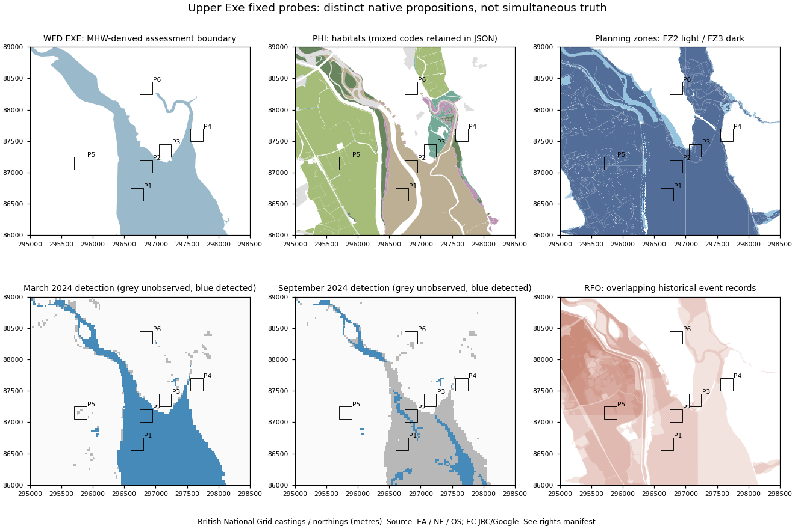

# Atlas water feature / state check

Status: **SUCCESS — empirical stress test complete; no contract or runtime implemented**.
Recorded 2026-10-06. Start: clean `main` at
`c4da56577c27f56ee1a5829e85d8daa951a517c1` (“Compare source-native Atlas surface
semantics”), origin fetched, divergence **0/0**. This is the second/final empirical
check following the [domain review](physical-surface-semantics.md) and
[mountain comparison](source-native-semantic-comparison.md).

**Result:** the hybrid physical-property direction survives. A named/reference
waterbody, habitat, dated water detection, historical inundation record and
reference-conditioned planning zone can overlap without making the same claim.
Feature identity, state, event association and reference conditions need to remain
distinguishable. There is enough empirical evidence to proceed directly to a
**separately authorized minimal semantic evidence contract**. It is not frozen here.
No extra benchmark or inference experiment is needed first.

## Question, scope and classification discipline

Can Atlas truthfully represent water when feature identity, physical extent,
temporary state, reference boundaries and time differ? This tests claims and their
support, not hydrological accuracy, flood safety or rendering quality.

Labels below distinguish **source fact** (published definition/native field),
**measured result** (retained geometry/cell comparison), **Meridian interpretation**
(architectural implication) and **unresolved** (not established by these inputs).
Agreement is agreement between claims, never an independent ground-truth check.
No present water edge, tide, depth or vegetation state is inferred from RGB imagery.

## Candidate screen and freeze order

Three environments were screened through documentation, not local semantic values:

| Candidate | Evidence of suitability | Decision |
|---|---|---|
| Upper Exe / Topsham–Exminster | Exe/Clyst junction, named marsh reserves, managed water context and canal within a compact area; four open source families | Selected: clean contrast between identity/reference, habitat, observation history and scenario/event records |
| Deben / Woodbridge | Official shoreline assessment describes intertidal reclamation and grazing land | Not acquired; no necessary additional proposition |
| Medway estuary | EA documents tidal defences, habitat and estuary management | Not acquired; larger industrial/channel complexity unnecessary |

The anchors come from the [RSPB Bowling Green location](https://www.rspb.org.uk/days-out/reserves/bowling-green-and-goosemoor/location)
and [Exminster location](https://www.rspb.org.uk/days-out/reserves/exminster-and-powderham-marshes/location).
The [reserve description](https://www.rspb.org.uk/days-out/reserves/exminster-and-powderham-marshes)
establishes marsh, canal, river and managed-land context. Alternatives were screened
using the [Deben shoreline assessment](https://environment.data.gov.uk/shoreline-planning/documents/SMP7%2FAppendix%20I-%20Estuaries%20Assessment.PDF)
and [EA Medway strategy](https://www.gov.uk/government/publications/medway-estuary-and-swale-flood-and-coastal-risk-management-strategy/medway-estuary-and-swale-flood-and-coastal-risk-management-strategy).
No data were acquired for either alternative.

Benchmark **`upper-exe-water-semantics-v1`**: EPSG:27700, exact rectangle
**[295000, 86000, 298500, 89000]**, 3.5 × 3 km, **10.5 km²**. Approximate WGS84
centre **50.6779715 N, 3.462694 W**. Native BNG bounds are authoritative; geographic
coordinates are derived context, not a new footprint.

The [plan](water-check-plan.json) was recorded at **11:15:13 UTC**, before any local
semantic geometry/raster acquisition. March and September 2024 were selected before
local values as two fixed half-year-separated months, not chosen flood/tide events.
Pinned plan SHA256:
`04a9deefbf7ae763268ff9d0974624239c5f02b12ec688fd36927f26a94f2415`.
Every retained source receipt follows that freeze. The sole documented
[acquisition addition](water-check-acquisition-note.json) is Recorded Flood Outlines:
flood-zone Origin fields exposed mixed recorded/modelled lineage without event
identity/time, so a fifth product within the EA flood family was added after rights
verification and **before inspecting its local records**. Footprint/probes never moved.

## Frozen probes

Each is a fixed **200 × 200 m square**, 40,000 m². These are geographical
opportunities, not pre-labelled ground truth. The initial names remain even when
native products do not support the expected case; notably P1 is inventoried as
mudflat and P4 contains only small habitat/waterbody intersections.

| ID | Geographic anchor | Centre easting/northing | Exact BNG bounds | Purpose before inspection |
|---|---|---|---|---|
| P1 | Exe channel | 296700 / 86650 | 296600,86550,296800,86750 | Feature versus water-history opportunity |
| P2 | Exe eastern margin | 296850 / 87100 | 296750,87000,296950,87200 | Intertidal/reference-edge opportunity |
| P3 | Bowling Green anchor | 297150 / 87350 | 297050,87250,297250,87450 | Managed wetland/state contrast |
| P4 | Goosemoor / Clyst-side anchor | 297650 / 87600 | 297550,87500,297750,87700 | Junction, habitat and tidal-margin context |
| P5 | Exminster marsh interior | 295800 / 87150 | 295700,87050,295900,87250 | Floodable land versus current detection |
| P6 | Topsham landward bank | 296850 / 88350 | 296750,88250,296950,88450 | Landward absence/support control |

## Sources, rights and native propositions

Five products from four source families were sufficient. Rights were checked before
retrieving each source. The [source receipts](water-check-sources.json) retain exact
URLs, UTC retrievals, hashes, parent listing metadata, CRS/window definitions,
versions and attribution requirements. Raw payloads/documentation are external at
`meridian-data/derived/atlas/water-check-v1`.

| Product / retained identity | Native proposition and evidence mode | Time / reference / quality |
|---|---|---|
| EA WFD Cycle3 classification2019, simplified; EXE `GB510804505600` | Named transitional assessment unit, with a reference polygon; inventory/designation plus classified attributes, not instantaneous surface water | Classification2019, export2024-02-02; catalogue revision2024-03-01/publication2025-06-23/update2026-09-18. Mean High Water / OS OpenMap Local and EA UWWTD boundaries; simplified. Ecological/chemical certainty is not edge confidence |
| NE PHI; all 280 retained features `Sept_26` | Polygon inventory of source-native habitats, possibly multiple main/additional habitats, with UID and primary source description | Local contributor descriptions span 1976–2026 or lack a year. Publication version is not acquisition time. Older catalogue/spatial-metadata dates do not define this service snapshot; no retained per-polygon calibrated probability |
| EC JRC/Google GSW v1.5 | Observation-derived water classification/history and derived occurrence, not a feature inventory or tide model | Occurrence1984–2024; separate monthly2024-03/09. Native raw monthly codes0/1/2. Neither occurrence percentage nor detection is local classification confidence |
| EA Flood Map for Planning, present-day Flood Zones | Planning probability-zone output with modelled, recorded and mixed origins; no current-state assertion | Catalogue revision2026-05-20/update2026-07-06. Reference annual probabilities and defence convention; individual model vintage/level unknown |
| EA Recorded Flood Outlines (RFO), revision2026-09-16 | Verified historical inundation records with outline/group IDs, event interval, evidence source, cause and quality | Local positive-area records1960–2014; guidance6.2 August2025. Survey/aerial-photo boundary evidence, not necessarily a synchronous observation of every point |

The [WFD catalogue](https://www.data.gov.uk/dataset/52fa8958-ea30-46fc-8ecb-f31ea8f89aa6/water-framework-directive-wfd-transitional-and-coastal-water-bodies-cycle-3-classification-20191)
defines transitional/coastal units and their boundary lineage. **Its ID is first a
WFD assessment-unit identity**, not proof that nature has one immutable outline.
Retain that namespace; do not convert status or “Heavily Modified” to a surface material.
Its OGL terms permit this research/extraction with EA2024 and OS2024 credit.

[PHI documentation](https://www.data.gov.uk/dataset/4b6ddab7-6c0f-4407-946e-d6499f19fcde/priority-habitats-inventory-england)
describes priority habitats rather than exhaustive cover.
The [attribute definitions](https://environment.data.gov.uk/api/file/download?fileDataSetId=d30e3fa2-5ca6-4851-b19d-1429ad9d84e0&fileName=Priority_Habitats_Inventory_Attribute_Metadata.pdf)
define MainHabs, AddHabs, PrimSource, Version and UID. Complete notices are retained
in the [spatial metadata](https://environment.data.gov.uk/api/file/download?fileDataSetId=d30e3fa2-5ca6-4851-b19d-1429ad9d84e0&fileName=Priority_Habitats_Inventory_Spatial_Metadata.pdf):
OGL plus contributor CC-BY4 notices (including National Trust and Cumbria sources).
Preserve all relevant NE/OS/contributor notices with any redistributed crop; no raw
subset is placed in Git. The retained service is Sept_26 while catalogue revision
is 2025-10-23 and the spatial document says2025-10-01: **snapshot and stale metadata
are recorded separately**, not silently harmonised.

[GSW access/rights](https://global-surface-water.appspot.com/download) permits
Copernicus reuse with **Source: EC JRC/Google** and Pekel et al.2016,
[DOI10.1038/nature20584](https://doi.org/10.1038/nature20584). The v1.5 guide and
native monthly files are retained. The publisher distinguishes original validation
from later extensions; no original global accuracy is attached to a local2024 cell.
Collection1/2 alignment changes are a possible confound, not diagnosed here.

[Flood-zone metadata](https://www.data.gov.uk/dataset/104434b0-5263-4c90-9b1e-e43b1d57c750/flood-map-for-planning-flood-zones1)
and [product description](https://environment.data.gov.uk/api/file/download?fileDataSetId=455d2eb3-3065-4d20-871b-c4d5dee23f67&fileName=Flood%20Zones%20Product%20Description.pdf)
establish the planning purpose. FZ3 corresponds to ≥1% annual river or ≥0.5% annual
sea probability; FZ2 to0.1–1% river or0.1–0.5% sea, including accepted recorded
outlines. Benefits of defences are ignored. FZ1 is not an explicit polygon here;
absence must be read within documented coverage/limitations, never “cannot flood”.
Origin retains modelled/recorded/direct-rainfall combinations. EA2025/OGL applies.

[RFO catalogue](https://www.data.gov.uk/dataset/16e32c53-35a6-4d54-a111-ca09031eaaaf/recorded-flood-outlines1)
and [guidance6.2](https://environment.data.gov.uk/file-management-open/data-sets/ed73f2e8-a3c2-44db-952d-6e359c7c3987/files/Guidance_Recorded_Flood_Outline_v6_2.pdf)
provide event identifiers/time and boundary-source fields. Missing outlines do not
mean no past flood; historical infrastructure can differ from today. Missing quality
is unknown; records with a published2050 date sentinel require unknown-time handling.
No such sentinel occurs in this retained positive-area set. OGL/EA2025 applies.

## Acquisition, spatial support and scale

**9,892,590 source/document bytes** in the receipt entries; **9,923,141 bytes** total
retained directory including receipts/window sidecars. Native raster windows total
22,624 cells per layer (**202 × 112**, three layers), lossless integer re-encoding.
No national vector archive or full10° raster was downloaded. Range-read compressed
blocks can exceed the crop; wire-byte total and complete parent SHA256 are unknown,
explicitly. Parent object listing hashes/size/modification and local crop SHA256 are
retained. Intersecting API features retain complete geometry beyond the window;
this unavoidable excess is removed only for comparison.

API completeness: WFD2/2 features (one positive-area intersection), PHI280/280,
Flood Zones546/546 (542 exact intersections, **492 positive-area**), RFO25/25
(**23 positive-area**). Bounding-box false positives/boundary-only contacts are
excluded by exact intersections, not reclassified as absent features. No geometry
repair was necessary.

Vectors remain native EPSG27700. Native JRC cell centres are transformed into BNG
with `always_xy`; operation6 OSGB36/WGS84 counterpart has declared2m accuracy.
No grid download, raster reprojection, interpolation or common analysis raster.
Cell-centre counts are not exact fractional area; mixed/boundary cells remain a
limitation. Area calculations use clipped native polygon unions to avoid counting
overlapping historical outlines twice.

Nominal Landsat observation sampling is30m. The retained geographic delivery grid
is **0.00025°** in both axes, approximately **17.67 × 27.81 m** at this centre.
These unequal delivery dimensions do not improve source information or semantic
accuracy. Raster grid, observations, habitat grain and generalised vector edge are
different quantities. PHI uses a mixed survey/inventory spatial framework; no
universal local MMU or survey precision is established. WFD web geometry is
simplified, with no retained tolerance. Flood/RFO native polygons do not establish
one universal physical edge resolution or per-property accuracy. Do not interpret
sub-grain mismatch as a measured positional error.

## Native results and cross-source comparison

The [offline diagnostic](water-check-results.json) retains native IDs/values,
per-probe lineage, event records, area summaries and a small crosswalk. Numerical
precision supports deterministic reproduction, not equivalent physical accuracy.

| Probe | WFD membership | Native PHI positive-area claim | Flood-zone support | JRC March / September2024 | Historical records |
|---|---|---|---|---|---|
| P1 | EXE100% | Mudflats100% | FZ3 100% | 77/77 detected in March; September76 unobserved,1 non-detected |1960/1979 outline support100% |
| P2 | EXE100% | Mudflats69.83% | FZ3 100% |77/77 detected in March; September13 detected,64 unobserved |1960/1979 support100% |
| P3 | None intersecting | Lowland fens55.73% | FZ3 88.07%, FZ2 3.76% |84 non-detected in each month |1979/1980/2014 records, union73.36% |
| P4 | EXE3.20% | Saltmarsh1.96%, combined reedbeds/saltmarsh1.93%, mudflat0.28% | FZ3 7.73%, FZ2 0.32% |88 non-detected in each month |1965/1979/1980 union3.71% |
| P5 | None intersecting | Grazing marsh99.78% | FZ3 100% |March72 non-detected,9 unobserved; September81 non-detected |1960/1979/1992 records, union100% |
| P6 | None intersecting | No returned habitat claim | No positive-area zone |March84 non-detected; September80 non-detected,4 unobserved |No intersecting record |

P3's exact intersecting event IDs are16562,31383,4085932; no1960s record is
assigned to that probe. P5 IDs559,16562,17337,26483,4094967 preserve overlapping
outlines/intervals rather than becoming one historical event. P6 is a control for
missing inventory support, not proof of no wetland, no flood or permanent dryness.

**Measured results:** within10.5km² the EXE reference unit covers2.678km², flood-zone
union6.938km² (FZ3 6.435; FZ2 0.503). PHI includes1.812km² mudflat and2.818km² grazing
marsh. Native combined `Reedbeds,Coastal saltmarsh` covers0.133km². Splitting a
comma-separated habitat list for predicate membership does not replace that native
combined claim or invent fractions. Including those combined records, saltmarsh
membership union is0.320km² and reedbeds0.407km².

Mudflat support overlaps the MHW-derived EXE unit on1.804km². Thus “inside named
waterbody boundary” is demonstrably compatible with “intertidal mudflat habitat”;
it cannot mean submerged at every moment. Grazing marsh has0km² EXE membership
but2.815km² flood-zone overlap. Wetland-related inventory, mapped feature boundary
and planning scenario therefore have independently meaningful support.

Across the benchmark, **21,379 native raster centres** occur inside the rectangle:
March has4,271 detected,16,754 non-detected,354 unobserved; September816 detected,
17,191 non-detected,3,372 unobserved. Both months have observations at17,706 centres;
**231** change from detected to non-detected, **0** reverse. At3,673 centres at least
one month lacks observations. Never compare the raw detection totals as a drying
rate or tidal-cycle measurement. At observed cells, changes can reflect real extent,
tide, acquisition timing, classification or residual alignment; cause is unresolved.
Long-term occurrence spans1–99% on4,489 centres and0 on16,890; no255 or100 occurs
inside this window. Lack of100% cells does not abolish the estuary's identity or
prove no permanently wetted channel exists.

The grazing-marsh union contains5,751 centres: March14 detected/5,697 non-detected/
40 unobserved, September6 detected/5,744 non-detected/1 unobserved. Eight are detected
in March and non-detected in September with observations in both. The saltmarsh
union contains669 centres: March46 detected/581 non-detected/42 unobserved;
September2/659/8. **Neither habitat is a binary open-water state.** The mudflat
union has3,684 centres, of which3492 are March detections; September has2911
unobserved. No exact low/high tide is established from these statistics.
No annual seasonality product was retained: the two monthly records and occurrence
are insufficient to classify a location as seasonal rather than episodic/tidal or
permanently wetted. Occurrence is not duration of continuous immersion.

**Source facts:** PHI native primary-source descriptions include EA saltmarsh
2009/2019/2026, lowland wet-grassland inventory1976, adviser feedback2018/2024/2025,
BogBASE/FenBASE without a local year and EA/OS mudflat sources2002. These describe
lineage vintages, not necessarily local sensor acquisition dates. P4's combined
claims explicitly retain different source years for RBEDS and SALTM at the same
polygon. Time must attach to individual claims/components, not globally to a place.
No semantic disagreement here can be assigned to actual change from these vintages
alone.

The23 positive-area RFO outlines belong to **11 event groups**, with native
intervals spanning1960–2014. They include survey and aerial-photography boundary
sources; quality is Good5, Fair3, unspecified15. An outline quality flag applies to
that recorded outline, not current water pixels. For example **31383 / group4124**
records a sea-flood interval **2014-02-04 to2014-02-05**, source **Survey**, cause
**overtopping of defences**, local quality unspecified; it intersects P3. Records559
and16562 cite aerial photography for1960 and1979 intervals. No aerial photographs
were acquired. A recorded event may describe a reconstructed maximum footprint
rather than one simultaneous wetted outline at all locations.

## Reference conditions, tide, wetland, connectivity and artificial context

**Meridian interpretation:** a reference condition is necessary, not replaceable
by a publication timestamp. The WFD polygon is tied to a documented MHW-derived
mapping convention. Its geometry does not give a numerical tide, local datum,
instantaneous level or the observation time of every segment. Flood-zone probability
and ignored-defence convention are another kind of reference condition. Both may
also carry version/time; reference condition and time are complementary.

No tide is reconstructed, no current tide calculated, and no numeric water level
acquired. JRC monthly cells have month support, not exact acquisition timestamps or
tide metadata. Consequently the actual observation waterline and datum alignment
remain **unknown**. MHW membership overlapping mudflat is expected semantically;
no reference/observed edge is declared a positional error.

[UK BAP grazing-marsh definition](https://data.jncc.gov.uk/data/82b0af67-d19a-4a89-b987-9dba73be1272/UKBAP-BAPHabitats-07-CoastFloodGrazingMarsh.pdf)
describes periodically inundated pasture/meadow and water-maintaining ditches, not
uniform standing water. [JNCC saltmarsh description](https://mhc.jncc.gov.uk/biotopes/jnccmncr00001526)
and [intertidal flats](https://sac.jncc.gov.uk/habitat/H1140/) distinguish vegetation,
sediment and tidal immersion/exposure. These references clarify native habitat
meaning; they do not establish present saturation, salinity or bed material at each
retained cell. Wetland here is a combination of habitat/cover and hydrological
relationships, with current water state independent. No universal wetland ontology
is inferred from this one case.

Connectivity is only partially represented: WFD retains the EXE unit and named
operational/management catchments; the freeze's Exe/Clyst junction has documented
geographical context. **No connected link/node graph, measured flow direction or
hydraulic connection through a gate was acquired.** Polygon contact and catchment
membership cannot substitute for topology or discharge. This is a documented scope
limit, not a reason to add a fifth source family.

Artificial context is supported by the reserve's canal/managed-land documentation
and RFO31383's overtopping-of-defences cause. Their existence/function is distinct
from a complete physical structure inventory. Exact gate, wall, canal-bed geometry,
materials and operational condition are unclassified; no infrastructure geometry
or operating model is created. Flood Zones ignoring defence benefits and a
historical record of overtopping are complementary propositions, not contradictory
states of the defence today.

## Common concepts, mapping relationships and loss

The small test vocabulary contains **named/reference feature membership**,
**dated water detection**, **historical occurrence**, **intertidal habitat**,
**wetland-related habitat/vegetation property**, **event-associated inundation
record**, and **reference-conditioned probability-zone claim**. These are research
projections alongside native values, not frozen entities or mutually exclusive
classes. Generic “water-related” is useful only as a retrieval grouping.

| Native claim → common interpretation | Relationship | Retained loss/limit |
|---|---|---|
| EXE ID → named assessment-unit membership | Compatible | WFD namespace/segmentation, modification/status meaning and reference boundary must survive; not an immutable natural outline |
| MHW-derived polygon → reference boundary | Compatible | Native mapping/reference and simplification remain; numeric datum/local survey date unknown |
| Monthly code2 → dated water detection | Compatible | Keep native cell/month/classifier basis; not continuous whole-month inundation |
| Occurrence percentage → historical occurrence | Compatible | Keep numerical history/period/observation conditioning; binary water loses frequency |
| Saltmarsh or reedbed → wetland-related property | Native narrower than common concept | Saline/intertidal or vegetation/ecological detail and co-membership lost by the broad label |
| Grazing marsh → broad wetland property | Partial | Managed meadow/pasture and ditches do not assert water or saturation over every point |
| Mudflat → intertidal habitat | Compatible | Sediment/ecological native specificity lost if only “intertidal” remains; present state unknown |
| FZ2/FZ3 → probability/reference-zone claim | Compatible | Native AEP/source/defence conditions and mixed origins mandatory |
| RFO ID/group → historical inundation record | Compatible | Event interval, source, cause and outline quality mandatory; not current state |
| Combined RBEDS/SALTM → one dominant class | Ambiguous | No dominant class or proportional allocation supplied |
| WFD/PHI/FZ → water present now | Incompatible | Inventory, habitat and scenario cannot become an observation |
| Monthly0 → physical absence | Unmappable | No observations; state unknown |
| Generic water-related → any specific property | Broader common grouping, not a replacement | Erases the proposition distinctions required above |

“Narrower” always states the direction here: the **native** habitat concept is more
specific than the common property. A common current-water interpretation cannot
be expanded back to that habitat. No exact equivalence between a WFD polygon and
a raster water state is claimed. Spatial partial overlap is separate from semantic
partial mapping. The [crosswalk in diagnostics](water-check-results.json) stores
relationship and loss explicitly; no colouring or numeric blending reconciles claims.

## Layering, unknown and absence

**Measured/interpretive distinction:** habitat support coexists with dated
water-detection and historical inundation support. Native combined reedbeds/saltmarsh
also defeats an exclusive surface label. This supports vegetation/intertidal ground
plus potentially overlying water as independent claims. It does **not** prove exact
submerged substrate, hidden canopy layers, synchronous water depth or local material
fractions. RFO over grazing marsh at another date is historical layering context,
not evidence that the2026 habitat existed unchanged in1960.

Required distinctions now have concrete examples:

- **No observation:** monthly0, including76/77 P1 September centres.
- **Water not detected:** monthly1; retain classification/mixed-cell limits and month.
- **No matching inventory feature:** P6 has no PHI/RFO support; not proof of no habitat
  or no historical flood. WFD no membership is absence of that unit claim.
- **No explicit mapped zone:** P6; not physical dryness, immunity or a “not evaluated”
  assertion. FZ1 convention is applicable only within the source's covered context.
- **Missing property/quality:** no depth/instantaneous level; unspecified RFO quality;
  PHI publication is not acquisition. Null does not become zero confidence.
- **Unknown reference or temporal alignment:** numeric local tidal datum and precise
  observation times absent; interpretation cannot supply them.
- **Not applicable:** flood AEP is not applicable to a monthly detection's quality;
  WFD chemical certainty is not water-edge confidence.
- **Outside support / no-data:** conceptually distinct from the above; no JRC255 is
  encountered locally. Outside-window data is intentionally not compared.
- **Model not evaluated:** distinguish from model-negative where a source exposes it;
  this selected planning product does not provide a per-cell evaluated flag.
- **Not classified / inference not performed:** available imagery is not an Atlas
  water-state classification. No new classification fills a source's semantic gap.

There is no need to freeze enum names here. These reasons must remain recoverable.

## Existing Atlas evidence, inference and domain boundaries

Current Atlas has AWS visual terrain through TerrainHierarchy, independent AWS z15
analytical elevation, MapTiler satellite-v2 and OpenFreeMap basemap context at this
site. These are existing source/observation availability, not a fresh retained
acquisition or current water-state truth. No experimental regional imagery or DTM
was activated here. `mapLayerAnchors.ts` and `terrainLayers.ts` place cartographic
water/waterway context above relief; a painted polygon is not an owned semantic
waterbody/state record. RGB appearance is not classified in this task. Terrain
heights do not establish water depth or datum-consistent water-surface elevation.

**Unresolved physical facts:** instantaneous wetted edge, local tide/level/depth,
flow/velocity/discharge, salinity, underwater substrate, current wetland saturation,
exact inundation timing and current gate/defence state remain unknown. Source
provenance supplies no licence to invent them. A feature inventory does not resolve
these gaps, and model/reference zones do not fill observation gaps.

**Meridian inference remains LIMITED.** A future time-qualified water-detection
claim might be useful where suitably dated observations and water-level/tide context
are available. Existing MapTiler imagery has insufficient local time/observation
semantics for an instantaneous claim; visual resemblance is no substitute. No
classifier, NDVI, segmentation, current edge extraction or observation acquisition
is justified now. Fine/current exposure/fraction gaps from the mountain comparison
remain, without a broadened inference programme.

**Atlas / hydrology boundary — Meridian interpretation:** Atlas may retain
waterbody/infrastructure identity claims, reference outlines, habitat properties,
dated water detections and externally supplied inundation evidence, each with its
origin and qualifications. A dedicated future hydrological/hydraulic domain would
own flow routing, discharge, catchment processes, levels/velocity prediction and
flood simulation. A sourced network can be referenced as topology without turning
Atlas into a flow model; no topology is constructed here. Rendering/application use
must not silently promote a scenario to physical state.

**Weather boundary:** atmosphere can influence water and surface state. Waterbody
identity, flood state, wetland property and river topology do not belong inside
Weather merely for that reason. Future interfaces may exchange time-qualified
state/evidence with weather or hydrology; no atmospheric parameters, roughness,
albedo, evapotranspiration or snow physics are assigned. Traverse/hazard/routing
usefulness is outside this experiment.

## Architecture findings and shared evidence requirements

**Feature identity versus state: required.** EXE's named WFD identity spans a
reference unit with heterogeneous/history-dependent detections; native RFO names
refer to the same estuary context across events. Identity is scoped to the source,
not proof of immutable geometry or cross-version correspondence. A future physical
feature reference may associate claims, while each claim still owns support/time.

**Event versus state: required.** RFO groups associate footprint/time/cause with a
historical flood; monthly detection asserts no cause or event membership. A surface
state cannot become “flood event” solely because it is wet. Event-associated maximum
footprints and instantaneous extents need not be identical. No event system is built.

**Reference condition: required.** MHW-derived mapping and a present-day
annual-probability/ignored-defence zone need qualifications other than acquisition
time. A reference descriptor cannot be substituted for an observed level. Exact
missing numerical conditions remain unknown, rather than fabricated defaults.

**Evidence modes must be distinguishable:** source observations; classification
from observations; inventory/survey/designation; derived historical properties;
model/scenario output; and mixed lineage. RFO survey/photo inputs are not raw aerial
observations. Flood-zone `Origin` demonstrates that one product can combine modes;
forcing a single product-wide evidence mode loses information. Likewise PHI combined
habitats can carry separate contributor vintages. Do not freeze a universal mode enum.

**Property-scoped fallback remains conditionally viable**, with tighter conditions:
the proposition, evidence mode, temporal support, reference convention, spatial
support/grain and mapping relationship must be compatible. A global detection
history can fill an equivalent detection-history gap, with provenance/time change
explicit. It cannot fill missing regional feature identity or current state using
wetland/flood/reference polygons. A valid no-observation value is not an invitation
to silently select an incompatible wet/dry value. This is not automatic source ranking.

Across [mountain](source-native-semantic-comparison.md) and water evidence, the
smallest demonstrated requirements for the **later** contract are:

1. Claim/property and optional feature reference, retaining source-native identity,
   ontology/value/unit and interpretation scope.
2. Common interpretation only alongside native meaning, directional mapping
   relationship and explicit loss/ambiguity; no mandatory universal class.
3. Evidence mode and observation/survey/processing/model lineage, allowing mixed
   contributors and component-specific provenance.
4. Spatial support/representation and grain/MMU qualification; feature geometry,
   raster detection, centreline and model domain must not be interchangeable.
5. Claim-local observation/event/survey intervals, product version/publication and
   their uncertainty; explicit reference condition where relevant.
6. Quality semantics scoped to the actual statement: product validation, class
   certainty, outline quality and local probability are different.
7. Unknown/absence reason and whether a property is unobserved, unsupported,
   unclassified, not applicable or not evaluated; physical absence needs its own evidence.
8. Rights/attribution, source/version receipts and transformation lineage.

These are **empirical requirements, not frozen entities, fields or schemas**. The
water case adds optional feature/event association, reference conditions and
mixed evidence origin to the mountain requirements. It does not require a giant
Atlas object, water runtime, hydrological model or attachment of semantics to
TerrainProduct/AppearanceProduct.

Architectural generalisation, not new empirical proof: source-scoped identity plus
state may transfer to glacier, forest and building claims; reference conditions may
apply to other survey/model domains; event association may apply to disturbance.
Water demonstrated those distinctions. It did not validate every domain/object model.

## Result and decision gates

**SUCCESS**: real, independently meaningful claims and their limits materially
validate the hybrid direction and complete the empirical requirements for a minimal
evidence contract. Success is not an accuracy certification, complete hydrology,
instantaneous water map or proof that all sources reconcile.

| Gate | Answer and evidence |
|---|---|
|1 Hybrid physical-property model survives? | Yes: habitat, named/reference feature, history and scenario coexist |
|2 Feature identity distinct from state? | Yes: EXE identity/reference membership versus dated detections; native namespace retained |
|3 Reference/cartographic boundary distinct from observed extent? | Yes: MHW-derived unit versus monthly cells, with tide/time unknown |
|4 Temporary inundation distinct from persistent feature? | Yes: event IDs/dates/causes versus waterbody identity; not permanent water everywhere |
|5 Wetland distinct from open-water state? | Yes: P5 grazing marsh and P3 fens have2024 non-detections; no current saturation inference |
|6 Evidence modes distinguishable? | Yes: PHI inventory, GSW classification/history, RFO survey/photo record, mixed Flood Origin |
|7 Time belongs to each claim? | Yes: PHI combined contributor years, separate detection months and historical event intervals |
|8 Reference condition needed? | Yes: MHW convention and flood AEP/defence conditions cannot be timestamps |
|9 Unknown/absence first-class? | Yes: monthly0 versus1; missing inventory, quality and reference details differ |
|10 Property-scoped fallback viable? | Conditionally: same proposition/mode/time/reference/support only; no universal water fallback |
|11 Inference assessment changes? | No: LIMITED, possibly dated detection with adequate observations; no implementation justified |
|12 Atlas/hydrology boundary? | Retain physical/evidential claims versus simulate flow/hydraulics/processes in an independent future domain |
|13 Enough evidence for minimal contract? | **Yes. Proceed directly in a separate task; no remaining empirical blocker.** |

Exact next task: **Define and freeze the minimal Atlas semantic evidence contract
from the mountain and water empirical requirements, preserving native claims,
claim-local support/time, reference conditions, evidence modes and loss/unknowns.**
Do not begin it here; no additional benchmark or classifier is recommended first.

## Reproduction and validation

Code is research-only under `scripts/atlas`; ordinary startup/CI has no dependency on
external data or live services. Use the retained research environment/packages in
[receipts](water-check-sources.json) or the existing
[research requirements](../../scripts/atlas/semantic-research-requirements.txt).
No new dependency or shared runtime is added. Commands run from the repository root:

```powershell
$waterPython = 'C:/Users/gbsam/Documents/Projects/meridian-data/earth-lab/.venv/Scripts/python.exe'
$waterData = 'C:/Users/gbsam/Documents/Projects/meridian-data/derived/atlas/water-check-v1'
# Network acquisition is an explicit research action; existing pinned files are verified/reused.
& $waterPython -u -X utf8 scripts/atlas/water_sources.py --data $waterData
# Offline deterministic comparison and plot, requiring retained sources only.
& $waterPython -u -X utf8 scripts/atlas/water_compare.py --data $waterData --out docs/atlas/water-check-results.json
& $waterPython -X utf8 scripts/atlas/plot_water_compare.py --data $waterData --out docs/atlas/water-check-map.png
# Synthetic asset-independent checks; no network.
& $waterPython -X utf8 -m unittest discover -s scripts/atlas -p test_water_compare.py
```

Reacquisition from mutable APIs is not assumed byte-identical: retained source
hashes are the snapshot identity. The acquisition tool rejects a mismatch against
the pinned receipt manifest. Native JRC parent/window metadata is external; local
crop hashes are pinned. The enriched Git receipt manifest adds documented rights,
versions/environment to the acquisition receipt; offline results are deterministic
from plan and pinned native sources.

Validation: **16 synthetic tests passed**, exact repeat diagnostic and plot hashes,
**158 local Markdown references checked**; freeze/hash/order checks; complete feature counts; explicit native CRS;
no invalid geometries; exact-area versus bbox/point-contact checks; native raster
grid alignment; code0/1/2 handling; bounded occurrence codes; event intervals and
unknown 2050 sentinel handling; synthetic union/grouping/CRS tests; deterministic
repeat diagnostics and plot; source/licence/definition/time/reference review;
Markdown reference checks and final diff inspection. One narrow parser correction
trimmed whitespace in combined habitat codes, preserving both memberships and raw
values. The synthetic inverse-CRS test uses a2mm numerical round-trip tolerance,
separate from the transform's declared2m geodetic accuracy.

All113 protected production hashes from the information-display baseline remain
identical. No `src`, runtime, package, application tests/configuration or production
asset changed. AWS visual terrain, independent analytical AWS z15, exaggeration1.45,
IGOR, MapTiler satellite-v2/opacity/satellite suppression, Weather, Traverse and map
lifecycle/reliability remain unchanged. No imagery/DEM acquisition, correction,
classifier, water/semantic/hydrology runtime or new layer. Multiscale/elevation
remain closed; multiview remains parked. No meridian-private inspection.



The compact diagnostic was visually checked. Grey means unobserved only in monthly
panels; blank inventory space does not imply physical absence. PHI colours are beige for mudflats, pale green for grazing marsh, purple for
saltmarsh, dark green for reedbeds, teal for fens and grey for other native habitats.
PHI plotting uses a native first-code display key solely for spatial orientation; mixed claims and their
full native lists remain in the data/JSON, not reduced to the drawing's colour.
