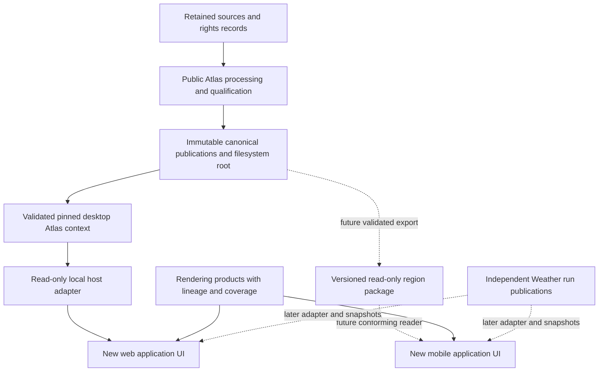
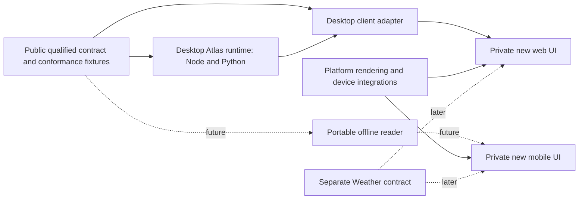

# Meridian architecture reconciliation

Reviewed 9 October 2026, against the unchanged [accepted prototype architecture](../research/meridian-prototype-architecture.md) at `68756976467aeef4bc647bc2b5fe11cae5bfd904`. This document explicitly supersedes selected **planning recommendations**, not accepted scientific findings or executable contracts.

## Reconciliation register

| Previous proposition / question | Classification | Current conclusion and reason |
|---|---|---|
| 1. Riffelhorn is the first terrain-first pilot | RETAIN | Best provisional pilot: retained high-quality Swiss terrain and qualified evidence, compact reproducible support. The actual rendered product/edge coverage remains subject to feasibility; retain Tryfan/Exe as later validation cases |
| 2. Read-only local Atlas adapter in a long-lived application host | RETAIN | Appropriate desktop development boundary: no browser canonical filesystem access, no per-gesture full open, no standalone service required. Confirm private host during authorised audit; not a universal mobile dependency |
| 3. Proposed browser-safe contract covers application needs | REVISE | Preserve identity/qualification/pin fields, but add explicit coverage/capabilities, offline package/read-version identity and unavailable/indeterminate states. Define portable wire semantics and conformance; browser DTO alone does not implement device retrieval |
| 4. Public Atlas/private application boundary and versioned packages | RETAIN | Scientific authority and reusable contracts remain separate from application UI/composition. Extraction/licence/distribution terms and existing research imports need review; public visibility is not an open-source grant |
| 5. Immediate private audit then migration stages | REVISE | First resolve bounded mobile terrain/offline feasibility. Then separately authorised private audit, interaction research and clean foundation. Retain incremental vertical slices and the old audit checklist, not automatic restructuring |
| 6. Existing frontend KEEP/ADAPT implies component migration | SUPERSEDE | New UI is established direction. Old React hierarchy/layout/styles are reference only; individually proven algorithms/utilities can be reviewed. Old technical audit remains historical evidence, not permission to migrate UI wholesale |
| 7. Weather follows the first Atlas milestone | RETAIN | Correct scope/risk separation. Include a clear later milestone, independent forecast clock and offline forecast ageing; no shared scientific transaction |
| 8. Desktop architecture is sufficiently platform-independent | REVISE | Data semantics are portable, current Node/Python execution is not. Add future read-only export/reader boundary; keep desktop validation/publication as authority. Offline mobile cannot depend on reaching a workstation |
| 9. Node/React/browser implementation is the permanent platform choice | DEFER PENDING FEASIBILITY | Keep current working runtime and web rendering reference. No final UI framework or mobile renderer is chosen. React Native, native UI and GL JS shell paths need device evidence; shared C++/Rust core is not mandatory |
| 10. Existing layout can shape the new product | SUPERSEDE | Design from field/desktop/accessibility tasks. Interaction research precedes substantial UI. Framework selection should serve the design, not dictate inherited screens |

Decision references: F01–F16 in the [register](decisions.md). The old report remains byte-for-byte unchanged. Its chosen private audit was not begun; this foundations task reorders the next investigation. No private access, migration, package extraction or application implementation occurs here.

## Revised system boundary

Dashed paths are proposed and unimplemented. Atlas publications, Weather runs and render packages have different identities and validation responsibilities. An application context can pin a tuple of them without pretending they share a physical epoch or one scientific transaction. Rendering inputs must declare compatibility with the selected evidence view; they do not become its authority.

## Package/interface direction

These are responsibility boundaries, not committed package names or permission to create six packages. Start with the minimum installable boundaries supported by the audit. Version a wire/data contract independently of TypeScript implementation. Prefer a narrow local workspace during development and versioned dependencies once rights/build contracts are resolved; do not clone the public application into the private one.

## Minimum portable view contract

Retain stable publication, evidence, revision, source, prepared artefact, derived result, method/parameter and dependency identities. A view declares selected publication, support with CRS, available families, query capabilities, package/reader version if applicable, completeness and unsupported/unavailable states. Results preserve native representation/classification, direct/derived/administrative kind, separate temporal dimensions, uncertainty, rights and provenance references. Detail inspection resolves those references locally where the package promises offline availability.

No arbitrary SQL, raw SQLite rows, filesystem paths or speculative scientific inference belongs in the UI contract. Exact point/area/feature/time predicates must declare supported reference systems and unknown-time behaviour. Unsupported capability is not an empty match. Device adapters must compare results against accepted canonical fixtures; hash agreement alone does not prove query semantics. Preserve full validation as the desktop default, and design export verification separately rather than claiming a phone already performs identical desktop validation.

## Pilot and rendering reconciliation

Riffelhorn remains preferred over Tryfan for the first compact terrain demonstration and over Exe for terrain-first visual exploration. Its 4 km² qualified evidence support is not the 100 km² rendering research extent. Native DTM and global DSM reference systems, source dates and prepared support remain separate.

The old plan's initial AWS visual context remains a possible **labelled desktop reference**, not the default eventual offline/mobile product. A feasibility study can use already retained pure-Swiss tiles within their complete-tile support. It must not revive the rejected Swiss/AWS join, claim complete low-zoom basemap coverage, invent missing imagery, or imply visual sampling is authoritative height retrieval. Reader/encoding/edge tests decide whether that path serves the first prototype honestly.

## What remains deferred

Private application structure, reusable private utilities, build host, secrets, CI and deployment are unknown. Do not assume the public hierarchy exists privately. Mobile device/build availability, native terrain parity, package reader/format and actual offline performance remain unresolved. Commercial and redistribution rights, final brand and provider choice require their own gates. These bounded uncertainties do not invalidate accepted Atlas readiness or require more geographical evidence before a prototype.

## Documentation precedence

**F34**, amended 9 October 2026: resolve authority by subject, not simply by newest date.

1. Frozen scientific contracts, canonical evidence, exact publications and accepted positive/negative research results retain their scientific authority. Source code remains evidence of what is actually implemented; a plan cannot declare an absent capability implemented.
2. For future engineering/product/platform decisions, the current Foundations documents and decision register supersede incompatible experimental-frontend and earlier prototype recommendations. This amendment's F31–F34, revised F22/F26 and product monetisation wording govern the relevant lifecycle, exposure and evolution questions.
3. The unchanged [prototype architecture report](../research/meridian-prototype-architecture.md) and older architecture/product entries remain valuable historical evidence with checkpoint-specific recommendations. Read them through this reconciliation. A historical next-task statement is not the current task authority.

In particular, the **new application UI must be designed from scratch**. The old React component hierarchy, workspace layout, styling and interaction design are references, not migration requirements. Evaluate individual technical utilities on their own merits. **MapLibre GL JS is the existing experimental web renderer**, not a final cross-platform engine selection; mobile framework/native terrain capabilities remain unresolved. Offline correctness and qualified Atlas semantics are mandatory, with supported capabilities honestly bounded rather than claimed complete.

The old immediate-private-audit sequence is superseded by the bounded feasibility study in the [summary](summary.md). Private access still requires explicit authorisation. The eight-stage lifecycle refines product maturity without withdrawing accepted prototype readiness: that result permits a bounded internal integration, not external tester invitations or public exposure. F32 adds a separate operational gate; F33 allows evidence-led implementation evolution without weakening canonical/publication authority. No historical conclusion is rewritten to pretend it was never proposed.
