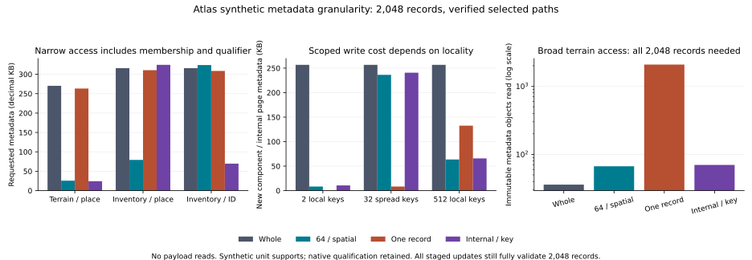

# Atlas retained component granularity and selective metadata-read scaling experiment

## 1. Executive result

**C - EXPERIMENT RESOLVED.** Moderate partitions and authenticated internal lookup reduce selective metadata reads. One-record components move amplification into flat membership and broad-access verification. Spatial and feature-ID queries favour different organisations. No universal size or backend is selected.

At 2,048 terrain records, narrow-query coarse/fine/moderate/internal bytes are 270,312 / 263,232 / 25,715 / 24,249. Fine components inspect one record but their 2,048-entry directory dominates. All 172 query/history observations retain 33 eligibility reads and zero ancestry. Scoped replacement reduces new metadata, but construction and full validation still visit 2,048 records. That remaining boundary motivates the one next task.

[Results](atlas-component-granularity-results.json), [frozen plan](../../scripts/atlas/component-granularity/plan.json), [decisions](atlas-component-granularity-decisions.json), [baseline](atlas-component-granularity-baseline.json), [validation](atlas-component-granularity-validation.json).

## 2. Starting checkpoint

Clean main at `97c31c839b6269a7b19193de77f737682eb4f5f8`; fetched origin, upstream origin/main, divergence0/0, no newer commit at start. Prospective plan/baseline preceded implementation/measurement. Frozen plan SHA256 `618ee0064a84ecf224f70b0028a532d55c4f28b7666f5de456fd0075ed416df3`; timed source hashes in results. Introducing commit is the final checkpoint; no self-referential commit hash embedded.

## 3. Previous proof and remaining uncertainty

[97c31c8](atlas-component-membership.md) proved bounded publication membership, but every served query still hydrated five collections / 1,287,421 bytes, including 660,107 bytes of knowledge. Fixed collections and six results could not establish population/selectivity cost. [e88b575](atlas-generation-scaling.md) remains authoritative: at 112 publications, historical ancestry requested 25,016 records / 29.77 GB / about 299 seconds; request-scoped reuse requested 112 / 136 MB / about 5.8 seconds. This experiment evaluates access inside components while retaining those history semantics.

## 4. Target architectural question

How should immutable component boundaries and internal organisation limit requested metadata without excessive directory, verification, duplication or replacement cost? Separate publication membership, component metadata and requested information. A component is a logical collection/partition, not inherently a feature, source file, table or service.

## 5. Why the question matters

Coarse replacement duplicates unchanged interiors; fine independent objects expand membership/hash/file costs. Inventory identity lookup and spatial eligibility differ; derived actual input-use scope exceeds output support. Technology adoption before distinguishing these pressures risks freezing the wrong abstraction.

## 6. What could change depending on the answer

Frozen alternatives:whole small collections if overhead dominates; moderate support/dependency partitions if locality repays it; coarse logical identity with authenticated internal pages if flat membership grows; family/access-specific organisation if workloads differ. Reject mismatched answers/qualification, skipped selected verification, ancestry, unpublished-state exposure or false eligibility. No backend choice follows automatically.

## 7. Scope and exclusions

Isolated metadata-scale access/update experiment only. No accepted pilot/old proof mutation, acquisition, physical method, production imports/database/cloud/queue/API/cache infrastructure, Weather, Traverse, Appearance research, Swiss multiview or S7. Tryfan remains CLOSED / ACCEPTED. Experimental local Python files are a logical witness, not production storage.

## 8. Authoritative foundations

[Component proof](atlas-component-membership.md), [scaling](atlas-generation-scaling.md), [architecture assessment](atlas-measured-storage-processing-serving.md), [storage requirements](atlas-storage-processing-serving-requirements.md), [world model](atlas-world-model-architecture-synthesis.md), [lifecycle](atlas-derived-understanding-lifecycle.md), [pilot plan](tryfan-regional-pilot-plan.md), [S1](tryfan-pilot-s1.md), [S2](tryfan-pilot-s2.md), [S3](tryfan-pilot-s3.md), [S4](tryfan-pilot-s4.md), [S5](tryfan-pilot-s5.md), [S6](tryfan-pilot-s6.md). Plan pins reports/runtimes. Existing raster CRS/addressing, NRW covers/geometry qualification, actual-use receipts and frozen Terrain/Semantic contracts remain unchanged.

## 9. Frozen hypotheses

H1: coarse collections or internal lookup suffice. H2: finer partitions improve selective reads/replacement. H3: excessive fine membership offsets those gains. H4: families/access dimensions favour different organisation. H5: another pressure dominates only if observed.

H1 is conditional: whole collections suit small/broad access and internal organisation helps aligned access. H2 holds for aligned moderate partitions. H3 is supported for flat one-record membership. H4 is supported by sparse spatial/key and dependency differences. The full publication audit is separately measured; it does not replace the frozen hypotheses retrospectively.

## 10. Accepted Tryfan baseline

MEASURED retained state: five families, 310 artifacts / 42,473,107 bytes, eight representations, seven scientific generations / 5,658,085 bytes, seven locator maps / 328,020 bytes, 193 NRW features, 185,036 WorldCover cells and six current derived results from two methods. Current scientific generation is `5f2c1b1f25c45ddea7e640f8c286a6caec5dc61aa55e8f678062bdc5704fca06`. Seventeen root/generation/locator/serving hashes are protected. S5 reuses 310 source artifacts, recomputes two summit results and reuses two southern results.

Prior component bytes: catalogue 342,742; knowledge 660,107; understanding 110,074; serving 126,936; locators 47,562. Its 112 administrative publications use 2,581,583 bytes versus 141,240,910 for whole snapshots/locators. Administrative histories differ from the seven scientific pilot generations. Native raster addressing does not imply one heavyweight metadata object per cell.

## 11. Candidate component organisations

|Candidate|Memberships at2048|Organisation|
|---|---|---|
|coarse|1|whole leaf|
|moderate|32|64records/leaf ordered by support; derived pairs together|
|fine|2048|one record/leaf; flat explicit membership|
|selective|1|64records/leaf ordered by key; fanout16authenticated tree|

The selective root is a logical component identity. Internal leaves/pages are immutable materializations, rather than separate publication memberships. SHA256 identity uses canonical JSON and excludes filesystem location. Bounds/count/key descriptors are checked against the complete contents before publication. There are no component delta/parent chains; publication predecessors record provenance only.

## 12. Representativeness and limitations

Shared qualifiers retain exact source/product/representation references, native definitions/mappings, time, rights/provenance and original result receipts/methods. Separate records identify their template, synthetic key, unit output support, input-use scope, upstream pair and labelled synthetic applicability revision. Dense metadata uses ordered intervals; inventory keys are permuted with eight-unit supports; derived pairs share output support while input-use extends further.

These are one-dimensional access shapes, not Welsh geometries, invented habitats or scientific revisions. Inventory repeats one claim/context template rather than all 193 habitat descriptions. Dependency notifications are metadata compatibility checks, not a new S3 lifecycle or physical computation. Scientific fields are not rewritten. Actual GIS precision, payload scale and current ground truth are not established.

## 13. Frozen workload matrix

148 primary cases: four families, three populations (128 / 512 / 2,048), four organisations and three query extents give 144 cases; four additional inventory feature-ID cases run at 2,048. Narrow support spans one unit, area 32 units, broad covers all support. Inventory overlap requires eight narrow and 39 area records; derived pairs require two and 64.

48 updates: four families, four organisations and three key patterns at 2,048 records: two consecutive keys, 32 spread keys and 512 consecutive keys. Local means key-local. It is spatially local for dense metadata/derived pairs, **not** for permuted inventory IDs. A broader inventory key update also does not mean geographic replacement.

24 historical observations: terrain at 512 records, four organisations, 7/112 publications and current/recent/oldest selectors. Three controlled metadata revisions occur during each high-reuse history. A full family/history Cartesian product is not claimed.

## 14. Instrumentation

[Model](../../scripts/atlas/component-granularity/model.py) counts root/eligibility/publication/component/page reads, requested bytes, SHA checks, directories, references, ancestry, rows, qualifiers and writes/reuse. The [runner](../../scripts/atlas/component-granularity/run.py) compares each result with brute-force exact selection and native qualifier hashes. All 48 fixture stores, eight history stores and raw observations remain outside Git under `Documents/Codex/atlas-component-granularity-v1`; results pin raw/setup SHA receipts.

Five requests run per fresh worker; each clears parsed-object cache and rehashes selected state. At 2,048 records, narrow/broad cases use three independent workers (15 samples); other cases/histories use one worker (five samples). OS cache is not flushed. Timings include selection/hash/parse/result construction and exclude final answer digest. Setup/publication timings are separate single observations. Windows working set is observed after query, not peak memory.

Initial ctypes/test-field fixes preceded measurement. Explicit pin/manifest-size labels were added afterward from immutable receipts; measured counters, timed code and raw samples are unchanged. Report archive inventory scans occur outside every measured read path.

## 15. Selective-read definitions

Required records = exact model selection plus necessary upstream pair closure. Inspected records = all rows in touched leaves. Irrelevant = inspected minus required; record amplification = inspected / required. Fixed qualifier/eligibility metadata is excluded from that ratio but included in total bytes. Directory entries count all tested descriptors, including rejected candidates. Every loaded immutable object receives one SHA/canonicalization check per request; root reads resolve a coherent mutable selector.

Verified reuse separates reference carry-forward, the 33-node eligibility witness, selected path/identity verification, constructor byte-equivalence checks and full publication closure validation. Synthetic payload reads are zero; established regressions verify real retained hashes. Requested logical bytes are neither physical disk traffic nor egress.

## 16. Metadata population results

|Terrain narrow N|Coarse records/B|Fine records/B|Moderate records/B|Internal records/B|
|---|---|---|---|---|
|128|128 / 28,906|1 / 28,628|64 / 21,520|64 / 21,686|
|512|512 / 76,138|1 / 74,713|64 / 22,424|64 / 22,590|
|2048|2048 / 270,312|1 / 263,232|64 / 25,715|64 / 24,249|

Coarse hydration grows with population. Fine reads one leaf record but loads a population-sized directory. Moderate 64-row pages still scan N/64 descriptors; aligned internal lookup tests 19 at 2,048. Deterministic counters establish the mechanism, rather than a formal asymptotic proof.

## 17. Component-granularity results

At 2,048 records, coarse/moderate/fine/internal membership counts are 1 / 32 / 2,048 / 1. Moderate pages reduce irrelevant hydration without independent membership for every record. Internal lookup separates physical pages from logical component size. Fine row selectivity conceals directory work unless counted. The 64-record and fanout-16 witnesses are experimental choices, not optimal or universal sizes.

## 18. Narrow-query results

|Family|Organisation|Required|Inspected|Descriptors|Metadata B|Median ms|
|---|---|---|---|---|---|---|
|terrain|coarse|1|2048|1|270,312|8.27|
|terrain|moderate|1|64|32|25,715|3.62|
|terrain|fine|1|1|2048|263,232|7.57|
|terrain|selective|1|64|19|24,249|3.68|
|worldcover|coarse|1|2048|1|319,541|8.66|
|worldcover|moderate|1|64|32|74,944|4.57|
|worldcover|fine|1|1|2048|312,461|8.82|
|worldcover|selective|1|64|19|73,478|4.71|
|inventory|coarse|8|2048|1|315,781|9.18|
|inventory|moderate|8|128|32|79,235|4.72|
|inventory|fine|8|8|2048|310,564|8.98|
|inventory|selective|8|2048|35|324,375|13.06|
|derived|coarse|2|2048|1|285,121|9.46|
|derived|moderate|2|64|32|33,321|3.81|
|derived|fine|2|2|2048|268,798|8.04|
|derived|selective|2|64|19|31,858|4.07|

Terrain moderate has 64-fold row amplification but about 10.5-fold lower requested bytes than coarse. Fine has one-fold row amplification yet nearly coarse bytes. Fixed qualifier sizes are terrain 8,400 bytes; WorldCover 57,629; inventory 53,844; derived 15,914. Smaller record pages do not eliminate shared qualification hydration.

## 19. Broad-query results

|Terrain organisation|Required/inspected|Object reads|Metadata B|Median ms|RSS MiB|
|---|---|---|---|---|---|
|coarse|2048/2048|36|270,312|8.76|26.04|
|moderate|2048/2048|67|278,370|11.98|25.34|
|fine|2048/2048|2083|800,143|201.01|33.96|
|selective|2048/2048|70|278,881|12.52|25.36|

Every organisation must inspect all required records. Fine adds 2,048 membership entries and leaves: 2,083 object reads versus 36 coarse. Moderate/internal read 67/70 objects with modest extra bytes. Point-only optimisation would conceal this broad-access penalty.

## 20. Update-locality results

|Terrain organisation|Pattern/changed|New component/page B|New objects|Reused memberships|Audit records|
|---|---|---|---|---|---|
|coarse|local/2|256,737|1|0|2048|
|coarse|scattered/32|256,737|1|0|2048|
|coarse|broad/512|256,737|1|0|2048|
|fine|local/2|530|2|2046|2048|
|fine|scattered/32|8,375|32|2016|2048|
|fine|broad/512|132,574|512|1536|2048|
|moderate|local/2|8,329|1|31|2048|
|moderate|scattered/32|236,317|29|3|2048|
|moderate|broad/512|63,526|8|24|2048|
|selective|local/2|10,671|3|0|2048|
|selective|scattered/32|240,636|32|0|2048|
|selective|broad/512|65,798|10|0|2048|

Dense local change writes 8,329 bytes for moderate partitions (one leaf), 10,671 bytes for internal lookup (one leaf/two nodes), 530 bytes for fine (two records) and 256,737 bytes for coarse. Scattered 32-key changes touch 29 moderate pages / 236,317 bytes: locality can erase partition savings. A broader 512-key dense update replaces eight moderate pages / 63,526 bytes. Inventory key-local updates cross two spatial partitions but one key page.

Component replacement is not physical recomputation. All 48 controls compute zero new physical results. A local derived-pair revision identifies two affected metadata records; scattered upstream changes propagate to dependent odd records. The original S3/S5 physical selective recomputation remains separately covered by regression.

## 21. Reuse results

Unchanged bodies retain exact SHA/bytes and qualifiers are reused. A fine local update reuses 2,046 of 2,048 member identities; moderate dense update reuses 31 of 32. The internal root changes, so reusedMembers=0 despite reuse of 31 leaf pages and an unaffected branch. New/reused object counters reveal that interior reuse. Top-level membership reuse alone would mislead. Every prior publication is reopened and its complete model records compared with the historical expected state after each update. Payloads are neither copied nor mutated.

## 22. Verified-reuse results

Queries verify eligible paths plus publication and qualifier. Terrain narrow queries read 36 objects for coarse/fine/moderate versus 38 for internal; 33 eligibility reads dominate counts, while bytes differ. Key-ordered inventory pages cannot prune spatial bounds and verify all 32 leaves; a feature-ID request verifies one page and two index nodes.

Every constructor visits 2,048 rows, recalculates all leaf/index hashes and compares existing bodies byte-for-byte. Fine local construction rereads 536,646 bytes / 2,046 reused objects; moderate 252,655 bytes / 31; internal 254,632 bytes / 32. Full validation then inspects all 2,048 records: coarse 2 object reads, moderate 33, fine 2,049, internal 36. No trusted validation receipt or shortcut is implemented. Reduced changed-state writes do not imply incremental validation cost.

## 23. Historical-access results

|Organisation|History|Current/recent/oldest reads|Requested B range|Footprint B/objects|
|---|---|---|---|---|
|coarse|7|36,36,36|76,570-76,632|295,370/243|
|coarse|112|36,36,36|82,690-82,826|1,223,434/3813|
|moderate|7|36,36,36|22,856-22,918|138,563/250|
|moderate|112|36,36,36|28,976-29,040|1,146,463/3820|
|fine|7|36,36,36|75,145-75,207|604,630/754|
|fine|112|36,36,36|81,481-81,617|7,924,872/4324|
|selective|7|37,37,37|23,022-23,084|136,704/254|
|selective|112|37,37,37|28,926-29,134|1,057,523/3824|

Pins are explicit; oldest history does not replay from current. All observations use 33 eligibility reads and zero ancestry. Directory counts, selected rows and object reads do not grow with history depth. Encoded bytes rise modestly with fixed-fanout registry sibling occupancy, for example moderate about 22.9 KB to 29.0 KB. This is not a publication walk. Bounded read count does not imply constant encoded bytes. Fine directories increase retained footprint through duplication.

## 24. Metadata-footprint results

|Terrain2048 initial|Memberships|Metadata B|Objects|Publication+eligibility added B|
|---|---|---|---|---|
|coarse|1|270,115|36|4,978|
|moderate|32|278,173|67|8,789|
|fine|2048|799,946|2083|254,370|
|selective|1|278,684|70|4,981|

At 112 publications / 512 records / three metadata revisions, internal footprint is 1,057,523 bytes, moderate 1,146,463, coarse 1,223,434 and fine 7,924,872. Fine shares individual record bodies but repeats its large directory 112 times. Immutable historical eligibility paths remain retained. Bytes represent file contents, not filesystem blocks/inodes. Qualifiers are shared per store; separate candidate stores intentionally duplicate their baseline for isolation and are not one Atlas deployment footprint.

## 25. Publication-overhead results

Every publication writes a manifest and 33 path-copy eligibility nodes, then atomically replaces the coherent current/eligibility root. At 2,048 terrain records, initial additions are coarse 4,978 bytes, moderate 8,789, fine 254,370 and internal 4,981. Local update publication elapsed times are about 67 / 466 / 80 / 84 ms for coarse/fine/moderate/internal. These single observations include complete validation and node writes. The fine broader-update observation of 5,497 ms is not a capacity threshold.

Fine construction visits/re-hashes 2,048 objects and full validation verifies 2,049. Internal construction visits 35 pages/nodes and validates 36 objects. Registry insertion follows fixed-width identity paths, not generation bodies. Full validation follows current population, not history depth. Publication timing does not isolate root-switch time.

## 26. Hidden-amplification audit

|Path|Finding / remaining pressure|
|---|---|
|Membership|33eligibility nodes;direct selectedpublication;fine flatdirectory explicitlycounted|
|Component lookup|moderate allpartition descriptors;internal alignedkey pruning,not arbitrarysupport|
|Spatial eligibility|conservative interval bounds then exactmodel predicate;completeaudit rejectsforgedbounds;notGISprecision|
|Dependencies|explicitpair edge/output-input-use distinction;no arbitraryDAGproof|
|Provenance/rights/time|exactfixedsharedqualifierloaded;fullsize overhead;no source-historywalk|
|Verification|selectedpathSHA;constructorbytechecks/fullcurrentauditseparate|
|History|current/recent/oldest independentlyeligible;172observationszeroancestry|
|Construction|allcurrentrecordsvisited/validated;not selectivecompute|

Internal nodes do not move ancestry into components. Loose bounds can recreate population scans for an incompatible access dimension. A small manifest is neither efficient selective lookup nor incremental validation. Correct selective lookup requires prior complete validation of descriptors and references. A selected path hash alone cannot establish that a writer omitted no applicable records. The table records each remaining pressure explicitly.

## 27. Timing and memory observations

At 2,048 records, terrain/WorldCover/derived moderate narrow medians are about 3.6–4.6 ms; coarse 8.3–9.5 ms; fine 7.6–9.0 ms. Inventory spatial queries take 4.72 ms with moderate partitions and 13.06 ms with key-tree lookup. Feature-ID lookup reverses the preference: key-tree 4.52 ms versus moderate 12.21 ms. Broad fine medians are 201–208 ms versus coarse 8.76–10.29 ms across four families. Larger differences agree with structural counters; small moderate/internal differences do not justify backend selection.

Fresh-process wall time includes Python startup and five requests: narrow medians at 2,048 are approximately 126–190 ms across candidates/families; fine broad 1.15–1.19 seconds. Some first accesses take about 300 ms, while subsequent requests are cheaper. Every cell retains median/min/max and raw samples. OS cache is not flushed; no cold-disk claim. Each warm repeat still clears parsed-object cache and rehashes metadata.

Observed whole-process RSS spans 19.11–35.16 MiB. Broad fine is about 34–35 MiB versus coarse about 26 MiB. This includes interpreter, parser, outputs and qualifiers, rather than an isolated index or peak-memory guarantee.

## 28. Scaling interpretation

Counters are consistent with coarse hydration proportional to population, and fine flat membership proportional to component count even for one necessary row. Moderate access follows touched 64-row pages plus an N/64 directory. Aligned internal lookup follows selected pages and tree paths. Broad work necessarily follows required population; fine file/hash/header work is additional.

Update bytes follow partition locality, while construction/reuse checks/full validation follow current population. History adds stored manifests and eligibility paths without forcing ancestor traversal. The results cover 128–2,048 records and 7/112 histories, not an infinite-scale asymptotic proof.

## 29. Information-family differences

Dense terrain/prepared raster metadata benefits from support/address order. A categorical cell need not become a heavyweight independent component; native codes continue using existing raster addressing. Sparse inventory features can cross boundaries and ID order need not correlate with place. Spatial partitions prune support queries but not feature-ID lookup; key pages do the reverse.

Derived pairs and actual input-use scopes suggest dependency-aware organisation rather than blind output tiling. Time/product qualifications remain separate. Temporal cardinality and actual two-dimensional distributions are not varied here.

## 30. Architectural trade-offs

Finer partitions reduce leaf reads and localized writes but increase membership/file/hash/header work. Broad queries expose that penalty. Coarse logical components with authenticated internal lookup retain one membership without whole hydration when organisation aligns with query dimensions. Scattered updates can replace most partitions despite few changed records.

Shared qualifiers prevent duplication in each leaf but still need selective-access assessment. Identity, history, reuse and pinning survive through immutable references. No strategy reintroduces publication ancestry. Family/source/support/dependency boundaries form a credible hybrid direction, not a universal tile or key scheme.

## 31. DECIDE NOW

**N11 - DECIDE NOW:** Separate publication membership, logical component identity and selective internal materialization. Authenticate selected paths, retain conservative eligibility followed by exact selection, and separate replacement from physical recomputation. Evidence: 148answers match brute-force qualified selections; false bounds fail validation;172query/history observations retain33eligibility reads and zero ancestry.

**N12 - DECIDE NOW:** Account separately for directories, selected metadata, shared qualifiers, integrity checks and full publication validation; reduced candidate records alone do not prove efficient access. Evidence: Terrain fine reads1record/263232B;moderate64/25715B. All48updates construct/audit2048records.

## 32. PROVISIONAL DIRECTION

**P08 - PROVISIONAL DIRECTION:** Family/access-specific moderate immutable partitions or authenticated internal lookup, shared qualifiers and direct membership. Spatial, native-key and dependency boundaries differ;64records/16fanout are witnesses, not universal sizes. Evidence: Inventory moderate spatial128/8inspected/required; key-tree feature64/1but spatial2048/8. Broad fine2083objects;coarse36.

## 33. DEFER PENDING EVIDENCE

**D08 - DEFER PENDING EVIDENCE:** Exact page/component sizes, real2D geometry, dual spatial/key lookup, qualifier selection, backend, remote concurrency/durability, registry packing and incremental validation remain undecided. Next test reuse of prior validated immutable state without scanning every unchanged record. Evidence: Synthetic128/512/2048population; fixed native templates. Full closure scans total population for2/32/512changes; no trusted validation receipts implemented.

## 34. REJECT

**R08 - REJECT:** Blanket one-record flat memberships, universal geographic partitioning, whole-family-only hydration, hidden ancestry, existence-as-publication and weakened qualification/integrity. This does not reject every possible fine partition. Evidence: Fine directory offsets narrow savings and broad access costs~201-208ms versus~9-10ms coarse; inventory spatial and key organisation favour different questions.

## 35. Remaining uncertainty

The highest-value next gap is reusing already validated unchanged immutable components/pages during publication without scanning their complete population, while preserving completeness, cross-component/dependency references and corruption detection. Depending on the evidence, Atlas may retain full validation or use explicit prior receipts plus changed-path/reference checks. No shortcut is adopted here.

Other uncertainties include real two-dimensional overlap and distinct qualifier populations, dual spatial/key lookup, dependency fan-out, many scientific revisions, optimal page bytes, remote durability/access/concurrency and backend technology. These do not authorize production implementation. Exactly one next task appears in section 39.

## 36. Risks and limitations

Synthetic correlations may favour a candidate; the exact distributions are declared. Fixed qualifiers understate ontology/provenance growth, but their full bytes remain counted. Logical metrics omit filesystem block allocation and remote latency. Timing/cache/startup/antivirus effects are disclosed. Full construction and validation remain measured costs.

Selective-path integrity assumes a complete validated descriptor closure. Histories exercise one family and three revisions, not arbitrary scientific version histories. Experimental assertions, one sequential writer and local fsync/replace provide no public error protocol, multiwriter lock or power-loss/cloud atomicity guarantee. No current-truth, scientific-accuracy or production-readiness claim; no unexpected novel physical method developed.

## 37. Regression validation

[Validation receipt](atlas-component-granularity-validation.json) records final checks, tests and commands: 17 focused tests plus the 321 established tests (338 total), including prior proof/scaling/architecture, S1–S6, planning, native readers, frozen domains, qualified/persistent/Exe evidence, browser consumers, semantic types, lint/build and diff checks.

All non-navigation baseline bytes, 17 accepted persistent hashes/seven generations, 1,575 retained programme files/310 active source hashes, 42 research statuses and 113 production hashes are checked before and after. Historical reports/receipts remain intact. No infrastructure, new source payloads, private access or production Atlas/Weather/Traverse change.

## 38. Decision A/B/C/D

**C - EXPERIMENT RESOLVED.** Within the declared scope, moderate partitions and selective internals reduce narrow-read amplification. Extreme flat fine membership offsets gains, and sparse spatial/key questions require different organisation. Qualified model answers match, selected integrity survives, history resolves independently and incomplete publication is rejected.

This establishes defensible directions and rejected blanket policies, not a universal size, backend or permission to implement storage. Tryfan remains CLOSED / ACCEPTED, architecture direction established, and e88b575/97c31c8 evidence unchanged.

## 39. Exactly one next bounded Atlas task

**Atlas retained validated-component reuse and incremental publication-validation proof.** Freeze and test the minimum integrity/completeness model for reusing already validated immutable components/pages. Compare complete closure validation with prior validation receipts plus changed-path/reference checks. Test changed/unchanged identity, missing/corrupt selected state, dependency/reference completeness, historical access, coherent membership and pre-switch rejection.

Use isolated retained-semantic metadata only; no accepted-pilot mutation, new evidence/methods, backend or production infrastructure. **NOT BEGUN**. No S7 or readiness work. Appearance remains unresolved/non-blocking and Swiss multiview parked.
