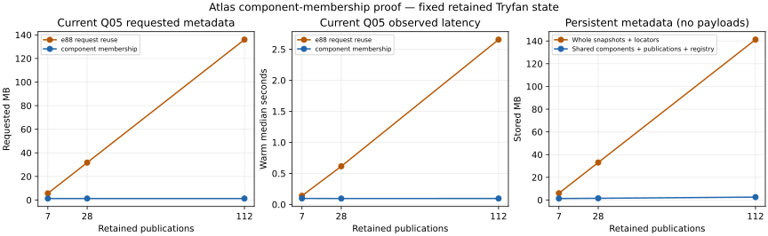

# Atlas retained component-manifest and publication-membership resolution proof

## 1. Executive result

**C - PROOF SUCCESS.** Explicit publication membership over shared immutable components removes the measured publication-ancestry amplification within this retained local proof. At 7, 28 and 112 publications, current/recent/oldest selection reads 33 membership records and one publication; hydration adds five component bodies. No selected read follows a publication predecessor. Qualified answers match the earlier experiment, the original retained lifecycle recomputes only two summit results, historical replay remains exact and unchanged isolated consumers remain pinned through publication.

This establishes a logical direction, not production storage technology. The bounded Tryfan pilot remains **CLOSED / ACCEPTED**. [Results](atlas-component-membership-results.json), [decisions](atlas-component-membership-decisions.json), [validation](atlas-component-membership-validation.json) and the [prospectively frozen plan](../../scripts/atlas/component-membership/plan.json) are the durable evidence.

## 2. Starting checkpoint

Inspected clean `main` at `e88b575f51dc294806752a05bbbaee3a5d04efc8`; fetched origin and confirmed `main...origin/main` 0/0. No newer commit or legitimate local change needed reconciliation. The [frozen baseline](atlas-component-membership-baseline.json) pins accepted persistent files and the original scaling evidence. This report's final checkpoint is the commit introducing it; no self-referential commit hash is embedded in content identity.

## 3. Problem established by e88b575

The [scaling experiment](atlas-generation-scaling.md) remains authoritative. At 112 retained generations, ancestry-heavy historical Q05 requested 25,016 generation records/29,766,791,528 bytes and took 298,643.75 ms. Request-scoped verified reuse reduced this to 112 records/135,992,590 bytes and 5,822.46 ms. Ordinary current reuse still needed every distinct ancestor. Cached parsed ancestors also imposed substantial observed RSS. Publication eligibility performed repeated closure traversal, not merely a cheap direct lookup.

## 4. Target uncertainty

Can a selected publication prove its eligibility and exact component membership without walking other scientific generations? Request-scoped reuse did not answer that: each distinct ancestor was still parsed/hashed, and historical eligibility remained ancestry-dependent. The target property is work bounded by explicit membership, fixed identity width and requested component metadata, independently of predecessor depth. A component delta chain recreating history traversal, orphan acceptance or scientific drift would reject this direction.

## 5. Scope

An isolated local logical representation, deterministic 7/28/112 administrative histories over accepted retained scientific state, one exact retained U1 transition, membership/integrity instrumentation, original S4 serving/consumers, failure checks and reporting. The prospective plan defines 27 primary measurement cells. Supplementary oldest-serving observations are labelled separately.

## 6. Explicit exclusions

No accepted-pilot rewrite, new real source data, new physical derivation, production imports, database/cloud/index service, distributed publication, continuous ingestion, public API or implementation of the recommended architecture. Existing local HTTP is exercised unchanged inside the proof; no API is added. Weather, Traverse, production Atlas and frozen contracts remain unchanged. Appearance remains unresolved/non-blocking; Swiss multiview remains parked. No private data, repository/licensing/naming reorganization or S7.

## 7. Authoritative foundations

The [measured architecture assessment](atlas-measured-storage-processing-serving.md), [storage requirements](atlas-storage-processing-serving-requirements.md), [world-model synthesis](atlas-world-model-architecture-synthesis.md) and [derived lifecycle](atlas-derived-understanding-lifecycle.md) establish the responsibilities. [S6](tryfan-pilot-s6.md) closes the accepted pilot; [S1](tryfan-pilot-s1.md), [S2](tryfan-pilot-s2.md), [S3](tryfan-pilot-s3.md), [S4](tryfan-pilot-s4.md) and [S5](tryfan-pilot-s5.md) provide actual identity, native reader, derivation, serving and scoped-publication machinery. The [integrated proof](tryfan-qualified-query-proof.md) and [persistent proof](tryfan-local-persistent-proof.md) retain the earlier qualified/lifecycle evidence. Frozen Semantic/Terrain contracts and implementations are reused through existing pilot modules; the plan pins relevant module/report SHA256 values.

## 8. Required semantic invariants

Immutable historical publication and payload identity; logical reuse without source duplication; source/product/representation/result distinctions; rights/time/reference/provenance; native versus mapped meanings and mapping loss; actual dependency scopes and method revisions; policy-relative freshness with stale distinct from false; selective recomputation; exact replay; coherent atomic publication, explicit eligibility and pins; independently reconstructed fresh-process state. Each selected immutable record is hashed and canonically checked anew per request. No permanent trust in mutable paths.

## 9. Frozen hypotheses

| Hypothesis | Prospective rejection/observation | Finding |
|---|---|---|
|H1 bounded membership resolves the problem|Read count tied to explicit membership, semantics preserved|Supported within tested scope|
|H2 ancestry merely moves|Components, provenance, integrity or lifecycle traverse publication history|Not observed in instrumented paths|
|H3 boundedness loses semantics|Qualified mismatch, orphan acceptance, wrong freshness/replay/pin|Not observed; exact retained checks pass|
|H4 duplication defeats reuse|Publication/index duplication outweighs component sharing|Not observed at 112; small-file and coarse-component costs remain|
|H5 another regime|An independently observed dominant behaviour|Not required; requested component size is the next uncertainty|

Criteria and matrix were frozen before construction/measurement in `plan.json`, SHA256 `11c41e38c762526e116c9b05e8b0769f2ba66887445df0bf82c107f54f4f9f88`. No hypothesis or primary case was changed after observing results.

## 10. Candidate component model

The five components are exact existing pilot collection fields, not a new universal ontology. They retain the same bounded 9 km² Tryfan support and all 310 registered artifact references. Source/prepared families remain inside their existing catalogue/native collections, rather than becoming five invented land-truth layers.

| Component | Contents/responsibility | Shared baseline bytes |
|---|---|---:|
|catalogue|Five retained source/prepared families; established identities, support, rights/provenance|342,742|
|knowledge|Frozen native semantic bundle, definitions/mappings, raster binding/vector records|660,107|
|understanding|Terrain applicability, methods/results/dependencies and actual input-use scopes|110,074|
|serving|Exact S4 layer/portrayal/provenance metadata|126,936|
|locators|Storage bindings, explicitly separate from scientific source identity|47,562|

Every component is self-contained at this boundary. There is no component parent/delta pointer. Coarse collections deliberately establish viability first; finer granularity remains unproven.

## 11. Component identity

Canonical existing `identity.encode` bytes of `{schema,kind,value}` determine SHA256. Kind is included, avoiding collisions between conceptual roles with identical values. State revision is a new content identity; logical collection kind/support and source/product/result identities remain distinct. Identical bytes reuse the same object. Component metadata retains original provenance and dependency records, not a replacement lineage inferred from path names. Locator replacement changes a locator component/publication binding without redefining source/product or the reconstructed scientific generation identity.

## 12. Publication-membership model

An immutable publication contains schema, administrative ordinal, predecessor (lineage only), exact legacy scientific SHA, original remaining header/context and five explicit kind-to-component SHA references. New proof publication identity is SHA256 of its canonical bytes. The legacy hash preserves byte-exact reconstruction of the old generation and its context; it is not silently substituted by an ordinal.

Eligibility is separately committed: an immutable byte-radix membership trie over 32-byte publication identities, with at most 33 nodes on any selected path. A root contains **both** current publication and eligibility-root identities. File existence does not make a staged publication eligible. New path nodes and manifests may exist before the switch; the old root cannot reach their membership.

## 13. Resolution algorithm/model

Read the coherent root, select its current identity or an explicit historical identity, traverse the committed identity-key path, verify the matching leaf, and read that publication directly. If component metadata is requested, resolve its five direct identities, verify their bodies, reassemble and validate the exact old domain snapshot. Never follow the publication predecessor or old scientific parent to discover membership.

The bound is 33 membership nodes for a SHA256 key, one selected publication and at most the five requested collection bodies. Each index node has at most 256 children. Requested bytes can grow with bounded branch occupancy and component population; this is not a claim that all lookup bytes or CPU are identical. Multiple existing serving calls can walk the same fixed path inside a request; request-scoped verified reuse avoids duplicate requested file reads. No cache is required across requests or restart.

## 14. Verification model

Membership path, publication and component SHA/canonical bytes are verified in a fresh request context. Hydration runs the unchanged full frozen domain validation and confirms the exact scientific snapshot SHA. Normal S4 reads preserve portrayal validation and source-specific artifact checks. Publication and explicit `verify:true` still verify all 310 retained artifact hashes. These costs are reported separately from metadata membership.

The integrity responsibility is explicit: **selected publication/component closure is verified; unselected archived publications are independently verified when selected or explicitly audited**. Merely being a provenance predecessor does not make every ancestor body an actual input of the current state. A deliberately corrupted older publication leaves valid current state loadable, but its explicit historical read fails. This is a tested change to the whole-ancestor verification mechanism, not a claim to have audited every archive on every query. Required derived inputs/history are retained in the selected self-contained understanding collection and replayed. Archive-wide audit, adversarial signing/authorization and unsupported in-flight manual file mutation are outside the proof.

## 15. Historical-access model

Current, second-newest and first publication are direct selected identities under the same committed eligibility root. Their publications reconstruct exact scientific state without replaying intervening publications. After U1, the common-context historical snapshot retains four original results; regional state retains those four plus two new summit results. Explicit historical serving never upgrades to current. Unknown and pre-switch identifiers fail even if a complete candidate manifest exists.

## 16. Selective-recomputation compatibility

The publication representation does not perform derivation logic. Original S3 methods assess the retained common-to-regional U1 applicability transition: two summit results stale, two southern results fresh; recomputation creates only the two summit revisions and reuses southern results. Actual method/input/support records remain unchanged. Four historical and six updated results replay from exact retained pixels (ten exact checks). The updated scientific snapshot is byte-identical to the accepted U1 `5f2c1b1f…` generation; no synthetic scientific revision is invented. Historical records remain distinguishable and policy-relative method staleness is inspected using a read-only policy comparison, without adding a method implementation.

## 17. Coherent-publication compatibility

Build immutable components/publication, validate original domain transition and required sources/portrayals, path-copy eligibility nodes, then atomically replace one local root containing both current identity and eligibility root. Single writer is enforced by exclusive creation of a writer lock. The original S1/S4/S5 source files are unchanged; the isolated alternative writer uses the same fsynced-file/same-directory replacement principle for its different logical representation.

This is a local supported-writer/process-interruption guarantee, not multi-writer, filesystem power-loss or cloud atomicity. Historical manifests/root nodes remain immutable. The original separate HTTP session consumer pins G1; publishing G2 leaves it on G1, while a new original consumer pins G2 and can explicitly pin G1.

## 18. Experiment/proof fixtures

The real accepted baseline retains seven scientific generations, five evidence families, 310 artifacts / 42,473,107 bytes and six current result records. Its 17 protected persistent-file hashes, current root and source verification are pinned in the baseline receipt.

Isolated state is `C:/Users/gbsam/Documents/Codex/atlas-component-membership-v1`, never the accepted store. The 7/28/112 histories differ only in administrative publication ordinal/predecessor and reuse the same five accepted current scientific components. They model history/reuse pressure, not 112 different scientific worlds. Two retained portrayal artifacts are copied once per isolated store; 42,473,107 source bytes across 310 artifacts remain references to unchanged retained data.

The separate lifecycle fixture uses exact retained common `76e6561b…` and regional `5f2c1b1f…` states. Guarded process-local load hooks substitute only generation loading and publication eligibility; original native queries, qualified projections, lifecycle methods, HTTP implementation and consumers execute unchanged. Module hash guards reject drift. This is an executable compatibility proof, not a migration of the accepted pilot.

## 19. Scaling matrix

| Primary cells | Dimensions | Repetition |
|---|---|---|
|18 membership/hydration cells|7/28/112 × current/recent/oldest × membership/hydrate|5 fresh processes and 20 same-process fresh request scopes|
|9 serving cells|7/28/112 × Q05 WorldCover/Q21 composed evidence/Q18 provenance|3 fresh processes and 10 warm requests|

One real U1 transition, two planned abrupt interruptions and seven corruption/missing/orphan cases supplement those cells. Three oldest 112 serving calls were added as **single fresh supplementary observations** for a direct historical comparison, not a retrospective primary matrix change. Full raw repetitions/fixture histories remain external with SHA-pinned receipt paths in the committed results.

## 20. Instrumentation

Counters classify root, publication, membership, component, portrayal, retained and runtime reads/bytes; membership visits/edges, component edges, SHA checks, domain validations and ancestry traversals are separate. Elapsed library-boundary times, fresh startup/pin times and observed Node RSS are recorded. Footprints count immutable publication/component/registry files separately from source/portrayal payloads and diagnostics.

Meters wrap synchronous reads and instrument explicit graph traversal; they are logical/requested reads, not physical disk I/O. Runtime/Python/subprocess costs are not silently included in membership bytes. Every warm request starts an empty verification cache. Source-specific readers retain their established verification. Original measured source bytes are pinned externally; repository packaging normalizes CRLF to LF only, with byte-equivalence validation and no logical measurement change.

## 21. Structural results

All 27 primary cells: **33 membership records, one publication, zero publication ancestry traversals**. Membership-only verifies 34 immutable identities; hydration verifies 39 and reads five component bodies/1,287,421 bytes. At 112, membership nodes request 12,375 bytes and current publication 2,484 bytes; one root 210 bytes makes 15,069 bytes before hydration. Hydration totals 1,302,490 selected metadata bytes, excluding runtime/source/portrayal reads.

The existing Q05/Q21 serving path performs 66 membership visits/64 edges, Q18 performs 165/160, but within-request reuse still reads only 33 distinct membership bodies. These fixed internal call counts do not change with history depth. Registry bytes increase 5,823→7,383→12,375 at 7→28→112 as branch occupancy grows; the finite 32-byte/256-fan-out bound matters more than a false constant-byte claim.

## 22. Timing results

Warm medians in milliseconds (full min/max and fresh statistics are in results):

|Retained publications|Membership current/recent/oldest|Hydrate current/recent/oldest|Q05/Q21/Q18 current|
|---:|---|---|---|
|7|29.07/29.55/29.40|74.61/76.10/79.32|96.90/250.12/127.48|
|28|28.39/28.65/28.52|72.35/76.34/75.25|95.69/259.60/137.96|
|112|27.68/28.86/28.90|73.18/73.29/74.39|96.19/200.65/134.50|

These observations are consistent with depth-independent selected metadata work, not formal proof of every future timing regime. Fresh means fresh process, not flushed OS caches. A finite lifecycle run overlapped part of the timing campaign; structural counters/answer equivalence are primary and small timing differences are not interpreted. RSS is observed before/after, not peak/live heap: hydration warm maxima about 290–306 MB; served queries about 196–255 MB. Coarse validation/runtime allocation still matters.

## 23. Metadata-footprint results

|Publications|Shared five components|Publication manifests|Retained registry nodes|Metadata total|
|---:|---:|---:|---:|---:|
|7|1,287,421 B|17,312 B|39,123 B/231 files|1,343,856 B|
|28|1,287,421 B|69,453 B|179,268 B/924 files|1,536,142 B|
|112|1,287,421 B|278,038 B|1,016,124 B/3,696 files|2,581,583 B|

At 112, older whole-generation/locator metadata total141,240,910 B; diagnostics and identical source/portrayal payloads are excluded from both totals. New manifests/index paths add averaged 8.06/8.88/11.56 KB per publication over these histories (derived from measured aggregate bytes, not measured constant increments). Current root is 210 B. The trie adds 33 immutable small nodes per publication; file-count/packing/retention overhead is real, though far below full snapshot duplication in bytes here.

## 24. Reuse results

Administrative histories share exactly five component objects regardless of publication count. U1 changes only understanding and serving; catalogue, knowledge and locators keep identical component hashes. Seven unique U1 component bodies total1,496,742 B. New understanding 110,074 B replaces 82,466 B; serving 126,936 B replaces 126,855 B. Original payloads are not duplicated, and original result identities remain retained.

The 81-byte serving-value growth does not mean an 81-byte immutable delta: the entire 126,936 B collection is a new component. This is honest metadata duplication inside a coarse boundary and an evidence-led reason to test granularity. Reuse of component identity is distinct from claiming that reused data was re-observed or recomputed.

## 25. Historical lookup results

All current/recent/oldest selections retain the same 33-record eligibility bound; older lookups neither replay later publications nor follow predecessors. Oldest112 hydration reads the same five component bodies and 1,302,426 selected metadata bytes (small header-length difference). Supplementary fresh oldest-serving query observations: Q05 104.15 ms, Q21 211.88 ms, Q18 124.70 ms; startup/pin 1.88–2.04 s. They reproduce the corresponding normalized qualified SHA from e88b575. The earlier historical pin selected the fully served retained `5f2c1b1f…` scientific state beneath administrative successors; this proof’s first administrative publication contains that same state. It does not claim that the original registration-only pilot seed supported those queries.

## 26. Verified-reuse results

Carrying a known component reference writes a small direct membership, not a copy. Resolving it consults its immutable object directly. A fresh hydrated request verifies the 33 eligibility nodes, publication and five component hashes once, then the original domain snapshot. No component integrity depends on publication ancestry. Full payload verification remains a separate explicit 310-artifact operation and still runs before publication. Selective native reads retain their existing raster/vector checks; they are not replaced by metadata SHA checks.

Q05 still requests1,127,670 retained bytes and 3,057,491 portrayal bytes in its established path; Q21 requests9,262,300 retained bytes. Eliminating ancestry does not eliminate requested evidence, full coarse metadata or portrayal verification cost.

## 27. Publication/interruption results

Two abrupt writer exits (`after-components`, `before-switch`, exit91) preserve the exact old root. The first is after validated candidate components but before registry assembly; the second after complete registry path construction but before atomic switch. Candidate G2 is rejected as unpublished in both cases. Existing G1 consumer remains exact; fresh server/consumer recovers G1. Dead PID lock recovery is explicit; retry uses the same candidate identity and preserves G1.

Successful U1 publication changes the root once; old pinned consumer stays G1, new consumer sees G2, explicit historical consumer sees G1, and combined answer components match their pinned generation. Old publication bytes are unchanged. First U1 assessment/recomputation 539.06 ms, final source/portrayal validation 436.05 ms and root replacement 14.64 ms are single observations. All administrative construction observations, including first/last and ranges, are retained externally; construction uses only prior current state and a fixed 32-level path, not the full history. These observations include full source validation on every publication; they are setup/publication measurements, separate from lookup repetitions.

| History | Publish/validation/root-switch median ms | Full publish range ms |
|---:|---|---|
|7|394.61 / 216.41 / 1.32|323.70–429.47|
|28|480.68 / 272.62 / 1.50|333.00–541.21|
|112|466.71 / 250.74 / 1.61|406.09–668.18|

The non-monotone timings do not imply identical publication cost. Immutable path-copying work is fixed in depth; bounded node fan-out, component validation, source hashing and local filesystem noise remain costs.

## 28. Direct comparison with e88b575

The figure compares repeated current Q05 medians. The left panel counts earlier whole-generation bytes versus selected publication/component/membership bytes (the latter includes the locator component); it excludes other runtime/source/portrayal reads. Historical 112 is separately compared below; campaigns differ, so ratios are not production forecasts.

|Question|Evidence-led answer|
|---|---|
|1 Does G112 resolve 111 ancestors?|No:33 eligibility records, one publication, five components if hydrated; no predecessor read|
|2 What scales instead?|Fixed identity width, membership fan-out/selected bytes, requested component population and requested evidence|
|3 Does historical depth matter?|Not to selected path length; current/recent/oldest all 33 records|
|4 Is verified reuse ancestry-dependent?|Not for selected closure; archive-wide auditing is separately explicit|
|5 Eliminated or moved?|No component delta chain; native/provenance hashes and actual lifecycle/replay hold; no observed hidden publication walk|
|6 How much publication duplication?|About 2.4 KB manifest plus 33 small registry path nodes; averages8–12 KB added per publication here|
|7 How much genuinely shared?|Five bodies/1.287 MB across112; no 310-source payload duplication|
|8 When a component changes?|New immutable body, direct new membership; U1 changes two, reuses three|
|9 Exact history reconstruction?|Yes, scientific SHA matches retained snapshots and ten historical/current pixel replays are exact|
|10 Pins across publication?|Unchanged separate consumers retain G1; new consumers G2, explicit history G1|
|11 Lifecycle compatibility?|Original methods/scopes: two summit recomputations, two southern reuse; historical staleness remains qualified|
|12 New complexity?|Component store, publication manifest, eligibility trie/root pair, request-scoped verification and explicit archive audit boundary|

Historical Q05 comparison: original 25,016 generation reads/29.77 GB/~299 s; request-scoped reuse 112/135.99 MB/~5.82 s; candidate 33 registry +1 publication +5 components/~1.302 MB selected metadata/104.15 ms query (single fresh historical observation). The last total includes new registry/component classes rather than pretending old generation-read counters are identical categories. Original source/portrayal/runtime reads are separate. This eliminates the demonstrated ancestry mechanism; it does not establish global performance.

## 29. Hidden-amplification audit

Publication predecessor and legacy header parent remain immutable provenance references, never normal membership navigation. Component bodies have no parents/deltas. The committed eligibility trie follows fixed-width identity digits, not publication order. Selected understanding retains actual result dependencies and historical claims; original freshness traverses that bounded result graph, and exact replay reads its actual retained inputs. Q18 provenance answers match e88, with five components and zero publication ancestors. Every selected request rechecks metadata SHA; between-request corruption fails. Corrupt unselected history is intentionally audited only when selected, as documented in section 14.

Possible amplification remains **within component populations** (definitions/claims/results) and future dependency graphs, not demonstrated eliminated merely by smaller generation manifests. This proof tests five-to-seven distinct collections, not arbitrary histories of every component revision or cross-region dependency fan-out. A collection retaining more distinct historical claims can grow with scientific revisions even though publication discovery no longer walks ancestors. Fixed-science administrative histories do not establish bounded total cost for that different workload.

## 30. Metadata-duplication trade-off

Explicit membership costs modest duplicated headers and index paths in exchange for bounded eligibility and direct reconstruction. At 112, total metadata is 2.58 MB versus 141.24 MB whole scientific snapshots/locators. Shared payload references preserve history without payload copies. Coarse changed collections duplicate unchanged interior records; U1 quantifies that cost. Registry old path nodes also remain retained. This is a favourable measured trade here, not proof that all component sizes, file counts or update rates are acceptable indefinitely.

## 31. Architectural interpretation

The logical alternative preserves the tested Atlas meanings while making publication membership independent of ancestry. It succeeds because it separates publication identity/eligibility, direct component state, scientific snapshot identity and storage locators. It does not relocate derivation policy into the manifest. The adopted lesson is a constraint and provisional pattern; the byte-radix files are a bounded local witness, not a mandated production backend.

## 32. DECIDE NOW

**N09 — DECIDE NOW:** require explicit bounded publication membership and coherent commitment of current identity plus historical eligibility, independently of ancestry. **N10 — DECIDE NOW:** preserve immutable state reuse and verify selected identity closure per request; distinguish archive audits from actual selected evidence dependencies. These strengthen e88 P06/N07/N08 without selecting infrastructure. Missing/corrupt selected state and complete pre-switch orphans must fail.

## 33. PROVISIONAL DIRECTION

**P07 — PROVISIONAL DIRECTION:** shared immutable component bodies, lightweight direct publications and a bounded committed eligibility witness. Existing collection boundaries are sufficient to demonstrate compatibility; they are not final granularity. Fixed-radix path copying is one reproducible witness and may later be packed/replaced without changing semantic membership/pinning.

## 34. DEFER PENDING EVIDENCE

**D07 — DEFER PENDING EVIDENCE:** exact component boundaries, selective hydration/structured lookup, large native inventories, many distinct revisions, cross-region dependency scope, registry packing/compaction/checkpoints, database/object-store/index product, cloud durability, authorization/trust and concurrency. Current Q05 still hydrates 1.287 MB even for one raster cell; no technology choice follows from fixed Tryfan cardinality.

## 35. REJECT

**R07 — REJECT:** unbounded ancestor closure as normal current/historical eligibility, hidden component delta ancestry, existence-as-publication, permanent mutable-path trust, dropping native/provenance/rights/freshness/integrity to obtain timings, or heavyweight graph/distributed infrastructure justified solely by this local proof. Historical provenance references remain valid; rejecting traversal does not delete history.

## 36. Remaining uncertainty

The highest-value next gap is component granularity versus selective metadata reads as native/result population grows. The answer could favour whole small collections, family/support-sized immutable components, or structured selective lookup, and would affect metadata/index/materialized-view direction. It is distinct from resolved history depth. Production safety/availability and payload-scale costs need later evidence, but do not justify an unfocused architecture implementation now.

## 37. Limitations

One retained public region, single writer, local filesystem, five-to-seven components, repeated administrative scientific state and one real applicability update. No arbitrary component replacement history, remote consistency, user access control, peak-memory measurement or cold-disk claim. Guarded load hooks prove compatibility without demonstrating a production migration. Whole collection validation and original portrayal reads remain expensive relative to direct membership. Timing overlap/noise is disclosed; no optimization was performed to manufacture favourable measurements. No scientific accuracy/current-truth/global production conclusion.

## 38. Regression validation

[Validation receipt](atlas-component-membership-validation.json) records 73 checks and 321 passing tests (20 focused proof tests), plus passing lint/build, covering focused proof tests, previous scaling/architecture checks, S1–S6, retained native/domain/runtime tests, planning safeguards, semantic types, lint/build and diff checks. Non-navigation tracked bytes at the starting commit are protected; accepted persistent hashes, all 310 active source hashes plus programme retained inventory, all 42 canonical research statuses and all 113 protected production hashes are checked before/after. Historical reports/measurements remain intact. New files are lightweight tooling/receipts/figure/report only; no accepted state or source was rewritten.

## 39. Decision A/B/C/D

**C - PROOF SUCCESS.** The targeted ancestry/read-amplification uncertainty is resolved within the tested scope: explicit shared component membership plus committed bounded eligibility retains qualified answers, exact historical reconstruction/replay, scoped lifecycle, verified selected identity, coherent publication and independent pinned consumption. H2/H3/H4 rejection behaviour was actively tested, not presumed absent. The direction may proceed to a further bounded granularity experiment; this is not permission to implement production storage.

## 40. Exactly one next bounded Atlas task

**Atlas retained component granularity and selective metadata-read scaling experiment.** Use isolated deterministic metadata populations derived from existing retained semantics to determine how collection/family/support component boundaries affect selective property-query reads, metadata duplication and integrity cost. Preserve committed publication membership, native definitions/templates, rights/provenance, actual dependency scopes and historical identities. Acquire no evidence and create no physical method. This task is **not begun**. Tryfan remains closed/accepted; Appearance unresolved/non-blocking and Swiss multiview parked.
