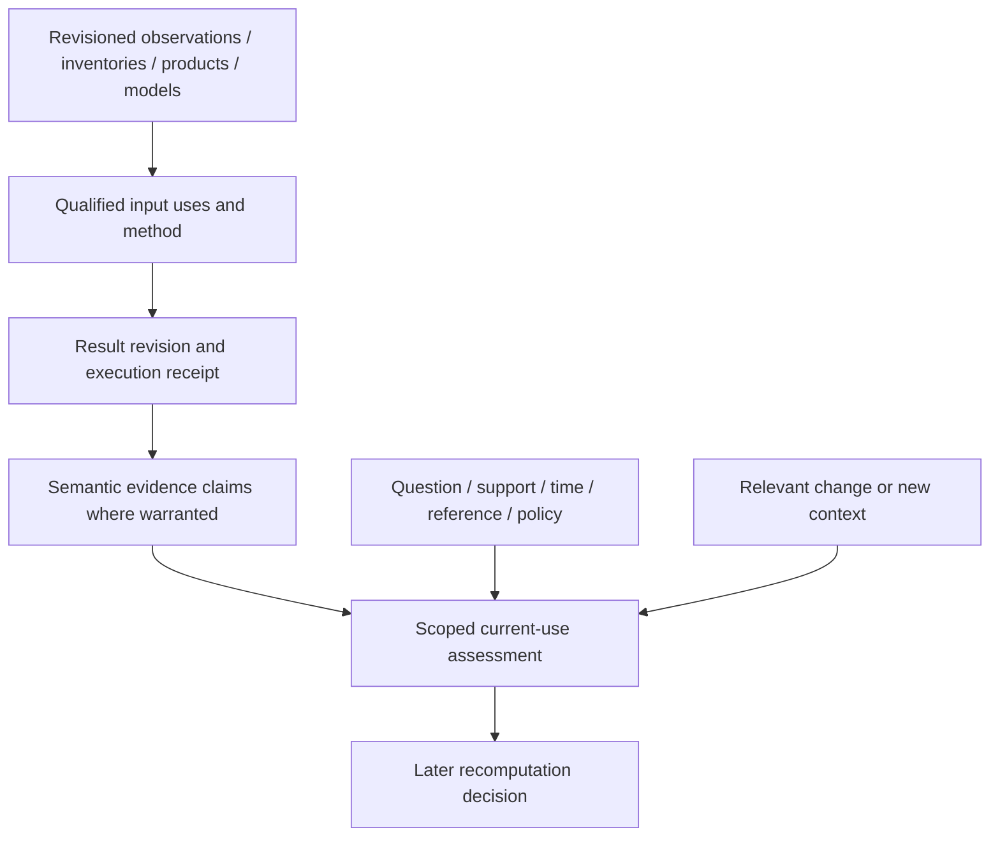

# Atlas derived physical understanding — identity, dependencies and revision lifecycle

2026-10-06. **Assessment complete; pre-synthesis lifecycle gate CLOSED FOR FOUNDATION.**
Starting state: clean `main` at `5f145117072b1cde2e696fb8d8f8d11995a2c06f`
(“Reconstruct Atlas research state and synthesis gates”); origin fetched, divergence
0/0. No newer commits or local work needed accommodation.

This answers the single prerequisite in the [current research-state register](atlas-research-state.md).
It is a retained-case/domain assessment, not a new physical experiment, contract,
derivation runtime or world-model synthesis.

## 1. Executive conclusion

**Architecture consequence C: a small compatible derivation/dependency description,
with clarified lifecycle rules around existing evidence records.** Semantic Evidence
Contract v1 already represents most of a qualified result: property/value,
source-native meaning, revision-qualified inputs/methods, space/time/reference,
lineage, scoped quality and gaps. It does not structure actual dependency use or
policy-relative freshness sufficiently for reliable automated scoped recomputation.
Those responsibilities belong beside v1, not inside TerrainHierarchy or a
replacement semantic contract.

Keep immutable revision snapshots so history remains referenceable. Allow revised
claims, contexts and current selections to evolve. A result can remain reproducible
and valid for its original question while no longer meeting a current question's
evidence policy. Stale means reassessment/recomputation is needed in that context;
it does not mean historically false. Neither the latest date nor a cache hit
establishes truth or preference.

The five walkthroughs expose no remaining foundational blocker before a
**separately authorized world-model synthesis**. They establish requirements,
not operational propagation, algorithm superiority or complete source revision
knowledge. Frozen contracts and production source/data remain unchanged.
Terrain, multiscale and physical-surface foundations stay closed; multiview stays parked.

Classification: **E** established external knowledge; **M** retained Meridian
facts/results; **I** architectural interpretation/adaptation; **Q** unresolved.
There are no new measured terrain or state results.

## 2. Problem definition and evidence boundary

Derived physical understanding is an answer to a qualified physical question
using particular evidence and a method. It is not the world itself. One location
supports multiple quantities, times, scales, methods and contexts. Better evidence,
better processing and physical change are different reasons for another answer.
Atlas cannot precompute every potential question.

Relevant audit threads are H3 (DEM morphology), H4/H5 (dated/mixed evidence), H7
(surface-height interpretation), T2 (metadata/hierarchy), M3 (information limits),
A2/A15 (processed appearance dependencies), S2/S3 (water/contract) and S6/S7
(understanding/state lifecycle and future atmospheric interface). Other statuses
are not re-audited or reopened.

Cases were fixed before analysis: **A** Tryfan source/representation revision;
**B** terrain-derivative method revision; **C** Exe dated observations versus a
correction; **D** retained terrain→aggregate slope/aspect→solar-incidence chain;
**E** terrain-only calculation gaining structure context. A/B/E changes are
reasoned scenarios, **not newly computed outputs**. D existed in Earth Lab 005C;
C reuses recorded observations without inferring tide, flood or seasonal change.

## 3. Existing Meridian machinery

| Authoritative existing machinery | What applies / what is not provided |
|---|---|
| [Terrain metadata architecture](../atlas/terrain-source-product-architecture.md), [hierarchy contract](../atlas/terrain-hierarchy-contract.md), [runtime selection](../atlas/terrain-runtime-selection.md) | Source, product and representation differ; prepared content, hierarchy and levels are revision-sensitive. Support/lineage/unknown hosted revisions are explicit. Selection is eligibility/fallback, not semantic freshness. |
| [Tryfan proof](../atlas/tryfan-second-region-proof.md), [prepared record](../../src/atlas/terrain/metadata/tryfanProductRecord.json) | Immutable regional preparation/coherent parents. A support correction kept identical terrain bytes. Parent levels are not interchangeable derivative inputs; unknown datum/information resolution stays unknown. |
| [Information-limit synthesis](../atlas/information-aware-display-selection.md) | Source sampling, information, delivery and display sampling differ. Finer interpolation or more vertices is not new observation; camera/device changes normally affect depiction rather than a physical slope field. |
| [Appearance architecture](../atlas/appearance-baseline-and-architecture.md) | Geometry used to prepare imagery differs from runtime draping geometry. Known preparation dependencies are revisioned; unknown mosaic/geometry contributors remain unknown. Switching runtime terrain does not prove an orthophoto needs reprocessing. |
| [Surface review](../atlas/physical-surface-semantics.md), [mountain comparison](../atlas/source-native-semantic-comparison.md), [Exe check](../atlas/water-feature-state-check.md) | Native meaning, hybrid properties, claim-local space/time/reference, mapping loss, quality scope and gaps. Agreement is not truth; state inference and cross-source feature matching are not implemented. |
| [Semantic Evidence Contract v1](../atlas/semantic-evidence-contract.md), [types](../../scripts/atlas/semantic-evidence/contract.ts), [validator](../../scripts/atlas/semantic-evidence/validate.ts) | `LineageInput` references a resource or claim revision **and role**. `EvidenceBasis` includes completeness and processing revision knowledge/software/parameters/records. Context supplies support/time/conditions/quality. Multiple claims coexist. No dependency-use windows, current-result evaluator, cycle validation, supersession policy or execution engine. |

Generic [metadata primitives](../../src/atlas/terrain/metadata/terrainMetadata.ts)
provide `Knowledge`, `EntityReference`, `AssetReference` including hash/selector,
`ProcessingStep`, CRS/spatial areas and rights. Reuse them. v1 can link/descriptively
retain dependency detail; this is honest evidence preservation, not a promise of
machine-readable selective invalidation.

## 4. Relevant established approaches

Primary documentation reviewed 2026-10-06. These are precedents, not adopted
infrastructure or a standards-compliance claim.

| Established approach (E) | Adaptation and limit (I) |
|---|---|
| [W3C PROV-DM, 2013](https://www.w3.org/TR/prov-dm/) — entities/activities, usage/generation, derivation/revision/responsibility | Distinguish result revision from producing activity. Revision is a kind of derivation. **PROV invalidation means destruction/cessation/expiry; it is not Atlas's policy-relative stale assessment.** Provenance does not rank answers or require deletion of history. |
| [W3C SOSA/SSN, 2017](https://www.w3.org/TR/vocab-ssn/) — feature/property/procedure/result, phenomenon versus result time | Separate time a result concerns from processing completion. Also retain when Atlas recorded/accepted it. These axes support historical physical-time versus knowledge-time questions; no bitemporal database is chosen. Procedures are reusable. |
| [CWL Workflow v1.2.1 execution model](https://www.commonwl.org/v1.2/Workflow.html#execution-model) — declared inputs/outputs and linked steps forming a DAG | Use finite versioned dependencies. Support/scientific meaning still need domain qualifications; execution-platform policies are not all determined by a workflow specification. No engine adopted. |
| [Workflow Run RO-Crate, Provenance Run profile](https://www.researchobject.org/workflow-run-crate/profiles/provenance_run_crate/) — prospective plan versus retrospective runs/intermediates | Separate what a derivation requires from what it actually used. Recipe is not receipt; receipt is not selection policy. No full packaging implementation required. |
| [STAC Processing](https://github.com/stac-extensions/processing) — processing time, chain/software versions and `derived_from` | Keep product version, processing baseline and observation time separate. Free-text lineage alone cannot drive exact scoped recomputation. |
| [STAC Version](https://github.com/stac-extensions/version) — contextual versions, predecessor/successor/history and deprecation | Succession is not equivalence or scientific superiority. Latest-version navigation is not the right answer to every epoch/method question. |
| [Bazel hermeticity](https://bazel.build/basics/hermeticity) and [caching](https://bazel.build/remote/caching) — declared tools/inputs/configuration, action cache versus output hashes | Execution signature and artifact digest serve different roles. Reuse requires compatible relevant inputs/environment. Build reproducibility does not resolve unknown observations or physical fitness. |
| [Adapton authors' overview](https://adapton.org/) — demand-driven incremental computation, dependency-directed repair; PLDI2014 DOI10.1145/2594291.2594324 | Established precedent for avoiding global recomputation. Atlas additionally needs space/time/meaning. Accessible author overview was reviewed; attempted PDF links failed, so no detailed paper proof/performance claim is made. |

Established provenance/incremental concepts solve much of the problem. Meridian's
adaptation is determining **which physical question/support/context changed**,
not inventing a DAG algorithm, quality score, universal cache format or framework.

## 5. Identity model

Five roles, **not five mandatory new database entities or production APIs**:

| Role | Identity and qualification |
|---|---|
| Semantic question/result family | Revisioned property meaning, subject/feature where relevant, physical surface basis, support, time/reference and analysis grain/operator interpretation. Bare-earth slope differs from screen or canopy slope. Method choice can remain within a family only if intended quantities are compatible. |
| Processing specification/invocation | Reusable method revision and input requirements; concrete invocation binds exact evidence/representations/subsets, parameters, missing-context decisions, output grid/units/nodata and numerically relevant software/environment. |
| Materialized artifact | Digest plus encoding/grid/CRS/support and invocation receipt. Identical pixels can occur in different provenance contexts. Hashes identify bytes, not national source release, property or correctness. |
| Evidence claim revision | v1 ID+revision identifies assertion/gap and qualifications. Changed value, meaning, support or lineage needs a new owned revision. Comparable answers need not share claim IDs; explicit family/association can connect them. Repeating an identical claim need not invent a new assertion. |
| Cache entry | Technical invocation/subset/runtime/output identity. Expiry/eviction changes availability, not physical validity or truth. |

Do not encode every dimension in one opaque ID. Reuse stable property/method/source
references with explicit revisions and metadata. Output resolution affects process
identity and, when changing physical averaging/support, question qualification.
Processing/recording time is normally receipt metadata, not another observation.

“Same question” means comparable intention, **not equivalent answers**. A different
roughness definition, DTM→DSM substitution or another time/reference may warrant a
different qualified family/property. Crosswalk reinterpretation has its own version;
it cannot rewrite native evidence. A field cell is a support-bound claim, not a
persistent physical feature. A ridge extracted from it has an additional
interpretation/method/support; cross-revision feature correspondence is unresolved.
Waterbody/glacier source IDs can persist across state observations without implying
cross-source global identity.

## 6. Dependency model

Ordinary finite derivations form a DAG of **versioned input uses**. A use distinguishes
referenced input, influence role and relevant part. v1 already has references/roles;
linked records can retain descriptive detail. Future structured automation needs,
only where scientifically relevant:

- exact resource/claim revision knowledge and retained asset hash/selector;
  source revision differs from selected representation/level;
- input field/band/property, actual space/time subset, grid/CRS/nodata/validity,
  read neighbourhood/halo, method parameters and assumptions/reference;
- actual used context versus requested-but-unavailable context; required,
  optional or explicitly outside the method's question;
- bounded discovery/selection baseline if the question requests current/best
  eligible evidence rather than fixed inputs;
- completeness and limitations. Unknowns cannot become fabricated latest revisions.

**Output support is not dependency support.** A 3×3 derivative reads neighbours;
a horizon can read far outside its output point. Valid halos/masks permit selective
assessment. Unknown/global dependence requires conservative whole-used-product or
unknown impact, not a made-up radius. Spatially varying lineage follows actual
contributors; an unrelated regional change does not invalidate an entire family.

Fixed references reproduce old tuples. Availability dependencies assess current
fitness: newly added relevant evidence has no edge to a previously used input.
A missing optional-context lookup needs query/support/time and catalogue snapshot
knowledge. **This negative dependency is not proof of physical absence.** Vegetation
availability does not affect a method explicitly excluding vegetation, but can
affect documented terrain-only fallback fitness in a richer-context question.

Derived inputs point to exact upstream revisions, never mutable “current slope”.
Gaps/conflicts/nondetections preserve meaning; no silent zero or automatic average
confidence. Partial evidence is accepted/rejected according to the method, not
silently upgraded. Input uncertainty/correlation propagation is method-specific.

A run cannot consume its own unproduced revision. A future execution validator
must reject unresolved same-revision cycles; v1 does not check them. Feedback can
use explicit earlier times/iterations or one solver with initial conditions and
convergence evidence. No general simulation engine is required here, and partial
source lineage is not a verified complete DAG.

## 7. Revision and change taxonomy

Consequences are scoped/conditional; an upstream revision is a notification to
inspect dependencies, not universally destroy/recompute. Preserve exact old tuples.

| Change | Normal consequence for a current request |
|---|---|
| Byte-identical rebuild, identical meaning/configuration | No value recomputation for a run timestamp. Record a run receipt if necessary; retain identical artifact/claim references. |
| Delivery encoding/compression/layout rebuild, decoded values/support identical | Rebuild/rebind delivery artifacts. Numerical derivatives can reuse proven identical decoded inputs; byte-consuming clients need coherent references. No new observation. |
| Representation/pyramid changes decoded samples, kernel or level | Reassess calculations using that representation; recompute affected support. Unchanged native-grid derivatives do not rebuild merely because a display parent changed. |
| Descriptive/rights/quality metadata correction | Update declarations/current eligibility or quality assessment, not fictitious heights. CRS/unit/epoch/support/validity/meaning corrections can affect claims even with identical bytes. |
| Correction/reprocessing of a past observation | New evidence revision for the same observation time; affected answers require reassessment/recompute. Preserve original/correction/withdrawal reason, not another physical epoch. |
| New observation of potentially changing conditions | Add time-qualified evidence. Recompute overlapping history/rolling/current questions as applicable; preserve old fixed periods. New data alone does not prove physical change. |
| Better eligible regional source | Historical AWS answer remains qualified to its inputs. A current question accepting Welsh evidence reassesses support/scale/meaning and obtains another answer. No universal ranking or analytical migration. |
| Method implementation bug fix | New method/software revision, scoped review/withdrawal of known affected outputs, then recomputation as needed. Stale is not a substitute for recording an established error. |
| Scientific method revision | Another qualified answer, initially coexistence. Supersession needs compatible meaning/fitness and an explicit assessment; v2 is not automatically superior. |
| Parameter, analysis grain or output-grid change | Different invocation/answer; changed physical meaning/support can require another family/property. Camera/DPR alone does not revise a physical ground derivative. |
| Changed reference condition | Separate conditioned answer, e.g. flood scenario; not a correction to another scenario or evidence of current inundation. |
| Changed common interpretation/crosswalk | Reinterpret using new mapping revision/loss; native values need not recompute. Reassess consumers of the changed interpretation. |
| New contextual evidence | No effect if irrelevant; reassess documented fallback/current context, or create a richer/different-property answer. Do not inject into historical provenance. |
| Physical change supported by qualified new evidence | Create dated state/geometry claims; current/static-assumption consumers reassess relevant support/time. Knowledge recording time differs from physical change time. |

M: Tryfan v1→v2 corrected support polygonization but kept all terrain tile bytes
identical. I: same values do not imply same support declaration, and another
product revision does not imply new measured terrain.

## 8. Invalidation and recomputation semantics

Use separate assessment dimensions, **not a frozen overloaded enum**:

1. Reproducibility: exact inputs/method retrievable, partially pinned or unpinned.
2. Dependency currency for a specified request/policy: compatible baseline,
   relevant change, or impact indeterminate.
3. Physical/semantic applicability: support/time/reference/property fits,
   does not fit, or is uncertain.
4. Scientific acceptance: purpose-qualified acceptance, known defect/withdrawal,
   unvalidated or unresolved. Fresh does not imply accurate; stale does not imply false.

A current assessment retains result revision, question/evidence-selection/method
policy revision, evaluation time/baseline, reason and impacted scope. Do not store
present preference by rewriting original claim time/provenance. Supersession is
explicit and scope-specific; coexistence is normal across different properties,
methods, times, scales and scenarios.

Conceptual scoped change procedure (I), **not an implementation**:

- Compare changed values **and relevant metadata** against actual uses and bounded
  availability dependencies.
- Test spatial influence/time/reference intersection, including halos/masks;
  unknown scope requires conservative or indeterminate assessment.
- Propagate potential impact through exact downstream uses and their scopes;
  mark relevant current-request results for review/recompute.
- Recompute on demand or under a later scheduling policy; cache invalidation
  need not eagerly execute every possible question.
- Preserve receipts and assess new outputs. Reuse downstream numerical artifacts
  only when values and required semantics are proven compatible; changed lineage
  can need a new claim/receipt even when bytes match.

A far-away changed sample does not affect a Horn derivative when its full read
neighbourhood is known unchanged; it may affect a horizon/catchment with broader
support. New observations after a fixed interval do not affect it unless correcting
old inputs or deliberately extending the question. If only a whole-product revision
is known, no exact changed subset, conservatively reassess the used subset rather
than claiming minimal invalidation.

A mutable AWS endpoint without revision notifications cannot be certified unchanged
without revalidation or a retained snapshot comparison. Retrieval date is not proof.
No universal timeout/latest rule repairs missing upstream provenance.

## 9. Dynamic versus persistent derivation

| Choice | Required qualification / limit |
|---|---|
| Cheap on-demand | Quantity/units/support/method/input qualification and unknowns. Ephemeral calculation need not become durable knowledge; exported/asserted claims need recoverable provenance. |
| Cached calculation | Invocation/dependency baseline, encoding and availability/expiry. Cache lifetime is performance policy, not physical validity; eviction is not retraction. |
| Persistent product | Shared method/input/grid/support/time/rights receipt, immutable reproducible revisions/artifact hashes. No metadata object per cell; persistence is not scientific acceptance. |
| Durable derived semantic claim | v1 property/value or gap, inputs/processing/interpretation/scoped quality. Revised claims/current assessment can evolve; previous snapshot stays referenceable. |
| Time-varying estimate | Observation/validity interval, reference/context, model/method/inputs and generation/recording time. New slice generally coexists; corrected old slice is revision, not indefinitely-current state. |

What must survive is the qualified question, input revision knowledge, actual
method/configuration/uses, result support/time/reference, processing provenance,
limitations and rights. Retained claims link to receipts/artifacts or explain
absence. Scientific reproducibility may need environment/nondeterminism controls
or declared numerical tolerance; byte equality is not promised for every machine.
Rights can limit retained artifacts without changing the original assertion.

Precomputation, persistence, cache eviction and scheduling need measured costs,
consumers and cadence, deferred here. Unlimited possible questions can coexist
with finite durable evidence/products, reusable methods and demand-driven work.
Do not require every view calculation to become stored world truth.

## 10. Retained-case analysis

### A — Tryfan terrain and representation revision

M: [Welsh proof](../atlas/tryfan-second-region-proof.md), existing EPSG:27700
window **[264900,357800,267900,360800]**, 9km², 3000×3000 native 1 m DTM.
`welsh-government-tryfan-dtm-selection` references retained subset SHA256
`49c131d7de62e0df35f8e02c2f8db3161bfd37f24fea56060fcbb9e6d109b326`.
Catalogue date 2021-03-02 does not independently map every cell's epoch.
`tryfan-welsh-regional-v2` revision:
`db8e4d87b5fa609d455d1e0f8ec3fdebc834579a7e102f69f4d0b0283efa690c`.
Vertical datum and effective measurement resolution remain unknown.
[AWS declaration](../../src/atlas/terrain/metadata/awsVisualTerrainProduct.ts):
`aws-terrarium`, revision explicitly unknown; URL is not immutable release.

I: hypothetical AWS/Welsh slope answers over the frozen summit patch in the
[semantic plan](../atlas/semantic-comparison-plan.json), centre[266405,359387],
side 400 m. Pin native or actual decoded tile samples, input level/grid plus gradient
halo, method/configuration and hashes where retained. Welsh native 1 m, interpolated
z17 (~0.717m) and z14 parent (~5.735m) are different inputs. Production exaggeration
1.45 or screen-mesh slope cannot silently enter a physical bare-earth slope.
No new comparison is computed. AWS is declared heterogeneous, so its derivative
must be qualified as slope of that represented heightfield, not asserted as measured
bare-earth slope. Welsh DTM semantics do not retroactively establish equivalence
of the two physical surfaces. Pinning local bytes does not identify complete
upstream AWS release/epoch/measurement semantics.

An AWS result is not deleted when Welsh support appears. A current finer-support
question can reassess/derive with explicit policy; no universal ranking follows.
Downstream consumers of the replaced slope are scoped reassessment candidates;
outside support they do not inherit Welsh evidence. Production and analytical
selection stay unchanged.

M: actual preparation v1→v2 corrected support, all tiles identical. I: derivative
pixels on unchanged used samples can be reused, but eligibility-dependent answers
and receipts/support references need updating. Byte equality cannot validate the
old support assertion.

**Outcome:** source-family substitution, representation change and support metadata
correction differ. A retained artifact pins a local calculation without falsely
pinning a national source release.

### B — same evidence, method revision

M: [005A config](../earth-lab/tryfan-005a-surface-analysis.json) pins R16 SHA256
`31cbe763dac4072772ac9bcb4a3217b78eba0c10265e576ede708154288f6bf6`;
Horn 3×3 weighted gradient, downhill aspect clockwise from grid north, undefined
aspect below 0.5° slope; detrended RMS roughness at 5/15/51-sample windows.
These are recorded choices, not universal algorithms.

I: hold evidence/support fixed: method v1 (retained Horn) → answer A; a
hypothetical method v2 using Zevenbergen–Thorne → answer B. Both are established
slope estimators exposed by [official GDAL documentation](https://gdal.org/en/stable/programs/gdaldem.html#slope); neither is evaluated or selected here. Distinct method
identity/revision keeps A and B comparable but initially coexisting. An explicit
fitness assessment, not v2 chronology, would justify scoped supersession.
Separately, if an implementation defect were established, a fixing revision would
require scoped withdrawal/recompute of affected outputs. No existing 005A defect
is asserted. No algorithm winner is inferred. Changed aspect convention/flat handling requires
explicit semantic/parameter revision. Roughness 5→51 samples changes analysis
support; both scales can coexist. Version chronology does not order fitness.

**Outcome:** compatible quantity can retain a semantic family, with different
method revisions. Bug fix differs from scientifically legitimate alternative.
Known erroneous outputs need error/withdrawal records, not merely a stale label.

### C — Exe new observation versus correction

M: [Exe check](../atlas/water-feature-state-check.md), EPSG:27700
[295000,86000,298500,89000]. JRC GSW v1.5 March/September 2024 codes 0 no observation,
1 non-detection, 2 detection. P1 [296600,86550,296800,86750] has 77/77 March detections;
September 76 unobserved, 1 non-detection. **Not evidence that 77 cells became dry.**
Occurrence 1984–2024 is conditional history, not present probability or cover fraction.
WFD `GB510804505600` is EXE reference identity; RFO31383 concerns 2014-02-04–05.
Neither asserts today's water edge.

I: new month has another claim-local time, leaving fixed March summary intact while
affecting overlapping rolling/current/extended histories. A correction of March
has another input revision for **the same March period** and affects March-dependent
answers. Processing/recording time changes, physical period does not. Preserve
original receipt and correction reason, not another water event. “As known at K”
differs from “about physical period T”. No-observation remains gap, not dryness;
a state is not automatically prolonged to now.

**Outcome:** new state evidence, correction and history extension affect different
uses. Feature, event and scenario remain distinct; no tidal/hydrology calculation.

### D — derived-on-derived physical calculation

M: [005C config](../earth-lab/tryfan-005c-temporal-evidence.json) references 005A/005B
and canonical R16. Its [analysis](../../scripts/earth_lab/analyze_temporal_surface_evidence.py)
uses slope means/circular aspect means aggregated at 10/20 m plus each scene's Sun
metadata. [Incidence utility](../../scripts/earth_lab/temporal_evidence.py) describes
grid-north conventions and excludes atmospheric/cast-shadow correction. This is
geometric incidence proxy, **not measured radiance, albedo, shadow visibility or
complete lighting**. The Sun/grid convention is retained qualification, not newly
validated astronomy.

I: pin **terrain→005A derivative revision→aggregation/grid revision→scene-qualified
incidence revision**. Relevant terrain change propagates potential impact through
these uses; changed Sun metadata affects scene incidence, not slope; colour-display
change affects neither. Consumers inherit incidence time/limitations, not a new
observation. Known local read/aggregation support bounds impact; unknown support
requires conservative assessment. Proven identical upstream output allows numerical
reuse while revised provenance remains visible.

**Outcome:** versioned derived inputs and scoped transitive assessment are necessary.
No new higher-order requirement, lighting control or correction is introduced.

### E — richer structure context

M: [Tryfan observed-height work](../earth-lab/tryfan-011-observed-surface-height.md)
and [surface review](../atlas/physical-surface-semantics.md) distinguish DTM, DSM
and residuals; DSM−DTM is not automatically canopy identity/material. No new
validated structure information is acquired here.

I: hypothetical bare-earth horizon/LOS intentionally excludes canopy/buildings;
new vegetation evidence does not invalidate it. A different visibility question
including intervening structure needs terrain plus qualified structure, receiver/
target geometry and time; it coexists with terrain-only LOS. If the original method
allowed optional structure but used documented terrain-only fallback, new context
can trigger assessment through a bounded availability lookup. That is not a
previously used upstream input edge.

Same property with richer evidence versus another property depends on definition/
assumptions, not a universal rule. Preserve missing-context reason and input
scale/time. Extra labels do not validate exposure/shelter physics.

Future atmosphere-informed surface state is an **adjacent qualified derivation
consumer** of Atlas and external atmospheric/model evidence with explicit revision,
validity/reference time. Do not add Weather imports to Atlas's evidence/terrain
runtime, put all water/snow inside Weather, or infer atmospheric parameters from
cover classes. No Weather architecture is designed.

**Outcome:** explicit context availability and property meaning permit refinement
without corrupting narrower physical calculation identity.

## 11. Semantic Evidence Contract v1 gap assessment

Categories: **1** adequately represented; **2** represented but lifecycle semantics
need clarification; **3** small compatible companion/extension likely needed for
structured automation; **4** genuinely missing foundational concept; **5**
implementation concern. Different aspects in one row can have different categories.

| Requirement | Assessment |
|---|---|
| Native/common property/value and mapping revision/loss | **1** definitions/mappings/native fields/interpretation. **2** reinterpretation changes mapped claims, preserving native evidence. |
| Derived mode, exact owned upstream claims, input roles | **1** `EvidenceBasis`/`LineageInput`. **5** transitive execution/propagation and cycle checks not implemented. |
| Resource/method revision knowledge, software/parameters/record | **1** `EntityReference`, revisioned processing/asset records; honest unknowns. **2** unknown cannot certify current/reproducible execution. |
| Output space, claim-local time, conditions, feature association | **1** existing context/references support all cases; claim support is not source coverage or feature geometry. |
| Quality, uncertainty/gaps, contributor completeness | **1** scoped quality/completeness/gaps. **2** qualify current fitness and can change independently of pixels; no automatic uncertainty propagation. |
| Multiple scales/methods/times and contradictions | **1** coexistence. **2** preference/supersession is scoped assessment, not revision chronology. |
| Actual representation/field and used space/time including halo | **3** no typed per-input representation selector/read support/temporal subset. Existing `processing.record`/asset selector can retain descriptive detail; future companion reuses spatial/reference types. Do not overload output support. |
| Optional/unavailable context and availability dependency | **2** limitations/gaps retain honesty. **3** bounded lookup/selection baseline and requirement roles need structure for new-evidence detection, not new physical absence enums. |
| Reusable recipe versus run/result | **2** v1 records methods, not executable recipes. **3** small linked description distinguishes intended requirements from actual bound uses/receipt; reuse identities/records. |
| Freshness, evaluation/recording time, policy and reason | **2** result dates are not a freshness clock. **3** companion assessment references result, policy/baseline, scope/as-of time. **5** indexing/subscription/scheduling/query resolver deferred. |
| Artifact/cache identity and reproducibility | **1** hashes/assets/bindings. **2** numerical/provenance equivalence requires evidence. **5** canonicalization/store/eviction/cost/reuse policy is implementation. |
| Source-scoped feature versus derived field/feature | **1** property definitions/references retain boundary. **5** global matching/persistence need concrete consumers, not universal feature model now. |
| Physical change versus correction | **1** observation/validity versus processing/resource time. **2** explicit change/revision reason. **3** structured change relation if automated historical/current queries require it. |

**No category 4 blocker remains that requires another empirical foundation
programme.** This is representability/lifecycle assessment, not a scheduler proof.
Contract v1 stays frozen and unchanged. Before automation, structured dependency-use
and assessment records must be defined/validated where consumed. Existing processing/
evidence references can link them without silently changing v1 or requiring complete
metadata for every source. No types/schema/new registry are implemented or frozen.

## 12. Progressive-refinement assessment

| Progression | Lifecycle response |
|---|---|
| Limited evidence → qualified understanding | Supported value or explicit gap; retain unknown revisions/context/limitations, never fabricate completeness. |
| Better evidence → improved/richer understanding | New invocation/qualified claim, assessed meaning/support; preserve predecessors and record contextual preference only if justified. |
| New method → revised understanding | New processing identity; compare compatible quantities or retain distinct meanings/scales. No newest-wins. |
| New observation → updated state | New time-qualified claim; correction to old slice revises knowledge about its original time. |
| New downstream question → new derivation | Demand-driven use of compatible exact evidence/derived inputs with additional support/context, not universal precomputation. |

Stable exact references coexist with revisable current interpretation. Where no
selection is defensible, retain claims/unknowns. Reproducibility requires retained
inputs/methods where rights permit; unpinned services are partially reproducible.
Selective updates require dependency support/completeness, otherwise assessment
is conservative or uncertain rather than falsely precise.

## 13. Architecture consequence and ownership

Choose **C**, with B's lifecycle clarification. The minimum companion **derivation-use
description** links a qualified question and method/recipe revision to actual
revisioned inputs, representation/subset use, assumptions/context availability
and result receipt. A separate **current-use assessment** references that result,
policy/baseline, scope/time and reason. These are required information roles,
**not frozen entities, APIs or final schema**. Existing `ProcessingStep.record`
and evidence references can link the description. Synthesis allocates ownership;
later implementation chooses its form.



Source/product domains own evidence/revisions/support/rights. TerrainHierarchy owns
eligibility/fallback/levels, **not result freshness**. Appearance owns observations/
processed products; semantic results reference it without becoming imagery objects.
Derivation description owns method/uses; evidence owns qualified results; current
interpretation is distinct. Time-qualified state claims do not imply a simulation
engine. Weather/Traverse stay separate; no route or atmospheric parameters.

No universal source/method ranking, global invalidation, mandatory result store,
full ontology or execution framework is justified now.

## 14. Remaining limitations and decision answers

| Decision question | Answer and limit |
|---|---|
| Represent derived result without immutable truth? | **Yes:** v1 snapshots plus new qualified revisions/coexistence; current interpretation can change. No runtime exists. |
| Identify exact evidence/method? | **Yes where known/pinned**, using revisions/hashes/parameters/receipt; **not fully for unpinned or partial upstream sources**. Unknown prevents full reproducibility claims. |
| Knowledge revision versus physical change? | **Yes:** claim-local physical/validity time versus processing/recording and change reason; new observation alone does not prove change. |
| Determine stale? | **Conceptually yes** against declared question/policy/dependency baseline. v1 or unknown mutable sources cannot automatically certify freshness. |
| Spatial/temporal scoped invalidation? | **Yes with known used support/change extent**, including halos/window/reference; otherwise conservative/unknown scope. |
| Derived-on-derived propagation? | **Required model supports it** through exact uses; operational propagation/cycles not tested. |
| Reproducible history without preference? | **Yes where retention/rights permit**, explicit scoped current assessment without erasing history. |
| Richer context without identity corruption? | **Yes**, property meaning decides update versus another quantity; optional-context lookup retained. |
| Does v1 support most? | **Yes for qualified results**, not prospective input-use or automated freshness. Frozen contract unchanged. |
| New abstraction before synthesis? | **Small companion information roles only**, grounded in established approaches. No further empirical gate/subsystem. |
| Single next task? | **Bounded Atlas world-model architecture synthesis**, separately authorized, below. |

Q: mutable-source notifications/change masks, numerical equivalence across
environments, uncertainty propagation, global feature matching, state-estimator
fitness, costs and operational scheduling remain source/method-specific work.
They do not block honest architectural boundaries. Paper cases establish neither
new physical accuracy/recoverability nor engine performance. Historical inference
and appearance limitations keep their previous statuses.

## 15. Implications for world-model synthesis

Stable foundations include revisioned evidence snapshots, qualified claims,
source/product/representation separation, local time/reference, scoped quality/gaps,
historical coexistence and distinct semantic/process/artifact/claim/cache identity.
Input-use and current-assessment requirements are clear enough to allocate in synthesis.

Keep properties, algorithms, contexts, state methods, selectors, completeness and
interpretation policies extensible. Do not freeze global feature IDs, default
confidence, indefinite current-state duration or every Earth property. **The
pre-synthesis lifecycle gate closes; no foundational blocker remains on present
evidence.** This does not close all derived-understanding science or establish a
populated world model.

Defer execution/graph/cycle machinery, actual invalidation/recomputation, ingestion,
cache/storage/serving design, materialization policy and cloud decisions until an
integrated regional proof supplies measured requirements. No synthesis/proof starts
here. Terrain, multiscale and semantic closures stand without contradiction;
external Swiss provisioning is independent.

## 16. Exactly one next bounded task, validation and stopping boundary

**Recommend “Atlas world-model architecture synthesis — qualified evidence,
physical features/state and progressively refinable understanding.”** Only when
separately authorized: synthesize closed foundations and this assessment into the
smallest cross-domain responsibility/identity contracts and one integrated
retained-region proof specification. Place input-use/current-assessment roles,
field/feature/state boundaries and history/current interpretation; check the
proposed boundaries against retained mountain/water cases. No additional foundational
experiment, implementation, ingestion or detailed storage design in that task.

Exit: documented domain/revision/dependency boundaries, explicit unknown/deferred
choices and one finite proof acceptance plan preserving native evidence/production
independence. Do not build the proof during synthesis. Sequence: synthesis →
separately authorized integrated persistent regional proof → measured processing/
storage/serving architecture → broader productionisation. No intervening experiment
is justified by this assessment.

### Validation and reproduction

The [validation receipt](atlas-derived-understanding-validation.json) records
starting state/upstream, document/anchor checks, retained source/case assertions,
checkpoint ancestry, all 113 protected production SHA256s, unchanged 43 Atlas/Earth
Lab reports, frozen contract/tooling and documentation-only scope. Only existing
public repository evidence and standards pages were read; no new data/imagery,
benchmark assets, private files, numerical derivations or fixtures acquired/generated.

```powershell
git status --short --branch
git rev-parse HEAD
git fetch origin
git rev-list --left-right --count main...origin/main
git diff 5f14511 -- src scripts renderers docs/atlas docs/earth-lab package.json package-lock.json
git diff --check
```

The first diff must remain empty. Hash baselines: existing
[information-display plan](../atlas/information-display-plan.json) and frozen
[v1 validation](../atlas/semantic-evidence-contract-validation.json).
Local link/anchor, JSON and selective Git ancestry checks follow established audit
conventions; no dedicated package Markdown command exists. Application tests/build
are unnecessary for unchanged runtime/dependencies. Case checks validate retained
identities and separate measured evidence from scenarios; they do not test an
invalidation engine or validate new physical results.

Stop here. No contract change, derivation/semantic/hydrology runtime, ingestion,
world-model synthesis, inference, Weather/Traverse redesign, production change,
source acquisition or multiview provisioning occurred.
