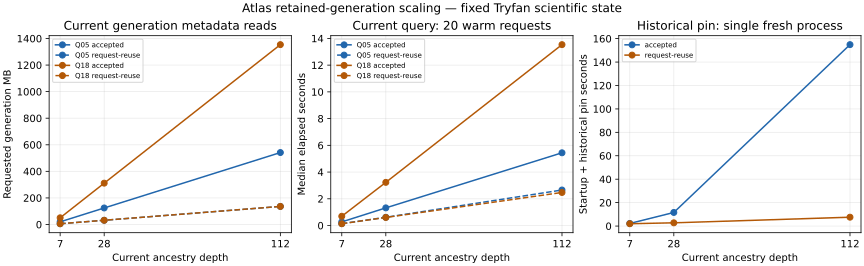

# Atlas retained generation metadata read-amplification and verified-reuse scaling

2026-10-08. Isolated architecture-evidence experiment after `c4f50a4`.

## 1. Executive result

**C - EXPERIMENT RESOLVED.** Request-scoped verified reuse preserves answers and failure semantics and substantially reduces duplicated work. It does not remove distinct ancestry cost: current serving still grows with history; historical published-membership lookup compounds whole-closure work. Shared metadata/component publication is strengthened as a provisional direction, while database and deployment choices remain deferred. Success means trustworthy architectural evidence, not good production performance. The accepted Tryfan pilot remains CLOSED / ACCEPTED; this is not another pilot slice or a production implementation.

## 2. Starting checkpoint

Clean `main` at `c4f50a40369c2e43c48cebb53c1de13b4c2bb4f3`; origin fetched, upstream `origin/main`, divergence 0/0. No newer commit or legitimate local work required accommodation. The [frozen baseline](atlas-generation-scaling-baseline.json) records identities and hashes before measurement. The checkpoint introducing this report is the experiment commit; historical assessments remain unchanged.

## 3. Target uncertainty

How much work is repeated within a serving request, and how much distinct ancestry verification remains after removing duplication? Does retained history force ordinary consumption and verified reuse to traverse progressively more whole metadata? The [prospective plan](../../scripts/atlas/generation-scaling/plan.json) freezes competing hypotheses, cases, failure semantics and metrics before the campaign.

## 4. Why the uncertainty matters

The [architecture assessment](atlas-measured-storage-processing-serving.md#38-smallest-next-bounded-experiment) found 31.8 MB synchronous requested Node reads for a 32.8 KB WorldCover answer, but only seven ancestors. It could not separate duplicate work from irreducible distinct-history work or justify a metadata layout/index from that one size. Source/native meaning, actual dependencies, rights and pinning must survive any mitigation.

## 5. What could change depending on the answer

If request reuse suffices, retain a simple catalogue/read context and postpone indexed metadata. If distinct ancestry still dominates, prioritize shared component manifests/selective publication metadata in a separately authorized proof. If integrity cannot be preserved, reject the adapter. These are the assessment's existing decision branches, not a new vendor-selection exercise. No database or production cache is introduced here.

## 6. Scope

Actual accepted S1-S4 read interfaces over isolated copies of the Tryfan metadata, extended only through administrative S1 publications. Fixed 9 km² support, five families, 310 source artifacts, six retained result revisions/four active results and unchanged methods. Three history depths, three queries and two paths; a small separately labelled metadata-only reference/reuse control. Source bytes remain in their existing archive.

## 7. Explicit exclusions

No new evidence/derivations, larger geographic support, terrain/Appearance research, Weather, Traverse, production Atlas, database, cloud, queue, workflow system, API, deployment, compaction, production indexing or S7. No private-data access, repository/licensing/naming change, payload capacity claim or distributed atomicity inference. No accepted pilot file, generation, root or scientific component is rewritten.

## 8. Authoritative foundations

[Measured direction](atlas-measured-storage-processing-serving.md), [decision branches](atlas-measured-architecture-decisions.json), [S6](tryfan-pilot-s6.md), [pilot plan](tryfan-regional-pilot-plan.md), [S1](tryfan-pilot-s1.md), [S2](tryfan-pilot-s2.md), [S3](tryfan-pilot-s3.md), [S4](tryfan-pilot-s4.md), [S5](tryfan-pilot-s5.md), [storage requirements](atlas-storage-processing-serving-requirements.md), [world-model synthesis](atlas-world-model-architecture-synthesis.md), [lifecycle](atlas-derived-understanding-lifecycle.md), [persistent proof](tryfan-local-persistent-proof.md) and [integrated proof](tryfan-qualified-query-proof.md). Frozen [Semantic Evidence](../atlas/semantic-evidence-contract.md) and [TerrainHierarchy](../atlas/terrain-hierarchy-contract.md) remain intact. Plan hashes pin the exact accepted loader/delivery/identity code and authoritative measurement receipts.

## 9. Accepted Tryfan baseline

Current generation `5f2c1b1f25c45ddea7e640f8c286a6caec5dc61aa55e8f678062bdc5704fca06`; seven retained generations (current plus six ancestors), 5,658,085 generation bytes, 328,020 locator bytes and 3,057,491 generated portrayal bytes. Five families/310 source artifacts/42,473,107 source bytes. S5 each update considered four active results, recomputed two summit results and reused two southern results; all310 source artifacts were reused. Its eight interruption cases and S1's three cases remain durable evidence, not rerun as this benchmark's workload.

## 10. Experiment model

`fixtures.mjs` copies exact generation/locator bytes and the two existing generated portrayals into a distinct external experiment root. S1 `register` appends deterministic same-evidence successors until depth 28/112. Only `parent` changes; source/product/representation, native knowledge, derivation records, update receipt and serving components remain identical. Administrative successors are not new observations/releases/recomputations. Original S1 validation, source hashing, writer lock, immutable addressing and atomic switch are used; staging is diagnostic only.

Primary operations execute the existing S4 delivery library, S2 native readers and S3 retained results. The accepted path is unchanged except counters. An experiment-process-only, SHA-guarded Node module hook substitutes read-only `load` in the reuse path. A request-local context hashes/validates/parses each distinct generation once, checks closure/cycles and selected canonical bytes, resolves locators and verifies required portrayals. Existing source-specific verification remains in place. Contexts expire between requests; no persistent trusted mutable-path cache exists. Supported consumer responses retain their generation identity and storage isolation.

## 11. Representativeness and limitations

The primary cases use real metadata, native evidence, query projections, provenance, policy/freshness and generation eligibility. Their only scale change is administrative ancestry. The reference controls are explicitly synthetic: hash-addressed metadata objects, stable logical item/source/product references, immutable full manifests and controlled revised object metadata. They do not represent scientific claims, raster bytes, geometry indexes, source releases or the complete pilot schema. They isolate reference count/reuse, not spatial query capacity. No control state is a published pilot generation.

## 12. Frozen hypotheses

H1: simple manifests/direct verified reuse remain sufficiently bounded over the tested range. H2: distinct metadata/ancestry cost remains structurally problematic after duplicate work is removed. H3: verification is a different scaling pressure from direct resolution/carrying references. H4 is reserved for another observed regime, not an assumed explanation. There is no invented production SLA. Judgement uses structural counts, correctness and scaling shape, with timings as bounded engineering observations.

## 13. Read-amplification definition

Successful synchronous Node `readFileSync` calls and returned bytes are grouped into generation files, locator maps, generated portrayals, external retained files and runtime/code metadata. Distinct generation paths are counted separately from repeat reads. Counters record `load` calls, parent edges traversed, generation SHA equality checks and frozen generation-validator calls. Ratios use requested metadata bytes per returned answer bytes where meaningful. These are logical requested reads, not physical disk reads, OS cache misses, total IO, Python reads, network bytes or billing.

## 14. Verified-reuse definition

S5 reuse means retaining exact evidence/results whose actual dependencies/applicability remain valid; it does not mean bypassing S1 validation. Registering a candidate checks its catalogue/assets and parent transition, including full retained-source hash verification. S4 consumption separately verifies generation ancestry, portrayal closure and source-specific availability/integrity.

Four costs are distinct: carrying a known immutable reference; reading/resolving it; verifying its expected metadata identity/content; and actual source/payload integrity work. The primary adapter does not cache source reads or `verifyArtifacts`; it verifies shared generation metadata once per request and portrayal closure once per selected generation. The synthetic reuse mode hashes each carried object's metadata, while reference copying performs no content hash. Neither is presented as a measurement of large source payloads.

## 15. Scaling dimensions

Primary history depths 7/28/112; fixed310 source artifacts and 100% scientific reuse; old/current generation pin. Supplement: 100/1,000/10,000 references,99% reuse;1,000 references at 50%/90%/99%; histories7/28/112. A labelled spread pattern contrasts localized metadata changes; locality is not independently crossed with history and no spatial-selectivity conclusion is drawn. Families, support, source bytes, methods, result count and temporal evidence are held fixed. Changing those is a different uncertainty.

## 16. Frozen experiment matrix

Eighteen primary cases are the deliberate 3 x 3 x 2 matrix in the [plan](../../scripts/atlas/generation-scaling/plan.json). Q05 native WorldCover uses summit BNG `[266405,359387]` and nominal time 2021; Q21 composed place evidence uses the same point with no fabricated common epoch; Q18 resolves the S4 qualified-lineage provenance reference. Each case has five fresh processes and 20 warm requests. Six supplementary single fresh historical pins select the real accepted generation explicitly, rather than silently upgrading to extended current. Seven reference controls use five repeated observations per mode. Reference controls do not expand the admitted scientific evidence set.

## 17. Instrumentation

[Runtime adapter/counters](../../scripts/atlas/generation-scaling/runtime.mjs), [fresh worker](../../scripts/atlas/generation-scaling/worker.mjs), [fixtures](../../scripts/atlas/generation-scaling/fixtures.mjs), [orchestration](../../scripts/atlas/generation-scaling/run.py) and [metadata-only control](../../scripts/atlas/generation-scaling/supplement.py) are outside pilot/production imports. The serving boundary is the existing delivery library; elapsed request time excludes HTTP/network transport. Startup/pin time is separate and includes native Python initialization. Observed Node RSS is not peak or total process-tree memory. Raw receipts stay external with hashes/paths in the compact [results](atlas-generation-scaling-results.json).

## 18. Repetition/noise methodology

Cases run sequentially; fixture construction is excluded from read timing. Five fresh processes lack in-process context/decoded-array state, but the OS file cache is not flushed. Twenty warm operations retain the accepted native worker/index arrays; each verification context still begins empty. Report medians/min/max/p95, not tiny differences as universal improvements. Publication append observations span different depths and are single observations per depth, not repeated trials of one fixed workload. One brief comparison diagnostic overlapped part of the28-generation campaign; logical counters are primary and timing spreads preserve noise.

The initial cross-depth comparison omitted generation addresses inside `provenanceRefs` arrays. The correction normalizes only a value equal to that request's actual generation ID, plus its generation-bearing URLs; historical/scientific revisions remain unchanged. This is comparison-only code after the timed operation. Original raw timing receipts remain byte-identical, and separate v2 equivalence receipts recheck every case. No timed loader, criterion, scientific result or accepted implementation was changed to improve the outcome.

## 19. Baseline measurements

Measured accepted Q05:26 generation reads/20,149,778 bytes;2 locator reads;4 portrayal reads;14 generation integrity checks. All synchronous requested Node reads total31,823,590bytes, matching S6. Reuse:7 generation reads/5,658,085 bytes;7 integrity checks. Warm medians271.20/139.60ms. Five fresh observations and 20 warm samples per variant remain separate.

The seven-generation accepted Q05 path reproduces the S6 logical read total despite the fixture changing storage category labels. Q05 here explicitly supplies 2021, so its returned byte count need not equal the earlier unqualified-time request's count. This is a controlled same-request comparison between variants, not byte identity with a different S6 query envelope.

## 20. Generation-count results

| Depth | Query | Generation reads accepted /reuse | Generation MB accepted /reuse | Warm median ms accepted /reuse |
|---:|---|---:|---:|---:|
|7|Q05|26 /7|20.15 /5.66|271.20 /139.60|
|7|Q21|26 /7|20.15 /5.66|395.42 /240.75|
|7|Q18|65 /7|50.37 /5.66|691.82 /131.82|
|28|Q05|110 /28|124.42 /31.72|1319.55 /614.90|
|28|Q21|110 /28|124.42 /31.72|1491.13 /714.34|
|28|Q18|275 /28|311.04 /31.72|3228.78 /601.71|
|112|Q05|446 /112|541.49 /135.99|5440.86 /2656.11|
|112|Q21|446 /112|541.49 /135.99|5512.32 /2652.79|
|112|Q18|1115 /112|1353.72 /135.99|13533.46 /2471.61|

These are measured medians of 20 operations per case. Q05/Q21 invoke two loads; Q18 invokes five. Distinct generation files equal depth in both paths. All final counter vectors and fresh/warm ranges are retained in the results; wall time is not a physical disk metric.

## 21. Manifest/reference-count results

| Control | History | References | Reuse | Unique metadata objects | Current manifest bytes | Direct current median ms | Reuse verification median ms /checks |
|---|---:|---:|---:|---:|---:|---:|---:|
|R1|28|100|99%|127|13,172|0.228|7.043 /99|
|R2|28|1,000|99%|1,270|131,083|1.418|101.146 /990|
|R3|28|10,000|99%|12,700|1,319,175|7.735|979.236 /9,900|
|R4|28|1,000|50%|14,500|131,574|0.771|39.508 /500|
|R5|28|1,000|90%|3,700|131,174|0.816|76.966 /900|
|R6|7|1,000|99%|1,060|131,073|0.780|103.726 /990|
|R7|112|1,000|99%|2,110|131,093|1.685|79.180 /990|

Five repeated observations per control mode. Every direct current/oldest lookup reads one manifest and one selected object; it inspects N references but follows zero ancestors. Full manifest parse/structural work is consistent with population growth, not history growth. Tiny differences between 1,000-reference cases are noisy; their logical operation counts are identical.

## 22. Reuse-ratio results

At 1,000 references/history 28, 50%/90%/99% reuse checks 500/900/990 immutable metadata objects. Median verification times 39.508/76.966/101.146ms are broadly consistent with reused-object count on this local filesystem. Unique retained object bodies are 14,500/3,700/1,270, respectively: high reuse reduces new object storage while increasing the number carried forward to verify. Manifest bodies remain about 131 KB each. Carry-reference mode copies 1,000 references and hashes zero bodies; it is not integrity verification or validation of a complete world model.

## 23. History-depth results

| Current depth | Selected historical depth | Accepted pin/startup s | Reuse pin/startup s | Accepted query s | Reuse query s | Accepted generation reads | Reuse reads |
|---:|---:|---:|---:|---:|---:|---:|---:|
|7|7|2.221|1.975|0.275|0.141|26|7|
|28|7|11.606|2.767|17.034|1.247|1,496|28|
|112|7|154.863|7.561|298.644|5.822|25,016|112|

Single fresh-process observations, not percentiles. At 112, the accepted old-generation query requests29,766,791,528 generation bytes. It visits only112 distinct generation files but repeatedly inspects their remaining closures. Both variants pin the exact retained accepted generation and report the extended current separately.

Current verified serving and explicit old-generation pinning have different call paths. The latter's published-membership search repeatedly loads parent closures on the accepted path. Retaining more files is not intrinsically the same as traversing more required ancestry. No directory scan is used; only the current parent chain is relevant. Metadata-only direct-ID controls retain all history while reading no ancestors; that isolates layout cost but does not replace the pilot's publication/integrity rules.

## 24. Normal-resolution results

The accepted ordinary serving path already includes integrity/ancestry work; `verify:false` disables the310-source full hash pass, not generation or portrayal validation. It is misleading to call it a raw constant-cost ID lookup. The supplementary direct-current/direct-oldest operations read one full manifest and one requested metadata object, structurally inspect its references and hash the bytes. Their cost depends on manifest population, not historical depth; they do not prove complete scientific/published closure eligibility.

## 25. Verified-reuse results

For Q05/Q21 accepted generation integrity checks are 14/56/224 at depths 7/28/112; Q18 has 35/140/560. Reuse checks exactly 7/28/112 for every query and every newly empty request. Once-per-file metadata verification removes repeated hash/validation, but still validates every ancestor.

Observed 112-depth warm Node RSS after requests: accepted maxima 392-443MB; reuse maxima 2,397-2,635MB. This is a significant prototype memory trade-off, not a peak/live-heap or leak claim. Retaining complete parsed ancestor bodies is not free. No memory optimization was implemented during measurement.

Reused metadata verification in the control is proportional to the number of reused objects, not the number changed. New/revised control objects receive content identities during setup; this mode measures reuse verification rather than all-generation validation. Source payload hashing and dependency-policy assessment are different operations. High reuse avoids payload duplication/recomputation but does not automatically reduce a validator that visits every retained snapshot.

## 26. Metadata-footprint results

| Depth | Published generation bytes | Locator bytes | Diagnostic staging bytes | Copied portrayal bytes |
|---:|---:|---:|---:|---:|
|7|5,658,085|328,020|0|3,057,491|
|28|31,724,986|1,312,080|27,050,961|3,057,491|
|112|135,992,590|5,248,320|135,254,805|3,057,491|

These are measured isolated fixture classes, not an enlarged scientific archive. Only generations/locators participate in historical metadata footprint. Staging remains diagnostic and unpublished; source bytes 42,473,107 are shared external inputs, not added again for each history.

Full generation metadata embeds repeated scientific components even with 100% scientific reuse. Source bytes are referenced and not copied into successive generations. Locator snapshots and retained diagnostic staging are reported separately from published generation metadata. The reference controls share immutable object bodies but retain full manifests, so manifest storage grows with history x reference population while unique object bodies grow with initial population plus changed metadata revisions. No compaction/GC is implemented or proposed as an excuse to delete replay history.

## 27. Publication-cost observations

| Depth at append | Validation ms | Atomic switch ms | Total register ms |
|---:|---:|---:|---:|
|8|611.76|4.27|699.33|
|28|1050.45|4.61|1133.25|
|8|629.89|4.35|724.53|
|112|3135.16|6.36|3241.79|

Single depth-specific construction observations; the repeated depth8 rows come from separate fixture prefixes. They are not fixed-depth repeated benchmarks. Complete parent-sensitive generation IDs reproduce; source/catalogue/knowledge/understanding/serving hashes remain identical across extended roots.

Actual S1 registration validates the candidate/source closure and loads/verifies its previous parent history before switching. Historical depth affects that validation path, even when no scientific object changes. The final same-directory pointer replacement remains a small separately timed operation. Cumulative fixture construction includes successive progressively deeper appends; it is not a production throughput measurement or cloud transaction proof.

## 28. Cold vs warm observations

| Depth | Query | Accepted startup median ms | Reuse startup median ms |
|---:|---|---:|---:|
|7|Q05|2110.56|1977.92|
|7|Q21|2127.83|1969.74|
|7|Q18|2113.60|1981.44|
|28|Q05|4370.40|2156.04|
|28|Q21|4282.88|2129.02|
|28|Q18|4278.19|2193.61|
|112|Q05|13166.17|4089.52|
|112|Q21|12796.72|4183.51|
|112|Q18|12971.72|4190.18|

Five actual process startups per cell; first-query timing is recorded separately. Startup is not a production service SLA. Raw ranges/min/max/p95 are available (conservative higher-order statistic; with20 samples p95 is the maximum); the counter vectors match warmed requests without a persistent verified-generation cache.

Fresh means a new process/reader reconstructed from persisted fixtures. Warm means existing service/native state, with a newly empty metadata-verification context on every request. OS caching cannot remove the counted logical traversals/hash/validation work. Warm source-array reuse does not make ancestry checks disappear. No physical cold disk/network experiment is claimed.

## 29. Scaling analysis

**H2 and H3 supported; H1 not supported for the accepted whole-ancestry interactive path.** With depth G and L internal loads, current accepted generation reads are exactly L(2G−1), generation integrity checks L G and parent traversals L(G−1). Observed L=2 for Q05/Q21 and 5 for Q18. Reuse reads/checks G distinct files and traverses G−1 edges. These operation counts, plus inspected code, establish linear current ancestry work within this model; measured timings are consistent with that shape, not a formal general performance bound.

Historical accepted membership lookup successively loads suffix closures. For current 112/select 7, one membership walk loads 106 snapshots and checks 6,307 generation bodies before context initialization; two such walks in the query produce25,016 file reads. The sum of suffix lengths is triangular, consistent with quadratic ancestry amplification for increasingly distant historical selection. Request reuse reduces distinct-file work to G but still canonicalizes selected ancestor snapshots and checks their portrayal state; it does not make history free.

H4 is not needed to replace these explanations. Observed RSS is a material trade-off of full parsed-ancestry retention, not proof of a leak/peak/live-heap or another dominant latency regime.

Q21 has the same current metadata read vector as Q05 and additional composed-answer work. Curves show sampled points only; historical timings are single observations.

Read footprint, stored footprint, verification work and publication work remain separate axes. The synthetic reference control provides a direct-resolution counterexample to the claim that history must always affect current reads; it does not establish that the full Atlas eligibility/integrity problem is solved by ignoring ancestry. The plotted points are observations, not fitted complexity guarantees.

## 30. Architectural interpretation

The simple immutable-reference principle remains viable; the accepted whole-snapshot/all-ancestor implementation is not an adequate preferred interactive shape at the tested history sizes. Removing duplicate work helps without changing scientific meaning, but 136 MB distinct metadata per current request and 2.4–2.6GB observed warm RSS in the reuse prototype justify a lighter shared-component representation before backend selection. Historical eligibility also needs a verified membership/ancestry view that does not repeatedly load complete suffixes. This can be ordinary manifests/rebuildable metadata structures; no graph database or workflow fleet is demanded.

The next proof must retain corruption/unavailability detection, rights/actual-use dependencies, current/historical pinning and orphan rejection. It may not obtain bounded reads by silently declaring archival ancestors trusted or deleting their semantics. This strengthens P01/P02 and the ordering of D01/D02 from c4f50a4; the historical assessment itself is preserved.

The immutable-reference/world-model direction is not invalidated by implementation overhead. Native meanings, source/result identity, actual-use dependencies, historical validity, freshness and pinned consumption remain supported. The experiment concerns how repeated/shared metadata is physically resolved and verified, not replacing those semantics. Final infrastructure is still deferred.

## 31. DECIDE NOW updates

**N07 — DECIDE NOW:** separate operation classes and permit verified immutable metadata sharing within a pinned request; preserve a fresh integrity boundary on the next request. **N08 — DECIDE NOW:** retain identity/provenance/history and selective scientific reuse; more publications do not justify payload duplication, blanket recomputation or orphan adoption. These are supported semantic/read responsibilities, not final storage products. See the [decision updates](atlas-generation-scaling-decisions.json).

## 32. PROVISIONAL DIRECTION updates

**P05 — PROVISIONAL DIRECTION:** shared immutable metadata components plus lightweight manifests, with bounded request memory rather than retaining repeated full scientific snapshots. **P06 — PROVISIONAL DIRECTION:** publication-membership/historical resolution via a verified view or lightweight ancestry entries. Exact component granularity, reachability/index construction and failure guarantees require the next retained proof; no such layout is implemented here.

## 33. DEFER PENDING EVIDENCE updates

**D06 — DEFER PENDING EVIDENCE:** final embedded/spatial relational store, index/checkpoint/compaction choice, component partition boundaries, many distinct scientific revisions, strong storage trust boundary, remote concurrency/durability, spatial/time selectivity, GC and cost/SLAs. Local fixed-evidence scaling does not select these. The reference control shows indexing is not inherently required merely because history exists, while N-cardinality parsing/verification still deserves separate evidence after component reuse.

## 34. REJECT updates

**R06 — REJECT:** repeated unbounded full-ancestor closure loading as the preferred interactive default; global trusted mutable-file caches or skipped checks as a benchmark shortcut; heavyweight graph/workflow/distributed infrastructure justified solely by these observations. This rejects a proposed scaling default, not the validity of the historically accepted pilot or its stronger integrity tests. Parent/delta/checkpoint/compaction alternatives were not implemented: the already-sanctioned request adapter and reference controls are sufficient to identify the next architectural uncertainty.

## 35. Remaining uncertainty

Many genuinely different scientific revisions/metadata components, component boundaries, cross-region dependencies/publication, selective spatial/temporal index cardinality, policy/method fan-out, simultaneous writers/readers, source object window reads, durable remote trust/failure boundaries, access/rights enforcement and retention/GC remain unmeasured. Synthetic reference objects do not answer these. No final relational/embedded/object vendor, cache/CDN, packing, queue or public API follows.

## 36. Risks

Confusing administrative history with physical change; treating requested bytes as disk/network costs; extrapolating tiny hash-addressed control records to DEM/imagery; warm trusted-path caching hiding corruption; prototype becoming production by inertia; moving hashes/rights/actual scopes out of canonical identity; losing orphan rejection or replay. Mitigations are frozen cases, labelled controls, per-request empty verification scopes, unchanged source checks, exact original-code guards, historical hashes, isolated fixture roots and separate failure tests. Manual mutation during an in-flight immutable request is outside the tested race model; between-request mutation must be detected.

## 37. Regression validation

Thirteen focused experiment tests pass: exact qualified parity, fresh verification scopes, missing portrayal, corrupt ancestor, mutation between requests, unknown/unpublished generation rejection, actual administrative publication with old/new pins, and native identity preservation. The [stage-aware regression receipt](atlas-generation-scaling-validation.json) is authoritative for the complete suite, source/protected hashes, historical bytes, 42 statuses and 113 protected production hashes. It uses established S1–S6, native, planning, frozen domain, qualified/persistent/Exe, browser, type, lint and build checks without changing historical validators/receipts. All accepted source files and canonical store hashes are checked again after regression.

Full regression count is recorded in that receipt. No missing production feature was added, no final infrastructure chosen, and no benchmark state/payload is tracked. The original comparison-only assertion stopped report assembly after recording every timing case; resumed assembly retains those raw files and verifies the corrected generation-address normalization separately. This is not a pilot or performance-path repair.

## 38. Decision A/B/C/D

**C - EXPERIMENT RESOLVED.** Request-scoped verified reuse preserves answers and failure semantics and substantially reduces duplicated work. It does not remove distinct ancestry cost: current serving still grows with history; historical published-membership lookup compounds whole-closure work. Shared metadata/component publication is strengthened as a provisional direction, while database and deployment choices remain deferred. Success means trustworthy architectural evidence, not good production performance.

## 39. Exactly one next bounded Atlas task

**Atlas retained component-manifest and publication-membership resolution proof.** One isolated proof of shared immutable scientific metadata components and lightweight publication/membership resolution against the same retained evidence. Test current/historical pins, once-per-distinct-component integrity, actual dependency/freshness/provenance equivalence, orphan rejection and a bounded existing retained applicability transition. Measure 7/28/112 histories and distinguish unique component count from publication count; preserve any required ancestor checks through explicit lightweight entries rather than quietly skipping them. This addresses the demonstrated history/duplication pressure before selecting indexing/database infrastructure. **NOT BEGUN.** No second recommendation, S7, production implementation or new evidence is authorized here.
