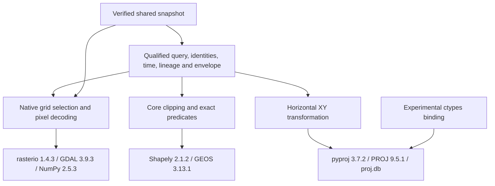

# Atlas portable reader geometry and CRS dependency feasibility

10 October 2026. Starting checkpoint `695b855c1440206f2082db28fe1eefbadba71e54`, public `main` / `origin/main`, fetched 0/0 and clean before changes.

## Executive result and frozen boundary

**PARTIALLY DEMONSTRATED.** One direct PROJ C-API binding reproduces the checked horizontal transformations and complete qualified read envelopes on this Windows host. Both the accepted native-window reader and the binding comparison pass all **60 unchanged cases across three pins**, including nine expected rejections per replay. There are **524 exact coordinate comparisons and 220 novel complete-envelope comparisons**. This demonstrates a replaceable binding to the **same PROJ engine**, not a replacement geometry engine, Python-free reader, mobile deployment or cross-platform numerical equivalence.

The finite [read contract](../atlas/portable-read-contract.md), [reference corpus](atlas-portable-read.md), [independent projection](atlas-portable-projection.md), [offline hardening](atlas-portable-projection-hardening.md), [shared-snapshot study](atlas-portable-projection-reduction.md) and [native-grid closure](atlas-native-grid-window.md) remain authoritative. The [frozen experiment design and commands](../../scripts/atlas/portable-spike/geometry-crs/README.md) preceded implementation. No accepted reader, builder, snapshot, verification, store, fixture, scientific contract or payload is modified.

Use the existing 77,412,208-byte window projection, identity `ec6308b7c195af38190eebd4239fcfbe32b416308e2404b80777c598538363f9`, prepared revision `357b28e705f7c2647cdf2d54467fc9ee851465814d8ed645cae30713ef9187bb`. The unchanged original projection is `a34ac6745abe92904d6af089ae8dff888d3527d6588c395ee3b03750d9e08a1c`, 116,692,961 bytes. Exact pins:

| Alias | Scientific generation | Qualified records / dependency edges |
|---|---|---|
| Before | `65989736a06f72182fba9d9ad9d47955869f51ce943ef120effcad2df91352fd` | 81 / 32 |
| After | `5d364e9947040f705699416e9094d8ad59463b5b2c2fcae2e3efdf79a7410289` | 81 / 32 |
| Legacy | `7f956d3bb640fb7262a3c46b1666306c88aff3418e966d39536882530350acf8` | 49 / 0 |

The Riffelhorn core is `[2624000,1091000,2626000,1093000]` in EPSG:2056. Native support has 38 full vector features and six raster bindings; whole-publication metadata also preserves Tryfan references and derived claims. No Exe spatial profile, arbitrary geometry query language, geodesic operation, vertical conversion or additional CRS is introduced. This study does not reinterpret the negative Swiss/AWS reconciliation.

## Operation-level capability inventory

Inventory comes from the actual [reader](../../scripts/atlas/portable-spike/reader.py), [window binding](../../scripts/atlas/portable-spike/native-window/window.py), [closure argument](../../scripts/atlas/portable-spike/native-window/closure.py), [verification](../../scripts/atlas/portable-spike/verification.py), [shared owner](../../scripts/atlas/portable-spike/reduction/shared.py) and [store](../../scripts/atlas/portable-spike/store.py).

| Operation | Required retained semantics | Present dependency / boundary |
|---|---|---|
| Request validation | Finite point/ordered area, explicit supported CRS, conjunctive filters; reject unsupported predicates rather than empty success | Python contract logic; no GIS requirement |
| Horizontal transform | EPSG:2056 ↔ EPSG:4326; CRS84 is the profile's longitude-first alias; explicitly `always_xy` | pyproj / PROJ / local database. No elevation transformation |
| Operation selection | Native-window enclosure is bound to the checked 9.5.1 pipeline; axis normalisation, database and grid availability matter | PROJ. Current operation metadata reports 1 m accuracy; this is not a new source-height accuracy claim |
| Area construction | Rectangle edges densified into 32 segments per edge before transformation; planar result clipped to the EPSG:2056 core | Shapely geometry construction / PROJ / GEOS; not a geodesic rectangle |
| Core selection | Point on core boundary is included; empty intersection gives supported empty selection; area with zero intersection area does not match | GEOS `intersection`, `covers`, area |
| Native vector point | Full polygons, holes and multipart geometry; outer and hole boundaries are covered, hole interiors are excluded | GEOS `covers`, not `contains` |
| Native vector area | Strictly positive intersection area; touching alone does not qualify. Bounds only narrow candidates | GEOS intersection/area; no bounding-box substitute |
| Geometry validity | Accepted preparation validates native features. Retained geometries are not repaired or rounded at read time | GEOS source validation and sealed bindings; not an arbitrary invalid-geometry API |
| Raster native support | Transform clipped query into the source CRS and intersect native bounds; preserve conservative support descriptor | PROJ / GEOS plus original raster metadata |
| Native point indexing | Original affine inverse, floor row/column, half-open pixel boundaries and original full-grid dimensions | rasterio/Affine; values are source-native, not interpolated |
| Native area window | Floor/ceil conservative window over exact intersected support; absolute row/column remain independent of stored crop offsets | affine indexing / rasterio window operations |
| DSM storage translation | Original 3,600 × 3,600 grid versus stored 366-column strip; all original rows, exact offsets/pixels | Window binding / GDAL decoding. No crop reindexing of scientific identity |
| WorldCover classification | Native categorical values at cell centres covered by exact query support; zero is unknown, not absence | NumPy indices/counts, GEOS vectorised covers, GDAL reads |
| Derived local scalar | Explicit anchor or consumed native-cell support; half-open cell point selection or positive-area intersection | GEOS plus accepted selectors; not a continuous interpolated terrain field |
| Metadata selection | Identity, family/class, time roles and knowledge filters retain unknown/absent distinctions | Qualified Python metadata logic; no intrinsic CRS or geometry dependency |
| Lineage and history | Exact revisions, direct/transitive dependency graph, generation membership and complete referenced documents | Graph/identity logic, not GIS. No generation fallback |
| Verification and ownership | Seals, schema/profile, geometry/raster/document/relationship closure; capture verified payloads before use | Hash/JSON validation, GDAL MemoryFiles, existing shared owner and store |

A height-area result describes support; it does not compute an arbitrary aggregate elevation. WorldCover's source year is not a dated field observation. Swiss DTM/LN02 and Copernicus DSM/EGM2008 remain distinct; the accepted DSM unit qualification remains unknown. The reader must preserve these fields even if a replacement kernel knows extra CRS information.

### Numerical and error compatibility

The required envelope includes query-specific documents and their content identities. Two topologically equivalent polygons can have different ring order, coordinate bits or serialised identities. Equivalent point membership alone is insufficient: preserve complete envelopes and array ordering. Do not snap, round, reduce precision or add tolerances to force agreement.

The retained CRS pipeline uses Swiss oblique Mercator, the checked Bessel/WGS84 Cartesian and Helmert steps, and explicit longitude/latitude output units. Installed operation definitions, database identity and network-disabled behaviour are recorded in [results.json](../../scripts/atlas/portable-spike/geometry-crs/results.json). A different datum operation, missing grid, axis convention or database may alter native cell selection, clipping or document hashes.

Reference GEOS diagnostics cover boundary inclusion, a hole and multipart polygon, edge-touching with zero area, a one-ULP positive sliver, empty overlap and a self-intersecting polygon. Invalid intersection raises a GEOS exception; it is not silently repaired. The accepted portable `outcome` wraps its declared `ReadError` outcomes, not every possible native exception. Sealed accepted source geometry is the supported population; arbitrary malformed geometry and transformation-domain errors need deliberate interface treatment before a production reader. The experimental binding raises `BindingError` for failed/nonfinite transforms and owns its native context; it does not silently turn failures into empty evidence or change accepted error semantics.

GEOS is a planar floating-point engine, not a CRS library or exact arithmetic guarantee ([GEOS FAQ](https://libgeos.org/usage/faq/)). These diagnostics describe the reference kernel only. No independent geometry implementation was tested.

## Dependency map, tools and allocation limits

Python 3.12.6, Windows 11 `10.0.26200`, NTFS, Intel i7-12700H, approximately 16 GiB RAM. Node 24.11.0, Java/javac 21.0.2 and .NET are available. No CMake, clang, GCC, Emscripten, Gradle, Android tooling or Xcode is on the checked PATH; this is not an exhaustive machine/device inventory. No `osgeo` Python binding or installed repository `jsts`, `proj4`, `geos-wasm`, `gdal3.js` package was found. Nothing was installed.

| Installed package and companion libraries | Bytes | Important content |
|---|---:|---|
| NumPy | 53,695,241 | Array kernels, OpenBLAS and runtime companions |
| Shapely | 6,365,854 | Python interface, GEOS and C-API DLLs |
| pyproj | 25,463,599 | Python binding, PROJ, SQLite, database and other DLLs |
| rasterio | 69,886,974 | GDAL, additional PROJ/GEOS copies, codecs and other driver dependencies |

Counts exclude distribution metadata and are installed wheel-directory inventories, not minimal packages, loaded-module totals or mobile binary estimates. GDAL's broad bundled driver closure is not proof that every DLL is required by this finite GeoTIFF profile. Opaque geometry/context objects from different bundled library copies must not be exchanged merely because names match.

There are 45,383 coordinates in 38 valid native vector features: 32 MultiPolygons and six Polygons. Their WKB totals 990,868 bytes; JSON member size is 5,386,941 bytes. WKB is a representation-size observation, not a GEOS heap measurement. Three generations share one installed projection and one captured owner; generation metadata and query envelopes still allocate separately.

## Credible deployment approaches

Primary documentation was checked **10 October 2026**. Current stable documentation may describe newer releases; the experiment instead checks the installed 9.5.1 header and binaries. Platform expectations below are documentation or engineering inference unless explicitly measured.

| Approach | Relevant capabilities and semantic risk | Desktop / Android / iOS | Dependencies, maintenance and local evidence |
|---|---|---|---|
| Existing Python GIS reader | Complete retained profile tested; strongest present reference | Windows measured; desktop wheel support documented; phone deployment untested | Python, array/geometry/CRS/raster bindings and native libraries. Preserve pinned versions, data and source notices |
| Established native GEOS + PROJ C APIs with a platform binding | Required planar predicates and horizontal transforms exposed; wrapper ownership, polygon serialisation and operation selection still require conformance | Direct PROJ binding measured on Windows only; Android/iOS builds and packaging untested | GEOS C ABI, PROJ plus database, target toolchain and an explicit raster path. Lower-risk provisional kernel direction, not a selected shared core |
| JTS geometry plus established CRS kernel | Covers/intersection/validity in source; precision/order can differ. SRID is not a transformation implementation | Java desktop/Android direction plausible; no local JTS experiment or iOS deployment evidence | Java geometry API plus a separately conformant CRS binding. Does not eliminate native dependency automatically |
| JSTS plus Proj4js | Documented geometry port and Swiss `somerc` projection code; no proof of exact overlay/order or the checked PROJ pipeline | JS desktop/browser possible; mobile embedding untested | Different numerical and geometry implementations, explicit definitions and licence review; absent locally |
| GEOS WebAssembly plus CRS/raster closure, or a GDAL WebAssembly bundle | Existing C-API wrapper/deployment projects; exact versions, exported operations, heaps and serialisation require comparison | Documented browser/Node paths; mobile host/build behaviour untested | WASM assets, runtime, explicit PROJ database/operation and decoding closure. Not a zero-dependency portable reader |

GEOS documents its stable [C interface and explicit ownership](https://libgeos.org/usage/c_api/); its [C-API reference](https://libgeos.org/doxygen/geos__c_8h.html) exposes the relevant predicates. A future binding should avoid reliance on the unstable C++ ABI. Availability in an API is not evidence of Atlas-equivalent polygon encoding or mobile packaging.

PROJ documents axis normalisation and transformation APIs ([functions](https://proj.org/en/stable/development/reference/functions.html)); the [9.5.1 header](https://raw.githubusercontent.com/OSGeo/PROJ/9.5.1/src/proj.h) fixes the structure/signatures used here. [Resource files](https://proj.org/en/stable/resource_files.html) and [build dependencies](https://proj.org/en/stable/install.html) make database, grid and optional-library choices explicit. A lean build may omit unused capabilities, but no lean binary was built or measured.

[Shapely installation](https://shapely.readthedocs.io/en/2.1.2/installation.html) and [pyproj installation](https://pyproj4.github.io/pyproj/stable/installation.html) document desktop distributions and native dependencies, not this study's Android/iOS suitability. JTS [project documentation](https://github.com/locationtech/jts) and [geometry source](https://raw.githubusercontent.com/locationtech/jts/master/modules/core/src/main/java/org/locationtech/jts/geom/Geometry.java) establish relevant operations. [JSTS](https://github.com/bjornharrtell/jsts) documents a port and precision caveats; its suggested precision reduction is not permission to alter Atlas values. [Proj4js](https://github.com/proj4js/proj4js) and its [somerc source](https://raw.githubusercontent.com/proj4js/proj4js/master/lib/projections/somerc.js) show a credible alternative to investigate, not identical datum-operation selection or arithmetic.

The [GEOS WASM wrapper](https://github.com/chrispahm/geos-wasm) exposes native geometry operations; its checked [package metadata](https://raw.githubusercontent.com/chrispahm/geos-wasm/main/package.json) declares GEOS 3.13.0 rather than the retained 3.13.1. [GDAL3.js](https://github.com/bugra9/gdal3.js) describes a larger GDAL/PROJ/GEOS asset bundle and raster operations, with different documented versions. Neither was downloaded or run. Advertised GIS support alone does not establish every required predicate or transformation, binary size, phone memory or offline closure.

## One bounded executable comparison

[NativeProj](../../scripts/atlas/portable-spike/geometry-crs/native_proj.py) uses standard-library ctypes to locate the already installed pyproj 3.7.2 wheel's PROJ 9.5.1 DLL and local database. It creates an owned sequential context, disables network, normalises axes, checks the forward operation against the accepted closure pipeline, and caches operations. It rejects unsupported CRS, nonfinite/misaligned coordinates, failed transforms and vertical requests. No custom transformation mathematics, second geometry adapter, new package or DLL copy is introduced.

Recorded DLL SHA256 is `f7c0e557890e501e33545c3406f167810faed118c79b6c0de25100b29058af80`; 9,261,056-byte database SHA256 is `47a7205d83ba6b7774b763f276ab57331f4dade2b2cfbcc0d486677e6543350b`. These identify the tested toolchain, not authenticated installation or future mutation protection for host dependencies.

A scoped, restored callback substitutes only `reader.projected` during sequential comparisons. The accepted Shapely/GEOS, raster decoding, qualified filtering, snapshots and envelopes remain in use. The frozen adapter invokes existing replay logic; expected answers are comparison targets only, never query data. Novel queries block `pyproj.Transformer.from_crs` while the alternative callback runs, checking that the query uses the C API. A separate direct-XY process does not import NumPy, Shapely, rasterio or pyproj's Python module. The full accepted reader still imports these modules for other responsibilities. This does not demonstrate independence from the PROJ wheel's native resources or removal of Python.

| Comparison | Exact passes | Failed / skipped | Interpretation |
|---|---:|---:|---|
| Accepted window reader, one fresh frozen replay | 60 | 0 / 0 | Three pins; nine expected query errors |
| Direct PROJ callback, one fresh frozen replay | 60 | 0 / 0 | Complete envelopes; same engine, new binding |
| Four transform/alias comparisons at 131 points | 524 coordinate pairs | 0 / 0 | Forward, two reverse aliases and geographic identity |
| Novel query/lineage envelopes across three pins | 220 | 0 / 0 | Deterministic seed 20261010; not frozen request copies |

Novel cases cover arbitrary core points, corners/Swiss tile seams, geographic aliases, original DSM cell boundaries and representable neighbours, oversized/partially intersecting/sliver areas, unknown time/knowledge, conjunction, absent identity, unsupported CRS/query and lineage. An independently calculated DSM cell-centre anchor returns original row 70 / column 2740 and the unchanged unknown unit qualification. Existing native-window tests add 436 novel comparisons and the shared-reader tests add 159; these are separate retained regression evidence, not new kernel independence.

No numerical tolerance was needed: tested values/envelopes agree exactly. Zero unexplained differences were observed. Independent GEOS/JTS/JSTS/WASM results, cross-build arithmetic and all mobile cases are **not executable with the available local packages/toolchains** and are not counted as passes or skips in the completed Windows suites. Arbitrary invalid geometry is outside the public query profile; the synthetic diagnostics do not enlarge it.

## Resource observations

[Raw path-free receipts](../../scripts/atlas/portable-spike/geometry-crs/results.json) retain exact versions, DLL inventories, trials and case counts. Three fresh sequential processes per binding/view count, same window files, retained OS storage caches; 15 warm queries per kind/pin. This is process-cold, not storage-cold. Opening measures unchanged verified owner plus pinned views **before** constructing the experimental CRS context; direct context setup is measured separately. Results are desktop working sets, not heap attribution or mobile predictions.

| Mode | Owner/view open median (range), ms | Peak working set median (range), decimal MB |
|---|---|---|
| Reference, one pin | 1,101.0 (1,072.3–1,186.3) | 321.00 (320.93–321.54) |
| Reference, three shared pins | 1,112.8 (1,070.1–1,134.1) | 321.19 (320.72–321.50) |
| C-API callback, one pin | 1,108.2 (1,099.2–1,184.9) | 320.94 (320.67–321.40) |
| C-API callback, three shared pins | 1,074.7 (1,065.9–1,161.3) | 321.25 (320.88–321.27) |

No material full-reader memory reduction is established. Order-dependent median current working sets in separate sequential import trials are 25.12 MB standard library, 34.55 MB after NumPy, 37.06 MB after Shapely, 52.44 MB after pyproj plus a resolved transform, 66.26 MB after rasterio. The direct-XY-only process reaches 36.65 MB current / 39.16 MB peak. These observations do not assign all remaining memory to rasters or all 321 MB to geometry/CRS: verification buffers, JSON/documents, decoded arrays, captured raster bytes, native caches and allocator retention also contribute. Per-kernel allocation profiling was not performed.

For three views, median-of-trial warm medians in milliseconds are reference/C-API: point **12.18 / 9.84**, area **16.78 / 13.74**, identity **1.11 / 1.10**, lineage **13.71 / 13.49**. Cached direct operations reduce repeated construction work in some queries. Conversely, 2,000 cached coordinate pairs take **0.805 / 1.719 ms** median across three trials of 30 repetitions: ctypes array construction/checking is included. This is not evidence that a new language or binding is uniformly faster.

No projection member changes, package copies or new installation overhead are introduced by this adapter. Existing store tests rerun staged/final verification, interruption, failed replacement, restart, deletion and post-open mutation. Captured data remain stable for open readers; reopen rejects changed package members. Shared pinned views retain the accepted ownership rules. Runtime DLL/database mutation, hostile concurrent writers, OS power-loss durability and mobile filesystem behaviour remain unproven. No one-time package hash is claimed to protect a mutable future runtime dependency.

## Rights and redistribution considerations

Code and data permissions are separate. Installed licence metadata and primary records were checked on 10 October 2026; no legal clearance, mobile redistribution or publication permission is asserted.

| Component | Evidence and obligations requiring preservation/review |
|---|---|
| GEOS | Retained [3.13.1 COPYING](https://github.com/libgeos/geos/blob/3.13.1/COPYING) supplies LGPL terms; linking, source/relinking obligations and signed mobile distribution need a concrete legal/build review |
| PROJ | [9.5.1 COPYING](https://github.com/OSGeo/PROJ/blob/9.5.1/COPYING) is permissive with notices. Database/grids and bundled dependencies require their own inventory; no blanket raster-data permission |
| Python and bindings | NumPy installed expression includes BSD-3-Clause, 0BSD, MIT, Zlib and CC0-1.0; Shapely BSD-3-Clause plus GEOS/Windows notices; pyproj MIT plus PROJ; rasterio BSD plus GDAL and bundled components. Preserve exact distribution licence files |
| GDAL / codecs / runtime libraries | [GDAL licence](https://gdal.org/en/stable/license.html) describes MIT-style core terms and component distinctions. OpenBLAS, codec, database, SSL and compiler runtime conditions need the actual shipped subset; no single wheel label clears all DLLs |
| JTS / JSTS | JTS offers [EDL](https://github.com/locationtech/jts/blob/master/LICENSE_EDLv1.txt) / [EPL](https://github.com/locationtech/jts/blob/master/LICENSE_EPLv2.txt) choices; JSTS has [EDL terms](https://raw.githubusercontent.com/bjornharrtell/jsts/master/LICENSE_EDLv1.txt). Confirm selected release/files before redistribution |
| Proj4js | [MIT notice](https://raw.githubusercontent.com/proj4js/proj4js/master/LICENSE.md); transformation definitions/grid rights are a separate question |
| WASM wrappers | Checked GEOS WASM package metadata declares **LGPL-3.0-or-later**, distinct from GEOS's own terms. GDAL3.js [licence](https://raw.githubusercontent.com/bugra9/gdal3.js/master/LICENSE) declares LGPL-2.1-or-later. Generated assets/underlying libraries must be reviewed separately |
| Scientific projection | Existing source rights, attribution and modification notices remain unchanged: [source-by-source resource review](atlas-portable-projection-reduction.md) and [native-window rights assessment](atlas-native-grid-window.md). Cropped Copernicus bytes are modified storage, not the original source; Swiss and WorldCover obligations are not waived by a new reader |

No binaries, database or generated raster are committed. Public availability and successful local tests do not clear offline redistribution. The public project's own reuse/distribution gate in Foundations remains open.

## Provisional architecture and exact prerequisites

Keep qualified identities, revision/time roles, support, source/grid/datum qualifications, rights, graph relationships and envelopes in the scientific read layer. Define a few explicit scientific responsibilities before replacing bindings:

1. **Horizontal XY transformation:** explicit source/target, axis convention, operation/database identity and failure; no implicit vertical conversion or remote grid lookup.
2. **Query geometry and predicates:** prescribed densification and core clipping, boundary-inclusive point covers, strictly positive-area overlap, holes/multipart and centre masks; preserve produced geometry identity/ordering.
3. **Native grid selection and decoding:** original affine/index/extent, crop-offset translation, nodata and exact values; verified snapshot ownership is separate from decoder implementation.

These are proposed responsibilities, not implemented production interfaces or a plugin framework. Metadata-only identity/time/lineage queries need no inherent GIS kernel. Preparation can export already validated full geometry, source qualifications and native descriptors. Arbitrary valid runtime points/areas still need transform, clipping, exact predicates and categorical cell selection; precomputing the 60 answers cannot replace them.

**DECIDE NOW:** the checked PROJ C API is a credible binding boundary; pin operation/resources and preserve complete-envelope conformance. Keep the retained reader as reference. **PROVISIONAL DIRECTION:** established native GEOS/PROJ kernels are the lowest currently evidenced semantic-risk candidate, with replaceable bindings. **DEFER:** implementation language, shared core, mobile framework, renderer, final offline format and target packaging. **REJECT:** approximate bounds as exact geometry, precision changes, inferred datum/time knowledge, empty success on integrity failure and removal of libraries merely for a smaller dependency count.

Revisit when kernel/database/grid versions, operation selection, polygon serialisation, native encoding or target arithmetic changes; compare frozen envelopes, native anchors, novel boundaries and declared-profile closure. Stable C APIs reduce ABI risk, not scientific-version risk. A materially smaller measured closure or a semantic discrepancy is a reason for another bounded comparison, not a contract rewrite.

Mobile/native-build prerequisites are precise: select an explicitly authorised target/architecture and available compiler, pin GEOS/PROJ/database/required decoding components, identify licence/notice/linkage requirements and shipped binary closure, disable hidden network access, test ownership/error translation/serialisation, then rerun conformance and offline lifecycle. Physical Android/iOS hardware is subsequently needed for actual memory, performance, thermal, suspension and storage measurements. No such builds, devices or SDK installations were attempted here. F03/F12 gain binding evidence; F04/F11/F17 and mobile/offline guarantees remain open.

## Validation and preservation

**52/52 preservation, scope, receipt, resource and navigation safeguards passed.** All 1,179 existing files outside the seven append-only navigation notes remain unchanged. The bounded change adds one report and six isolated driver/receipt files. The owned, uncommitted checker compares repository and retained-data hashes, fixture/projection seals, exact pins, test receipts, links and whitespace.

**368 runner tests passed, 0 failed / skipped:** 5 new binding/behaviour tests, 44 accepted reader/hardening/lifecycle tests, 8 native-window tests, 9 shared-owner tests, 31 authoritative native-reader tests, 12 fixture tests and 259 Atlas runtime/lifecycle/registration/retrieval tests. Frozen replays are counted separately: accepted window 60/60, C-API comparison 60/60 and authoritative runtime 60/60 with 120 indexed/full comparisons. All nine expected rejections pass in each replay.

Executed commands include the driver commands linked above; `python -B -m unittest discover` for the accepted spike, `native-window`, `reduction` and new `geometry-crs` directories; `python -B scripts/atlas/riffelhorn-retrieval/test_query.py`; `node --test scripts/atlas/read-conformance/test-fixtures.mjs`; `node --test runtime/atlas/test-runtime.mjs runtime/atlas/test-lifecycle.mjs runtime/atlas/test-registration.mjs runtime/atlas/test-retrieval.mjs`; and `node scripts/atlas/read-conformance/run.mjs --config LOCAL_CONFIG_JSON`. Explicit external projection/configuration paths are required, as in the linked reproduction instructions.

`npm.cmd run lint`, `node node_modules/typescript/bin/tsc -b --pretty false` and the application-only Vite build passed. The executed build is `node node_modules/vite/bin/vite.js build --config EXISTING_APP_ONLY_CONFIG`; the existing external Vite configuration excludes Weather processing and public-data copying. Existing NumPy deprecation and Vite large-chunk warnings remain; they do not constitute changed scientific results. No accepted projection was regenerated because its representation is unchanged; every member is checked against its seal and the previous independent regeneration.

The full Weather/data-materialising build, unrelated UI suites, mobile/emulator tests, native cross-builds, different geometry kernels, storage-cold trials, power cuts, hostile concurrent mutation and rights-release certification were **not run**. Unchanged projection identities/member seals, twelve original input fingerprints, retained stores/publications, 42 canonical status rows, 113 production hashes, all accepted scientific files and negative reconciliation are independently checked. No private access, geographical acquisition, endpoint, paid resource or production change occurs. Final diff, scope, links and whitespace are reviewed before commit.

## Exactly one subsequent bounded task — NOT BEGUN

**MERIDIAN ATLAS NATIVE GEOMETRY C-API CONFORMANCE SPIKE — NOT BEGUN.**

Uncertainty: can a narrow binding to the locally installed reference GEOS C API preserve the required clipping, covers, positive-area, holes/multipart and serialised geometry identities without relying on Shapely's query binding? It matters because PROJ binding equivalence is now measured, while geometry binding ownership/encoding remains untested. Starting evidence: unchanged profile, 60 cases/three pins, verified window/shared owner, this operation inventory and adversarial diagnostics. Scope: one isolated existing-kernel binding comparison, complete envelopes and novel geometric boundaries, explicit ownership/errors and resource observations; no custom engine, new toolchain, mobile deployment, private access, package change or production replacement. Deliver reproducible results and a precise compatibility verdict. Acceptance: exact scientific envelopes and no weakened predicates or unexplained geometry differences; otherwise report the responsible operation and stop. Stop after that bounded result or a precise prerequisite blocker. This task has not begun.
