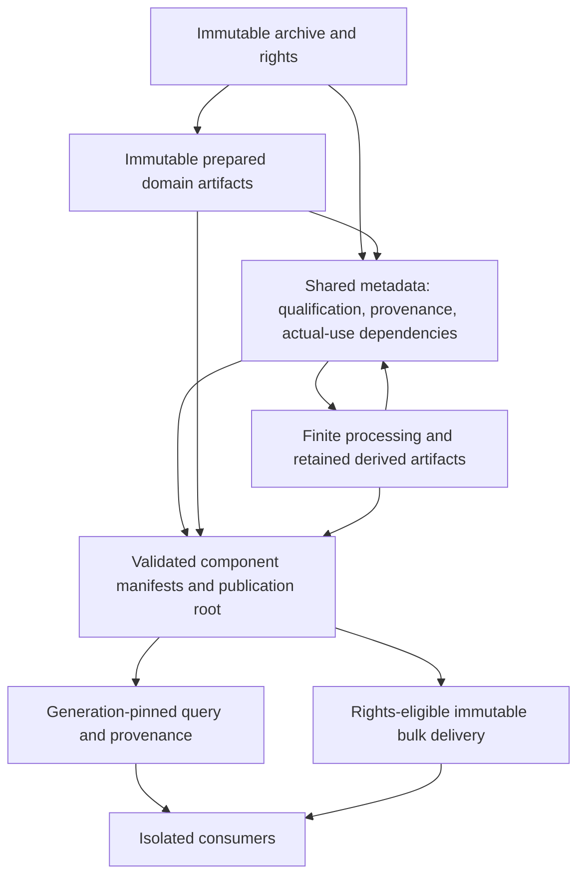

# Atlas measured storage, processing and serving architecture assessment

## 1. Executive result

**C - ARCHITECTURE DIRECTION ESTABLISHED.** The accepted Tryfan pilot supports immutable payload objects/files; shared structured metadata for qualification, provenance and dependencies; reproducible finite processing; lightweight publication manifests; and generation-pinned serving. These are responsibilities before products. Final database, cloud, packaging, distributed execution and global partition choices remain open. No production architecture is implemented or authorized by this conclusion.

The immediate uncertainty is repeated metadata/ancestor verification and parsing, not absence of a named database. The pilot requests 31,823,590 synchronous Node read bytes for a 32,836-byte WorldCover answer. The four-reader workload increases latency without materially increasing throughput. Exactly one follow-up experiment is specified in section 38, not started.

## 2. Starting checkpoint

Started clean `main` at `bae7c3e01f03ba91d0d780fedc61593467a022b3`; fetched origin, which remained at that commit; upstream `origin/main`, divergence 0/0. No legitimate work discarded. The bounded Tryfan pilot is **CLOSED / ACCEPTED**. S1–S5 remain SUCCESS; S6 remains **C - PILOT EXIT ACCEPTED**. This is a new programme assessment, not S7.

## 3. Objective

Determine what established semantics and measured behaviour imply for storage, processing and serving; what can be decided now; and what needs scale evidence. Requirements and scaling pressures precede technology evaluation in section 29. A direction is not a deployment choice.

## 4. Scope

Read-only synthesis of accepted receipts and current architectural boundaries. [Evidence inventory](atlas-measured-architecture-evidence.json) records deterministic extraction, JSON pointers and hashes. [Decision records](atlas-measured-architecture-decisions.json) classify conclusions and the proposed experiment. [Tooling](../../scripts/atlas/measured-architecture/README.md) checks arithmetic/traceability and established regressions; it does not benchmark or alter the pilot.

## 5. Explicit exclusions

No backend, database, queue, API, scheduler, deployment, runtime migration, data acquisition, derivation or post-assessment experiment. Production Atlas/Weather/Traverse unchanged. No private-data access, Appearance work, multiview unpark, proprietary method or repository/licensing/naming reorganization. No global performance/cost/SLA invention.

## 6. Authoritative foundations

| Checkpoint | Retained evidence | Architectural contribution |
|---|---|---|
| `bae7c3e` | [S6](tryfan-pilot-s6.md), [results](tryfan-pilot-s6-results.json), [baseline](tryfan-pilot-s6-baseline.json), [validation](tryfan-pilot-s6-validation.json) | Accepted composition, measurements and limitations |
| `7809147` / `f16ce63` | [plan](tryfan-regional-pilot-plan.md), [admission](atlas-regional-pilot-acceptance.md) | Prospective scope/ADRs and gates |
| `b5ac715`–`fc441c5` | [S1](tryfan-pilot-s1.md), [S2](tryfan-pilot-s2.md), [S3](tryfan-pilot-s3.md), [S4](tryfan-pilot-s4.md), [S5](tryfan-pilot-s5.md) | Registration, native reading, lifecycle, isolation, scoped publication |
| `3c143eb` | [requirements](atlas-storage-processing-serving-requirements.md), [earlier measurements](atlas-storage-requirements-measurements.json) | Logical tiers and larger retained payload counts |
| `6e17e79` / `43afe78` | [world model](atlas-world-model-architecture-synthesis.md), [lifecycle](atlas-derived-understanding-lifecycle.md) | Actual-use dependencies and qualification |
| `691450f` / `1c2d10e` | [persistent proof](tryfan-local-persistent-proof.md), [qualified proof](tryfan-qualified-query-proof.md) | Restart/replay, snapshot and scope behaviour |
| `53d75f2` / `e65c2d6` | [TerrainHierarchy](../atlas/terrain-hierarchy-contract.md), [Semantic Evidence v1](../atlas/semantic-evidence-contract.md) | Frozen domain constraints |

Production remains browser-owned MapLibre consumption. [Visual policy](../../src/atlas/map/visualTerrainConfig.ts) selects common hosted terrain at setup; [delivery adapter](../../src/atlas/map/terrainDeliveryAdapter.ts) checks product/hierarchy identity; [analytical sampler](../../src/atlas/terrain/terrainElevationSampler.ts) has separate AWS policy,96 decoded-tile bound and concurrency 6; [satellite provider](../../src/atlas/map/satelliteProvider.ts) owns MapTiler configuration. These bounds are not universal budgets. Hosted lineage remains partly unpinned; the pilot does not retrospectively pin it or replace production.

## 7. Accepted Tryfan evidence baseline

Core EPSG:27700 `[264900,357800,267900,360800]`,9 km²; west/south included, east/north excluded. Source-native CRS/support remain distinct from EPSG:3857 delivery. Five sources/products, eight representations,310 selected artifacts/42,473,107 bytes: retained AWS common tiles/receipt; Welsh regional-v 2 source and 295 z14–17 tiles; WorldCover2021v200 native 334×554 window; 193 NRW Phase 1 features; July 12,2026 Sentinel- 2/Lab010 source/prepared/display products. This is a subset, not an archive census.

Current `5f2c1b1f25c45ddea7e640f8c286a6caec5dc61aa55e8f678062bdc5704fca06`; seven ancestry generations preserve registration/common/regional history. Native knowledge has 50 definitions,34 mappings, four resource records, two collections. WorldCover 185,036 cells use shared templates; NRW has 28 native strings. Two slope→ratio chains have six retained revisions/four active results/two methods. No regional slope grid exists.

## 8. Measured evidence inventory

**MEASURED** is a retained receipt/count with its scope; **DERIVED FROM MEASUREMENTS** is explicit arithmetic; **ESTIMATED** is an illustrative model; **UNKNOWN** is absent evidence. JSON preserves exact precision; rounded report figures are not capacity predictions. Windows/i7-12700H/20 logical cores/Node 24.11; warm OS caches, no query/byte cache. Fresh process is not cold disk.

| Classification | Observation | Value and scope |
|---|---|---|
| MEASURED | Retained/terrain payloads |310 /42,473,107 bytes; 295 Welsh tiles /23,889,573 bytes |
| MEASURED | Current catalogue/knowledge/understanding/serving |324,627 /624,956 /104,433 /118,679 bytes; already inside generation, not additive extra storage |
| MEASURED | Seven generation files /locators |5,658,085 /328,020 bytes |
| MEASURED | Generated portrayal/staging |2 files 3,057,491 bytes; 28 staging files 9,576,561 bytes unpublished |
| MEASURED | Initial S6 acceptance footprint |81 files 37,939,408 bytes; separate diagnostics, excludes later follow-up additions |
| MEASURED | Five fresh verified load/service/consumer runs |348.81–363.10 ms /1.928–2.076 s /1.570–1.682 s; 446,238-byte consumer answer |
| MEASURED | S2 native initialized medians |WC 1.211/NRW 1.163/coexistence 1.188 ms,30 requests; excludes serving validation |
| MEASURED | S6 warm served medians |WC 262.56/NRW 266.32/slope 288.96/ratio 291.68/composed 373.51 ms,20 samples each |
| MEASURED | Full ordinary query matrix |20 batches 480 requests 145.85 s,0 errors; Q17 fixture separately tested; Q18 provenance median 666.93 ms |
| MEASURED | One/four-reader workload |100 TOTAL requests each; median 254.71/1058.41 ms, p95 289.81/1190.04 ms; elapsed 25.882/26.462 s,0 errors |
| MEASURED | Freshness/exact replay |20-run median 17.19 ms; six revisions 477.20 ms full replay; sampler 120.45 ms/320,857 tile bytes |
| MEASURED | U1/U2 assembly/validation/switch |1207.62/1271.26 ms; 566.77/594.28 ms; 18.09/16.01 ms, single observations |
| MEASURED | Selective work, each update |consider 4/recompute 2/reuse 2; changed source artifacts 0/reused 310; sampler 111.40/112.43 ms,112,921 tile bytes |
| MEASURED | Interruptions |S1 three; S5 eight; S6 repeats eight; old root/fresh consumers intact; incomplete/orphans rejected |
| MEASURED | Historical cold context/body read |2562.73/2.18 ms; body read is not full query latency |
| MEASURED | Builds/end-to-end |two empty builds 7.562–8.006 s; 219.878 s acceptance; 124.835 s repeated logical run with update reuse |
| MEASURED | Observed memory |Node RSS 313.63 MB initial/374.82 MB follow-up; actual Python worker 85.27 MB, launcher 5.02 MB separate; not peak/aggregate |
| MEASURED | Synchronous Node request reads |26 generation reads 20,149,778 bytes; other categories 11,673,812; response 32,836; 21 samples same counts |
| DERIVED FROM MEASUREMENTS | Read amplification/throughput |31,823,590/32,836 =969.17×; 3.86/3.78 requests/s; neither disk IO nor production capacity |
| DERIVED FROM MEASUREMENTS | Recompute share |2/4 =50% of tiny active set; not global fan-out |
| ESTIMATED | Resolution illustration |Half spacing on equal filled area yields 4×native samples; no compressed/compute prediction |
| UNKNOWN | Global/cardinality/WAN/peak scratch/writers |No invented values |

Per-family selected footprint, **DERIVED FROM MEASUREMENTS** by summing the distinct registered artifact lengths in the immutable current catalogue. All groups are disjoint here and total310 files/42,473,107 bytes; this is not five complete original source archives. The [frozen asset table](tryfan-regional-pilot-plan.md#6-included-evidence-families) supplies exact inputs/hashes.

| Retained family | Files /bytes | Input versus prepared/metadata composition |
|---|---:|---|
| Welsh regional |297 /39,615,659 |1 source15,639,072;295 prepared tiles23,889,573;1 manifest87,014 bytes |
| Common AWS |4 /273,948 |3 retained delivery tiles273,242;1 coarse provenance receipt706 bytes |
| WorldCover |1 /4,918 |Native assignment window;not the complete global source tile |
| NRW |1 /558,917 |193 native feature extract;not full national inventory |
| Sentinel/Lab010 |7 /2,019,665 |4 native band/SCL windows714,544;3 prepared/float/display products1,305,121 bytes |

Earlier stat-checked receipts extend **payload-count evidence**, not integrated query capacity: Swiss 100 km²11,429 tiles/930,914,852 bytes/1.90 MB manifest; Copernicus 2,730 tiles/327,636,998 bytes; SWISSIMAGE 542 delivery objects 269,852,875 bytes/working fields 1,294,380,168 bytes. Source sizes include Swiss 1,667,166,026 bytes and imagery 186,259,028 bytes; historical builds~100–770 s under different conditions. These are separate earlier products, not new or pilot evidence. No imagery experiment is performed.

## 9. Atlas architectural invariants

N01–N06 preserve archive immutability; exact source/product/representation/result revisions; identity versus locator; native meaning/mapping loss; feature versus state; spatial support/scale/CRS; separate observation/survey/event/reference/release times; rights and honest gaps. Physical question/method/result stay distinct. Dependencies include actual uses/halos/discovery context. Freshness is policy-relative; stale is not false, fresh is not validation. Refinement permits coexistence/scoped preference. History survives cache/materialization changes; incomplete publications remain invisible; consumers pin coherent state.

Earlier requirements define five responsibilities: archive; prepared representations; knowledge/provenance; derived materializations; serving/cache encodings. The pilot's six conceptual layers separate qualified knowledge, derived understanding and query responsibilities. Both decompositions are compatible; neither mandates five/six physical systems.

## 10. Workload model

| Class | Reads /keys | Write/retention pressure |
|---|---|---|
| Archive |Exact artifact/native windows/features, terms |Arrival/correction adds revision; large checksum/recovery cost |
| Prepared |Product/family/level/tile/native selector |Batch preparation, scoped replacement; reusable payloads/receipts |
| Knowledge |Place/property/support/time/reference/feature/native term |Shared definitions/bindings; revisioned claims; exact spatial filtering |
| Derived |Question/method/parameters/input use/policy |Cheap/expensive materialization, exact edges, current assessment separate |
| Serving |Pin then immutable bulk/qualified queries |Latency, cancellation, cache eligibility; history/provenance differ from viewport |

Cardinality is not simply geographic pixels. Dense assignments share definitions, irregular vectors retain feature identity, results arise for specified questions. Structured records and payload volume are independent.

## 11. Scaling dimensions

| Independent dimension | Tryfan measured | Pressure /unsafe extrapolation |
|---|---|---|
| Area |9 km²; earlier 100 km² payload receipts |More support/objects; area cannot predict claims/request rate |
| Resolution |1 m terrain/angular cover/10–20 m observations |RoughA/r² samples; no universal accuracy/compression |
| Families |5 |Adapters/shared IDs work; arbitrary semantics unproven |
| Source revisions |Fixed observations/applicability changes |Revision≠bytes; independent scientific cadence unknown |
| Generations |7 ancestors |Whole history parsing/storage grows; isolate ancestry axis |
| Derivation methods |2 explicit method identities |Method revisions can stale selected results; arbitrary methods/scheduling unknown |
| Derived properties |Slope and planar area ratio at two probes |Question cardinality and parameter reuse affect materialization; regional property fields unmeasured |
| Dependency fan-out |Two chains, four active/six total |Scoped receipts useful; large traversal/selectivity unknown |
| Temporal resolution |Annual/historic/dated scene |Time axes distinct; no dense-dynamics capacity |
| Update cadence |FiniteU 1/U2 |Selective work; continuous backlog unknown |
| Publication cadence |Finite serialized switches |Root concept; contention/independent regions unknown |
| Consumers |1/4 readers |One-worker serialization; many-user capacity unknown |
| Request rate |100 per reader-count workload |Observed~3.8/s only; mix/WAN differ |
| Source object size |Sub-KB to 15.64 MB in pilot; earlierGB sources |Window/stream access; not all source inRAM |
| Prepared size/count |295 tiles; earlier 11,429 |Packing/listing/seek trade-off unmeasured |
| Cache size |No query/byte cache, native array reuse |Context keys; hit distribution unknown |
| Expensive compute |Two-probe Horn/ratio |Resource separation; no fusion/Weather extrapolation |
| Index selectivity |193-feature bbox scan |Candidates then exactgeometry; national density unknown |
| Rights variation |Retained public/research metadata |Eligibility per source/region; restricted workload absent |

History can grow with geography/evidence fixed. That is the smallest immediate scaling control; do not treat one vaguely defined scale factor as sufficient.

## 12. Source/archive requirements

Immutable hashed inputs and logical revisions; replaceable locators. Identical bytes do not prove unchanged applicability/rights, relocation does not change source identity. Preserve acquisition/survey/reference uncertainty, original CRS/vertical metadata and upstream incompleteness. Tiny records toGB raster objects require different granular reads/checksums.

Ordinary file/object payload storage is adequate as a responsibility. Retention follows promised replay/recovery and permissions, not universal forever. Missing/corrupt evidence fails explicitly; no silent live substitution or repair. Metadata/rights can share catalogue infrastructure but remain linked to exact source revision.

## 13. Prepared-representation requirements

Artifacts retain source/method/configuration identity, support and scale. Rebuild from canonical inputs/receipts only where determinism/equivalence is established. Terrain family/level/selector access preserves incomplete support and compatible fallback; delivery size is not information resolution. Welsh 23.89 MB tiles differ from 15.64 MB source; earlier imagery scratch greatly exceeds serving bytes.

Domain-native windows versus tile/container packing remain open. No universal encoding or NRW rasterization. Features crossing partitions retain native identity. Batch/regional replacement needs validated completion and peak scratch measurements, not silent in-place updates.

## 14. Qualified-knowledge requirements

Sources/products/definitions/mappings/claims/features/provenance/dependencies can share one structured catalogue. Lookup needs property/support/time/reference/mode/rights; candidate indexes need exact native post-filtering. 185,036 WorldCover cells need shared templates, not 185,036 licence/definition objects; NRW multiplicity/native survey fields survive.

A relational/spatial store is a credible indexed substrate, not the meaning model. Current 624,956-byte knowledge is repeatedly copied in whole generations. Whether selective indexing is needed after verified reuse remains unanswered. Avoid duplicate catalogues/identity systems for queries, derivations and serving.

## 15. Derived-result requirements

Immutable result references exact method/parameters/actual inputs/support/context. Current preference/freshness are separate assessments. S3 slope uses an 8 m stencil and z14 represented terrain with interpolation support beyond the output point; ratio depends on exact slope revision. Broad dataset edges cannot replace actual-use receipts.

Retain reused/historical results and receipts; payloads can share prepared-object infrastructure. Value equality need not imply lineage equality. New eligible regional evidence can change current preference without an old direct edge to it; bounded discovery/selection dependencies matter. Unrelated family/spatial changes do not trigger blanket work.

## 16. Materialization/cache requirements

| Class | Authority /rebuild policy |
|---|---|
| Source/terms |Authoritative retained evidence; recoverable within rights |
| Definitions/bindings/use receipts |Canonical meaning/lineage; exportable immutable revisions |
| Prepared/derived payloads |Exact materializations; rebuild from exact retained inputs/methods |
| Publication manifest/root |Coherent membership canonical; root preference mutable |
| Spatial/reverse indexes, decoded arrays |Rebuildable acceleration tied to metadata/evidence revision |
| Display/query cache |Disposable; keys include generation, property/support, method/policy, time/reference and access where relevant |

Cache eviction does not delete a claim. If every replay input disappears, qualify reproducibility. Byte sharing must preserve semantic/rights revision. Verified reuse needs an explicit integrity boundary; never silently replace repeated corruption/availability checks with permanently trusted mutable path caches.

## 17. Spatial partitioning assessment

**PROVISIONAL DIRECTION: hybrid support-aware partitioning.** Native/source support governs applicability; raster family pyramids govern delivery; regional/hierarchical cells discover candidates; exact geometry/use halos govern resolution/invalidation. Feature IDs survive sharding, holes and cross-boundary supports.

Fixed regions ease local replay/rights but overlap and cross-region dependencies need references. Tile-only storage fits raster access but not long inventory features. Hierarchical cells help candidate selection, not native truth/CRS replacement. Source-native supports preserve evidence but need cross-source indexes. No universal unit should simultaneously define science, shard and publication transaction.

Decide these separations now; defer cell system, component size and cross-region coherence. Tryfan did not prove federation. Geography need not grow to isolate repeated-history parsing.

## 18. Generation/publication assessment

A larger generation should describe a coherent manifest closure, not copy the world. Immutable root can reference unchanged domain/regional components and shared payloads. Closure validation covers semantic/evidence/dependency/derived/serving/rights references, not just successful bytes.

Provisional component manifests plus root retain explicit membership/pinning. Independently updating regions need a defined consistency unit: a cross-region answer pins a composite tuple of exact regional revisions, not multiple mutable current roots. Cross-region derivations bind the full tuple. A global transaction need not cover unrelated changes, but dependent coherence cannot be weakened silently.

Seven snapshots 5.66 MB repeat native metadata; S5 reused 310 source objects while rewriting 1.24 MB metadata. Root 130 bytes and S6 switch 16–18 ms show a small preference mechanism; assembly/validation dominate locally. No O(1) global validation/CAS guarantee. Component size, history reachability and publisher coordination remain deferred.

## 19. Dependency/recomputation assessment

Canonical metadata relations plus spatial/temporal use scopes, with finite DAG/build-system-like execution. Reverse index accelerates discovery; exact masks/halos/reference/policy determine impact. This is not automatically a graph database/workflow engine. Larger density/selectivity can justify persistent reverse/spatial indexes in the shared metadata store.

U1/U2 recompute summit slope/ratio, reuse southern pair and retain history. Eligibility matters with unchanged source bytes; a generation change alone does not stale everything. Unknown scope gives conservative/indeterminate impact. Exact revision edges, acyclicity and missing references remain validated. Simple finite jobs cease to suffice when measured fan-out/backlog, expensive independent work or multiple writers require coordination; six results do not demonstrate that need.

## 20. Compute model

| Class | Direction /adoption trigger |
|---|---|
| Ingestion/preparation |Deterministic batch, staging/receipts, bounded scratch; validate before publish |
| Cheap reused derivation |Small eager materialization when reused; scoped recomputation |
| Expensive deterministic work |Lazy/demand selection or queued batches after cost/reuse/backlog measurement |
| Request-time |Only bounded cheap/highly parameterized work with pinned inputs and availability qualification |
| Maintenance |Integrity/index/cache/freshness discovery separate from scientific computation |
| Future heavy processing |Separate authorization/resource class; no atmosphere/fusion design here |

Native initialized~1.2 ms versus served~260 ms, and sampler~111 ms versus~1.2 s assembly, motivate measuring context/validation/serialization overhead before distributing the kernel. These are different boundaries, not a complete causal latency profile. Timings/PIDs stay outside immutable identity.

## 21. Serving assessment

Bulk/tile delivery: revision/selector/rights-qualified bounded objects, cancellation, immutable addresses, range reads where appropriate. Qualified query: native/mapped/derived selection/support/freshness against a pin. Provenance/history can be larger/slower. Current bootstrap is mutable, separate from immutable response caching.

S4 routes are pilot-only, not a public API. Every combined answer echoes one pin; orphan 404; old consumerG 1/newG 2. Logical bulk/query separation may share a local process. Rights-eligible immutable delivery can eventually use cache/CDN; authoritative structured selection stays behind a qualified boundary. No need for six network hops.

## 22. Consumer-isolation implications

Canvas 2D/process consumers import no catalogue/native reader/result-store internals. Later clients receive versioned concepts/pins/status/provenance, not paths/discovery. API serialization version and scientific method revision differ; cache key cannot be only location/zoom. Explicit cross-generation requests only.

Requests carrying an exact pin may avoid long-lived sessions; retention/access/late-response policy still needs eventual tests. Browser keeps camera/rendering/interaction; authoritative archive/lineage/publication cannot live only in transient browser state. No SDK/public compatibility design or production migration now.

## 23. Historical/replay requirements

Promised reproducible history needs manifest closure, exact definitions/mappings/method/parameters/use receipts and inputs. Do not upgrade historical evidence; stale under current policy is neither false nor deleted. Six-record exact replay and 2.56 s historical context expose a separate workload from tiles.

Share unchanged bytes/component references. GC must consider published/historical/pinned closure and rights before deletion; not designed ad hoc. If exact inputs disappear, retain result/lineage with reproducibility qualification. Unpinned hosted history cannot be promised permanently replayable. Retention/rollback policy remains deferred.

## 24. Failure/retry requirements

| Failure | Required outcome /proven boundary |
|---|---|
| Interrupted preparation/evidence/derivation |Diagnostic staged state, never current truth |
| Closure validation failure |No publication; explicit missing/corrupt/dependency reason |
| Pre-switch exit |Old root; S1 three and S5/S6 eight real exits prove process-crash path |
| Missing/corrupt artifact |Availability/integrity, not physical absence or silent substitute |
| Retry |Reuse identical complete candidates, preserve old truth/no fake re-observation |
| Partial region |Only coherent validated closure, property-compatible fallback |
| Restart |Resolve published root, not diagnostic directories |

Local single-writer close/flush/rename and process exits do not prove power-loss/multi-writer/remote transactions. Future substrate must prove publication membership, closure availability and root conflict handling. Database commit alone cannot transact external objects: durable stage→validate closure→commit root; failures leave unpublished objects. Preserve checks and idempotence through migration.

## 25. Rights/access implications

Rights references survive source/product/representation/derived/serving. AWS metadata incomplete; NRW/WorldCover source-specific; configured imagery service does not grant archival redistribution. No new clearance claim or licensing engine.

Future restricted/public payloads require authorization at delivery/query boundaries; deduplication/shared storage never confers access. Multi-source derivation obligations persist, separate from a generic derived label. Public cache, private contexts, offline export and historic retention are distinct permissions; deletion/replay conflicts yield honest availability. No personal data/private access or boundary reorganization.

## 26. Weather compatibility requirements

Future atmospheric outputs can have frequent reference/valid times, ensembles/vertical dimensions, replacement/expiry. Atlas references/use receipts and consumer tuples must accommodate qualified external revisions without forcing Weather into static-terrain generations.

An authorized future cross-domain consumer binds exact Atlas/Weather revisions/time/reference and ownership, potentially its own expiry/coherent tuple. No republish-whole-Atlas requirement each forecast cycle. No current Atlas→Weather dependency, GFS/model/storage redesign.

## 27. Local-development requirements

External retained payloads, deterministic fixtures/recipes, portable metadata exports and offline bounded replay remain first-class. Cloud-only canonical lookup would increase research/reproduction cost; later remote store needs a tested local subset adapter/export preserving meaning/identity, not pretending local/remote atomicity identical.

Node/Python/native runtime is evidence, not permanent technology. Migration must round-trip answers/use scopes/pins. Ordinary tests should not need cloud credentials. Scratch/caches/logs separate; large payloads outside Git; no private data.

## 28. Cost model

| Driver | Measured anchor /real marginal cost |
|---|---|
| Source |Unique revisions/retention/replicas; selected 42.47 MB not global sizing |
| Prepared/scratch |Welsh 23.89 MB tiles; earlier imagery 1.29 GB fields; temporary peaks/rebuild |
| History |Seven metadata snapshots 5.66 MB; component reuse may reduce duplication, unmeasured savings |
| Derived |Six revisions,2/4 active recomputed; larger halo/fan-out unknown |
| Cache |Physical duplication/checks/eligibility; not new evidence scarcity |
| Transfer |Bodies 32.8 KB native/142.6 KB composed/446.2 KB consumer; wire/egress unknown |
| Metadata/serving |Repeated 31.8 MB requested reads and one-worker queue pressure; selectivity/rate |
| Optional heavy compute |Cost/reuse/resource-specific, unmeasured |

Qualitative total: unique retained/prepared/history/scratch/cache bytes + indexes + preparation/recompute/validation + requests/transfer + reliability/operations. No provider price/global bill invented; requested reads are not billable egress/disk. Do not manufacture scarcity around public information. Charges can eventually reflect real costs, paid resources or new commercial value; this is cost attribution, not pricing/billing design.

## 29. Technology-family evaluation

Requirements precede products. Official documentation checked 2026-10-07 supports narrow capabilities below; suitability conclusions are inferences, not Meridian/vendor benchmarks. No candidate installed/selected.

| Family/candidate | Benefit /motivation | Limitations, operations, cost, lock-in/local migration | Now? |
|---|---|---|---|
| Filesystem/local objects |Exact payload/staging, reproducible local work |Single-host durability/availability; many-file overhead; own IDs/export portable |Existing pilot preserved; production substrate deferred |
| Cloud objects; S3 capability example |Immutable bulk/conditional root guard |Request/egress/replicas unknown; not cross-object transaction; remote failure proof; own hashes/locators |Candidate, no vendor/deployment |
| Embedded relational; SQLite |Shared small metadata/candidate indexes/local exports |WAL one writer; checkpoint/long reader/local-host limits; exact native tests remain |Credible minimal option, adoption pending evidence |
| Spatial relational; PostgreSQL/PostGIS |Selective space/reference/edge lookup, metadata transactions |Service/backups/index/migration cost; external objects separate; isolation deliberate |Credible deployed option, not final choice |
| Embedded analytical/columnar |Batch inventory/scans/immutable exports |Not alone authoritative publish/qualified resolution/live coordination; duplicate catalogue risk |Optional analytical utility, no core adoption |
| Key-value/document |Manifest lookup/bounded read model |Rich time/support/relations require extra indexes/consistency |No demonstrated advantage |
| Tile/object server, HTTP cache/CDN |Immutable delivery/reuse/cancellation |Not semantic selection; rights/access-specific keys, egress unknown |Logical separation provisional; products deferred |
| Batch/local worker |Preparation/finite ordered recompute |Backlog/retry/budget records; future parallelism unknown |Provisional small execution |
| Queue/workflow/container/serverless |Potential expensive asynchronous demand/deployment |Coordination/retries/vendor/observability cost; queue does not certify closure |Defer; generic fleet now rejected |

[SQLite WAL](https://www.sqlite.org/wal.html) supports concurrent readers and one writer; [R*Tree](https://www.sqlite.org/rtree.html) is a bounding-range candidate structure with numeric-rounding caveats. Neither makes bbox exact native support. [PostGIS indexing](https://postgis.net/workshops/en/postgis-intro/indexing.html) filters boxes before exact geometry. These support candidates, not replacements for semantics.

[PostgreSQL isolation](https://www.postgresql.org/docs/current/transaction-iso.html) distinguishes statement-level Read Committed from transaction snapshots/serialization retries. A SQL snapshot is not persistent Atlas membership across requests/payload stores: exact generation references still matter.

[S3 conditional writes](https://docs.aws.amazon.com/AmazonS3/latest/userguide/conditional-writes.html) support existence/ETag preconditions and conflict outcomes; possible root guard, not Atlas multi-object atomicity or vendor recommendation. [RFC 9111](https://www.rfc-editor.org/rfc/rfc9111.html) defines shared/private cache restrictions; cache headers cannot supply rights/access authorization. No fresh licence survey/prices.

## 30. Credible architecture options

| Shape | Correctness/simplicity | Scale/operational/migration cost |
|---|---|---|
| A: immutable objects +bounded shared catalogue/read contexts/replaceable indexes |Closest portable evolution; exact receipts/manifests/pins, few components |Repeated parsing/validation must reduce without integrity loss; selectivity/history can outgrow whole catalogue. Lowest local burden; exports retain IDs |
| B: same objects +shared spatial relational catalogue/publication manifests |Same model; selective spatial/reference/edge access, transactional metadata closure |DB/index/backup/service/migration burden; still validate external closure/pin logical revisions. Justify if cost persists after simpler reuse |

Both share archive/prepared/derived object substrate, and metadata/qualification/dependencies in one structured store. Caches remain rebuildable. B is a specialization of A's responsibilities, not six services. Distributed fleet is not a serious current option without measured need. Correctness tests/portable export/consumer boundary preserve migration options.

## 31. Recommended architecture direction

**PROVISIONAL DIRECTION:** A's responsibilities with a credible route to B if indexed/selective workloads justify it. Payloads can share ordinary objects, and metadata/qualification/relations/publication membership one store; domain representations/method policies remain distinct. Processing/serving have different lifecycles/resource budgets, not necessarily separate deployments.

Accepted whole JSON pilot remains historical evidence, not final world archive. Test request-scoped verified metadata reuse before deciding component/index granularity or database. No browser-owned canonical lineage or mandatory microservices. Direction is coherent while physical layout stays reversible. Diagram arrows show responsibilities; actual result-input revisions form a finite acyclic graph, not a self-dependent result.

## 32. DECIDE NOW decisions

N01 immutable exact identity/separate locators; N02 native qualification/time/support/mapping/rights; N03 actual uses/scoped policy-relative freshness; N04 validated closure/pins; N05 separate bulk/resolution/processing responsibilities; N06 portable reproduction/domain ownership. Strong architectural constraints, not vendor preferences. Future storage must pass frozen semantics/composition tests regardless of file layout/protocol.

## 33. PROVISIONAL DIRECTION decisions

P01 immutable payloads/shared structured metadata/replaceable indexes; P02 component-reference publications; P03 bulk versus pinned qualified serving; P04 finite batches/local workers/cost-aware materialization. Reconsider concrete choices with history/selectivity/fan-out/concurrency/durability evidence. Multi-region component publication is a direction, not an implemented/proven global protocol.

## 34. DEFER PENDING EVIDENCE decisions

D01 final embedded/spatial relational/index layout; D02 component/shard and independently updated region roots; D03 packaging/cloud/CDN/API/deployment; D04 many writers/distributed coordination/power-loss/GC; D05 dynamic cadence/global fan-out/SLAs/cost/offline/access policy. Each can change structure; next experiment resolves history/read reuse only, not all choices.

## 35. REJECT decisions

R01 universal truth/ranking/time/grid; R02 mutable latest-only/path identity/blanket invalidation; R03 mandatory six services/graph DB/event bus/workflow fleet now; R04 copy-world/cache-only canonical lineage; R05 local rename→cloud guarantee/cache header→authorization/four readers→production capacity. Correctness assumptions rejected permanently where conflicting; infrastructure complexity rejected for present adoption, not hypothetical future measured need.

## 36. Scale uncertainties

Main pressure: historical whole-catalogue verification/parsing. 26 generation reads for seven ancestors and repeated 31.8 MB requested Node bytes do not count Python/async/kernel/disk/wire, or prove any particular check safely removable. Native-reader comparison indicates substantial serving/context work but no full causal profile.

Other uncertainties: selective records/indexes, packing, dependency density, sustained update mix, cross-region tuples, rights-aware cache/retention. Area alone cannot diagnose this pressure. No national growth factor/DB speedup/cache saving predicted.

## 37. Evidence gaps

| Gap | Architectural branch depending on answer | Priority |
|---|---|---|
| Duplicated request/history work versus required closure cost |Verified request context sufficient, or component/indexed access sooner |Next experiment |
| Claim/spatial/use selectivity/fan-out |Rebuilt maps versus persistent spatial/reverse index |Later if needed |
| Many independent regional revisions |Composite roots/cross-region dependency validation |Before federation claims |
| Object/seek/packing/network/access |Loose objects versus containers/distribution |Before payload deployment |
| Compute/writer cadence |Batch single writer versus coordinated queued work |Before sustained/multiple publishers |

Do not repeatedly prove semantics with another dataset. Tryfan/Riffelhorn/Exe exercise distinct foundations already; remaining gaps are engineering workload evidence. Closed science stays closed; Appearance unresolved/non-blocking; Swiss multiview parked.

## 38. Smallest next bounded experiment

**Atlas retained generation metadata read-amplification and verified-reuse scaling experiment.** One question: can repeated metadata traversal reduce while preserving existing per-request integrity/availability/pinning as ancestry grows?

Freeze isolated labelled administrative-history fixtures at depths 7,28,112 with identical Tryfan evidence/answers; no scientific revisions/new data/enlarged area. Hold families/native observations/results/probes fixed. Compare accepted whole-closure path with experimental **request-scoped** verification: each distinct generation file checked once per request, parsed metadata reused within that request. No cross-request trusted mutable-path cache, altered publication semantics/database/new derivation.

Q05 WorldCover, Q21 composed, Q18 provenance; five fresh-process observations and 20 warm repetitions per fixed case. Record requested read counts/bytes, wall time, pin/load, metadata footprint, memory boundaries. Freeze failure semantics before evaluating: missing required artifact, corrupt ancestor, pre-switch orphan in safe copies. Qualified answers/policy/freshness/history/pins and missing/corrupt detection must match. Changing failure meaning disqualifies the variant. No fixture becomes accepted pilot current state.

Reuse adequate→keep simple catalogue/read context, defer DB until selective-cardinality evidence. Distinct history cost still dominant→prioritize component/indexed metadata in a later authorized task. Integrity not preserved→reject variant/reassess trust boundary. **NOT BEGUN.** No second benchmark or infrastructure task starts here.

## 39. Risks

| Risk | Mitigation |
|---|---|
| Pilot JSON/HTTP becomes production by inertia |Pilot-only ADRs, immutable accepted record, equivalent tests/new adapters |
| Faster reuse hides missing/corrupt evidence |Frozen failure tests, request-scoped verification, safe copies |
| Duplicated identities/catalogues |Shared canonical references; read indexes derived, not second contracts |
| Cross-region partial/hybrid |Explicit composite closure, pin and validated dependencies/payloads |
| Dedup erases semantic/rights revision |Separate content/logical/location IDs, per-use eligibility |
| Growing history forces full copies |Independent ancestry test; component references; no ad hoc GC |
| Premature distributed/DB lock-in |Adoption on measured selectivity/writer/compute need; portable exports |
| Warm single-host extrapolation |Label boundaries; no global capacity/physical-IO/cost claims |

## 40. Known limitations

Existing receipt synthesis, no new runtime benchmark. One finite region, five families, two chains, seven ancestors, one local writer/worker, tiny read load. U1/U2 are applicability changes, not new observations. Some nodata/gap cases labelled fixtures. Missing inputs can prevent replay. Power-loss/remote transactions/arbitrary dynamics/private distribution/global fan-out/public API unproven. Official technology capabilities are not Meridian workload benchmarks. No foundational contradiction; terrain/multiscale/semantic closures unchanged.

## 41. Regression validation

[Stage-aware validation](atlas-measured-architecture-validation.json) records commands/counts/hashes/errors. Every pre-existing non-navigation tracked file at `bae7c3e`, including all pilot code/S1–S6 reports/receipts, stays unchanged. Verify 310 registered hashes/current/history,1575 admission files, frozen contracts/runtime,42 status records,113 protected hashes. Navigation is the only permitted old-file modification; log append-only.

Focused extraction tests: deterministic fresh process, receipt pointers/hashes, classification/arithmetic boundaries, scoped counts/failure receipts, one unbegun experiment. The full run passes 41 assessment/integrity checks and 288 tests (278 established plus 10 focused extraction tests), type checks, lint/build and S5 reproduction/browser checks. All established commands remain unchanged. Regression logs external; no accepted receipt overwritten. Full diff/untracked review checks assessment-only paths/no payload/dependency/runtime/private changes.

## 42. Exactly one next bounded Atlas task

**Atlas retained generation metadata read-amplification and verified-reuse scaling experiment.** Exact question/controls/failure gates/branches are frozen in section 38 and the [decision manifest](atlas-measured-architecture-decisions.json). Do not start it here.

Overall **C - ARCHITECTURE DIRECTION ESTABLISHED**. Tryfan remains CLOSED / ACCEPTED; all S1–S6 records and scientific conclusions intact. Direction is not production implementation/global maturity. No S7.
