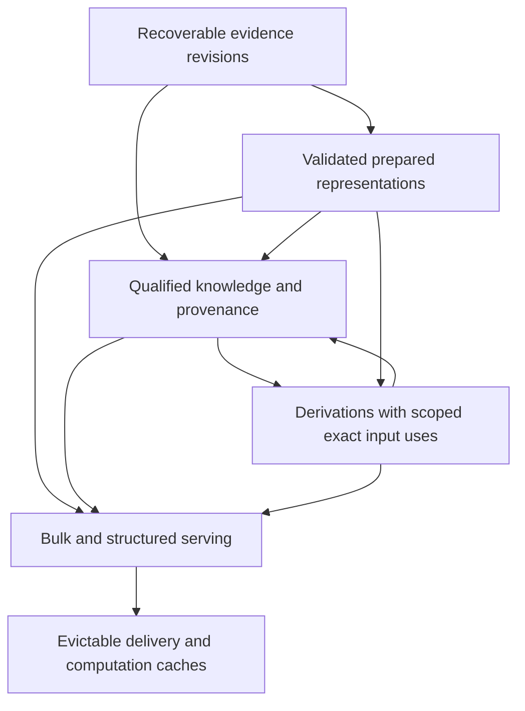

# Atlas storage, processing and serving requirements assessment

2026-10-06. Requirements assessment based on clean `main` at **1c2d10e522f54e60f83bae2e416008bd1a241eb1**, the retained Tryfan qualified-query proof. Fetch confirmed `main...origin/main` **0/0**; no newer commit or legitimate work required reconciliation. This report assesses requirements; it does not implement storage or select a production stack.

## 1. Executive conclusion

**Decision C: requirements are sufficiently understood to design a bounded first persistent regional world-model implementation, with major technology choices provisional and reversible.** The successful [Tryfan proof](tryfan-qualified-query-proof.md) establishes the composition and lifecycle to preserve. Retained products establish meaningful payload and object-count differences. They do not establish country-scale claim counts, operational query rates, update fan-out, production latency or a durable production architecture.

Atlas needs recoverable evidence and prepared revisions, qualified shared metadata, scoped dependencies, policy-relative resolution and freshness, reproducible processing, coherent publication, and separate bulk/structured/computed serving paths. Five logical storage responsibilities are justified; five deployment services are not. A local, single-writer proof can test persistence and recovery before introducing distributed coordination.

Exactly one next task is recommended in section 30: **implement and evaluate one local persistent retained Tryfan regional world-model proof**. This assessment does not begin it. Appearance research remains unresolved, Swiss multiview remains parked, and the 42-thread research register retains its statuses.

## 2. Scope and non-goals

The assessment starts from workloads, records requirements and evaluates operational consequences. It uses existing source receipts and five named external product manifests. The only new code is a read-only measurement utility and its tests. No datasets are acquired, immutable products modified, cloud resources created, database created, services implemented or vendor selected. No production Atlas, Weather, Traverse, frozen contract or historical experiment changes are made.

Evidence labels throughout are **measured** (new manifest/hash/size checks or retained measurements with attribution), **estimated** (an inference explicitly bounded by inputs), and **hypothetical** (illustrative scaling arithmetic). Computational reproducibility is not physical accuracy. Source information is not delivery sampling; missing evidence is not physical absence.

## 3. Evidence base and established adjacent approaches

Authoritative foundations are the [canonical register](atlas-research-state.md), [world-model synthesis](atlas-world-model-architecture-synthesis.md), [lifecycle assessment](atlas-derived-understanding-lifecycle.md), [Tryfan vertical proof](tryfan-qualified-query-proof.md), [Semantic Evidence Contract v1](../atlas/semantic-evidence-contract.md), [Terrain Hierarchy Contract](../atlas/terrain-hierarchy-contract.md) and [terrain metadata separation](../atlas/terrain-source-product-architecture.md). Domain measurements come from [Tryfan regional proof](../atlas/tryfan-second-region-proof.md), [original Swiss prototype](../atlas/riffelhorn-regional-terrain-prototype.md), [larger Swiss support](../atlas/riffelhorn-swiss-support-product.md), [Copernicus preparation/delivery](../atlas/copernicus-common-product.md), [appearance architecture](../atlas/appearance-baseline-and-architecture.md), [SWISSIMAGE baseline](../atlas/swissimage-source-derived-baseline.md), [mountain semantic comparison](../atlas/source-native-semantic-comparison.md), [Exe water check](../atlas/water-feature-state-check.md) and [information-aware limits](../atlas/information-aware-display-selection.md).

The [measurement receipt](atlas-storage-requirements-measurements.json) records exact repository evidence hashes, named external manifest hashes and calculations. [measure.py](../../scripts/atlas/storage_requirements/measure.py) verifies five manifests and size-checks **16,632 listed payload files**. It does not rehash their contents or repeat terrain/imagery processing. This is a bounded inventory, not a disk-wide survey, scientific experiment, network benchmark or memory profile. No private evidence is inspected.

Two targeted standards checks clarify reuse, without mandating adoption. [W3C PROV-DM](https://www.w3.org/TR/prov-dm/) distinguishes entities, activities, agents and derivation; its extensibility supports lineage interoperability, but does not specify Atlas freshness policy. [OGC STAC 1.1](https://docs.ogc.org/cs/25-004/25-004.html) describes spatiotemporal assets, items and collections; it is a possible catalogue interchange pattern, not a replacement for native semantic claims or actual input-use scopes. These are established approaches, not Meridian inventions.

## 4. Workload model

| Workload | Actual retained example | Required behaviour | Evidence limit |
|---|---|---|---|
| Source/archive | Welsh DTM, Swiss DEM/orthophoto files, semantic extracts and definitions | Preserve source/version/rights, checksums, acquisition and publication distinctions; read large files without loading a whole archive | Some hosted AWS/MapTiler lineage remains unknown; registration cannot invent it |
| Prepared representations | Supported terrain/imagery pyramids, masks, manifests | Revision-specific lookup, coverage/level semantics, validated publication, selective replacement | Preparation success is not seamless regional/global production integration |
| Qualified knowledge | Shared v1 contexts, classes, mappings, feature references and gaps | Spatial/time/reference-qualified lookup; retain contradictory claims and native definitions | Six proof claims do not predict national claim density |
| Derived understanding | Slope and planar area ratio with exact receipts | Forward/reverse dependency access, policy-relative freshness, scoped recomputation, replay | Proof uses a tiny explicit chain, not a scalable workflow engine |
| Serving | Tile reads, bounded query harness, provenance inspection | Bulk delivery, structured lookup, resolution and optional computation with separate latency/error classes | Loopback captures and CLI runs provide no multi-user production SLA |

A workload may span several responsibilities. A raster class catalogue need not materialize a heavyweight claim object for every cell. A vector inventory feature is not automatically a persistent physical object. A prepared RGB texture is not an illumination-independent material property.

## 5. Measured current artifacts

All sizes below are **bytes**, not billed storage. Tile totals are encoded files; fields/working rasters are separately identified. Archive figures are retained receipts, not a new archive census. Manifests and listed sizes were checked in this assessment.

| Retained product | Source bytes / support | Delivery objects / bytes | Other retained preparation bytes | Manifest bytes |
|---|---|---|---|---|
| Tryfan Welsh regional v2 | 15,639,072 / 9 km² source window | 295 / 23,889,573 | 46,691,533 working | 87,014 |
| Original Riffelhorn composed Swiss/AWS v1 | 65,607,404 Swiss inputs / 4 km² Swiss source | 547 terrain / 41,855,904 | 547 masks / 238,866; AWS cache is separate | 222,168 |
| Swiss 10×10 km support v1 | 1,667,166,026 / 100 km² | 11,429 / 930,914,852 | Other working storage not measured | 1,897,650 |
| Copernicus common v1 | 254,113,117 / six native one-degree COGs | 2,730 / 327,636,998 | 416,136,764 working raster | 450,369 |
| SWISSIMAGE baseline v1 | 186,259,028 / 4 km² | 542 / 269,852,875 | 542 fields / 1,294,380,168 | 218,993 |

Encoded tile median / 95th-percentile / maximum sizes are respectively: Welsh **84,234 / 100,999.6 / 112,921**; original Swiss terrain **76,446 / 101,230.6 / 158,556**; larger Swiss **82,079 / 100,601.2 / 133,755**; Copernicus **122,200 / 138,315.9 / 161,226**; imagery **554,853 / 642,900.4 / 703,045** bytes. Percentiles are linear interpolation over a finite file population, not uncertainty bounds. SWISSIMAGE working fields are approximately **4.8 times** encoded delivery bytes; their median is 2,724,499 bytes, not resident RAM. Temporary/state retention can dominate delivery volume.

The pure Swiss pyramid has 8,654 tiles at z18 and 2,775 at coarser levels, with incomplete edge tiles withheld. Welsh has 1/10/52/232 complete tiles at z14/15/16/17 and no accepted z13 tile. Copernicus has 2/8/32/128/512/2,048 at z8–13. Extent, latitude, complete-support policy and family-specific parent preparation affect counts. Comparing the original composed 4 km² product with the pure 100 km² product does not isolate area scaling.

Previously measured preparation times were Welsh 129.05 s (independent rebuild 168.45 s under concurrent load), Swiss support 770.16 s, Copernicus 103.60 s (independent 102.43 s), SWISSIMAGE 194.07 s. These are historical machine/workload receipts; this assessment did not rerun builds or predict country-scale compute from them. Independent rebuild/hash evidence is in the original reports.

Semantic evidence has a different shape. Two WorldCover crops total **9,964 bytes**. NRW retains 193 intersecting habitat features in 558,917 bytes and two survey extracts totaling 589,835 bytes. GeoCover bedrock/unconsolidated extracts total 1,083,097 bytes; the smallest official GLAMOS archive was 9,787,779 bytes, with separate local extracts. Mountain source/document receipts total **24,555,804 known bytes**; three HTML entries have unrecorded sizes, so this is not a complete total. Exe source/document receipts total **9,892,590 bytes**, with a prior recorded directory total of 9,923,141 bytes. Documents, indivisible acquisition units and extracted copies must not be confused with homogeneous claim payload or double-counted as unique source information.

The unchanged Tryfan query proof contains **three input roots**, three retained tiles totaling **320,857 bytes**, **six claim revisions**, **four current results**, **two recomputations**, **six direct input uses**, including **three claim-to-claim uses**. Pinned inputs are 15,189 bytes; the diagnostic result bundle is 92,034 bytes. Separately serialized compact claims/contexts/receipts are 3,453/11,211/6,021 bytes. They are logical component measurements, not an additive production schema or a per-pixel estimate. Shared metadata avoids the trace bundle's repetition.

The retained Copernicus browser run reported **344 successful responses / 204 distinct tile URLs / 43,343,466 response-body bytes**, including repeat/cache bodies, not wire traffic. It also recorded aborted requests. Manual checks established conditional 304 reuse and 404 for unsupported tiles. This illustrates request churn and cache reuse, not load capacity.

## 6. Scaling dimensions

For a regular field, uncompressed base samples grow approximately as **area / spacing² × channels × bytes per sample**. An ideal fully filled two-dimensional pyramid with twofold coarsening adds a factor approaching 4/3. Real delivered bounds, masks, encoded compression, tile alignment, physical latitude and support exclusions alter that model. No factor turns distributed sampling into effective source information resolution.

**Hypothetical arithmetic only:** 1,000 km² at 1 m with one float32 band is 4 GB of base samples; 0.25 m RGB8 is 48 GB, or 64 GB for an ideal infinite filled pyramid. These are neither proposed products nor compressed capacity forecasts. A fully populated XYZ z0–13 namespace has 89,478,485 addresses; Atlas is not required to store one loose object at every address. Sparse support and different packaging/parent strategies matter.

| Scale | Workload change | Supported inference / unresolved measurement |
|---|---|---|
| Small regional proof | Hundreds/thousands of files, a handful of explicit queries and dependency chains | Retained measurements justify testing durable registration, local lookup and recovery |
| Larger coherent region | Quadratic resolution cost; larger preparation windows, edge halos and metadata manifests | Need peak working-set/temp-space and packaging measurements; no blanket whole-region rebuild requirement |
| Country-scale heterogeneous Atlas | Multiple supports, CRSs, epochs, licences, methods and revisions; many intersecting catalogues | Metadata selectivity, dependency density, updates and history retention become important; quantities not yet measured |
| Broad/global Atlas | Baseline coverage and regional islands; large observation history and concurrent users | Partitioned/sparse delivery and indexes; no high-resolution global requirement or precise bill inferred |

Additional dimensions multiply independently: number of retained unique revisions, time steps, observations/view directions, properties, methods and materializations. Users primarily increase transfer, read/query throughput, computation and caches rather than source evidence. Claims can grow with feature count or observation cadence, not only area. Revision history can share unchanged content while preserving different lineage; assuming all versions are full copies or assuming perfect deduplication are both unsupported.

## 7. Storage responsibilities and conceptual tiers

Five responsibilities fit the synthesis; they are logical tiers, not service boundaries.

| Responsibility | Contents | Retention / lookup / relationship |
|---|---|---|
| Evidence archive | Original/local retained inputs, definitions, calibration/orientation if available, rights receipts | Revision identity and recoverability; checksum/source lookup; access restrictions survive |
| Prepared representations | Domain products, levels, masks, support and revision manifests | Validated immutable published revisions; coverage/level lookup; reference archive and process |
| Knowledge/provenance catalogue | Sources, definitions, qualified claims, mappings, feature associations, gaps, process records | Historical references and spatial/time/reference lookup; shared bindings rather than metadata per cell |
| Derived materializations | Reproducible computed fields/values and input-use receipts | Selective reuse/recompute; metadata may outlive an evicted payload; exact dependency lookup |
| Serving/cache encodings | Hot tiles, read-optimized bundles and transient results | Evictable when rebuild/recovery is justified; revision/policy-aware keys; never the sole provenance record |

The arrows denote traceable use/publication, not a cyclic scientific dependency. An individual derivation's input graph must remain acyclic as established by the lifecycle assessment. No separate service is required for each box. Rights determine which subsets can enter a public serving/cache tier.

## 8. Canonical, rebuildable and disposable data

| Category | Can be rebuilt? | What must survive |
|---|---|---|
| Irreplaceable or externally authoritative evidence | Reacquisition may be possible, expensive, restricted or unavailable | Source/version, bytes or an honest recovery status, checksum, definitions, acquisition/time/rights receipts |
| Meridian-prepared accepted product | Often reproducible from pinned inputs and method | Product revision, process/software/parameters, support, validation and dependency closure; payload retention policy explicit |
| Durable qualified knowledge | May be reconstructible, but has interpretive/history significance | Native claim, mapping/revision/loss, space/time/reference, evidence mode, quality, lineage and rights |
| Reproducible derived artifact | Usually, only while exact inputs and method remain available | Semantic/process identity and actual input-use receipt even if payload is evicted |
| Serving-specific encoding or disposable cache | Usually | Rebuild recipe or upstream revision pointer and safe eviction boundary; it cannot own sole history |

Reproducible does not mean cheap to regenerate or never worth storing. Conversely, retaining all scratch fields indefinitely is not justified. Publish a retention decision per artifact class/revision, keep history reachable, and protect referenced inputs from accidental garbage collection. If a historical payload cannot be recovered, retain its provenance but report replay unavailable. A checksum alone does not guarantee availability or prove scientific truth. Source rights can constrain retention and serving independently; deduplicated bytes must not erase separate obligations.

## 9. Identity and addressing requirements

| Identity | Purpose / invariant |
|---|---|
| Source/product revision | Stable exact reference to evidence and declared semantics; no silent overwrite |
| Representation/partition | Particular encoding, level and support within a product revision; spatial address is not complete scientific identity |
| Native/property/feature reference | Meaning and source-scoped association; feature identity is distinct from geometry/state |
| Claim revision / semantic question | Distinct evidence-backed assertions can concern the same physical property, support and qualification |
| Method/process/dependency receipt | Exact scientifically relevant implementation, parameters and consumed input revisions/scopes |
| Artifact hash | Integrity and possible byte reuse; does not replace semantic or process identity |
| Freshness assessment / cache identity | Policy and catalogue/evidence baseline assessed, plus relevant method/context and result revision |

The Welsh v1→v2 support correction retained identical terrain bytes while changing applicable support metadata. This is concrete evidence that content identity and evidence applicability are different. Re-encoding identical observations is different from new observations. Caches keyed only by location/property would collapse time, methods, representations and current-evidence policies. Do not prescribe final keys; require collision-resistant exact references, explicit revisions, stable semantic continuity and immutable published snapshots.

## 10. Spatial indexing requirements

Atlas needs at least three spatial relations: **candidate source/representation coverage**, **claim/output support**, and **actual input-use support**. The Tryfan slope is a point result but consumes a neighbourhood approximately 29.54×29.47 m. Indexing only its output point would miss revised inputs in that neighbourhood; invalidating against the entire regional DTM would overreach.

Required queries include point/area eligibility, intersecting observations/claims, source-feature associations, and dependency-use intersection. Bounding boxes are useful conservative candidates; irregular polygons, holes, raster valid-data masks, withheld tiles and line-versus-area semantics require a subsequent adequate support test. A centreline is not a water surface. A model domain is not an inundated area. Native CRS coordinates and their transform/version/accuracy qualification must remain recoverable alongside any comparison index geometry. No unnecessary reprojection/resampling of source payloads is implied.

Tile addressing can accelerate delivery; it is not a universal storage domain. Feature objects, inventories, temporal observations and input-use neighbourhoods have different shapes. Coarser dependency bounds are acceptable if scientifically sufficient and conservative, with possible excess recomputation documented. Exact pixel dependency tracking is not established as mandatory. For preparation filters/parents, actual read halos must be recorded rather than assuming output partitions are all that was consumed.

## 11. Temporal indexing requirements

Time belongs to each claim and input use. Preserve observation/acquisition intervals, survey/nominal epochs, asserted validity, event time, processing and publication/revision times as different roles. Unknown or partially known time is valid; a publication date is not an observation date. Reference-conditioned flood probabilities or Mean High Water mapping conventions need their defined reference condition, not a fabricated instantaneous observation.

A first proof can use explicit timestamps/intervals and unknowns with modest lookup. Larger dated histories need interval/time-role indexing and corrections to historical observations without overwriting them. Queries about physical time differ from queries about what Atlas knew at a recording time. This may later motivate bitemporal capability; it does not require a full temporal database now. The frozen contract already captures semantic temporal roles. Selection/indexing must preserve them.

## 12. Dependency lookup and freshness requirements

The [Tryfan proof](tryfan-qualified-query-proof.md#7-dependency-description) establishes canonical forward input-use receipts, exact source/claim revisions, roles, process revision and parameters. Future infrastructure must support direct and transitive provenance and identify candidate downstream dependents by revised **spatial/temporal input-use intersection**. Unknown change scope requires a conservative/indeterminate assessment, not invented precision.

A reverse index is an acceleration structure over those canonical receipts. In a small proof it can be rebuilt on startup; at larger measured graph density it may need persistent indexing. Either choice must be rebuildable, consistent with its referenced catalogue snapshot and testable. A graph database is not implied by having dependencies. Results and dependencies can remain domain-qualified; selection still consumes TerrainHierarchy rather than replacing it.

Freshness is policy-relative. Under pinned/reproducibility policy, historical AWS-derived results remain referenceable if their closure is available. Under current-best-applicable evidence, the summit result becomes stale after Welsh eligibility changes while the southern result remains fresh. Stale is not false. An assessment must identify the policy and evidence/catalogue/method baseline; concurrent changes must not silently mix snapshots. Computation finishing after a baseline update can be published as a reproducible result without incorrectly claiming current preference. Missing dependency availability, semantic incompatibility and method eligibility may yield different outcomes from stale.

Source updates need not trigger immediate recomputation. Candidate discovery, freshness assessment, preference and scheduling are separate. Actual affected outputs propagate through the explicit derived-on-derived chain in dependency order; unrelated results remain unaffected. Reverse lookup correctness matters more than an unmeasured universal throughput target.

## 13. Recomputation and materialization model

| Class | When appropriate | Retained example / qualification |
|---|---|---|
| Eager accepted preparation | Expensive reusable inputs, predictable delivery, validation before exposure | Terrain/imagery pyramids with manifests and support |
| Scheduled/background preparation | New publication/time series, large updates, noninteractive costs | Future acquisitions; cadence not measured or selected |
| On-demand calculation | Small bounded scope, low cost, uncertain reuse | Local ordinary slope computation; CLI startup is not an interactive latency target |
| Cached on-demand | Repeated qualified requests, reproducible inputs, safe eviction | Exact process/input receipt plus context-aware cache identity |
| Durable derived product | Expensive/reused/regional analysis, valuable accepted history | Possible future fields; no obligation to precompute every property |

Cost, reuse, extent, volatility, fan-out, latency sensitivity, storage and reproducibility jointly determine the class. The proof's roughly 1.33 s full CLI and approximately 0.10 s sampler measurements include different operations and do not justify a universal threshold. Materialization policy can change without changing physical/semantic identity. Retaining computation receipts is distinct from storing every raster result. Atlas cannot precompute every future question.

## 14. Incremental update model

| Change | Required candidate discovery | Normal consequence, subject to property/policy |
|---|---|---|
| New better regional terrain | Eligibility/support and actual use intersection | New current-evidence assessment, affected derivations only; old history retained |
| Corrected old source observation | Exact revised source plus spatial/time scope | New revision, scoped reassessment/recompute; correction differs from a new physical state |
| Representation-only rebuild | Declared encoding/sampling/support dependencies | Artifact rebuild or reassessment if actual scientific inputs changed; not automatic new observations |
| New imagery/state observation | New acquisition support/time and dependent question | Append dated evidence/state; no rewriting past observation merely because newer data exists |
| Updated semantic inventory or mapping | Native property/feature, support/time, mapping/method revision | Preserve native facts; reinterpret where mapping changed, recompute only dependent outputs |
| Method bug fix/scientific revision/parameters | Users of the particular method/revision | Policy assessment; explicit replacement/coexistence decision, not newer-always-wins |
| New contextual/domain evidence | Dependency roles, missing context and property definition | Richer result or distinct property as qualified; no forced silent identity change |

Partitioning by appropriate space/time can bound preparation and derivation; parent/filter halos may cross partitions. Byte-identical results do not erase process/semantic revisions, and byte-different encodings do not prove changed physical information. If source differences are known only at product scope, conservative reassessment is legitimate; claiming pixel-level selectivity without evidence is not.

## 15. Minimal processing lifecycle

Registration records recoverability and unknowns, not fabricated complete provenance. Validation checks checksums, source/version, support, temporal/reference semantics and rights for intended use. Preparation records inputs, scientific parameters, transformation/software revision and valid outputs. Derivation records actual reads and upstream claim uses. Validation checks artifacts and contract semantics before publication. Serving sees an accepted, internally consistent revision. Failures retain a diagnostic/process state and do not silently publish partial products.

Require retry-safe/idempotent processing identity, staging distinct from accepted output, explicit completion membership/checksums, and a recoverable last accepted catalogue baseline. A revision is immutable once accepted; mutable selection pointers must refer to complete revisions. A crashed rebuild must not leave a mixed old/new product. The first local proof can use one writer and simple atomic publication; multi-writer coordination is a later measured need, not solved by naming a queue.

Existing [Weather builder](../../scripts/weather/gfs_weather_builder.py) and [tests](../../scripts/weather/test_gfs_weather_builder.py) supply one transferable reliability lesson: closed temporary JSON plus atomic replacement with bounded Windows retries prevents partially written latest/catalogue files. Updating an independent field preserves existing entries in its tests. That read-modify-write operation does **not** establish multi-writer transaction safety or a complete Atlas publication protocol. No Weather processing was run or redesigned.

## 16. Failure and partial-availability semantics

| Situation | Truthful outcome | Must not imply |
|---|---|---|
| Property unsupported/unknown | Qualified evidence gap | Zero, dry, absent or an invented estimate |
| Outside declared support | Outside-support reason; compatible fallback only if justified | Failed source or physical absence |
| Valid artifact temporarily unavailable | Availability error with retained identity | Unknown source semantics or disappearance of a feature |
| Preparation incomplete/failed | Processing state; last accepted baseline where compatible | A completed representation or observed state |
| Checksum/corrupt artifact | Quarantine/unavailable and recovery path | A physical-world change |
| Result stale under policy | Stale result/reference or recomputation pending, according to use | Historically false or silently current |
| No observation / non-detection | Distinct native evidence states | Physical absence |

The Exe case demonstrates why an unobserved September cell is different from water non-detection. Current analytical elevation sampling catches failed tile work and can return a missing sample; a richer future resolution boundary should expose that infrastructure reason separately from semantic unknown. This is a requirement, not a production change. Missing regional preparation permits common fallback only where the domain contract and query purpose permit it; no incompatible substitute property is allowed. Diagnostics must distinguish process failure, coverage, unavailable inputs and unsupported physical claims.

## 17. Serving workload model

| Pattern | Requirement | Cache/compute implication |
|---|---|---|
| Bulk raster/geometry | Bounded chunks/windows, immutable revisions, support-aware omission, validation, cancellation | Reuse encoded artifacts; conditional retrieval; avoid loading whole source |
| Structured knowledge | Native definition, mapped interpretation/loss, support/time/quality/rights | Shared metadata, selective indexes and revision-qualified responses |
| Qualified resolution | Coordinate domain selection with question/context and freshness | Include relevant catalogue/policy baseline; location alone is insufficient |
| Derived computation | Bounded inputs, explicit costs/failure and receipt | Cheap local work or background/on-demand materialization; no mandatory synchronous expensive analysis |
| Inspection/provenance | Exact result-to-input/method traversal, unknowns, history | Can be slower/larger than viewport path; must remain independently inspectable |

Production provides established reliability patterns, not future capacity figures: [analytical sampler](../../src/atlas/terrain/terrainElevationSampler.ts) bounds decoded tiles at **96** and fetch concurrency at **6**, supports aborts and reuses decoded tiles; [satellite layer](../../src/atlas/map/satelliteLayer.ts) gates readiness and protects map-scoped pending work/lifecycle. These constants remain unchanged and are not universal Atlas budgets. Ninety-six 256×256 RGBA arrays imply about 25.17 MB of pixel-array storage arithmetically, excluding JavaScript/GPU/other memory; it is not measured RSS. Existing rendering fetch size/zoom/filter behaviour must not become scientific source resolution.

Bulk requests can churn during navigation; immutable revision caching and abort/coalescing are important. A response should identify its result revision and applicable freshness baseline. Cache hit does not mean scientifically preferred. Public serving eligibility depends on rights. No endpoints/protocols are designed here.

## 18. Client/server implications

Rendering, view-local selection, small bounded physical calculations and inspecting a packaged evidence subset can remain client-side. Large archives, expensive reusable preparation, protected inputs, multi-region historical catalogues, reverse dependencies and shared materializations need durable processing/catalogue capabilities outside a transient browser. They need not initially be cloud services: local tooling and a single durable catalogue can exercise the requirements.

The renderer should consume accepted representations/qualified outcomes and respect its own lifecycle. It should not own source archival identity or global recomputation. Networked shared serving becomes useful as dataset/user scale grows; it is not a mandate to move every calculation or map operation to a server. Keep domain selection reusable at either boundary. This assessment does not migrate current client production.

## 19. Offline/local implications

Preserve the possibility of a self-describing subset containing permitted terrain/imagery, shared claim definitions, support/time/reference, pinned provenance and enough dependency closure for local questions. Unknown remote evidence remains unknown; an offline package can assert freshness only against its pinned baseline, not guarantee current global evidence. Package identity and rights/rebuild references must survive disconnection. Missing members should be detectable.

No offline product or packaging format is selected. The requirement now is to avoid identities and resolution semantics that require permanent network access or conceal the evidence subset. Delivery cache is not automatically a rights-cleared historical archive. Protected provider imagery must not be assumed distributable merely because it rendered in a browser.

## 20. Appearance and future observations

The [appearance architecture](../atlas/appearance-baseline-and-architecture.md), [SWISSIMAGE proof](../atlas/swissimage-source-derived-baseline.md) and register A6–A11/A14–A15 remain unresolved/partial as recorded; A13 Swiss 2026 provisioning remains **PARKED**. Storage must accommodate dated source observations, sensor/orientation/calibration metadata where available, processed orthophotos/mosaics, optional corrected appearance, multiview inputs and possible richer texture/geometry assets. These have different sample geometry and revision/processing lineage. Do not lock every appearance asset into today's orthographic tile representation. RGB is not albedo; correction/fusion success is not a prerequisite for this storage assessment.

Time-varying water, snow or vegetation observations may append acquisition histories while corrections revise old observations. Store individual claim-local time and source processing/model versions, not one global date per place. Cadence, view counts and retention multiply workload; their future volume is unknown. The model must admit such histories without requiring all dynamic evidence now. No new observations, classification or appearance research were performed.

## 21. Cross-domain dependency implications

A future Atlas derivation consuming a Weather output must reference the qualified domain output identity/revision, observation/forecast/model time, reference conditions, role and actual consumed scope. Availability and freshness need the relevant domain policy, not a generic newest timestamp. The downstream process receipt can record this without merging stores, source ontologies or physical domain ownership. No atmospheric assumptions, albedo/roughness assignments, Weather state model or Traverse judgement is introduced. Cross-domain cycles in physical simulation are outside this DAG-based processing assessment.

## 22. Rights and access requirements

Registration, prepared artifacts and derived outputs must retain source terms, attribution and restrictions, with reusable shared rights references. Multi-input processing must assess combined obligations; a content hash or 'derived' label does not grant redistribution. Rights can distinguish internal research artifacts from publishable serving encodings. Access controls, publication checks and provenance inspection need that distinction. Retention, export, offline redistribution and public caching are separate permissions.

The retained inventory already documents consequential source-specific restrictions, including UKCEH products; current MapTiler access is not a blanket right to acquire and redistribute an imagery archive. This assessment does not refresh licences or acquire restricted data. Any later proof uses retained allowed subsets and their receipts, preserves crop/transformation attribution and does not silently publish protected raw evidence. Software licences and data rights remain distinct. Rights constraints can prevent replay or publication; that is an honest qualified availability outcome.

## 23. Cost drivers

| Driver | Measured anchor | Requirement for later evaluation |
|---|---|---|
| Source/representation volume | Swiss support 1.67 GB archive / 0.93 GB tiles; imagery working fields 1.29 GB | Unique revisions, scratch retention, temporary peak space, recoverability |
| Object/metadata count | 11,429 Swiss terrain tiles; 16,632 stat-checked payload files overall | Listing/lookup overhead, per-object operations, packing versus selective range reads |
| Transfer/read amplification | 344 historical responses vs 204 distinct URLs | Cold/warm bytes, cache reuse, navigation aborts; body bytes are not wire billing |
| Preprocessing compute | Historical regional builds roughly 100–770 s with different supports | Machine/parallelism, peak memory, scratch bytes, partial rebuild scope |
| Repeated derivation | Two affected outputs out of four current proof results | Reuse/cost ratio, input read amplification, dependency fan-out and recomputation frequency |
| Index/structured workload | Shared tiny proof metadata vs source vectors/documents | Real claim cardinality, spatial selectivity, reverse-use density, concurrency |
| History/cache duplication | Welsh identical tile bytes across support revisions | Reference reachability, rights-aware byte sharing and eviction safety |
| Reliability/recovery | Staging, checksums and accepted-baseline requirements | Validation/restart/rebuild cost, not only steady-state reads |

No precise global bill follows. Imagery channels, resolution, acquisitions/views and scratch may dominate bytes; small-tile counts can dominate operations. Rich semantic/time series may dominate indexed records. A cache improves latency while duplicating storage and introducing eligibility/freshness invalidation work. Later technology evaluation must optimize the measured bottleneck rather than the most conspicuous small benchmark.

## 24. Performance classes

| Class | Qualitative expectation | Measurement still needed |
|---|---|---|
| Interactive map path | Responsive bounded fetching, cancellation and progressive rendering | Cold/warm viewport transfer/latency and concurrent navigation |
| Interactive physical query | Bounded lookup or cheap computation; qualify delayed/unavailable results | Breakdown of selection, dependency, source read and derivation latency |
| Provenance/history inspection | Reliable traceability; may traverse larger metadata/archives | Traversal depth, bytes and recovery latency |
| Background derivation/update | Throughput and scoped work, explicit progress/failure | Cost per affected region, fan-out, peak memory, restart |
| Bulk preparation/archive | Reproducibility/integrity and controlled resource use | Temporary storage, throughput, validation and reacquisition limits |

No arbitrary millisecond targets are invented. The first persistent proof should measure operation classes, cold/warm differences, restart and failure recovery under declared machine/workload conditions. Later interactive acceptance and concurrent load need observation of a real user path. Existing limits and loopback captures are expectations/patterns, not capacity guarantees. Latency, scientific fitness and availability are independent axes.

## 25. Candidate architecture classes, after requirements

These are non-binding classes, not selected products or deployments.

| Class | Requirement it could satisfy | Decision restraint |
|---|---|---|
| File/object/blob archive | Large revisioned payloads and recoverable manifests | Local files suffice for initial retained proof; no cloud provider chosen |
| Versioned spatial catalogue, embedded or relational | Metadata references, support lookup, temporal qualification and selective dependencies | Select based on measured record/selectivity/concurrency needs; no database created |
| Window-readable raster / analytical columnar files | Bounded source/analysis reads without whole-payload load | Match domain access; no universal encoding |
| Tile/archive packaging | High tile count with bounded delivery access | Measure seek/read amplification versus loose-file operations before adopting |
| Content-addressed artifacts | Integrity and possible byte reuse | Semantic identities and rights remain separate; garbage collection must preserve referenced closure |
| Delivery/computation cache, optional distribution layer | Interactive reuse and immutability-aware transfer | Policy/context keying; cached does not mean preferred or publishable |
| Bounded batch jobs, eventually queued work | Preparation, retry, dependency-ordered recomputation | One local writer/process first; introduce coordination only for demonstrated need |

A general graph database, vector database, workflow platform, event bus or microservice fleet is not justified by the six-result proof. Conceptual tiers can share one implementation while retaining separate identities/responsibilities. Choosing reversible local engineering tools during the next proof is different from selecting a durable production architecture here.

## 26. Technology decision gates

| Gate | Why it can change a choice | When to measure |
|---|---|---|
| Payload counts/size distribution and window access | Loose objects versus containers; range-read and metadata overhead | Retained counts already available; benchmark representative local reads in first proof |
| Actual claim/dependency count and spatial selectivity | Catalogue/index capabilities and reverse-index persistence | First proof correctness/rebuild; expand measurements before country-scale catalogue commitment |
| Cold/warm query cost and input read amplification | On-demand versus materialized/cache; client versus shared compute | First persistent proof; no arbitrary global rate requirement |
| Update fan-out, publication/recovery and writer concurrency | Incremental orchestration/transactions rather than simple single writer | First proof selective updates/restart; concurrent publisher capability only when needed |
| Observation cadence/history/retention and rights | Time indexing, archival cost and public/offline delivery eligibility | Before adding a dynamic source or a new distribution use, not a speculative catalogue now |
| User-path latency, query mix/concurrency, offline subset use | Serving capacity, cache distribution and package choices | Later concrete consumer/load proof before production commitment |

These are finite engineering measurement gates, not another scientific programme. No foundational blocker requires a new dataset or water/mountain benchmark before the first local persistent proof. Do not insist on global rates or every future property before choosing reversible proof tooling. Do not mistake passing the small proof for passing larger gates.

## 27. Requirements for the first persistent regional proof

Use the existing retained Tryfan evidence and query/derivation slice. Keep TerrainHierarchy and Contract v1 unchanged, and reference large immutable payloads rather than duplicating them. A durable registry/catalogue, scoped receipts, accepted revisions and an isolated read-only query/bulk-access path are sufficient. Initial design/choice of local tools must be documented as reversible. One writer with explicit publication/recovery is an adequate first operational scope.

| Requirement | Minimum future acceptance evidence |
|---|---|
| R1 Recoverable source registration | Exact retained source/product/asset references, hashes, rights and honest replay availability; no fabricated AWS lineage |
| R2 Coherent immutable publication | Accepted revision has all validated members and metadata; interrupted staging never replaces it with a mixed revision |
| R3 Three distinct spatial relations | Eligibility coverage, result support and actual input-use neighbourhood remain distinct; outside-use update leaves unrelated result unaffected |
| R4 Qualified time/reference | Existing unknown epochs remain unknown; reference semantics not reduced to publication date |
| R5 Shared qualified knowledge | Native meanings, definitions/quality/rights and v1 claims persist without full metadata object per raster cell |
| R6 Exact dependency lookup | Forward and rebuildable reverse lookup, exact revisions/roles/parameters; derived-on-derived chain traverses correctly |
| R7 Policy-relative current assessment | Pinned reproducibility and current-best-applicable evidence differ; assessment identifies the accepted baseline and historical result |
| R8 Restart and failure recovery | Stop/restart retains answers, history and preferences; controlled failed staging/invalid new artifact yields availability/process reason, not physical absence |
| R9 Materialization independence | Semantic/process identities survive serialization/eviction/rebuild; old AWS result remains referenceable when Welsh becomes preferred |
| R10 Honest gaps | Unsupported property, unavailable input, failed preparation and stale result remain distinguishable |
| R11 Rights/provenance inspection | Input/method/claim/rights closure can be inspected; public access is not automatically inferred |
| R12 Bounded operational measurements | Record catalogue/index/artifact bytes, reads, cold/warm query/update/restart times, selective recomputation counts and machine conditions |

Replay the current four-answer/six-revision history and two-output refinement with the existing ordinary methods. Demonstrate common-only→regional applicability using accepted catalogue contexts, not edits to source bytes. Recover a new isolated proof store from retained registration/process receipts and compare relevant deterministic values/identities. Test crash/corruption only on new proof artifacts or staging copies, never immutable retained products. A CLI or isolated local read adapter suffices; no public API or service design is required now.

This would test operational persistence, not a new terrain-quality experiment. It need not populate a whole regional semantic raster, solve appearance, create a feature ontology, build global storage or implement dynamic hydrology. Exit when R1–R12 pass or a specific failure is documented; do not expand opportunistically.

## 28. Research versus engineering classification

| Category | Remaining issue | Consequence |
|---|---|---|
| Scientific/research | Unresolved appearance correction/visibility/fusion; future specific observation-derived properties | Remain in canonical register; not solved by storage or blockers to this retained proof |
| Architecture | Snapshot-consistent publication and contextual freshness; shared exact dependency description | Requirements established here/lifecycle; future implementation must test them without rewriting foundations |
| Engineering/design | Local catalogue/encoding, retention/eviction policy, publication protocol and deployment boundary | Reversible first-proof choices, not open elevation/semantic science |
| Empirical performance/cost | Query selectivity, dependency density/fan-out, peak working space, load/update/recovery | Measure as outlined in gate table before corresponding larger decisions |
| Implementation detail | Concrete keys, indexes, storage paths, workers/protocols/vendor | Deferred; not selected by this assessment |

Broader source coverage, country-scale validation and production boundary/source-family acceptance remain separate work. The successful Tryfan harness is not productionised by this classification. Existing frozen contracts and historical reports remain authoritative.

## 29. Architecture assessment decision and programme consequence

**C is supported.** Workload differences, identities, scoped lifecycle and operational failure semantics are clear enough to design the small persistent regional proof. There is no demonstrated foundational scientific gap preventing that bounded design. **D is not supported:** tiny claim counts, local transfer observations and historical build times cannot select national/global throughput, retention or production services. **A/B are not required:** the missing measurements concern operation/scale and can be obtained in the next proof or before later commitments, rather than forcing another foundational research experiment.

The synthesis and lifecycle conclusions remain intact. No frozen contract extension is made. The canonical 42-thread status vocabulary/register is preserved; this assessment adds a discoverable operational requirements result. Unresolved appearance and externally parked Swiss frame-camera work remain visible. Production AWS visual terrain, independent analytical AWS z15, exaggeration 1.45, IGOR, MapTiler satellite-v2 and its normal opacity/suppression/lifecycle, Weather and Traverse are unchanged.

Validation is recorded in the [assessment validation receipt](atlas-storage-requirements-validation.json). New analysis tests verify inventory arithmetic and scope; deterministic reruns verify the measurement file. Existing source/report/contract hashes, added references and navigation are checked. Reproduction commands and the read-only scope are in the [measurement tooling README](../../scripts/atlas/storage_requirements/README.md). No unrelated application build/tests are necessary because shared runtime is untouched. All preparation/serving figures above are bounded retained evidence, not fresh capacity benchmarks.

## 30. Exactly one next bounded task

**Implement and evaluate one local persistent retained Tryfan regional world-model proof**, including a short reversible engineering design before coding. Use the retained slice and R1–R12 acceptance requirements, with no new sources, production consumers or cloud commitment. Measure persistence, bounded query/serving behaviour, selective updates, historical replay, failure and restart recovery. Decide whether that minimum implementation meets the operational requirements or exposes a specific limitation.

Stop at its acceptance report and measured decision. Do not turn it into broad ingestion, productionisation, a storage platform or appearance research. This task is only recommended here; it has not begun.
