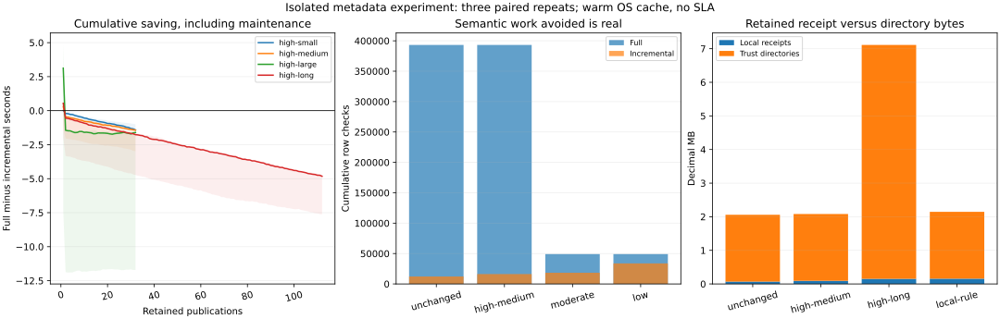

# Atlas retained validation-evidence maintenance and amortization experiment

## 1. Executive result

**C - EXPERIMENT RESOLVED.** The experiment resolves lifecycle economics for this fixed moderate-partition, lightweight-rule, ordinary-file model. Avoided semantic checks do not establish net economic benefit. 1,296 valid sequence proposals and nine verdict controls agree with full validation; the tenth control preserves the root through staged interruption and retry. No acceptance discrepancy occurred.

Final cumulative savings are negative in all three runs for 13 of 13 sequences. Consistently positive sequences: none. High-medium full/incremental medians: 3209/4950ms over 32 publications; high-long: 10129/15399ms over 112.

The cumulative distributions below include initial receipt preparation, lookup/eligibility and maintenance. They do not justify universal incremental adoption. The accepted Tryfan pilot remains CLOSED / ACCEPTED; no production validator changes.

[Results](atlas-validation-maintenance-results.json), [plan](../../scripts/atlas/validation-maintenance/plan.json), [baseline](atlas-validation-maintenance-baseline.json), [decisions](atlas-validation-maintenance-decisions.json), [validation](atlas-validation-maintenance-validation.json).

## 2. Starting checkpoint

Clean main `35e4fbd6730acf43ad3e0e33c69111f7431ec896`. Origin fetched, origin/main 0/0, no newer legitimate commit or uncommitted work. The introducing commit is this experiment checkpoint; final push/divergence/cleanliness are verified separately. All prior non-navigation tracked files are protected, including accepted reports and prior harnesses.

## 3. Target uncertainty

Does avoiding repeated semantic validation repay receipt creation, immutable root issuance, lookup, eligibility, selective bucket maintenance and historical storage across retained publications? Different outcomes support conditional reuse, continued full validation, or a narrowly motivated evidence-representation experiment. One missed full rejection would fail correctness independently of economics.

## 4. Previous proof and limitations

[35e4fbd](atlas-validation-reuse.md) established 46-case decision equivalence and 12,288-to-128 row-check reduction, but its `prepare()` always performed full validation. Largest preparation was about478–515ms; the per-proposal comparison excluded that cost. Dividing initial preparation by one warm timing difference was explicitly not amortization. This experiment adds authenticated selective evidence issuance and cumulative accounting without changing that proof or the accepted pilot.

## 5. Why lifecycle cost matters

A receipt is extra retained metadata and an optimization input, not timeless truth. Avoided predicates can be cheap; retrieving, authenticating and retaining certificates may be more expensive. Economic adoption therefore depends on check cost, update/rule frequency and evidence representation, not reuse percentage alone. Larger populations also retain current integrity/completeness costs.

## 6. Scope and exclusions

Isolated synthetic publication sequences, existing fixed validation predicates, family-local rule labels, trusted receipt/bucket carry-forward, retention accounting, direct historical access, paired timing and reporting. No production store/GC/database/cloud/API/cache/workers, data acquisition, physical algorithm, Weather/Traverse, Appearance/Swiss, S7 or service transition. Retirement is reachability analysis; no deletion. External legal/provider state and compromised verifier/anchor remain outside the proof.

## 7. Authoritative foundations

[Prior validation proof](atlas-validation-reuse.md), [granularity](atlas-component-granularity.md), [membership](atlas-component-membership.md), [scaling](atlas-generation-scaling.md), [architecture](atlas-measured-storage-processing-serving.md), [S6](tryfan-pilot-s6.md), [S1](tryfan-pilot-s1.md), [S2](tryfan-pilot-s2.md), [S3](tryfan-pilot-s3.md), [S4](tryfan-pilot-s4.md), [S5](tryfan-pilot-s5.md), [storage](atlas-storage-processing-serving-requirements.md), [synthesis](atlas-world-model-architecture-synthesis.md) and [lifecycle](atlas-derived-understanding-lifecycle.md). Frozen input hashes include actual catalogue/generation/dependency/delivery/derivation/update/world implementations. The prior [ten-group inventory](../../scripts/atlas/validation-reuse/inventory.json) remains authoritative.

## 8. Frozen hypotheses

Plan SHA256 `cc67c4c513d9233d966143fafa2004fe7f2b49a7b80c5dfb9c1d8ffe4b9d2564`, frozen before implementation/measurement. H1 high reuse amortizes lifecycle cost; H2 broad/low-reuse updates do not; H3 rule revisions reduce amortization; H4 population-wide checks impose a floor; H5 retention/lookup creates separate pressure.

Acceptance requires every proposal to agree with the full oracle and expected verdict, present-byte and completeness checks, independent trusted issuance, immutable history/zero ancestry and complete maintenance accounting. No elapsed threshold or universal cost weights. No break-even in range is an allowed result. Timing conditions were frozen: three independent stores, alternating paired order, request caches reset and OS caches uncontrolled.

H1 is not supported economically in the tested sequences; H2 is supported for broad/low reuse, without implying that only those cases lose. H3 has structural targeted/global revalidation evidence, but noisy time differences are not isolated causal estimates. H4 is established as a structural floor; exact elapsed attribution is unmeasured. H5 is supported for retained directory footprint, while hot receipt lookup retains zero ancestry.

A rehearsal exposed a common-cost allocation error: publication manifest creation was initially inside the evidence issuer. The interrupted `campaign-final` remains external evidence and is not reported as a favourable timing sample. `campaign-final2` stages that manifest during common construction, charges receipt-specific re-verification/issuance to incremental, and is the only final campaign. The model/semantic rules did not change; this corrected accounting before final judgement.

## 9. Accepted Tryfan baseline

Seven scientific generations, five retained families, 310 artifacts/42,473,107 bytes, two retained methods and six current results. S5 changes no scientific payload: two summit results recomputed, two southern results reused. Prior proof max192 components/12,288 synthetic rows; localized checks128 rows/one relationship; receipts162–187KB at largest preparation. Real source/geometry/native science is not multiplied into new observations. Seventeen store hashes protect the accepted root/generations/locators/portrayals.

## 10. Validation-evidence lifecycle model

Creation follows the adapter’s own full or qualified incremental acceptance. Storage uses canonical immutable hash-addressed receipts/buckets/root maps. Lookup resolves an independently supplied verifier root, accepted publication and exact receipt. Eligibility binds same component/slot/family-local rule and guarantee after current SHA. Reuse skips only semantics. Invalidation changes eligibility; supersession emits new IDs. All earlier roots remain. Retirement analyses historical references without implementing a collector.

## 11. Receipt identity and sharing

A local receipt binds component digest, complete adapter/reused-validator/helper implementation digest, family-local rule revision, `valid` outcome, `component-local-only` scope and family/support/method/count/dependency summary. Logical slot binding is already in immutable component content and trusted root membership. Contextual edges live in separate anchored outgoing/reverse buckets. Multiple publications reference identical receipt IDs; no per-publication copy of unchanged receipt content. Digests establish integrity, not issuer authority.

## 12. Retention and retirement assumptions

All accepted roots and receipts retained; direct access does not search history. A superseded receipt is still historically applicable under its old inputs/rules. Only evidence outside every retained publication/pin/audit/retry closure can be a retirement candidate. Historical-only local receipts are counted separately; none are deleted. Ongoing maintenance has no historical scan. The end-of-sequence inventory is one-off analysis, not a scheduled hot-path collector; production audit/expiry/GC cost remains UNKNOWN.

## 13. Workload sequences

Three exact families, 64 records/moderate component. Populations 48/192/768 components, fan-out 1/4, sequence lengths 16/32/112 publications including baseline. Local updates rotate one terrain partition, recomputing only corresponding derived metadata; scattered updates rotate four targets, half/all changes use broader replacement. Semantic components remain reused in broad terrain cases. Actual reuse is measured after dependent revisions, not equated to input target fraction. Update construction still traverses all derived metadata and is separately costed.

## 14. Frozen experiment matrix

| Sequence | Components / publications | Actual reused fraction after baseline | Cumulative full / incremental ms (medians) | Paired saving ms, median [range] | Initial incremental ms | Sustained break-even, three runs |
|---|---:|---:|---:|---:|---:|---|
| unchanged | 192 / 32 | 100.0% | 2701 / 4092 | -942 [-2447, -753] | 540 | [None, None, None] |
| high-small | 48 / 32 | 95.8% | 989 / 2257 | -1418 [-1511, -1005] | 196 | [None, None, None] |
| high-medium | 192 / 32 | 99.0% | 3209 / 4950 | -1435 [-2980, -1409] | 572 | [None, None, None] |
| high-large | 768 / 32 | 99.7% | 14082 / 17447 | -1607 [-11710, -1509] | 2211 | [None, None, None] |
| high-long | 192 / 112 | 99.0% | 10129 / 15399 | -4821 [-7623, -4755] | 744 | [None, None, None] |
| scattered | 192 / 32 | 91.1% | 5180 / 13439 | -8158 [-9433, -6086] | 561 | [None, None, None] |
| moderate | 48 / 16 | 66.7% | 906 / 2364 | -1605 [-2252, -1434] | 230 | [None, None, None] |
| low | 48 / 16 | 33.3% | 1487 / 4263 | -2803 [-3363, -2677] | 177 | [None, None, None] |
| local-rule | 192 / 32 | 99.0% | 3335 / 6897 | -3607 [-4292, -2437] | 577 | [None, None, None] |
| cross-rule | 192 / 32 | 99.0% | 3205 / 4963 | -1636 [-3389, -1635] | 585 | [None, None, None] |
| broad-rule | 48 / 16 | 95.8% | 535 / 1504 | -1126 [-1329, -673] | 153 | [None, None, None] |
| publication-rule | 192 / 32 | 99.0% | 3136 / 4858 | -1722 [-3012, -1127] | 697 | [None, None, None] |
| context | 192 / 16 | 99.0% | 1673 / 4399 | -2350 [-3510, -2335] | 578 | [None, None, None] |

## 15. Instrumentation

Per-validation counters: component/row/relationship checks, semantic reuse, current hashes/bytes, membership/directory entries, selected bucket/edge reads, receipt lookup/eligibility and fallback. Issuance counters: receipts created/shared, invalidations/supersessions, outgoing/reverse changes, edge bookkeeping, directory entries written, object reads/reuse reads, hash/serialization operations and new object bytes. Logical requested reads are `objectReads + reuseReadOps`; bytes are `metadataBytes + reuseReadBytes`, not filesystem blocks. Phase times separate validation from maintenance; detailed per-operation times were not isolated. Raw traces contain every publication/rule/anchor, not just totals.

## 16. Full-validation baseline

Every proposed publication runs unchanged component-local, relationship/freshness, exact native qualifier and required-family/identity/completeness predicates. No receipts are required or minted for the full-only comparator. It shares science fixtures and staged manifest construction with incremental. Atomic publication and a second availability/hash guard are measured separately, because both need them. The shared predicates are a finite projection of the pilot validator, not a new universal semantic contract.

## 17. Incremental lifecycle accounting

Initial incremental validation runs full predicates, then creates receipts/index/root evidence. Later requests authenticate exact prior evidence, hash all current components, compare all membership slots, reuse eligible local receipts and select affected sources. A changed local rule revalidates its family; relationship/context revision reruns relationships; publication rules always run. Changed outgoing source edges update only touched reverse buckets. New accepted trust roots still serialize four population-wide maps. Invalid optimization evidence falls back to full and rebuilding evidence; it never authorizes invalid science.

## 18. Receipt creation cost

Isolated initial maintenance (receipt/bucket/root issuance) at 192 components has median 492ms. Initial full-versus-incremental totals below additionally include cold/order noise and are not a claim that creating receipts makes initial validation cheaper.

At 192 components the unchanged sequence initially creates 192 local receipts across its entire sequence, exactly the baseline population. Its initial incremental median is 540ms versus full 524ms. All evidence creation/read/serialization/fsync is included.

The localized 192-component sequence creates 254 local receipt operations over 32 publications; the 112-publication sequence creates 414. Operation count and unique objects differ where identical buckets are shared. Exact object schemas/counts/bytes are in each footprint.

## 19. Receipt lookup/eligibility cost

The 192-component localized sequence performs 5,952 eligibility decisions and 5,921 logical evidence lookups. Direct hash lookup avoids ancestry, but each reused local receipt is a separate requested object in this representation. Current component reading is not replaced.

Cumulative requested reads full/incremental including maintenance are 6,176/12,600. This extra lookup is structural evidence even when OS caching hides physical traffic.

## 20. Invalidation/supersession cost

Localized192-component runs count 62 ineligible local receipts and 62 supersessions after baseline. These are logical transitions; every old root/file remains intact. Maintaining changed source edges touches 126 old/new edge references. Immutable directories still write 24,576 logical map entries over 32 publications.

## 21. Retention footprint

| Sequence | Unique local receipts | Historical-only local receipts | Shared receipt references | Local receipt bytes | Trust-root bytes | Total evidence bytes |
|---|---:|---:|---:|---:|---:|---:|
| unchanged | 192 | 0 | 5952 | 69,783 | 1,988,256 | 2,072,870 |
| high-medium | 254 | 62 | 5890 | 92,911 | 1,988,256 | 2,101,260 |
| high-long | 414 | 222 | 21090 | 152,681 | 6,958,896 | 7,145,305 |
| low | 528 | 480 | 240 | 195,837 | 253,776 | 493,721 |
| local-rule | 443 | 251 | 5701 | 157,635 | 1,988,256 | 2,165,984 |

Receipts grow with unique component/rule combinations. Trust directories grow with publication count × membership, even without scientific change. Membership eligibility nodes and science manifests are reported separately in raw footprint groups; payloads are reused, not duplicated. Bytes are logical JSON, not allocation, compression or billing.

## 22. High-reuse results

| Sequence | Components / publications | Actual reused fraction after baseline | Cumulative full / incremental ms (medians) | Paired saving ms, median [range] | Initial incremental ms | Sustained break-even, three runs |
|---|---:|---:|---:|---:|---:|---|
| unchanged | 192 / 32 | 100.0% | 2701 / 4092 | -942 [-2447, -753] | 540 | [None, None, None] |
| high-small | 48 / 32 | 95.8% | 989 / 2257 | -1418 [-1511, -1005] | 196 | [None, None, None] |
| high-medium | 192 / 32 | 99.0% | 3209 / 4950 | -1435 [-2980, -1409] | 572 | [None, None, None] |
| high-large | 768 / 32 | 99.7% | 14082 / 17447 | -1607 [-11710, -1509] | 2211 | [None, None, None] |
| high-long | 192 / 112 | 99.0% | 10129 / 15399 | -4821 [-7623, -4755] | 744 | [None, None, None] |

High reuse alone is insufficient to establish elapsed amortization. Reuse saves semantic work but adds lookup, eligibility and immutable root maintenance. Final cumulative distributions, rather than one fast query, determine the tested result.

## 23. Moderate-reuse results

| Sequence | Components / publications | Actual reused fraction after baseline | Cumulative full / incremental ms (medians) | Paired saving ms, median [range] | Initial incremental ms | Sustained break-even, three runs |
|---|---:|---:|---:|---:|---:|---|
| moderate | 48 / 16 | 66.7% | 906 / 2364 | -1605 [-2252, -1434] | 230 | [None, None, None] |

Half the terrain partitions and their dependent results change; semantic evidence carries forward. Actual reuse is two-thirds of component membership. Changes are metadata-only revisions, not new terrain observations. Maintenance work scales with new certificates while current integrity/completeness still sees the full population.

## 24. Low-reuse results

| Sequence | Components / publications | Actual reused fraction after baseline | Cumulative full / incremental ms (medians) | Paired saving ms, median [range] | Initial incremental ms | Sustained break-even, three runs |
|---|---:|---:|---:|---:|---:|---|
| low | 48 / 16 | 33.3% | 1487 / 4263 | -2803 [-3363, -2677] | 177 | [None, None, None] |

Every terrain and corresponding derived component changes; one-third semantic membership remains reusable. Incremental performs most semantic checks plus receipt issuance and trust overhead. Zero-reuse/new-family churn is not tested; no general threshold is inferred from this one low-reuse shape.

## 25. Localized/scattered/broad-update results

| Sequence | Components / publications | Actual reused fraction after baseline | Cumulative full / incremental ms (medians) | Paired saving ms, median [range] | Initial incremental ms | Sustained break-even, three runs |
|---|---:|---:|---:|---:|---:|---|
| high-medium | 192 / 32 | 99.0% | 3209 / 4950 | -1435 [-2980, -1409] | 572 | [None, None, None] |
| scattered | 192 / 32 | 91.1% | 5180 / 13439 | -8158 [-9433, -6086] | 561 | [None, None, None] |
| moderate | 48 / 16 | 66.7% | 906 / 2364 | -1605 [-2252, -1434] | 230 | [None, None, None] |
| low | 48 / 16 | 33.3% | 1487 / 4263 | -2803 [-3363, -2677] | 177 | [None, None, None] |

Fan-out4 scattered changes affect more derived components/edges than fan-out 1 local changes. Dependency support selection remains distinct from component replacement. None of these operations recomputes unrelated physical algorithms; existing method identity and retained qualifiers stay fixed.

## 26. Rule-change results

| Sequence | Components / publications | Actual reused fraction after baseline | Cumulative full / incremental ms (medians) | Paired saving ms, median [range] | Initial incremental ms | Sustained break-even, three runs |
|---|---:|---:|---:|---:|---:|---|
| local-rule | 192 / 32 | 99.0% | 3335 / 6897 | -3607 [-4292, -2437] | 577 | [None, None, None] |
| cross-rule | 192 / 32 | 99.0% | 3205 / 4963 | -1636 [-3389, -1635] | 585 | [None, None, None] |
| broad-rule | 48 / 16 | 95.8% | 535 / 1504 | -1126 [-1329, -673] | 153 | [None, None, None] |
| publication-rule | 192 / 32 | 99.0% | 3136 / 4858 | -1722 [-3012, -1127] | 697 | [None, None, None] |
| context | 192 / 16 | 99.0% | 1673 / 4399 | -2350 [-3510, -2335] | 578 | [None, None, None] |

Independent revision identities bind fixed tested predicates; rotations are conservative eligibility controls, not claims that a new scientific validator was implemented. A terrain-local revision checks 64 terrain components plus the changed derived component (65 local checks), retains 127 local receipts and checks only affected fresh edges. A relationship revision reruns 64 edges but only two changed local components. Publication revision changes the acceptance root identity, not local eligibility; completeness always runs. Broad revisions rerun all local/relationship rules. Prior stale-permitting context conservatively falls back to full to recheck historical availability. Historical receipt IDs retain their original rule context.

## 27. Cumulative cost comparison

| Sequence | Incremental validation only, median ms | Evidence maintenance, median ms | Paired validation-only saving, median ms | Net paired saving, median ms |
|---|---:|---:|---:|---:|
| unchanged | 3126 | 966 | 24 | -942 |
| high-medium | 3725 | 1225 | -234 | -1435 |
| high-large | 14294 | 3154 | 1389 | -1607 |
| high-long | 11731 | 3533 | -1447 | -4821 |
| low | 1857 | 2406 | -303 | -2803 |
| local-rule | 5371 | 1526 | -1939 | -3607 |

Cumulative full cost sums each full dispatch. Incremental sums each dispatch plus all evidence issuance/maintenance, including baseline. Common fixture/update/staged-manifest construction and publication-switch/current-guard costs have their own counters/times; adding the same common work does not alter the paired saving. No row/read/byte weights are combined. Counter/JSON telemetry emission and one-off footprint inspection are analysis costs, excluded from both validation paths. The trusted verifier hands the next exact root to the caller directly; durable publication-to-anchor records are retained in pinned raw traces. A production trusted-anchor registry/index and scheduled auditing cost remain UNKNOWN, not silently certified free. Receipt storage is reported in bytes alongside elapsed work; no money estimate from local I/O. The final compact output keeps three observations per case; per-publication cumulative curves and phase counters are hash-pinned external raw data.

## 28. Break-even analysis

Break-even is the first measured prefix with positive cumulative full-minus-incremental elapsed time. “Sustained within range” is the prefix after the last non-positive prefix, only when the final prefix is positive. It is not a future guarantee. First-publication cold/order noise can create a transient crossover even though initial issuance adds work; the three runs and final paired spread expose that. Final cumulative savings are negative in all three runs for 13 of 13 sequences. Consistently positive sequences: none. High-medium full/incremental medians: 3209/4950ms over 32 publications; high-long: 10129/15399ms over 112. No estimated universal per-check weight or extrapolated publication threshold. In elapsed units, adoption requires cumulative full-validation time to exceed cumulative incremental-dispatch plus evidence-maintenance time, including initial preparation. No tested sequence meets this at its final prefix in any repetition; positive amortization for more expensive checks or another representation remains unmeasured. A robust adoption claim would need consistent net savings over the intended workload; this small-file model must not be adopted merely because row checks are avoided.

## 29. Residual population-wide work

Every accepted normal request hashes C current components and checks C memberships; the commit guard hashes C again. The unchanged 192-component sequence performs 6,144 validation hash operations while avoiding 380,928 row checks. Native qualifier current integrity is also checked. Trust-directory eligibility and four-map root construction remain population-wide. Context fallback can repeat these scans.

This is a structural floor, not a measured attribution of all milliseconds to hashing. No phase timer isolates exact integrity versus eligibility CPU/I/O contribution. Extra evidence reads/root writes are independently visible; the next experiment must preserve the floor rather than optimize it away.

## 30. Historical-access results

Six explicit oldest/recent/current pins at 32/112 publications use three genuinely fresh processes each. Every lookup follows 33 eligibility nodes and one publication, zero ancestry. Receipt lookup starts from its independently pinned historical root, not a scan of retained roots. Exact component/method/qualifier/context identities remain inspectable. S3/S6 exact retained-pixel replay and S4 isolated generation-pinned consumers are checked through unchanged regressions; the synthetic adapter does not invent a replay/serving engine. Requested sibling-node bytes can grow with retained membership even at fixed path depth.

## 31. Correctness and failure cases

All 1,296 sequence proposals agree and are accepted under both dispatches. Nine independently constructed controls compare expected verdicts for broken content hash, broken relationship, incomplete membership, mismatched/missing receipt, unknown anchor, changed method policy, stale local rule and historically allowed staleness. Broken science is rejected; unusable optimization evidence falls back to full without rejecting valid science. The tenth stages accepted evidence/eligibility then interrupts before switch: previous current stays byte-identical, candidate is ineligible, retry reuses identical evidence with zero new evidence bytes, and old pins resolve independently. Rejected/incomplete publications never advance current. Thirty focused tests add source availability, schema/scope, rule/context isolation and fresh-process witnesses. Finite equivalence is not arbitrary future-rule proof.

## 32. Timing and memory observations

Three isolated stores per sequence; paired order alternates by publication/repetition. Every dispatch resets in-process caches; OS/antivirus/filesystem caches are not forcibly cold. Setup/preparation/common construction/publication are separated. Report median, range and paired cumulative saving; tiny differences and noisy initial crossovers are not universal conclusions. Fresh process startup includes Python/import/qualifier reconstruction, measured separately from validation. RSS is UNKNOWN/null, not zero; no dependency was installed for it. File lengths and requested bytes are deterministic memory-pressure proxies, not RSS or device-I/O measurements.

## 33. Hidden-amplification audit

| Path | Cost driver / disclosure | Ancestry |
|---|---|---:|
| Receipt discovery | One trusted directory/prior publication + direct receipt IDs; C eligibility comparisons |0|
| Semantic reuse | Unchanged receipt reads plus changed row checks |0|
| Edge selection | Changed target reverse buckets/affected outgoing buckets after C membership comparisons |0|
| Edge maintenance | Changed old/new outgoing edges and touched reverse buckets |0|
| Current integrity/completeness | Entire current C and bytes, qualifier |0|
| Evidence issuance | New local certificates/buckets, full four-map trust-root serialization |0|
| Historical access | Fixed eligibility path + exact root/component identity; no old-root scan |0|
| Fixture builder | All derived components visited even for local update; separately measured |0|
| Retention audit | One-off all retained objects/root references; outside hot-path timings, no GC |0|

No scan is called changed-state-only. Provenance/native rights/time remain exact pinned qualifier metadata; external evolving authorization and arbitrary provenance graphs are untested.

## 34. Architectural interpretation

Safe semantic reuse and economic adoption are different conclusions. Current lifecycle data strengthens conditional reuse, not always-incremental architecture. Receipt lookup/immutable directory maintenance can consume avoided lightweight predicate work. Sharing receipt bodies is effective for history, while per-publication trust directories still duplicate maps. Independent local/cross/publication rules prevent gratuitous global invalidation; real semantic predicate changes need their own equivalence tests. Specific backend selection cannot follow from local small-file timings.

## 35. DECIDE NOW

**N15:** Count initial issuance, trust lookup/eligibility, contextual invalidation, new immutable evidence/directory writes and retention separately from avoided semantic checks. No permanent valid boolean or skipped present integrity. 1296 paired valid proposals and ten boundary controls; all source predicates preserved.

**N16:** Share receipt identity for exact component/rule/guarantee combinations and preserve historical roots. Invalidation/supersession is eligibility change, never deletion of historically applicable evidence. Unchanged sequence shares local receipts; rule revisions create new immutable receipt IDs; old roots independently resolve.

## 36. PROVISIONAL DIRECTION

**P10:** Conditional incremental validation remains logically safe in the fixed model, but adoption requires measured lifecycle break-even. Repeated full validation remains the economic baseline; lightweight checks and small files need not repay reuse. Cumulative paired timings include evidence maintenance, initial issuance and residual current integrity; final distributions are in the report.

## 37. DEFER PENDING EVIDENCE

**D10:** Packed receipt lookup/issuance economics, directory sharing, storage/backend latency, expensive real checks, arbitrary graphs/legal contexts and production retention/trust. No storage product selected. Per-component evidence lookup and full immutable directory rewriting remain; metadata and current bytes are population-wide.

## 38. REJECT

**R10:** Always-incremental adoption based on row-check savings, excluding initial/ongoing evidence cost, cross-context certificate reuse, global invalidation for unrelated rule changes, stale-as-false, ancestry lookup or deleting historical receipts while referenced. Full/incremental oracle equality plus rule/context, corrupt evidence, historical and interrupted-publication controls.

## 39. Remaining uncertainty

Would modest immutable receipt packing and shared trust-directory pages reduce per-component lookup/issuance and retained-directory overhead enough to change cumulative economics without widening invalidation or breaking exact trust/identity? This is now motivated by measured added reads/retained roots, rather than popularity of databases. Receipt bodies are shared, but full trust directories dominate the retained evidence footprint in long stable-rule sequences. Directory sharing is part of that single evidence-representation uncertainty; deployed immutable-storage trust, remote latency, expensive real scientific checks, graph fan-out beyond four and rights evolution still need evidence. No packing/alternative was implemented during this experiment.

## 40. Limitations

One-dimensional synthetic moderate partitions, 64 records/component; exact real retained qualifiers, no new physical observations. Cheap fixed local predicates and terrain-to-derived fan-out 1/4 are not representative of every future expensive check. Moderate component organisation is intentionally held fixed, informed by 38f9ba7; universal size/fine/coarse economics are not reopened. Three repetitions expose variation but do not establish an SLA. All retained histories are kept; no production audit/expiry/GC schedule or storage-pricing model. Issuer/anchor compromise, hostile concurrent writes, multiwriter/power-loss/cloud atomicity unproven. No foundational contradiction; Appearance unresolved/non-blocking, Swiss multiview parked.

## 41. Regression validation

[Machine-readable validation](atlas-validation-maintenance-validation.json) runs the established full relevant commands: new 30 focused tests plus 374 unchanged tests, planning/domain/native/qualified/persistence/Exe/S1–S6/browser/previous proof/scaling reproductions, semantic types, lint/build. It verifies every non-navigation tracked starting file,1,575 retained source files,310 registered hashes, seven scientific generations/17 store hashes, all 42 research statuses and113 protected production hashes, raw/source/plan hashes, links and exact scope. No production Atlas/Weather/Traverse, frozen/source/private changes. Reproduction instructions are in the [README](../../scripts/atlas/validation-maintenance/README.md). Counts/errors are authoritative in the final receipt, not a substituted test suite.

## 42. Decision A/B/C/D

**C - EXPERIMENT RESOLVED.** The finite experiment accounts for receipt lifecycle work and establishes the tested adoption conditions/limitations rather than seeking a favourable speedup. Correctness equivalence holds; negative or variable amortization is valid architecture evidence, not experiment failure. No production implementation is authorized.

## 43. Exactly one next bounded Atlas task

**Atlas retained validation-evidence packing and shared-directory amortization proof. NOT BEGUN.** Isolated comparison of current one-file-per-local-receipt evidence with modest immutable packed evidence, retaining exact input/rule/guarantee/trusted-anchor binding, current component hashes, full oracle equivalence, context checks and independent history. Include packing creation, requested bytes, reads, writes and cumulative amortization. Compare a modest immutable shared-directory representation only within that evidence-packing proof; report all present integrity and completeness costs. No production backend, index, garbage collector or pilot changes. Determine whether packing changes the measured lifecycle conclusion; rejection remains allowed. Accepted Tryfan remains CLOSED / ACCEPTED. Earlier reports stay authoritative. No S7 or service transition.
