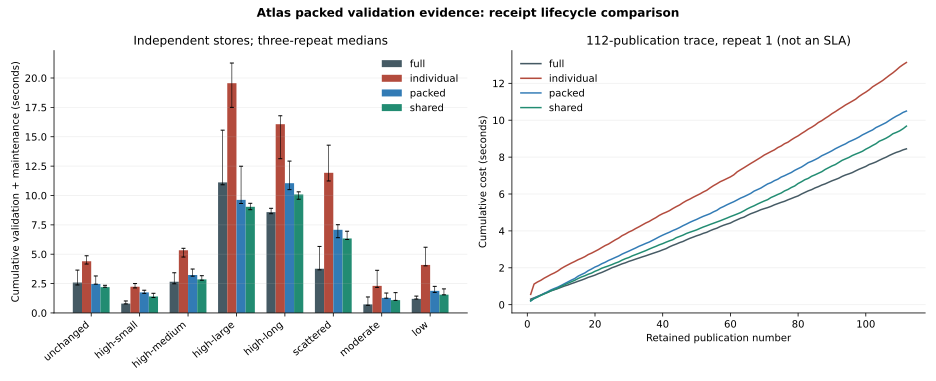

# Atlas retained validation-evidence packing and shared-directory amortization proof

## 1. Executive result

**C - PROOF SUCCESS, within the tested model.** All 4,464 sequence comparisons and 36 independent boundary comparisons agree with full validation. Performance success means a trustworthy architectural decision, including a negative result. Materially winning representations under the frozen rule: `[]`. Full validation is the provisional default for the measured lightweight-rule workloads; this receipt-optimisation line is CLOSED pending new evidence.

The accepted Tryfan pilot remains **CLOSED / ACCEPTED** and the architecture direction remains established. [Raw summary](atlas-validation-packing-results.json), [frozen plan](../../scripts/atlas/validation-packing/plan.json), [baseline](atlas-validation-packing-baseline.json), [decisions](atlas-validation-packing-decisions.json), [regression receipt](atlas-validation-packing-validation.json). Introducing commit is this proof checkpoint; commit/push/cleanliness are separately verified.

At 192 components and 112 retained publications, cumulative full/individual/packed/shared medians are 8.58/16.06/11.05/10.08 seconds. Shared packing reduces requested reads from 43,960 to 23,282 and evidence footprint from 7.15 MB to 2.37 MB, but remains slower than full validation. The 768-component localized case is a positive exception, with 19.4% median paired saving; that does not meet the frozen adoption criterion across the representative32/112-publication workloads.

## 2. Starting checkpoint

Clean main `a027ec76d1d9f34325a4b4d1023c81ae6ff27a60`, origin fetched and 0/0 divergence. No newer legitimate work or uncommitted state required reconciliation. All pre-existing non-navigation files, previous timed code, reports, accepted source/store and production code are protected. No work discarded.

## 3. Exact uncertainty

Do many small evidence objects and repeated root maps cause enough avoidable overhead that immutable packing and a shared group directory repay their complete lifecycle? The uncertainty concerns representation economics, not whether a past boolean proves present validity. A negative materiality result closes this optimisation line; a positive result supports only conditional use, not infrastructure adoption.

## 4. Previous negative amortization finding

[a027ec7](atlas-validation-maintenance.md) remains authoritative: 1,296 comparisons correct; none of 13 sequences amortized in any of three runs. At 112 publications full/individual cumulative medians 10.129/15.399 seconds. At localized 192-component scale, requested reads 6,176/12,600; local receipt files 92,911 bytes versus trust directories1,988,256 bytes. At 112 publications local receipt bytes152,681, trust-directory bytes6,958,896. Old timing is context, not the current comparator; all baselines are reproduced here.

## 5. Frozen hypotheses and acceptance criteria

Plan SHA256 `b99e3482d3ade3564d9ec37f9164c3e8f13fec66a042b5c806b5e66d4d494477` was frozen before implementation. H1 small-object overhead dominates; H2 shared directory improves reuse; H3 pack decoding/integrity/maintenance erases gains; H4 residual population checks set a floor; H5 workload changes outcome.

Correctness requires oracle and expected-verdict agreement, immutable history, zero ancestry, current hashes/completeness, exact eligibility and rejected/incomplete/interrupted root safety. Material performance requires at least 10% median paired cumulative savings plus positive savings in **every** repeat for both high-medium (32) and high-long (112) publications. No weighted score. If neither representation meets both conditions, provisionally use full validation and close this line pending new evidence. No extra representation is introduced after observing results.

H1/H2 are partly supported: packing coalesces many receipt objects and shared directories reduce root metadata. Economic support is workload-specific, not universal. H3 is supported where reduced objects still leave a cumulative loss. H4 is a measured structural floor; causal elapsed dominance is not isolated. H5 is supported by population/update/rule/grouping sensitivity. The primary materiality test uses predeclared K16 at both 32/112 publications; K4/K64 controls do not license choosing a favourable size after timing and assuming unmeasured long-history benefit.

## 6. Existing cost decomposition

Measured prior overhead comprises initial evidence issuance, one local receipt object lookup per eligible component, extra adjacency objects, and four population-wide maps per root. Timing phases isolate validation and maintenance, not a causal filesystem/JSON/hash decomposition. Packing can reduce object discovery and repeated directory bytes. It cannot eliminate current bytes/integrity, qualifier/completeness, affected relationships, eligibility, historical retention or verifier trust. New counters cover those mechanisms; elapsed differences do not prove one operation alone caused them.

## 7. Candidate representations

A full: unchanged oracle predicates, no evidence issuer. B individual: unchanged maintenance implementation and one-file-per-receipt/bucket/four-map root. C packed: family-local fixed groups coalesce receipt, outgoing dependencies and reverse sources, while a flat root repeats slot-to-pack and old-membership maps. D shared: identical immutable group packs with a group-to-pack directory; exact old component membership is obtained from the hashed prior publication already resolved by B/C. Each candidate has an independent store. No candidate benefits from another candidate creating its packs first.

## 8. Packing contract

Group key is family plus numeric partition//K; default K16, sensitivities 4/64. Only compatible family slots are grouped. Each entry contains local receipt, canonical individual receipt digest, outgoing dependency identities/use scopes and reverse source slots. Rule/component/outcome/guarantee binding is unchanged. Pack digest and canonical encoding protect all entries. Individual results remain addressable by trusted root→group→slot plus exact receipt digest; identity is distinct from location. A partial change rewrites an entire immutable group; unchanged packs carry forward. All old packs remain. Missing/corrupt evidence triggers full scientific validation; colliding corrupt immutable output blocks issuance/publication. No signing/certificate service, compression, mutable patching or pack ancestry.

## 9. Shared-directory contract

One immutable publication-specific trusted root references independently hashed packs by family/group. The shared logical directory has two levels: the publication repeats one group-to-pack reference, while slot-to-receipt identities and anchored adjacency live inside the reusable immutable pack. Directory and evidence are deliberately co-located, not separate services; unchanged group directories therefore share the pack identity across publications. The flat candidate uses C slot references; shared uses roughly C/K group references and omits duplicated old-membership metadata. Creation, directory enumeration, lookups, hash/canonical parsing, per-entry eligibility, pack comparison/rewrite, fsync and new root encoding/writes are inside measured validation/maintenance. Directory reconstruction scans the current population; that cost is disclosed. The old baseline already uses direct hashes, not a receipt-search or ancestry-discovery scan; this candidate reduces repeated slot directory bytes and evidence objects rather than claiming to eliminate a search that never existed. Known verifier anchors are inputs retained in external traces for fresh replay; a production anchor discovery/authority registry is not implemented or costed, and its cost remains UNKNOWN. It could only add to the measured lifecycle overhead. Lookup follows the supplied verifier anchor directly, never predecessor ancestry. Directory content hashes establish integrity, not issuer authority.

## 10. Correctness invariants

Full validation remains unchanged. All component bytes are hashed now, every proposed membership passes exact required-family/slot/uniqueness/qualifier checks, and changed content/rules revalidate local predicates. Affected edges are selected from anchored reverse sources; context/cross-rule changes rerun relationships. Historical stale-input allowance is conservative full fallback. Evidence can be locally valid while stale under current policy. No source/result/property/method conflation, erased rights/time/native qualification or skipped input-use scope. Authority requires an independently pinned root issued by the known verifier; compromised issuer/forged trusted anchor is outside the proof.

## 11. Workload matrix

| Sequence | Components / publications / pack size | Full ms | Individual ms | Packed ms | Shared ms | Shared paired saving ms, median [range] |
|---|---:|---:|---:|---:|---:|---|
| unchanged | 192 / 32 / 16 | 2591 | 4402 | 2466 | 2198 | 403 [184, 1292] |
| high-small | 48 / 32 / 16 | 795 | 2229 | 1751 | 1401 | -630 [-649, -519] |
| high-medium | 192 / 32 / 16 | 2656 | 5333 | 3230 | 2857 | -130 [-372, 249] |
| high-large | 768 / 32 / 16 | 11115 | 19559 | 9623 | 9034 | 2121 [1783, 6526] |
| high-long | 192 / 112 / 16 | 8584 | 16065 | 11045 | 10084 | -1404 [-1500, -1232] |
| scattered | 192 / 32 / 16 | 3761 | 11928 | 7079 | 6342 | -2581 [-2581, -1290] |
| moderate | 48 / 16 / 16 | 726 | 2307 | 1280 | 1091 | -367 [-423, -365] |
| low | 48 / 16 / 16 | 1198 | 4087 | 1878 | 1556 | -358 [-612, -357] |
| local-rule | 192 / 32 / 16 | 2639 | 7128 | 3553 | 3082 | -306 [-479, 875] |
| cross-rule | 192 / 32 / 16 | 2508 | 5484 | 3265 | 2853 | -342 [-347, 377] |
| broad-rule | 48 / 16 / 16 | 414 | 1352 | 879 | 677 | -257 [-288, -237] |
| publication-rule | 192 / 32 / 16 | 2541 | 5053 | 3205 | 2831 | -230 [-290, 466] |
| context | 192 / 16 / 16 | 1437 | 4545 | 2246 | 2004 | -567 [-670, -87] |
| high-medium-k4 | 192 / 32 / 4 | 2704 | 5012 | 3660 | 2863 | -142 [-196, 42] |
| high-medium-k64 | 192 / 32 / 64 | 2810 | 5179 | 3435 | 3277 | -467 [-563, -357] |

The same 13 prior sequences plus two high-medium grouping controls produce 15 sequences×3 independent repeats and 1,488 four-way proposals. Populations 48/192/768 components,64 rows/component; lengths 16/32/112. Fan-out1/4; none/local/scattered/half/all terrain changes; targeted local/cross/publication/all-rule and context rotations. Rules revise every 8 publications, context every 4. Scientific predicates remain fixed; rule labels test conservative eligibility invalidation, not arbitrary new predicate equivalence.

## 12. Tryfan baseline

Seven retained scientific generations; five retained families,310 artifacts/42,473,107 bytes; eight representations,193 NRW features,185,036 WorldCover cells, two methods/six current results. S5 recomputes two summit results and reuses two southern results; source payload unchanged. Seventeen accepted-store hashes protect root/history/locators/portrayals. Real qualified templates, method/source/product/time/rights references are reused; synthetic partition rows are metadata, not new observations. Synthetic supports use integer unit intervals and 64 records per component; they are not Tryfan metres, pixels or new habitat features. The one-level dependency scopes are exact for this declared metadata model, not a new scientific derivation. [S6](tryfan-pilot-s6.md) remains CLOSED/ACCEPTED.

## 13. Measurement methodology

Three independent stores per representation per sequence, candidate order rotated by publication+repeat, request caches reset, OS cache uncontrolled. Both baselines rerun in the same environment. Initial full acceptance plus issuer creation and every subsequent issuance included. Fixture generation/update/staged science manifest are common construction, separately measured; all candidates separately execute the identical final integrity/atomic publication guard. Analysis output, end inventory and Python-memory probing are outside timings. Counters include actual object reads+existing-object verification reads, bytes read/written, hash/encoding ops, row/edge checks, per-entry digests, pack records decoded and directory/bookkeeping scans. These are requested logical bytes, not physical disk traffic or billing. Shared construction/publication times remain in external raw traces; validation comparisons exclude common phases for all four.

## 14. Reproduced baselines

| Sequence | Components / publications / pack size | Full ms | Individual ms | Packed ms | Shared ms | Shared paired saving ms, median [range] |
|---|---:|---:|---:|---:|---:|---|
| unchanged | 192 / 32 / 16 | 2591 | 4402 | 2466 | 2198 | 403 [184, 1292] |
| high-medium | 192 / 32 / 16 | 2656 | 5333 | 3230 | 2857 | -130 [-372, 249] |
| high-large | 768 / 32 / 16 | 11115 | 19559 | 9623 | 9034 | 2121 [1783, 6526] |
| high-long | 192 / 112 / 16 | 8584 | 16065 | 11045 | 10084 | -1404 [-1500, -1232] |

Independent publication/state files are identical scientifically; full emits no validation evidence. Initial cold/order effects are visible in raw traces. Paired savings are calculated per repetition before taking medians; subtracting independently computed medians is not a paired difference.

## 15. Individual-receipt results

B uses the exact a027ec7 issuer/predicates, unmodified. Eligibility scans current membership, hashes all component bytes, loads exact receipts, selects affected edges, writes changed receipts/adjacency and retains four-map roots. Any change in observed timing from the previous run is measurement variability, not evidence that old conclusions were rewritten. Full B totals, maintenance, reads and footprints are separately recorded in every observation.

## 16. Packed results

| Sequence | Components / publications / pack size | Full ms | Individual ms | Packed ms | Shared ms | Shared paired saving ms, median [range] |
|---|---:|---:|---:|---:|---:|---|
| high-small | 48 / 32 / 16 | 795 | 2229 | 1751 | 1401 | -630 [-649, -519] |
| high-medium | 192 / 32 / 16 | 2656 | 5333 | 3230 | 2857 | -130 [-372, 249] |
| high-large | 768 / 32 / 16 | 11115 | 19559 | 9623 | 9034 | 2121 [1783, 6526] |
| high-long | 192 / 112 / 16 | 8584 | 16065 | 11045 | 10084 | -1404 [-1500, -1232] |

Fewer objects are read and minted, but grouped records must be authenticated/decoded and precisely eligible. Entry receipt digests are recomputed; packs are never a blanket valid boolean. Partial updates duplicate unchanged entry metadata in replacement packs. Flat slot directory expansion remains population-wide.

The 768-component shared-directory case is a positive bounded exception: paired cumulative saving median19.4%, range[16.0%,41.9%]. It is reported even if the joint32/112-publication primary adoption rule fails. It does not establish universal reuse economics or justify another receipt optimisation task.

## 17. Packed/shared-directory results

| Sequence | Components / publications / pack size | Full ms | Individual ms | Packed ms | Shared ms | Shared paired saving ms, median [range] |
|---|---:|---:|---:|---:|---:|---|
| unchanged | 192 / 32 / 16 | 2591 | 4402 | 2466 | 2198 | 403 [184, 1292] |
| scattered | 192 / 32 / 16 | 3761 | 11928 | 7079 | 6342 | -2581 [-2581, -1290] |
| moderate | 48 / 16 / 16 | 726 | 2307 | 1280 | 1091 | -367 [-423, -365] |
| low | 48 / 16 / 16 | 1198 | 4087 | 1878 | 1556 | -358 [-612, -357] |

D reduces root entries and bytes, not the scientific membership/integrity population. Old component membership comes from exact prior-publication identity; every root carries rules/context/qualifier/implementation and explicit group references. No per-publication ancestry reconstruction or hidden external index. Directory and pack contents are immutable ordinary files solely for this proof.

## 18. Cumulative amortization

Full validation is the provisional default for the measured lightweight-rule workloads; this receipt-optimisation line is CLOSED pending new evidence.

Cumulative totals include baseline evidence preparation, every lookup/eligibility/current hash, selected edge check, record digest, changed-pack encoding/writing, directory/root creation, and immutable retention. Full and individual comparators are current paired measurements. Saving fraction uses each repeat's full total; the frozen decision uses the paired median and every-repeat sign, not a favourable single request.

| Sequence | Full complete sequence ms | Individual complete sequence ms | Packed complete sequence ms | Shared complete sequence ms |
|---|---:|---:|---:|---:|
| high-medium | 7085 | 9282 | 7122 | 6759 |
| high-long | 25053 | 29910 | 24245 | 23477 |
| high-large | 22463 | 30035 | 20694 | 19988 |
| low | 3214 | 5963 | 3711 | 3448 |

These whole-sequence sums additionally include science fixture setup, staged component/manifest construction and the identical final integrity/root-eligibility/atomic-switch mechanism, separately measured for each store. Common phases include many local fsync writes and can dominate total elapsed cost; their timing variation is not attributable to receipt representation. Focused amortization consistently excludes those common phases from every candidate while including all representation-specific setup/maintenance; the complete sums prevent treating validation-only savings as whole-system speedups.

## 19. Break-even analysis

| Sequence | Packed sustained break-even, three repeats | Shared sustained break-even, three repeats |
|---|---|---|
| unchanged | [1, None, None] | [1, 14, 8] |
| high-medium | [1, None, None] | [1, None, None] |
| high-long | [None, None, None] | [None, None, None] |
| moderate | [None, None, None] | [None, None, None] |
| low | [None, None, None] | [None, None, None] |

Break-even means all later cumulative differences in this finite prefix remain positive; it is not a lifetime guarantee. A transient noisy positive prefix is not a material architecture win. All per-publication/cumulative curves are preserved in hash-pinned external raw files.

## 20. Pack-size/grouping sensitivity

| Sequence | Components / publications / pack size | Full ms | Individual ms | Packed ms | Shared ms | Shared paired saving ms, median [range] |
|---|---:|---:|---:|---:|---:|---|
| high-medium-k4 | 192 / 32 / 4 | 2704 | 5012 | 3660 | 2863 | -142 [-196, 42] |
| high-medium | 192 / 32 / 16 | 2656 | 5333 | 3230 | 2857 | -130 [-372, 249] |
| high-medium-k64 | 192 / 32 / 64 | 2810 | 5179 | 3435 | 3277 | -467 [-563, -357] |

Smaller groups reduce copy amplification for partial revisions but add directory/pack objects; larger groups reduce object count but decode/verify/rewrite more unchanged metadata. This controlled comparison does not establish a universal component or pack size. Existing moderate-component findings remain authoritative; rows/components were not repartitioned.

## 21. Rule-change sensitivity

| Sequence | Components / publications / pack size | Full ms | Individual ms | Packed ms | Shared ms | Shared paired saving ms, median [range] |
|---|---:|---:|---:|---:|---:|---|
| local-rule | 192 / 32 / 16 | 2639 | 7128 | 3553 | 3082 | -306 [-479, 875] |
| cross-rule | 192 / 32 / 16 | 2508 | 5484 | 3265 | 2853 | -342 [-347, 377] |
| broad-rule | 48 / 16 / 16 | 414 | 1352 | 879 | 677 | -257 [-288, -237] |
| publication-rule | 192 / 32 / 16 | 2541 | 5053 | 3205 | 2831 | -230 [-290, 466] |
| context | 192 / 16 / 16 | 1437 | 4545 | 2246 | 2004 | -567 [-670, -87] |

Targeted local revisions invalidate only terrain local evidence; cross revisions rerun edges without forcing all local checks; publication rules always rerun completeness. Context affects relationship freshness, not local truth. Old receipts remain interpretable under old rules. Stable implementation fingerprints bind the new adapter and reused old validator/helpers; code rotation invalidates eligibility.

## 22. History-retention effects

Oldest/recent/current publication pins at 112 retained publications resolve 33 membership witness records and zero ancestors in all four representations; three fresh processes per pin. Known trusted evidence roots are provided externally. Direct lookup does not search accumulated roots/packs. Retention grows with changed pack versions plus root references; whole-pack replacement retains copies of unchanged entry metadata. No deletion, compaction, collector or historical-root mutation. Retirement requires absence from every retained history/pin/audit/retry obligation, not merely current ineligibility.

## 23. Metadata footprint

| Sequence | Individual evidence bytes | Packed evidence bytes | Shared evidence bytes | Packed/shared evidence objects |
|---|---:|---:|---:|---|
| unchanged | 2,072,870 | 1,110,402 | 155,266 | 44 / 44 |
| high-medium | 2,101,260 | 1,693,817 | 738,681 | 106 / 106 |
| high-long | 7,145,305 | 5,710,777 | 2,367,801 | 346 / 346 |
| low | 493,721 | 439,265 | 320,449 | 49 / 49 |
| local-rule | 2,165,984 | 1,766,688 | 811,552 | 115 / 115 |
| high-medium-k4 | 2,101,260 | 1,270,432 | 407,264 | 142 / 142 |
| high-medium-k64 | 2,101,260 | 3,414,529 | 2,436,545 | 97 / 97 |

Evidence is measured separately from science components/publication manifests/eligibility trie, common to all candidates. An untimed prefix-aggregation error included scientific validation-component records in the initial evidence total. Final summary and this table use exact evidence schemas from the recorded group inventory; the original summary is archived and hash-linked, all raw/timing/counter observations remain unchanged. JSON bytes are logical file sizes. Pack metadata duplication is deliberate and measured; no physical payload duplication. The full comparator has zero receipt/evidence overhead. Footprint inventory is end-of-sequence analysis, not free hot-path GC.

| Sequence / representation | Requested metadata reads including maintenance | Requested bytes | Creation hash/encode operations | Packs attempted / directly reused |
|---|---:|---:|---:|---|
| high-medium / full | 6176 | 46,044,704 | 0 | 0 / 0 |
| high-medium / individual | 12600 | 51,131,346 | 795 | 0 / 0 |
| high-medium / packed | 6642 | 51,332,475 | 138 | 74 / 310 |
| high-medium / shared | 6642 | 50,407,187 | 138 | 74 / 310 |
| high-long / full | 21616 | 161,156,464 | 0 | 0 / 0 |
| high-long / individual | 43960 | 179,296,176 | 1355 | 0 / 0 |
| high-long / packed | 23282 | 180,049,780 | 458 | 234 / 1110 |
| high-long / shared | 23282 | 176,736,652 | 458 | 234 / 1110 |
| high-large / full | 24608 | 174,615,072 | 0 | 0 / 0 |
| high-large / individual | 49656 | 194,999,416 | 2523 | 0 / 0 |
| high-large / packed | 26190 | 195,779,300 | 174 | 110 / 1426 |
| high-large / shared | 26190 | 192,045,226 | 174 | 110 / 1426 |

Pack creation counts encoding/put attempts; newObjects/newBytes distinguish actual new files from existing-content verification. Encoding/decoding and exact per-entry receipt digest work are reported separately in raw counters. Fewer reads need not mean fewer requested bytes or lower cumulative time.

## 24. Integrity/verification overhead

Current SHA checks are retained for every component. Pack get checks full digest/canonical bytes on first request; cached reuse within that request is disposable. Per-entry canonical receipt digest/precise eligibility is checked again during issuance; this deliberately simple scheme does not claim optimal CPU work. Existing-object put checks stored bytes even with a warm request cache. Common publication guard rehashes current components for all candidates. Recovered orchestration also reads the prior root once before replacement; those common guard reads are separately derived in the recovery receipt, not hidden in validation counters. Corrupt output collisions are explicit failures, not silent repair.

## 25. Residual population-wide costs

| high-long cumulative count | Full | Individual | Packed | Shared |
|---|---:|---:|---:|---:|
| current component integrity | 21504 | 21504 | 21504 | 21504 |
| membership completeness | 21504 | 21504 | 21504 | 21504 |
| semantic rows | 1376256 | 26496 | 26496 | 26496 |
| relationship checks | 7168 | 175 | 175 | 175 |

Current integrity and completeness remain population-wide in every representation. Directory/eligibility and issuer bookkeeping also scan current population; packed selection is not globally O(changed). Counters establish a structural floor. No per-operation elapsed timers isolate hash versus parse versus completeness, so timing dominance of a particular predicate is UNKNOWN. This proof does not optimise these guards.

## 26. Hidden amplification audit

Publication resolution:33 committed eligibility records+publication, no ancestors. Pack lookup: direct group reference; group slot eligibility uses arithmetic family/index boundaries, not a full membership scan per lookup. Directory: flatC versus shared≈C/K; full root creation and membership checks disclosed. Pack decoding: full selected group, counted; cache per request only. Receipt digest checks: per eligible entry and maintenance entry, counted. Relationship selection: anchored reverse source sets for changed targets, context/rule global exceptions. Issuance: C entries inspected/comparison and touched packs rewritten, recorded by reverseBookkeepingEntries/packEntriesWritten. Historical access: independent known roots, zero ancestry. Rule changes may rewrite every affected family group. Memory: current decoded closure is measured; no historical scan occurs in this model, but these peaks are not a formal memory-scaling proof; retained inventory scans all objects only outside hot timings.

## 27. Valid/invalid equivalence

1,488 four-way valid proposals give 4,464 oracle comparisons; 36 boundary proposals across three evidence representations assert expected decisions. Controls: altered component bytes, bad native support metadata, broken dependencies, invalid/incomplete membership, malformed/missing evidence, rule revision, incompatible context, historically permitted stale inputs, corrupt pack/receipt, interruption. Full and candidate decisions agree; missing/mismatched optimization evidence falls back to full. Scientific acceptance and evidence issuance are separate: a corrupt immutable output can prevent the packed publication operation even when full science validation is valid. This is an additional availability failure, reported explicitly; oracle equivalence concerns semantic validation verdicts, not identical storage-success behaviour. No invalid science can be published because of this failure. 32 focused tests cover exact pack/directory/digest/reuse/current-floor/history semantics. This is finite-model equivalence, not arbitrary legal/provider/predicate proof.

## 28. Historical and interruption safety

Each candidate uses the established isolated immutable publication membership and atomic root switch. It validates before the common final current-byte guard; packed issuance must also succeed. A focused pack-written/directory-write interruption leaves old root intact, rejects the orphan candidate and safely retries. Three pre-switch failure/retry controls leave old root unchanged, staged candidate unpublished, deterministic evidence identities reusable, old pins independently readable. Corrupt pack issuance introduces an explicit additional failure boundary and blocks publication. Accepted S1/S5 abrupt-process matrices remain regression evidence; this proof uses deterministic pre-switch interruption rather than claiming a new distributed/power-loss guarantee. No incomplete, rejected or evidence-failed candidate is current. A transient Windows access-denied replace stopped the initial campaign during high-long. Twelve complete repetitions are retained unchanged; the partial stores are preserved but not timed as complete samples. Remaining runs use new stores and a bounded four-attempt replacement retry that requires prior-root equality. Validation predicates, model/receipt identity, matrix and timed validation/maintenance paths are unchanged. The original orchestration source is retained as runner-initial.py; every raw repetition identifies its source hash. Retry events and elapsed common costs are recorded.

## 29. Architectural complexity assessment

New representation adds group assignment, per-entry digest/addressing, pack integrity/eligibility, directory consistency, copy-on-write partial groups and evidence-issuance failure distinction. It replaces tiny receipt/bucket objects with larger coherent groups and separates publication membership from evidence directory. There is no backend/index/worker/API. Initial creation becomes fewer fsync objects, but row checks, current bytes, pack construction, directory population work and historical duplication remain. A smaller receipt count alone does not justify this complexity. The measured 768-component localized shared-directory exception supports the mechanism, but does not erase smaller/long-history losses or pass the frozen breadth criterion. No new representation will be proposed to prolong this optimisation line. Full validation is the provisional default for the measured lightweight-rule workloads; this receipt-optimisation line is CLOSED pending new evidence.

## 30. DECIDE NOW

**N17 - DECIDE NOW.** Evaluate end-to-end lifecycle cost, not receipt count; retain exact content/rule/guarantee/trust binding and current integrity/completeness. A corrupt pack write collision is an explicit evidence-issuance failure, never permission to overwrite immutable evidence. Evidence: 4464 sequence oracle comparisons, 36 boundary comparisons and corrupt pack publication guard.

## 31. PROVISIONAL DIRECTION

**P11 - PROVISIONAL DIRECTION.** Full validation is the provisional default for the measured lightweight-rule workloads; this receipt-optimisation line is CLOSED pending new evidence. Evidence: The frozen criterion requires at least 10% median paired saving and positive savings in every repeat at both high-medium and high-long. Neither representation passes: [].

## 32. DEFER PENDING EVIDENCE

**D11 - DEFER PENDING EVIDENCE.** Real payload-integrity/availability costs, more expensive predicates, custody/trust boundaries, deployed latency, arbitrary graphs and retention/retirement obligations. No database, cloud or production receipt store selected. Evidence: Metadata-only synthetic model and unchanged population-wide integrity floor; RSS unknown.

## 33. REJECT

**R11 - REJECT.** Adopting incremental validation from row savings alone, excluding pack/directory costs, permanent valid booleans, untrusted candidate-selected anchors, skipped current hashes, stale-as-false or ancestry-dependent history. No further receipt representation to prolong this optimisation line after a negative materiality result. Evidence: Four independently stored representations; all earlier negative evidence remains authoritative.

## 34. Limitations

Local ordinary filesystem, single verifier/writer, JSON metadata, synthetic one-level terrain→derived graph, fixed cheap 64-row predicates and rule label rotations. Real Tryfan anchors/template science are unchanged, not a second pilot. No new physical payload scale, provider/rights mutation, expensive predicates, arbitrary graphs, external attackers/compromised issuer, production trusted-anchor registry/retention maintenance, cloud/distributed atomicity or durable power-loss claim. File sizes are not disk allocation/egress. OS cache/order noise remains; three repeats report median/range. Python traced peaks below exclude interpreter/native/OS buffers; RSS is UNKNOWN.

- full: Python peak allocation 1,495,133 bytes at high-large final proposal; RSS unavailable.
- individual: Python peak allocation 2,986,723 bytes at high-large final proposal; RSS unavailable.
- packed: Python peak allocation 2,802,601 bytes at high-large final proposal; RSS unavailable.
- shared: Python peak allocation 2,403,654 bytes at high-large final proposal; RSS unavailable.

## 35. Regression validation

[Machine receipt](atlas-validation-packing-validation.json) records complete commands/counts/hashes. The completed run passes 89 checks and 436 tests (32 focused plus 404 established), type checks, lint and build; commands and totals are in the receipt. All original non-navigation tracked bytes are checked at a027ec7, including S1–S6 reports, previous architecture/experiment code/results, frozen contracts and production. 310 registered evidence hashes, 1575 retained source files, 17 accepted-store hashes/seven generations, 42 canonical status rows and 113 protected production hashes remain unchanged. Full previous measurement reproduction, pilot/frozen/runtime/planning/native/browser suites, type checks, lint/build and diff/link/path/size guards run. No private access, new source evidence, infrastructure or GC; large fixture/raw state external. Source hashes in final results bind timed code. Final staged diff/untracked review and public upstream verification complete Git discipline.

## 36. Decision A/B/C

**C - PROOF SUCCESS.** Correctness and measured lifecycle accounting establish whether the two bounded packed representations meet the frozen materiality standard. This is a proof of the decision within tested scope, not a claim that all receipt systems or production workloads have the same economics. Full validation is the provisional default for the measured lightweight-rule workloads; this receipt-optimisation line is CLOSED pending new evidence.

## 37. Exactly one next bounded Atlas task

**Atlas retained payload-integrity and publication-validation cost assessment.** NOT BEGUN. Recover actual retained payload/current-integrity and publication-guard costs and custody/failure assumptions; separate metadata predicates from availability and payload hashing. Identify which guarantees and scale evidence would justify a future change, without changing current guards, optimising another receipt representation or adopting infrastructure. The population-wide residual in this proof and `c4f50a4` scale uncertainties motivate this assessment. No production implementation, acquisition, derivation, Appearance/Swiss, S7 or service transition.
