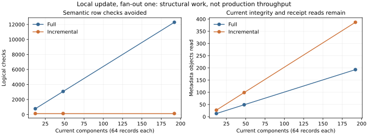

# Atlas retained validated-component reuse and incremental publication-validation proof

## 1. Executive result

**C - PROOF SUCCESS**, within the fixed tested publication model and explicit trust boundary. All 46 measured proposals agree with full validation and their expected verdicts; 36 focused tests additionally exercise trust, historical policy and publication safety. No missed rejection was observed.

At 192 components / 12,288 synthetic metadata records, a localized fan-out-one update reduces row checks to 128 and relationship checks from 64 to one. Median full/incremental validation is 61.38 / 57.80 ms. But metadata reads increase from 193 to 387, and all 192 component byte hashes remain necessary. This proves qualified semantic reuse, not changed-state-only I/O or production adoption. New validation-evidence issuance remains full-validation based and is the next unstarted experiment.

## 2. Starting checkpoint

Clean main `38f9ba79822ab2498f6f4acf387e07b5b79f22ba`, after fetching origin, upstream origin/main at 0/0. No newer legitimate commit or pre-existing modification was present. The introducing commit of this report is the proof checkpoint. [Frozen baseline](atlas-validation-reuse-baseline.json) and [plan](../../scripts/atlas/validation-reuse/plan.json) preserve the start; final cleanliness/divergence are checked after push.

## 3. Target uncertainty

Can prior acceptance of immutable component-local structure safely replace repeated semantic checks while changed relationships and current context are still validated? What independent evidence of that acceptance is required, and does finding/trusting it cost more than repeating the checks? Publication membership, component content and validation evidence are distinct identities. No storage vendor is part of this question.

## 4. Why full validation remains a scaling concern

[38f9ba7](atlas-component-granularity.md) validates every one of 2,048 records for each of 48 updates, even when two metadata records change. It also rebuilds/hashes the complete population during construction. The previous membership proof removed historical traversal, not current-population validation. Request-scoped reuse at [e88b575](atlas-generation-scaling.md) reduced 25,016 ancestry reads to 112 but retained historical work; [97c31c8](atlas-component-membership.md) established bounded direct membership. We test repeated validation without altering those results.

## 5. Scope and exclusions

Isolated deterministic component metadata, receipts, contextual and cross-component checks, full-oracle comparisons, local publication safety, measurements and reporting only. No pilot/runtime/frozen-contract modification; database/cloud/cache/API/worker infrastructure; source acquisition; physical method; Weather/Traverse; Appearance/Swiss work; S7 or service-readiness work. Synthetic intervals and revision labels are experimental metadata, not observed ground states.

## 6. Authoritative foundations

[Granularity](atlas-component-granularity.md), [membership](atlas-component-membership.md), [ancestry scaling](atlas-generation-scaling.md), [measured architecture](atlas-measured-storage-processing-serving.md), [S6 exit](tryfan-pilot-s6.md), [S1](tryfan-pilot-s1.md), [S2](tryfan-pilot-s2.md), [S3](tryfan-pilot-s3.md), [S4](tryfan-pilot-s4.md), [S5](tryfan-pilot-s5.md), [storage requirements](atlas-storage-processing-serving-requirements.md), [synthesis](atlas-world-model-architecture-synthesis.md) and [lifecycle](atlas-derived-understanding-lifecycle.md). The plan hashes their original bytes and actual catalogue/generation/dependency/derivation/delivery/update/world implementations. Existing frozen Terrain/Semantic contracts remain authoritative and unchanged.

## 7. Frozen hypotheses and acceptance criteria

The plan was written before implementation, SHA256 `d75f37cfad5da78c34e12891d127331831b49ffb5fa449bc041ca728cb26241b`.

- H1: pure component-local checks are reusable with identical bytes/rules.
- H2: publication context and affected cross relationships must rerun.
- H3: dependencies may defeat safe/useful incremental selection.
- H4: establishing trusted reuse may outweigh savings.

Acceptance requires expected full/incremental accept/reject equality for every measured case, present-byte checks in both paths, fallback rather than authorization from bad receipts, rule/context invalidation, zero ancestry, immutable history and pre-switch invisibility. One missed oracle rejection fails correctness irrespective of speed. No timing threshold was invented after measurement.

H1/H2 are supported in this model; H3 was not observed at fan-out one/four. H4 is conditional: read/preparation overhead is real even where semantic savings reduce elapsed time. These are finite witnesses, not universal equivalence. Rehearsals exposed a missing receipt schema tag and nondeterministic failure counters after JSON reload/hash-seed changes. Member and changed-target iteration are now sorted; explicit serialization/fresh-process counter tests guard both defects. Complete helper-source rule binding and strict hex addressing were also established before the final campaign. No accept/reject disagreement was observed; the fixes concern proof trust/addressing and instrumentation, not an Atlas contract change. All 36 tests passed before final measurements. Earlier raw state remains outside Git; `campaign-final4` supplies the reported results, not a selected best timing run.

## 8. Existing validator inventory

[Check inventory](../../scripts/atlas/validation-reuse/inventory.json) maps ten guarantee groups to actual functions and inputs. `validateCatalogue` validates schema, identities and joins; `verifyArtifacts` reads current files. `validateGeneration` composes catalogue, delivery, dependency and finite update rules; `validateTransition` compares prior/current state. `validateDependencies` checks exact receipts, graph and retained input scope; `derivations.validate/assess` adds selection, policy and active-result conditions. `verifyDelivery` checks current portrayal/recipe bytes. The previous synthetic `audit` recursively checks descriptors, population/key uniqueness and upstream references. These functions are preserved; the new oracle is an explicit bounded projection, not a replacement installed into the pilot.

## 9. Check-dependency classification

| Group | Dependencies and reuse boundary |
|---|---|
| L1 schema/internal structure | Exact immutable content and complete validator/serializer rule. Reuse only after current content hash. |
| L2 internal process/result receipts | Entire captured immutable graph and method/contract identities. External root/catalogue/active-policy checks are separate. |
| X1 source/product/representation/rights joins | Both endpoints and native qualifiers. No live licence authorization is certified. |
| X2 dependency/support references | Exact target identity and actual-use scope; anchored reverse buckets select affected sources. Historical availability is distinct. |
| P1 completeness/uniqueness | Whole proposed membership and required families; always rerun. |
| P2 predecessor/root/update conditions | Current accepted root and exact proposed publication; check at switch. |
| F1 freshness/current policy | Method, applicability/reference context, inputs/support and policy; context changes rerun relationships. Stale historical claims remain valid. |
| E1 present bytes/locators | Current availability/hash/size. Past acceptance cannot establish present bytes on ordinary files. |
| E2 rule/environment prerequisites | Explicit implementation/report/recipe/environment identities plus current guard checks. |
| E3 provider/legal authorization | Not implemented in pilot/model; no timeless certificate or inferred redistribution rights. |

The model covers canonical component structure, ordered keys/cardinality/scopes, methods, dependency identity/support, exact native qualifiers, membership/policy and local root conditions. It does not prove an incremental replacement for every scientific/GIS/rights check in the monolithic pilot.

## 10. Reusable validation evidence model

An immutable local receipt contains schema, component digest, complete rule digest, outcome `valid`, guarantee `component-local-only`, and family/scope/method/count/dependency-count summary. Publication-specific freshness is excluded. Separate immutable outgoing/reverse buckets describe contextual relationships. A trusted root names the accepted publication, exact membership/context/qualifier/rule and hashes of receipts/buckets. `prepare()` runs full acceptance before minting it; issuer cost is measured separately.

## 11. Reuse eligibility and invalidation

The caller pins a root returned by a known trusted verifier independently of the proposed publication. A content hash establishes integrity, not issuer authority. Candidate-supplied trust fields are rejected. A malicious verifier or replaced trusted caller anchor is outside scope; this is not a CA/security service. Ordinary files can still be corrupted, so every current component is reread/hashed.

Reuse additionally requires same rule digest and prior member identity in the same logical family/partition slot. Local validation checks that expected slot; its binding is captured in the anchored membership, not inferred from a filesystem name. A remapped component cannot reuse that shortcut. The rule binds `core.py` and the reused granular helper source; frozen hashes preserve other prerequisites. Rule rotation or unknown/corrupt/missing evidence invalidates the shortcut. A changed qualifier fails the bounded pinned-qualification rule. Bad optimization evidence alone triggers full validation rather than rejecting otherwise valid science. A prior boolean is never sufficient.

## 12. Candidate incremental validation process

Resolve explicit membership; always check publication shape/required families/uniqueness and exact native qualifier. Verify the trusted root and its prior accepted publication. Hash every current component. Reuse matching local receipts; parse/check changed components. Compare membership/context and select affected sources through reverse target buckets. Check new outgoing relationships directly and unchanged affected sources through anchored outgoing buckets. Context changes rerun all relationships. Insufficient trust falls back to full validation.

Publication invokes validation itself, rechecks component integrity, verifies current predecessor and uses the established atomic eligibility/current switch. The API does not accept a caller's arbitrary `valid` boolean. No consumer query executes derivations.

## 13. Publication-wide invariants

Whole membership completeness, three required families, exact slot population, unique component identities, schema/context form, explicit predecessor, native qualifier identity and coherent eligibility remain mandatory. Every accepted 192-component proposal scans 192 memberships and hashes 192 current components. The trust directory also has 192 logical entries with maps for identities/receipts/outgoing/reverse references. Hashing cost follows current bytes, not changed records. No provider-enforced immutable-file assumption removes this residual.

## 14. Cross-component check selection

A trusted reverse bucket maps a target slot to sources whose accepted dependencies use it. Comparing membership costs C slot comparisons; reading the anchored directory is also population-wide. Only changed targets' buckets and unchanged affected sources' outgoing buckets are fetched; changed sources already expose new edges.

At 192 components, fan-out-one local change reads two reverse buckets, discovers one prior source reference and reruns one relationship; 63 relationships reuse prior acceptance. Fan-out four reads five reverse buckets, discovers four source references and reruns 16 relationships. This avoids full edge traversal during selection, not membership/directory scans. Building the index during preparation scans all accepted components/edges; this is reported separately.

## 15. Tryfan baseline

[Baseline](atlas-validation-reuse-baseline.json): pilot CLOSED / ACCEPTED, seven scientific generations, 310 artifacts / 42,473,107 retained bytes, five families, two methods and six current results. S5 recomputes two summit results and reuses two southern results; all 310 scientific artifacts are unchanged. Generation files total 5,658,085 bytes. Seventeen hashes protect root, generations, locators and portrayals. Prior validation: 66 checks/338 tests, 42 historical research statuses and 113 protected production hashes.

Native time/support/rights/mappings remain in an exact separate qualifier object. Synthetic populations are not 12,288 new observations. The synthetic derived method reference uses the existing frozen method revision, not a new derivation algorithm.

## 16. Deterministic fixture/workload matrix

24 primary cases: 4/16/64 components per terrain/semantic/derived family, 64 records/component, fan-out one/four, and no change/one localized change/four scattered targets/quarter replacement. Derived metadata changes only where target identity changes; unaffected components carry forward.

Twenty-two independent boundary stores cover invalid content, structure, scope, references, completeness, policy and trust, plus legitimate rule rotation and historical staleness. Six current/recent/oldest pins at 7/112 publications, four abrupt failures and two successful retries complete the matrix. Six additional focused tests cover candidate-designated trust, changed native qualifiers, historically allowed method-policy staleness, strict identity validation before filesystem access, serialized member ordering and fresh-process hash-seed-independent failure counters. No huge Cartesian workload or new evidence family.

## 17. Instrumentation

Each validation request resets process caches. Counters separate local checks/rows/reuse, executed/reused relationships, receipt reads, reverse/outgoing buckets/edges, memberships, trust-directory entries, current component integrity, object reads/bytes/hash operations and fallback work. Reused cross count is edges, not components. Eligibility resolution separately counts 33 committed records, outside validation timing.

Constructor hashing/reuse reads/writes, fixture time, full evidence preparation and final publication are separate. Logical counters measure requested metadata, not physical disk blocks or egress. Check-selection cost is reported through directory/slot/bucket/edge counters; isolated selection elapsed time was not measured. Full row checks stop at first invalidity in failure cases.

## 18. Full-validation baseline

Full dispatch applies the same local and contextual predicates to every component/relationship after mandatory publication checks. At largest scale it performs 192 local checks, 12,288 row checks and 64/256 relationships, with 193 object reads including the native qualifier. It does not trust receipts.

Both paths share pure predicates to prevent rule drift, but independently select which checks execute. Expected invalid verdicts and corruption tests constrain this shared-oracle limitation; finite testing is not proof for arbitrary future rules. Present integrity checks are deliberately retained in both dispatches.

## 19. Incremental-validation results

| Case | Changed components | Rows full / incremental | Relationships full / incremental | Reads full / incremental | Median ms full / incremental |
|---|---:|---:|---:|---:|---:|
| 12 components, no change, fan-out 1 | 0 | 768 / 0 | 4 / 0 | 13 / 27 | 5.16 / 4.52 |
| 48 components, local, fan-out 1 | 2 | 3,072 / 128 | 16 / 1 | 49 / 99 | 15.12 / 12.24 |
| 192 components, local, fan-out 1 | 2 | 12,288 / 128 | 64 / 1 | 193 / 387 | 61.38 / 57.80 |
| 192 components, local, fan-out 4 | 5 | 12,288 / 320 | 256 / 16 | 193 / 384 | 58.80 / 50.30 |
| 192 components, quarter, fan-out 4 | 35 | 12,288 / 2,240 | 256 / 76 | 193 / 369 | 75.28 / 56.44 |

[Compact results](atlas-validation-reuse-results.json) retain every case and min/median/max timing; the hash-pinned raw receipt is external. No small noisy timing difference is treated as a correctness result.

## 20. Valid/invalid equivalence results

All 29 valid proposals are accepted and all 17 invalid proposals rejected by both dispatches. No disagreements are averaged away. Boundary decisions:

| Case | Full | Incremental | Interpretation |
|---|---|---|---|
| content-hash | REJECT | REJECT | Matching expected bounded rule |
| missing-component | REJECT | REJECT | Matching expected bounded rule |
| malformed-metadata | REJECT | REJECT | Matching expected bounded rule |
| invalid-scope | REJECT | REJECT | Matching expected bounded rule |
| duplicate-key | REJECT | REJECT | Matching expected bounded rule |
| missing-dependency | REJECT | REJECT | Matching expected bounded rule |
| broken-cross-reference | REJECT | REJECT | Matching expected bounded rule |
| changed-dependency-identity | REJECT | REJECT | Matching expected bounded rule |
| cross-support | REJECT | REJECT | Matching expected bounded rule |
| incompatible-membership | REJECT | REJECT | Matching expected bounded rule |
| incomplete-publication | REJECT | REJECT | Matching expected bounded rule |
| stale-rule-evidence | ACCEPT | ACCEPT | Full fallback; receipt is not authority |
| unknown-rule | REJECT | REJECT | Matching expected bounded rule |
| changed-method-policy | REJECT | REJECT | Matching expected bounded rule |
| changed-reference-context | REJECT | REJECT | Matching expected bounded rule |
| historical-stale-allowed | ACCEPT | ACCEPT | Historical validity remains distinct from current freshness |
| unrecomputed-dependency | REJECT | REJECT | Matching expected bounded rule |
| forged-receipt | ACCEPT | ACCEPT | Full fallback; receipt is not authority |
| corrupt-receipt-and-invalid-component | REJECT | REJECT | Matching expected bounded rule |
| missing-trust-index | ACCEPT | ACCEPT | Full fallback; receipt is not authority |
| corrupt-index-and-stale | REJECT | REJECT | Matching expected bounded rule |
| unknown-anchor | ACCEPT | ACCEPT | Full fallback; receipt is not authority |

## 21. Reuse-ratio results

At 192 components, fan-out-one local update retains 190 local receipts (98.96% component identity reuse), validates two new components and reuses 63/64 relationship checks. Fan-out-four local update retains 187 receipts and reuses 240/256 relationships. Quarter target replacement affects 35 components at fan-out four, reuses 157 local receipts and 180 relationships. These ratios are derived from deterministic counters, not inferred from timing. Metadata content and retained payload reuse are separate; no scientific source payload is duplicated or changed.

## 22. Changed-state/dependency results

A local target update changes its component identity and the metadata of only sources whose exact input identities change. Fan-out controls amplify the affected set honestly: one target with fan-out four updates four derived components, then validates their 16 outgoing relationships. Scattered and quarter changes increase the selected union, not a blanket recomputation.

The builder still visits all derived components to discover/update their explicit edges; construction counters report its reads/writes and timings. It is not an incremental builder. No physical output is computed in these synthetic controls. Real two-result selective recomputation and derived-to-derived staleness remain the unchanged S3/S5 compatibility witnesses; the new selector models only the finite terrain-to-derived relationship pattern.

## 23. Rule/context-change results

Rule `v2` is a labelled validator-identity rotation with unchanged predicates, not a fabricated scientific algorithm revision. It disables all prior local receipts: 3,072 row checks and 16 relationships rerun at 48 components. Full/incremental medians are 23.69 / 15.98 ms. The additional trust-root read is counted; elapsed differences are noisy. Unknown rules reject.

Changed method/reference policy rejects a require-fresh publication. A changed input identity without refreshed dependent metadata also rejects under that policy. With historical allowance, the same retained stale claim remains valid, and its exact old input bytes are checked; 16 contextual relationships rerun. Method-policy staleness with historical allowance is separately tested. Contextual checks never inherit a timeless `fresh` flag from a local receipt.

## 24. Population-wide residual work

Unavoidable in this tested ordinary-file model: current component availability/digest verification, current native-qualifier verification, required membership completeness/uniqueness, and comparison of proposed slots against the trusted prior directory. These costs are proportional to C and current metadata bytes. Publication rechecks integrity immediately before switching, in addition to its validation invocation.

Reconstructing a new trusted evidence root currently calls full validation and rebuilds its directory/buckets. That implementation is deliberately not concealed as changed-state work. A receipt can remove repeated semantic validation without making the complete preparation/construction/publication path incremental. Source payload integrity uses unchanged established regression paths; no claim is made that arbitrary payload verification is cheap or eliminated.

## 25. Trust/verification overhead

At 192 components/fan-out one local change: incremental requests 1,585,797 bytes versus 1,438,897 full, and 387 reads versus 193. The extra reads include the trusted root/prior publication and 190 local receipts, plus selected buckets. Every current component is still verified; small receipts avoid row parsing/semantic work, not underlying integrity reads.

Invalid receipts, reverse directories or unknown anchors cause full fallback. Malformed scientific state still rejects. Rejected contextual cases may execute partial incremental work and then full rejection again; counters retain this extra work. An attacker controlling the issuer or independently pinned anchor is outside the proof's trust model; no self-hashed object is treated as proof of trusted issuance.

## 26. Metadata footprint

Initial evidence preparation, including the immutable publication object, adds:

| Components | Fan-out | New evidence objects | New evidence bytes |
|---:|---:|---:|---:|
| 12 | 1 | 24 | 10,875 |
| 12 | 4 | 21 | 12,102 |
| 48 | 1 | 84 | 41,018 |
| 48 | 4 | 84 | 47,141 |
| 192 | 1 | 324 | 162,362 |
| 192 | 4 | 324 | 187,349 |

Equal empty outgoing/reverse buckets share content identities, hence object counts differ by density. Receipts contain summaries rather than duplicate 64-record bodies; roots repeat explicit identity/reference maps, and outgoing buckets duplicate small dependency descriptions intentionally. New publication membership remains O(C); there is no ancestry chain. Logical byte counts omit filesystem allocation overhead. Large benchmark objects stay outside Git; only the 216 KB-class result summary, code, frozen metadata, plot and reporting are committed.

## 27. Timing/memory observations

Five repeated validations per mode/case clear in-process caches; OS caches are not evicted. Full and incremental batches are not randomized, so tiny speed differences are not causal evidence. Some primary cases are slower incrementally, including small scattered or moderate quarter updates. Correctness and structural counts dominate.

At 192 components/local change, five independent processes give full/incremental validation medians 52.60 / 40.76 ms at fan-out one and 53.13 / 40.11 ms at fan-out four. Startup plus validation is 164.61 / 151.35 ms and 167.64 / 153.31 ms. Startup includes reconstruction of the fixed retained qualifier and module loading. RSS was unavailable without adding a dependency and is recorded as null, not zero.

Initial trusted-evidence preparation takes about 478-515 ms at 192 components. Dividing 515 ms by the 3.58 ms local validation saving gives roughly 144 repeated validations to cover that initial cost alone (DERIVED FROM MEASUREMENTS). This is not end-to-end amortization: updates, new evidence issuance, writes and variable timing remain. Retry publication takes about 119-129 ms in two observations, including validation, immediate integrity recheck and eligibility/fsync work; these are single-run observations, not SLAs.

## 28. Hidden amplification audit

| Path | Work that remains | Ancestry |
|---|---|---:|
| Publication discovery | Fixed 33 eligibility nodes + one publication; sibling bytes grow modestly with retained count | 0 |
| Local validity | C present-byte hashes; changed row checks plus C-scale receipt lookup | 0 |
| Affected relationships | C membership/root-directory comparisons, selected reverse/outgoing buckets and affected edges | 0 |
| Native qualification/provenance | One exact shared qualifier; unchanged identities/rights/time retained, no arbitrary live rights closure | 0 |
| Historical validation | Explicit independent membership, selected immutable content and original context | 0 |
| Evidence preparation | Full component/edge validation, bucket/directory construction and writes | 0 |
| Proposed-state builder | Current component/edge traversal and hash/reuse comparisons | 0 |
| Publication | Validation, second integrity check, predecessor check and eligibility/current commitment | 0 |

No population-wide scan is renamed incremental. No hidden provenance/dependency ancestry is introduced. Broader real dependency graphs, changing qualifiers, external policies and remote integrity guarantees require separate evidence.

## 29. Historical and publication safety

Current/recent/oldest access at 7 and 112 retained publications performs 33 committed eligibility reads plus one publication, with zero ancestry. Requested resolution bytes are about 9.4 KB at seven publications and 15.7 KB at 112; sibling fan-out bytes increase even though path depth does not. Fresh historical validations are about 11.0-14.2 ms and remain independent of publication age within that fixed 48-component population.

Four genuinely abrupt fresh-process exits (after validation and before the atomic switch at both history depths) leave current root byte-identical and candidates ineligible. Fresh processes still load/accept the old publication. The measured pins are taken at 7/112 publications before retry; successful retry adds publication 8/113 in those isolated stores. Two retries publish successfully, while old pinned identities and metadata remain independently readable. Rejected/incomplete proposals cannot advance current. Minimum relevant failures are tested; the full S1/S5 matrix remains preserved and is exercised through existing regression commands.

The model reuses the prior proof's fixed-depth eligibility implementation and atomic current/membership pair. It is single-writer/local; concurrent external mutation between guard and switch, host power loss, distributed/cloud semantics and compromised trust issuance are not proven. Original qualified answers, native semantics, rights, exact pixel replay and isolated serving consumers are preserved and checked by unchanged pilot/prior-proof regressions; no new production serving adapter or physical replay algorithm is added.

## 30. Architectural interpretation

Safe reusable results are pure component-local guarantees bound to exact bytes, complete rule identity and trusted issuance. Context/dependency freshness and present-byte availability remain separate. Current completeness and root conditions always rerun. A reverse relationship directory can select affected checks after explicit membership comparisons without scanning every edge.

The tested full and incremental decisions agree on all valid/invalid proposals, including stale historical acceptance and corrupt-optimization fallback. Semantic work follows changed components/affected edges; integrity and directory work follow total current state. History depth does not cause ancestry work. This justifies a qualified logical direction while preserving full validation as oracle/fallback.

It does not yet justify adopting the measured issuer: refreshing evidence still incurs full validation and metadata preparation. Efficient evidence maintenance and its amortization are the highest-value next uncertainty. Storage immutability/trust, real graph/rights/qualifier cardinality, dependency fan-out beyond four and actual storage technology remain unresolved.

## 31. DECIDE NOW

**N13:** Bind reuse to exact content, complete rule/implementation identity, scoped guarantee and a separately trusted verifier anchor. Present integrity and contextual validity are distinct; unavailable reuse trust means revalidation.

**N14:** Always establish completeness/uniqueness and coherent eligibility; count current integrity, membership/directory scans and evidence preparation. Reused semantic checks do not remove those costs. These strengthen N11/N12 and the accepted publication invariants, without choosing infrastructure.

## 32. PROVISIONAL DIRECTION

**P09:** Qualified local receipts plus trusted explicit reverse relationship buckets reduce repeated semantic/affected-edge work in high-reuse publications. Retain full oracle/fallback. This advances the incremental-validation part of D08 and complements P08; no pilot or production validator adopts the shortcut.

## 33. DEFER PENDING EVIDENCE

**D09:** Evidence issuance/maintenance amortization, receipt packing, real rights/applicability and arbitrary/transitive selector closure, integrity trust on deployed storage, component sizes and database/cloud selection. Current issuance still performs full validation; the next experiment addresses that cost before recommending adoption. A graph database, cache service or task system is not implied.

## 34. REJECT

**R09:** Permanent valid booleans, candidate-designated trust, identity-only skipping of current ordinary-file integrity, unchanged-content-as-current-freshness, omitted publication completeness, hidden index-preparation or ancestry costs, and claims of fully changed-state-only validation. Stale is not false. An invalid optimization receipt cannot make bad science acceptable or valid science invalid.

## 35. Remaining uncertainty and limitations

This is a finite synthetic projection with exact retained native qualifiers, not general equivalence for every Atlas validator. Component-local rules intentionally remain small; spatial intervals are not real GIS. Dependency selection models terrain-to-derived fan-out one/four; actual derived-to-derived science is regression evidence, not a new indexed arbitrary-graph proof. Rights references survive, but evolving legal authorization is untested. Immutable receipt integrity is not an adversarial issuer-security proof.

Current-state hashing, C-scale directories, full evidence issuance and full builder traversal remain. Repeated localized updates could make issuance dominate savings; receipt file count could make remote reads worse. Concurrency, deployed immutability, remote durability, storage products, broad source changes and rule evolution remain deferred. No research contradiction appeared; Tryfan stays CLOSED / ACCEPTED, Appearance unresolved/non-blocking and Swiss multiview parked.

## 36. Regression validation

[Validation receipt](atlas-validation-reuse-validation.json) records commands, 77 checks and 374 tests: 36 focused proof tests plus the unchanged 338-test relevant suite. It checks deterministic decision/counter reproduction, raw/code/plan hashes, 1,575 retained source files, 310 registered artifact hashes, all seven scientific generations and 17 accepted store hashes, all 42 research statuses, all 113 protected production hashes, links/anchors, scope, frozen domain tests, prior S1-S6/proof/scaling/architecture/planning/native/browser evidence, semantic types, lint/build and diff whitespace.

Every non-navigation tracked file at the starting checkpoint is protected byte-for-byte. No accepted report, source, frozen contract or production Atlas/Weather/Traverse code changes. No private data, new real evidence, infrastructure or unnecessary large fixture is added. Reproduction commands and trust limitations are in the [README](../../scripts/atlas/validation-reuse/README.md).

## 37. Decision A/B/C/D

**C - PROOF SUCCESS.** Safe scoped validation evidence and bounded affected-relationship selection preserve every tested acceptance/rejection, historical and publication guarantee. Remaining population-wide work and trust/issuance costs are explicit. A is not supported by the observed equivalence; B is not needed for the targeted finite question, while adoption and generalized performance remain deferred. This decision authorizes no production implementation.

## 38. Exactly one next bounded Atlas task

**Atlas retained validation-evidence maintenance and amortization experiment.** Not begun.

Use an isolated repeated localized publication sequence to compare the measured full evidence reissuer with authenticated carry-forward of eligible receipts and affected reverse buckets. Keep this full oracle and corruption/context/rule/history/publication checks. Measure issuance, verification, read/write footprint and end-to-end amortization against full validation. Reject maintenance shortcuts if they lose equivalence. Evaluate packing only if measured maintenance cost makes it architecture-relevant; no database/cloud/API, production issuer, new evidence/method or service transition. This task follows from the 478-515 ms preparation cost, not an invented S7.
