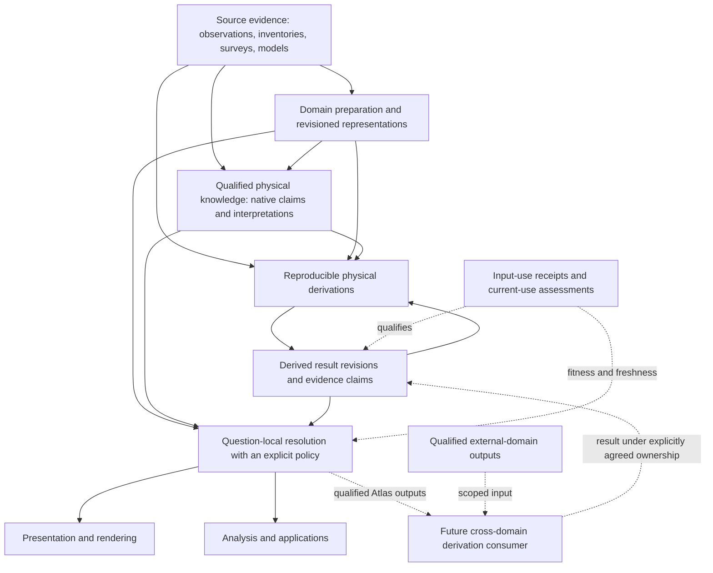
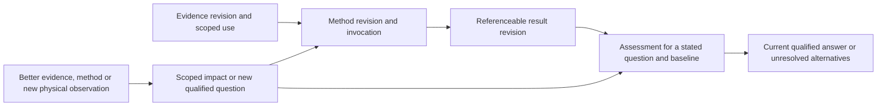

# Atlas world-model architecture synthesis

2026-10-06. **Architecture decision C: sufficiently founded for a bounded integrated
regional proof, while specified research continues separately.** This is the target
architecture implied by retained evidence, not an implemented world model or a new
contract. Starting state: clean `main` at
`43afe78e549f6707f0648465af6d7c6e0aabb430`, “Assess Atlas derived understanding
revision lifecycle”. Fetching origin confirmed **0 ahead / 0 behind**; no newer
commit or local work required reconciliation. Nothing was discarded.

## 1. Executive architecture

Atlas's world model is a **coordinated set of evidence-backed representations,
qualified claims and reproducible derivations that can resolve useful answers for
a place, time and physical question**. It is not one stored answer per coordinate.
Sources, geometry, imagery, semantic evidence and computational artifacts keep their
own structures. Small explicit references connect them; a question-specific resolution
records what was selected, what remains uncertain and why.

The research supports this architecture without requiring another foundational
experiment. It does not establish an operational resolver, complete feature identity,
automated invalidation or complete appearance. The next proof must demonstrate bounded resolution/dependency flows, rather than
complete feature matching or start with a global catalogue or database.
No foundational contradiction was found; frozen contracts remain unchanged.

Three durable boundaries govern the result:

- Preserve evidence and revision snapshots; revise qualified understanding and
  current-use assessments without rewriting history.
- Separate physical meaning, preparation and depiction. More delivery pixels,
  hillshade or a preferred renderer cannot become new measurements.
- Resolve fitness for a stated question. Eligibility, information support,
  scientific acceptance, freshness and rights are distinct, with unknown allowed.

The [canonical 42-thread register](atlas-research-state.md) remains the authority
for research status. This report supplies architecture placement and a finite proof
specification, not a competing research queue. The
[lifecycle assessment](atlas-derived-understanding-lifecycle.md) supplies detailed
identity/change semantics. **M** below denotes retained Meridian findings; **I**
denotes this architectural synthesis; **Q** denotes an unestablished capability.
Established methods/source facts are inherited from the cited reports, not newly
verified externally. Walkthroughs are representability checks, not new measurements.

## 2. Scope and non-goals

This synthesis concerns the physical-world information Atlas could later build,
populate, update, query and serve. It does not change the current client-only
application, MapLibre ownership, TerrainHierarchy or Semantic Evidence Contract v1.
It defines responsibilities and requirements, not final interfaces, services,
database tables, object paths, deployment, scheduler or storage technology.

No universal Earth ontology, complete geographic feature database, hydrology,
Weather state model, classifier, full semantic ingestion or application judgement
is required. Exceptional geometry and appearance recovery retain extension paths
without becoming universal requirements. This task uses only repository evidence;
no source payloads, aerial frames or new benchmarks are acquired.

The current production baseline remains AWS visual terrain through its existing
hierarchy/adapter, independent analytical AWS z15, exaggeration 1.45, current IGOR,
MapTiler satellite-v2 with opacity 1 and satellite IGOR suppression, and unchanged
projection/lifecycle, Weather and Traverse. The target architecture is distinct
from those implemented capabilities.

## 3. Research foundations being synthesized

| Foundation / canonical threads | Architectural consequence | Authoritative evidence |
|---|---|---|
| Terrain identity and policy separation, T1/T2 | Source/product/representation, surface/height/time/support/rights are explicit; visual and analytical uses differ | [Metadata architecture](../atlas/terrain-source-product-architecture.md), [hierarchy contract](../atlas/terrain-hierarchy-contract.md), [runtime slice](../atlas/terrain-runtime-selection.md), [Wales proof](../atlas/tryfan-second-region-proof.md) |
| Regional parents, handoff and reconciliation, T3–T7 | Coherent within-family LOD is separate from source-family handoff; support and numerical continuity do not approve morphology or analytical fusion | [Hierarchy prototype](../atlas/terrain-hierarchy-prototype.md), [regional parents](../atlas/regional-parent-diagnostic.md), [reconciliation](../atlas/riffelhorn-terrain-reconciliation.md), [terminal control](../atlas/protected-priority-two-band-transition.md) |
| Display/information/portrayal, M1–M4 | Discrete eligible levels plus local directional display sampling; depiction independent; universal modes/generalisation unjustified | [Multiscale baseline](../atlas/multiscale-representation.md), [negative relief control](../atlas/scale-separated-relief.md), [information limits](../atlas/information-aware-display-selection.md) |
| Appearance and difficult surfaces, A1–A15 | Observed/processed appearance differs from geometry, physical reflectance and render lighting; pose/visibility/time may be unknown | [Appearance architecture](../atlas/appearance-baseline-and-architecture.md), [SWISSIMAGE proof](../atlas/swissimage-source-derived-baseline.md), [2023 support](../atlas/riffelhorn-observation-support.md), [2026 benchmark](../atlas/swiss-multiview-benchmark.md) |
| Physical properties and water, S1–S3/S5 | Native, layered, dated, reference-conditioned claims coexist; mappings lose information; feature/state/event differ | [Domain review](../atlas/physical-surface-semantics.md), [mountain comparison](../atlas/source-native-semantic-comparison.md), [Exe check](../atlas/water-feature-state-check.md), [contract v1](../atlas/semantic-evidence-contract.md) |
| Derived understanding, H3–H7/S6/S7 | Exact scoped input uses, method revisions, context and policy-relative freshness beside qualified claims; historical results remain referenceable | [Lifecycle assessment](atlas-derived-understanding-lifecycle.md), [retained 005A](../earth-lab/tryfan-005a-surface-analysis.json), [005C chain](../earth-lab/tryfan-005c-temporal-evidence.json) |

Closed foundations remain closed. A negative method control is an outcome, not an
unfinished instruction to repeat it. The older exclusive Tryfan inferred classes
are historical evidence, superseded as the world-model abstraction by hybrid
properties; their uncertainty findings remain relevant. This synthesis neither
promotes historical heuristics to ground truth nor re-runs their algorithms.

## 4. Definition of the Atlas world model

The world model comprises **evidence, domain representations, qualified physical
answers and their relationships**, together with the ability to resolve an answer
under an explicit context. It can be incomplete and contain conflicts. It need
not have every quantity materialized or a globally preferred source.

Eight information roles remain distinguishable:

| Role | Meaning / example |
|---|---|
| Observation or authoritative information | Sensor sample, delivered DEM/orthophoto, inventory or model product; authority does not make every assertion direct observation |
| Prepared representation | Declared pyramid, encoding, shared raster semantic binding or native feature representation derived from identified inputs |
| Physical/geographic entity reference | Source-scoped glacier or waterbody identity, separately associated with geometry and claims |
| Physical property/semantic claim | What a source/method asserts, with native meaning, support, time, reference, evidence, quality and gaps |
| Time-qualified state | A claim about a condition at an instant/interval; not an entirely separate universal object or timeless label |
| Derived physical understanding | A reproducible physical answer using explicit evidence and methods, possibly upstream derived answers |
| Display representation | Mesh/texture selection, cartographic relief and rendering configuration for human inspection |
| Computational materialization | Cache, raster artifact or persistent result used to deliver an answer; bytes are not the claim's meaning |

These are responsibility boundaries, **not eight mandatory packages or stores**.
A delivered orthophoto may be the best available source asset and already be a
processed product. A derived grid can have a prepared representation and qualified
claim binding. Reuse identifiers/references without relabelling every asset as raw
observation or forcing it into a per-cell evidence object.

## 5. Conceptual architecture

The derived-result feedback arrow denotes use of **earlier exact revisions in a
finite dependency DAG**, not an unqualified same-result cycle. External-domain
input consumption is shown in an adjacent, explicitly authorized cross-domain
consumer; result ownership must be agreed. It introduces no current Atlas→Weather
dependency and does not require Atlas core to import Weather.

Preparation preserves/encodes declared evidence; interpretation asserts physical
meaning beyond preparation. Resolution selects or qualifies answers; derivation
computes one. Presentation portrays the resolved representation; it does not
rewrite knowledge. A single future component may perform several stages, but its
records must preserve these distinctions. Provenance/rights/support connect every
stage, rather than forming a separate source of truth that overrides the domains.

## 6. Evidence and source model

Reuse existing source/product references, revision knowledge, assets/selectors,
CRS/spatial support, processing records and rights. These generic primitives
currently reside with terrain metadata; their location does not make other domains
terrain metadata or justify a Core migration in this task.

A source record identifies producer, native purpose/meaning, source version or its
unknown status, assets, observation/survey time where established, publication and
retrieval separately, spatial coverage and rights. A retained subset hash identifies
those bytes, not an entire national release or unseen contributors. External
mutable services remain explicitly unpinned; future reproducibility must report
which dependencies are retrievable, partly pinned or unknown.

Observation, detection/classification, inventory, interpreted mapping, model,
scenario and event record remain distinguishable evidence modes. Mixed origins
can remain mixed. Product coverage is not a claim's valid support. A provider name,
resolution advertisement or authoritative institution is not a local confidence
value. No new availability/licence verification is claimed by this synthesis.

A correction creates a recoverable revision relationship/reason; it does not erase
the original evidence. Rights metadata corrections can change current eligibility
without changing physical values. A changed datum, unit or meaning can alter use
even with identical bytes. Publication/retention must preserve source obligations;
open metadata is not permission to archive or redistribute every source payload.

## 7. Prepared representation model

Terrain retains the frozen source/product/representation/family/level declarations
and hierarchy eligibility. Appearance retains observation or delivered source,
processed product and delivery representation as separate roles. Semantic raster
bindings retain shared native definitions and cell/region assignment rules;
vector bindings preserve original feature/support semantics. They do not require
one large metadata object per cell. Feature representations may remain asset-backed.

Preparation records exact contributors where known, operation/method revision,
parameters, output CRS/grid/encoding/nodata, support masks, content identity and
limitations. Product-level lineage suffices for uniform contribution; spatial
substitution requires contributor selection recoverable over the relevant region.
Unknown mosaic lineage cannot be invented from a preparation hash.

Re-encoding identical values, generating a coherent coarse parent and creating new
physical evidence are different changes. Coarse parents summarize existing source
support; overzoom/interpolation adds no observations. A semantic crosswalk or
surface inference is an interpretation with its own revision/loss, not a harmless
format conversion. Synthetic transition terrain must retain its explicit operation
and purpose; the failed controls do not become endorsed prepared geometry.

## 8. Physical knowledge and semantic claims

Use **[Semantic Evidence Contract v1](../atlas/semantic-evidence-contract.md)** for
qualified semantic evidence; do not introduce a parallel world-truth schema.
Property definitions have stable revisioned meaning. Native codes/labels and source
vocabularies remain recoverable beside optional common interpretation. Mapping
relationship, direction, revision, loss and disposition are explicit.

Claims carry typed values or reasoned gaps, feature association where justified,
claim-local support/time/reference, evidence modes/inputs/processing, scoped
quality and rights through shared resources. Fractions, probabilities, detections,
historical occurrence and validation accuracy remain different numeric meanings.
Raster/vector/time-series collections share context; future readers must instantiate
support correctly and respect whole-field replacement of overrides.

A scalar derived physical quantity can become a v1 quantity claim with units and
lineage. Large fields can remain asset-backed collections. Raw DEM or imagery
samples retain their domain representation; not every vertex/pixel must become a
semantic assertion object. Multiple compatible layers and incompatible assertions
can coexist. Query resolution may return qualified alternatives or unknown; it is
not required to silently choose truth. A claim represents evidence-supported
assertion, not institutional certainty or automatic ground truth.

## 9. Physical and geographic entity role

Retain the smallest demonstrated mechanism: **source/product-scoped feature and
inventory/event references**. WFD EXE and a GLAMOS glacier can be referenced across
claims without equating membership, state or boundary geometry. A source inventory
object is not automatically a uniquely matched physical object across all providers.
Feature geometry can have its own revision/time/reference convention.

| Distinction | Architectural treatment |
|---|---|
| Physical object / structure | Referenced identity with qualified geometry/properties; richer object capability only when demonstrated |
| Network | Topology/connectivity claims separate from extent and identity; flow routing remains a hydrology concern |
| Boundary | Named/reference/datum-conditioned or observed edge; not automatically an object surface |
| Inventory/assessment unit | Preserve the source's definition; WFD reference unit is not instantaneous wetted geometry |
| Derived landform | Method/scale-qualified interpretation of terrain; do not promote a slope cell to persistent ridge identity |
| Administrative/cartographic concept | May provide external context; not automatically a physical entity |
| Application feature | Routes, suitability, recommendations and POIs do not become physical-core knowledge by being displayed |

Road surface or bridge geometry can be physical evidence without importing transport
routing or land-use function into Atlas core. Buildings/canopy/bridges may require
non-heightfield representations, but no complete feature ontology or universal
matching algorithm is needed before the bounded proof. Later identity links must
carry their own evidential basis; proximity or shared labels do not prove equivalence.

## 10. Geometry model

| Geometry role | Ownership and qualification |
|---|---|
| Terrain heightfield | Terrain source/product/representation and hierarchy; DTM/DSM/heterogeneous meaning, height reference, epoch and support preserved |
| Analytical elevation | Independent purpose/accuracy/sampling policy; visual selection/exaggeration does not supply numeric elevation implicitly |
| Feature geometry | Geometry supporting a source feature or claim, with scale/reference/time; centreline is not water extent |
| Observation geometry | Camera model, pose/trajectory, footprint and acquisition reference; frame pose and time-dependent pushbroom geometry remain different |
| Render geometry | Mesh/tessellation/interpolation/exaggeration under renderer control; extra vertices are not measurements |
| Future richer geometry | Independently qualified surface/structure representation if a demonstrated use requires it; no global true-3D mandate |

Geometry revisions are inputs only to consumers that actually use them. An
orthophoto's upstream orthorectification terrain can differ from today's draping
terrain. Changing the latter affects rendering and some current registration
assessments; it does not prove that the original ortho must be reprocessed.
Likewise a prepared z-level is not interchangeable with the native grid used for
slope. Method receipts must identify the actual representation and read support.

Unknown or heterogeneous vertical references remain representable, while numerical
fusion requires its own documented compatibility. No synthesis label repairs Swiss
LN02 versus hosted AWS uncertainty, glacier change, or the rejected synthetic
transition. Regional edge/coarse-family visual acceptance remains a source-specific
integration issue. A proof can use the protected interior and explicit unavailable
or common fallback at its edge without claiming a reconciled surface.

## 11. Appearance model and unresolved programme

Appearance keeps these roles separate: **source observation; processed ortho/mosaic;
source-derived prepared appearance; possible corrected product; possible inferred
physical appearance; render-only transfer/lighting**. RGB is not albedo. A source
photograph can encode acquisition illumination, cast shadows, atmosphere, sensor
transfer, view dependence and physical state. There need not be one timeless colour.

The existing AppearanceSource/Product/Representation direction and small shared
primitives provide placement; a complete AppearanceHierarchy/runtime is not
implemented or frozen here. Domains can resolve ordinary processed appearance
while declining unsupported reflectance or target visibility questions.

| Surviving appearance question | Where a later justified result would fit / present limit |
|---|---|
| Acquisition Sun, contributor illumination and baked shadows, A6 | Qualified acquisition-derived geometry/illumination with observation lineage; exact Riffelhorn mosaic exposure remains unknown |
| Topographic correction, A7 | Revisioned processed appearance with terrain/Sun/radiometry/method uses; failed gain control was not a physical correction test |
| Radiometric normalization and mosaic reconciliation, A8/A15 | New product/preparation lineage and contribution/epoch masks; visually matched colour does not establish common physical state |
| Illumination-independent recovery/albedo, A9 | A separately named inferred property/product with assumptions and validation; no guarantee single RGB inversion is possible |
| BRDF/view dependence, A10 | Observation-angle/material-response qualifications or future appearance representation; no class-to-PBR equivalence |
| Physical lighting/cast shadows, A11 | Display lighting separated from source photometry; a physical illumination calculation can also be a qualified derived quantity if independently requested |
| Visibility/occlusion and actual steep support, A3/A4/A12–A14 | Observation-specific support/visibility evidence, not coverage alone; unresolved faces remain unknown |
| Multiview selection/fusion, A13/A14 | Future product with selected view identities, geometry/registration/time/rights and blend lineage; positive metadata is not pixel gain or fusion success |

The **2026 Swiss pair remains PARKED**. Frames
`20260813_004_082750_001_41216` and `20260813_004_082750_009_41216` belong to the
separate frame-camera benchmark, not the Riffelhorn 2023 ADS generation. No purchase,
contact, pixels or processing follows this synthesis. A future experiment may be
positive, negative or registration-limited; each outcome remains representable.
No appearance branch is silently declared solved or required for ordinary operation.

## 12. Temporal and dynamic-state model

Time belongs to the claim and the evidence use, not globally to a coordinate.
Distinguish physical/observation/survey or asserted-validity time from processing,
publication and when Atlas recorded/assessed knowledge. v1 already distinguishes
claim time roles and resource dates; the lifecycle work adds the need to retain
recording/evaluation context. No temporal database or automatic duration inference
is selected.

| Temporal situation | Consequence |
|---|---|
| Persistent or slowly changing structure | Inventory/reference geometry with documented epoch/validity; persistence does not authorize endless current validity |
| New dated observation | Another claim/time slice; new observation alone does not prove physical change or cancel earlier observations |
| Correction to a past observation | Another knowledge revision about the same physical period, with correction relationship/reason |
| Event | Source event association/time separate from the state it records or may explain |
| Reference-conditioned answer | Tide/mapping datum or flood scenario remains a condition, not an observation timestamp |
| Dynamic estimate | Time-qualified, method-supported estimate with input validity and limitations, not an automatically observed state |
| Historical query | Specify physical time and, when needed, which knowledge/revision baseline was available then |

Exe March/September detections do not provide an instantaneous edge or tide. No
observation is different from non-detection. A flood zone is not current floodwater;
a historical event outline is not a current inundation estimate. Snow, floodwater
or canopy can coexist with underlying cover/substrate without requiring every
location to select one exclusive class. Extending validity between observations
would be a new method-qualified inference, not a metadata default.

## 13. Derived-understanding model

A derivation answers a **qualified physical question** using explicit input
requirements and a method, with an actual invocation/receipt identifying what was
used. Outputs can remain numerical domain products or become qualified v1 claims.
Upstream source, prepared representation, claim and derived-result revisions can
all be inputs. Derivation is not privileged truth merely because Meridian runs it.

Reuse the lifecycle assessment's distinct identity roles: semantic question/result
family, method specification/invocation, materialized artifact, evidence claim
revision and cache entry. These are not mandatory new entities/tables. A method
revision changes processing identity; changing physical time or roughness window
can change the qualified question. Identical output bytes do not establish identical
provenance. Comparable intentions do not prove equivalent answers.

Reproducibility records relevant parameters, numerically meaningful software,
input masks/units/grids, missing-context choices and output support. Inputs can
remain partially pinned or unknown, honestly limiting replay and fitness. A
human interpretation or mapping has its own method/revision rather than becoming
a byte-preserving preparation. Material, habitat, exposure and geological substrate
remain distinct even if one derivation combines evidence about them.

The architecture supports cheap on-demand quantities, cached results, persistent
derived products and durable claims without requiring every question to be
precomputed. Physical uncertainty propagation and scientific acceptance belong to
the particular method; no generic averaging of input confidence is established.
No new slope algorithm, landform extractor or inference is implemented here.

## 14. Dependency, revision and freshness model

The lifecycle assessment's **conclusion C** is retained: a small compatible
**input-use description and current-use assessment** beside existing evidence
lineage. v1 already identifies inputs/roles, processing revisions, space/time,
conditions and quality; it lacks structured actual-use scope and contextual
freshness for reliable automation. This synthesis places the missing information,
without changing v1 or freezing companion types.

| Information role | Minimum responsibility / placement |
|---|---|
| Method requirements | Intended property, method revision, relevant parameters and required/optional/context-excluded inputs; link from processing records |
| Actual invocation/input-use receipt | Exact input/claim revision knowledge, asset/representation/field selector, role, actual spatial/temporal reads and halo/mask, parameters, completeness and unavailable-context choices |
| Output claim/product/artifact | Result meaning/support plus reference to the producing receipt; shared product metadata avoids duplicating it per cell |
| Availability/selection baseline | Bounded lookup support/time and policy/catalogue snapshot where a question asks for currently eligible evidence; absent optional evidence is not physical absence |
| Current-use assessment | Result revision, requested question/policy revision, evaluated baseline/as-of time, applicable scope, fitness/freshness reason; kept separate from original evidence |
| Change relationship | Revision/correction/withdrawal or new physical time/condition with scoped reason; may be linked metadata rather than a new v1 field |

A future companion can be linked through existing processing/evidence record
references and reuse generic references/spatial/time primitives. It is required
**before automating scoped recomputation**, not a newly installed runtime or a
parallel semantic system. Implementation must validate consumed receipts, including
versioned acyclicity; descriptive partial lineage is not a verified complete graph.

Normal dependency graphs contain finite exact revisions, including derived inputs.
Do not depend on an unresolved mutable “current slope”. Cyclic physical modelling
would need prior time/iteration or a separately justified solver, outside this
architecture's present requirement. Missing observations, conflicts and nondetections
keep their meanings through downstream processing; methods must declare treatment.

Freshness is relative to a question and evidence/method policy. Reproducibility,
dependency currency, physical applicability and scientific acceptance are separate.
**Stale is not false; fresh is not validated.** An established bug/withdrawal must
be recorded as such. An upstream change requires checking actual uses, relevant
metadata and bounded availability dependencies, then propagating potential impact
through exact downstream use scopes. Unknown changed scope warrants conservative
or indeterminate assessment, not a fabricated minimal invalidation radius.

A native-grid derivative can remain usable when only display encoding changes.
A 3×3 derivative reads a halo beyond output support; a horizon reads much farther.
New observations outside a fixed interval do not automatically affect it. A
rights/quality correction can alter eligibility without numerical recalculation.
New method/context results initially coexist; supersession requires explicit
compatible question/scope and a fitness decision. No universal newest-wins rule.

## 15. Progressive-refinement model

| Refinement | Architecture response |
|---|---|
| Better regional geometry | New eligible regional representation; relevant current questions reassess used support/method; preserve common-derived results and explicit family handoff |
| New observation | New time-qualified evidence/state answer; update rolling/current estimates only under a method/policy, retaining earlier periods |
| Better method | New invocation/result on the same evidence; record method revision and comparative acceptance or coexistence, preserving v1 receipts |
| Richer context | Recompute documented optional-context fallback or form another qualified property/question; no effect when the original method excludes that context |
| Revised interpretation | New common mapping/result revision with loss; retain source-native values unchanged |
| New downstream question | Compute when justified/needed; use exact compatible evidence and qualifications rather than precomputing every possible property |

Immutable snapshots make references stable. Revisable assessments/answers allow
understanding to change. Retention/recovery rights and unknown inputs can limit
historical replay; the system must report that limitation rather than promise all
upstream data is permanently accessible. Progressive refinement permits incompleteness,
not silent loss of provenance or every old answer staying currently preferred.

## 16. Materialization independence

Physical/semantic identity does not depend on whether an answer was immediate,
cached, tiled, stored durably or regenerated. Artifact identity adds content and
representation/encoding; invocation identity records actual evidence/method uses.
A cache key is technical reuse identity, not property definition or claim validity.

A cache eviction does not change a historical claim. A live service URL does not
pin the bytes used by a calculation. A repeat run with proven identical inputs,
meaning and result can reuse artifacts; different lineage may require a new receipt
or claim revision even if numerical bytes match. Claims need not materialize every
cell as an object: shared definitions/context plus correct selectors are viable.

Future engineering chooses retention, demand-driven work, caching and publication
based on measured cost and consumers. Regardless of strategy, the answer must
retain or reference meaning, support/time/conditions, input-use/method identity,
quality/gaps and rights. Durable claims cannot depend solely on an evictable cache
record for their only provenance. No persistent storage is built by this task.

## 17. Resolution and selection principles

Atlas resolves **the best justified answer or qualified alternatives for an explicit
question**, rather than promising one universal canonical value. “Best” means
fitness under that question's declared policy, not a global score or automatic
preference for regional/newer/finer evidence. Sometimes no justified answer exists.

Resolution must consider the relevant dimensions: location/footprint, physical
property and subject, time/validity, reference condition, intended purpose, physical
analysis scale, information support, evidence mode, acceptance/quality, required
provenance/rights and freshness policy. Some may be unknown; the policy can decline,
return qualified alternatives or accept a stated limitation. No universal ranking
algorithm is established by the research.

| Concern | Appropriate boundary / control |
|---|---|
| Terrain eligibility/levels/parents/fallback | Existing TerrainHierarchy and explicit source/product policy |
| Analytical geometry fitness | Independent numeric purpose, surface/height/support and method policy |
| Semantic usefulness/fallback | Property/time/reference/ontology/quality-specific resolution preserving native meaning |
| Local display sampling | View-local camera/surface Jacobian and actual CSS/device rasterization where known; outside TerrainHierarchy |
| Current derived answer | Qualified question + method/evidence baseline + scoped current-use assessment |
| Filtering and portrayal | Renderer/prepared display representations, separately identified from evidence selection |

Spatial eligibility is necessary but not sufficient for informational usefulness.
Welsh 1 m and Swiss 0.5 m grids do not certify effective measurement resolution;
SWISSIMAGE nominal information and delivered pixels differ; local AWS/MapTiler
information remains unknown. Local sampling ratios can be calculated without
claiming optical information, accuracy or human legibility. Pitch/slope/DPR can
make support anisotropic. No universal zoom mode, zoom block, automatic blur or
finest-source preference follows. If multiple sources exceed display support,
visible benefit is not assured; analytical uses may still differ.

## 18. Query and application boundary

A conceptual query supplies a physical question and relevant context. Atlas returns
the qualified answer/representation or alternatives/gap, identities and explanation
of support, evidence, policy and limitations. Consumers need not know the provider
in order to ask the question; they must still be able to inspect provider lineage.
Resolution may use an existing product, a qualified claim or a derivation on demand.
This is a responsibility, not a designed API or query language.

| Question | Required recoverable answer information |
|---|---|
| What terrain is justified here at this scale/purpose? | Selected product/representation and hierarchy revision, support/height/information statements, fallback/handoff reason |
| What is known about this surface? | Native property claims and qualified mappings, coexisting layers/conflicts and explicit gaps |
| What was observed/known here at time T? | Physical time versus knowledge baseline, source/claim revisions, event/reference distinctions |
| Which derived value is preferred under policy X? | Comparable question, exact result revision and scope, evidence/method policy, assessment and alternatives |
| What produced this result? | Exact input/method receipt, actual-use scope, partial/unknown lineage and rights |
| Is it fresh for this use? | Applicable assessment/baseline, relevant change or indeterminate impact; not cache age alone |
| Is better regional evidence available? | Property-specific eligible support/meaning/epoch; availability is not automatic replacement |
| What remains unknown? | Evidence gaps/non-detection/mapping limitations/unsupported inference, without physical absence being inferred |

Rendering consumes representations and explanations; analysis consumes physically
qualified values. Neither silently substitutes visual exaggeration for elevation.
Traverse and future applications derive difficulty, timing, suitability or advice
outside Atlas core, with their own assumptions. Displaying an application output
on Atlas does not make it an authoritative physical claim. A new Atlas derivation
requires its own provenance/meaning rather than an application mutating evidence.

## 19. Atlas and Weather boundary

Atlas owns physical-world evidence/representations and qualified physical understanding.
Weather owns atmospheric observations/state/forecasts. Current implemented ownership
and the rule that Atlas does not depend on Weather remain unchanged.

A future explicitly authorized **cross-domain consumer** can use qualified outputs
from both through narrow revisioned references. It records each domain, input
revision/valid time, reference/scenario, actual use and uncertainty/method. Its
result's ownership follows the physical question; neither input domain is silently
made dependent on the other's runtime. Forecast replacement, valid-time movement
and correction remain distinguishable from source-terrain revision.

Snow, wetness, icing, illumination, visibility or wind exposure may involve both
domains, but this report allocates none universally and designs no process model.
River identity/floodwater is not atmospheric state just because rainfall influences
it. Land-cover class cannot become albedo, aerodynamic roughness or evapotranspiration
without a separately justified transformation. Hydrological flow/discharge/flood
simulation belongs to a future independent process domain, not this evidence model.
No current Weather redesign or parameter assignment is authorized.

## 20. Provenance, rights and uncertainty

Reuse shared source/product/processing/rights records and v1 scoped quality.
Derived output obligations must remain traceable to contributing sources; an
artifact hash or common mapping does not erase attribution/reuse restrictions.
If a source permits online display but not offline archive/derived redistribution,
the relevant proof/publication must stay within that boundary. Retained MapTiler
configuration is not an open RGB corpus. No fresh licensing survey occurs here.

Unknown upstream revision, no observation, outside support, not classified, missing
inventory, unsupported inference, non-detection, ambiguous/unmappable interpretation,
conflicting claims and not-applicable remain distinct. v1 assertion/gap and mapping
disposition already cover much of this; freshness/availability limitations add
assessment meaning, not a generic new nodata value. Absence is itself a qualified
claim needing evidence, not blank space in an inventory.

Product/class validation applies to its documented population. Local confidence,
probability, physical fraction, historical occurrence and survey quality cannot
be substituted for one another. Input uncertainty may be correlated or unknown;
propagation is method-specific. Queries must preserve limitations when evidence
is incomplete, even if a renderer can draw a complete-looking surface. No single
confidence or semantic-quality score is introduced.

## 21. Regional and global behaviour

The model supports a common/coarse baseline plus justified regional evidence,
explicit support and honest fallback. Terrain's coherent families/parents remain
the demonstrated pattern; family handoff remains distinct from internal LOD.
Regional selection does not establish a reconciled seam, a geodetic transform or
analytical superiority. Unsupported cells are not extrapolated as known terrain.

Other properties need their own compatibility. Global tree cover cannot silently
replace regional habitat, geology cannot supply exposure, flood zones cannot supply
water state, and glacier membership cannot replace snow detection. Ontology/mapping,
epoch, grain/MMU, evidence mode, reference and quality change at a handoff and must
be recoverable. Fallback is conditionally viable **per compatible property**, not
one regional/global stack governing all world facts.

A future resolver may preserve competing claims or report unknown instead of
fallback. A newer global product need not supersede an older regional survey, and
a regional product need not help a display already unable to resolve its detail.
Incomplete coverage is compatible with architectural maturity; claims of global
availability or precise current state require their own evidence.

## 22. Architecture invariants

These are target architecture requirements (I) derived from the linked foundations,
not newly implemented validator rules or amendments to frozen contracts.

1. **Evidence remains distinguishable from interpretation and depiction.** Prepared
   source RGB, inferred reflectance and lit display cannot silently exchange labels (A/S/M).
2. **Identity/revision and provenance remain recoverable.** Owned changed content,
   meaning or lineage creates a new revision; unknown external identity stays unknown (T2/S3/S6).
3. **Support/time/reference belong to each claim and actual input use.** Coverage,
   output geometry, halo and feature boundary are different (T2/S2/S6).
4. **Information scale is separate from sample/delivery/display scale.** Refinement
   cannot claim observations merely through interpolation, tessellation or DPR (M1/M3).
5. **Native meaning and mapping loss survive common interpretation.** Independent
   layered properties and conflicting claims can coexist (S1/S3/S5).
6. **Derived answers identify method and actual dependencies.** Unknown/partial
   lineage limits reproducibility; it cannot be upgraded by a cache hit (S6).
7. **Historical referenceability and current fitness are separate.** Preference,
   supersession and stale assessment are scope/policy-relative; stale is not false (S6).
8. **Change assessment is scoped to use and context.** Relevant metadata and bounded
   availability matter; neither global invalidation nor byte-only comparison suffices (S6).
9. **Unknown and quality retain their meanings.** Non-detection/missing feature is
   not absence; global validation is not local confidence (S1–S3/M3).
10. **Rights survive preparation, derivation and serving.** No source obligation
    disappears through a common concept or output artifact (T2/A2/S3).
11. **Independent physical domains and applications use explicit boundaries.**
    TerrainHierarchy is not renderer/semantic policy; Weather remains independent;
    application judgements do not mutate Atlas physical evidence (T2/S6/S7).

This is coherent interoperability, not one universal object. Camera/trajectory
models, height references/DEM families, imagery radiometry/mosaic lineage, semantic
nomenclatures/claim values, feature topology and display filtering remain domain-specific.
No final feature ontology, processing engine or shared package structure is frozen.

## 23. Retained-scenario walkthroughs

### Tryfan: common terrain, Welsh improvement and derived quantities

M: the retained 9 km² window is EPSG:27700
`[264900,357800,267900,360800]`. The [Welsh proof](../atlas/tryfan-second-region-proof.md)
pins the retained 1 m DTM subset SHA256
`49c131d7de62e0df35f8e02c2f8db3161bfd37f24fea56060fcbb9e6d109b326` and prepared
`tryfan-welsh-regional-v2` revision
`db8e4d87b5fa609d455d1e0f8ec3fdebc834579a7e102f69f4d0b0283efa690c`.
Those identities do not establish exact national revision, local effective information
or vertical datum. Production AWS upstream revision/epoch remains unknown.

I: a slope question chooses surface basis, physical analysis grain, native or
prepared input and exact method. AWS-derived and Welsh-derived answers remain
qualified to those inputs; visual regional eligibility does not switch analytical
policy. A current policy accepting the Welsh source reassesses the used support,
including the derivative halo. Historical AWS answers remain referenceable.
WorldCover and NRW habitat claims coexist with morphology without slope becoming
exposed rock. Missing physical exposure stays unsupported.

M/I: the v1→v2 support correction preserved all terrain tile bytes. A derivative
using unchanged supported samples can reuse numerical results; altered support
assessment/provenance may still need a revised receipt. This tests why product
revision is not synonymous with new measured evidence. No slope is recomputed here.

### Riffelhorn: geometry, photographed appearance and difficult support

M: semantic/appearance comparison footprint is EPSG:2056
`[2624000,1091000,2626000,1093000]`, 4 km². Existing Swiss-derived parents and fine
terrain retain their product revisions; [SWISSIMAGE](../atlas/swissimage-source-derived-baseline.md)
retains four 2023 assets, nominal 0.25 m map-plane information on a 0.1 m distributed
grid. The 60 m steep diagnostic's p95 stretch **6.192×** corresponds to approximately
**1.548 m** nominal tangent sampling, not optical accuracy. Original occlusion is
not established and dominant Atlas black-crushing was not demonstrated.

I: terrain selection, texture support and current exposure claims are separate.
GLAMOS glacier membership and debris cover can overlap; GeoCover substrate does
not prove exposed material. Differing epochs/vertical/orthorectification references
remain qualified rather than aligned by a display fit. Appearance delivery can
remain useful on ordinary ground while a steep-surface query reports insufficient
observation geometry or unknown visibility.

M/I: 2023 ADS strip coverage does not establish favourable target rays. The separate
2026 frame benchmark has known centre/pose/calibration metadata and sampled LOS,
but its pixels are unprovisioned. Architecture can retain observation-specific
support and a future processed product without representing the frame pair as
2023 contributors, albedo or a successful texture proof. No terrain reconciliation
or acquisition resumes.

### Exe: identity, observed extent, habitat, reference and event

M: `upper-exe-water-semantics-v1`, EPSG:27700
`[295000,86000,298500,89000]`, 10.5 km², uses retained WFD, Priority Habitat, JRC,
Flood Zone and Recorded Flood Outline evidence. WFD EXE `GB510804505600` is a
source-scoped reference/assessment feature; its MHW-related simplified polygon
is not a current water edge. Habitat wetland/intertidal membership differs from
monthly detected open water. Flood Zone reference probabilities/conditions and
recorded event time differ from observed present inundation.

M: P1, `[296600,86550,296800,86750]`, has March 2024 water detection in 77 cells;
September has 76 no-observation cells and one non-detection. I: this is not evidence
that 77 cells became dry. Occurrence history is neither current probability nor
fractional water cover. State remains time-qualified and current tide/depth/flow
unknown. Event outline `31383` concerns 2014-02-04–05, not today's floodwater.

I: question resolution returns feature reference, habitat, dated detections/history
or scenario records according to the requested proposition. These claims can overlap
without disagreement. Any inference between observations would need its own method
and validity; model/scenario output never becomes an observation by spatial overlap.

### Evolving derivation: the five lifecycle cases

| Retained case | Synthesis check / outcome |
|---|---|
| A — terrain/source/support revision | Actual input representation/halo pins derivative meaning; Welsh improvement affects applicable current policy, not every historic/common result |
| B — same evidence, changed method | Retained 005A Horn method versus a hypothetical other derivative method yields different invocations; comparable property does not imply v2 supremacy |
| C — changing state versus correction | New Exe month adds physical-time evidence; a correction to March revises knowledge about March, not another physical epoch |
| D — derived-on-derived | Actual 005C terrain→aggregated slope/aspect→scene cosine-incidence uses exact upstream fields and Sun metadata; a Sun correction affects relevant incidence, not terrain slope |
| E — richer context | Hypothetical bare-earth horizon excludes vegetation; new canopy evidence affects a richer visibility question or documented fallback policy, not necessarily the original property |

These checks retain the [lifecycle case qualifications](atlas-derived-understanding-lifecycle.md#10-retained-case-analysis):
incidence is not calibrated radiance or cast-shadow/visibility validation; DSM–DTM
is not automatically canopy; method superiority is not tested. A normal chain can
propagate potential scoped impact transitively while preserving old exact revisions.
The report tests semantic accommodation, not working automation or new physical truth.

## 24. Storage and processing requirements for later engineering

No storage technology, cloud provider, service topology, API or scheduler is chosen.
The later measured architecture must satisfy these requirements:

| Requirement | Why it survives materialization choices |
|---|---|
| Recoverable source/product/representation and definition revisions | Exact historical evidence is referenceable; unpinned service history remains explicitly limited |
| Large payloads separate from small shared metadata | Terrain/imagery/field assets need not duplicate per-cell claim objects; rights and retrieval differ |
| Spatial/temporal/property/reference lookup | Resolve actual support/epoch/question, not bbox-only or latest-source truth |
| Input-use and reverse-dependency lookup | Locate affected uses including halos, temporal windows and upstream derived inputs |
| Availability/current-assessment metadata | New relevant context may have no old dependency edge; preference is policy/baseline-relative |
| Receipts and historical result access | Preserve methods/parameters/lineage and known-defect/correction reasons independently of cache lifetime |
| Derived artifacts and publication state | Separate successful computation, scientific acceptance, rights eligibility and availability for consumption |
| Explicit partial/missing support | Fail or qualify unsupported queries; no zero-fill or fabricated completeness |

Future processing distinguishes ingestion/rights-validation, source/native semantic
validation, deterministic preparation, qualified derivation, scoped change assessment,
demand-driven or scheduled recomputation, materialization and publication/serving.
A bytes-successful job is not automatically scientifically accepted or publishable.
Method/input revisions and receipt validation must precede automated reuse.
Operational retries, retention, canonicalization, concurrency and cost are engineering
questions to measure, not new research claims or infrastructure choices here.

The intended sequence remains **foundations → this synthesis → bounded integrated
persistent regional proof → storage/processing/serving architecture informed by
measured requirements → broader productionisation and coverage**. Minimal local
materialization/adapters within a separately authorized proof can supply those
measurements; they do not justify a universal storage system beforehand.

## 25. Surviving research questions and implementation work

The [42-thread register](atlas-research-state.md#research-thread-register) is preserved.
Synthesis completes architecture placement; it does not close the questions below.
This table groups their next relevance, not another ordered experiment programme.

| Disposition after synthesis | Threads / surviving work | Gate / why it does not block this architecture |
|---|---|---|
| Required before claiming an integrated regional capability | T2, S3/S5/S6: real native bindings, query traces, consumed dependency-use records, scoped freshness/replay, rights/support; T5/T7 boundary acceptance if the proof claims joined terrain | Bounded implementation-validation in the next proof; known foundation is adequate but operational success is untested. Avoid claiming numerical fusion or seamless edge until independently accepted |
| Can proceed alongside later implementation | A2/A15 appearance delivery/registration provenance, H1 analytical policy validation, source-specific semantic mappings and topology/state consumers | Validate only the actual product/use being adopted; no complete global hierarchy, object matching or all-epoch state estimate required |
| Parked external dependency | A13 Swiss 2026 pixels; A6 exact contributor acquisition illumination where unavailable | Provisioning/rights/adequate acquisition metadata needed before the corresponding authorized experiment; no ordering/contact here |
| Advanced appearance research | A3/A4 historical visibility/ortho limitations; A7–A11 physical correction/radiometry/albedo/BRDF/lighting; A14 view/texture selection/fusion | Ordinary processed appearance and unknown reflectance are valid model inputs. Require actual supported observations/radiometry and a bounded need before testing |
| Advanced interpretation/representation | H3/H5 morphology/material interpretation, H6 synthetic portrayal, H7 structure interpretation; S4 targeted exposure/fraction/detection; T8/M4 exceptional 3D/generalisation | Evidence limitations remain representable. No validated universal classifier, feature extractor, synthetic detail or mandatory topology replacement is implied |
| Future domain expansion | S6 global feature matching/dynamic process models; S7 qualified cross-domain physical state; hydrography beyond inventory/state | Need a demonstrated consumer and domain-specific physical method; no hydrology or Weather architecture in this synthesis |
| Broader validation/coverage | T1/T4 regional/common coverage, A1 information gain elsewhere, S5 reconciliation, browser/device/nodata/polar/provider reliability | Required before corresponding production claims, not before defining a progressively refinable and incomplete model |

Closed H2/H8 terrain evidence/reconstruction controls, T1–T4 foundation conclusions,
M1–M3 foundations, S1–S3 and S6/S7 assessed boundaries stay closed in their named
scope. T6's universal stable-ring gate and mandatory M4 generalisation remain
superseded. Scoped A1/A5/A12 proofs stay completed without making their larger
appearance questions solved. No negative result becomes an instruction to tune
another variant. All 15 appearance rows remain individually discoverable.

No newly demonstrated foundational blocker prevents an integrated proof.
Uncertainty, unknown contributor lineage and source-specific seam limitations
restrict what it may claim; architecture can report them rather than conceal them.
If the proof reveals a contradiction to a frozen invariant, record it explicitly
and stop that unsupported claim before any separately authorized contract change.

## 26. Architecture decision and maturity criterion

**Decision C.** A coherent Atlas world-model architecture is sufficiently founded
to proceed to a **bounded integrated proof**, with open/parked research continuing
separately. The retained scenarios can be represented without conflating geometry,
photography, feature identity, semantic interpretation, state, scenario or current
fitness. The lifecycle gate identifies a small compatible companion responsibility,
not a missing universal model or a need to amend v1 now.

“Architecture mature” means the known major classes of evidence, qualified physical
claims and evolving derivations have coherent ownership, identity, support, time,
provenance and query boundaries, with no demonstrated foundational redesign blocker.
This report satisfies that conceptual criterion. It does **not** establish integrated
operational maturity, complete coverage, guaranteed empirical correctness or a final
schema. The next proof must test engineering viability and measurable requirements.

Stable foundations: frozen terrain/semantic contracts and independent domain roles;
separation of evidence/preparation/interpretation/display; exact qualified history
versus revisable selection. Extensible responsibilities: property vocabulary,
source/feature identity links, observation geometry, physical methods, richer
representations, dependency-use descriptions and fitness policies. Deferred choices:
storage, execution, caching, serving, concrete query contracts and scale-out.

What changes now is the **maintained architecture/navigation decision**, not Atlas
runtime. What remains research is specific method/recoverability/visibility/quality
work; what becomes the next task is bounded integration-validation using established
methods and retained sources. No further foundational benchmark is justified first.
Weather, Traverse, the closed multiscale programme and parked multiview retain their
existing dispositions. This synthesis stops here.

## 27. Exactly one recommended next bounded task

**Atlas integrated retained-region proof — qualified queries and revision lifecycle.**
Begin only when separately authorized. Use the existing Tryfan EPSG:27700 9 km²
window and its retained 400 m summit patch (centre `[266405,359387]`), not a new
benchmark or broad ingestion programme. Tryfan has retained common/regional terrain,
source-native cover/habitat evidence and established derivative methods; it can test
real cross-domain flow without depending on corrected appearance or Swiss pixels.

The smallest sufficient proof should:

- Bind retained terrain products/levels and a small WorldCover/NRW native subset
  through existing declarations/v1 shared metadata. Preserve source meaning,
  rights and exact local identity; unknown AWS/national revisions stay unknown.
  Use already retained observations as references only where redistribution permits.
- Produce or reuse one established physical derivative and a restrained downstream
  calculation, declaring physical grain/units and actual input-use halo/support.
  This is lifecycle/integration validation, not algorithm selection or a classifier.
- Resolve a small fixed question set: eligible geometry; native surface evidence
  and its gap; qualified derived value; inputs/rights; historical versus current
  answer; fresh/stale/indeterminate for a declared policy. Unsupported requests
  must remain unsupported rather than force a winner.
- Exercise retained common→Welsh preference, identical-byte support correction,
  a clearly labelled method/context change and a non-overlapping change. Show
  scoped transitive assessment and historical referenceability. Synthetic change
  fixtures must not masquerade as new observations or prove physical accuracy.
- Persist only the bounded records/artifacts needed to test reload/replay; measure
  record/payload size, retained/recomputed support and preparation/query costs.
  Use minimal proof machinery, not a production database/workflow system. Keep
  application startup and production sources untouched.

Dependencies are the retained evidence/rights, frozen contracts and lifecycle
requirements, not new datasets, full feature matching, Swiss provisioning, new
inference, seamless regional/global terrain or Weather redesign. Companion records
must be validated where consumed; any future contract amendment requires its own
explicit evidence-backed decision rather than silent extension of v1.

**Exit:** deterministic qualified query traces, recoverable input/method/history,
shared raster/vector viability, correctly scoped current-use assessment including
an unknown case, preserved source rights and measured local materialization/replay
requirements. Report success, partial or a specific architectural contradiction;
stop before global ingestion, production activation or choosing a general storage
architecture. Exe/Riffelhorn remain existing semantic/appearance regression examples,
not additional live proof regions.

This single integrated proof supersedes “perform world-model synthesis” as the
current next recommendation. It does not automatically start. No other task,
empirical experiment, procurement or implementation is authorized by this report.

Validation for this synthesis is recorded in the
[documentation/integrity receipt](atlas-world-model-architecture-validation.json).
Checks cover local references/anchors, retained identities/checkpoints, 42 register
rows, frozen contracts/historical reports, protected source hashes, JSON, scope and
whitespace. They establish documentation consistency and unchanged production,
not working resolution or numerical derivation. Existing application builds/tests
are unnecessary because source/runtime/dependencies do not change.
