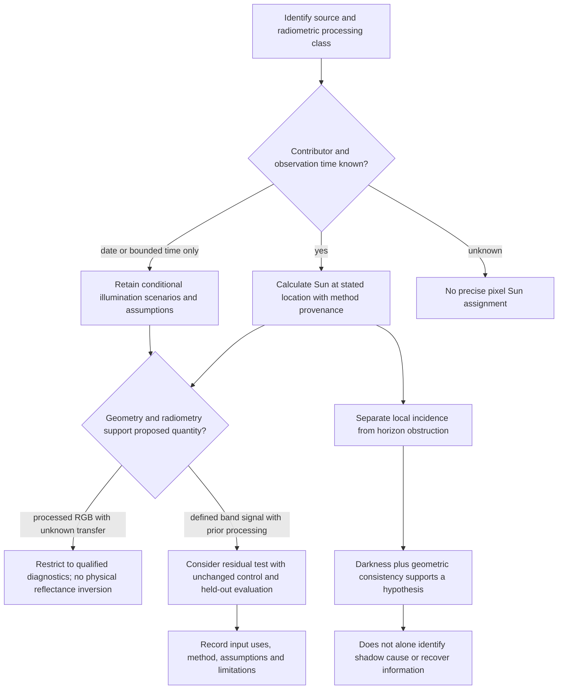

# Retained dated-observation illumination and shadow identifiability

2026-10-06–07. Assessment started at clean `main` **b12dc06**; `git fetch origin` confirmed **0/0** divergence. No newer work required reconciliation. This completes the recommendation in the [appearance assessment](riffelhorn-appearance-assessment.md), using retained evidence only.

## 1. Executive conclusion

**B — PARTIAL IDENTIFIABILITY.** Acquisition illumination is reconstructible for timestamped retained observations, and conditional terrain illumination/shadow geometry can be calculated for Riffelhorn. The retained 2023 orthophoto does **not** identify its contributing exposure/time, per-pixel Sun vector, physical radiometry or unique cause of source darkness. A date, footprint and time-like strip ID do not remedy those gaps.

**Correction-readiness decision B — PARTIALLY:** no physically interpretable first-pass correction of the Riffelhorn mosaic is justified. One narrower empirical experiment is justified on the retained **Tryfan July 2026 Sentinel-2 Level-2A** observation: test residual terrain-illumination normalization of an already processed product, against an unchanged control. This cannot establish intrinsic colour, albedo, source-shadow recovery or Riffelhorn correction. Its entry restrictions and evaluation are frozen in [§23](#23-predeclared-evaluation-criteria) and the [future-evaluation receipt](../../scripts/atlas/illumination-assessment/future-evaluation.json), before any correction.

No correction, normalization, shadow lifting, classifier, inference, physical lighting or multiview processing was performed. Swiss frame pixels remain parked. Foundational terrain/multiscale/semantic contracts remain unchanged.

## 2. Research question

What acquisition illumination and source-shadow information is documented, calculable, conditionally inferable or unidentifiable from retained evidence? The distinction matters because a correction can otherwise transform unknown material/processing variation into a fictitious physical surface property.

This follows the [42-thread register](atlas-research-state.md#appearance-observation-support-and-lighting), specifically A5–A11/A12–A15, rather than repeating imagery-quality or terrain-source experiments. [World-model architecture](atlas-world-model-architecture-synthesis.md#11-appearance-model-and-unresolved-programme) and the [lifecycle assessment](atlas-derived-understanding-lifecycle.md) place any future processing beside immutable source evidence, with qualified dependencies. Architecture compatibility is not scientific identifiability.

## 3. Retained evidence

| Evidence | Retained identity/support | Use here |
|---|---|---|
| SWISSIMAGE 2023 four original RGB COGs | EPSG:2056 `[2624000,1091000,2626000,1093000]`, 4 km²; four hashes in [baseline](../atlas/swissimage-source-derived-baseline.json) | Hash verification and reuse of frozen source RGB probe samples |
| Source-derived SWISSIMAGE representation | Identity `f6edd630206ed02f255176935d72126cbc6ad7987b12d2986edbe6d05619bc1b`; manifest SHA `3c8b50fb9d7721b678abc46b9450495b417ccafff15d4ee8a67d9d6a3fee4934` | Preparation support/provenance, not recovered appearance |
| 2023 ADS strip metadata | `20230907_1035_12504`, `20230821_0907_12501`; [support assessment](../atlas/riffelhorn-observation-support.md) | Published dates, purposes and footprint coverage; no decoding of ID clock fields |
| Swiss terrain support | [source/product declaration](../atlas/riffelhorn-support-product.json); 2024 selection, 0.5 m LV95 DTM/LN02 | Normals and bounded hypothetical solar rays; no exaggeration |
| Tryfan dated Sentinel observations | [005C receipt](../earth-lab/tryfan-005c-temporal-evidence.json); four individually identified winter/spring/summer/autumn observations | UTC/time-role and scene-Sun contrast; retain existing diagnostic limitations |
| Tryfan corrected-encoding RGB | [010 report](../earth-lab/tryfan-010-observed-natural-colour.md), July 2026 selected observation | Confirms properly decoded retained reflectance evidence exists, not a newly corrected illumination product |
| Swiss 2026 two-frame metadata | [frozen benchmark](../atlas/swiss-multiview-benchmark.md), separate LV95 centre `[2713830,1206710]` | Timestamped metadata contrast only; no pixels |

The deterministic [results](illumination-identifiability-results.json) record metadata hashes, every used terrain leaf hash and all original imagery hashes. Four imagery originals total **186,259,028 bytes**; all **1,084** prepared files total **1,564,233,043 bytes** and match. Six 2023 metadata receipts and all **112** parked metadata inputs match. Twelve native terrain leaves intersect the diagnostic halo, **199,212,559 bytes**; only a 2.8 × 2.6 km window is read. VRT SHA `8b097d62be84e110cdf8efd695f63d685a9069fcad98aae91660b7fb42e17998` and source revision `b24a4fdc7b378ba79d442d0ce216a031dfb95a6bc6eed5ad9c33be61175651f4` are retained. The 44 prior temporal input files total **5,730,659 bytes**, all hash-verified; the 010 reflectance TIFF matches SHA `89304e0045bc72b49c360c20bb62acd977673897c170ed5ee73b5920e1fb70b2`.

No retained payload was copied or mutated; these are existing storage/read footprints, not new acquisition. Existing swisstopo attribution and open-source obligations and Copernicus attribution remain in source records. This assessment grants no new redistribution permission and does not revisit rights.

## 4. Relevant established methods

Solar ephemerides require unambiguous time and location; they do not establish atmosphere, diffuse light, radiometry or image contribution. The diagnostic implements the published [NOAA fractional-year equations](https://gml.noaa.gov/grad/solcalc/solareqns.PDF), with explicit UTC and east-positive longitude. It is an approximate geometric model, not NREL SPA, apparent refraction or irradiance. [NOAA's method notes](https://gml.noaa.gov/grad/solcalc/calcdetails.html) caution that calculator support/accuracy and atmospheric refraction are separate concerns. The [NREL published test inputs](https://midcdmz.nlr.gov/spa/spa_tester.c) and report's example angles supply a coarse independent check; SPA code was not copied, installed or used.

[Richter, Kellenberger and Kaufmann (2009), methods §2](https://gfzpublic.gfz.de/pubman/item/item_238938_1/component/file_238937/13324.pdf), compare C, Gamma and modified Minnaert approaches. Their requirements include terrain, solar geometry and defined reflectance; Gamma additionally uses view geometry. Low incidence creates overcorrection risks, and empirical response varies by cover. No method wins universally. These are established models, not reproduced Meridian results.

The [Copernicus L2A ATBD, issue 2.10, §§2.4, 4.7–4.8](https://sentinels.copernicus.eu/documents/247904/446933/Sentinel-2-Level-2A-Algorithm-Theoretical-Basis-Document-ATBD.pdf) describes mountainous reflectance retrieval, terrain normals, optional cast-shadow/sky-view inputs and empirical BRDF treatment. Product-specific settings matter. Accordingly, a second correction must not assume that L2A is uncorrected radiometry.

Primary documentation was checked on 2026-10-06. Product/algorithm documents explain requirements; they do not supply missing local exposure or processor configuration.

## 5. Illumination information taxonomy

- **DIRECTLY KNOWN:** an authoritative field says what it means, at its documented support/time granularity. A strip date is known; a mosaic pixel date need not be.
- **RECONSTRUCTIBLE:** a stated geometric quantity follows from identified inputs and method, with input and approximation limits retained. A solar vector calculated at a supplied UTC is not evidence that a different pixel used that UTC.
- **INFERABLE WITH QUALIFIED ASSUMPTIONS:** multiple input possibilities exist; conditional estimates or sensitivity envelopes are useful but assumptions remain first-class.
- **CURRENTLY UNIDENTIFIABLE:** different physical or processing explanations are consistent with retained evidence. No preferred numerical answer is manufactured.

These classify quantities at a particular evidence scope, not sources universally. A precise ephemeris cannot compensate for unknown exposure time or contributor.

## 6. Acquisition-time assessment

The [retained ADS records](../atlas/riffelhorn-observation-support.json) explicitly record **2023-09-07** for `20230907_1035_12504` (SWISSIMAGE, nominal 0.25 m, 87.04 km strip) and **2023-08-21** for `20230821_0907_12501` (CRYOSPHERE MONITORING, nominal 0.1 m, 9.37 km). Both cover all retained steep/summit/dark-context target cell centres in the prior footprint diagnostic. Other envelope-intersecting strips do not establish target contribution.

No retained field/documentation defines `1035` or `0907` as UTC exposure time. Their duration, line-to-time mapping and contribution to the four RGB tiles are unknown. Neither coverage nor acquisition purpose proves mosaic membership. The [official digital-strip documentation](https://www.swisstopo.admin.ch/en/digital-image-strips) identifies a linear-scanner observation family, not a single frame exposure for every strip pixel.

SWISSIMAGE's 2023 tile year is a mosaic qualification, not an instant. [Official SWISSIMAGE documentation](https://www.swisstopo.admin.ch/en/orthoimage-swissimage-10) says its year reflects the dominant acquisition year and that seamline/date breakdowns are unavailable. Catalogue creation/publication dates and placeholder January dates are not acquisition times. No per-pixel UTC/local-time conversion is justified here.

## 7. Solar-geometry assessment

Frozen inputs: Riffelhorn summit LV95 `[2624810,1092252]`, transformed to WGS84 in the receipt; two published dates; every ten minutes over each UTC day. Positive geometric elevation defines a sampled daylight envelope. These are **possibility diagnostics**, not estimated flights, exact sunrise/sunset or uncertainty confidence intervals.

| Date | Sampled daylight UTC / true azimuth | Sampled maximum elevation | Conditional elevation ≥35° UTC / azimuth |
|---|---|---|---|
| 2023-08-21 | 04:40–18:20 / 71.95–287.02° | 56.40° | 08:10–14:50 / 111.39–247.38°; **not asserted** for monitoring strip |
| 2023-09-07 | 05:10–17:50 / 82.38–278.46° | 50.39° | 08:30–14:20 / 121.97–236.84°; conditional SWISSIMAGE policy only |

The [January 2022 SWISSIMAGE product specification, §1.8](https://www.swisstopo.admin.ch/dam/de/sd-web/WchyQCcLkyd9/Produktinfo_SWISSIMAGE10cm_DE.pdf) states a minimum 35° acquisition Sun elevation. This narrows a **conditional** SWISSIMAGE-date hypothesis; it is not verification of compliance, contributor identity, flight duration or local Sun for the retained tile. It cannot be transferred to the monitoring strip automatically.

Fixed **08/10/12/14/16 UTC** scenarios on both dates were declared before comparisons. Scenarios outside the conditional policy remain sensitivity controls, not admissible inferred exposures. None was selected or tuned from brightness. Per-scenario inputs, location, ENU vector and method are recorded. Two decimal presentation is numerical readability, not angular accuracy. Ten-minute sampling and the approximate algorithm are limitations; the .6° reference-test tolerance is **not** a global error bound.

## 8. Terrain-geometry assessment

Read native 0.5 m DTM over LV95 `[2623600,1091100,2626400,1093700]`, inside retained 10 × 10 km support. Central-difference normals use a one-cell halo; raster row direction is accounted for. True-east/true-north basis vectors are calculated through CRS transformation before applying solar vectors to LV95 terrain normals. Grid north is not silently equated with true north.

The existing **31 × 31 inset probe lattice** in each patch supplies source RGB and locations. Normal sampling uses the native cell containing each probe; the normal's stencil and the ray halo are actual input-use support. A first attempted halo failed geometric containment of the predeclared 1 km rays and was expanded before a completed diagnostic; ray distance, patches and Sun scenarios were not tuned. That support correction is retained in the protocol.

No geometry smoothing, terrain ranking, datum transformation, exaggerated render mesh or improved terrain claim was introduced. LN02 distributed heights, source epochs and missing per-cell lineage remain qualified. A DTM omits vegetation/buildings and cannot represent all overhangs or rock microgeometry. A normal from this model is reconstructible model geometry, not measured physical facet orientation.

## 9. Source-radiometry assessment

SWISSIMAGE is processed **three-channel 8-bit RGB**, not documented calibrated radiance or reflectance. The [product specification, §3.4](https://www.swisstopo.admin.ch/dam/de/sd-web/WchyQCcLkyd9/Produktinfo_SWISSIMAGE10cm_DE.pdf) documents contrast/exposure treatment, colour balancing/sharpening, Alpine adjustment, 16-to-8-bit conversion and overlap transitions. These are documented production operations; exact per-pixel coefficients/history are not retained. A scalar cosine division cannot invert that chain. Current file/site compression facts take precedence over the older specification's encoding detail.

Meridian's baseline assumed-sRGB decoding is a preparation convention, not evidence of a calibrated source transfer curve. This assessment uses **encoded luma = .2126R + .7152G + .0722B** only as a display-DN brightness diagnostic. It does not call this luminance in radiometric units.

Tryfan L2A has documented surface-reflectance semantics, scale/offset and scene Sun metadata. The [010 encoding audit](../earth-lab/tryfan-010-observed-natural-colour.md) established `DN × .0001 − .1`, DN0 no-data, and preservation of valid negatives. Earlier 005C brightness relationships are retained historical diagnostics, not newly recalculated physical validation: their older encoding and broad mixed-surface populations limit reuse. L2A surface reflectance still has atmospheric/terrain/model/view limitations; it is not albedo.

## 10. Source-shadow evidence

Frozen source RGB is bright at ordinary ground and very dark at the steep patch. Probe encoded-luma p05/median/p95: ordinary **112.05/142.54/189.07**, steep **6.00/14.58/28.17**, summit **7.79/139.06/184.91**, dark-context **6.35/16.79/162.69**. These populations are 961 pre-existing samples per patch, not all pixels.

The [whole-patch source/display baseline](../atlas/swissimage-source-derived-baseline.md#source-darkness-versus-atlas-display--meridian-evidence) found no exact black pixels; steep encoded-luma≤5 occupied **2.1783%**. Its assumed-sRGB linear median was approximately **.004567**. Low but nonzero variation exists; it may contain texture, compression, balancing or noise. It does not establish useful recoverable physical detail or a sensor noise floor.

Terrain obstruction and orientation plausibly contribute to the spatial brightness structure (§13). Material, vegetation, snow/ice, atmosphere, view/projection and processing also remain explanations. No dark-pixel classifier, manually labelled shadow truth or darkness-to-shadow threshold was created.

## 11. Local incidence versus cast shadow

Local direct incidence is **μ = n·s** for a terrain normal and geometric Sun direction. μ≤0 means direct light does not reach that ideal outward-facing local facet; μ>0 does not imply an unobstructed Sun path.

Cast-shadow diagnostics separately trace toward the hypothetical Sun. Nine fixed probe locations per patch (rows/columns 0,15,30) sample the native DTM every 1 m from 2 m to **1 km**. A terrain sample above the solar ray establishes a **conditional sampled-model blocker within the radius**. No blocker means **not established within this sampled model**, with visibility beyond the radius and non-terrain occluders unknown. It does not certify full illumination.

Nearest-cell heights and finite ray sampling can miss narrow blockers and incur local facet/grid aliasing. No Earth-curvature/refraction or diffuse-sky model is included; this is a local geometric identifiability diagnostic, not a physical shadow simulator. A matched dark area would support a terrain-shadow hypothesis; it would not uniquely prove its cause or time.

## 12. Orthophoto and mosaic complications

Orthorectification/resampling and radiometric mosaic processing are documented; unknown contributor membership, seamline weights, source pose, exact original DTM revision and transfer coefficients prevent a unique mapping from an output RGB value to an exposure/physical radiance. The general specification names swissALTI3D for orthorectification, but that is not an exact dependency revision for these pixels.

Multiple exposures/dates can contribute; the retained Sep7 and Aug21 footprints are candidates, not verified inputs. A complete regional product therefore cannot be assigned one Sun vector by copying a strip date/time-like ID. The appropriate potential illumination unit is **identified observation/contributor with actual use scope**, while unknown mixtures remain unknown. The prepared product's coherent parents and alpha support do not recover original exposure identity.

## 13. Riffelhorn patch diagnostics

All four patches are inherited unchanged from the SWISSIMAGE baseline:

| Patch | LV95 centre / width | Probe slope p05/median/p95 |
|---|---|---|
| ordinary | `[2625240,1092530]` /60 m | 8.27/19.67/37.20° |
| steep | `[2624805,1092330]` /60 m | 20.73/45.39/80.70° |
| summit | `[2624810,1092252]` /150 m | 17.93/51.42/79.68° |
| dark-context | `[2624740,1092318]` /150 m | 17.44/43.06/77.44° |

These sampled slopes differ legitimately from the previous whole-patch median (steep ≈44.01°); they are different supports, not a new terrain assessment.

Illustrative **2023-09-07 fixed scenarios**, with all ten date/time scenarios retained in JSON:

| Patch /UTC | Median μ | μ≤0 fraction | Encoded-luma /μ Pearson r | Sampled blockers /9 |
|---|---:|---:|---:|---:|
| ordinary /10:00 | .722 | .002 | .394 | 0 |
| ordinary /14:00 | .822 | .000 | −.085 | 0 |
| steep /10:00 | .198 | .275 | .063 | 7 |
| steep /12:00 | .183 | .330 | .105 | 9 |
| summit /10:00 | .583 | .163 | .764 | 2 |
| summit /12:00 | .530 | .202 | .795 | 4 |
| dark-context /10:00 | .222 | .268 | .479 | 5 |
| dark-context /12:00 | .235 | .268 | .514 | 4 |

Across the predeclared scenarios, ordinary r spans approximately **−.326 to .404**, steep **.000 to .120**, summit **.286 to .795**, dark-context **.161 to .514**. Ordinary shows no sampled blocker at the nine rays; steep blocker counts range **1–9**, summit **1–4**, dark-context **1–5**. At the fixed September 7 noon scenario, **8 of 9 steep**, **3 of 9 summit** and **3 of 9 dark-context** probes have positive local incidence yet a sampled terrain blocker. This demonstrates the need to keep local incidence distinct from obstruction, even within the model. At the fixed September 7 noon scenario, **8 of 9 steep**, **3 of 9 summit** and **3 of 9 dark-context** probes have positive local incidence yet a sampled terrain blocker. This demonstrates the need to keep local incidence distinct from obstruction, even within the model. Different plausible daylight geometries explain different parts of the image without uniquely selecting a time. Strong summit covariance is not an acquisition-clock estimator: orientation, cover and processing co-vary, and the two dates can produce similar effects.

At the predeclared September 7 10:00 scenario, median encoded luma among the nine ray probes is **13.79 blocked /55.97 not-blocked** in steep, **10.83/168.67** in summit and **16.59/142.13** in dark-context. Ordinary has no sampled blocker and median **141.84**. These are small, spatially correlated and material-confounded paired samples, not a significance test or observed-shadow ground truth. Noon steep has all nine blockers, so there is no not-blocked comparison; that missing comparison remains explicit. The receipt preserves every pair under every scenario rather than choosing a fitted match.

Conclusion: a terrain-shadow/orientation contribution is **supported as a plausible explanation**, especially for the steep-dark context relative to ordinary ground. Exact source-shadow attribution remains unidentifiable. There is no optimized match, positional-error claim, per-cell confidence, inferred contributor or new physical-shadow inventory.

## 14. Topographic-correction method requirements

| Family | Essential assumptions / inputs | Retained applicability |
|---|---|---|
| Cosine/Lambert | Terrain normal, Sun, compatible linear reflectance; predominantly direct illumination | Unsafe near μ=0, under cast shadow and for balanced RGB; no physical Riffelhorn test |
| C correction | Per-band empirical brightness–μ regression; meaningful surface strata | Candidate for **residual L2A** normalization only; mixed material/processing confounds must remain |
| Minnaert / modified variants | Empirical non-Lambertian parameters, cover dependence | Not automatically identifiable from one mixed mosaic; not chosen for next task |
| Gamma/view-sensitive | Solar and viewing geometry, terrain, defined reflectance | 2023 local view geometry absent |
| Atmospheric/physical terrain retrieval | Calibration, atmosphere, direct/diffuse terms, terrain/horizon and processing configuration | Not reconstructed from SWISSIMAGE RGB; L2A already contains modeled retrieval |

This is an input/assumption screen, not an algorithm ranking or implementation. The [Richter comparison](https://gfzpublic.gfz.de/pubman/item/item_238938_1/component/file_238937/13324.pdf) establishes low-incidence and cover limitations; its success elsewhere does not validate Meridian correction.

The [L2A ATBD §§2.4 and 4.7–4.8](https://sentinels.copernicus.eu/documents/247904/446933/Sentinel-2-Level-2A-Algorithm-Theoretical-Basis-Document-ATBD.pdf) describes conditional mountainous processing and optional BRDF settings. Retained product identifiers/baselines alone do not identify the local parameters. They must remain unknown; do not treat retained L2A as an uncorrected control for first-pass physics. Its upstream processing is part of the evidence lineage.

## 15. Shadow compensation versus information recovery

Normalization aims to reduce an acquisition-dependent signal component. Illumination compensation models such a component. Visual lifting changes display visibility. Inference estimates unknown content from assumptions/other evidence. Actual information recovery requires useful recorded signal or independent evidence, and a defensible model linking it to the property requested.

Riffelhorn's nonzero source variation makes a future **visual signal assessment** conceivable, but does not establish recoverable reflectance, noise statistics or hidden texture. Deep-shadow RGB may be quantized, compressed or balanced; no inverse operation can guarantee missing information. Brightness correlation is not a signal-to-noise measure.

The [source-versus-display findings](../atlas/swissimage-source-derived-baseline.md#source-darkness-versus-atlas-display--meridian-evidence) remain intact: opposed-close Atlas correlation ≈.9045 does not establish dominant local renderer black crushing. Earlier Unreal final conversion findings concern another pipeline. Production suppresses IGOR in satellite mode; render-time shadows/lighting are separate operations, not observations or source-shadow removals. No renderer operation occurred here.

## 16. Albedo and intrinsic-appearance identifiability

True albedo/intrinsic surface colour is **currently unidentifiable** from this orthophoto. Material response, spectral illumination, atmospheric transmission/path light, BRDF, view direction, sensor response, exposure and mosaic transfer are not jointly known. Even knowing Sun and a DTM would not make those RGB values a unique surface reflectance solution.

For calibrated imagery a weaker, method-qualified normalized band signal can be tested. It must retain observation time, band/product semantics, upstream processing and residual assumptions. Surface reflectance retrieved under a model is not automatically hemispherical albedo. No semantic class→reflectance/PBR shortcut is licensed by this assessment. Multiple observations could add constraints but do not guarantee identifiability; that work is not undertaken.

## 17. Temporal and contributor ambiguity

The two 2023 dates differ by **17 days**. Solar geometry, snow, vegetation and moisture may differ; a single geometric multiplier cannot distinguish those changes from illumination. Candidate-strip geometry must not be used to erase actual environmental change.

Tryfan provides four separately identified, timestamped L2A observations. At AOI centre `[266400,359300]` EPSG:27700, calculated Sun varies with the role of the supplied time:

| Observation | Official product UTC / granule UTC | Calculated elevation at those times | Documented scene elevation/azimuth |
|---|---|---|---|
| winter 2024-01-17 | 11:33:29.025 /11:36:34.744 | 15.12/15.22° | 15.72/168.36° |
| spring 2026-04-30 | 11:21:31.024 /11:26:54.104 | 50.07/50.33° | 51.07/162.55° |
| summer 2026-07-12 | 11:33:31.024 /11:36:51.535 | 57.67/57.84° | 58.06/160.70° |
| autumn 2024-11-27 | 11:34:21.025 /11:36:33.362 | 15.60/15.64° | 15.77/173.75° |

These time-role contrasts are **not per-pixel time bounds**. Scene-average angles, target-location calculations and approximate ephemerides have different supports/errors; differences are not proof of bad metadata. Future tests should use the retained documented scene Sun with qualification and sensitivity rather than guessing from names. Published winter/autumn zenith is above 70°; [Copernicus product guidance](https://sentiwiki.copernicus.eu/web/s2-products) warns against quantitative scientific use in that regime and describes terrain overcorrection risk. Those scenes are excluded from the recommended physical normalization test, despite their useful historical environmental observations.

Existing 005C mixed-population brightness–illumination r was .343 winter, −.128 spring, −.264 summer, .197 autumn. This does **not** establish a summer correction benefit, and 010 later corrected the source encoding. No reanalysis or favourable-subset mining was performed. An unchanged/no-benefit outcome is explicitly admissible in the future experiment.

## 18. 2026 frame-camera metadata contrast

The frozen benchmark is **another location**, `[2713830,1206710]` LV95, approximately 8.93542°E/47.00168°N. Its source-verified UTC fields allow geometric Sun calculation:

| Frame | Acquisition UTC | Approximate true azimuth /geometric elevation at benchmark |
|---|---|---|
| `20260813_004_082750_001_41216` | 2026-08-13 08:28:22Z | 115.07° /40.72° |
| `20260813_004_082750_009_41216` | 2026-08-13 08:28:32Z | 115.11° /40.74° |

Exact timestamp support, camera centres/orientations and geometric calibration would make identified-frame local Sun/incidence/terrain LOS questions much less ambiguous **if pixels were provisioned**. They do not identify radiometric calibration, sky conditions, material response or shadow recoverability. Actual per-frame pixels, exposure and usable surface information remain untested. LHN95 camera versus LN02 terrain remains qualified as in the original benchmark.

No geometry was borrowed for Riffelhorn 2023. No camera pixels were acquired, no pair support/fusion experiment restarted and no provisioning recommendation is made. A13 Swiss frame pixels remain PARKED. Time-dependent ADS pushbroom line geometry remains distinct from frame geometry.

## 19. World-model and provenance consequences

No new universal contract is needed. Existing source/product/appearance qualification plus the [small input-use dependency description](atlas-derived-understanding-lifecycle.md) can retain:

- acquisition date/instant role, source field/reference and unknown contributor;
- documented scene/observation illumination separately from reconstructed geometry;
- calculation input UTC/location, method revision, geometric/apparent convention and approximation limits;
- conditional scenarios or bounds, assumptions and actual spatial/temporal use scope;
- exact geometry revision and normal/horizon method/support;
- source radiometric/processing class, unknown coefficients and restrictions on interpretation;
- future correction method/parameters, qualified output meaning and original observation identity.

A conditional Sun scenario is not a source-observation fact or physical-state claim. Future corrected representations would depend on a **specific identified illumination context** and terrain use scope. Revised timing/contributor attribution could stale those products under an applicable policy, while leaving original imagery intact. A representation-only pyramid rebuild need not change illumination evidence. Render configuration remains presentation metadata; it neither alters acquisition provenance nor creates physical appearance evidence.

## 20. Known, reconstructible, inferable and unidentifiable quantities

| Quantity / scope | Classification | Evidence boundary |
|---|---|---|
| 2023 strip date and mapped footprint | DIRECTLY KNOWN | Published metadata; target coverage is not pixel contribution |
| SWISSIMAGE mosaic year / processing class | DIRECTLY KNOWN | Year-qualified processed RGB, not instant or radiance |
| Exact 2023 exposure UTC / duration / line timing | CURRENTLY UNIDENTIFIABLE | Clock-like ID has no retained authoritative time definition |
| Exact 2023 contributing exposure / seamline weights | CURRENTLY UNIDENTIFIABLE | No retained pixel contributor breakdown |
| Sun direction at any **specified** date/UTC/location | RECONSTRUCTIBLE | Established geometric method; calculation precision differs from input certainty |
| 2023 acquisition Sun range | INFERABLE WITH QUALIFIED ASSUMPTIONS | Date-conditioned daylight samples; conditional35° SWISSIMAGE policy, no verified pixel bound |
| Per-pixel 2023 Sun vector | CURRENTLY UNIDENTIFIABLE | Missing contributor/time; do not attach one to whole product |
| Native DTM normal/slope | RECONSTRUCTIBLE | Exact geometry/stencil/grain; physical facet may differ |
| Local incidence under a specified Sun | RECONSTRUCTIBLE | μ=n·s on retained model; actual source incidence remains conditional |
| Sampled terrain blocker under a specified Sun | RECONSTRUCTIBLE | 1km retained model diagnostic; no blocker ≠ full visibility |
| Actual 2023 pixel cast-shadow state / non-terrain blockage | CURRENTLY UNIDENTIFIABLE | Timing, contributor and occluders absent |
| Terrain contribution to observed dark pattern | INFERABLE WITH QUALIFIED ASSUMPTIONS | Conditional geometric consistency/covariance, not unique cause |
| Source RGB values / low-signal variation | DIRECTLY KNOWN | Encoded processed values at frozen supports, no calibrated noise floor |
| Source-shadow cause / direct-diffuse irradiance split | CURRENTLY UNIDENTIFIABLE | Several physical and processing explanations fit |
| True reflectance / albedo / intrinsic appearance from SWISSIMAGE | CURRENTLY UNIDENTIFIABLE | Unknown radiometry, atmosphere, view/BRDF and transfer |
| Sentinel observation identifiers/times / scene Sun / L2A value semantics | DIRECTLY KNOWN | Documented field roles; scene mean is not every pixel |
| Exact retained L2A per-pixel time / local terrain/BRDF settings | CURRENTLY UNIDENTIFIABLE | Required local metadata not retained |
| 2026 frame UTC and geometric calibration | DIRECTLY KNOWN | Exact retained fields; other benchmark, no pixels |
| 2026 named-frame Sun at benchmark | RECONSTRUCTIBLE | Timestamp/location→geometry; not measured irradiance or shadow truth |
| Useful correction benefit or recovered shadow signal | CURRENTLY UNIDENTIFIABLE | Requires separately authorized experiment; no result here |

## 21. Future-processing evidence decision tree

Do not substitute strip time-like IDs, another year's poses, mosaic publication dates, alpha or global validation for missing illumination/support. Exclude low-incidence/cast-shadow cases from an ordinary normalization test unless a separate method and evidence explicitly justify them. Never use decorrelation as the sole proof of physical correction.

## 22. Is a correction experiment justified?

**B — PARTIALLY.** Riffelhorn SWISSIMAGE does not justify a uniquely specified physical correction: source time/contributor/radiometry are unidentifiable. Date-envelope/shadow diagnostics are useful for restricting claims, not overcoming those gaps.

A scientifically interpretable **residual empirical normalization** test is possible on retained Tryfan **July 12, 2026**, product `S2A_MSIL2A_20260712T113331_N0512_R080_T30UVD_20260712T174812`, mirror `S2A_T30UVD_20260712T113332_L2A`, baseline 05.12. Retained native RGB bands, SCL and source Sun metadata exist; observed AOI cloud/snow fractions were zero, with SCL2≈1.844%. That does not guarantee every remaining cell is physically homogeneous or shadow-free.

Terrain is the retained Welsh 1 m DTM, SHA `49c131d7de62e0df35f8e02c2f8db3161bfd37f24fea56060fcbb9e6d109b326`, prepared for a **10m analysis**. Use the same 3 km study footprint and a fixed central 1 km evaluation core to retain a 1 km terrain halo. Source mean Sun **160.70093° azimuth /58.06231° elevation** is qualified, not pixel truth. Exact upstream correction parameters remain unknown; no claim of first-pass terrain correction is allowed.

One ordinary C family versus unchanged L2A control can test whether *additional*, qualified normalization improves residual legibility/stability without damaging recorded detail. It may find no worthwhile effect or overcorrection. This is not an albedo, atmospheric retrieval, Riffelhorn illumination solution or source-shadow recovery experiment. No correction is performed by this assessment.

## 23. Predeclared evaluation criteria

The [entry/evaluation receipt](../../scripts/atlas/illumination-assessment/future-evaluation.json) freezes the following before that experiment:

1. **Input/support:** retained July native B02/B03/B04, correct offset/no-data decoding; no display PNG. EPSG:27700 study `[264900,357800,267900,360800]`; core `[265900,358800,266900,359800]`. Mean terrain at 10 m analysis support, exact provenance and no interpolated extra-information claim.
2. **Eligibility:** positive valid RGB; retained SCL4/5 evaluated separately as broad source classes, not homogeneous material truth. Exclude SCL0/1/2/3/6/7/8/9/10/11, μ<.3, incomplete terrain support and conditional model-blocked rays. Do not lift shadows. Mask uncertainty and excluded fractions must be reported.
3. **Design:** four fixed 500 m core quadrants, leave-one-quadrant-out; fit per-band C only on eligible training cells within each stratum. Require100 eligible cells per stratum overall,20 in each held-out fold and training μp95−p05≥.2; otherwise stop INCONCLUSIVE without widening/searching for favourable evidence.
4. **Guardrails:** fit `rho=intercept+slope×μ`, C=intercept/slope. Require positive slope, C≥0 and finite denominator; invalid fits give no-change. Gains outside[.5,2] are rejected/unmodified and counted. Do not clip away bad values or tune Sun from imagery. Original/excluded pixels stay exact.
5. **Held-out evaluation:** report absolute brightness–μ association and within-stratum spread. Useful normalization requires improvement in at least3 of 4 admissible folds, plus preserved texture and no conspicuous halos/noise/colour damage. Report gains, gradients normalized by local mean, band ratios, nonfinite/negative/over-unit values and failures with identical display transfer. Reject a merely prettier or decorrelated but damaged result.
6. **Sensitivity:** predeclared azimuth±2° and elevation±1° perturbations are engineering sensitivity tests, **not uncertainty bounds**. Unstable benefit across folds/strata/perturbations is PARTIAL/NEGATIVE, not an optimized corrected Sun.
7. **Interpretation:** useful normalization means a limited residual statistic/legibility benefit under these conditions. Visual improvement is separately inspected. Physical inference would require independent radiometric/material/illumination validation absent here and **cannot be claimed**. No benefit, inadmissible regression, overcorrection, damaged texture or inadequate supported cells is a valid stopping result.

These criteria neither guarantee eligibility nor manufacture confidence. No future corrected representation or output pixels exist. The unchanged L2A control is an already processed baseline, never raw surface truth.

## 24. Remaining limitations and validation

The diagnostics are conditional on a heightfield, approximate geometric Sun and sampled supports; no useful global angular error bound, per-pixel contributor, atmospheric model or calibrated SWISSIMAGE noise estimate exists. Ray horizon sampling is finite and local. Point-source geometry is not irradiance or source-response prediction. Nine ray probes per patch do not establish a whole-patch cast-shadow fraction.

Riffelhorn exact acquisition/visibility, source transfer, shadow cause, topographic/radiometric correction, deep-shadow recoverability, intrinsic appearance, BRDF/view effects, texture selection/fusion and physical relighting remain unresolved. The [appearance threads](atlas-research-state.md#appearance-observation-support-and-lighting) remain distinct; no scientific closure follows from metadata having a storage field. Swiss multiview remains parked; terrain, multiscale and semantic foundations stay closed.

[Research code and protocol](../../scripts/atlas/illumination-assessment/README.md) reproduce the read-only results. [Validation receipt](illumination-identifiability-validation.json) verifies deterministic fresh-process output,12 synthetic time/normal/CRS/horizon tests,64 frozen domain checks, isolated TypeScript declarations, original/prepared/metadata/terrain/temporal hashes, all 42 unchanged status columns, preserved historical reports/tooling, document links/anchors and 113 protected production hashes. The unchanged native raster reader emits a dependency deprecation warning with current NumPy; no changed result or failed check follows. No app test/build is needed because production/shared runtime is untouched.

Only small diagnostics, preregistration, report/receipt and canonical navigation are added. No new payload/index/store, source mutation, private inspection, Weather/Traverse change or frozen-contract modification occurred.

## 25. Research outcome

**B — PARTIAL IDENTIFIABILITY**, with correction readiness **B — PARTIALLY**. Date-conditioned Riffelhorn model illumination and timestamped retained Sun calculations are reproducible; precise orthophoto illumination/shadow attribution and intrinsic appearance are not identifiable. A constrained already-processed Sentinel residual test has enough defined inputs to be interpretable without claiming causal illumination recovery. No foundational contradiction or new universal illumination subsystem is demonstrated.

## 26. Implications for Atlas appearance maturity

Appearance integration remains successful at its established metadata/scenario scope. This work refines A6's evidence boundary and A7's experiment entry gate, without changing their wider status or claiming correction success. Atlas can preserve documented/reconstructed/inferred illumination separately and expose unsupported stronger questions honestly. It cannot yet replace source RGB with a reliably illumination-independent surface or justify physically controlled relighting of that surface.

The next optional appearance experiment tests a modest residual normalization claim and can terminate negatively. It is not a prerequisite for ordinary source-derived imagery or a reopening of world-model synthesis. No global data coverage, production implementation or expensive observation provisioning follows automatically.

## 27. Exactly one recommended next bounded task

**Retained Tryfan post-L2A residual terrain-illumination normalization experiment.** Execute only the frozenJuly observation/core/C-versus-unchanged design in §23, with the explicit upstream-processing limitation and no albedo/shadow-recovery claim. Stop on the preregistered insufficient/negative outcomes rather than expanding into a method sweep, imagery acquisition or Swiss multiview task.

This next task has not begun.
