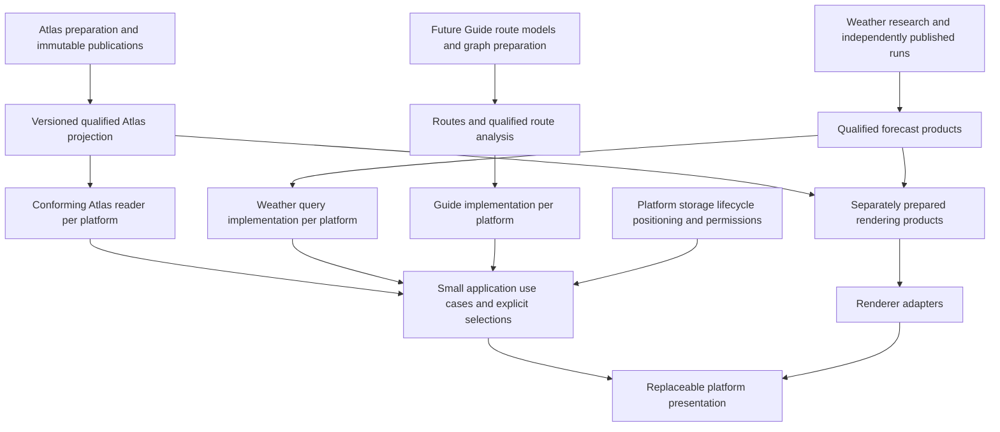

# Meridian web/mobile architecture and code-sharing feasibility

10 October 2026. Required and verified start: **0c20512432fd572c5f8a36f89683daba6afebba9**, public `gbsamirahmed/project-meridian`, clean `main`, fetched `origin/main`, **0/0** divergence. Research and documentation only. External primary documentation was checked on **10 October 2026**; this date denotes review, not a release or device test.

## 1. Executive conclusion

**ARCHITECTURAL FEASIBILITY STUDY COMPLETE — CONDITIONAL DIRECTION, NO FINAL FRAMEWORK.** Meridian should separate scientific preparation/publication, conforming runtime readers, platform storage/device services, renderer adapters and new presentation. Share qualified contracts and conformance evidence now; share implementation selectively when its dependencies and maintenance benefits are established. Equivalent platform implementations are acceptable. There is no demonstrated need for a universal Meridian core, identical screens or another Atlas optimisation before platform feasibility.

The strongest provisional family is **separate presentation layers with selected shared application/scientific logic**, retaining two terrain-host possibilities: native mobile mapping, subject to a genuinely supported 3D engine and rights; or a native file-backed shell with GL JS, subject to device GPU/lifecycle and bridge evidence. Separate Kotlin/Swift mobile and web is a credible baseline within that family. React Native is a possible host, not the default choice. Flutter and Kotlin Multiplatform remain credible conditional alternatives. A PWA is useful for web exploration, but is not presently a justified sole field product promising dependable retained packages and background navigation.

The highest-impact unresolved gate combines **actual mobile terrain, offline custody and access to representative devices/builds**. Current MapLibre documentation marks native Android/iOS elevation terrain unsupported; its Flutter binding explicitly rejects terrain there. Wrapping that engine in React Native, Flutter or Compose does not supply the missing mesh. Mapbox supplies a documented native terrain alternative, with commercial/service/privacy and offline-asset conditions to assess. GL JS provides another actual renderer path, not demonstrated mobile suitability. See sections 5–6 for dated primary evidence.

The next task is prerequisite resolution, not application implementation or framework selection. Existing device/build access remains unconfirmed by the [accepted inventory gate](meridian-mobile-feasibility-gate.md). No new device inventory, SDK installation, native/WASM build, physical trial or experiment has been performed here. The [Atlas handoff](atlas-portability-handoff.md) establishes bounded Windows semantics and kernel boundaries, not phone/browser deployment. Weather and Guide require their own scientific development; neither is reduced to overlays nor given invented contracts by this report.

### Evidence and authority

Labels used throughout: **R** = inspected repository implementation or accepted scoped research; **D** = primary documentation; **I** = engineering inference; **U** = unresolved for Meridian. R does not mean tested on every platform. D does not mean a Meridian experiment passed. No new benchmark is claimed. Scientific contracts and accepted reports retain subject-specific authority; [Foundations precedence](../foundations/reconciliation.md#documentation-precedence) governs future plans. The unchanged [prototype plan](meridian-prototype-architecture.md) is historical evidence: its new-application hierarchy migration and immediate private-audit ordering remain superseded.

The review read Foundations summary/decisions/engineering/product/platform/evolution/economics/roadmap/reconciliation, Atlas's contract/handoff and primary portability reports; inspected public map composition, weather types/cache/publication/build and route/journey material. Public code, not private assumptions, supports the inventory below. Primary sources are linked beside their claims. Published support tables and living documentation can lag implementations: pin exact candidates and recheck before a trial.

## 2. Confirmed product and platform requirements

**Initial** means the bounded internal terrain/evidence experience, not a beta invitation. **Later** means a capability to preserve room for, not permission or a promise to build it. **Conditional** means optional first-slice scope or an unresolved implementation requirement. Product/scientific meanings must agree; layouts, renderers, storage and device behaviour need not be identical. Sources: [product](../foundations/product.md), [engineering](../foundations/engineering.md), [roadmap](../foundations/roadmap.md), [Atlas contract](../atlas/portable-read-contract.md), [Weather architecture](../global-weather-architecture.md), [public architecture](../architecture.md).

| ID / purpose | Timing and requirement status | Mobile/web equivalence and permitted differences | Dependencies, constraints and evidence |
|---|---|---|---|
| M01 — map exploration, camera/reset, scale and coordinates | Initial, confirmed | Same selected place/declared CRS; gestures, scale control and camera feel may differ | Renderer, projection, input adapters; perspective scale varies across a tilted scene. R public map; product direction |
| M02 — useful flat 2D and optional elevation 3D | Initial terrain-first direction; high-quality mobile 3D feasibility unresolved | Both need useful exploration; true terrain may be unavailable on a named path, explicitly stated | Exact SDK/DEM/GPU; hillshade, extruded buildings or top-down active terrain are not disabled 2D or DEM-mesh proof. D section 6 |
| M03 — terrain shading, contours and relief | Shading initial; contours conditional/later | Equivalent source/coverage meaning; lighting/generalisation may differ | Prepared source/datum/encoding/exaggeration, mesh/normals/style. Never analytical height authority. R Swiss preparation/negative reconciliation |
| M04 — satellite imagery | Optional/later aspiration | Same attribution/availability meaning; provider/detail may differ | Lawful online/offline imagery and cost; no existing full asset closure. R optional satellite configuration |
| M05 — raster/vector overlays and layer composition | Evidence display initial; animated weather later | Same qualified selections/time; shader, ordering and hit-test mechanics differ | Exact layer support, terrain drape, labels/depth and pixel decoding. R public weather renderers; D renderer docs |
| M06 — honest coverage and offline terrain/maps | Initial bounded demonstration; field reliability before beta | Same declared capability/completeness; native/browser persistence differs | All DEM/style/font/sprite/basemap resources, legal rights and recovery. R incomplete Swiss low zoom/perimeter; U phone closure |
| M07 — interaction performance/resources | Initial measurement; target budgets provisional | Equivalent responsive tasks, not identical frame rates on every device | Combined CPU/GPU/RAM, thermal/battery/context loss; named devices required. No mobile budget inferred from Windows |
| A01 — identity, provenance, inspection and qualification | Initial, mandatory | Complete scientific meaning identical; summary/detail layouts differ | Versioned result/documents/rights/uncertainty, native support and roles. R frozen contract |
| A02 — finite point/area/non-spatial queries | Initial selected profile | Same supported predicates, ordering, errors and unknowns; adapters may differ | Query validation, native exact geometry, explicit CRS; not arbitrary SQL/geospatial algebra. R Riffelhorn only |
| A03 — CRS, geometry and raster access | Initial reader dependency | Equivalent scientific outcomes; language/bindings/decoder may differ | GEOS/PROJ versions/resources, source-native grids, decoding; U complete target runtime |
| A04 — explicit historical pin | Initial inspection/query identity | No implicit generation change; history control may be progressive detail | Publication/revision/knowledge identities distinct; unavailable history explicit. R three retained pins |
| A05 — verified offline evidence and conformance | Initial bounded goal; field guarantee before beta | Same readiness/closure/error obligations; commit APIs differ | Frozen 60 plus novel full-profile cases, malformed/corrupt closure, retained last-ready state. R desktop only |
| W01 — forecasts/observations as scientific products | Later user integration; early parallel foundations intended | Same source/model/units/coverage/missingness; independent provider adapters | Ground-up validation remains future work. Current ten-field GFS proof is evidence, not final model/provider choice |
| W02 — numerical/spatial/time queries and inspection | Later | Issue/run, valid time and accumulation interval remain non-interchangeable | Prepared fields/manifests, resolution/vertical meaning. R current samplers and atmospheric fields; no terrain downscaling inferred |
| W03 — forecast navigation and visualisation | Later | Same selected exact run/valid interval; animation can differ | Separate forecast clock, palettes/contours/vectors; visual crossfade is not temporal scientific interpolation |
| W04 — uncertainty, freshness and provider substitution | Later, mandatory when Weather is offered | Same stated interpretation/unavailable/ageing; update cadence may differ | Source-specific validation; no common confidence score invented. Current deterministic GFS is not an uncertainty programme |
| W05 — offline forecast, update/expiry | Later | An issued snapshot remains dated; never live offline | Independent run packages/horizon, compatible replacement and rights. Retention current+previous differs from Atlas history |
| G01 — route/waypoint models, editing and offline saves | Later, provisional Guide scope | User intent and data preservation consistent; editor interaction differs | Local personal storage/export, versioning; R Traverse references, not adopted Guide contracts |
| G02 — elevation profiles/terrain and route-centred science | Later, provisional | Preserve input identities, missing elevation and requested arrival/selected forecast time | Qualified Atlas/Weather adapters; no graph or safety conclusion from evidence coverage. R public route utilities only |
| G03 — route calculation/search/navigation | Later, unresolved | Supported safety behaviour must be consistent; implementation can differ | Defensible graph/algorithm/rights/field evidence absent from this study; not required initially |
| G04 — GPS/background operation | Later; positioning only if explicitly scoped/opted in | Permission/fix age/accuracy meaning consistent; OS scheduling differs | Device location and lifecycle services; denied/approximate permissions usable, tracking not default. D section 11 |
| U01 — place selection/search | Fixed pilot/location selection initial; general geocoding later | Same coordinates/selection purpose; search providers/device paths may differ | External transmission, request/terms limits; no new dataset or offline index assumed |
| U02 — evidence inspector/layer management | Initial, confirmed | Same meanings and unavailable states; mobile sheet/desktop panel need not match | Domain outputs, capability/coverage records, focus restoration; no scientific inference inside components |
| U03 — responsive new UI/accessibility | Initial, mandatory | Equivalent task access; separate platform conventions acceptable | Dedicated interaction research, keyboard/text alternatives, screen readers, reduced motion/touch contrast. No old hierarchy migration |
| U04 — state/preferences/persistence/error recovery | Initial minimal state; personal data later | Explicit pins/request identity retained; persistence format and lifecycle differ | Cancellation/stale-response rejection, versioned settings, bounded diagnostics; no default accounts/telemetry |
| O01 — reproducible builds/release compatibility | Engineering initial; signed supported distribution later | Contract/package versions distinct from app/kernel/data IDs | Host-specific toolchains, test fixtures and notice inventory; private CI/contents unknown |
| O02 — package updates/storage/resource limits | Initial bounded goal; supported-device limits before beta | Compatible last-ready selected state and user deletion; quota/download mechanisms differ | Scratch/retained versions, native heaps/GPU/caches, OS eviction; desktop limits not target budgets |
| O03 — opt-in privacy/security/rights | Initial principles; release evidence before distribution | Purpose and user control consistent, platform permissions differ | Trusted publisher separate from hashes; provider transmissions, binary/data notices; no redistribution clearance |
| O04 — sustainable delivery/maintenance | Local-first now; financial gate before exposure | Science independent of provider; delivery availability may differ | F32 fixed/variable/scenario costs, approved exposure and tested suspension; no service/provider selected |

Initial scope stays one Riffelhorn evidence view, qualified inspection, clear support and an offline feasibility boundary. It requires no routing, background tracking, accounts, satellite entitlement, every family or global coverage. Full Swiss rendering research covers a larger area than the 4 km² evidence core. Weather, Guide and future search remain architectural consumers, not first-slice prerequisites.

## 3. Component portability and code-sharing matrix

**A — SHARED IMPLEMENTATION:** same source could reasonably run in chosen compatible hosts; not a demonstrated common binary. **B — SHARED CONTRACT, DIFFERENT IMPLEMENTATION:** semantic equivalence required, implementation/bindings may differ. **C — PLATFORM-SPECIFIC CAPABILITY:** depends materially on OS/browser/device. **D — UNSUPPORTED OR UNRESOLVED:** no current basis to promise transfer. A is a candidate classification, not an instruction to port all logic now. These classifications concern boundaries; target execution remains untested unless stated.

| Component / category | What can be shared; why / evidence | Platform-specific or untested part; evidence changing category |
|---|---|---|
| Qualified models, metadata and provenance — A | Immutable records, time roles, rights references, filter/ordering logic; R independent desktop reader, no intrinsic GIS | Language-level types/serialisation/numeric identity must conform. Target host may make B more maintainable |
| Schema/request validation and capability reporting — A | Bounded pure validation and stable errors; R contract/verifier | Parser allocations/encoding and platform availability differ. No new capability operation invented in v1 |
| Publication/revision/lineage and non-spatial queries — A | Exact pin/graph traversal/conjunction and envelope assembly; R independent replay | Target ordering/canonical encoding/lifetime; executable complete-envelope replay needed |
| Forecast-time/field descriptors — A, provisional implementation | Time/interval selection and units are pure logic; R current Weather models | Current code must be isolated from fetch/render dependencies; future model semantics not frozen by this study |
| Scientific preparation/authority — B | Share source/method/publication contracts; keep established processing on its host | Not needed on every client. GRIB/GIS ingestion, validation and publishing are not phone/UI duties |
| Numerical algorithms — A only per validated method | Pure unit conversion/affine arithmetic/selected vector sampling can share; R finite utilities | Precision, missingness, interpolation and derived meaning need method-specific tests. No universal numerical core |
| CRS — B | Axis/operation/database/resource/error obligations; R direct same-PROJ Windows binding | ABI, resource paths, target numeric parity and browser deployment. C API is not binary portability |
| Geometry — B | Covers/positive-area/core clipping/full geometry semantics; R same-GEOS binding | Contexts, ownership, WKB, threading/versions, target packaging; bbox substitutes unacceptable |
| Native raster decode — B | Original grid/value/nodata/encoding and window translation contracts; R GDAL path | TIFF codecs/predictors, arrays and allocation strategy; no smaller decoder proven |
| Affine indices/category counts — A | Explicit small arithmetic/iteration, exact cell-centre masks; R native-window proof | Masks still depend on B geometry; seams/rounding/endian tests can change sharing choice |
| Query orchestration — A for pure state, B for execution | Pin-bound requests, cancellation intent, result routing can share | Workers/native calls/cancel safety differ. Current Python reader is not directly available in a web/native shell |
| Map/layer descriptions — B | Product identity, support, visibility and simple desired display intent | Do not export MapLibre objects/shader IDs as universal contract. Renderer capability negotiation/version mapping needs evidence |
| 2D rendering — B | Equivalent spatial meaning and accessible tasks | GL JS/native renderers, GPU APIs/camera scales/style support differ; visuals need independent review |
| 3D terrain — D for cross-platform parity | Source/datum/encoding/exaggeration must agree | Native MapLibre docs negative, alternative/WebView field behaviour unproved; hardware/exact SDK may move to B |
| Weather surfaces/contours — B | Prepared field/time/palette definitions and tested mathematical utilities | PNG decode/pixel exactness, draping and custom GPU code platform-specific; render is not numerical authority |
| Wind/animated rendering — C behind B field behaviour | Same U/V/time/missingness; no forced same shader implementation | WebGL shader/context cannot be pasted into Metal/Vulkan. Energy/depth/order tests required |
| Offline closure/hashing/compatibility — A | Member/schema/graph/resource verification algorithm; R bounded desktop experiment | Streaming/parser/platform errors and authentic origin require target proof |
| Immutable snapshots/reader leases — B | Stable post-open answers, explicit lifetime and exact pin; R shared capture | Safe handles/capture/mapping/resource ownership differ; no arbitrary concurrent-writer guarantee |
| Storage/install/select/delete — C | Share ready-state behaviour/failure fixtures, not filesystem API | NTFS, app containers and browser origins differ; quotas/durability/restart evidence required |
| Download/resume/background work — C | Share expected package identity/chunk checks/cancellation intent | Native task IDs/permissions vs browser events; not currently implemented package delivery |
| Positioning/background navigation — C | Fix timestamp/accuracy/permission state can share a model | Device services/power/termination; browser equivalents limited. No persistent tracking by default |
| Routing/Guide engine — D | Future route identities/user intent and qualified enrichment boundaries | Algorithm/graph/rights/safety not established; do not retrofit Traverse as production Guide |
| Application selection/time/preferences — A | Small explicit state reducers/use cases possible across suitable hosts | Current framework state/hooks not portable wholesale; separate persisted user data and ephemeral UI state |
| UI/design tokens/navigation — B for tasks/tokens, C for lifecycle/navigation | Same product concepts/content vocabulary; optional tokens and useful small components | New layouts, focus/accessibility/gestures/safe areas differ; sharing JSX/widgets optional, tested benefit first |
| Tests — A for requests/expectations, C for harness | Frozen scientific fixtures and failure scenarios portable | Device/DOM/native/GPU tests need different runners; science agreement not visual or field equivalence |

No claim of Android/iOS/browser scientific conformance follows from this matrix. Windows binaries do not transfer; a native-source build does not establish numerical equivalence; shared algorithms still need tests. Conversely, separate implementations are not inherently scientifically weaker if complete conformance and novel profile boundaries agree.

## 4. Credible architecture families

These families can overlap. A native shell can use a web map; a Flutter or Kotlin application can use separately built scientific libraries. Neither a UI toolkit nor a rendering engine settles the scientific-runtime decision.

| Family | Concrete arrangement | Strength for Meridian | Main unresolved condition |
| --- | --- | --- | --- |
| Separate native mobile and web | Kotlin/Android and Swift/iOS presentation; independent web UI; common contracts and fixtures | Direct device services, platform accessibility and storage; independent interface evolution | Highest recurring presentation/toolchain workload; native terrain engine and scientific binaries still need proof |
| Separate presentation, selected shared logic | Native or cross-platform mobile UI and separate web UI; shared pure use cases/models where execution environments permit | Strongest provisional responsibility structure; sharing need not encompass all computation or UI | Choose each shared slice from demonstrated benefit; Kotlin, TypeScript or a native library is not yet selected |
| Cross-platform UI | React Native plus web adaptations, Flutter, or optional Compose Multiplatform presentation | Potentially fewer duplicated controls/content/use cases | Mapping plugins, browser compatibility, accessibility and device-specific interactions may erase savings; scientific/native bindings still separate work |
| Web application in a native shell | New web UI and GL JS map inside a native container; native storage, permissions and package bridge | Reuses a credible web elevation renderer and web interaction implementation | Physical GPU, suspension, storage bridge and battery evidence missing; browser caching alone insufficient |
| Native/WASM scientific components | Platform UIs/renderers consume bounded scientific modules through explicit contracts | Potential common kernels without dictating the interface | Native and WASM builds/resources/licences/memory may require separate implementations; no complete Atlas module exists |

A web-only/PWA distribution is a credible complementary planning interface. Treating it as the only field platform with guaranteed background navigation, indefinitely retained packages and arbitrary native GIS access is incompatible with an honest capability promise **today**. A restricted field experience may be feasible; this is not a rejection of web technology or of platform-specific implementations.

## 5. Framework and technology comparison

Primary documentation below was checked on **10 October 2026**. Documentation describes upstream capability, not Meridian conformance. Pin exact framework, plugin, engine and resource versions in a later experiment; do not infer the installed repository versions are suitable for mobile.

| Technology arrangement | Web / Android / iOS and interoperability — D | Terrain/offline implications — I/U | Build, testing and maintenance implications — I |
| --- | --- | --- | --- |
| React web + React Native mobile | React Native documents platform-specific modules and native C++ TurboModules; web uses a community out-of-tree platform or a separate React application | Native map components use native engines; identical React naming does not transfer GL JS features. OS storage/native GIS need bindings | TypeScript concepts and pure state logic may share; DOM and native tests/builds differ. C++ registration and platform builds add work; dependency bridges are recurring obligations |
| Kotlin/Android + Swift/iOS + web | Platform interfaces and native libraries through target-specific bindings; a separate browser implementation | Direct platform service control; renderer and complete offline closure still conditional | Most presentation duplication, but fewer toolkit mediation layers. Three release/test environments; avoid duplicating scientific interpretation |
| Kotlin Multiplatform, optional Compose | Current support table lists Kotlin Android/iOS/JVM/JS as stable, Kotlin/Wasm as Beta; Compose web/Wasm Beta. C interop is a Kotlin/Native facility | Common models/use cases plausible; JS/Wasm need separate native-kernel access. Compose support is not a terrain SDK claim | Gradle/Kotlin plus Apple/web build environments; shared tests useful, target-specific fixtures and mapping integration still necessary |
| Flutter mobile + web, or mobile with separate web | Dart native FFI and Flutter native build hooks support C libraries; web uses web/JS interoperability and optional Wasm compilation | Native FFI does not run as browser FFI. Map plugin capability, embedding/compositing and reader transport must be checked separately | Dart plus native builds and possibly separate web logic. Widget sharing may help or constrain interaction; no evidence of Meridian resource suitability |
| Capacitor web UI/native shell | Web application inside Android/iOS host with explicit native plugins; current filesystem plugin is not the complete Node filesystem/runtime | GL JS can remain the map implementation; native files and bounded bridge calls could own offline scientific data. No accepted mobile reader/bridge exists | Fewer UI languages, but WebView/browser differences, plugin upgrades, lifecycle testing and native builds remain. Do not pass whole raster packages as repeated UI messages |
| PWA/browser web | Web execution and storage APIs; no direct native C ABI, Python environment or canonical filesystem access | Worker/WASM or independently conforming reader needed for local queries. Persistence permission and resource closure conditional | Simple initial web distribution; service-worker upgrades, origin changes, browser diversity and offline eviction need explicit tests |
| C/C++ libraries, optional WASM build | Credible kernel layer behind any presentation; GEOS/PROJ C APIs demonstrated only on Windows | Native binaries need each ABI/resources; WASM needs a compatible build, filesystem access strategy and memory budget | Additional toolchain and security/licence maintenance. A common kernel does not imply a common complete Atlas reader or justify a new shared core now |

Sources: [React Native platform separation](https://reactnative.dev/docs/platform-specific-code), [C++ native modules](https://reactnative.dev/docs/the-new-architecture/pure-cxx-modules), [out-of-tree web](https://reactnative.dev/docs/out-of-tree-platforms); [Kotlin platform status](https://kotlinlang.org/docs/multiplatform/supported-platforms.html) and [C interop](https://kotlinlang.org/docs/native-c-interop.html); [Flutter native code](https://docs.flutter.dev/platform-integration/bind-native-code), [Dart platform libraries](https://dart.dev/libraries), [Flutter web/Wasm](https://docs.flutter.dev/platform-integration/web/wasm); [Capacitor](https://capacitorjs.com/docs) and [filesystem](https://capacitorjs.com/docs/apis/filesystem).

No framework automatically supplies Atlas semantics, lawful offline terrain, weather science or safe navigation. A mapping wrapper is not an independent renderer candidate. A web compiler does not compile GDAL/GEOS/PROJ merely because the UI also uses WASM. Multi-threaded browser WASM commonly needs cross-origin isolation headers; compatible third-party resources and fallbacks must be reviewed. Emscripten documents separate threaded/non-threaded builds and warns about blocking the browser main thread. This is a deployment constraint, not proof that Meridian needs threads. [Emscripten threading](https://emscripten.org/docs/porting/pthreads.html).

## 6. Terrain and map rendering assessment

### 6.1 Current documented choices

| Renderer path | Established or documented capability | Material limitation for Meridian | Consequence |
| --- | --- | --- | --- |
| MapLibre GL JS | R existing experimental web engine; D elevation-based terrain with raster DEM and exaggeration | No physical Meridian mobile trial; WebView GPU/memory/lifecycle and offline dependency closure unresolved | Credible browser renderer and native-shell terrain candidate; not a final cross-platform selection |
| MapLibre Native / wrappers | D native 2D maps and offline regions; raster DEM can support hillshade | Current terrain support table marks Android/iOS unsupported; native terrain roadmap is not a shipped feature. Flutter binding explicitly rejects native terrain operations | Credible native 2D comparison. Do not promise elevation-based 3D using a hillshade layer or a pitched camera |
| Mapbox native SDKs / GL JS | D terrain style support for web, Android and iOS; Android example demonstrates elevation terrain | Proprietary SDK/provider terms, dependencies, tokens, offline product restrictions and genuine delivery costs need review; own Swiss source use unproved | Credible documented native 3D alternative, conditional on rights and source-format compatibility; no paid account or service created |
| CesiumJS | D terrain-provider-based globe rendering and lighting, including URL-based provider path | Different terrain preparation, camera/layer architecture and product integration; no Meridian package or mobile trial | Credible browser 3D alternative if GL JS proves a specific blocker; not a reason to multiply experiments now |

Primary sources: [MapLibre terrain support](https://maplibre.org/maplibre-style-spec/terrain/), [native terrain roadmap](https://maplibre.org/roadmap/maplibre-native/terrain3d/), [Flutter binding limitations](https://maplibre.org/flutter-maplibre-gl/advanced/globe-terrain-sky/), [React Native raster DEM/hillshade example](https://maplibre.org/maplibre-react-native/docs/components/sources/raster-dem-source/), [native offline manager](https://maplibre.org/maplibre-react-native/docs/modules/offline-manager/), [Mapbox terrain support table](https://docs.mapbox.com/style-spec/reference/terrain/), [Android terrain example](https://docs.mapbox.com/android/maps/examples/use-3d-terrain/), [Cesium terrain API](https://cesium.com/learn/cesiumjs/ref-doc/Terrain.html). All are D; none demonstrates Meridian on Android/iOS. Recheck actual release pins before a trial.

A truly 2D comparison removes elevation terrain, not just camera pitch. Hillshade is a lighting representation; contours are elevation-derived lines; neither demonstrates a displaced 3D surface. Optional 3D is a confirmed architectural requirement, not a requirement to enable it continuously on every device. A usable 2D mode, clear unsupported state and energy-aware choice remain valuable.

### 6.2 Data and rendering boundaries

Keep four representations explicit: qualified scientific input; prepared rendering product; renderer-specific resource; application camera/layer intent. The 77,412,208-byte query projection is **not** a ready terrain tile package. Its cropped Copernicus scientific payload is not a replacement Swiss render surface. The accepted negative Swiss/AWS reconciliation remains in force: do not fill Swiss gaps using the experimental global AWS surface or silently reconcile LN02 DTM with EGM2008 DSM.

Rendering preparation may encode elevation tiles, hillshade, contours or meshes with documented source/coverage/datum/encoding/exaggeration. It must record transformation and numerical limitations, retain attribution, and never acquire scientific authority by looking convincing. Raster DEM height decoding, nodata, tile-edge continuity, source resolution and vertical exaggeration need separate visual/numerical tests. Satellite imagery is an optional rights-dependent backdrop, not a mandatory online dependency. A bare lawful local style is acceptable for an early technical trial; missing glyphs/sprites/labels must be reported rather than filled from a live service.

A bounded layer-intent description may name product identity, field/representation, region, time selection, opacity/order and coverage. Adapters can translate to renderer resources. Do not create a universal style language or guarantee pixel-identical rendering. Share geographical camera intent (centre, orientation, view extent) only with explicit conventions; numerical zoom, pitch limits, projection and metre-per-pixel behaviour differ. Native custom GPU layers and WebGL layers cannot be assumed interchangeable.

Weather rendering is especially sensitive to terrain draping and depth/order. Mapbox documents terrain/globe draped layers being reordered below symbols; custom animated wind requires target-specific integration, not merely a shared palette. Review label occlusion, transparent raster composition, hillshade interaction, coordinate precision, texture limits and context loss. Do not infer a high-resolution forecast from overzoomed coarse data. [Mapbox layer ordering](https://docs.mapbox.com/android/maps/guides/styles/work-with-layers/), [GL JS custom layer interface](https://maplibre.org/maplibre-gl-js/docs/API/interfaces/CustomLayerInterface/).

Large-area/global browsing can use a separately qualified basemap/terrain product where lawful; a retained 4 km² pilot does not establish global scientific coverage. High-resolution local packs and lower-resolution overview resources may coexist with explicit seams and coverage. No national/global payload, GPU limit or frame rate is established here.

## 7. Scientific computation and data portability

### 7.1 Separate authority, reading and presentation

This is a responsibility diagram, not a new package dependency or production interface. Guide and future Weather query implementations are proposed boundaries, not completed systems. The application's current view may carry an Atlas generation, a Weather issue/valid-time selection and a route revision together. This tuple does not assert a common physical timestamp, coherent cross-domain scientific publication or agreement between sources.

### 7.2 What can reasonably share

Identity/revision models, explicit time roles, metadata validation, result/error envelopes, rights references, pure temporal selection, mathematical utilities and application use cases are plausible A candidates. Their source language should follow an actual consumer and maintenance benefit. Preserve unknown/absent/unsupported outcomes and stable IDs across language serialisation; test numeric range, ordering, missingness and timestamp parsing. Do not prematurely mandate JSON, SQLite, WASM or a shared native core.

GEOS and PROJ are credible **provisional native kernel boundaries** because owned direct C-API contexts reproduced the tested Windows behaviour. They are the same engines, not independent scientific validation. Their resources, operation selection, XY axis convention, versions and error translation are part of compatibility. Native compilation, ABI, licence, resource lookup, thread ownership and numerical equivalence still need proof per platform. A changed PROJ database or GEOS version requires complete envelopes and novel boundary tests, not just scalar coordinates. [Accepted handoff](atlas-portability-handoff.md), [direct PROJ study](atlas-geometry-crs-feasibility.md), [reference corpus](atlas-portable-read.md), [GEOS C API](https://libgeos.org/usage/c_api/).

Raster access should expose scientific responsibilities rather than GDAL objects: native row/column/affine identity, exact decoding and nodata, full-source identity versus stored window, categorical cell-centre semantics, conservative area support and qualifications. A smaller decoder may be reasonable **after** a target platform exposes a real packaging/resource blocker. Neither a custom raster engine nor another optimisation round is a prerequisite for this architecture comparison. Preparation can remain desktop GIS while read implementations change.

Atlas's unchanged 60-case corpus across three pins is a necessary reader compatibility test, not complete spatial proof or mobile validation. The native-window closure and deterministic novel tests cover cases beyond frozen requests. A platform reader must consume those expectations without generating answers from them, and preserve exact historical generation selection. Opening failure or corruption must not become a successful empty evidence result.

Weather must gain its own scientific contracts and conformance evidence as its foundational programme proceeds. Current prepared numerical PNG decode, missingness and forecast-time utilities are individually assessable implementation references. A shared shader or model wrapper is not the future Weather foundation. Guide likewise needs route/graph/safety evidence; share user intent and enrichment orchestration without inventing a routing algorithm or treating old heuristics as authority.

### 7.3 Runtime location

Desktop can retain a long-lived read-only Atlas context; full validation is startup/package-adoption work rather than per gesture. Mobile field querying must be capable of local execution and explicit unavailable states; a mandatory desktop Node/Python network service would violate fully offline ambition. Web may use conforming local computation or a disclosed optional remote reader, but neither is implemented. Browser remote access must keep generation pinning, privacy and F32 exposure controls; it is not needed merely because the existing runtime uses Node.

For native/WASM alternatives, preparation libraries and runtime libraries need not match. The projected geometry/raster closure and source provenance must remain scientifically equivalent. Do not strip qualification documents to reduce bridge traffic: summaries can refer to complete locally available inspection records. Any worker/native bridge should have bounded requests, immutable result ownership, cancellation and explicit compatibility; no giant global object carrying every renderer and scientific kernel.

### 7.4 Repository inventory and accepted resource evidence

| Inspected public boundary | What exists | Architectural implication |
| --- | --- | --- |
| `package.json`, `vite.config.ts` | Experimental package marked private for npm publication, React 19 / TypeScript / Vite, MapLibre GL JS 6.11.2; browser worker bundling and development Weather adapter | Existing web competence/reference, not published reusable mobile packages. Node requirements do not become a field-client requirement |
| [Atlas map](../../src/atlas/map/AtlasMap.ts) and [application map](../../src/app/map/MeridianMap.tsx) | Imperative map lifecycle, optional satellite source, global visual terrain/hillshade, layer composition and current inspector | Technical map patterns can be assessed individually; old UI/inspector is not the qualified portable reader or a mobile architecture |
| [Atlas runtime](../../runtime/atlas/README.md), [portable contract](../atlas/portable-read-contract.md), [spike](../../scripts/atlas/portable-spike/README.md) | Maintained Node library/CLI authority and rebuildable SQLite catalogue; independent Python query projection with owned GEOS/PROJ experiments | Preserve authority and portable semantics; Node/filesystem/SQLite internals are not browser interfaces |
| [Weather architecture](../global-weather-architecture.md), [catalogue types](../../src/weather/types/globalWeather.ts), [numeric cache](../../src/weather/data/numericTileCache.ts) | GFS 0.25° ten-field/24-step preparation, complete run publication; shared nominal 64 MiB numeric cache, visible/latest polling, different field sampling | Future Weather is a scientific programme, not an overlay package. Cache may exceed target with pinned entries; it is not whole-app memory or verified offline storage |
| [Route types](../../src/traverse/types/route.ts), [journey model](../../src/traverse/model/journeyModel.ts), [derived conditions](../derived-route-conditions.md) | Imported route/arrival/profile and qualified experimental weather-context utilities | Reference material only; no established Guide graph, navigation or safety-critical contract. Existing derived display policies must not be silently rebranded as ground truth |
| [Foundations engineering](../foundations/engineering.md) and [roadmap](../foundations/roadmap.md) | Existing test scripts/build workflows, preservation safeguards and future CI/release requirements | No evidence of mobile build pipelines/signing or private-repository structure; platform workflows need audit when authorised |

The Weather updater is separately invoked; UI does not own acquisition/publication. Current complete run updates preserve a prior coherent public catalogue on field failure. Initial compatibility with older partial catalogues is not permission to mix runs. Current point Open-Meteo weather is a distinct product, not a fallback GFS value. Wind interpolation operates on components; display crossfade is not forecast interpolation. Model-surface cloud ceiling and sea-level freezing diagnostics cannot be blindly compared to terrain. These are R constraints from inspected code/docs, not final Weather source/format selections.

The following values are accepted historical measurements, **not rerun here**. Decimal MB in the source reports must not be silently labelled MiB. Different experimental workloads/caches explain different times; do not combine these rows into one speed-up claim.

| Experiment and primary source | Accepted value / context | What remains unknown |
| --- | --- | --- |
| [Habitat/planning integration](atlas-local-references.md) | Maintained full-world median open 9.11 s; catalogue build 838 ms; catalogue 220 KiB; 141 qualified records | Not the independent Riffelhorn reader workload, not gesture latency or phone startup |
| [Original projection](atlas-portable-projection.md) | 116,692,961 bytes total; original DSM 42,594,792 bytes; six raster members 108,207,242 bytes as subsequently inventoried | Scientific query storage is not rendering closure or native-library footprint |
| [Shared-snapshot study](atlas-portable-projection-reduction.md) | Three-reader peak working set 599,445,504 → 332,742,656 bytes (44.5%) by shared captured ownership within one process; package unchanged | No across-process sharing, mobile RAM proof or raster removal |
| [Native-grid window](atlas-native-grid-window.md) | Total 77,412,208 bytes; DSM 3,306,806 bytes; package reduction 33.66%, DSM reduction 92.24%; bit-exact 1,317,600 pixels in source columns 2554–2919 and all 3600 rows | Conservative closure bound, not the rejected estimated 94 × 66 crop; no rendering-surface replacement or universal transformation support |
| Same window trials | Window peak 320.37 MB one reader / 320.32 MB three shared pinned readers; original 333.31 / 332.87 MB in that trial | Imports, raster validation/capture and native libraries remain; no allocation-level attribution or mobile suitability |
| [Latest GEOS binding](atlas-native-geometry.md) | Reference 320.72–321.04 MB, native binding 320.57–321.40 MB full-reader peaks; verified one-reader open medians 1,107.42 / 1,138.28 ms; three-reader 1,120.27 / 1,152.14 ms | Process-cold after imports/warm filesystem conditions, not storage-cold or combined renderer/reader; no general memory/speed improvement |
| Same GEOS trials | Native warm representative point 9.48 ms, area 17.84 ms, identity 1.13 ms, lineage 14.03 ms | Particular desktop requests, not all-area worst case, UI inspection latency or phone performance |
| [Hardening](atlas-portable-projection-hardening.md) | Initial install 4,223.80 ms; candidate verification 1,242.70 ms; bounded additional staging/replacement experiment scratch 350,080,532 bytes | NTFS process-interruption recovery, not general power-loss or mobile background guarantees |
| Window lifecycle estimates | Baseline + window packages 194.11 MB; another staged window 77.41 MB; conservative combined scenario 465.63 MB | Estimates/particular retained copies; future installation must account for actual selection/reader leases rather than use this as a mobile quota |
| [Swiss terrain preparation](../atlas/riffelhorn-swiss-support-product.md) | Retained pyramid: 11,429 complete tiles / 930,914,852 bytes, larger area than evidence core; incomplete low-zoom/perimeter coverage | No small complete lawful basemap/font/style closure or device texture/battery measurement established |

A read-only tooling check in this study confirmed Node 24.11.0, npm 11.6.2 and Git 2.38.0.windows.1. It did not inventory devices or install tools. The checked desktop environment in the binding reports is Windows 10.0.26200/NTFS, Intel i7-12700H/16 GiB, Python 3.12.6, NumPy 2.5.3, rasterio 1.4.3/GDAL 3.9.3, Shapely 2.1.2/GEOS 3.13.1, pyproj 3.7.2/PROJ 9.5.1. These are historical experiment versions, not a newly inventoried or proposed mobile toolchain. The direct bindings still use the same native kernels/resources. The six native rasters, geometry/documents and qualified record assembly contribute different costs; the approximately 321 MB working set cannot be attributed wholly to GEOS/PROJ.

Preserve the complete finite read semantics: horizontal EPSG:2056/EPSG:4326/OGC:CRS84 transformations with checked XY convention/operation/resources; densified area transformation and core clipping; boundary-inclusive covers and strictly positive-area intersection; native half-open affine indices, categorical cell-centre selection and nodata; distinct source/knowledge/physical time. Vertical transformation is not proved. An unknown scalar unit in accepted output must remain unknown rather than be supplied from presumed provider meaning. Historical before/after/legacy generations must preserve revision/lineage differences, not merely a common numerical value. Preparation-time simplification cannot replace exact native geometry at runtime without new scientific evidence.

## 8. Offline architecture

### 8.1 Guarantees and platform differences

| Host | Available mechanism — R/D | Required Meridian behaviour — I | Still unproved — U |
| --- | --- | --- | --- |
| Desktop | R owned directories, staged verification, immutable member snapshots, separate ready/selection records on tested Windows/NTFS | Exact requested generation; preserve last compatible ready copy on failure; reopen and explicit deletion | General power-loss durability, arbitrary concurrent writers, other filesystems and authenticity |
| Android | D app-specific persistent files distinct from evictable cache; OS-managed work/download facilities | Store deliberate packs outside incidental cache; track installation and selected pin; space checks and user removal; recover after termination | Native package adapter, safe commit/handle policy, ABI/reader, low-space and OS-version behaviour |
| iOS | D Application Support for required app data, cache/temporary locations purgeable; background URLSession has lifecycle conditions | Required offline files in an appropriate app container; deliberate backup policy, exact pin and recovery; distinguish user routes from redownloadable packs | Atomic/durable install, reader, resource ownership and suspension behaviour on actual hardware |
| Browser/PWA | D origin storage, IndexedDB/OPFS and Cache APIs; persistence permission and quota estimates; WebKit retention policies | Capability-specific complete manifest, local validation/selection, eviction detection, compatible app/reader versions; truthful downgrade when storage unavailable | Browser-specific durable readiness and restart/resource limits; no native filesystem equivalence or unconditional background service |

Primary sources checked 10 October 2026: [Android app storage](https://developer.android.com/training/data-storage/app-specific), [Android long-running work restrictions](https://developer.android.com/develop/background-work/background-tasks/persistent/how-to/long-running), [Apple file placement and backup](https://developer.apple.com/documentation/foundation/using-the-file-system-effectively), [Apple background session](https://developer.apple.com/documentation/foundation/urlsessionconfiguration/background%28withidentifier%3A%29), [WHATWG storage standard](https://storage.spec.whatwg.org/), [WebKit storage policy](https://webkit.org/blog/14403/updates-to-storage-policy/), [OPFS API](https://developer.mozilla.org/en-US/docs/Web/API/File_System_API/Origin_private_file_system). MDN is a platform-maintainer API guide, not a substitute for engine policy or physical tests.

Android work scheduling is not unlimited background execution; current documentation identifies Android 16 job-quota implications even for long-running workers. Apple does not automatically relaunch an app force-quit by its user for the cited background session. Browser persistence can be requested, not assumed granted. Native storage can also be lost through uninstall, user deletion, disk failure or erroneous application updates. Report those limits without promising either perpetual availability or guaranteed failure.

### 8.2 Shared lifecycle contract, different installation implementations

The accepted desktop experiment gives a useful behaviour reference: stage into owned scratch; verify bounded complete manifest and compatibility; commit ready state; explicitly select the exact generation; preserve a compatible prior package through failed replacement; reject corrupt/missing content on reopen. Installation selection and scientific generation are separate. The host-specific commit boundary and failure guarantees must be documented and tested rather than copied from NTFS.

A complete experience requires terrain/map resources, styles, fonts, sprites, attribution, scientific records and qualification documents, manifests, compatible readers and application launch assets. A renderer offline-region database is only one part. Mapbox distinguishes style packs from tile regions; MapLibre's offline manager can update resources from current servers, which is not an Atlas immutable revision model. Coordinated application readiness should refer to exact compatible resource identities without pretending all domains share a publication. [Mapbox offline components](https://docs.mapbox.com/android/maps/guides/offline/manage-offline-data/), [MapLibre offline region management](https://maplibre.org/maplibre-react-native/docs/modules/offline-manager/).

Ready must be capability-specific: a complete 2D map can be ready while 3D terrain or forecast queries are unavailable. Corrupt scientific data is an integrity failure, not empty evidence. Cached server responses are not packages. Hashes identify and verify bytes against a manifest; a self-consistent package is not proof of a trusted publisher. Publisher authentication and distribution trust need a later explicit threat model.

Resumable transfer, chunking, staging, verification and selection should be separable. Initial complete-package updates are sufficient until measured payload/update costs justify deltas; do not add synchronisation or a general package manager. PMTiles illustrates a tile archive read using range requests, not a scientific installer; a transport can generate request costs despite a single-file representation. No tile or scientific format is chosen here. [PMTiles concepts](https://docs.protomaps.com/pmtiles/).

Forecast freshness is another dimension: keep issue time, valid time, model/product provenance, download time and expiry/update policy distinct. Offline forecasts remain labelled historical forecasts when appropriate; expiry does not mean physical conditions became false. Do not refresh or substitute another source silently. Routes/waypoints belong to user data with export/recovery and explicit deletion policies; they must not be evicted by a scientific-cache cleanup.

### 8.3 Resource envelope

Account for selected + last compatible ready + staged candidate + transfer scratch + verification buffers + open-reader snapshots + renderer textures + application state. The approximately 321 MB Atlas desktop working set is **not** the combined field application's memory requirement. Zero-copy handle or shared-memory proposals need post-open mutation and lifetime evidence before claiming savings. Browser worker transfers can duplicate large buffers; native bridges can introduce copies too.

The next evidence gates use existing retained inputs, aim at no more than 250 MB test payload with explicit temporary copies, and require an estimate before copying. This is a trial boundary, not a mobile storage budget. Do not package the entire 930,914,852-byte Swiss rendering pyramid. No user location history is needed for terrain, scientific-query or offline-recovery validation.

## 9. UI and application composition

Design the new UI from scratch, consistent with F01/F14/F34. Experimental React hierarchy, panel layout, workspace and styling are reference material, not migration requirements. Individually proven utilities may be reused only after checking inputs, scientific role, tests, licence and dependencies. A familiar framework alone does not justify inheriting experimental product decisions.

The first integrated experience can remain a map, navigation/search or location selection, a small layer control and a qualified inspector with honest coverage. Routes, accounts, collaboration, billing, comprehensive Weather controls and all-region/all-family availability are not initial prerequisites. Riffelhorn remains the provisional retained pilot, not proof that the architecture serves every geographical source.

Use ordinary modules: platform map host; small selection/time/layer use cases; scientific client adapters; inspection presentation; package status; platform services. Keep scientific documents and GIS handles outside component state. The application may keep explicit selections, a camera intent, selected evidence ID and pin, chosen forecast issue/valid time, preferences and panel visibility. Use bounded requests, cancellation and stale-response rejection: a response for an earlier pin or view must not overwrite the current selection. Do not invent a plugin registry, universal component vocabulary or central store that owns scientific authority.

Share product concepts, semantic wording, useful design tokens and pure reducers where beneficial. Share visual components only when they meet the same task, accessibility and interaction requirements. A mobile bottom sheet and desktop side inspector may share an evidence presentation model without sharing their view implementation. Platform navigation, back gestures, focus, safe areas, screen readers and suspension belong to their hosts. Mobile-first product design does not require implementing mobile UI first.

Interaction research must precede substantial interface work. Investigate outdoor readability, one-handed use, touch targets, colour-independent legends, temporal distinctions and readable coverage/status. Desktop needs keyboard/focus navigation and larger-display exploration. Provide non-map evidence lists/text summaries and accessible inspection; GPU canvases cannot be assumed screen-reader accessible. WCAG 2.2 provides a web baseline, not demonstrated compliance or a complete native interaction specification. [WCAG 2.2](https://www.w3.org/TR/WCAG22/).

The inspector's default should show what the record means, source/representation, time role, coverage, limitation and provenance access. Details can expose source/preparation/method/revision and full qualification. Do not invent a confidence score, turn planning references into current legal restrictions, present mapped habitat as current observation, or infer physical absence from a no-result spatial query.

## 10. Development and maintenance implications

These are qualitative workload assessments, not monetary forecasts. There are no mobile implementations here against which to measure productivity. Shared code saves work only where it avoids a real duplicated responsibility and does not create compensating bridge/platform complexity.

| Arrangement | Initial workload — I | Recurring workload — I | Coupling/technical-debt risk |
| --- | --- | --- | --- |
| Separate Kotlin/Swift/web | Multiple UIs/toolchains and contracts/test harnesses | Three presentation/release streams, native dependency/security upgrades | Duplication and divergent UX; mitigated by shared semantics and fixtures, not forced shared UI |
| Shared logic, separate presentation | Establish bounded portable models/use cases, bindings where justified | Common-logic upgrades plus target adapters/conformance | Overgrown common module can become a bottleneck; keep genuinely platform-dependent code outside |
| React Native + web | Familiar TS concepts but native map/GIS/storage bridges and browser UI adaptations | Metro/native/web builds; mapping/module compatibility, native dependency upgrades | Mistaking JSX reuse for renderer/scientific parity; abandoned wrapper or bridge burden |
| Flutter or Compose presentation | New toolkit/embedding integration plus target build environments | SDK/plugin/native-library upgrades, web fallback and accessibility checks | Shared widgets may constrain desktop/mobile tasks; web maturity and map integrations matter more than nominal platform list |
| Native shell + GL JS | One new web UI plus platform storage/reader/lifecycle plugins | WebView/engine upgrades, GPU and plugin regression tests, store distribution | UI speed may conceal native lifecycle or bridge debt; code sharing cannot remove device testing |
| Optional native/WASM scientific slice | Native build/resource/package work and contract-bound bridge | ABI/browser/kernel-resource upgrades, licence review, target conformance | Too many languages/toolchains for a small team; defer until a selected target demonstrates need |

All candidates still require Android and Apple build/release expertise for native distribution. Existing public Node/TypeScript and Python GIS tooling is a reference capability, not evidence of Android SDK, Xcode, devices or signing access. Do not choose a technology on assumed private-repository contents or assume a Windows development host can supply iOS builds.

Use the [engineering foundations](../foundations/engineering.md): cohesive readable modules, explicit failures, limited hidden state, reproducible commands, focused tests, dependency locks and proportionate ADRs. Common requests/fixtures can share across targets; DOM/native/device/GPU/lifecycle harnesses cannot. Cover unit calculations, contract conformance, package integration/failure recovery and a few realistic user flows. Visual review complements numerical tests; frame-rate success cannot certify scientific correctness. Avoid expanding CI into unneeded services before there are target builds.

Release changes must separately version application, reader contract/profile, kernel/resources and packages. A UI redesign can be reversible while publication identity, user-data migration and persisted package compatibility are expensive to change. Keep older compatible ready data through failed updates, provide user export/recovery before schema migration, and never reinterpret historical evidence to fit a new client. Long internal development and substantial private-beta redesign remain permitted; one terrain demonstration is not a tester-readiness gate.

## 11. Privacy, licensing and operational boundaries

### 11.1 Privacy and safety

Local querying can avoid disclosing location to scientific services, but map tiles, imagery, search and weather requests can reveal viewed coordinates and interests to providers. No accounts does not mean no personal data transmission. Make purpose, recipient and precise/approximate location use explicit; require explicit opt-in before personal data collection/use. Default manual map browsing does not require GPS, route history, persistent tracking, analytics or crash telemetry.

Foreground positioning and background navigation are different permissions, energy costs and risk levels. Android documents separate approximate/precise and background access; the application must work honestly when access is denied or limited. Browser/device API permission is not a replacement for Meridian's explanation and data-minimisation policy. Do not request broad location access during a map/terrain experiment. [Android location permissions](https://developer.android.com/develop/sensors-and-location/location/permissions).

Guide must remain exploratory route planning until validated navigation responsibilities, positioning accuracy/freshness, missing-path risks, suspension recovery and battery/coverage limitations are established. Stale forecasts or unavailable avalanche information must not become implicit reassurance. Link to relevant regional authorities where appropriate without asserting replacement, completeness or safety. A disclaimer cannot substitute for reliable function.

### 11.2 Rights gates

| Component | Available evidence | Required review before distribution |
| --- | --- | --- |
| Public Meridian code | F07: public visibility/portfolio is not an open-source grant | Authorised package/code reuse terms and contribution/IP ownership; do not copy whole repository into private app by assumption |
| MapLibre GL JS / Native | Published BSD licences, with differing clause counts and bundled notices | Exact versions, third-party binary notices; code permission does not license tiles, glyphs, imagery or data |
| React / React Native | Published MIT code licences | Exact packages/transitive native dependencies and notices; out-of-tree web support has its own maintenance/terms review |
| Flutter / Kotlin / Capacitor | Published BSD / Apache / MIT code terms respectively | Selected modules/plugins, native transitive binaries and distribution notices; not automatic permission for all services |
| GEOS / PROJ / raster stack | Accepted GEOS LGPL-2.1-or-later and permissive PROJ findings; concrete dependency records in handoff | Linking/relinking/source obligations, platform-store considerations, native dependencies and CRS resources; no blanket clearance |
| Mapbox SDK and services | Provider terms and documented terrain/offline products | SDK distribution, supported custom data formats, tokens, offline storage/updates, telemetry/transmission and provision costs; do not assume terms match MapLibre |
| Swiss/Copernicus/WorldCover/vector scientific and render data | Retained qualified rights references and accepted redistribution uncertainty register | Original versus cropped/transformed data, modification notices, attribution, offline/end-user/commercial redistribution; preserve scientific references |
| Weather sources/products | Existing source provenance; Open-Meteo terms distinguish data licence from service conditions | Future forecast source/derived/cache/offline distribution rights, quotas/freshness/source substitution; do not infer research access permits app distribution |
| User routes/waypoints | Proposed explicit local ownership/privacy boundary | Consent, export/deletion, licence of imported content and encryption/recovery choices if sensitive |

Sources checked 10 October 2026: [React licence](https://github.com/react/react/blob/main/LICENSE), [React Native licence](https://github.com/react/react-native/blob/main/LICENSE), [GL JS licence](https://github.com/maplibre/maplibre-gl-js/blob/main/LICENSE.txt), [Native licence](https://github.com/maplibre/maplibre-native/blob/main/LICENSE.md), [Flutter licence](https://github.com/flutter/flutter/blob/master/packages/flutter/LICENSE), [Kotlin copyright/licence notice](https://github.com/JetBrains/kotlin/blob/master/license/COPYRIGHT.txt), [Capacitor core licence](https://github.com/ionic-team/capacitor/blob/main/core/LICENSE), [Mapbox terms](https://www.mapbox.com/legal/tos), [Open-Meteo terms](https://open-meteo.com/en/terms), and the [Atlas handoff rights findings](atlas-portability-handoff.md). This is architectural due diligence, not legal clearance; no existing licence or rights reference is changed.

### 11.3 Economics and security

F32 remains binding for any unrestricted public exposure: actual service dependency/delivery inventory; fixed/variable costs; storage, egress, requests, processing, retained versions, backups/logs/APIs; ordinary/high/adverse scenarios; explicit assumptions; owner-approved budget and exposure ceiling; application and provider safeguards; safe degradation/suspension; alerts, incident ownership and recovery. A spend alert is not an enforceable cap. Offline packs move costs towards preprocessing/downloads/retention and local storage; they do not abolish delivery or support costs.

This study selects no provider, account, budget, billing scheme or public-release policy. Local-first development remains appropriate. A transport or SDK that mandates provider services adds a rights/cost dependency to the architecture shortlist; optional source substitution needs scientific and commercial review, not a generic provider plugin. Preserve free-at-no-cost product principles and transparent recovery of genuine provision costs without making monetisation decisions here. [Operational economics](../foundations/economics.md).

Future exposure also requires untrusted request/package bounds, resource limits, authenticated trusted delivery where appropriate, secret separation and dependency updates. Native SDK tokens are not necessarily private server secrets; review exact provider restrictions and exposure rather than embedding privileged credentials. No external endpoint, analytics, account, paid service or new dependency was introduced.

## 12. Comparative assessment

No numerical score or weighted winner is assigned. R applies to existing desktop/web experiments only; the candidate assessment is predominantly D/I/U. Frameworks and renderer/kernel choices overlap, so a row is an arrangement rather than a turnkey product.

| Arrangement | Mobile field and terrain | Web planning | Offline/scientific correctness | Performance/resources |
| --- | --- | --- | --- | --- |
| Separate native + web | D strong device-service access; native 2D credible, native 3D conditional on engine/rights; U Meridian terrain trial | D established web rendering/UI capability, independent desktop tasks | I best direct control of each storage host; B semantics require conforming readers, not duplicated interpretation | U target memory/GPU/energy; native is not automatically faster or smaller |
| Shared logic + distinct presentation | I preserves field/desktop differences and can choose appropriate renderers | I dedicated web presentation with useful shared state/models | I strongest boundary fit; A slices selected by evidence, B kernels/storage independently tested | U shared runtime/bridge cost; avoid universal computation module |
| Cross-platform UI | D mobile/web toolkit support varies; map binding's engine decides terrain | D React web adaptation, Flutter web or Compose status varies; U desktop interaction fit | I native adapters still needed for packages/GIS; sharing widgets adds no scientific guarantee | U map embedding/compositing/FFI/WASM and whole-app working set |
| Native shell + web map | D GL JS elevation path, C native storage/services; U sustained physical-device viability | D same web renderer, optional distinct layouts | I plausible native custody with local reader bridge; cache-only variant insufficient | U WebView textures/buffer copies/thermal/suspension; cannot assume desktop WebGL results transfer |
| PWA-only | D usable browser mapping; U field package lifetime/background limits; some capabilities must remain restricted | D strong distribution/planning fit | D conditional origin storage; U local reader and persistence. Mandatory unqualified durability/background promises fail | U browser memory/quota and mobile rendering; disk quota is not RAM budget |
| Optional native/WASM science | I can supplement any row; no presentation/terrain choice implied | D WASM possible in browsers, U complete Atlas build/reader | R native kernel boundaries on Windows; U target resource closure/fixtures/offline ownership | U memory/imports/copies and native dependencies; shared binaries across OSs impossible |

| Arrangement | Code sharing and UI flexibility | Build/maintenance | Licensing/cost scaling | Evolution trade-off |
| --- | --- | --- | --- | --- |
| Separate native + web | Low UI sharing, strong independent redesign; contracts/fixtures shared | Most presentation streams, direct platform diagnostics | Exact engines/data/SDK rights; no inherent provider obligation | Adapt each platform without common toolkit constraint; prevent scientific divergence |
| Shared logic + distinct presentation | High-value pure slices; replaceable UI/render adapters | Some common logic plus target builds; requires disciplined small boundaries | Scientific binary/rights gates unchanged | Best provisional conceptual structure; language/extent remain open |
| Cross-platform UI | Potential controls/models sharing; host interactions still differ | Toolkit/plugins plus native/web environments; savings unmeasured | Toolkit licence ≠ dependency/provider clearance | Faster common feature work possible, but broad shared widget tree can constrain divergent UX |
| Native shell + web map | High presentation/renderer reuse; native services explicit | Web + thin native builds/plugins; device testing remains substantial | Offline assets/SDK/services review; no new paid service required by shell itself | Web UI easy to redesign; WebView or native bridge bottleneck could require renderer substitution |
| PWA-only | Broad web reuse; limited OS lifecycle capabilities | Least native release work, browser/service-worker diversity | Origin hosting/data delivery subject to F32; no assumption of free unlimited traffic | Useful complement; product promises must follow actual browser capabilities |
| Optional native/WASM science | Sharing kernels/algorithms potentially independent of UI | Highest additional native/resource/build burden if adopted prematurely | GEOS/native/transitive obligations and scientific data rights | Valuable if target evidence justifies it; poor default universal layer |

Clearly incompatible shortcuts are: browser access to canonical Node filesystem/SQLite as a client contract; a mandatory network scientific service for fully offline field use; presenting hillshade as 3D terrain; declaring incidental caches complete; silently substituting generations or datasets; reusing the experimental UI by mandate; and a final framework choice based on documentation/emulator evidence alone. No architecture family is rejected merely because it needs platform-specific code.

## 13. Provisional architectural direction

**Retain long-lived domain boundaries; share contracts first, then useful implementation slices; keep presentation, renderers and device services replaceable.**

Atlas owns evidence identity, qualification, provenance, historical publication and scientific query semantics. Weather owns its separate model/observation/forecast meaning, preparation, run/issue/valid time, uncertainty and lifecycle. Guide will own route/waypoint/navigation responsibilities when established. The application coordinates explicit selections and qualified results, not scientific fusion. Rendering adapters consume prepared products and presentation intent rather than owning scientific interpretation.

The credible provisional shortlist is:

- **Separate web and mobile presentation with selected shared logic.** Mobile may be native or use a supported cross-platform toolkit. A native 2D engine is credible; a native 3D engine requires actual source/rights/SDK and device evidence. Kotlin Multiplatform, React Native and Flutter remain alternatives within this family, not decisions.
- **A native-storage/service shell with a GL JS map and new web presentation.** This retains documented elevation terrain while testing the distinct field risks. It must use verified local data ownership and a conforming reader rather than assume browser caches are sufficient.

A native/WASM scientific slice is an optional orthogonal implementation path, not a third application framework or an approved shared core. A web/PWA planning application remains useful whichever mobile approach wins. Cesium is a conditional renderer alternative if a demonstrated terrain requirement exceeds the GL JS path; it does not justify testing every renderer now.

Decide now: no scientific logic inside presentation; exact scientific/time/source identities; compatible explicit pins; honest unsupported states; offline completeness/recovery and privacy; new UI; rendering authority separation; conformance across implementation changes; no infrastructure without a real delivery need. Keep language, sharing extent, framework, renderer, kernel deployment, projection format and provider provisional. F04/F05/F11 remain **REQUIRES FEASIBILITY TEST**, F03/F12 **PROVISIONAL**, and F13 **DEFERRED**. This report does not freeze new scientific or production interfaces.

Riffelhorn remains a defensible retained feasibility pilot with limited coherent terrain/evidence and reproducible inputs. It is not a global coverage commitment, redistribution clearance, tested field experience or integrated-alpha/beta readiness finding. The older immediate-private-audit sequencing remains superseded by the Foundations evidence gates. No private repository is needed to resolve the next hardware prerequisite.

## 14. Unresolved decisions

| ID | Question / current position | Evidence still required | Blocks and revisit trigger |
| --- | --- | --- | --- |
| X01 | Which physical platforms can actually be built/tested? Unknown beyond accepted missing-access gate | Named Android device/OS/GPU/storage; iOS device and macOS/Xcode/build/signing access; resource approvals | Blocks executable platform evidence; resolve first. Never label desktop/emulator results field validation |
| X02 | Native 3D alternative or GL JS native-shell terrain? No final choice | Exact SDK capability, lawful retained DEM/assets, real 2D/3D camera/GPU/energy/thermal/suspension trial | Blocks renderer-sensitive framework selection; current MapLibre native documentation is a concrete mismatch |
| X03 | Which scientific implementation can execute on the chosen host? Shared contracts established, complete target reader unproved | ABI/WASM/resource closure, unchanged 60 cases/three pins plus novel native-grid/boundary/error tests, memory/lifetime | Blocks Atlas target implementation; initial packaging investigation can occur without a phone, suitability needs one |
| X04 | Can complete offline experience be installed and recovered on target? Desktop only | Low-space/corruption/interruption/termination/selection/deletion tests, dependency audit and combined memory | Blocks field-ready claims and beta; benchmark exact host, not abstract filesystem guarantees |
| X05 | How much application/state/UI source should share? Small pure slices preferred | Interaction requirements, representative use-case code/build cost and accessible task evidence | Defer concrete UI sharing until design/host evidence; no framework choice based on old React layout |
| X06 | Weather future scientific runtime and offline policies? Separate programme required | Ground-up source/semantics/validation/rights/workload research | Blocks future Weather scientific promises, not this architecture comparison or first Atlas milestone |
| X07 | Guide graph/routing/navigation? Provisional responsibilities only | Graph source/rights, route and positioning validation, safety/lifecycle evidence | Blocks routing/navigation features; defer while preserving domain boundaries |
| X08 | Redistribution/build/store rights and publisher trust? Unresolved | Source-by-source data/binary notices; linkage/relinking/store requirements; trusted publisher/distribution threat model | Can remove a candidate before asset/build use; blocks beta/distribution. Public accessibility and integrity hashes do not clear it |
| X09 | Delivery/provider/cost and release readiness? Local-first, no provider selected | Actual delivery architecture, F32 scenarios/approved exposure ceiling/limits/recovery, privacy/security/release evidence | Blocks unrestricted exposure, not local study. No prices/traffic/budgets invented |

The expensive commitments are persistent user-data schemas, package compatibility, distribution/licence dependencies and a broad shared kernel build system. UI layout, small reducers and provisional adapters are relatively reversible. Do not solve all open questions before a small platform trial; do not bypass X01/X02 merely to begin restructuring repositories.

## 15. Prioritised evidence gates

This is the smallest decision-changing programme, not authorisation to run it. Gates can share trials and evidence; they are not three independent application builds. No experiment began in this study.

| Gate | Question and approaches distinguished | Tools/hardware and dependencies | Evidence / acceptance and failure criteria | Without phone? / before selection? |
| --- | --- | --- | --- | --- |
| G0 — prerequisite resolution | Are real devices/build access and a lawful bounded offline terrain test possible? Identify native 3D versus GL JS shell viability before selecting shells | Owner-confirmed hardware/build inventory; exact primary SDK versions/terms; accepted retained Swiss preparation and portable fixtures; estimate required SDK/download/disk/RAM before approval | Named tested-accessible devices and reproducible build route, or precise missing prerequisite. Source/asset closure and resource estimate; no inferred rights. A negative inventory is a valid gate result | Yes for inventory/docs; cannot prove rendering. Must precede physical trials and renderer-sensitive framework commitment |
| G1 — terrain/renderer trial | Does native elevation terrain or GL JS in a native host meet the field experience? Include genuine 2D comparison | Accessible physical platform; at most two genuinely distinct renderers and three shells; existing minimal complete native tiles, styles/fonts/sprites/attribution; approved tooling only | Predetermined cameras and decoded heights/datum/exaggeration/coverage; frame-time distribution, startup/warm view, memory, thermal/battery, process/airplane-mode recovery. Provisional 30 fps interaction target, not universal guarantee. Unsupported mesh, missing closure, incorrect heights or unbounded resources are explicit failures/blockers | No for field evidence; desktop/emulator can prepare drivers only. Must precede final terrain/framework selection; unavailable iOS explicitly untested |
| G2 — target scientific/offline integration, co-tested with G1 where practical | Can the selected host run a conforming local reader and preserve verified ready data within a combined budget? Native bindings versus conforming WASM/other reader only where host requires comparison | Target build access; unchanged reference fixtures/projection; bounded kernel/resources and platform storage adapter; G0 and initial G1 path evidence | 60 complete semantic comparisons across exact three pins plus novel boundary/CRS/time/lineage; unsupported/errors preserved. Full dependency closure; staged failure/corrupt/incompatible rejection, last-ready preservation, restart/deletion/post-open policy. Measure one/three readers, renderer + reader resource use, query/inspection latency; provisional 2 s warm inspection target. Do not reduce scientific meaning to fit host | Partial packaging/conformance on desktop possible; device storage/resource suitability not. Before final scientific-sharing choice and field implementation commitment |

Within G2, storage durability/recovery and renderer overlay/bridge tests should be combined with the chosen path rather than launched as a new generic offline research programme. A full power-loss claim requires a stronger platform-specific test/design than process interruption. Unexpected browser/thread/resource restrictions or native LGPL distribution constraints can change the shortlist. Expected rejections are successful conformance comparisons, not skipped cases.

No mobile budgets are set from the Windows approximately 321 MB measurement. Trial resource limits must be stated for the actual device. Do not copy the full Swiss pyramid or obtain substitute datasets. Required basemap/labels/fonts/imagery missing or not lawfully available means a documented limited trial or blocker, not silent live downloads. Stronger source/attribution distribution review precedes external tester delivery.

An interaction-design phase remains required before substantial new UI work, but need not precede G0 or technical terrain capability trials. Weather foundational research can later proceed as an early parallel scientific programme; it is not a prerequisite for these gates. Private-repository audit/reconciliation follows sufficient architecture evidence and separate explicit access authorisation, not this study.

## 16. Recommended next task and validation

### Exactly one subsequent bounded task — NOT BEGUN

**MERIDIAN MOBILE FEASIBILITY PREREQUISITE RESOLUTION — PHYSICAL DEVICES AND BUILD ACCESS.**

**Objective:** resolve G0 and the highest-impact current blocker: no accepted physical-device/build evidence establishes which renderer-sensitive architecture can actually be tested. Renderer capability investigation narrows choices, but cannot choose a framework or certify field performance.

**Starting evidence:** this report; the [accepted mobile feasibility gate](meridian-mobile-feasibility-gate.md); retained Riffelhorn preparation/coverage/rights records; [portable contract](../atlas/portable-read-contract.md), unchanged 60 fixtures/three pins; current renderer documentation and [Foundations scope](../foundations/summary.md).

**Permitted scope:** public repository and user-confirmed hardware/build availability only; exact Android/iOS/WebView/SDK compatibility and lawful retained-asset closure review; at most two renderer paths and three candidate shells on paper; explicit toolchain/download/storage/memory estimates and permissions needed. Do not install substantial tools, acquire data, create an application, run phone tests, access private repositories or choose a framework. Any missing access must be reported, not replaced with emulator evidence. Verify current documentation again before proposing an exact pinned trial.

**Deliverables:** named device/OS and usable build-access inventory; capability/rights and missing-assets table; bounded retained-input/payload estimate; precise approval/prerequisite list; one reproducible G1 trial plan conditional on access, or documented blocker. No generated geographical payload or new SDK is required.

**Acceptance:** distinguish confirmed availability, documentation expectations and unknowns; demonstrate an accessible build route on paper with explicit verification still needed; preserve source identity, negative fusion finding and all protected evidence; keep prospective test payload at most 250 MB plus bounded temporary copies unless separately authorised. Any proposed licence-dependent native renderer must be treated as conditional, not pre-approved.

**Stop condition:** prerequisite decision and bounded plan or precise missing-hardware/build/rights blocker recorded. Do not begin G1/G2, a mobile application, framework selection, private audit or Weather programme. This replaces an automatic jump to another Atlas optimisation; the accepted Atlas handoff remains sufficient for the whole-product architectural comparison.

### Research and validation record

Starting checkpoint: `0c20512432fd572c5f8a36f89683daba6afebba9`, public `main` and fetched `origin/main` at 0/0, clean gate. All changes are this research report and concise navigation/development notes. Historical research, Foundations decision rows, frozen scientific contracts, runtime, fixtures, source/publication/projection bytes, application, Weather and Traverse remain unchanged.

Current external sources were checked on **10 October 2026** using primary technical documentation/source notices. Some Apple documentation renders only through JavaScript; specific file-placement/background conclusions were verified using indexed primary documentation, not a Meridian device trial. Individual unavailable example URLs were not used as evidence. Platform support tables, provider terms and browser policies can change; this report records the checked state, not permanent guarantees. No unverified company architecture, pricing, trademark clearance or redistribution clearance is claimed.

Documentation/preservation validation: **61/61 safeguards passed** using an owned external, uncommitted checker. It checked all 1,195 existing tracked files outside eight append-only navigation updates; new internal paths/anchors; historical commits/classifications and numerical claims against primary reports; unchanged Foundations decision rows; 42 canonical research statuses; 113 protected production hashes; canonical source/preparation/publication seals; frozen 60-case/three-pin fixture seals and twelve source-input fingerprints; original/window projection identities/member seals; exact nine-file documentation scope, UTF-8, credentials/personal-path patterns and whitespace. Current external claims and the complete diff were reviewed separately; numeric-presence checks do not substitute for workload/units review. No runtime, scientific data or executable test driver changed, so scientific conformance/regression suites, lint, TypeScript and application builds are deliberately not rerun. No full Weather/data-materialising build, SDK/mobile build, projection generation, scientific experiment, physical-device test or private-repository access occurred.

**Architectural conclusion:** the Meridian-wide comparison is sufficient to proceed to the bounded prerequisite gate. It supports explicit independent scientific domains, selected shared logic and replaceable platform presentation/services. It does not establish a complete cross-platform runtime, preferred final framework/renderer, safe field navigation, mobile performance, offline mobile durability or production/beta readiness.
