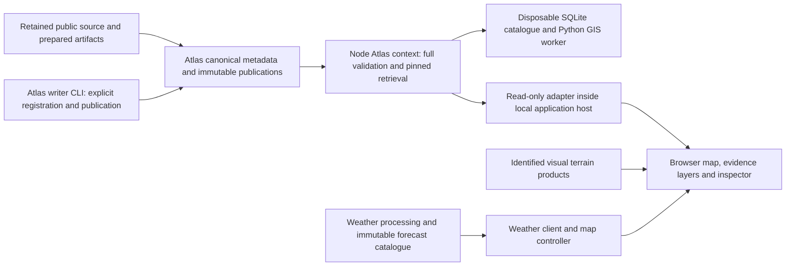
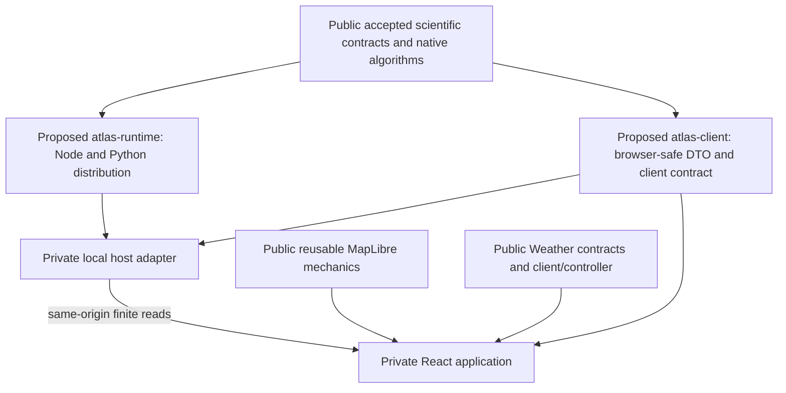

# Meridian first integrated prototype architecture and public/private boundary plan

## 1. Executive recommendation

**C — PROTOTYPE ARCHITECTURE PLAN READY.** Begin with a local, terrain-first **Riffelhorn evidence explorer**, consuming the existing qualified Atlas runtime through a small read-only application adapter. Keep canonical evidence, scientific processing and publication authority in the public Atlas implementation. Keep application composition, interaction and presentation in the private application repository after its explicitly authorised audit.

Use one long-lived, generation-pinned Node Atlas context behind the application's existing local development host, with a browser-safe contract. This is a proposed in-process integration boundary, not an implemented service or a new standalone daemon. It is justified by native spatial predicates, Python-backed retrieval and authoritative validation, not merely by the runtime using Node. Versioned public runtime/client artifacts are preferred over copying the repository. Their packaging and the private host's suitability must be confirmed during the audit.

The first milestone contains an interactive terrain map, a clearly bounded evidence view, point/area retrieval and a qualified inspector. **Weather follows immediately after that milestone**, using its existing distinct catalogue/controller and forecast clock. Routes, accounts, collaboration, every evidence family and global coverage are unnecessary entry conditions. No broader Atlas population is required before starting the bounded integration.

The next task is **PRIVATE MERIDIAN REPOSITORY AUDIT AND ARCHITECTURE RECONCILIATION — NOT BEGUN**. Private access needs separate explicit authorisation. This report performs no private audit, application implementation, package extraction or code migration.

## 2. Starting checkpoint

Public repository: `project-meridian`. Starting commit: `bdacccaaec532965081dfcc81579491781f10710`, branch `main`, upstream `origin/main`. The initial work tree was clean; origin was fetched and divergence was 0/0. The checkpoint contains the accepted habitat/planning integration and readiness assessment.

Only this report and five canonical navigation documents are changed. `meridian-data` remains retained public data; `meridian-private` was not accessed. Paths in the operational plan are configurable logical roots, not identities or prescribed Windows drive letters.

## 3. Current Atlas capability baseline

The [local architecture decision](atlas-local-architecture.md), [first runtime slice](atlas-local-runtime.md), [lifecycle integration](atlas-local-lifecycle.md), [registration workflow](atlas-local-registration.md), [unified retrieval](atlas-local-retrieval.md), [Exe water integration](atlas-local-exe.md) and [habitat/planning integration](atlas-local-references.md) establish a usable local single-writer runtime. It fully validates publications, builds disposable SQLite catalogues, executes qualified queries, registers immutable knowledge revisions, derives accepted products, scopes recomputation, publishes coherent generations and replays history.

The latest retained world has **141 query records: 107 source and 34 derived**, including 15 habitat claims and 37 planning-reference records. There are 34 explicit retrieval relationships. Native selectors comprise five Tryfan source-product descriptors, 44 Riffelhorn records and 60 Exe records; 32 additional Riffelhorn terrain scalar results bring the catalogue to 141. Exe's eight water records include six source and two derived records. These counts describe different units and must not be added as independent artifact or observation counts.

The [accepted Tryfan S1](tryfan-pilot-s1.md), [S2](tryfan-pilot-s2.md), [S3](tryfan-pilot-s3.md), [S4](tryfan-pilot-s4.md), [S5](tryfan-pilot-s5.md), [S6](tryfan-pilot-s6.md) and [exit acceptance](tryfan-pilot-s6-acceptance.json) remain accepted reference implementations. Their full query capability is not identical to current runtime exposure: Tryfan native physical sampling remains unsupported in this runtime slice. Neither 141 records nor two/three small regions establish a globally populated model.

## 4. Prototype-readiness interpretation

The prior result **READY FOR BOUNDED PROTOTYPE INTEGRATION** is retained. It means there is sufficient evidence to start a narrow application integration with honest coverage. It does not mean the current runtime is already a browser package, a public service, a static website API or a production deployment.

Evaluation criteria fixed for this plan are: preserve accepted authority and semantics; exercise real retained retrieval rather than fabricated observations; keep the map responsive independently of validation; give the browser no canonical write access; avoid another scientific query implementation; reuse proven frontend lifecycle code; require no paid key or new acquisition; make package/host assumptions explicit; retain historical pinning; and define incremental, independently verifiable stages. A limited region or unavailable family is acceptable; silently changing scientific meaning is not.

The concrete remaining application work is packaging/import closure, a read-only host adapter, display-coordinate conversion, browser presentation and end-to-end acceptance tests. These are bounded integration obligations, not demonstrated foundational Atlas blockers. Decisions about the private repository's layout and deployment remain unresolved until its audit.

## 5. Public repository inventory

| Actual public location | Established responsibility and constraint |
| --- | --- |
| [Project architecture](../architecture.md), [product direction](../product-direction.md), [Phase 5 history](../phase-5-architecture-plan.md), [README](../../README.md) | Current modular React application; Atlas/Weather/Traverse ownership; historical refactor plans are not a description of an unaudited private application. |
| [Package configuration](../../package.json), [Vite configuration](../../vite.config.ts) | Root is `private: true`, version 0.0.0. React 19, MapLibre 6.11.2, TypeScript/Vite; Frontend package declares Node minimum 22.12; the Atlas runtime guide requires Node 24.11 or later for native TypeScript stripping. No independently installable Atlas export/package exists yet. |
| [Atlas runtime entry](../../runtime/atlas/index.ts), [types](../../runtime/atlas/types.ts), [guide](../../runtime/atlas/README.md) | Node filesystem authority, explicit roots, `AtlasContext`, generation-specific catalogue and unified `retrieve`/`scanEvidence`; not browser code. |
| [Authority](../../runtime/atlas/authority.ts), [publication](../../runtime/atlas/publication.ts), [registration](../../runtime/atlas/registration.ts), [lifecycle](../../runtime/atlas/lifecycle.ts) | Validation, immutable metadata, dependency changes and root advancement. Application consumption is read-only. |
| [Worker](../../runtime/atlas/worker.ts), [Python implementation](../../runtime/atlas/worker.py) | Session-owned Python process; native GIS/SQLite operations. Relative imports reach accepted `scripts/atlas/riffelhorn-retrieval` and `scripts/atlas/multi-region` implementations. Packaging must include/test this dependency closure. |
| [App](../../src/app/App.tsx), [map composition](../../src/app/map/MeridianMap.tsx) | React state and orchestration currently combine selected locations, weather, routes and map presentation. Useful interactions, excessive scope for the first evidence explorer. |
| [AtlasMap](../../src/atlas/map/AtlasMap.ts), [terrain layers](../../src/atlas/map/terrainLayers.ts), [delivery adapter](../../src/atlas/map/terrainDeliveryAdapter.ts) | Imperative MapLibre lifecycle, source/layer ordering, projection safety and rendering eligibility. Scientific retrieval is separate. |
| [Weather architecture](../global-weather-architecture.md), [field types](../../src/weather/types/globalWeather.ts), [catalogue client](../../src/weather/data/globalWeatherService.ts) | Forecast-specific run/valid/accumulation semantics, browser numeric tiles and provider-neutral source interfaces. |
| [Weather publication adapter](../../scripts/weather/gfs_publication.mjs), [numeric cache](../../src/weather/data/numericTileCache.ts) | Existing guarded in-process Vite middleware and build materialisation; bounded nominal 64 MiB numeric cache with pinned entries. This is a host-integration precedent, not an Atlas implementation. |
| `scripts/ui`, `scripts/visual`, `scripts/weather`, `scripts/atlas`, `runtime/atlas/test-*.mjs` | Domain, runtime, UI and browser tests. Public browser checks use real network paths except explicitly isolated fixtures; provider outages must remain visible. |

Read-only inspection confirmed the prepared Riffelhorn manifest, accepted Tryfan store, retained Exe directory and pure Swiss visual-product manifest exist locally. The latest retained application-test world contains 382 files / 19,308,188 bytes. Its location is a configurable external publication root, not a committed payload or an application distribution entitlement. One existing latest pin is `a4ff3a9f55f286e643dff0b2a7ba44499f274ea90e2fdd3688a1e8f92befdb4c`; the retained pre-reference pin `87709b96493d26318f4989f13b85c97530185e6932e1859155f3b1201517597c` is a historical test case. Resolve both through the existing runtime guide and measurement configuration; never substitute another generation when a local root is missing.

## 6. Proposed system architecture

The application reads Atlas; it does not validate or publish scientific evidence. Atlas and Weather have separate data roots, publication/run identities, caches and failure states. Location and display composition are shared application concerns. There is no shared scientific transaction between an Atlas generation and a forecast run.

The preferred first host is the existing local development process, conditional on private audit compatibility. A small middleware module routes finite read requests to a pinned context in that process. No separate listener, remote API, daemon, scheduler, cloud database or authentication system is required. A static export is useful for fixed snapshots, but cannot substitute for arbitrary supported native point/area retrieval without either precomputing a finite answer set or implementing scientific matching in the browser. Neither is the preferred first explorer.

## 7. Atlas responsibilities

Keep canonical input/preparation identity, qualified evidence, physical/knowledge time, rights, uncertainty, source registration, accepted derivations, dependencies, component membership, immutable publications, full validation and historical generation access public and authoritative. Reuse `AtlasContext.open`, `buildCatalogue({ qualified: true })`, `verifyCatalogue`, `retrieve`, explicit inspection/relationship records and the accepted writer CLI.

Application consumption opens an explicit configured generation once, validates its complete closure and serves only that pinned state. An active-root change is a notification of another available generation, not permission to mutate the open context. Switching generations requires another validated context and explicit UI state transition. Broken canonical evidence fails closed; a bad catalogue gives a rebuild action, never an automatic generation fallback.

Keep write operations in the developer's explicit Atlas CLI workflow. Do not expose registration, recomputation, repair or root advancement through the first browser adapter. Missing volumes, unsupported queries and unavailable historical revisions are distinct failures.

## 8. Weather responsibilities

Weather retains acquisition/preparation, model provenance, issue/run time, forecast valid time, accumulation intervals, field units, numerical decoding, coverage, uncertainty and its own update lifecycle. The existing GFS processing selects indexed GRIB records and publishes one coherent ten-field run; the frontend currently visualises a subset. Existing point forecasts are a separate source, not fallback evidence for missing global fields.

Preserve `WeatherMapController`, source/field contracts, catalogue refresh adoption and existing numeric sampling. GFS 0.25-degree native resolution and low-zoom numerical products do not become mountain-scale forecasts when overzoomed. Crossfade is a display operation, not physical temporal interpolation. An Atlas historical generation and Weather forecast issue/valid time must have separate labels and controls.

The first Weather milestone after the Atlas explorer should reuse one existing precipitation overlay plus model/run/valid-interval inspection. An existing retained run suffices; if unavailable, the layer reports unavailable. No new acquisition or Weather redesign is authorised by this plan. Specialist mountain/regional forecasts remain complementary sources, not capabilities Meridian claims to replace.

## 9. Application responsibilities

The application owns layout, camera, map lifecycle orchestration, layer visibility, selected record, bounded query request state, inspector presentation, coverage display, publication selection and later the separate forecast clock. Keep MapLibre mutation outside React render. React manages application state and renders controls; a map controller applies changes and cleans up listeners/sources.

A click selects location or visible evidence, then requests qualified results. The inspector displays returned metadata; it does not rank sources, infer physical agreement, classify current water/ecology/legal state or calculate scientific confidence. The application can compare separately qualified records and generations without declaring physical change.

Route/planning workspaces, GPX import, Traverse computation, accounts, collaboration and monetisation are deferred. User-data collection is explicit opt-in with purpose, retention and deletion described. The first prototype requires no analytics, coordinate history or diagnostic upload. Remote map tile requests necessarily disclose requested tiles to providers; disclose this dependency. Keep optional external search/point-forecast requests disabled until deliberately enabled and explained.

## 10. Data and rendering boundaries

| Representation | Authority and permitted use |
| --- | --- |
| Retained original artifacts | Immutable source evidence with hashes, product identity and native qualifications. A hash establishes local identity, not provider authenticity or physical truth. |
| Prepared evidence | Recorded source-preserving transforms with their own identity/support; never silently replaced by display products. |
| Derived evidence | Versioned methods, parameters, exact input revisions and inherited qualifications. Historical outputs remain available. |
| Published generations | Explicit component membership and filesystem root authority; full validation before consumption/publication. |
| SQLite/indexes | Rebuildable candidates only. No publication truth or browser SQL contract. |
| Display geometry and tiles | Generation/product-keyed representations for the map, carrying transform/source references. No geometry repair, scientific fusion or unsupported vertical conversion. |
| Application caches | Disposable DTO/render caches; key by contract version, generation, record revision, query and rendering product. They cannot repair canonical metadata. |

MapLibre uses WGS84/Web Mercator presentation; Riffelhorn evidence includes EPSG:2056 and other native references. The host performs an explicit tested two-dimensional transformation for display/query input, retains native support and transformation lineage, and preserves LN02 versus EGM2008 distinctions. Bounding boxes are candidate filters; native exact matching remains in Atlas. Full native polygons may extend beyond selected fixture eligibility; show those different boundaries separately.

Current public terrain is AWS Terrarium visual context. [Production selection](../../src/atlas/terrain/runtime/productionTerrainHierarchy.ts) has no regional products; [visual configuration](../../src/atlas/map/visualTerrainConfig.ts) does not dynamically select the retained Swiss fixture. Its upstream vertical/reference qualifications are unknown. `terrain-analysis-dem` supplies visual hillshade/colour relief, not analytical Atlas terrain. `queryTerrainElevation`, even divided by exaggeration, must be labelled approximate rendered height or omitted from scientific inspection.

The [pure Swiss support product](../atlas/riffelhorn-swiss-support-product.md) is a separate retained display candidate: 100 km² source support, 11,429 Terrarium tiles, 930,914,852 bytes, z12–18, preserved LN02 numbers, complete-tile support only. It has no AWS fill, no complete tiles below z12 and unresolved perimeter/global continuity. The [earlier mixed regional prototype](../atlas/riffelhorn-regional-terrain-prototype.md) has unaccepted Swiss/AWS joins. **First milestone uses existing AWS visual context**, explicitly distinct from queried native Swiss DTM evidence. Later refinement may use pure Swiss delivery inside verified per-zoom camera support with explicit unavailable edges. It must not introduce seamless blending or silently expand the 4 km² scientific fixture to the 100 km² visual source estate.

## 11. Public/private repository boundary

| Public, reusable ownership | Private application ownership after authorisation |
| --- | --- |
| Frozen scientific contracts and accepted method/validation implementations | Application layout, navigation and presentation policies |
| Atlas Node runtime, Python worker dependency closure, writer CLI and regression tests | Development-host composition and local read-only route mounting |
| Minimal browser-safe Atlas DTO/client contract and conformance tests | Evidence inspector, layer state, interaction/cancellation and coverage UX |
| Weather processing, field/catalogue contracts, reusable client/controllers | Weather placement, controls and integration with application state |
| Renderer eligibility/delivery contracts and narrowly reusable map mechanics | Application camera/pilot defaults, theme and render composition |
| Public source/provenance documentation and safe package build instructions | Application build/development configuration, application tests and operator documentation |

Retained payloads and catalogues stay outside both code repositories. Do not publish data merely because code is public or the source could be downloaded. Source/derivative attribution and redistribution constraints remain product-specific. Private configuration contains local paths; it must not embed secrets in browser bundles. MapTiler browser-visible tokens require scoped handling and are optional; no key is required for the first milestone.

## 12. Proposed dependency strategy

Prefer **exact versioned artifacts from the public implementation**, with local workspace/file linkage while developing them. No package registry, public release or broad monorepo migration is required. Proposed names below express boundaries, not packages that already exist.

`atlas-runtime` must include its complete accepted import/asset/worker closure; current repository-relative script imports and accepted contract loading prevent treating `runtime/atlas` as a standalone copied folder. Review the Exe accepted `contract()` loading path as well as Python imports. Compile/package required contracts without changing their semantics; retain test fixtures as test assets, not invented production data. Verify an isolated installation outside the public checkout, explicit Python environment and no hidden sibling/repository assumptions.

`atlas-client` contains types, finite request validation/response parsing and transport only; it has no Node filesystem, SQLite, Python or scientific predicate implementation. Host and browser consume the same versioned DTO contract. Pin artifact version, public commit, lockfile and build hash. Start with a reproducible local tarball/workspace dependency; choose package manager/link syntax after private audit. Promote to immutable releases when the boundary works. Do not copy the public React app or entire research directory into the private app; adapt narrow reusable modules with source history and tests preserved.

Do not extract a general rendering/core package merely to follow a diagram. Share only the actual tested dependency closure needed by two consumers. Existing frontend imports of Vite worker assets need explicit consumer-build tests. Package names, exports, licence and bundler compatibility require audit confirmation.

## 13. Minimal Atlas application-facing contract

Proposed browser contract version: `meridian-atlas-view/v1`, separate from the frozen scientific contracts and existing `atlas-qualified-retrieval/v1`. Its operations are finite, read-only and capability-discovered:

| Operation | Input and output boundary |
| --- | --- |
| `view()` | Configured pin → generation/component identities, eligible regional supports, per-family availability/coverage qualifiers, supported predicates, rendering descriptors and validation-ready/error state. No claim of complete regional observation. |
| `query()` | Pin + family/class/identity/feature selectors, supported bounded point/area and explicit CRS, supported role-specific temporal or knowledge filter → deterministic qualified record summaries, relationships, gap/indeterminate outcomes. |
| `inspect()` | Pin + exact record key/revision → canonical qualification/provenance/rights/method/support/time document references and safe detailed documents. |
| `relationships()` | Pin + exact identity, inputs/dependents, direct/transitive → explicit authoritative edges and exact input/output revisions. No inferred lineage. |
| `renderings()` | Pin + record/product identity → only approved display asset descriptors and source/transform references; no arbitrary filesystem paths. |

An answer includes contract version, exact Atlas generation, stable evidence identity **and revision**, record key, component identity, region/family, source/derived class, native representation/classification, native support/CRS, role-specific temporal qualification, knowledge revision/reference, source/preparation/artifact references, uncertainty, rights/attribution and direct relationship references. Detailed documents may be fetched lazily. Reuse existing `EvidenceRecord`, `EvidenceRelationship`, `documents` and gap semantics rather than inventing a second scientific model. Sanitise local physical path locators and internal diagnostics from browser responses without deleting logical artifact identity/provenance. Public source links and readable attribution remain available.

Supported temporal roles remain source-specific: physical observation/applicability, survey, contributor vintage, administrative effective/reference, source publication and knowledge time. Preparation/publication time is not observation time. An unknown request is explicit; unknown applicability does not match every finite period. Keep current exact accepted query semantics and unsupported errors. Feature IDs exist only when the source provides them; identities are never inferred from equal coordinates. Record/render geometry overlap does not imply agreement.

The local host maps these finite operations to existing Atlas calls. It accepts no raw SQL, arbitrary file path, arbitrary projection pipeline, publication write or unsupported semantic inference. Configure roots and generation on the host; browser selectors choose only explicitly opened/allowlisted pins. Validate schema, query size/bounds and response size; reject unsupported antimeridian/geometry forms instead of inventing algebra. Use same-origin loopback access, checked origin/host, no wildcard CORS or unauthenticated LAN binding, and safe errors. This is a local integration boundary, not a production security architecture.

## 14. Geographic pilot comparison

| Criterion | Tryfan | Riffelhorn | Exe |
| --- | --- | --- | --- |
| Current runtime view | Five source-product descriptors; full S2/S6 native population remains behind accepted pilot interfaces | 44 native records: six raster bindings and 38 real features; 32 local terrain-derived scalars | Eight water +15 habitat +37 planning-reference records; partial selected probe coverage |
| Terrain/scientific scope | Accepted 9 km² integrated pilot, terrain/categorical/vector/dated appearance relationships | Qualified 4 km² core; Swiss DTM, Copernicus DSM, WorldCover, geology and glacier/debris inventory | Water/ecological/administrative diversity; no equivalent local analytical terrain population in the current world |
| Visual interest | Mountain terrain, public map defaults nearby | Steep Alpine relief, geology and historical glacier features | Estuary/low relief; strongest semantic coexistence test |
| Render compatibility | Existing default Snowdonia/AWS context; accepted Welsh analytical/visual references require explicit delivery adoption | Existing global AWS works; pure Swiss tiles exist but perimeter/coarse continuity unresolved | Existing AWS background works; vector presentation and coverage qualifications dominate |
| Coverage/time quality | Strong pilot accountability; some dates/datum qualifications remain unknown | Explicit mixed native datums, editions/epochs and historical inventory; not current glacier truth | Mixed source/contributor/effective dates, unknown survey support; not current ecology or legal restriction |
| Reproducible first view | Useful reference, but exposing all native pilot queries adds adapter work | Real runtime queries already usable; accepted prepared identity and native geometry available | Already usable; best second validation case, less suited to terrain-first experience |

No candidate provides seamless globally reconciled terrain or current physical truth. Compare runtime-accessible capabilities, not every historical research asset. Riffelhorn provides the smallest useful combination of real qualified retrieval and terrain exploration without another scientific integration.

## 15. Selected first pilot

**Riffelhorn**, scientific fixture EPSG:2056 `[2624000,1091000,2626000,1093000]`, 2 × 2 km / 4 km². Use the existing retained multi-region publication, selecting its Riffelhorn view rather than constructing a new publication. Preserve Tryfan/Exe as separately qualified later validation cases.

The [preparation proof](atlas-riffelhorn-preparation.md), [retrieval proof](atlas-riffelhorn-retrieval.md) and [source specification](atlas-regional-expansion.md) identify twelve retained inputs / 120,347,916 bytes and prepared revision `357b28e705f7c2647cdf2d54467fc9ee851465814d8ed645cae30713ef9187bb`. Inputs include four Swiss 0.5 m DTM rasters, a Copernicus DSM, WorldCover source/extract, two GeoCover source responses and glacier-inventory source/subsets. These are distinct scientific representations.

Use the existing native feature population for an optional geology/glacier inventory overlay and click inspection; source-qualified raster metadata/samples and available local scalar results are inspectable through supported queries. The 32 scalars are discrete retained probes/results, not a continuous regional slope raster. Basemap relief remains separately labelled visual context in the first milestone. No glacier present-day extent, route safety, vegetation observation or fused DTM/DSM claim follows.

## 16. Frontend KEEP/ADAPT/REPLACE/DEFER assessment

KEEP means reuse after an isolated import/build check; ADAPT means retain tested behaviour while changing its boundary; REPLACE means replace the relevant application-facing role, not delete the public implementation. No private code equivalence is assumed.

| Public component/capability | Classification | Concrete basis and action |
| --- | --- | --- |
| React + TypeScript + Vite foundation | KEEP | Existing coherent build/dev toolchain. Confirm private versions before adoption; avoid a framework rewrite. |
| `src/app/App.tsx` composition | ADAPT | Many route, selected-point forecast and weather-clock effects. Build a smaller evidence-explorer composition instead of copying all orchestration. |
| `AtlasMap` MapLibre lifecycle/worker setup | KEEP | Single imperative owner, cleanup/style lifecycle and projection safeguards. Consumer build must resolve `?worker&url`. |
| `MeridianMap.tsx` integration shell | ADAPT | Controller seams, camera/resize, marker and cleanup are useful; decouple route-heavy state and add a read-only Atlas view client. |
| Terrain DEM source configuration | ADAPT | Keep delivery eligibility/encoding checks; configure pilot/visual source explicitly. Production registry currently has no regional products. |
| Terrain/hillshade/colour-relief ordering and globe/Mercator safety | KEEP | Preserve terrain-before-projection removal, idempotency and label ordering. Recheck retained compatibility workarounds in browser tests. |
| Terrain scientific interpretation from rendered DEM height | REPLACE | Current pointer height is rendering-derived/rounded. Use qualified native Atlas results for scientific inspection; display approximate render height separately if useful. |
| Satellite basemap/provider states | DEFER | Optional MapTiler token and network/attribution obligations; unnecessary first-pilot dependency. Preserve implementation for later use. |
| Camera/navigation/controls | ADAPT | Keep resize/ease/selection mechanics; introduce explicit pilot fit and visible coverage rather than default Snowdonia or route fit. |
| Weather controllers/field renderers | DEFER | Reuse immediately after the first Atlas milestone; separate forecast clock/status. No redesign. |
| Layer controls/legends (`LayerPanel`, `MapControls`, `LayerLegend`) | ADAPT | Accessible controls useful; current fixed weather overlay enumeration needs a small supported Atlas layer set and semantic legends. |
| Current pointer evidence inspector role | REPLACE | `MeridianMap` currently inspects DEM/forecast samples, not qualified Atlas records. Retain panel/interaction affordances; new content consumes Atlas DTOs and provenance. |
| Location/search/geocoding | DEFER | Pilot can fit known coverage without external search. Later explicit provider/privacy handling; no new service required. |
| Forecast data loading/cache/cancellation | KEEP | Preserve Weather ownership and existing catalogue adoption/abort states. Do not repurpose numeric cache as Atlas publication authority. |
| Atlas data loading/cache/cancellation | ADAPT | New finite client boundary needed. Reuse request-generation guards; cache exact pins/revisions and discard outdated responses. |
| Error presentation | ADAPT | Source-layer and unavailable states exist, but some map errors only reach console. Add actionable Atlas loading/unavailable/integrity/unsupported states and provider degradation. |
| Focused domain/UI tests | KEEP | Preserve accepted scientific oracles and reducers; adapt application composition assertions narrowly. |
| Playwright smoke/visual checks | ADAPT | Keep 1920×1080, 1440×900 and 1366×768 coverage; add actual retained pin/inspection, style reload and history tests with labelled offline render fixtures. |
| Vite development host | ADAPT | Existing Weather middleware provides a bounded precedent. Add proposed Atlas read-only mounting only after audit; no implicit production/preview API. |
| Build/static deployment assumptions | ADAPT | Current weather build materialises a selected run, whereas arbitrary Atlas queries require the local host. Document local prototype mode; a bare static build must not advertise unavailable query features. |
| Traverse/routes/journey UI | DEFER | Valuable later; not part of this first prototype or current implementation permission. |

## 17. Proposed first user-facing experience

Open a local map already framed around Riffelhorn. Pan, rotate, zoom and tilt the terrain; see a visible 4 km² Atlas eligibility outline and separate layer availability. Select a native geology/glacier inventory overlay or click the terrain to retrieve supported separately qualified records. Open a compact inspector with representation, native class/value, source, relevant date/unknown, limitation and provenance link. An advanced section reveals method, exact revisions, dependencies, datum and publication pin.

Default display is map + a small layer control + coverage/status badge + inspector. No dense research dashboard or universal confidence score. A no-result state says “No matching evidence in this publication” and explains incomplete/unknown coverage; it does not say “no water”, “no habitat” or “no restriction”. A later Exe validation view tests those exact semantic distinctions without blocking Riffelhorn.

Concrete first-prototype acceptance checklist (future implementation criteria, not results of this task):

- [ ] A clean local setup opens one explicit retained publication; bad roots/closure fail clearly and do not switch generations.
- [ ] The map stays navigable during validation; Atlas shows loading rather than an empty scientific conclusion.
- [ ] Riffelhorn coverage, visual source attribution and scientific source coverage are visibly distinct.
- [ ] Pan/zoom/tilt/style reload and unmount/remount work without leaked maps/listeners or material console/page errors.
- [ ] Point, bounded area, exact identity and available native feature queries agree with retained authoritative answers at selected boundary/no-result cases.
- [ ] Each result identifies generation, evidence/revision, scientific representation, source/preparation, support/CRS, time/unknown, uncertainty and rights.
- [ ] Inspector distinguishes mapped, observed, derived and administrative-reference meanings; rendered height is never presented as qualified DTM truth.
- [ ] An explicit historical pin survives reload; a new active root never silently changes the current view.
- [ ] Catalogue deletion/rebuild preserves results; corruption and canonical tampering are separately diagnosed.
- [ ] Stale/aborted requests cannot overwrite newer selection; unsupported predicates fail explicitly.
- [ ] No raw filesystem path, SQL, write endpoint, private artifact or secret reaches the browser.
- [ ] No paid key, analytics, user-data upload, route planner or new dataset is needed; network provider dependencies are disclosed.
- [ ] The reference-host responsiveness and startup targets in section 18 are measured and met, or a concrete bounded blocker is reported.

## 18. Performance implications

Use [retained measurements](atlas-local-references-results.json), not a new benchmark matrix. Reference environment: Windows, i7-12700H, approximately 16.8 GB RAM, Node 24.11.0, Python 3.12.6, SQLite 3.45.3; three isolated workflows/fresh-process replays, no OS-cache flush, warm indexed/scan query pairs. These are not production SLAs or cold-disk claims.

| Existing measurement | Prototype implication |
| --- | --- |
| Full open median 9.113 s; catalogue build median 838 ms; 220 KiB catalogue | Pay validation once per pinned context. Build only when absent/incompatible; show startup progress. Do not reopen for every click/hover. |
| Warm indexed queries approximately 0.46–0.58 s | Click-first inspector and debounced bounded-area requests are credible; mouse-move scientific queries are not the initial interaction. Candidate savings do not establish an end-to-end speedup. |
| All-record indexed median 569.5 ms versus scan 536.0 ms | Index candidate selection is useful but current qualification/hydration work dominates; no optimisation task is justified by this comparison alone. |
| Example Exe point: 10 native candidates, seven results; indexed 464.3 ms versus scan 468.5 ms | Keep exact filtering and gap semantics; do not claim index latency advantage from counts alone. |
| Full open 113 metadata records / 21,900,027 logical bytes; 523 payload hashes / 211,858,995 logical bytes | Full integrity work remains default. Counts are logical operations with overlapping reads, not unique physical disk throughput. |
| Warm qualification path 46 canonical metadata reads / 6,148,089 bytes plus 99 artifact metadata reads / 10,386,460 bytes | Long-lived context does not eliminate accepted per-query authority checks. No cached response may substitute for opening/validating its pin. |
| Sampled Node RSS approximately 292–530 MB; latest world about 18.4 MiB | Bound concurrent contexts and queueing. This is parent RSS, not combined Python/Node peak memory. |

Prototype targets to test on the reference laptop: interaction acknowledgement under 100 ms; map camera at least 30 fps in representative 1440×900 terrain navigation after assets load; median warm selected-record/point inspection at most 1 s and p95 at most 2 s over at least 30 representative requests; warm-filesystem complete Atlas startup at most 20 s with visible loading. External tile latency is measured/reported separately and must not block Atlas error diagnosis. These are acceptance budgets, not claims already proven by the runtime or a universal-device guarantee.

Use a bounded queue/single-flight context, coalesced area requests and browser abort/request epochs. The current worker cannot necessarily cancel an executing synchronous GIS request; let safe read-only work finish and discard stale responses, rather than claim immediate compute cancellation. Initially keep one active context and at most one explicitly requested historical context; close displaced workers. A missing external volume reports unavailable, not fallback to another generation.

Cache generation-specific DTOs and rendered artifacts locally with explicit versions; no unbounded viewport history. The 80 GB laptop planning budget and optional 4 TB disk remain flexible. Existing pure Swiss visual assets require about 0.93 GB if used later, not regeneration or acquisition. Keep metadata/catalogues/active datasets local when practical and large archives on configurable volumes. An external disk is not a backup. Public/static hosting, future national scale and backup automation remain later operational decisions.

## 19. Scientific presentation requirements

Use a short evidence-type badge and source/date/qualification summary with detail on demand. “Mapped habitat inventory”, “planning reference”, “derived terrain slope” and “source DSM” are useful labels. Avoid “ground truth”, “current restriction”, “current glacier” and invented confidence percentages.

Keep separate temporal labels: observed/surveyed, source edition/publication, administrative effective time if established, prepared, registered/knowledge revision and Atlas generation. Hide irrelevant unknown dimensions in the compact view only if the relevant unknown is still obvious; detailed inspection preserves all qualified roles. Forecast issue/valid time belongs to Weather's separate control.

Unknown water state, missing habitat, partial feature coverage or an old planning polygon cannot establish physical/ecological/legal absence. Habitat is mapped/interpreted evidence, not species presence or current ecological observation. Planning-reference boundaries are administrative context, not necessarily ground features or current legal restrictions. Display overlapping records separately and explain what each source actually measures or represents.

Attribution remains visible on the map and in detail. Swiss, Copernicus, WorldCover, GLAMOS and Exe source obligations remain distinct; the [source assessment](atlas-regional-expansion.md) and accepted Exe reports are the retained rights boundary. No new legal certainty or redistribution permission is asserted. Check distribution-specific terms before any public artifact/application release. Optional basemap/satellite provider terms and network dependencies also require separate treatment.

## 20. Private-repository audit checklist

**Not performed.** Explicit authorisation must identify the private repository/root and permit a read-only code/configuration audit. Do not assume it contains the public frontend or matching versions. The audit should inventory:

| Area | Required inspection and deliverable |
| --- | --- |
| Git/workspace | Status, branch/upstream, remote identity, legitimate uncommitted work, history relevant to architecture; no reset, migration, commit or push. |
| Directories/entry points | Actual application/router/renderer/host entry points, shared packages, ownership boundaries and active versus abandoned implementations. |
| Dependencies | Manifests, lockfile/package manager, Node/React/TS/MapLibre versions, Python/native requirements and version conflicts. |
| Frontend/map | MapLibre creation/destruction, worker/CSP configuration, terrain/DEM sources, projection, camera, style reload, controls, layers and inspector. |
| Weather | Existing preparation/client/controllers, run/valid-time handling, data roots and fallbacks; no redesign or acquisition. |
| Atlas/package seams | Existing shared code, imports, bundler exclusions and feasibility of public versioned runtime/client dependencies without tree copying. |
| Configuration/secrets | Names, ownership and loading rules; browser-versus-host exposure, ignored files and local paths. Do not print secret values or collect user-data payloads. |
| Generated artifacts/data | What is tracked/ignored, payload/cache placement, reproducibility and deployment-materialisation assumptions. Inspect manifests, not private personal datasets. |
| Developer workflow | Documented and actual dev/build/test/preview commands, host processes/ports and clean reproducibility. Run only bounded commands authorised by the audit. |
| Tests | Existing unit/integration/browser tests, retained/public fixture access, network dependencies, error checks and coverage gaps. |
| Deployment | Static/local/native/server assumptions, required services, cost/API keys, environment availability, shutdown/recovery and permission boundaries. |
| Documentation/migration | Current product decisions, reusable components, replacements, proposed import graph and conflicts with this plan. |

Produce a file-backed inventory, KEEP/ADAPT/REPLACE/DEFER reconciliation, exact public package closure and concrete first implementation scope. Report secrets only as redacted configuration requirements. No private user-data access is needed. If authorised access excludes a relevant area, mark it unknown and identify its significance rather than inventing it.

## 21. Staged migration strategy

Each stage requires a separate bounded implementation authorisation; the sequence is provisional and **no stage begins here**. Preserve working functionality and use reversible entry points rather than a disruptive rewrite.

| Stage | Entry conditions | Deliverable and acceptance | Regression protection and stop |
| --- | --- | --- | --- |
| 1. Private audit/reconciliation | Explicit private code/config audit authorisation and root; public plan available | Read-only inventory, architecture conflicts, confirmed package/host choice, revised pilot acceptance and exactly one implementation task | Preserve git/user work; no migration/secrets disclosure/private user-data processing. Stop when concrete implementation scope is defensible, or specific blocker documented. |
| 2. Clean foundation/dependencies | Audit accepts local host and source/package closure; implementation separately authorised | Minimal application entry with MapLibre lifecycle and version-pinned public artifacts, browser-safe client, explicit root/worker config; isolated runtime installation outside public checkout works | Preserve scientific contracts and old app entry; validate build, package imports, Python failure and browser Node-exclusion. Stop at runnable foundation, before broad UI migration. |
| 3. Minimal Atlas integration | Foundation works; retained publication and catalogue roots configured | Read-only host view/query/inspect adapter, full-open loading/error state, explicit generation pin and rebuild workflow; retained answers agree | No browser writer/path/SQL access; canonical and old pins unchanged; bad catalogue/closure tests. Stop after pin/query/restart works. |
| 4. First evidence view/inspector | Stage 3 correct; display transform/support fixtures chosen | Riffelhorn 4 km² coverage, optional native feature overlay, bounded point/area selection, provenance/time/uncertainty detail; section 17 checklist and latency targets pass | Test exact retained identities/qualifications, boundaries, unknown/no-result, superseded requests, style reload and history. Stop at a useful terrain-context evidence explorer. |
| 5. Terrain/render refinement | Stage 4 accepted; actual rendering issue documented | Refine camera/lighting/legends without altering science. If adopting pure Swiss tiles, test per-zoom complete support and bounded camera/unavailable edges; retain distinct product identity | No unaccepted Swiss/AWS blend, datum reconciliation or evidence substitution. Browser evidence tests remain unchanged. Stop at justified visual improvement; not a regional fusion research campaign. |
| 6. Weather integration | Atlas experience stable; existing Weather run/interfaces available or honestly unavailable | One existing forecast overlay/controller, separate issue/valid/accumulation labels and point inspection; missing run handled explicitly | Atlas generation remains pinned across forecast updates; numerical cache/fallback/temporal and browser tests; no acquisition/redesign implied. Stop when the selected Weather layer works with correct separation. |
| 7. Broader capabilities | Earlier milestones measured and used; concrete need identified | One separately scoped later region/family or application capability, such as Exe semantic validation | Preserve pilot contracts/history and Weather separation. Stop at that task's acceptance boundary; no open-ended integration backlog. |

Stages 2–4 form the smallest useful end-to-end implementation sequence after audit; they may be one bounded vertical-slice task if the audit finds straightforward seams. Terrain rendering is already present as global visual context in that slice; stage 5 is refinement, not permission to postpone terrain until after an evidence-only application. Weather can follow stage 4 directly when no refinement is needed.

Rollback retains the previous application entry/configuration and public artifact pin. Atlas historical publications need no rollback rewriting; select the previous explicit pin. A broken adapter/cache is disposable and cannot advance the scientific root. Static `dist`/preview does not inherit development middleware: either document local-host-only mode or separately implement/test an appropriate preview host. Public deployment is outside the first milestone.

## 22. Risks and limitations

| Priority for first prototype | Risk and concrete response |
| --- | --- |
| High | Private contents/host unknown: audit before extraction/migration; do not promise code equivalence. |
| High | Runtime packaging reaches accepted scripts/native GIS and current contract loaders: isolated-install test is an entry gate, not a copy-folder assumption. |
| High | Browser/Node boundary: read-only finite DTOs and host adapter, no filesystem/SQLite/browser scientific duplicate. |
| High | Rendered terrain mistaken for analytical truth: visual AWS label, native metadata/value inspector, separate datum/source/support and no unaccepted blend. |
| High | Startup/per-query cost: long-lived pin, loading UX, bounded requests and measured targets; keep full validation. |
| High | False current/legal/ecological claims: evidence-type labels, unknown/partial coverage and provenance; no absence inference. |
| Medium | Local host exposure/cancellation: loopback/same-origin controls, no writer routes, bounded queue and stale-response guards; no production security claim. |
| Medium | Historical pin versus mutable external basemap: Atlas answers replay exactly; external visual tiles may change. Do not claim full frame reproducibility unless visual products are also pinned/retained. |
| Medium | Small, disconnected populations: pilot-specific honest availability; no national coverage or scale claims. |
| Medium | Atlas/Weather temporal entanglement: separate pin/run/valid-time state, caches and status; no joint scientific generation. |
| Medium | Technical debt/route-heavy public composition: adapt controller seams and retain tests, avoid wholesale app copying or rewrite. |
| Medium | Licences/attribution: local retained-research use does not imply unrestricted application data redistribution. Review release-specific obligations separately. |
| Later | Multiwriter/service scale, national data, backup and offline distribution: evidence-based later tasks; no distributed infrastructure now. |

## 23. DECIDE NOW

Atlas remains the qualified world-evidence authority; Weather remains an independent atmospheric system. The application composes their views without scientific fusion. Canonical files/filesystem root are authoritative; SQLite and render/client caches are disposable. Full validation remains default; normal interaction reuses an explicit pinned context.

Choose Riffelhorn's 4 km² prepared core for the first terrain-first prototype, using real current runtime queries and existing AWS visual context. Preserve source-native qualifiers, feature identities, historical generation and separate visual versus analytical height. Exe and Tryfan are later validation cases, not compulsory first-milestone populations.

No broader acquisition, Atlas evidence-family integration, new scientific algorithm, terrain reconciliation, routing or service infrastructure is necessary before the private audit. The public architecture plan is complete; the prototype is not implemented.

## 24. PROVISIONAL DIRECTION

Versioned public runtime and browser-client artifacts, local development linkage and a small read-only adapter inside the private application's local host are preferred. Confirm names, build/worker closure, package manager, host mounting and reusable frontend mechanics during the audit. Use click-first evidence inspection and one explicit historical context; Weather follows the first Atlas milestone.

Refine pure Swiss terrain only inside verified supported delivery footprints when justified. UI layouts, performance budgets and proposed browser DTO schema are reversible implementation choices, not changes to frozen scientific contracts.

## 25. DEFER PENDING EVIDENCE

Private directory/entry-point choices, actual version conflicts, host/deployment compatibility, exact shared package exports and code replacements require the authorised audit. Static/offline distribution, public hosting, release-specific data rights, comprehensive backups, larger-region performance and multiuser/storage architecture remain later questions. No private file or architecture is presumed.

## 26. REJECT

Reject copying the public app/research tree wholesale, browser filesystem/SQLite access, a second scientific query engine, frontend validation/publication authority, automatic latest-generation switching, arbitrary SQL/path endpoints and a standalone network service solely because Atlas uses Node. Reject forcing Weather into Atlas knowledge/publication time or treating forecast overlap as scientific agreement.

Reject unaccepted Swiss/AWS terrain blending, display height as qualified DTM truth, source resolution as accuracy, categorical habitat as present-day ecology, planning references as current legal advice, missing evidence as absence, fabricated confidence/dates and satellite/API-key requirements for the first milestone. Reject adding every region/family before beginning a bounded prototype, private access without authorisation and speculative distributed infrastructure.

## 27. Regression verification

Documentation-only verification is recorded after the complete diff review. It checks exact checkpoint/upstream, the six-file report/navigation boundary, unchanged tracked files outside that boundary, 42 canonical status rows, 113 protected production hashes, accepted source-admission receipts, retained Tryfan/Riffelhorn/Exe files and historical proof worlds including the latest 382-file world, S1–S6 presence, no S7, valid local documentation links, required sections/diagrams/acceptance checklist, append-only development log and explicit unbegun private-audit boundary.

The prior accepted 84 safeguards / 903 tests / types / lint / build results remain historical evidence from `bdacccaa`. They are not fresh test results for this plan. No executable source, configuration, dependency, frozen contract, accepted report or retained artifact is modified; unrelated expensive executable suites are unnecessary for this documentation-only task. **Final documentation/protection verification: 47/47 safeguards passed.** All 1,119 tracked files outside the five navigation documents are unchanged; the new report is the only added file. All checked accepted retained/historical hashes matched, including the latest 382-file habitat/planning world. Local links and `git diff --check` passed. The complete change contains only this report and five append-only navigation updates; no large artifact, executable, private-repository access, acquisition or infrastructure change was introduced. The task-specific checker and machine-readable receipt are temporary external review artifacts, not committed code or new accepted scientific evidence.

## 28. Overall architectural conclusion

**C — PROTOTYPE ARCHITECTURE PLAN READY.** A concrete Riffelhorn-first experience, qualified application contract, public/private dependency strategy, local read-only integration boundary and staged migration are sufficiently specified. Package/host details are provisional pending the private audit, not a material contradiction in the public evidence. The accepted readiness result remains bounded and does not assert production, global, legal or physical-world completeness.

## 29. Exactly one next bounded task

**PRIVATE MERIDIAN REPOSITORY AUDIT AND ARCHITECTURE RECONCILIATION — NOT BEGUN.**

**Uncertainty:** whether the actual private application's entry points, dependencies, frontend, host and deployment assumptions can consume the public Atlas runtime/client boundary and support the Riffelhorn vertical slice without duplicating authority or requiring a disruptive rewrite.

**Importance/evidence:** qualified runtime integration and this public frontend audit support a first prototype; private compatibility is the remaining uninspected implementation input. More Atlas families are not required to resolve it.

**Prerequisites/access:** separate explicit user authorisation for the named private repository and read-only code/configuration/history inspection; preserve legitimate work and exclude private personal-data payloads. Public accepted reports/runtime, this plan and retained public fixture references are available. If audit command execution is desired, its bounded scope must be authorised; do not assume permission for migration or implementation.

**Permitted scope:** inventory section 20, reconcile actual entry points/versions/host against this plan, identify minimal public package/worker closure and source-reuse boundary, inspect tests/workflows and redact configuration requirements. No code migration, private implementation, acquisition, production changes, secrets disclosure or user-data processing.

**Deliverables:** one evidence-backed audit/reconciliation report, confirmed/adjusted architecture and pilot choice, KEEP/ADAPT/REPLACE/DEFER inventory, reproducible setup requirements, exact first implementation file/interface boundary and acceptance checklist, and exactly one subsequent bounded implementation task.

**Acceptance:** actual files support all conclusions; branch/work preserved; conflicts and unknowns explicit; public authority and Atlas/Weather separation retained; isolated packaging/host requirements identified; first implementation is concrete and no broader prerequisite invented; private audit permissions respected.

**Stop:** audit/reconciliation and first implementation scope documented, or a precise blocker reported. Do not implement that subsequent task. This selected audit has not begun and this report grants no private access.
