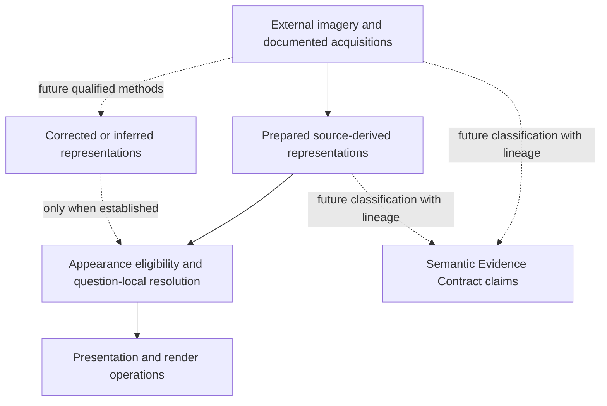

# Retained Riffelhorn appearance identity, provenance and qualified resolution

2026-10-06. Starting checkpoint **944326b**, “Prove retained Tryfan WorldCover native raster queries”. Clean `main`, `origin/main` upstream, fetched origin and **0/0 divergence**; no newer commits or unrelated work required reconciliation. This assessment is the current follow-up in the [canonical 42-thread register](atlas-research-state.md). Earlier reports retain their checkpoint conclusions.

## 1. Executive result

**C — SUCCESS.** Retained source-derived appearance fits the synthesized world model without changing frozen contracts, terrain machinery or production. Shared source/product/representation and provenance responsibilities, supplemented by a **small appearance-specific eligibility policy**, are sufficient for these cases. This is resolution conclusion **B**, not evidence for a full AppearanceHierarchy runtime.

A finite read-only [scenario evaluator](../../scripts/atlas/appearance-assessment/assess.py), [results](riffelhorn-appearance-assessment-results.json) and [validation](riffelhorn-appearance-assessment-validation.json) demonstrate that source-derived RGB can be available while illumination-independent appearance, exact acquisition geometry and current-state assertions remain unsupported. Source illumination remains in the imagery. This closes this integration assessment, **not the appearance science programme**.

## 2. Purpose and scope

The question is whether Atlas can identify, qualify and resolve appearance without confusing observations, upstream processing, Meridian preparation, physical inference and rendering. The assessment exercises retained manifests and support, not image quality or algorithms. It neither acquires data nor reads RGB values for a new analysis. Five existing delivery alpha samples are inspected; existing scientific diagnostics are cited unchanged.

The [world-model synthesis](atlas-world-model-architecture-synthesis.md), [lifecycle assessment](atlas-derived-understanding-lifecycle.md), [storage requirements](atlas-storage-processing-serving-requirements.md), [persistent Tryfan proof](tryfan-local-persistent-proof.md) and [WorldCover proof](tryfan-worldcover-binding-proof.md) supply architecture, not a universal imagery resolver. The historical appearance proposal is evaluated against those later foundations. No new schema, frozen contract, persistence experiment, service or production dependency is introduced.

## 3. Retained appearance evidence

| Evidence | Identity / retained support | What it actually establishes |
| --- | --- | --- |
| Production MapTiler | `maptiler-satellite-v2`; retained [TileJSON receipt](../atlas/appearance-baseline-metadata.json), checked 2026-10-05T22:09:04.917Z | A mutable heterogeneous display service, documented advertised bounds/z0–22. Local acquisition, sensor, contributors and information scale are unknown. This assessment makes no live service request. |
| 2023 SWISSIMAGE | Four EPSG:2056 DOP10 RGB orthophotos; bounds `[2624000,1091000,2626000,1093000]`, 4 km² | Already orthorectified/processed upstream. Distributed 0.1 m grid, nominal Alpine information 0.25 m. Exact pixel acquisition time, sensor/view/Sun geometry and radiometric calibration are unknown. |
| Meridian prepared SWISSIMAGE | `riffelhorn-swissimage-baseline-v1`, revision `v1`; immutable identity below | EPSG:3857 horizontal preparation and coherent regional parents, retaining source-derived colour. No correction or physical recovery. |
| Swiss terrain | Existing [regional hierarchy](../atlas/terrain-hierarchy-contract.md) and geometry references in the [SWISSIMAGE baseline](../atlas/swissimage-source-derived-baseline.md) | Heightfield/projection context for retained stretch diagnostics and draping; not known upstream orthorectification geometry. |
| Swiss 2026 benchmark | [Frozen frame benchmark](../atlas/swiss-multiview-benchmark.md), separate alpine location | Camera/calibration/time metadata, no acquired aerial pixels. Future compatibility case only; pixels remain **PARKED**. |

The authoritative [SWISSIMAGE report/receipt](../atlas/swissimage-source-derived-baseline.md) and [data catalogue](../atlas/riffelhorn-data-catalog.json) identify the source and methods. External data are referenced, not copied into Git:

- Source root: `meridian-data/sources/atlas/riffelhorn/swisstopo-2021-2024/originals/swissimage-dop10/`.
- Prepared root: `meridian-data/derived/atlas/riffelhorn/riffelhorn-swissimage-baseline-v1/`.
- Product identity: `f6edd630206ed02f255176935d72126cbc6ad7987b12d2986edbe6d05619bc1b`.
- Manifest SHA256: `3c8b50fb9d7721b678abc46b9450495b417ccafff15d4ee8a67d9d6a3fee4934`.
- Recipe SHA256: `d917612512380cb6940c103fe679d3af9acc0390a5a0681deb6e4fdda2667cf7`.

**Measured here:** four source files, **186,259,028 bytes**, and 1,084 prepared payload files, **1,564,233,043 bytes**, all SHA256s match retained records. Prepared payloads comprise 542 PNG delivery tiles (269,852,875 bytes) and 542 unencoded NPZ working fields (1,294,380,168 bytes). No rebuild was necessary. The parked benchmark's 112 retained input files, 19,357,606 bytes, also match their frozen hashes; no aerial pixels were added. These are local retained sizes, not production costs or latency promises.

## 4. Appearance concept taxonomy

These are responsibilities and processing qualifications, not five mutually exclusive source enums:

| Concept | Evidence and meaning |
| --- | --- |
| External supplied observation / information | Preserve what was supplied. A raw frame is different from an externally processed orthophoto or mosaic. SWISSIMAGE belongs to the latter; “source” does not mean raw detector radiance. |
| Source-derived prepared appearance | Meridian reprojection, colour-transfer assumption, downsampling and delivery preparation. Does not assert illumination removal or material identity. This product exists. |
| Corrected appearance | Future method-qualified alteration of radiometry/projection/illumination. A correction can remain source-derived; its interpretation must be declared. No such retained regional product is established here. |
| Inferred/recovered physical appearance | An independently qualified estimate of a physical property. Requires a property definition, method, dependencies and validated limitations. Ordinary RGB is not albedo or reflectance. No such estimate exists here. |
| Render-only appearance | Drape, lighting, shadow, colour/display transformation and compositing. Produces presented pixels; does not revise source evidence or physical claims. |

The [appearance proposal](../atlas/appearance-baseline-and-architecture.md#proposed-appearance-declarations--research-hypotheses--directions) already separates origin, processing and representation. A future corrected image need not be forcibly recategorized as wholly synthetic; processing lineage and intended physical interpretation carry the distinction.

## 5. Identity model

| Identity responsibility | Reuse or qualification |
| --- | --- |
| Source / source revision | Reuse authority/product-source identity. SWISSIMAGE retains its 2023 family and four delivered asset hashes. MapTiler retains service identity and dated metadata receipt; receipt hash does not pin historical imagery pixels. |
| Asset | Path/reference, footprint, bytes, checksum and source relationship. A TIFF asset is not an acquisition event; known asset footprint does not identify every contributing raw exposure. |
| Acquisition / observation | Separate source-scoped identifier and time/geometry when documented. For 2023 keep unknown contributing-exposure identity; a plausible ADS strip is not a verified linkage. |
| Product / processing revision | Reuse immutable product identity, recipe/software/method revisions and inputs. Corrections or changed preparation produce new revisioned products, not rewritten sources. |
| Representation / level | Product revision plus form, delivery grid and level; z12–18 are one coherent prepared family. A level does not imply a distinct physical property or observation. |
| Regional family | A preparation/continuity grouping with shared source assumptions, parents and support. Not a global preferred-source rank or physical object. |
| Future corrected/inferred result | Independent method-qualified identity, physical property where applicable, exact dependencies and interpretation. Coexists with its source and source-derived product. |
| Rendering configuration / materialized tile | Referenced execution/display configuration and artifact checksum/address. Neither identifies the physical surface nor silently revises appearance evidence. |

Shared identity machinery is adequate. Appearance-specific metadata concerns contributor/acquisition qualification, processing class, colour meaning and information/visibility limitations. **No second universal provenance system is needed.** The finite harness reads existing identities; it does not invent physical identities for tile addresses or UI labels.

## 6. Provenance model

A result must traverse **delivered artifact → representation/level → prepared product revision/process → source assets/revisions → documented acquisition qualifications and rights**. Preparation is horizontal EPSG:2056→3857, area averaging of assumed-sRGB decoded linear-light premultiplied RGB/validity, one thread, with recursive 2×2 parents. No terrain geometry was used in this Meridian preparation. Upstream orthorectification geometry revision remains unknown.

The receipt returns source metadata, product identity, recipe hash, acquisition unknowns, lineage and rights rather than confidence. Assumed sRGB is a preparation assumption, not calibrated surface reflectance. Reproducibility is supported for this prepared revision by retained hashes and the earlier independent full rebuild; no promise is made to reproduce undocumented upstream mosaic processing or historical mutable MapTiler pixels.

## 7. Qualified-resolution semantics

A query specifies place/support and **purpose**; sample budget, pinned source or temporal requirement are added only when needed. Resolution filters by support, requested information/processing class, temporal assertion and permitted use, then applies a declared purpose-specific preference. A later implementation must distinguish eligibility, selection, availability and delivery authorization.

For the regional source-derived query, prefer SWISSIMAGE because it has pinned retained assets/product/recipe, known supported area and documented source-information scale. This is a **provenance/representation fitness decision**, not superior truth, currentness or physical colour. MapTiler remains a conditional display-service candidate outside regional support or for service-display use; it cannot answer a request for those same regional guarantees.

The finite evaluator implements only this matrix. Its level rule is “coarsest retained level with ground sampling no larger than the declared delivery budget”, capped at finest available. This policy exercises sampling metadata; it is **not** a screen-space algorithm, information-quality ranking or generic hierarchy. Impossible finer information remains qualified as resampling. Physical estimates, geometry and current-state queries have separate honest outcomes.



This coordinates domain responsibilities inside the world model. TerrainHierarchy does not select imagery. Semantic Evidence Contract v1 is not a raster decoder or imagery-product catalogue.

## 8. Spatial-support semantics

Native support is the four-tile LV95 rectangle; prepared support is EPSG:3857 XYZ512 RGBA. Query bounds are intersected in EPSG:2056; delivery lookup explicitly transforms a point with `always_xy` to EPSG:3857, then XYZ pixel coordinates. Interior point membership uses half-open bounds. A CRS roundtrip is tested below 0.01 m; this does not validate physical image/terrain registration.

Boundary probe `[2623990,1091990,2624010,1092010]` is a declared 20×20 m support query, not a new benchmark. Only its eastern half `[2624000,1091990,2624010,1092010]` is inside. Return **partial-regional**, keeping the outside unresolved or conditional service-display. Rectangle overlap is geometric support, not physical visibility or confidence.

Measured alpha at ordinary/steep points and the ordinary z12 parent is 1.0. At `[2624000,1092000]` the z18 sample is 1.0; 10 m west it is 0.0 **inside the same delivered tile**. Tile existence is therefore insufficient support evidence. Partial edge samples represent averaged area support. Alpha is not cloud/shadow/snow masking, quality or confidence; valid black remains valid. Parent averages do not observe unsupported ground.

## 9. Scale and information semantics

| Quantity | Retained meaning |
| --- | --- |
| Source grid | 0.1 m distributed LV95 grid; not independent Alpine 10 cm observations. |
| Nominal information | 0.25 m Alpine source information; not a local accuracy bound. |
| Prepared sampling | Riffelhorn z12…18 approximately 13.2794, 6.6397, 3.3199, 1.6599, 0.8300, 0.4150, 0.2075 m. |
| Display sampling | Device/camera/projection sampling and overzoom; no additional evidence. |
| Tangent-surface sampling | Physical slope/projection-dependent; potentially much poorer than horizontal spacing. Does not establish source visibility. |

Scenario A's 1 m delivery budget selects z16. B's 0.25 m selects z18 but still states 0.25 m nominal information and no new information from finer delivery. A 14 m parent budget selects z12 within the **same product**. Parents avoid unnecessary family handoff but are coarser prepared evidence, not new acquisitions. The [closed multiscale conclusions](../atlas/information-aware-display-selection.md) remain unchanged.

## 10. Temporal semantics

The documented **mosaic year is 2023**. Catalogue `2023-01-01T00:00:00Z` is a nominal year representation, **not** a January 1 flight. Pixel timestamps, contributing exposures and within-year temporal mixture remain unknown. Catalogue created/updated fields and 2026 retrieval receipts are publication/catalogue/retrieval times, not acquisition. The generation receipt records elapsed preparation duration, not a scientifically established acquisition date or retained exact preparation instant.

An answer is “representation of this retained 2023 mosaic”, not “current appearance”. The current-state scenario returns unsupported. New observations coexist with prior revisions; correcting an old observation differs from new physical state. Future repeated observations need individual temporal support, not one location-wide date. MapTiler's metadata check time establishes its receipt, not pixel currency.

## 11. Ordinary Riffelhorn scenario

**A:** ordinary frozen centre `[2625240,1092530]`, EPSG:2056; original diagnostic patch 60 m square. A point source-derived request with 1 m delivery budget selects **z16**, about 0.8300 m prepared sampling. Return exact product/recipe/source references, support, 2023 mosaic qualification, unknown acquisition geometry/Sun/calibration, preparation lineage and attribution.

The corresponding source asset footprint is `swissimage-dop10_2023_2625-1092_0.1_2056.tif`; preserve its recorded SHA256 through source metadata. Footprint membership does not establish raw-frame identity or sensor exposure. Availability is verified locally, rights are retained prior-review facts, and no confidence or current physical colour is returned.

## 12. Steep-patch scenario

**B:** steep centre `[2624805,1092330]`, original 60 m square. The same product remains eligible at z18. Full delivery alpha does not remove its limitation.

**Retained measurement**, not new analysis: whole-patch physical surface-area stretch median **1.3903**, p95 **6.1923**; nominal 0.25 m tangent footprint median **0.3476 m**, p95 **1.5481 m**. About 27.07% exceeds 2× stretch and 6.83% exceeds 5×. This is the baseline's whole 60 m patch, not a differently selected first-visible subset from 012G, and not renderer-exaggerated geometry.

The prior baseline found source darkness and its transfer to Atlas; it did not establish dominant local renderer black-crushing or actual original occlusion. Return **projection/stretch limitation, unknown view geometry/visibility and potentially incomplete physical information**, not per-pixel confidence. Higher-resolution orthophoto delivery supplies no missing viewing directions.

## 13. Regional/global coexistence

**C:** `[2623900,1092000]` is outside regional support. A pinned regional request returns outside-support. A display request returns **conditional-display-service** with MapTiler candidate, unknown live availability and non-equivalent provenance. No service request or fallback pixel download occurs.

Regional and common products coexist with purpose-scoped preference and explicit handoff. Pinned provenance cannot transfer silently from a mutable common service. Service display cannot infer a year/sensor from its regional neighbour. No global quality score, seam reconciliation or colour blending is justified. The boundary query retains only its supported portion; mosaic continuity is separate science/engineering.

## 14. Unsupported physical-appearance scenario

**D:** illumination-independent physical appearance at the ordinary point returns **unsupported**, with `ordinaryRGBSubstituted=false`. No corrected/reflectance-like product is retained. Corrected-appearance requests also fail honestly. This differs from infrastructure-unavailable, outside-support and physical absence.

Future physical appearance needs a quantity/interpretation, method/revision, inputs and validated limitations. Reduced illumination variation is not itself true reflectance or albedo recovery. Addressable RGB cannot satisfy this stronger request.

## 15. Acquisition-geometry unknowns

**E:** return mosaic year and unknown pixel timestamp, sensor, view geometry, Sun, calibration and upstream orthorectification geometry revision. The [2023 feasibility review](../atlas/riffelhorn-observation-support.md) found plausible ADS strip `20230907_1035_12504` coverage; it did **not** verify the exact mosaic contributor. The separate August monitoring acquisition is not equivalent. Public footprints do not provide per-line pose/calibration for ADS pushbroom observations; time-like names do not establish UTC.

No unrelated 2026 frame geometry is substituted. Rich Swiss metadata belonging to another place/time cannot fill these local unknowns.

## 16. Illumination and shadow boundary

Source RGB carries acquisition illumination, terrain self-/cast-shadow effects, atmosphere/sensor/mosaic transfer and surface contributions. Retained evidence does not independently separate their quantitative causes. Dark signal can remain supported while information is reduced; no mask establishes all deep-shadow recoverability.

A future correction needs exact source references, adequately qualified acquisition time/Sun/view and radiometry, terrain revision with **actual input-use scope** (including horizon/shadow neighbourhood if used), method/software revision, parameters and limitations. Some inputs are unknown here. Preserve missing context rather than estimate it from appearance in this assessment. A correction cannot guarantee recovery of unseen or lost-signal surfaces.

A6 illumination reconstruction remains partial/locally parked; A7 physical topographic correction remains untested. The rejected gain control was not physical correction. A8 normalization/mosaic reconciliation, A9 illumination-independent recovery and A10 BRDF remain advanced/unresolved. Architecture can host future outputs without supplying the science.

## 17. Renderer boundary

Production remains MapTiler `satellite-v2`, IGOR suppressed in satellite mode, exaggeration **1.45**, analytical AWS z15 independent. Optional overlay/compositing and display transfer are presentation. The [appearance audit](../atlas/appearance-baseline-and-architecture.md#current-production-appearance-audit--meridian-evidence) records linear raster filtering and no application colour-correction stage. No settings changed.

Future controlled lighting/cast shadows would reference geometry, illumination and display configuration separately from shadows in source imagery. Lighting source-shaded RGB can double-count illumination; do not assume successful de-lighting. Provenance survives display transforms. Rendered artifacts can reference imagery and render configuration without becoming physical knowledge. A11 physical lighting remains partial/advanced; Atlas black-crushing was not established by the separate Unreal 012G conversion problem.

## 18. Geometry dependency

Three relationships remain distinct:

1. Upstream orthorectification used geometry, exact revision unknown.
2. This pyramid used horizontal reprojection with **no Meridian terrain input**. Changing Swiss DTM does not retrospectively revise source observations or its horizontal recipe.
3. Draping uses render geometry; future correction, visibility estimation or reprojection may consume exact analytical/render geometry and neighbourhoods.

Under [lifecycle rules](atlas-derived-understanding-lifecycle.md), changes affect only dependent products/claims and used scopes under applicable policy. A new correction/display artifact does not invalidate a historical observation. No geometry-triggered scheduler or recomputation is implemented.

## 19. Semantic-evidence relationship

Orthophotos are separately referenceable evidence/representations, not rock/material/vegetation claims. A future classifier may emit [Contract v1](../atlas/semantic-evidence-contract.md) claims with classification/derived mode, exact source/process lineage, support/time, mapping, quality and gaps. Corrected RGB is likewise not automatically material knowledge.

V1 already accommodates future derived physical estimates. It is not extended to embed imagery tiles/camera calibration. Appearance and optional claims cooperate through references. No classifier, inference, parallel claim model or ontology is added.

## 20. Future multiview compatibility

**F is conceptual, not a pixel proof.** Frozen benchmark `ch-frame2026-lv95-2713830-1206710-v1` is a separate 60 m LV95 patch `[2713800,1206680,2713860,1206740]`. Frames `20260813_004_082750_001_41216` and `20260813_004_082750_009_41216` have retained times 08:28:22/08:28:32 UTC and calibration/pose references. Pixel delivery/cost/rights remain prerequisites; **A13 Swiss frame pixels remain PARKED**.

Future frames retain individual source asset/revision, pose/calibration convention, time and observation support. A selected/fused product references observations, method/revision, geometry and used support; frames, orthophoto and derived representations coexist. Contribution weights are not confidence or physical visibility. Delivered composite-camera models are not interchangeable with physical camera-head calibration.

Pushbroom geometry requires potentially time-dependent trajectory/per-line rays, not a single frame pose. Observation geometry remains domain-specific metadata referenced from shared provenance. No final camera schema, fusion product or visibility truth is declared. Incidence/line-of-sight diagnostics do not establish pixel information gain, and no Sun reconstruction occurs here.

## 21. Persistence and storage implications

The five [storage responsibilities](atlas-storage-processing-serving-requirements.md#7-storage-responsibilities-and-conceptual-tiers) remain valid: archive, prepared representations, qualified knowledge/provenance, derived/materialized results, disposable serving/cache. Persist registration/assets/hashes, support/grain, acquisition unknowns, processing/representation revisions, rights and documented geometry references. Keep payloads externally referenced; tiles/caches do not define semantic identity.

Future geometry belongs to individual observations, not necessarily an orthophoto grid. Coherent publication must bind manifest to assets/preparation. Missing/corrupt assets mean infrastructure-unavailable, not absent physical surface. The evaluator fails visibly on mismatched hashes/identity rather than resolving corrupt metadata.

The [persistent proof](tryfan-local-persistent-proof.md) already tests exact-reference/roundtrip/publication principles. Adding imagery to that store would repeat mechanics without new semantic evidence. **No persistence changes** are made. Deterministic scenario serialization/re-execution tests this receipt; payload persistence/restart is not newly proven.

## 22. Rights implications

The retained swisstopo OGD gate permits selected material's research processing/redistribution with **©swisstopo** and retained terms/reference. Preparation preserves obligations. This is not a refreshed licensing survey.

MapTiler display/temporary personal or end-user caching differs from bulk capture/proxying/public redistribution requiring separate agreement in the prior review. A known representation can be **ineligible for a requested delivery/export use**. Rights eligibility precedes serving. Openness of 2026 metadata does not confirm ordered pixels' terms. No access-control system or new clearance is implied.

## 23. Gap assessment

| Status | Established or remaining |
| --- | --- |
| Architecturally representable, retained metadata exercised | Processed imagery vs prepared product, immutable identities, exact asset/recipe references, spatial support/parents, information/delivery scale, partial time, acquisition unknowns, rights, unsupported physical requests, service-vs-regional provenance. |
| Retained projection limitation | Steep stretch, poor tangent sampling, source darkness. Alpha/addressability do not prove visibility or confidence. |
| Scientifically unresolved | A3/A4 actual visibility/difficult surfaces; A6 exact 2023 contributor/Sun/geometry; A7 correction; A8 radiometric/mosaic consistency; A9 recovery; A10 BRDF; A11 lighting/shadows; A13 pixel multiview gain; A14 texture/fusion; A15 registration/temporal contributors. |
| Engineering, not new foundational science | General catalogue/resolver, rights-aware delivery, provenance inspection, prepared publication acceptance and production integration. None implemented or authorized by success. |

All **42 register status columns remain unchanged**. A2/A15 gain this integration result without closing wider architecture/registration questions. Terrain/multiscale/physical-surface foundations remain closed. An architectural slot for a future output does not establish its science.

## 24. Architecture consequence

**Resolution conclusion B:** generic machinery plus a small appearance-specific eligibility policy. Appearance needs processing/physical-meaning eligibility, acquisition/colour qualification, support/information/visibility distinctions and purpose-specific preference. Source IDs alone do not supply these, so A is insufficient. One retained coherent family plus conditional display service does not demonstrate a need for an independent AppearanceHierarchy analogous to terrain's numerical source/support machinery, so C would overreach.

Reuse identity, revision, provenance, support/time/rights, preparation and lineage. Clarify appearance eligibility/unknowns; retain observation geometry, colour-processing and rendering as domain-specific. Defer general handoffs, contributor reconciliation, view selection and inferred-property science. The older proposal remains historical direction, not a frozen runtime contract. No contradiction in Contract v1 or TerrainHierarchy was found.

## 25. Decision and validation

**C — SUCCESS**, at the **metadata/scenario assessment** level. A–E are exercised against retained manifests; F is conceptually compatible with separately verified metadata, not empirical multiview capability. Success establishes source-derived imagery qualification, not true colour, corrected appearance, live availability, fusion or production readiness.

[Validation](riffelhorn-appearance-assessment-validation.json) covers 11 focused eligibility/support/time/identity tests, fresh-process deterministic reruns, retained source/prepared and parked metadata hashes, 64 frozen domain tests, isolated type checking, links/anchors, 42 status columns, prior scripts/research assets and all 43 historical Atlas/Earth Lab reports, seven frozen semantic hashes and 113 protected production hashes. No application build is appropriate for unchanged production/shared code.

```powershell
..\meridian-data\earth-lab\.venv\Scripts\python.exe scripts/atlas/appearance-assessment/assess.py
..\meridian-data\earth-lab\.venv\Scripts\python.exe scripts/atlas/appearance-assessment/test_assess.py
..\meridian-data\earth-lab\.venv\Scripts\python.exe scripts/atlas/appearance-assessment/validate.py
```

The evaluator verifies rather than rebuilds about 1.75 GB of source/prepared evidence. Logical identity excludes timings/serialization ordering. No network, mutation or acquisition path exists. Determinism does not imply scientific accuracy; alpha proves delivery support only. No imagery payloads or runtime stores enter Git.

## 26. Implications for Atlas maturity

Terrain, semantic raster, persistence and now basic appearance qualification compose without a universal world object or redesign. Atlas can retain photographed appearance and honest gaps while science progresses independently. This is bounded engineering/architecture maturity, **not completed appearance research** or production hierarchy/backend readiness.

Successful integration must not hide A6–A11. Exact Riffelhorn illumination remains limited by contributor/time/radiometry. Processing experiments need an identifiable physical question and adequate inputs. No mandatory synthesis blocker is invented. Production delivery, broader coverage and science gates remain separate work.

## 27. Exactly one next bounded task

**Recommend exactly one next bounded task: “Retained dated-observation illumination and shadow identifiability assessment.”** This is the **A6/A7** entry gate, using existing [dated Tryfan Sentinel evidence](../earth-lab/tryfan-005c-temporal-evidence.json) and [natural-colour radiometry work](../earth-lab/tryfan-010-observed-natural-colour.md), without acquisition. It is not another world-model/Tryfan integration proof or reopening of closed seasonal-colour work. Those observations have documented acquisition time/Sun metadata and scaled band semantics absent from the 2023 mosaic; atmospheric processing does not establish illumination independence.

Answer: **what illumination/shadow effects are distinguishable with those retained observations, and is one bounded physical topographic-correction experiment interpretable with their radiometry, terrain scale, time and signal?** Inspect existing metadata/diagnostics and targeted established approaches, without correction, shadow removal or albedo inference. Separate source transfer, terrain illumination, deep-shadow information, snow/phenology/material variation and visibility. Specify sufficient inputs/qualifications and restrained validation for an eventual single method, not a ladder of aesthetic variants.

Exit with adequate prerequisites for one separately authorized test, or **one precise missing prerequisite** and a reason not to run it. Riffelhorn local illumination reconstruction and A13 pixels stay parked. This is surviving optional appearance science now selected for attention, not a prerequisite to completed synthesis or universal reflectance recovery.

**This next task has not begun.** No correction, new dataset, classification, physical lighting, inference, Swiss frame acquisition, production Atlas/Weather/Traverse change or frozen-contract modification occurred.
