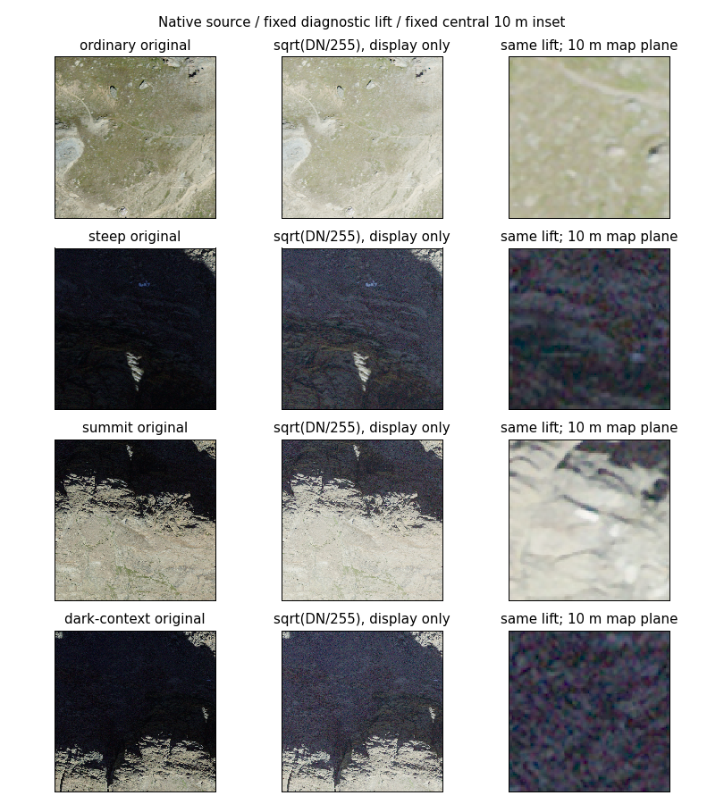
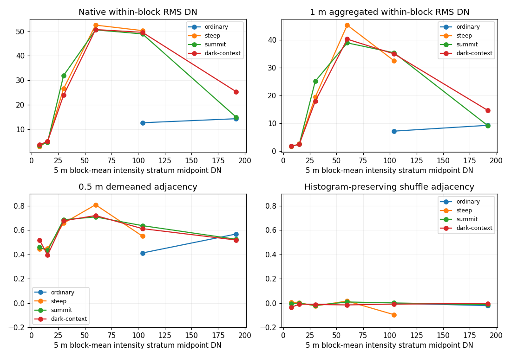

# Retained Riffelhorn dark-source signal and texture-support assessment

2026-10-07. Starting checkpoint **e276d814942b5e94adfa2353a95a10e78536b028**, clean main;
origin fetched, main/origin/main divergence **0/0**, no newer commit or discarded work.
[Canonical programme](atlas-research-state.md) / [research map](atlas-research-map.md).
[Predeclared plan](../../scripts/atlas/riffelhorn-dark-source/assessment-plan.json),
[reader/diagnostics](../../scripts/atlas/riffelhorn-dark-source/assess.py),
[metrics](riffelhorn-dark-source-signal-results.json), [validation](riffelhorn-dark-source-signal-validation.json).
Evidence labels: **M** measured here/retained Meridian result; **E** documented source or established method;
**I** interpretation; **Q** unresolved question. Computational reproduction is not source accuracy.

## 1. Executive result

**B - PARTIAL RETAINED SIGNAL.** Relevant dark source regions preserve spatially coherent recorded
variation at 0.5-1 m map-plane scales. They are not uniformly empty or black-clipped. However,
low dynamic range, JPEG-phase structure, fine colour mottling and projection/support limitations
prevent interpreting all variation as useful physical surface detail. The darkest pixels (intensity
below 5) have no complete 5 m block in that mean-intensity stratum; their coherent texture support
remains indeterminate, rather than automatically absent. (M/I)

Further appearance research is **partially justified**: visibility of already recorded structure can
be tested within qualified source-value ranges. Physical illumination normalization, shadow recovery,
albedo and relighting are not justified by these diagnostics alone. No corrected product was made.

## 2. Research question

How does encoded signal/texture support change as source intensity decreases? Distinguish recorded
image structure from unknown sensor/processing noise and compression, and record the boundary for
future processing. This is not an inverse-illumination experiment. The [identifiability assessment](illumination-identifiability.md)
left pixel contributors, actual Sun vectors, calibrated radiometry and shadow causes unknown.
The [registration assessment](riffelhorn-registration-epoch.md) left steep/dark physical correspondence
unbounded. Those conclusions still apply.

## 3. Retained imagery

Only the frozen four-tile 2023 SWISSIMAGE selection, **4 km2 / 186,259,028 bytes**. All four original
hashes are verified against the [catalogue](../atlas/riffelhorn-data-catalog.json) and recorded with
full relative external paths in the metrics. Native source tiles are read directly, with no new
acquisition, reprojection, resampling or mutation. Two tiles supply these patches; all four are
verified to preserve selection identity. No screenshot, hosted MapTiler pixel or synthetic image
is an analysis input.

The retained [source-derived baseline](../atlas/swissimage-source-derived-baseline.md) remains
product `riffelhorn-swissimage-baseline-v1`, revision v1, identity
`f6edd630206ed02f255176935d72126cbc6ad7987b12d2986edbe6d05619bc1b`.
Its external manifest SHA256 is `3c8b50fb9d7721b678abc46b9450495b417ccafff15d4ee8a67d9d6a3fee4934`.

## 4. Source/prepared encoding semantics

**M:** every source is 10000 x 10000, three uint8 RGB channels, EPSG:2056/LV95, 0.1 m Area grid,
no declared nodata. Actual TIFF image-structure tags say COG, YCbCr JPEG, quality 95,
pixel interleave, 256 x 256 storage blocks. Raster I/O decodes those retained compressed values;
it does not recover pre-JPEG values or raw exposures.

**E:** [swisstopo product documentation](https://www.swisstopo.admin.ch/en/orthoimage-swissimage-10)
confirms RGB 3 x 8 bit/JPEG95 and nominal 25 cm Alpine information. The retained specification's
radiometric processing includes balancing/sharpening and conversion to eight-bit imagery;
see the [prior source audit](riffelhorn-registration-epoch.md#19-orthophoto-production-implications).
This is a processed orthophoto mosaic, **display-oriented RGB digital values**, not calibrated
radiance/reflectance. Delivered bit depth is not sensor-native bit depth. Exact pixel transfer,
exposure, contributor and original uncompressed signal are unavailable.

Meridian preparation uses assumed-sRGB decoding, premultiplied support-area averaging into
EPSG:3857, recursive linear-field parents and independently encoded RGB8 lossless PNG. The
[sRGB assumption/recipe](../../scripts/atlas/swissimage_baseline.py) is a resampling convention,
not radiometric calibration. There is no new lossy JPEG stage. Alpha means delivery support,
not confidence, illumination, visibility or a shadow mask.

## 5. Retained patches

All definitions are inherited unchanged from the [registration plan](../../scripts/atlas/riffelhorn-registration/plan.json)
and earlier baseline, not selected after looking at new results. Centres and square sides in LV95:

| Patch | Centre east / north m | Side m | Native pixels | Fixed 5 m blocks | Intensity p05 / median / p95 DN |
|---|---|---:|---:|---:|---|
| Ordinary | 2625240 / 1092530 | 60 | 360000 | 144 | 112.107 / 141.619 / 187.212 |
| Steep | 2624805 / 1092330 | 60 | 360000 | 144 | 5.932 / 14.231 / 27.315 |
| Summit | 2624810 / 1092252 | 150 | 2250000 | 900 | 7.994 / 141.559 / 184.555 |
| Dark-context | 2624740 / 1092318 | 150 | 2250000 | 900 | 6.932 / 17.148 / 163.040 |

All support is valid; black is retained as data. Patches overlap, so their 5.22 million window
samples are not 5.22 million distinct/independent observations. No extra control patch. Native
pixel windows and exact source asset references are in the metrics.

## 6. Darkness taxonomy

| Concept | What this assessment establishes |
|---|---|
| Low source value | Measured retained encoded intensity stratum |
| Display darkness | Original versus explicitly diagnostic transfer view; renderer unchanged |
| Predicted low incidence | Not calculated here; would require a qualified Sun/normal context |
| Predicted terrain cast shadow | Not calculated; requires horizon/LOS beyond local incidence |
| Observed physical source shadow | Not identified merely from dark RGB |

A low-valued region may include reflectance, sky illumination, exposure, processing or shadow
contributions. These are not labelled shadow/rock/material populations. (I)

## 7. Intensity proxy

`I = 0.2126 R + 0.7152 G + 0.0722 B`, decoded integer RGB8 values, range 0-255 DN.
This reuses the [earlier encoded proxy](illumination-identifiability.md#9-source-radiometry-assessment).
Weights sum to one. Applied to encoded RGB, this is **not linear photometric luminance**.
No channel linearization is used for source statistics; prepared-field transfer comparisons are
explicitly separate. Fixed half-open bins: [0,5), [5,10), [10,20), [20,40), [40,80), [80,128),
[128,256). Boundaries have no physical illumination meaning.

## 8. Bit-depth/quantization assessment

No tested source pixel has all three channels zero; no channel reaches 255. Any-channel zeros:
ordinary 6, steep 1362, summit 2749, dark-context 6508. This is encoded endpoint occupancy,
not proof of sensor clipping or physical absence. (M)

| Patch / native intensity bin | Pixels | Occupied R/G/B levels | R/G/B median DN |
|---|---:|---|---|
| Steep [0,5) | 7842 | 16 / 7 / 26 | 4 / 4 / 8 |
| Dark-context [0,5) | 29251 | 19 / 7 / 29 | 4 / 4 / 9 |
| Steep [5,10) | 79907 | 25 / 14 / 34 | 8 / 7 / 11 |
| Dark-context [5,10) | 314702 | 32 / 14 / 37 | 8 / 7 / 13 |
| Steep [10,20) | 206312 | 36 / 20 / 44 | 14 / 15 / 21 |
| Dark-context [10,20) | 1032327 | 41 / 22 / 49 | 14 / 14 / 22 |
| Ordinary [128,256) | 261009 | 125 / 112 / 159 | 156 / 154 / 134 |

The darkest green channel uses only seven levels over its whole bin; local effective range can
be smaller. A luminance bin does not restrict every channel to that interval. Delivered one-DN
channel spacing is known; source quantization/compression noise is not. Weighted intensity has
fractional DN steps, not an independent higher-bit measurement. No effective sensor bits or SNR.

## 9. Compression assessment

Audit absolute adjacent source-intensity differences by the **original source row/column index
modulo eight**, including both endpoints only if in fixed [0,20) or [80,256) populations. Storage
tile boundaries are 256 pixels; the eight-phase diagnostic targets recurring codec-scale patterns,
not a complete JPEG decoding/noise model. The [JPEG standard, T.81](https://www.w3.org/Graphics/JPEG/itu-t81.pdf) defines 8 x 8 DCT sample blocks; colour subsampling/previous transforms can complicate their footprint. No optimization or artefact removal.

In steep dark pixels, column phase zero mean difference is **1.966 DN**, other phases **1.648-1.735**;
rows **2.076** versus **1.831-1.923**. Dark-context columns **2.180** versus **1.873-1.960**;
rows **2.276** versus **2.004-2.086**. There is a recurring phase excess, consistent with lossy
block influence. Bright populations have different directional variation. Pair counts/each phase
are retained; texture alignment and prior resampling confound causal attribution. These differences
are not a compression-error magnitude or calibrated floor. A coherent image can contain artefacts.

## 10. Signal-support diagnostics

Native strata report counts, channel quantiles/occupancy/endpoints and RG/GB relationships.
Fixed nonoverlapping **5 m / 50 x 50 pixel blocks** are assigned by their *native block-mean*
intensity, then that same population is used at every diagnostic scale. No changing masks to
strengthen a result. Blocks can cross real edges or contain pixels outside their mean bin; they
are not pure material or uniformly dark supports. Whole block support avoids creating artificial
edges by zeroing pixels outside a stratum.

Within-block RMS contrast is standard deviation in DN (variance is its square), not useful signal
by definition. Modest deterministic mean aggregation at 0.1, 0.5, 1 and 2.5 m is a diagnostic;
no denoised appearance product is retained. Empty bins/constant-block correlations return null,
not zero/absent physical texture. Quantization is a known digital limitation; an unknown sensor/
processing floor prevents a physical above-noise test.

## 11. Texture-support diagnostics

For the 0.5 m grid within each 5 m block, subtract its mean. Combine horizontal/vertical adjacent
pairs and compute normalized dot product `sum(x*y)/sqrt(sum(x*x)*sum(y*y))`. This descriptive
adjacency coefficient is not a global stationarity assumption or formal inferential test. Repeat
at 1 m. A fixed-seed, independently shuffled **within-block** 0.5 m grid preserves its histogram,
contrast and mean while disrupting neighbourhoods. This comparator is not another source observation.

Forward differences on common interior locations define `J=sum([[gx*gx,gx*gy],[gx*gy,gy*gy]])`;
squared orientation coherence is `((Jxx-Jyy)^2+4Jxy^2)/(Jxx+Jyy)^2`.
[The established structure-tensor formulation](https://www.cs.cmu.edu/~sarsen/structureTensorTutorial/)
summarizes gradient orientation; it is not physical certainty. Here even shuffled forward differences
share samples and show bias. Consequently coherence alone **does not discriminate useful texture**:
dark [10,20) median coherence .143-.166 versus shuffled .239-.251. No post-hoc replacement metric
or threshold; this negative diagnostic is part of the result. Adjacent structure, scale persistence
and source views together provide the bounded support evidence.

## 12. Dark-versus-bright comparison

| Patch / 5 m mean bin | Blocks | Median RMS DN at 0.1 / 0.5 / 1 / 2.5 m | Median adjacency 0.5 m / shuffled / 1 m |
|---|---:|---|---|
| Steep [5,10) | 10 | 2.973 / 2.164 / 1.716 / .877 | .445 / .005 / .327 |
| Steep [10,20) | 123 | 4.984 / 3.576 / 2.673 / 1.177 | .448 / .002 / .274 |
| Dark-context [5,10) | 19 | 3.663 / 2.531 / 1.849 / 1.032 | .519 / -.036 / .371 |
| Dark-context [10,20) | 586 | 5.098 / 3.556 / 2.490 / 1.093 | .394 / -.010 / .222 |
| Summit [10,20) | 232 | 4.773 / 3.422 / 2.475 / 1.212 | .432 / -.002 / .274 |
| Ordinary [128,256) | 118 | 14.337 / 11.952 / 9.342 / 5.687 | .568 / -.022 / .411 |

**M:** low means retain multiple-DN variation after aggregation. Their adjacency is materially
above the shuffled comparator. This establishes encoded organization, not a sensor SNR or proof
of material detail. The full p05/median/p95 distributions are in the metrics; some dark blocks
have low/negative 1 m adjacency. No 5 m mean block is in [0,5), despite individual pixels there.

**I:** lower dark contrast versus ordinary is not a causal estimate of illumination loss: materials,
projection and processing differ. Within-patch strata reduce geographic confounding but do not
control it. Very high contrast in middle bins often includes bright/dark boundaries; it must not
be advertised as rich uniformly dark surface texture. Counts are descriptive, not independent
samples or fractions of physical surface cover.

## 13. Controlled diagnostic lifting

Left: native RGB. Centre: identical patch after **channel-wise sqrt(DN/255)**, fixed for all four
patches, no independent auto-contrast. Right: the predeclared central 10 m inset with the same
transfer. Original bytes remain untouched. Full-patch panels are reduced for a compact figure;
the fixed inset uses nearest display of source samples. No crop was chosen to favour visible detail.

**I, bounded visual inspection:** large rock-like boundaries/striations remain encoded in the dark
context/steep windows; diagnostic lifting makes some existing variation easier to inspect but also
amplifies colour mottling/block-like variation. The summit centre is bright, as the fixed rule
requires; it was not moved to a dark feature. Surface identity is not inferred. The image is a
diagnostic view, **not corrected imagery or evidence that lifting recovered anything**.

## 14. Spatial coherence

Dark 0.5 m adjacency medians .394-.519 for relevant [5,20) block populations contrast with shuffled
medians close to zero. That supports organized source variation beyond individual pixels. It does
not identify which parts are physical surface information versus spatially correlated processing.
Gradient RMS in [10,20) has medians **3.599 DN steep / 3.846 dark-context / 3.589 summit**, measured
per 0.5 m sample difference, not per metre or surface-normal gradient. No edge detections are
converted into geographic feature claims. Spatially adjacent and overlapping blocks are dependent.

## 15. Multiscale behaviour

All four scales and fixed populations were recorded before statistics; plots share adjacency axes.
The 5 m block-mean assignment remains constant across aggregation. In steep [10,20), median
contrast retains about **54% at 1 m** and **24% at 2.5 m** relative to native RMS. Dark-context
retains **49% / 21%**, ordinary bright **65% / 40%**. These ratios compare medians, not per-block
retention fractions or information-theoretic content. Coherent metre-scale structure survives;
a substantial portion of fine-scale variation disappears. It is not all proven noise. No new
physical resolution is obtained by aggregation or by 0.1 m delivery oversampling.

## 16. Channel/spectral behaviour

Steep native [10,20) RG/GB correlations **.188/.412**; ordinary bright **.978/.965**. Dark-context
below 5 has RG **-.528**, GB **-.342**, with median RGB **4/4/9**. These are broad delivered RGB
channels, not calibrated spectral bands. Conditioning on a weighted sum itself induces negative
channel dependence; YCbCr/JPEG, balancing and illumination/material variation also matter. Thus
negative low-bin correlations are not a measured sensor noise spectrum or evidence of an impossible
material. Colour mottling is visible in fixed insets. There is no classifier, band-ratio material
inference, physical colour reconstruction or channel-specific correction.

## 17. Noise/artifact limitations

No raw sensor frames, calibrated noise variance, uncompressed source twin or exact mosaic transfer
are retained for these pixels. Consequently physical SNR and a separation of noise, codec residuals,
sharpening and true fine texture are **unidentifiable here**. Native eight-pixel phase excess,
very few low green levels and reduced contrast demonstrate constraints, not a complete floor.
Metre-scale adjacency exceeds a histogram shuffle, but compression/resampling can also introduce
coherence. Even strong positive adjacency cannot certify calibrated detail. Individual fine colour
speckles remain indeterminate. No filtering, denoising, superresolution or hidden-detail inference
has been performed as an appearance method.

## 18. Steep-terrain qualification

Inherited [observation-support benchmark](../atlas/riffelhorn-observation-support.md): p95 geometric
stretch **6.1923**, p95 slope **80.7066 degrees**, nominal 0.25 m source information tangent footprint
**1.5481 m**; **27.0694%** of tested geometry cells stretch greater than two. Those are the earlier
benchmark population, not re-estimated statistics for each intensity bin.

Recorded image texture is not evidence of 25 cm detail on the physical steep face. Tangent support
may be poorer and direction-dependent. Lack of fine detail cannot be attributed solely to darkness:
projection/source-view support also matters. This task does not reopen multiscale or elevation.

## 19. Registration qualification

[9dc4445](riffelhorn-registration-epoch.md#26-decision-abcd) remains **B - SCALE-CONDITIONAL
CONSISTENCY**. Coordinate/preparation checks do not establish true close physical registration.
Steep/dark proxy shifts were ambiguous; actual offsets, exact contributing pixel dates and
original orthorectification geometry are unknown. Thus image-space signal diagnostics are valid,
while associating a particular dark edge to an exact terrain element, normal or shadow blocker
remains unsupported. No imagery warp, terrain derivative calculation or new epoch attribution.

## 20. Source-versus-prepared preservation

All **1084** immutable prepared payload hashes/bytes verify. **14 intersecting z18 tiles** regenerate
in memory exactly from retained sources; their lossless PNGs equal the declared RGBA encoder.
This extends the [prior preparation checks](../atlas/swissimage-source-derived-baseline.md) over
all tile centres in the four patch supports, without rebuilding or modifying the full product.
Native and delivery grids are different; this is not source-point equality or an independent
measurement of source accuracy.

Compare continuous assumed-sRGB encoded DN from the *same prepared field* with its rounded RGB8
PNG, using only fully supported pixel centres transformed to LV95. Patch sample counts: ordinary
**83579**, steep **83575**, summit **522397**, dark-context **522392**. All alpha is effectively one
in these interior supports. In continuous intensity below 5: steep **945**, summit **2003**,
dark-context **2540** delivery samples, **none become all-RGB zero**. Mean rounding error there is
**.192/.193/.190 DN**; absolute errors in every tested population are below **.5 DN**, the weighted
channel rounding bound. This is the known final encoding quantization, not the unknown upstream
noise floor. The digital transfer preserves nonblack low values at tested centres.

Area averaging intentionally changes spatial variation; no native 0.1 m pixel equality or
preservation of every tiny feature is claimed. The fixed aggregations characterize scale effects,
not an estimate of this reprojection's exact loss. Prior opposed-close source/prepared/display
correlation **.9045** and dark-context **.9733** remain historical scoped results, not new renderer
measurements. Dominant Atlas black-crushing remains unestablished. No renderer was exercised here.

## 21. Information-support classification

These are descriptive findings for the tested product/support, **not a universal Atlas score**:

| Tested support | Class | Evidence and boundary |
|---|---|---|
| Ordinary bright [128,256) 5 m blocks | Clearly supported recorded image structure | Larger range, multiscale contrast/adjacency; not calibrated surface colour |
| Steep/dark [10,20) mean blocks | Supported at coarse image-space scales, weak for fine physical interpretation | Hundreds of blocks, positive 0.5-1 m organization; limited range, JPEG/mottling and projection |
| Steep/dark [5,10) mean blocks | Weakly supported | 10/19 blocks; organized variation remains but low amplitude and limited support |
| Native pixels below 5 | Indeterminate texture support | Seven green levels; channel endpoints; no whole 5 m block with mean below 5 |
| Fine colour speckles / codec-scale variation | Indeterminate physical information | Unknown noise/processing; phase excess and shuffle/tensor limits |

No complete tested patch is demonstrably information-free. Nor is every dark pixel established
useful. No lower-intensity block was searched elsewhere to fill the evidence gap. The deepest
range cannot be labelled information-poor solely because its coherent block sample is absent.

## 22. Physical-interpretation boundary

**Useful encoded spatial variation survives in portions of the dark source.** That is the strongest
supported claim. It does not establish actual shadow cause, calibrated radiance/reflectance,
material, true surface colour, albedo, a surface's appearance under another light or an observation
of hidden facets. Digital lifting reveals existing encoded values and artefacts together; it creates
no independent information. Preparation alpha is not confidence. Historical 2023 product evidence
is not current physical state. Unknown physical interpretation remains unknown.

## 23. Future-normalization consequence

**Partially justified as research**, not a currently justified physical correction: some low-valued
supports retain organized variation worth testing for visibility/preservation, but the deepest
range and fine texture remain limited/indeterminate. A future physically motivated normalization
still needs independently justified contributor/time/illumination/radiometry and geometry alignment.
Signal survival is necessary but insufficient. These inputs remain lacking for Riffelhorn.

Tryfan [1842008](tryfan-illumination-normalization.md) stays **D - INCONCLUSIVE**, a stopped eligibility
gate, not correction failure. [e276d81](tryfan-vegetation-protocol.md) stays **A - NOT JUSTIFIED** for
its three candidate populations and fixed holdouts, not evidence against normalization generally.
No method was fitted or justified anew. Recorded signal does not bypass either design gate.

## 24. Future-renderer consequence

A future **display-only** operation could make already recorded dark structure more legible while
also making mottling/codec effects more conspicuous. It must preserve source identity, remain a
render configuration, and be assessed separately from physical illumination compensation. Applying
Meridian lighting over lifted baked-in illumination could still double-light or conflict with source
shadows. It cannot reconstruct absent views/detail. IGOR suppression in satellite mode and current
MapLibre appearance are untouched. No physically correct relighting premise has been established.

## 25. Multiview consequence

The result weakens any blanket claim that extra observations are necessary merely because the
orthophoto is dark. They may still be valuable for independent geometry/view/occlusion support,
different illumination and weakly supported low-value detail. No quantitative gain is established.
The [2026 two-frame benchmark](../atlas/swiss-multiview-benchmark.md) remains **PARKED** behind pixel
provisioning. Its known geometry is not substituted for 2023 contributors. No contact, purchase,
download, reconstruction or fusion.

## 26. Decision A/B/C/D

**B - PARTIAL RETAINED SIGNAL.** Evidence rejects uniformly empty dark imagery but does not establish
robust physical texture over every relevant dark/steep support. Meaningful metre-scale encoded
structure coexists with limited channel range and compression/processing ambiguity. A is too broad
for deepest/fine support; C ignores organized recorded variation; D alone would discard the
image-space conclusion that can be measured despite physical-noise ambiguity.

Existing appearance/source/product machinery remains sufficient. This receipt is a derived
image-space analysis with exact source windows, product/recipe, plan and method revisions; it is
not a physical claim per pixel or a new confidence contract. Future appearance processing should
reference actual input-use scopes, intensity proxy, exclusions and method, preserving source and
historical receipts. Display materialization does not change source semantic identity. These
support findings cannot grant unrestricted rights; retained swisstopo attribution/terms still apply.

The source hashes, prepared manifest/recipe, metadata and method hashes are in the metrics/validation.
[Focused tests](../../scripts/atlas/riffelhorn-dark-source/test_assess.py) cover fixed strata, black
support, constant/empty statistics, block partition, mean preservation, histogram shuffle, structured/
noise comparators and native phase origin. A fresh subprocess rerun verifies byte-identical JSON/figures.
Validation also preserves all prior Atlas/Earth Lab reports/tooling, all42 status columns, frozen
contracts and **113 protected production hashes**. No application tests are required by touched
production code: none was touched. No full lifted/corrected raster or duplicate source is tracked.

## 27. Exactly one next bounded task

**Retained Riffelhorn dark-detail display-transfer experiment.** This next task has not begun.

Return to A5's still-partial display/legibility boundary using these same frozen source supports:
predeclare a small set of fixed monotone display transfers and matched original controls, then test
whether visible already-recorded structure can be increased without unacceptable amplification of
codec-scale/mottled variation, colour distortion, clipping or loss of bright detail. Include [5,10),
[10,20) and bright controls; preserve below-5 as unsupported for equivalent block claims. Evaluate
source-value preservation and image-space legibility separately; no physically labelled shadow mask,
correction model, learned detail, terrain attribution, production renderer or general preference.

This is distinct from the earlier rejected low-frequency normalization/control: it tests a source-
referenced **render-only transfer**, with the newly measured codec/quantization limits as failure
checks, and must freeze its own protocol before output inspection. It cannot supply illumination-
independent appearance, authorize Riffelhorn topographic correction or close A6-A11/A14. It is the
smallest next use of the supported recorded signal while contributor/radiometric and fine physical
registration limits prevent stronger processing claims. Swiss multiview stays parked. No parallel
normalization, acquisition or production task is recommended.
