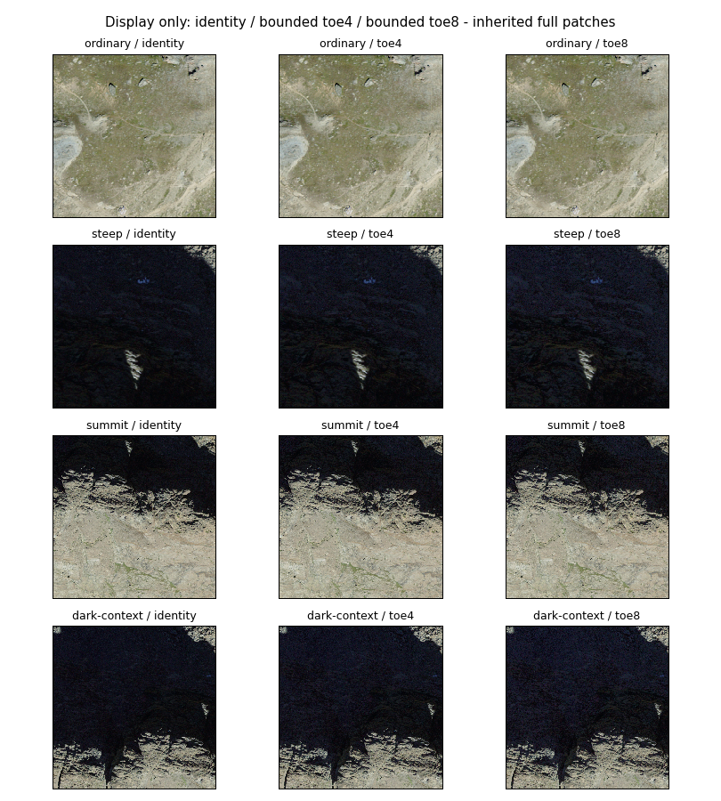
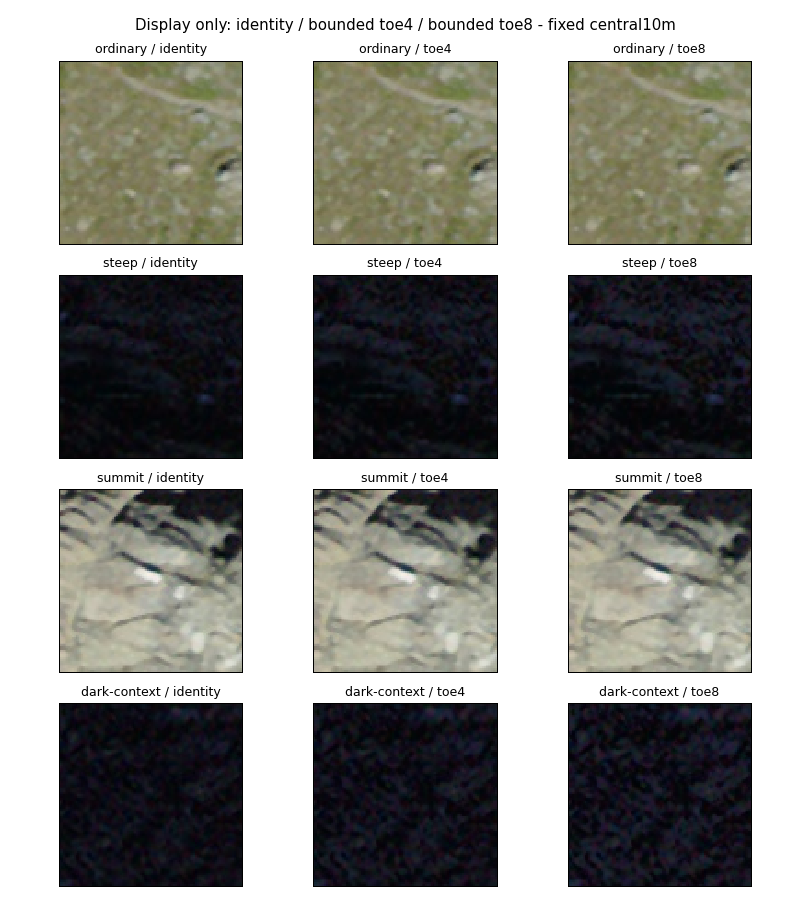
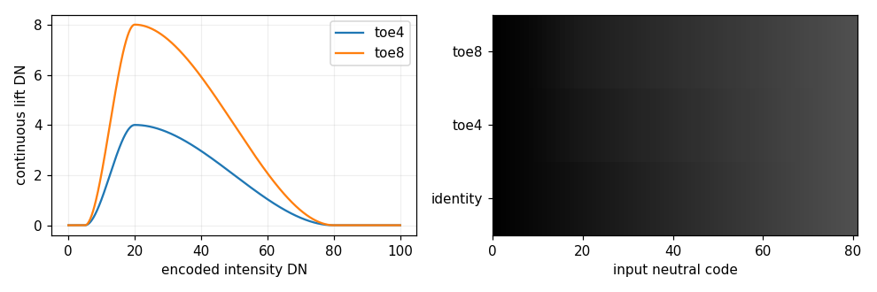

# Retained Riffelhorn dark-detail display-transfer experiment

2026-10-07. Started clean main at **20461af84b0619abc8b7b218aac9ef1e53de1fae**;
origin fetched, main/origin/main **0/0**, no newer work or discarded changes.
[Canonical programme](atlas-research-state.md) / [research map](atlas-research-map.md).
[Protocol](../../scripts/atlas/riffelhorn-display-transfer/protocol.json),
[implementation](../../scripts/atlas/riffelhorn-display-transfer/experiment.py),
[metrics](riffelhorn-display-transfer-results.json), [validation](riffelhorn-display-transfer-validation.json).
M = measured/retained Meridian evidence; E = established/source fact; I = interpretation; Q = open question.

## 1. Executive result

**B - PARTIAL. Production classification: research-only.** A weak bounded display toe increases
source-supported dark contrast while leaving intensity <=5 and >=80 anchored. Some dark striations
are slightly easier to inspect, but close views remain mottled and the overall readability gain is
modest. The stronger transfer fails the prospectively frozen codec-amplification limit. No candidate
is accepted as a generally preferable display or as justification for a production prototype. (M/I)

This is **only a display operation**. Source observations/prepared imagery are unchanged; no
illumination, shadow, physical colour or reflectance has been corrected or recovered.

## 2. Research question

Can a simple deterministic pointwise transfer improve legibility of already-recorded dark structure,
with bright/colour/artefact controls? Digital separability is measurable; human readability is assessed
only through bounded matched inspection, not a calibrated observer study. All parameters and criteria
were recorded before candidate outputs, including failure thresholds; no result-based tuning.

## 3. Prior dark-signal result

[20461af](riffelhorn-dark-source-signal.md) remains **B - PARTIAL RETAINED SIGNAL**: dark [5,20)
block populations have positive 0.5-1 m image-space adjacency, limited contrast and quantization/
codec limitations. Individual pixels below5 lack complete 5 m mean-bin support; their useful texture
is indeterminate. Source-shadow causes and calibrated noise statistics are unknown. The former
structure-tensor/shuffle diagnostic did not discriminate useful texture and is not promoted into
an acceptance criterion here. No source SNR or new information is claimed.

## 4. Representation boundary

| Responsibility | This experiment |
|---|---|
| Source observation/product | External processed 2023 orthophoto, immutable source identity |
| Prepared/source-derived appearance | Existing immutable regional pyramid, unchanged |
| Display transfer | Two exact global functions over decoded RGB8; transient views/output hashes |
| Corrected appearance | None created; no geometry/illumination correction |
| Inferred/recovered physical appearance | Unsupported; no albedo/intrinsic colour |
| Renderer lighting | None applied; independent physical/cartographic operation |

A display configuration revision does not replace source/product/appearance identity. Transformed
figure pixels are a materialization of that display context, not a new world-knowledge claim.
[Appearance taxonomy](riffelhorn-appearance-assessment.md) and frozen contracts remain sufficient.

## 5. Retained inputs

The same four 2023 SWISSIMAGE COGs, **186259028 bytes**, all original SHA256s verified against the
[catalogue](../atlas/riffelhorn-data-catalog.json). Original RGB8 values are decoded from YCbCr
JPEG95 at 0.1 m LV95 Area grid. No declared nodata; valid black is not missing support. Source RGB
is processed/display-oriented, not calibrated radiance/reflectance or sensor-native eight-bit data.
Nominal Alpine source information is 0.25 m, not the 0.1 m distributed sampling. (M/E)

Prepared product `riffelhorn-swissimage-baseline-v1`, v1, identity
`f6edd630206ed02f255176935d72126cbc6ad7987b12d2986edbe6d05619bc1b`, manifest SHA256
`3c8b50fb9d7721b678abc46b9450495b417ccafff15d4ee8a67d9d6a3fee4934`. All1084 payload hashes
verify. Its assumed-sRGB linear-field area resampling/PNG encoding is a preparation convention,
not calibration. The prior exact-field/encoding reconstruction is reused, not repeated as a benchmark.

## 6. Frozen patches

| Patch | LV95 centre east / north | Side m | Native cells / 5 m blocks |
|---|---|---:|---|
| Ordinary bright control | 2625240 / 1092530 | 60 | 360000 / 144 |
| Steep dark | 2624805 / 1092330 | 60 | 360000 / 144 |
| Summit mixed bright/dark | 2624810 / 1092252 | 150 | 2250000 / 900 |
| Dark-context | 2624740 / 1092318 | 150 | 2250000 / 900 |

Inherited from [20461af's fixed plan](../../scripts/atlas/riffelhorn-dark-source/assessment-plan.json).
No new patch/search or transfer-specific mask. Fixed centre 10 m insets accompany full views.
Overlaps and contiguous blocks mean counts are not independent observations. No terrain/camera
context is changed: this is image-space inspection, not a new 3D rendering test.

## 7. Existing display baseline

Source intensity is the previous encoded proxy `I=.2126R+.7152G+.0722B`, DN0-255, not linear luminance.
Source block-mean strata [0,5), [5,10), [10,20), [20,40), [40,80), [80,128), [128,256) remain fixed
through all candidate comparisons. Native baseline quantiles reproduce the prior record exactly.

| Patch | Native I p05 / median / p95 | Prepared z18 I p05 / median / p95 |
|---|---|---|
| Ordinary | 112.107 / 141.619 / 187.212 | 112.970 / 141.765 / 186.489 |
| Steep | 5.932 / 14.231 / 27.315 | 6.362 / 14.511 / 26.662 |
| Summit | 7.994 / 141.559 / 184.555 | 8.497 / 142.126 / 183.619 |
| Dark-context | 6.932 / 17.148 / 163.040 | 7.646 / 17.147 / 161.944 |

Grids/populations differ; these are distribution controls, not a measured per-pixel preparation loss.
Baseline tested native/prepared windows have no all-RGB-zero or channel255 pixels. Prior dark-block
RMS/adjacency and source/prepared/display correspondence remain the baseline evidence. Dominant
Atlas renderer black-crushing remains **unestablished**. Source itself has low values and codec
variation; preparation preserves variation at its declared grain, while ordinary display makes
some low contrast difficult to inspect. This experiment cannot apportion a physical cause.

[Production satellite configuration](../../src/atlas/map/satelliteLayer.ts) specifies opacity1,
linear resampling and180 ms fade, with no custom tone curve; provider is MapTiler satellite-v2 and
IGOR is suppressed in satellite mode. No production imagery pixel, live tile or screenshot is
acquired/modified. Identity RGB panels represent the retained display reference, not a fresh
measurement of MapLibre framebuffer/monitor transfer.

## 8. Candidate transfer families

Only **one simple global bounded monotone toe family, two strengths**, plus identity control.
The prior sqrt lift was diagnostic and does not protect deepest/bright values, so it is not adopted.
The old [012G low-frequency normalization](../earth-lab/riffelhorn-012g-projection-and-illumination.md#one-bounded-normalisation)
estimated a spatial field and was not accepted; it is not repeated. No gamma sweep, local tone
mapping, CLAHE, learned model or HDR reconstruction. This is a small Hermite tone-curve test;
[Khronos smoothstep](https://github.com/KhronosGroup/OpenGL-Refpages/blob/main/gl4/smoothstep.xml)
provides the established interpolation primitive, not a physical illumination model.

## 9. Global/local decision

**Global and pointwise.** The same encoded RGB maps identically everywhere. No neighbourhood,
terrain, class, local mean, location or camera affects the function. This prevents spatially
estimated gain fields/halos and preserves inspectable provenance. Source-supported detail and
artefacts both receive the transfer; the operator cannot distinguish them. No local adaptation.

## 10. Selected transfer definitions

For clamped `u`, `s(u)=u*u*(3-2*u)`:

```text
T(I) = I + A*s((I-5)/15)*(1-s((I-20)/60))
g = min(T(I)/I, 1.5, 255/max(R,G,B))
RGB_display = nearest-even-round(g * RGB_source)
```

Zero is anchored with g=1. **toe4: A=4 DN; toe8: A=8 DN.** The curve is C1 continuous,
monotone (dense-grid test and derivative bound), exactly identity for I<=5 and I>=80. Smooth
fade20-80 has minimum derivative .9/.8 respectively. Its gain multiplies all encoded channels;
255/maxRGB provides common gamut headroom. Rounding is an explicit RGB8 display-materialization
step, not source processing. Any output black/255 or hue loss is checked, not presumed safe.

## 11. Parameter-selection protocol

[Protocol](../../scripts/atlas/riffelhorn-display-transfer/protocol.json) SHA256
`90f4d2e00d7e11a02e2eff12a38b39e93f0d5bf378b08bb67ee9462d97b81de8`, written before candidate
outputs. Anchors5/20 use the prior weak/useful strata; fade80 protects bright controls. Two amplitudes
4/8 test modest versus stronger separation without adjusting crops, masks or coefficients.
Least amplitude passing **all numerical and matched visual checks** would be selected. Neither is
accepted through that full gate. No fitting or retrospective threshold alteration.

| Frozen criterion | Requirement |
|---|---|
| Dark legibility | Steep AND dark-context [10,20) blocks: median0.5m gradient gain>=1.15, median1m RMS gain>=1.10; more readable structures in both matched views, not only grain |
| Weak restraint | I<=5 exactly unchanged; source [5,10) gain p95<=1.25 |
| Quantization | Neutral adjacent RGB8 code jump<=2; no new visible contour bands |
| Codec | Phase0 mean adjacent DN gain<=1.35 in both axes/both dark patches; 1m/native contrast-gain ratio>=.9; no new dominant block/mottle pattern |
| Bright control | I>=80 unchanged; no new all-black/channel255 samples |
| Colour | Raw normalized channel-ratio error<=1e-12; rounded HSV hue p95<=5degrees and saturation abs p95<=.05 for source chroma>=4DN |
| Spatial/deterministic/runtime | Monotone pointwise/no neighbourhood; exact repeated RGB8/JSON/figures; constant per-sample arithmetic |

These are **prospective engineering/display tolerances**, not independently validated human
perception thresholds or calibrated artefact/noise limits. Passing numbers alone cannot establish
useful readability. Empty populations are unsupported, not automatically successful.

## 12. Deepest-dark protection

All tested source/prepared pixels with I<=5 are byte-identical before/after. No claim about their
texture is added. Weak [5,10) native gain p95 is about **1.098-1.099 toe4 / 1.197 toe8** in dark
patches, below 1.25. This preserves the deepest input range rather than spreading its few levels
widely. The maximum common gain is capped 1.5; protection does not identify physical shadow.

## 13. Quantization behaviour

Each neutral RGB8 input code maps deterministically to one output code. Both curves map all
256 ordered neutral input levels; adjacent output differences range0-2 (fade compression can merge
levels: toe4 has 252 occupied levels/four merged adjacent pairs, toe8 has 248/eight; no new source levels). The exact mapping is
reproducible from the formula/ramp figure. Two-code jumps expose larger digital separation; they
are not recovered precision. No new visible broad contour bands were established in fixed views,
but RGB quantization and colour mottling remain visible. No dithering or smoothing hides them.

## 14. Compression behaviour

Use original source-index eight-pixel phases and select pairs by **original** I<20 at both endpoints,
not candidate intensity. This retains the baseline population and cannot optimize away artefacts.

| Dark patch | toe4 phase0 rows / columns gain | toe8 rows / columns gain | Frozen max |
|---|---|---|---|
| Steep | 1.314 / 1.316 | 1.623 / 1.626 | 1.35 |
| Dark-context | 1.319 / 1.320 | 1.633 / 1.633 | 1.35 |

Toe8 **fails** this predeclared limit. Toe4 passes, but 32% increased phase differences are not zero
artefact amplification; the bound is a pragmatic tolerance. Colour speckle/block-like variation
becomes easier to see along with real recorded structure. The codec phase metric is a diagnostic
proxy, not proof every phase0 edge is a JPEG artefact or a calibrated noise floor. No compression
removal or signal-to-noise improvement.


## 15. Dark-detail legibility

Both candidates meet the digital dark-separability gates. Baseline assignments are fixed by the
original 5 m block mean in [10,20) DN; transformed values never reassign eligibility.

| Patch | toe4 median0.5 m gradient gain /1 m contrast gain | toe8 gain /gain |
|---|---|---|
| Steep | 1.253 /1.209 | 1.469 /1.424 |
| Dark-context | 1.219 /1.221 | 1.440 /1.450 |
| Summit (secondary) | 1.245 /1.260 | 1.503 /1.502 |

Native steep median intensity rises14.2314→17.0000→19.7942 DN; dark-context rises
17.1484→20.8612→24.5318 DN. These shifts do not imply increased source information.
Matched full/inset views show modestly easier dark striation/edge inspection with toe4.
However, dark-context texture remains mottled and the benefit is small at whole-patch scale.
Toe8 makes both structures and colourful grain more visible. The frozen qualitative requirement
of useful structure readability in BOTH patches, beyond grain promotion, is only partially
supported; a numerical pass is not promoted to a complete perceptual pass.

## 16. Texture preservation

The operator uses no neighbourhood, fitting or generated texture. Each identical RGB triplet
always maps to the same output. Metre-scale recorded variation remains, rather than gaining
contrast only at individual pixels: native contrast gains are1.215/1.238 for toe4 in steep/dark-context,
compared with1 m gains1.209/1.221. Toe8 native gains1.465/1.468 versus1 m1.424/1.450.
The coarse/native gain ratios exceed0.9, but this does not certify that all variation is physical
surface texture. Source JPEG, product processing and quantization still contribute.

The results include all predeclared0.1/0.5/1/2.5 m contrast strata and0.5 m adjacency, including
empty unsupported strata. The earlier assessment establishes coherence against shuffled controls;
this experiment tests visibility of that fixed signal, not a new texture catalogue. Rounding and
fade compression can merge codes; the transfer is not lossless nor an information recovery.

## 17. Bright-region preservation

Source/prepared I>=80 is byte-identical under both candidates in every patch. No new all-black
pixel or any-channel255 saturation occurs. The ordinary source patch changes only904/360000
pixels (0.251%) with toe4 and1013 (0.281%) with toe8: its small low-valued subset, not bright
terrain. Ordinary native p05/median/p95 remain112.1068/141.6190/187.2122 DN. Summit median
141.5588 and p95184.5548 likewise remain unchanged. Matched ordinary panels look unchanged;
summit bright rock stays stable while its dark flank changes.

Secondary z18 decoded-PNG samples also retain the anchors and avoid new clipping. Steep
prepared median changes14.5106→17.4332→20.0658; ordinary prepared median141.7646 remains
unchanged. This confirms operation compatibility after existing delivery, not a tested browser
framebuffer/colour pipeline. Effectively preserving brighter patches does not remove concerns
about the usefulness of the dark lift.

## 18. Colour behaviour

The continuous common gain preserves encoded normalized channel ratios to maximum numerical
error 1.11e-16 and produces zero channel-order inversions in all native/prepared samples.
RGB8 rounding causes real colour changes. In native steep, hue p95 is4.196°/4.286° and absolute
HSV saturation change p95 is0.03204/0.03205 for toe4/toe8. Dark-context gives3.636°/3.429° and
0.02545/0.02273. All pass the predeclared5°/.05 limits; neutral behaviour and channel ordering
are covered by focused tests. Hue evaluation excludes source chroma below 4 DN, where hue is
unstable; excluded nearly-neutral/dark colour is not thereby proven stable.

These are delivered RGB relationships, not calibrated spectral preservation. A common gain in
encoded RGB is not guaranteed to preserve physical chromaticity in linear light. Visible coloured
mottling remains and can become more apparent. An eventual renderer would need to specify
encoded/linear colour-space placement explicitly; using this formula in the wrong domain would
be a different transfer. No claim of recovered material colour.

## 19. Spatial fidelity

Global pointwise operation cannot generate neighbourhood halos or spatially chosen contrast.
Dense curve checks establish monotonicity; constant-field and order tests pass. Fixed nearest
sampling in all panels prevents an interpolation difference masquerading as improvement.
RGB8 quantization can merge levels, and existing edges/artifacts increase in apparent contrast.
No new visible contour bands or halos were established in these bounded views. This is not
proof across all images or viewing conditions. No local tone mapping, sharpening or dithering.

## 20. Steep-terrain qualification

The retained [SWISSIMAGE benchmark](../atlas/swissimage-source-derived-baseline.md) records
p95 geometric stretch6.1923: nominal0.25 m map-plane information corresponds to roughly1.5481 m
tangent-surface sampling in that benchmark population. This is not the resolution of every pixel
or a new statistic for the intensity strata. Delivery at0.1 m cannot undo projection loss.
More visible stretched texture is still stretched texture. Missing views/occluded surface detail
are not restored; true surface visibility remains unknown.

## 21. Registration qualification

The [registration/epoch assessment](riffelhorn-registration-epoch.md) remains **B - SCALE-CONDITIONAL
CONSISTENCY**. Coordinate/preparation checks agree, but stable fine-scale controls in steep/dark
regions cannot establish exact imagery-to-DTM physical correspondence. Image-space tonal
legibility can be tested without attributing each line to a particular terrain feature. No image
warping, geometry optimization or new alignment conclusion occurs here. Mixed acquisition/survey
epochs remain distinct from preparation dates.

## 22. Matched visual comparison



Rows are ordinary, steep, summit and dark-context; columns are identity, toe4 and toe8. Same
crop, native RGB8, dimensions and nearest panel sampling; no independent auto-contrast. All four
were fixed before testing. These are 2D image-space comparisons, not new terrain-camera renders.



Insets use exactly100×100 retained0.1 m pixels at each frozen patch centre, with identical zoom.
They reveal both striations and mottling; no search for a more flattering inset. The ordinary
control is stable. Dark toe4 benefit is modest; toe8 amplification affects texture and artefact
variation together. Observer/display conditions are not calibrated; no blinded human panel was
conducted. Thus quantitative separability plus bounded visual inspection supports PARTIAL,
not a general perception or usability claim.



The ramp shows identity/toe4/toe8 using the same0–80 input codes. Increased visible level spacing
is a mapping of old values. It is not newly recorded precision. Figure-generation path/layout
bugs were repaired and tested without altering protocol parameters, populations or criteria.

## 23. Physical-interpretation boundary

**This display operation may make some already-recorded structure easier to inspect. It does not
remove acquisition illumination, correct source shadows, estimate reflectance/albedo, recover
intrinsic colour or reconstruct missing information.** Darkness cause remains unidentifiable.
Deep-dark weak support stays anchored, not inferred. Outputs are disposable display views with
source/product and transfer revisions separately referenceable. Source evidence, prepared
appearance, future corrected appearance and renderer lighting retain separate identities.

## 24. Relationship to normalization

The [Tryfan residual experiment](tryfan-illumination-normalization.md) at 1842008 remains
**D - INCONCLUSIVE** (12 eligible SE SCL5 cells below 20; no fitting). The [vegetation assessment](tryfan-vegetation-protocol.md)
at e276d81 remains **A - NOT JUSTIFIED** for its tested populations/holdouts. Neither is evidence
against normalization in general. The [dark-source assessment](riffelhorn-dark-source-signal.md)
at 20461af remains **B - PARTIAL RETAINED SIGNAL**.

Display legibility and physical illumination consistency are independent goals. This partial
result supplies no new Riffelhorn contributor/time/radiometric metadata and does not justify
physical correction. A future display success could help readability without solving baked
illumination. A display failure would not refute an independently justified normalization method.

## 25. Relationship to Meridian lighting

Meridian-controlled cartographic/physical lighting would use geometry and a lighting model.
This transfer instead maps existing encoded source appearance to visible RGB. Baked illumination,
unknown view dependence and missing shadow signal remain. Applying a display curve before or
after future lighting would need a separately specified presentation pipeline. Nothing here proves
Lambertian reflectance, correct relighting or shadow-content recovery. No lighting implementation.

## 26. Production consequence

**Research-only; no production display prototype is yet justified by these tests.** The arithmetic
is constant per pixel (two clamped cubics, ratios, common caps), with no neighbourhood or new
Atlas architecture, so interactive runtime is plausible. This does not measure GPU cost,
framebuffer colour management, user usefulness or MapTiler imagery behaviour. The retained
SWISSIMAGE RGB8 domain must not be assumed equivalent to every production imagery contributor.
No renderer setting, satellite code or source/prepared asset has changed.

[Reproduction instructions](../../scripts/atlas/riffelhorn-display-transfer/README.md),
[frozen protocol](../../scripts/atlas/riffelhorn-display-transfer/protocol.json),
[deterministic metrics](riffelhorn-display-transfer-results.json) and
[validation receipt](riffelhorn-display-transfer-validation.json) preserve exact inputs, transient
output hashes and method revision. Validation reruns the experiment in a fresh process, compares
JSON/all three PNG bytes, tests 13 focused safeguards and 64 frozen domain cases, compiles isolated
contract declarations, checks four source / 1084 prepared payload hashes, 113 protected production
hashes, frozen tools/contracts, historical reports and all 42 status columns. Local validation timings
are not performance promises. No duplicate full transformed imagery is retained or committed.

## 27. Decision A/B/C/D

**B - PARTIAL.** Some source-supported dark detail becomes easier to inspect; weak anchors,
bright controls and continuous channel relationships are preserved. Quantization/mottling and
limited visual benefit materially constrain usefulness; stronger lift fails codec protection.

| Candidate | Numerical gates | Matched visual result | Selection |
|---|---|---|---|
| toe4 | All pass, including modest codec cap | Partial dark readability; still mottled; no established useful benefit in BOTH patches beyond grain | Research-only; not accepted as a production-ready transfer |
| toe8 | Codec limit fails; other numerical gates pass | More structure and coloured/grain variation visible together | Rejected by frozen gate |

No candidate meets every numerical and qualitative requirement for C. None is retrospectively
tuned. This is not a failure of physical normalization or proof of information absence. The
source/product/representation architecture accommodates a separately identified render operation;
it needs no new contract, hierarchy or physical claim. Quantitative tolerances remain prospective
engineering choices; limited human/display validation is a surviving limitation, not a hidden pass.
Swiss multiview remains **PARKED**; no change to its external provisioning status or scientific value
is established. Separate views may still improve geometry/visibility; this display test does not.

## 28. Exactly one next bounded task

**Retained Exe time-qualified water-observation and feature-query proof.** This next task has not begun.

The full [42-thread register](atlas-research-state.md#research-thread-register) retains open/advanced
appearance A6–A11/A14 and parked A13; registration A15 remains scale-qualified. The present
partial result supplies no new entry gate for physical correction, and another tuning ladder
would not resolve acquisition/radiometric ambiguity. Closed terrain/multiscale/semantic foundations
remain closed. The [Exe retained feature/state check](../atlas/water-feature-state-check.md)
provides a different unexercised empirical world-model boundary: time-qualified monthly raster
observations alongside a separately identified reference feature.

Bound the proposed proof to already-retained JRC/Google GSW v1.5 native monthly2024-03/2024-09
assignments and EA WFD Exe assessment-unit identity in the frozen Exe footprint. Test native codes,
observation time, support, non-observation versus non-water, feature versus dated state, qualified
queries/provenance and coexistence. Do not infer current water or change from incompatible
support, acquire data, build general ingestion or reopen water science. S5/S6 have conceptual and
retained research evidence; this recommendation concerns their isolated implementation proof,
not new scientific truth or status closure. No Weather, Traverse or production changes follow.
