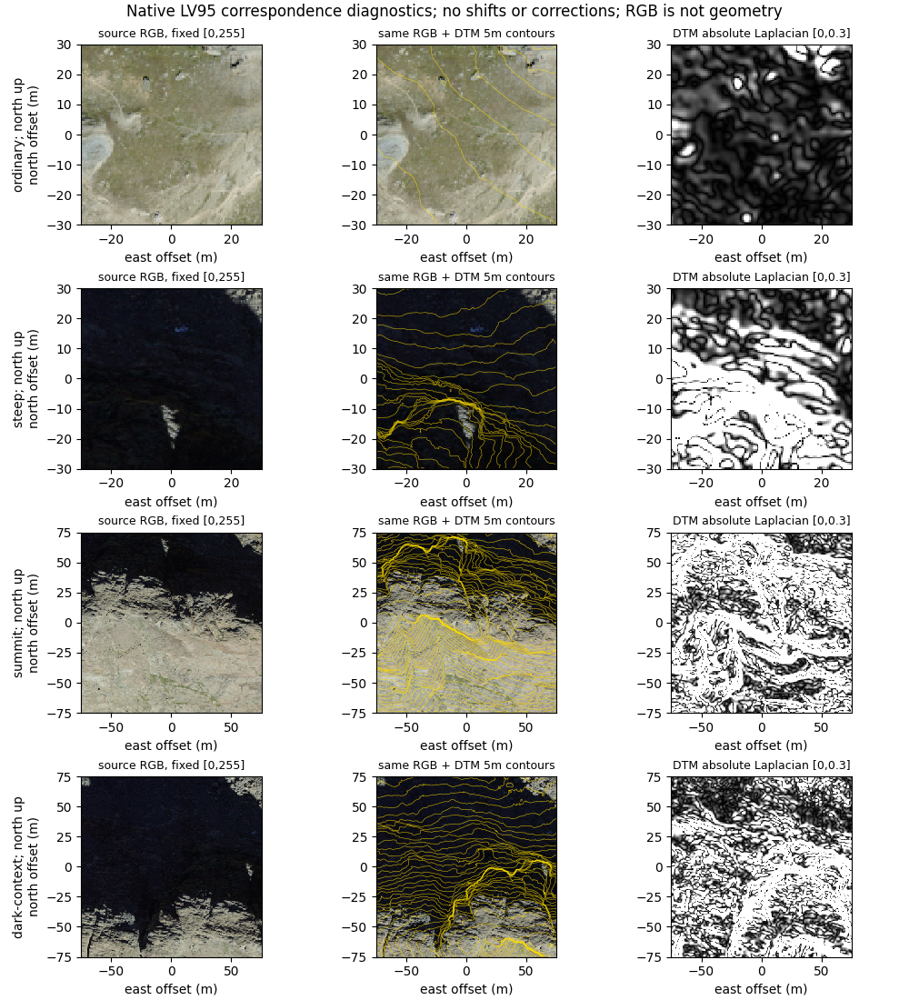
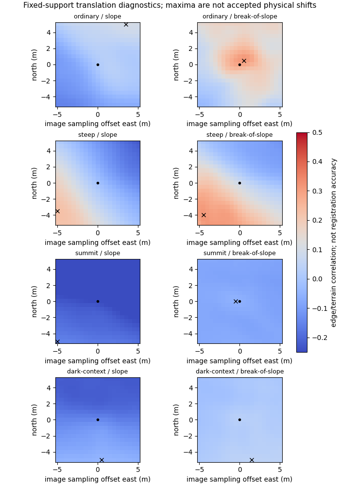
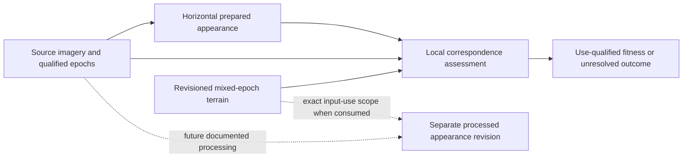

# Retained Riffelhorn imagery-terrain registration and epoch consistency

2026-10-07. Starting checkpoint `1842008ea4996d941226a428aa20aba7dec8fd5e`, clean `main`, fetched origin, **0/0** divergence. Evidence labels: **M** retained measurement/inspection, **E** source documentation/established geometry, **I** intended-use inference. Research only; no source mutation or correction.

## 1. Executive result

**B - SCALE-CONDITIONAL CONSISTENCY.** Declared references, grids and Meridian preparation are consistent in the tested places. Broad display and planning-scale draping remain defensible with epoch/projection qualification. This is not a measured sub-metre source-registration guarantee.

Ordinary-ground forms show useful local correspondence. Steep, summit and dark-context proxies do not identify one stable translation. External source-product displacement and per-pixel epochs remain unresolved. Fine radiometry/normal comparisons and shadow attribution need independent local controls; multiview fusion remains unsupported.

**Correction decision: UNRESOLVED at source/pixel level; no correction indicated for Meridian preparation.** No blanket shift, corrected product or foundational contract change is justified.

## 2. Research question

Do retained geometry and appearance represent the same physical locations/state closely enough for each use? Coordinate arithmetic, preparation fidelity, external product accuracy, physical correspondence and epoch agreement are separate questions. Numerical consistency does not validate source geolocation.

The [appearance assessment](riffelhorn-appearance-assessment.md), [illumination assessment](illumination-identifiability.md), [canonical register](atlas-research-state.md) and [world-model synthesis](atlas-world-model-architecture-synthesis.md) define the boundaries. No terrain-selection or multiscale question is reopened.

## 3. Retained inputs

Fixed SWISSIMAGE footprint: **EPSG:2056 `[2624000,1091000,2626000,1093000]`, 4 km2**. Four 2023 DOP10 TIFFs at `2624-1091`, `2624-1092`, `2625-1091`, `2625-1092`. All individual paths/hashes are preserved in the [baseline](../atlas/swissimage-source-derived-baseline.json) and [new receipt](riffelhorn-registration-epoch-results.json); payloads are not duplicated.

| Responsibility | Exact identity / measured verification |
| --- | --- |
| Source imagery | Four SHA256s verified, **186,259,028 bytes** |
| Prepared imagery | `riffelhorn-swissimage-baseline-v1`, revision `v1`; identity `f6edd630206ed02f255176935d72126cbc6ad7987b12d2986edbe6d05619bc1b`; **1,084** verified payloads, **1,564,233,043 bytes** |
| Imagery manifest / recipe | `3c8b50fb9d7721b678abc46b9450495b417ccafff15d4ee8a67d9d6a3fee4934` / `d917612512380cb6940c103fe679d3af9acc0390a5a0681deb6e4fdda2667cf7` |
| Terrain source | `swissalti3d-riffelhorn-support-selection`; revision `b24a4fdc7b378ba79d442d0ce216a031dfb95a6bc6eed5ad9c33be61175651f4`; **100** verified tiles, **1,667,166,026 bytes** |
| Pure prepared Swiss terrain | `riffelhorn-swiss-support`; revision `1a44a0644de1bde73a3ba84d1b761dc0aa17d48cc971e5f6b5d2c14fb329d7ea`; **11,429** verified payloads, **930,914,852 bytes** |
| Terrain manifest / native VRT | `30413b6698c1e75e27fd169f61925d8d60044fa14f444fb072b652c54816e106` / `8b097d62be84e110cdf8efd695f63d685a9069fcad98aae91660b7fb42e17998` |

Sources remain outside Git under `meridian-data/sources/atlas/riffelhorn/`; prepared products under `meridian-data/derived/atlas/riffelhorn/`. Native patches read the existing DTM mosaic, never synthetic transition terrain. [Terrain declarations](../atlas/riffelhorn-support-product.json) remain authoritative. AWS/Copernicus cannot independently validate this image-DTM pair, so no new comparison is made.

## 4. Source semantics

SWISSIMAGE is processed RGB orthophoto-mosaic evidence: **0.1 m** distributed cells, nominal Alpine **0.25 m** source information. Not raw imagery, calibrated reflectance, albedo or timeless colour. Exact contributor/view/exposure and upstream geometry revision remain unknown. Actual assets are RGB8 with internal YCbCr JPEG95, not physical radiometric calibration.

swissALTI3D is a **DTM without vegetation/buildings**, distributed **0.5 m** LV95 grid, **LN02 / EPSG:5728 metre heights**. Independent measurement resolution and local epoch/accuracy remain unknown. The [2024/2 release notice](https://www.swisstopo.admin.ch/dam/de/sd-web/Zca1yaqlIgTp/swissALTI3D-release-2024_2_de_bf.pdf) documents Valais 2021/2022 LiDAR with 2023 photogrammetric updates. Release-wide 0.3 m 1-sigma quality is not local control validation. (E)

## 5. CRS and reference audit

**M:** Four image TIFFs and four overlapping terrain TIFFs declare EPSG:2056 / LV95 and `AREA_OR_POINT=Area`. Kilometre edges align. Image affine is 0.1 m, terrain affine 0.5 m. Imagery has no declared nodata; terrain declares `-9999`, with none in these reads.

At northwest corner `[2624000,1093000]`, first image centre is `[2624000.05,1092999.95]`, terrain centre `[2624000.25,1092999.75]`. **(+0.2,-0.2) m is expected sampling**, not a half-pixel error. A terrain-cell footprint corresponds to a 5x5 image block. Equal array indices alone do not mean equal positions.

Vertical LN02 is sourced from metadata, not implied by the horizontal TIFF CRS. No ellipsoidal/EGM2008/LHN95 conversion. Native correspondence bypasses Web Mercator and unrelated vertical frames.

## 6. Preparation transform audit

Appearance: horizontal LV95-to-3857, assumed-sRGB decoded linear-light premultiplied RGB/validity area averaging, recursive 2x2 parents. Alpha is supported area, not confidence. Terrain: horizontal reprojection, average z12-17, bilinear z18, Terrarium increment **1/256 m**, unchanged LN02. Image/terrain tiles share XYZ footprints but use 512/256 pixels respectively.

| Independent check (M) | Result | What it does not prove |
| --- | --- | --- |
| Four LV95 centres to 3857 and back | Maximum **0.001250 m** | Absolute geolocation: operation states **1 m** accuracy |
| Affine versus independent global XYZ centre equation | Maximum **2.10e-9 Mercator m** | Source accuracy |
| Synthetic coordinate ramps through area warp | Max **0.000604 m**, median **0.000292 m**, native | Survey registration; ramps are averaged fields |
| Regenerated z18 imagery fields at four patch tiles | **Zero** difference; three unique tiles | Independent upstream registration |
| z18 terrain versus independent pixel-centred native bilinear heights | **81 samples/patch**; max **0.002072 m** | Horizontal error; difference includes quantization/float arithmetic |

No source RGB is shifted by these tests. Source/prepared hashes match. The [earlier independent full rebuild](../atlas/swissimage-source-derived-baseline.md) remains whole-product reproducibility evidence. No deterministic preparation displacement is found in this bounded test; numerical precision is not absolute surveying accuracy.

## 7. Epoch timeline

| Date/interval | Role / qualification |
| --- | --- |
| 2021-08-24 / 2021-08-26; some 2022-08-23 returns | Supplemental LAS dates in [catalogue](../atlas/riffelhorn-data-catalog.json), not a DTM pixel-date map |
| 2021/2022 LiDAR; 2023 photogrammetric updates | Terrain observations, per-cell contributor/epoch unknown |
| 2023 dominant imagery year | Source convention >=70% tile-year; not every pixel's exposure |
| 2023-08-21 `20230821_0907_12501` | Cryosphere strip covers targets; not verified mosaic contributor |
| 2023-09-07 `20230907_1035_12504` | SWISSIMAGE strip covers targets; plausible contributor only |
| 2024 / 2024-2 | Terrain publication/release, not acquisition |
| 2026-10-03T23:19:00.840434+00:00 | Meridian terrain generation, not physical epoch |
| October 2026 appearance preparation/retention | Meridian delivery work; no fabricated exact acquisition/preparation timestamp |

[Strip assessment](../atlas/riffelhorn-observation-support.md) supplies coverage/dates. Terrain versus dominant imagery separation may be approximately **zero to two calendar years**, conditional on actual 2021-2023 contributors. This is **not a per-pixel bound**: imagery minority-year contributions and local terrain lineage are unknown. Stable rock may remain comparable while ice/snow/debris change.

## 8. Registration taxonomy

| Question | Conclusion |
| --- | --- |
| Coordinate/reference | Declared horizontal frames/edges agree; LN02 retained |
| Preparation | Tested indexing/reprojection fidelity consistent |
| Source-product | swissALTI3D ortho model family documented; exact revision and local residual unknown |
| Local physical correspondence | Useful ordinary-ground association; steep/dark ambiguous; no accepted shifts |
| Temporal correspondence | Mixed epochs; no local dated stability mask |

There is no combined error score. The [reconciliation methods review](../atlas/spatial-terrain-reconciliation-research.md#correct-reference-and-registration-errors-before-attributing-residuals) requires stable, physically interpretable correspondence before correction. DEM-to-DEM registration does not make RGB edges terrain heights.

## 9. Stable-control selection

[Initial plan](../../scripts/atlas/riffelhorn-registration/initial-plan.json) predeclared stable ridge/summit/break-of-slope candidates, rejecting shadows/snow/glacier margins. It did not assume surveyed controls exist.

| Inherited patch / LV95 centre / side | Bounded inspection |
| --- | --- |
| Ordinary `[2625240,1092530]`, 60 m | Small rock/ground forms broadly correspond; material/boulder highlights not automatically DTM controls |
| Summit `[2624810,1092252]`, 150 m | Crest/ledge context visible; conspicuous light/dark boundary rejected as shadow-ambiguous control |
| Steep `[2624805,1092330]`, 60 m | Dark/stretch-limited face; bright texture not sufficient independent control |
| Dark-context `[2624740,1092318]`, 150 m | Lit ledges/dark face provide context, not a fixed geometric darkness boundary |

**No independently identifiable point set with defensible matching uncertainty was established.** No manual registration error/zero-error claim follows. This is a negative control-identifiability result, not permission to optimize visual agreement. Rock stability is plausible, not a proven epoch mask; vegetation, loose material and above-ground objects remain possible.

## 10. Quantitative methods

[Script](../../scripts/atlas/riffelhorn-registration/assess.py), [final plan](../../scripts/atlas/riffelhorn-registration/plan.json), [18 safeguards](../../scripts/atlas/riffelhorn-registration/test_assess.py), [results](riffelhorn-registration-epoch-results.json) and [validation](riffelhorn-registration-epoch-validation.json) retain inputs/methods. Four fixed patches contain **208,800 central 0.5 m cells**. Actual read bounds with halos are recorded per patch; this is not per-pixel dependency infrastructure.

Native DTM and **5x5 encoded RGB block means** share a 0.5 m grid. Luminance proxy `0.2126R+0.7152G+0.0722B` is not physical reflectance/luminance. Fixed Gaussian sigma **1 m** (2 cells), radius 4 m, smooths image and height before derivatives. Image gradient magnitude is compared separately with DTM slope `atan(|grad h|)` and absolute Laplacian `|hxx+hyy|`. Neutral derivatives avoid an assumed source Sun.

Pearson correlation uses fixed central support, offsets **+/-5 m** at **0.5 m** steps (**441** candidates), whole patch and four fixed quadrants. Positive offset means sample image east/north of terrain. No subpixel fitting, shifted product, fitted mask or accepted physical offset. Source black is retained, not declared shadow/no-data. Image edges can include illumination/material boundaries: the diagnostic population is **not** a stable-control mask.

**Explicit numerical correction:** initial halo 6 m was insufficient for 5 m search + 4 m Gaussian radius + 1 m second-derivative guard. Plan v2 uses **10 m**; initial plan/hash and reason are preserved. Central support, search and metrics are unchanged; no result-driven tuning. Smoothed slope distributions here differ from earlier unfiltered stretch measurements. No new library dependency.

## 11. Visual diagnostics

Source RGB and identical RGB with native 5 m DTM contours share each north-up crop. Fixed RGB `[0,255]` display, no independent auto-contrast. Absolute Laplacian display is fixed `[0,0.3]` m^-1 and saturates some cliffs; that is display clipping, not missing geometry. No source shadow becomes a terrain control.

Dot: zero; cross: proxy optimum. Shared colour scale is correlation, not registration accuracy/probability. Both figures inspected. Retained TIFF values, not screenshots/renderer output, supply the data.

## 12. Ordinary/context results

Break-of-slope correlation is **0.2912 at zero**, **0.3126 at (+0.5,+0.5) m**. Interior near-origin peak and visible forms support local association, **not** measured 0.707 m registration error. Slope proxy maximizes at **(+3.5,+5) m**, boundary, score **0.1024**.

Break-of-slope quadrant optima: `(-0.5,+0.5)`, `(+0.5,+1)`, `(+3.5,-3)`, `(0,-0.5)` m. Population/material/terrain variation changes peaks. Even here a unique rigid shift is not justified.

## 13. Summit results

Break-of-slope score is negative at zero (**-0.0589**) and best `(-0.5,0)` (**-0.0574**). Near-zero optimum/negligible gain is not good-registration evidence. Slope best `(-5,-5)` is negative/on boundary; quadrants vary. Broad crest/ledge context remains visible, but light/dark boundaries do not locate a summit precisely. Close-scale residual unresolved.

## 14. Steep-terrain results

Break-of-slope rises **0.0843 to 0.3149** at `(-4.5,-4)` m; slope best `(-5,-3.5)` is on boundary. Break peak exceeds alternatives at least 1 m away by only **0.00163** correlation. Quadrants include opposing signs/boundary maxima. This is ambiguous mismatch, **not** measured 6.02 m displacement or a cause diagnosis.

Inherited [projection evidence](../atlas/riffelhorn-observation-support.md): p95 slope **80.7066 degrees**, p95 stretch **6.1923**, p95 nominal 0.25 m tangent footprint **1.5481 m**; 27.0694% cells stretch>2. Reused, not re-estimated. Delivery refinement cannot restore missing views. Steepness can amplify sensitivity but does not separate relief displacement, source geometry, heightfield limits and physical change. No slope/aspect displacement law is fitted.

## 15. Dark-context results

Break-of-slope score **0.0317** at zero, **0.0473** at boundary `(1.5,-5)` m; slope score negative at best. Darkness affects texture and quadrants disagree. No 5 m southward registration error, cast-shadow cause or occlusion claim follows. Radiometry-to-normal/shadow attribution would be confounded.

## 16. Glacier/change-region treatment

The [broad/detail assessment](../atlas/terrain-scale-decomposition.md) reports glacier/change-region broad RMS **27.18 m** versus **27.62 m** raw Swiss/common height discrepancy: removing fine detail does not explain it. [Reconciliation](../atlas/riffelhorn-terrain-reconciliation.md) and [terminal transition](../atlas/protected-priority-two-band-transition.md) preserve datum/surface/epoch uncertainty and synthetic-portrayal distinction.

These are **different terrain products/epochs**, not SWISSIMAGE registration residuals. South glacier/moraine regions are excluded from stable-control acceptance or separately change-qualified, not used for fitting. No new glacier/change map or benchmark expansion. Ice/snow, erosion/deposition/loose alpine debris, vegetation and construction are possible change classes, not diagnosed causes. No construction change is established in these patches. Glacier mismatch cannot be generalized into orthophoto misregistration.

## 17. Local displacement estimates

Measured quantities below are **diagnostic image sampling offsets**, not accepted physical displacements:

| Patch | Break-of-slope optimum east/north m | Native image / DTM sample components | Accepted displacement |
| --- | --- | --- | --- |
| Ordinary | `(+0.5,+0.5)` | `(+5,+5)` / `(+1,+1)` | Unknown; proxy/quadrant conflict |
| Summit | `(-0.5,0)` | `(-5,0)` / `(-1,0)` | Unknown; negative/negligible score |
| Steep | `(-4.5,-4)` | `(-45,-40)` / `(-9,-8)` | Unknown; broad/unstable peak |
| Dark-context | `(+1.5,-5)` | `(+15,-50)` / `(+3,-10)` | Unknown; weak boundary optimum |

Sample offsets are not independent observations or tangent distances. Resolution is 0.5 m, without subpixel scientific precision. Neither constant translation nor spatially varying displacement is established. Varying proxy maxima do not constitute a measured displacement field; actual residual uncertainty is not bounded by these proxies.

## 18. Height/horizontal coupling

Locally planar surface, fixed oblique ray: approximate horizontal sensitivity **`|delta x|=|delta h| tan(theta)`**, theta off-nadir; direction follows ray. Elementary geometry, not reconstructed ADS pixels.

| Hypothetical height difference | 10 degrees | 20 degrees | 30 degrees |
| --- | --- | --- | --- |
| 0.3 m | 0.053 m | 0.109 m | 0.173 m |
| 1 m | 0.176 m | 0.364 m | 0.577 m |
| 5 m | 0.882 m | 1.820 m | 2.887 m |

These are **scenarios**, not measured heights, poses/error bars. Steep ray/surface intersection and occlusion can invalidate the planar approximation. An unknown model difference could cause metre-scale apparent displacement; no causal attribution is made. Unrelated 2026 LHN95 frame poses cannot provide 2023 pushbroom rays.

## 19. Orthophoto-production implications

The retained [SWISSIMAGE specification](https://www.swisstopo.admin.ch/dam/de/sd-web/WchyQCcLkyd9/Produktinfo_SWISSIMAGE10cm_DE.pdf), sections 3.1-3.5, documents nadir ADS acquisition, domestic swissALTI3D 0.5/2 m orthorectification, radiometric mosaicking, and possible stretched pixels/local manual or model choices in complex topography. This is conventional DTM ortho evidence, not complete true-orthophoto visibility. Model **family** is known; exact revision/local choices/seams are not. Product positional accuracy is not a patch residual. (E)

The [parked 2026 benchmark](../atlas/swiss-multiview-benchmark.md) concerns a newer frame generation and different site. It does not reinterpret 2023 pixels or supply missing geometry. No causal source-product correction follows.

## 20. DTM versus visible-surface semantics

Images observe visible rock, snow/ice, vegetation and structures when observable; DTM removes some objects and interpolates mixed-epoch terrain. Even a boulder may have different support/treatment. An image boundary and a terrain derivative need not mark the same locus. Object-height displacement, omission and actual change can resemble registration error.

Alpine exposed ground reduces canopy/building ambiguity, not all semantics. Existing LAS/DSM provenance in the [catalogue](../atlas/riffelhorn-data-catalog.json) remains available; no DSM-minus-DTM physical object-height claim or semantic ground truth is manufactured. Source shadows/snow are not fixed controls.

## 21. Scale dependence

A **hypothetical** 1 m displacement spans ten distributed image pixels, four nominal 0.25 m samples, two DTM cells; about five z18 image or 2.4 terrain pixels at local ground sampling. At z12 it is under one delivery sample. This illustrates use sensitivity, not measured 1 m error or universal threshold. Source information, delivery/display sampling, tangent sampling and accuracy remain separate under the [closed information-limit foundation](../atlas/information-aware-display-selection.md).

## 22. Intended-use fitness

| Use | Qualification |
| --- | --- |
| Broad map display | **Suitable with qualification (I)**: coordinate/fidelity checks and inherited [baseline display evidence](../atlas/swissimage-source-derived-baseline.md); mixed epochs/source processing visible |
| Planning-scale textured terrain | **Suitable with qualification (I)**: broad physical context/coherent delivery; dated appearance, not exact current surface |
| Close visual inspection | **Locally conditional (M/I)**: ordinary forms useful; steep/dark stretch and ambiguous correspondence limit interpretation |
| Terrain normals versus radiometry | **Unresolved for pixel-level inference**: independent controls required; mixed contributors/epochs matter |
| Shadow/illumination | **Unsupported as exact 2023 pixel state**: registration is an additional confounder; conditional diagnostics still possible |
| Feature/material inference | **Unsupported by this assessment**: no registered labelled targets or materials established |
| Multiview registration/fusion | **Unsupported / separately PARKED**: no pixels or independent multiview correspondence/visibility proof |

Suitability is a bounded intended-use inference, not a local accuracy certificate or a universal fine-scale failure. No single worldwide pass/fail threshold.

## 23. Need for registration correction

**UNRESOLVED** for actual source-to-terrain correction. No Meridian preparation fix indicated. No proxy maximum accepted as correction. A future **local/conditional** refinement would need independently recognized stable controls, uncertainty and held-out agreement for a named consumer.

No general correction is required for ordinary display. Fine processing must abstain or stay conditional until correspondence is validated. Expanding search, tuning brightness or fitting shadow edges would not fix identifiability. No corrected product, control database or registration runtime is built.

## 24. World-model and provenance consequence

Reuse [appearance identity/provenance](riffelhorn-appearance-assessment.md), [Semantic Evidence v1](../atlas/semantic-evidence-contract.md) and [input-use lifecycle](atlas-derived-understanding-lifecycle.md). Bounded appearance metadata can reference CRS/affine/centre convention, recipe/revision, acquisition epochs/unknowns, ortho model family/revision unknown, local assessment scope/method and intended-use limitations. Never store unqualified `registered=true` or turn correlation into confidence.

Terrain revisions can make terrain-consuming analyses stale within used scope without revising original imagery or terrain-independent horizontal preparation. Source rights/attribution remain retained swisstopo terms and **copyright swisstopo**. No universal registration contract, full AppearanceHierarchy or frozen-contract amendment is needed.

## 25. Relationship to illumination research

The [Tryfan trial](tryfan-illumination-normalization.md) stays **D - INCONCLUSIVE**, SE SCL5 12<20: no fit/correction. Not a negative correction-method result; its criteria remain unchanged.

This is not a replacement correction experiment. Riffelhorn coordinate handling supports conditional coarse inspection; pixel-level correspondence is a confounder and steep/dark eligibility blocker for precise normal/radiometry/shadow claims. Even perfect registration would not recover contributor/time/Sun/view/calibration missing at [9695757](illumination-identifiability.md). Physical correction, albedo, shadow recovery, BRDF and relighting remain unresolved. Swiss frame pixels stay parked.

## 26. Decision A/B/C/D

**B - SCALE-CONDITIONAL CONSISTENCY.** Declared-grid and transfer fidelity plus inherited broad display support qualified broad/planning uses. Strong close-scale physical registration/co-temporality is not established. A overstates controls; C mistakes proxy maxima for material error; D discards valid reference/preparation and broad-use evidence. **Fine source-registration estimates individually remain indeterminate.**

A15 gains this bounded assessment, not closure/comprehensive correction. All 42 status columns, closed terrain/multiscale/semantic foundations and historical reports remain. No foundational redesign is demonstrated. The [validation receipt](riffelhorn-registration-epoch-validation.json) records deterministic rerun, 18 focused safeguards, frozen tests/contracts, references, retained hashes and 113 protected production hashes. No shared/production code change; unrelated app build is unnecessary.

## 27. Exactly one next bounded task

**Retained Tryfan vegetation-only residual-normalization protocol assessment.** A protocol/evidence assessment, **not automatic correction**. It addresses surviving A7: is a different explicitly vegetation-scoped question meaningful on the same retained post-L2A observation after the unchanged all-class trial stopped?

Build on the [trial baseline](tryfan-illumination-normalization-baseline.json), [original criteria](../../scripts/atlas/illumination-assessment/future-evaluation.json) and [source/illumination assessment](illumination-identifiability.md). SCL4 held-out counts **1648/2286/2321/2486** contrast with SCL5's failed SE count. Counts alone do not establish homogeneous material, residual illumination causality or interpretable correction.

Assess broad SCL4 meaning, upstream terrain/BRDF processing, vegetation/material heterogeneity and held-out incidence support. Exit with either a justified **separate** predeclared protocol, fixing scope/masks/held-out/failure criteria before fitting, or a precise no-go/park decision. **Do not modify the original protocol, lower its threshold, fit corrections, tune masks, expand the area or substitute observations.** A later experiment would require separate authorization. This is an explicit change of scientific question to assess, not retroactive success for the failed gate.

This next task has not begun. Riffelhorn pixel correction remains ineligible; A6/A8-A11/A14/A15 science stays separate; A13 pixels remain parked. No acquisition, productionisation or contract modification follows automatically.
