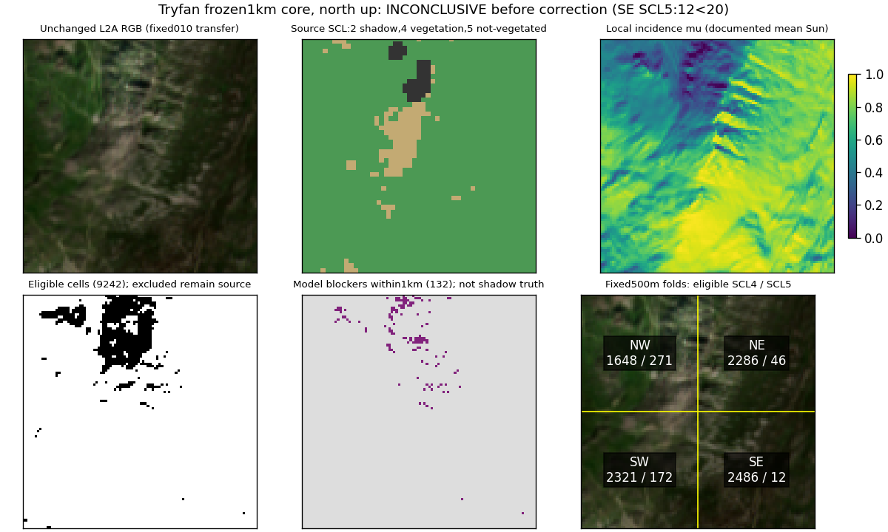
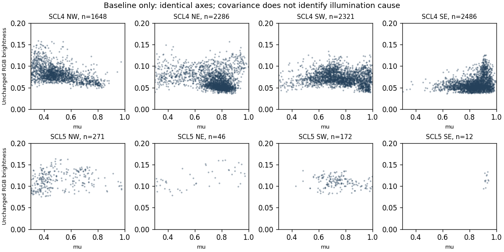

# Retained Tryfan post-L2A residual terrain-illumination normalization experiment

## 1. Executive result

**D — INCONCLUSIVE: the predeclared minimum-evidence gate failed.** The southeast
500 m quadrant has **12 eligible SCL5 analysis cells**, below the required **20**.
The frozen protocol explicitly says to stop INCONCLUSIVE without widening. No C
coefficient was fitted, no normalization applied, no corrected representation published.
This is completion at the protocol's stopping boundary, not evidence of failed correction
or improved appearance. The core question remains unanswered for a valid correction trial.

Starting state: clean `main`, exact `96957570b585781995feaec52b1598784b4db3d9`, fetched
`origin`, divergence `0/0`. No newer work or data acquisition was needed.
[Outcome](tryfan-illumination-normalization-results.json), [baseline](tryfan-illumination-normalization-baseline.json)
and [validation](tryfan-illumination-normalization-validation.json) preserve the stopping evidence.

## 2. Experimental question

Can one established residual C normalization reduce terrain-correlated variation in the
retained July L2A RGB observation while preserving recorded information? Normalization,
information preservation and physical inference are separate outcomes. A valid beneficial
normalization would still not establish intrinsic colour, albedo or recovered shadow signal.
The entry gate failed before those comparative outcomes could be evaluated.

## 3. Frozen protocol recovered from 9695757

The authoritative [identifiability report](illumination-identifiability.md#23-predeclared-evaluation-criteria)
and [frozen receipt](../../scripts/atlas/illumination-assessment/future-evaluation.json) specify:

- Only `S2A_MSIL2A_20260712T113331_N0512_R080_T30UVD_20260712T174812`, mirror
  `S2A_T30UVD_20260712T113332_L2A`; native RGB/SCL, no PNG input.
- EPSG:27700 study `[264900,357800,267900,360800]`; evaluation core
  `[265900,358800,266900,359800]`;10 m analysis. Four500 m quadrants, no area substitution.
- Welsh1 m DTM, mean to10 m for normals; documented mean Sun; source SCL4/5 separately.
- Positive valid RGB, mu>=0.3, complete1 km terrain ray support, no model-blocked cells.
  Exclude SCL0/1/2/3/6/7/8/9/10/11. No shadow lifting.
- Each stratum>=100 eligible cells overall, every held-out quadrant>=20 and each
  complementary training muP95-P05>=0.2; otherwise **stop INCONCLUSIVE**.
- One per-band C family versus unchanged L2A; four-fold holdout; valid positive slope,
  C>=0 and finite denominator; gain[0.5,2], otherwise no-change/count rejection.
- Held-out benefit in>=3/4 folds plus information/colour guardrails; fixed Sun sensitivity
  azimuth+/-2 degrees and elevation+/-1 degree, never fit Sun to imagery.

Frozen receipt SHA256: `0e1b884bd64c94effffeb1cb024f01c6f385d87eda73f20fa134f0a2add5ca28`.
Its historical `experimentNotStarted:true` is preserved as a preregistration fact; current
completion is recorded here rather than rewriting the earlier receipt/report.
The [execution plan](../../scripts/atlas/tryfan-illumination-normalization/execution-plan.json)
was written before baseline examination. It specifies previously unspecified numerical
choices: weighted RGB brightness, standard deviation for spread, stencil/ray sampling and
fixed010 display. It changes no threshold, mask, source, method family or acceptance rule.

## 4. Retained inputs

Four retained native windows from `${MERIDIAN_DATA_ROOT}/earth-lab/tryfan-005b/sentinel2-surface-evidence/source-native/`
are read through the unchanged005C receipt. Exact hashes were verified before and after execution.

| Native role | Bytes | SHA256 |
|---|---:|---|
| blue | 233,812 | `dba087002d85ee85c1772f570acefd60d2eaabe33fd8dba63e17d38505a34ee9` |
| green | 237,936 | `79684a3055429b256d351ee22563b3770709063b71cb2cadf1bc874c0898bb79` |
| red | 239,636 | `8fbfa498771db35f60698b7dcfc2e0c89b3d0fd75d55a41332051ce72b596f86` |
| scl | 3,160 | `050f4f3a9671d134e3a8e613ae93f252018ba963114172a4acec9d8280d9ad9f` |

The terrain is15,639,072 bytes, SHA256
`49c131d7de62e0df35f8e02c2f8db3161bfd37f24fea56060fcbb9e6d109b326`, retained at
`sources/atlas/tryfan/welsh-lidar-1m/rasters/tryfan-004-dtm-1m.tif`.
Only714,544 imagery/mask bytes plus the existing terrain are consumed; no duplicate payload
or transient corrected raster is created. The exact005C receipt SHA is
`06fe074eb64ad1fa675467a572c506e50d040429214a7d3acee8258c955d3fa8`.
Rights remain those established in the [010 source audit](../earth-lab/tryfan-010-observed-natural-colour.md#observation-selection-and-provenance) and [Welsh proof](../atlas/tryfan-second-region-proof.md): **Contains modified Copernicus Sentinel data 2026. Contains Welsh Government information licensed under the Open Government Licence v3.0.** No new licence survey or broader serving permission is inferred.
Input/metadata/code revisions are in the baseline. Reproduce with the
[isolated script/README](../../scripts/atlas/tryfan-illumination-normalization/README.md).

## 5. Source/product semantics

Sentinel-2A MSI, L2A processing baseline05.12. The retained source metadata and
[010 encoding audit](../earth-lab/tryfan-010-observed-natural-colour.md#deterministic-processing)
establish B04 red/B03 green/B02 blue, `DN*0.0001-0.1`, DN0 nodata; decode before resampling.
Negative valid values would be retained in analytical arrays, then excluded from fitting.
Native RGB is405x405 at10 m, EPSG:32630, affine `[10,0,431200,0,-10,5887460]`.
SCL is203x203 at20 m on the same origin, not independent10 m material truth.

[Copernicus product documentation](https://sentiwiki.copernicus.eu/web/s2-products)
defines L2A surface-reflectance products after atmospheric processing and cartographic
orthoprojection. This is a processed estimate, not calibrated proof of illumination independence.
The retained assessment identifies possible prior terrain/BRDF processing; exact local
Sen2Cor settings, source orthorectification terrain revision and per-pixel time are not retained.
No assertion of perfect atmospheric, topographic, cloud/shadow or BRDF correction follows.
SCL supplies classification-based exclusions, not an independent shadow/material truth mask.

RGB is reprojected once bilinearly in float64, SCL nearest, one GDAL thread, into the frozen
300x30010 m BNG study. The central100x100 cells form the core. Reprojection supplies no
new spatial information. No additional resampling or enhancement is used for analysis.

## 6. Acquisition and Sun geometry

Documented scene/COG mean: true-north azimuth **160.700929790374 degrees**, elevation
**58.062309162853 degrees**. It is the frozen diagnostic input, not exact pixel illumination.
For traceability, the unchanged NOAA fractional-year implementation separately reconstructs
geometric Sun at core centre `[-3.9975235847910118,53.11409885023405]`:

| Timestamp role | UTC | Azimuth / elevation, degrees |
|---|---|---|
| Official product acquisition field/datatake context |2026-07-12T11:33:31.024Z |158.954117 /57.665038 |
| Mirror granule field |2026-07-12T11:36:51.535Z |160.367627 /57.839018 |

These field-role calculations are not pixel-time uncertainty bounds, nor replacements for
the frozen source mean. Algorithm excludes refraction, parallax and irradiance modelling.
Grid convergence matters: true-east BNG basis approximately `[0.999611,-0.027888]`,
true-north `[0.027889,0.999611]`. Rotate the documented Sun into that basis before incidence
and ray calculations; do not confuse grid north with true north.

## 7. Terrain dependency

[Retained Welsh proof](../atlas/tryfan-second-region-proof.md) supplies the2021 DTM and
source/product distinction. Analytical geometry uses the exact native DTM revision above,
not exaggerated render geometry or visual delivery tiles. Vertical reference and exact
per-cell acquisition dates remain qualified by the retained metadata.

Mean each native10x10 block, take central-difference gradients with10 m spacing on the
full study, use north-up normal `(-dz/dx, row-gradient,1)` normalized to unit length.
Core slope p05/median/p95: **10.452 /32.150 /51.795 degrees**. Cast-blocker diagnostics
use native1 m samples, rather than pretending the10 m normal describes every facet.
A heightfield cannot capture every overhang/vegetation/structure occluder.

## 8. Masks/exclusions

Core source SCL counts: SCL2=196, SCL4=9248, SCL5=556. All RGB values are positive/finite;
none are above1. Overlapping exclusion counts, not additive disjoint fractions:

| Diagnostic | Cells of10000 |
|---|---:|
| Excluded source SCL |196 |
| Local incidence mu<0.3 |676 |
| Native terrain blocker within1 km |132 |
| Incomplete1 km ray support |0 |
| Nonpositive/invalid RGB |0 |
| Eligible union after all guards |9242 |
| Excluded union |758 |

Each core cell centre consumes a native terrain ray at distances2..1000 m inclusive,
step1 m, nearest sample. Full finite support is mandatory. Actual read support is the
frozen3 km study; normal stencils use the10 m aggregated neighbours. No blocker within
1 km does not establish visibility beyond it or absence of non-terrain occlusion.
SCL and model masks can disagree legitimately; no new observed-shadow classification is made.

## 9. Baseline characterization

The baseline was persisted **before** the gate outcome was acted upon. Weighted brightness
is `0.2126R+0.7152G+0.0722B`, an analysis statistic, not irradiance or albedo.
Pearson association and population standard deviation are reported within each eligible
source stratum/fold. All per-band distributions are retained in JSON.

| SCL | Quadrant | Eligible cells | Brightness versus mu r | Brightness std |
|---|---|---:|---:|---:|
| 4 | NW | 1648 | -0.4669 | 0.01809 |
| 4 | NE | 2286 | -0.2576 | 0.02009 |
| 4 | SW | 2321 | -0.1530 | 0.01533 |
| 4 | SE | 2486 | +0.2384 | 0.01542 |
| 5 | NW | 271 | +0.1696 | 0.01999 |
| 5 | NE | 46 | +0.5965 | 0.02251 |
| 5 | SW | 172 | -0.1858 | 0.01243 |
| 5 | SE | 12 | +0.3977 | 0.01164 |

Whole eligible SCL4 r=-0.3812, std0.01919; SCL5 r=+0.0762, std0.01808.
The change of sign across folds is baseline heterogeneity, not proof of upstream
correction failure, illumination causation or invalidity of C normalization in general.

## 10. Correction method

The sole permitted model would be `rho=intercept+slope*mu`, `C=intercept/slope`,
`rho_normalized=rho*(cos(solarZenith)+C)/(mu+C)`, independently per RGB band/stratum/fold.
The established C family is described in
[Richter, Kellenberger and Kaufmann2009](https://gfzpublic.gfz.de/pubman/item/item_238938_1/component/file_238937/13324.pdf).
It requires defined Sun/terrain/radiometry and empirical fitting; residual decorrelation
cannot validate physical reflectance. **No fit or correction was executed**, because the
whole-design minimum-evidence prerequisite failed. No alternative family was substituted.

## 11. Parameter/fitting procedure

Fixed held-out quadrants: NW `[265900,359300,266400,359800]`,
NE `[266400,359300,266900,359800]`, SW `[265900,358800,266400,359300]`,
SE `[266400,358800,266900,359300]`, all EPSG:27700. The complementary three quadrants
would supply training cells within the same source SCL stratum, never held-out values.
Population checks performed before regression:

| SCL | Held-out fold | Test cells | Training cells | Training muP95-P05 |
|---|---|---:|---:|---:|
| 4 | NW | 1648 | 7093 | 0.4386 |
| 4 | NE | 2286 | 6455 | 0.5730 |
| 4 | SW | 2321 | 6420 | 0.5625 |
| 4 | SE | 2486 | 6255 | 0.5766 |
| 5 | NW | 271 | 230 | 0.5460 |
| 5 | NE | 46 | 455 | 0.6083 |
| 5 | SW | 172 | 329 | 0.6110 |
| 5 | SE | 12 | 489 | 0.6137 |

Both overall strata exceed100 and all training ranges exceed0.2. **SE SCL5 has 12<20**.
These are analysis-cell counts, not statistically independent source measurements;
nearest20 m SCL assignment does not create independent10 m labels. No fitted coefficients,
training optimization, gain rejection counts or corrected fold predictions exist.
The code intentionally has no correction path after this stop, preventing accidental
reruns on changed evidence from silently becoming a new experiment.

## 12. Frozen evaluation criteria

| Frozen requirement | Disposition |
|---|---|
| Exact input/core, eligible masks, adequate stratified four-fold design | Inputs/masks preserved; minimum held-out count **FAIL** |
| Positive slope/C>=0, finite denominator, gain[0.5,2] | Not reached, not waived |
| Absolute association and spread improve>=3/4 admissible folds | Not evaluable; no fitted comparison |
| Original/excluded exact, no new nonfinite/nodata or analytical clipping | No corrected output exists; original files verify unchanged |
| Gains, failures, normalized local gradients and band ratios | Baseline retained; changes/gains not evaluable |
| Fixed-display full-core/fold before/after inspection | Source/geometry/mask views inspected; no valid after-image exists |
| Benefit direction under azimuth+/-2/elevation+/-1 | Not run after nominal prerequisite failure |
| No physical accuracy claim from decorrelation/visual preference | Preserved; no benefit claimed |

Not evaluating downstream criteria is the **frozen stopping rule**, not a post-hoc change.
No stratum/fold was dropped, low-incidence cells reintroduced, core enlarged or alternative
observation selected. The seven criteria and their input receipt remain byte-identical.

## 13. Quantitative results

The empirical result is insufficient eligible support in **one of eight stratum/fold
combinations**. It is not3/4 successful folds, not a rejected fit and not a measured effect
size. Result receipt explicitly records `fittedModels:0`, `correctedCells:0` and
`correctedRepresentationPublished:false`. Baseline numerical values have zero nonfinite,
negative and over-unit values; these counts do not establish scientific accuracy.

## 14. Visual results

All panels share the frozen footprint/orientation/sampling. The source and fold view use
identical010 display transfer: `clip((rho-0.02)/0.28,0,1)`, gamma1, with no auto-contrast.
Analytical values are never clipped. Masks/incidence have explicit categorical/numeric scales.
The very sparse SE non-vegetated support is visible; no corrected comparison is presented.

Axes are identical across folds. Visual inspection confirms concentration/heterogeneity,
not a shadow cause or correction outcome. Baseline texture is already filtered by native
sampling/reprojection; images neither recover nor synthesize detail. A fabricated unchanged
image labelled 'corrected' would conceal the stopping outcome and is deliberately absent.

## 15. Terrain-illumination dependence

The baseline exhibits association, with opposite signs between some folds. Correlation
alone cannot separate material, phenology, atmospheric residuals, prior Sen2Cor processing,
illumination or spatial sampling. The planned comparison of residual dependence remains
**NOT EVALUABLE**. No statement that C correction reduces it is supported.

## 16. Information/texture preservation

Baseline adjacent same-SCL eligible pairs within the same fold: **16765 SCL4 edges**,
**767 SCL5 edges**. For each band use absolute pair difference divided by pair mean.
SCL4 median R/G/B normalized gradients:0.06984 /0.05392 /0.08545;
SCL5:0.06330 /0.05744 /0.06466. Distributions are in the baseline.
Excluded/fold-boundary edges are omitted. No after-correction texture retention, noise
amplification or halo assessment is possible. Source files remain unchanged; that is
input preservation, not evidence of successful correction preservation.

## 17. Spectral behaviour

Baseline median R/G and B/G: SCL4 **0.91916 /0.64908**, SCL5 **1.04227 /0.82224**;
p05/p95 values are recorded. These describe processed RGB signal, not material spectra.
No independent per-band gain was applied, so spectral distortion after normalization is
unknown, not zero damage demonstrated by a tested method. No new classification is derived.

## 18. Surface-context behaviour

SCL4 and SCL5 remain broad native vegetation/not-vegetated categories. Neither is a
homogeneous physical material, habitat nor correctness label. The former dominates the
core; the latter is spatially uneven. All eight baseline contexts are retained, including
the inadequate fold. No WorldCover/NRW truth ranking, habitat crosswalk or inference is used.
A vegetation-only correction would change the frozen design and is not executed.

## 19. Cast-shadow behaviour

132 cells have a conditional native-terrain blocker within1 km;196 have source SCL2.
Exclusions are retained separately from the illumination-incidence guard. Darkness,
positive local incidence and geometric blockage are different observations/diagnostics.
No excluded cell is brightened, filled or inferred. The planned method was not intended
to recover deep-shadow signal, and this stopped trial tests no compensation ability.

## 20. Correction magnitude and failure cases

No correction magnitude is available. 'Zero corrected cells' means **no method run**,
not successful identity normalization or empirical coefficient zero. The concrete failure
is minimum supported SE SCL5 population, despite adequate overall counts and training
incidence ranges. Sensitivity cannot rescue an inadmissible nominal design; no angle was
chosen to make that fold pass. Other frozen numerical/visual failure modes remain untested.

## 21. Information-recovery boundary

Reducing brightness association, exposing recorded low-contrast variation, amplifying
noise and recovering absent information are not equivalent. This trial establishes none
of them for corrected imagery. Fixed-transfer source diagnostics reveal only retained
signal and eligibility. Deep-shadow/hidden-surface recovery remains unsupported.

## 22. Physical/albedo interpretation boundary

No output is called albedo, intrinsic/true surface colour or illumination-free ground truth.
Even a future successful residual C trial would need independent material/radiometric,
view/BRDF, atmosphere and illumination evidence before stronger physical inference.
The absence of a passing trial is not a proof that such appearance can never be estimated.

## 23. World-model/provenance consequence

The existing [architecture](atlas-world-model-architecture-synthesis.md),
[appearance taxonomy](riffelhorn-appearance-assessment.md#4-appearance-concept-taxonomy) and
[lifecycle assessment](atlas-derived-understanding-lifecycle.md) accommodate an honest
failed-entry/unknown result without publishing a misleading derived appearance product.
A stopped experiment receipt is not a physical state claim. Contract v1 is unchanged.

If a later authorized correction exists, its inputs must identify source observation/revision,
decoded/prepared grid, qualified Sun, normal/ray geometry, masks, method revision, coefficients
and actual input-use scopes. This baseline already records those present inputs/revisions.
A geometry or method revision can affect a corrected product's freshness while leaving the
original L2A observation historically referenceable. Materialization/PNG identity is not
physical identity. There is no foundational architectural contradiction here.

## 24. Renderer consequence

No evidence justifies making this result a generally preferable texture, changing production
satellite behaviour or introducing Meridian-controlled relighting. Even successful future
normalization would not imply Lambertian response, view independence, recovered cast-shadow
content or physically correct relighting. Source-derived imagery remains the established
baseline; IGOR/satellite behaviour stays untouched.

## 25. Decision A/B/C/D

**D — INCONCLUSIVE**, precisely the preregistered insufficient-evidence stop. A would
overstate this as a method/input failure; the retained sources are intact, but one required
evaluation population is too small. B/C would imply a tested normalization outcome. This is not generalized
method FAILURE, not useful constrained PARTIAL and not SUCCESS. The assessment at 9695757
provided a justified experiment entry, not a guarantee that its minimum supported populations
would exist. No criterion was weakened to obtain a more gratifying classification.

## 26. Implications for Atlas appearance maturity

The finite trial is complete at its stopping boundary. A7 has an empirical eligibility
result, but C normalization benefit remains untested. A6 exact contributor illumination,
A8 radiometric reconciliation, A9 intrinsic appearance, A10 BRDF, A11 physical relighting,
A14 fusion and A15 registration/temporal consistency remain unresolved at their recorded
scopes. A13 Swiss frame pixels remain **PARKED**. Terrain, multiscale and semantic foundations
remain closed; no new synthesis blocker or full AppearanceHierarchy is established.

[Validation receipt](tryfan-illumination-normalization-validation.json) verifies deterministic
fresh-process JSON/figure hashes,16 focused grid/ray/gate tests, 64 frozen domain tests,
isolated TypeScript declarations,42 preserved status columns, historical reports/tooling,
exact protocol/source revisions,113 production hashes and documentation references.
No app build is needed: shared/production sources are untouched. No retained-source writes,
new observation, private inspection, Weather/Traverse change or corrected raster occurs.

## 27. Exactly one next bounded task

**Retained Riffelhorn imagery-terrain registration and epoch-consistency assessment.**
Build on canonical A15, the retained terrain/SWISSIMAGE manifests and the appearance
integration assessment. Determine which alignment, geometry revision and temporal
qualifications can be verified, which depend on unavailable contributor/orthorectification
metadata, and what minimum defensible registration test would be possible before later
view-dependent/corrected appearance use. Use retained assets only; do not perform image
warping, multiview provisioning/fusion or illumination correction. Stop with a concrete
known/unknown/dependency decision rather than another pixel-enhancement ladder.

This addresses a surviving separate interpretation risk after a deliberately stopped
optional illumination trial. It is not permission to relax this trial's gate or reopen
closed foundations. This next task has not begun.
