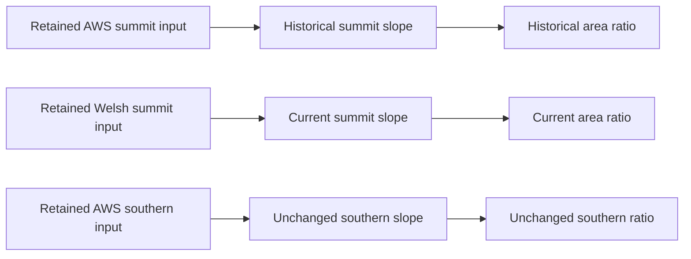
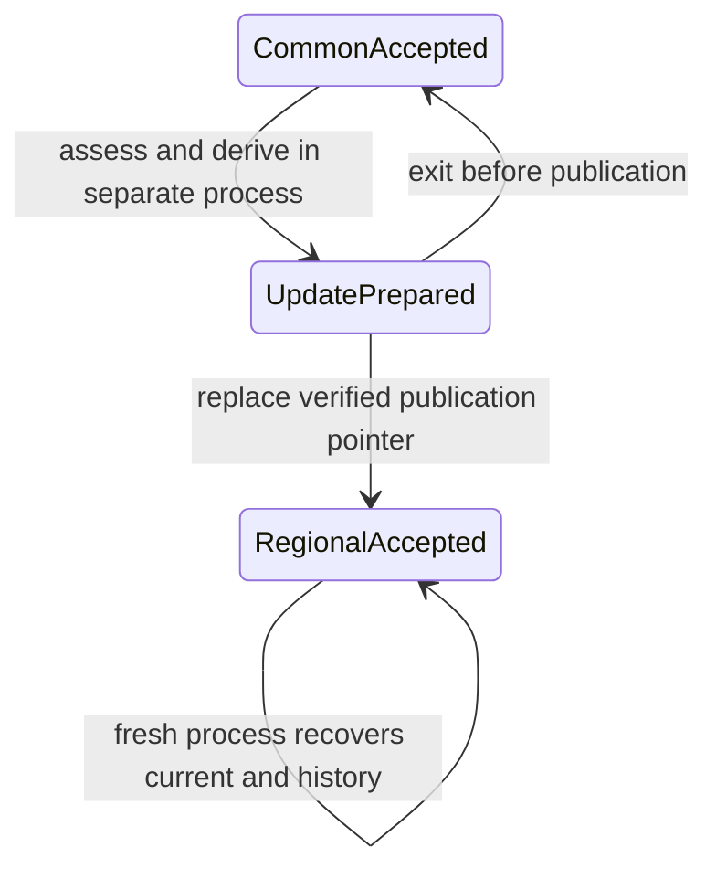

# Local persistent retained Tryfan world-model proof

2026-10-06. Starting clean `main` at **3c143ebea99ce366a1b00083f64a4ee11149a1e0**; fetch confirmed `main...origin/main` **0/0**. No newer legitimate work required reconciliation. This is an isolated engineering proof, not production infrastructure.

## 1. Executive result

**C — SUCCESS.** The retained Tryfan world-model slice survives actual process termination/restart, scoped Welsh applicability and recomputation, and historical replay without changing frozen contracts or production. Four initial AWS-derived results become six retained result revisions with four current answers: only the summit slope/area-ratio chain recomputes; southern results remain identical. Four historical AWS results and two Welsh results replay exactly from newly read retained pixels and unchanged methods.

Immutable JSON snapshots and one atomic publication pointer are adequate for this tiny single-writer proof. They are not a production database decision. An abrupt exit after completing the update snapshot but before replacing the pointer leaves the common snapshot visible; retry publishes the same completed revision. The mechanism rewrites whole metadata snapshots despite selective computation. Concurrent writers, power-loss durability, large catalogues and production performance are not demonstrated.

The [results/measurements](tryfan-local-persistent-results.json), [plan](tryfan-local-persistent-plan.json), [validation](tryfan-local-persistent-validation.json) and [tooling](../../scripts/atlas/local-persistent-proof/README.md) preserve reproducibility. Exactly one next bounded task is recommended in section 27; it has not begun.

## 2. Purpose and scope

Test durable identity, qualified claims, input-use scopes, context-relative freshness and history across real restart. This follows [storage requirements R1–R12](atlas-storage-processing-serving-requirements.md#27-requirements-for-the-first-persistent-regional-proof), [world-model synthesis](atlas-world-model-architecture-synthesis.md), [lifecycle assessment](atlas-derived-understanding-lifecycle.md), the [retained vertical proof](tryfan-qualified-query-proof.md), [Semantic Evidence Contract v1](../atlas/semantic-evidence-contract.md) and [TerrainHierarchy](../atlas/terrain-hierarchy-contract.md).

Only new research scripts, small receipts, this report and current navigation are changed. No datasets are acquired, terrain products rebuilt, production consumer added, cloud/database/API created or infrastructure vendor selected. Weather, Traverse, production terrain/imagery/IGOR/lifecycle, analytical AWS z15 and exaggeration 1.45 remain unchanged. Closed foundations are not reopened.

## 3. Authoritative retained inputs

The two probes and z14 requests are exactly those in the [frozen original plan](tryfan-qualified-query-plan.json): summit BNG `[266405,359387]` and southern observer `[265876.05347833806,358339.7631202109]`, inside the retained source window `[264900,357800,267900,360800]` in EPSG:27700. Original 48 m eligibility envelopes remain unchanged; no new probe or scale is chosen.

[Original pinned inputs](tryfan-qualified-query-inputs.json) identify AWS summit/southern and Welsh summit tile subsets: three PNGs totaling 320,857 bytes, exact local hashes, source/product qualifications and input-use neighbourhoods. The Welsh 2021 1 m DTM and prepared v2 family are located through the retained references documented in the [regional proof](../atlas/tryfan-second-region-proof.md). Local AWS tile hashes do not invent an upstream release, datum, effective resolution or observation epoch.

Fresh sampling uses the unchanged [offline adapter](../../scripts/atlas/qualified-query-proof/retained_inputs.py). It verifies retained source/manifest/tile evidence and samples the same nine bilinear heights. It never fetches data. The local world store references external assets and omits terrain bytes and the temporary nine-height buffers. Input, original method and contract hashes are pinned; replay rejects software drift instead of silently changing the method context.

## 4. Local mechanism and justification

Before implementation the [proof plan](tryfan-local-persistent-plan.json) selected inspectable structured files: canonical sorted-key JSON snapshots addressed by SHA256 plus `current.json`. A snapshot contains a complete qualified slice; the pointer selects the accepted revision. Files are closed/flushed before pointer replacement. Existing repository patterns support local immutable receipts and atomic publication; no new dependency is added.

This is adequate for six derived revisions and one writer because readers need only one verified snapshot. It tests identity, history, references, failure and publication independently of a database. It is easy to rebuild into a new directory or replace behind the same semantics. No claim is made about concurrent writer coordination or directory/power-loss durability. Conceptual responsibilities do not become services.

## 5. Persisted world-model slice

| Durable information | Stored form / responsibility |
|---|---|
| Evidence/method basis | Exact repository input/plan/result hashes, original scientific method revision/files, local proof implementation hashes and frozen semantic references |
| Domain selection | Serializable TerrainHierarchy declaration/options, frozen query supports and active common/regional stage |
| Prepared input references | Root identities/revisions, external asset hashes, support/encoding/upstream qualifications; no raster payload |
| Qualified knowledge | Unchanged v1 resource/definition/collection/claim meanings, shared rights/time/lineage; explicit unsupported exposure gap |
| Derivation facts | Claim references, question/probe/property, exact receipts and scalar artifact digest |
| History/publication | Immutable accepted snapshot, parent digest and declared applicability-change reason |

Reverse lookup, selections, availability/freshness assessments, query responses, decoded tiles and sample buffers are reconstructed execution state. There is no durable `fresh=true` flag. The store is not a new semantic model or full feature database.

## 6. Durable identity model

Source/product/representation references remain domain-specific. Exact local input revision differs from unknown global AWS revision. The physical question/claim ID is reused across AWS and Welsh evidence, while claim revision, input revision and process receipt differ. Original scientific method identity/revision is retained. Sorted serialization supplies a separate snapshot artifact hash; it does not become a physical claim identity.

The local research schema is `tryfan-local-persistent-world/v1`; pointer format is `tryfan-local-persistent-store/v1`. Neither is Semantic Evidence Contract's version. Pinned proof implementation hashes prevent silently reinterpreting an old store with altered wrapper code. No process counter, PID, timestamp or object address defines a durable claim. PIDs are recorded only in external test traces to demonstrate distinct runtimes.

## 7. Serialization and round-trip

V1 evidence is persisted faithfully; lightweight derivation bindings refer to exact collection claims instead of duplicating full claims beside the bundle. On load, existing `resolveContext` reconstructs the effective claim context, then the unchanged v1 and dependency validators run. Claim content and scalar artifact digests are checked. JSON round-trip and reordered-object tests preserve semantics and snapshot addressing.

Unknown epochs, native property identifiers, lineage, rights, limitations and gap reasons remain explicit. No quality/confidence number is fabricated. This tiny record binding does not require one full metadata object per raster pixel; actual raster bindings remain unimplemented. Contract v1 and TerrainHierarchy are unchanged.

## 8. Dependency persistence

The prior proof's receipts retain exact resource/claim revisions, method/revision, role, parameters, temporal unknown and actual use scope. The area ratio refers to an exact upstream slope claim, not mutable 'current slope'. The reverse-use map is rebuilt from those receipts after startup; it is a disposable acceleration structure. The finite chain remains terrain→slope→planar area ratio, without a workflow scheduler.

Load rejects missing exact upstream claims/roots and invalid scope/lineage. Persistent facts and a declared current hierarchy are sufficient for the existing `assess` function to reconstruct freshness. No second selector or lifecycle rule is introduced.

## 9. Actual input-use scopes

| Root | Consumed cells | Conservative BNG envelope, rounded here |
|---|---:|---|
| AWS summit | 22 | `[266387.76,359370.77,266417.30,359400.24]` |
| Welsh summit | 22 | Same delivered-grid read envelope |
| AWS southern | 20 | `[265864.09,358324.54,265887.89,358353.86]` |

The complete original precision/meaning is retained in root metadata and receipts. A point output differs from its interpolation/stencil read envelope, which differs from source coverage. Whole-PNG I/O and source hash verification are not logical influence over an entire product.

After recovery, the original synthetic outside-envelope notification leaves current results fresh; a notification inside the halo marks the current summit chain stale transitively while southern results stay fresh. Unknown change scope yields indeterminate. These tests neither edit terrain nor claim an observed physical change. Bounds remain conservative rather than pixel-perfect dependency tracking.

## 10. Initial AWS state

Initialization consumes real retained common pixels and the original ordinary Horn slope/planar area-ratio methods. Existing TerrainHierarchy resolves the frozen requests in the common-only applicability context. Four derived assertions and the explicit exposure gap are accepted. Two root references and their rights/support are persisted. Welsh source metadata may be known in shared provenance, but its regional family is not yet active in selection; existence is distinct from applicability.

No historical AWS record is mutated. The initial accepted snapshot has **100,440 bytes**. Freshness is not persisted. Reading absent state before explicit initialization yields an infrastructure error, not a zero or a semantic gap.

## 11. Restart A

The initialization subprocess exits normally. A separately spawned Node process loads only the snapshot, declared unchanged code/basis and referenced retained assets. Vite SSR imports existing contracts/selector without starting the application or a listening service. Effective claims, selections, current results, historical records, provenance/dependencies, gap and unavailable-provenance outcome match initialization exactly.

Distinct child PIDs and successful process exits are recorded externally. This is not an in-memory map reset. Startup and snapshot loading are measured separately.

## 12. Welsh applicability/update

A fresh update process loads the common snapshot and registers the already-retained Welsh declaration/root metadata through the proof's update function. It asks the existing selector for each frozen support and assesses old results under current-applicable policy. The outcome determines affected probes; code does not list summit result IDs for invalidation.

Only summit slope and its dependent ratio are recomputed from fresh Welsh sampling. Southern computations are not rerun. Original four AWS assertions remain unchanged. The new state references its parent snapshot and adds two revisions. No new terrain source or numerical correction is introduced; this repeats an established evidence-applicability scenario, not a DEM-quality experiment.

## 13. Scoped freshness assessment

| Result context | Fixed-input replay policy | Current-applicable terrain policy after update |
|---|---|---|
| Historical AWS summit slope/ratio | Fresh against exact retained local inputs/method | Stale; better applicable selected family |
| AWS southern slope/ratio | Fresh | Fresh/current |
| New Welsh summit slope/ratio | Fresh | Fresh/current |

Current preference is reconstructed from unique fresh candidates under explicit policy and hierarchy baseline. Historical queries request exact revision. Stale does not mean false; two histories can concern the same qualified represented-heightfield question. No universal newest-source ranking or mutable winner is stored.

## 14. Derived-on-derived recomputation

The explicit two-stage method computes slope before its dependent ratio. The latter uses the former's exact claim revision. The old dependent AWS summit ratio becomes stale through its upstream slope; both new assertions validate before publication. Reverse use lookup has six keys after update, covering direct roots and exact slope revisions. Unrelated southern records and their artifact digests remain unchanged.

## 15. Coherent publication boundary

A complete update snapshot is validated and written before replacing `current.json`. An injected `process.exit(73)` after snapshot completion but before pointer publication leaves the old pointer byte-identical. Another fresh process returns the complete original view, including both summit properties. Retry finds the identical unpublished snapshot and publishes it; no half-updated downstream claim is presented as current.

Invalid/incomplete snapshots fail validation before publication. Queries pin one accepted snapshot during an invocation. This supports a coherent world-model publication boundary, not a requirement that every future property update share one global transaction. Complete snapshots and a single writer are proof limitations. Closed/flushed files and atomic rename do not establish power-loss or distributed transaction guarantees.

## 16. Restart B

The update process exits. Another process loads the accepted regional snapshot: Welsh current summit slope/ratio, unchanged AWS southern slope/ratio, four historical AWS assertions, three root references, exact receipts and both unknown/unavailable outcomes recover. Current queries and provenance inspections are semantically identical to the update process's responses. Preference and freshness are recomputed, not recovered from stale flags.

The updated snapshot is **133,709 bytes**. Distinct source, method, claim and artifact identities remain inspectable after termination. Historical metadata has not been overwritten by current applicability.

## 17. Historical AWS replay

Two levels are distinguished. **Retrieval** loads complete old qualified records and their original input-use/method context. **Replay** independently rehashes and decodes retained PNGs, samples the original neighbourhoods with the pinned software, reruns Horn slope and the dependent area ratio, and compares complete derived records, including values, revisions, context and receipts.

All four AWS historical records replay exactly after refinement; the same pass also validates both Welsh results. This is not merely reading an old scalar. Exact results match [1c2d10e outputs](tryfan-qualified-query-results.json). Unknown AWS upstream provenance remains unknown; local deterministic replay does not prove external measurement accuracy or recreate unretained original observations.

## 18. Unknown/unavailable recovery

The retained current-mineral-exposure-fraction property returns a v1 **unsupported gap** with its native definition, support and unknown time. It is not inferred from terrain or coarse cover. Querying the exact native gap property after restart returns unknown, not an absent row or zero.

The original southern terrain request requiring spatial contributors remains **unavailable** under domain selection; it is different from physical nonexistence. An additional test points the proof to an empty external asset context: stored claims remain present, but current result queries return availability outcomes and fixed replay assessment is indeterminate. Corrupt/missing store errors are infrastructural and explicitly state they are not physical claims. An exact missing historical revision has its own unavailable explanation.

## 19. Failure and recovery behaviour

| Injected condition | Safe visible response / result |
|---|---|
| No accepted store | `store-absent`; explicit initialization required |
| Unknown pointer/proof schema | Rejected; no silent migration or v1 version reinterpretation |
| Invalid native v1 record | Evidence validation failure, not a fabricated value |
| Missing exact dependency revision | Evidence/dependency rejection |
| Corrupt accepted snapshot bytes | Checksum failure; no overwrite of retained inputs/history |
| Incomplete candidate update | Rejected before publication; previous pointer remains valid |
| Abrupt process exit before pointer | Exit 73; prior complete snapshot queries identically after restart |
| Required external asset unavailable | Availability/indeterminate result; unsupported physical gap remains distinct |

All deliberately invalid stores are newly generated test state under `meridian-data`; no original source/product is modified. A single writer, no general migration framework and no automatic destructive repair are intentional constraints. Recovery is explicit retry or rebuild, never silent fallback to a different physical property.

## 20. Deterministic rebuild

A second empty store initializes from retained inputs and performs a normal update in new processes. Both accepted snapshot hashes match the first store's corresponding logical states exactly. Canonical JSON allows byte/content equality here; another future storage mechanism could validly demonstrate logical equality without identical physical layout.

Claim IDs/revisions are unchanged by serialization order, process PID, directory name or timings. Measurements and process traces are external to snapshots. [Results](tryfan-local-persistent-results.json) pin code, original plan and logical-state checksums. Wrapper code changes deliberately require a new compatible proof basis rather than silently interpreting old stores.

## 21. Measurements

One declared Windows x64 run with Node v24.11.0; sequential fresh processes, already-retained local assets and warm OS caches. No percentile/capacity claim follows. Times below are representative rounded values from the results receipt; that receipt preserves unrounded values and external trace location. It can be regenerated with a new run directory; timings may vary.

| Operation | Local observed work / approximate time |
|---|---|
| Initial derivation construction | 0.4 s, includes subprocess/hash/sampling overhead |
| Fresh runtime startup | About 0.6 s, including Vite module loading; not store load alone |
| Restart snapshot load/validation | Around 9–12 ms for this small catalogue |
| Representative inspection/query batch | Around 0.1 s; validates/rehashes and includes provenance/history/gaps, not one optimized value query |
| Scoped update construction | About 0.4 s; only two outputs recomputed |
| Pixel/method replay | About 0.4–0.5 s for six records |
| Full fresh subprocess wall time | Roughly 0.9–1.5 s for the measured phases |

Initial state has **4 derived revisions + 1 gap**, **2 roots**, **4 reconstructed reverse-use keys**. Refined state has **6 derived revisions + 1 gap**, **3 roots**, **6 reverse keys**, **3 definitions** and **13 resource records**. Four current answers coexist with four historical AWS records. The two accepted snapshots total **234,149 bytes**, plus a **133-byte pointer = 234,282 bytes**. These metadata bytes include shared domain declarations/support; no terrain payload is copied. Test traces, deliberate invalid stores and interruption marker are separate diagnostic storage, not included in that accepted-store total.

An ordinary update writes one complete **133,709-byte metadata snapshot** plus the 133-byte pointer, retains the 100,440-byte original and recomputes two results. Following the injected interruption, retry reuses the already closed identical update snapshot and writes only the publication pointer. `snapshotWritten` in the receipt distinguishes those cases. No incremental-record write savings are claimed. Actual logical pixel-use bounds remain distinct from adapter source-checksum/whole-file I/O overhead.

## 22. Persistence-tier evaluation

| Requirements responsibility | What the proof demonstrates | Limit |
|---|---|---|
| Source/archive | Exact retained external references/hashes and honest upstream unknowns survive | Not a new archival service or reacquisition guarantee |
| Prepared representations | Published domain declarations/support and root references drive existing selection | No tile server or new pyramid |
| Durable qualified knowledge | V1 shared meanings, time, rights, lineage and gaps round-trip | No populated semantic raster or universal feature model |
| Derived/materialized results | Six qualified revisions/receipts, history and current policy assessments recover | Scalar chain only; no large derived field/update graph |
| Disposable state/cache | Reverse maps, assessments, query responses and buffers rebuild | No production cache eviction/load policy proof |

No tier merger or foundational redesign was required. One snapshot mechanism can carry several logical responsibilities without pretending those responsibilities are identical. Historical metadata is durable; recoverability of external inputs is checked/qualified separately.

## 23. Technology lessons and limitations

Sorted JSON and a publication pointer handled this finite proof well. It is inspectable and rebuildable, and preserves model identities independent of storage identity. Reconstructed indexes are adequate at six derivations. Complete snapshot validation prevents dangling dependencies and incoherent current answers.

It does not test concurrent writers/read load, large graph density, temporal corrections/time series, irregular multi-region updates, scalable indexing, large asset streaming, offline distribution, restricted inputs, power-loss recovery or a general workflow engine. The strict schema/implementation guard intentionally rejects incompatible stores instead of migrating them. Whole-metadata rewrite and repeated per-query validation/hash work are engineering trade-offs, not evidence for a national architecture. No production vendor/format is selected.

## 24. Architecture evaluation and R1–R12

| Question | Evidence / result |
|---|---|
| Persistence / identity | Real restart A/B recover equivalent qualified answers and durable IDs |
| Provenance | Current/history expose exact roots/assets, revision, method/parameters, actual input scope, upstream claim, rights and limitations |
| Scoped lifecycle / transitivity | Selector-driven summit change, two-stage stale/recompute and unaffected southern chain; outside/halo notifications validate |
| Historical replay | Four AWS and two Welsh records reproduce from retained pixels, not only stored values |
| Publication consistency | Abrupt-exit/retry and invalid-candidate tests preserve complete accepted state |
| Honest gaps | Unsupported property, unavailable provenance, unavailable assets and invalid store remain distinct |
| Materialization independence | Stable physical questions/claims coexist with distinct snapshot/artifact hashes |
| Replaceability | Domain/v1/receipt meaning has no storage-specific semantic field; local format can be replaced |

R1 evidence registration, R2 immutable publication, R3 distinct coverage/output/use scopes, R4 unknown time/reference preservation, R5 shared qualified knowledge, R6 direct/reverse dependency recovery, R7 policy-relative assessment, R8 restart/recovery, R9 history/materialization separation, R10 honest gaps, R11 rights/provenance and R12 bounded measurements are all exercised **within this slice**. R4 preserves existing unknown epochs; this is not new temporal-state science. R11 preserves/inspects existing rights; it does not establish a public-distribution permission. R12 does not satisfy country-scale measurement gates.

[Validation](tryfan-local-persistent-validation.json) records 18 new tests, unchanged contract/domain/proof tests, focused script lint/syntax, deterministic logical hashes, references/navigation, frozen/protected source hashes and historical preservation. No shared runtime changes require application build/tests.

## 25. Decision

**C — SUCCESS** is justified for this bounded retained slice. No modification to Semantic Evidence Contract v1, TerrainHierarchy or original scientific/lifecycle tooling was necessary. No historical record was deleted, global invalidation introduced, unsupported confidence assigned, or selection bypassed. A/B are not supported by the exercised cases; untested operational scale remains a limitation rather than a disguised success claim.

The architectural consequence is coherent accepted publication plus reconstructible contextual lifecycle, not immutable current truth. A stale historical result remains valid against its exact context. Storage snapshots are stable references; understanding and preference remain progressively refinable.

## 26. Implications for Atlas maturity

This completes the requirements assessment's local persistence recommendation. Foundations, synthesis and one integrated/persistent terrain slice now have working evidence. Atlas is still not a production persistent world model or global semantic coverage system. Infrastructure scale, broader validation/consumer needs and source-specific acceptance remain later engineering work. All 42 canonical thread status columns remain unchanged.

A2 appearance metadata/resolution remains partial; A6–A11 illumination/correction/albedo/BRDF/lighting and A14/A15 texture/registration remain qualified/open/advanced as recorded. A13 Swiss frame pixels remain **PARKED**; no provisioning situation changed. This terrain proof does not advance appearance research or justify reopening the elevation/multiscale foundations. Weather/Traverse remain separate. No new foundational contradiction was discovered.

## 27. Exactly one next bounded task

**Retained Tryfan WorldCover native-raster binding and qualified semantic-query proof.** This is bounded implementation-validation, not broad ingestion or a classifier. The canonical register's S3 and implementation section retain the v1 report's one-product binding idea: metadata viability is established, but actual source-native raster lookup remains absent. This proof persisted terrain-derived claims; it did not test that input path.

Use only the already-retained small Tryfan WorldCover crop and authoritative source definitions/receipts. Test a shared native-class binding, qualified lookup at the existing supports, native meaning/epoch/grain/product-wide quality preservation, optional recoverable interpretation with explicit loss, and nodata/support/unknown outcomes. No new dataset, full ontology, pixel-level confidence invention or production layer. Reuse v1 and domain boundaries; do not train/infer or turn broad classes into fine exposure.

Exit with deterministic source-native query/round-trip evidence and one acceptance/limitation decision. This next task has not begun. It is selected because it tests one concrete remaining intake boundary, rather than escalating successful local persistence into cloud or national-scale infrastructure. Open/parked appearance work remains separately visible and is not declared solved or mandatory to execute without its gates.
