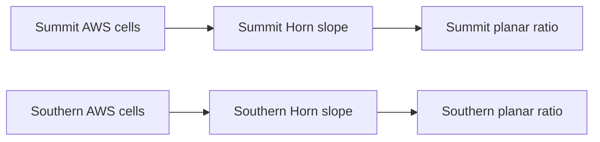

# Tryfan pilot S3 — retained derivation and lifecycle integration

## 1. Executive result

**C - S3 SUCCESS.** The retained pilot now persists four exact AWS terrain-derived records, their methods, actual input-use scopes and slope-to-ratio dependencies in complete baseline G0. Fresh processes reproduce native queries, freshness and pixel-based replay. Relevant changes stale only the affected chain; isolated Welsh-context recomputation produces two summit revisions while reusing both southern results. No applicability update is published. S1/S2 remain successful; S4-S6 have not begun.

## 2. Starting checkpoint

Clean `main` at `7db385a466ce74abae42c75f7613e18ac2207468`, fetched `origin`, existing upstream `origin/main`, divergence0/0. No newer legitimate commit or local work required reconciliation. Admission at `f16ce63`, planning at `7809147`, S1 at `b5ac715` and S2 at `7db385a` retain their decisions.

## 3. S3 objective

Construct persistent qualified derived understanding from explicitly registered evidence, assess policy-relative freshness and reproduce historical results. Generation context does not make every historical result stale; stale does not mean false.

## 4. Scope

Exactly [plan S3](tryfan-regional-pilot-plan.md#30-implementation-slices): two inherited terrain probes, each with Horn slope and dependent planar ratio; full G0, finite forward/reverse dependencies, current/fixed-input policies, replay and Q21 fixed place-evidence coordinator. The first real G0 is `e0e2d20a1d065c713e954283443c8a7762dd91ab00fa5856b1fe75d1860a51be`, parent `2ffa20f9ac33123c3babb62381ba4559cbd045fb180d978a9ed6228514ed9b92`.

## 5. Explicit exclusions

No HTTP/API, terrain/semantic delivery, client, applicability-update publication, generic DAG/workflow engine, background worker/scheduler, distributed processing, production database or final infrastructure. No Weather/Traverse/production Atlas integration, acquisition, source mutation, imagery correction or new physical analysis catalogue. S4-S6 remain unimplemented; appearance unresolved/non-blocking and Swiss multiview parked.

## 6. Authoritative foundations

The [pilot plan](tryfan-regional-pilot-plan.md), [lifecycle assessment](atlas-derived-understanding-lifecycle.md), [qualified Tryfan proof](tryfan-qualified-query-proof.md), [persistent proof](tryfan-local-persistent-proof.md), [world-model synthesis](atlas-world-model-architecture-synthesis.md), [TerrainHierarchy](../atlas/terrain-hierarchy-contract.md), [Tryfan regional proof](../atlas/tryfan-second-region-proof.md), [S1](tryfan-pilot-s1.md), [S2](tryfan-pilot-s2.md) and frozen [Semantic Evidence Contract v1](../atlas/semantic-evidence-contract.md) remain authoritative. Scientific receipt/method files are hash-pinned and unchanged.

## 7. Retained derivation set

Only `summit` at BNG `[266405,359387]` and `southern-observer` at `[265876.05347833806,358339.7631202109]`. Selector: `XYZ Web Mercator zoom (delivery)`, z14,24m eligibility half-width. Horn uses an8m 3×3 sampled represented-heightfield stencil; ratio=`sec(slope)`, an ordinary locally planar area ratio. G0 common-only applicability yields:

| Probe | Slope degrees | Planar ratio |
|---|---:|---:|
| Summit | 11.837956999552308 | 1.0217304696061646 |
| Southern observer | 8.811499729681492 | 1.011943302930815 |

These are represented-heightfield quantities, not verified bare earth, cliff/overhang area or effective source resolution.

## 8. Physical-question / method / result separation

The original question key retains property, CRS/place,8m analysis grain and represented-heightfield meaning. Its claim ID is independent of method/storage/publication paths. Claim revision hashes the original qualified body/context; receipt identifies method and exact uses; scalar materialization has a separate digest. Generation identity is surrounding context, never inserted into the frozen scientific claim.

## 9. Method identity/versioning

Exactly `Horn-3x3-grid-slope` and `planar-area-ratio-from-slope`, both revision `7fe3f0c3ed6152177dfcb97b7be190dcda8fd45ddb18b27c2a8eb2b2b398f8d9`. Reuse the original `derive`, `assess`, `validateSlice`, selector and sampler. Pins include three scientific files, input/result/plan receipts and Python3.12.6/NumPy2.5.3/pyproj3.7.2. Unsupported execution revisions fail; a prospective method policy can assess staleness without pretending that method has been implemented.

## 10. Input dependencies

Slope immediately uses one exact `retained-input:{family}:{probe}` revision, with immutable retained tile assets and their source/product relations. Ratio uses the exact slope claim/revision. Four immediate edges and four reverse-use keys are rebuilt at load. Missing upstream, identity collisions and invalid graphs fail validation. This is a finite two-stage graph, not arbitrary scheduling.

## 11. Input-use scopes

Persist the sampler’s full-precision bounds/native Mercator window and22 summit/20 southern consumed cells. Bounded BNG use is roughly `[266387.76,359370.77,266417.30,359400.24]` and `[265864.09,358324.54,265887.89,358353.86]`. Output point,16m stencil,48m eligibility rectangle, interpolation halo and whole-PNG I/O remain distinct. Ratio has immediate point support plus transitive terrain scope. Adapter source/manifest integrity checks do not imply every checked terrain pixel is a scientific dependency.

## 12. Persistence model

G0 extends the existing pilot store/v1 with `knowledge` and `understanding`; registration-only historical seeds remain valid. It includes the S2 v1 native bundle, terrain applicability, method basis, roots, complete original claims/contexts/receipts and four active result references. Source payloads stay external. S1 lock/stage/hash/flush/same-directory atomic-root switch and historical ancestry are reused unchanged. Generation files remain immutable; no separate mutable latest-derived table. Metadata/capability validation rejects incomplete knowledge, changed hierarchy, dangling inputs or altered scientific records before publication.

## 13. Freshness semantics

`current-applicable-terrain-v1` compares exact available inputs, current selector/context, explicit method policy and scoped notifications. `fixed-input-replay-v1` asks whether original bytes/method remain available for historical replay. Freshness is computed, never saved as unquestionable truth. Missing exact evidence or unknown change scope is indeterminate. Corrupt bytes fail integrity checks. Changed generation identity alone does not invalidate results.

## 14. Lifecycle matrix

The [prospective matrix](../../pilots/atlas/tryfan/lifecycle-matrix.json) freezes L01-L15 and inherited Q01-Q04/Q12/Q21 before evaluation. Baseline/repeat/restart; unchanged/unrelated-family/nonintersecting changes; halo/transitive staleness; selective retained Welsh recomputation/southern reuse; historical retention/replay; method policy and unavailable dependencies are covered. Notifications are explicitly synthetic applicability/scope diagnostics, not new observations or mutated source revisions. The [results](tryfan-pilot-s3-results.json) retain deterministic logical assessments separately from timings.

## 15. Unrelated-change behaviour

An NRW administrative notification changes no terrain dependency. A terrain notification outside actual consumption leaves all four fresh. A new isolated generation containing the same exact baseline produces a different publication identity while retaining fresh results; a reader already pinned to the earlier generation remains pinned. No blanket generation invalidation.

## 16. Relevant-change behaviour

A notification intersecting the summit interpolation halo stales its slope even though the output point is outside that tiny notification rectangle. Southern slope stays fresh. Unknown scope returns indeterminate rather than assumed freshness. The independently selected regional applicability context changes summit from common to Welsh while southern remains common at z14.

## 17. Transitive dependency behaviour

Summit ratio stales through its exact slope revision; an unrelated southern chain stays fresh. Missing upstream is rejected, never silently rebound to the latest slope. The frozen finite receipt validator checks the required acyclic slope→ratio relationship.

## 18. Selective recomputation

In isolated retained regional-context calculation, four results are considered, two summit results are computed and two southern records reused exactly. Only the selected Welsh summit tile is sampled for computation. Six revisions coexist with four current references. No regional fixture or U1/U2 update is published to the genuine pilot. Supported S3 publication rejects a regional applicability candidate; actual coherent update publication belongs to S5.

## 19. Historical retention

All four original AWS records survive in the six-record isolated fixture unchanged. Genuine G0 preserves the previous S1 seed and its ancestry. Exact result references remain inspectable; current preference is contextual, never destructive supersession. Retention is complete for this small pilot, with no GC.

## 20. Historical replay

Replay resolves logical aliases through registered S1 hashes/locators, reads the actual retained tiles and invokes the unchanged sampler/method. Four genuine baseline and six isolated historical/current records reproduce exactly, including claims/context/receipts. It is not scalar rereading or current-input substitution. Exact comparison is justified by the pinned software/runtime and deterministic local calculation; no physical accuracy tolerance is claimed. A safely relocated temporary tile copy also reproduces identical scientific aliases/IDs/results.

## 21. Method-revision behaviour

Requiring a different prospective method revision makes the current method-relative assessment stale. Historical fixed-input replay remains valid under the original implemented method. The prospective token is a policy diagnostic only; no fake new scientific method/result is produced. Executing an unsupported method revision is rejected.

## 22. Qualification/provenance

Queries expose the v1 quantity, unit, native point/support/grain, unknown terrain observation epoch, derived evidence mode, original method/processing/limitations and exact receipt. Trace follows ratio→slope→registered asset→representation/product/source→S1 generation and preserved rights. AWS global revision, contributors, surface meaning, datum and rights uncertainty remain unknown. Welsh qualification is preserved in isolated regional results. Filesystem locators stay outside semantic identity.

## 23. Failure semantics

Explicit errors cover unavailable understanding, invalid policy/CRS/support/change scope, unknown method/revision, missing exact result/upstream/root, invalid active refs, corrupt claim/receipt/artifact, changed scientific/software basis and incomplete knowledge. Missing exact source bytes yield indeterminate freshness and failed replay, never zero slope or physical absence. Public inspection/result copies cannot mutate retained in-memory state. Process-failure atomicity remains S1’s local single-writer guarantee, not distributed/power-loss safety.

## 24. Fresh-process reproduction

Five independent CLI processes recover published G0 and reproduce Q21 byte-identically. Separate fresh inspection and pixel-replay subprocesses load methods, roots/scopes, graph and historical records from persisted state. An explicit isolated six-result context is also serialized, loaded and validated by a fresh worker against its pinned G0 catalogue, replaying all six records and recovering four current/two stale assessments without publishing that fixture. Q21 pins one generation across terrain selection, slope, ratio, WorldCover30 Grassland, NRW D.1.1 historical habitat and July appearance metadata; times/supports remain separate. No merged land-cover/current-state answer.

## 25. Measurements

Two methods/four baseline results/four dependency edges/two actually consumed terrain assets;310 registered artifacts/42,473,107 bytes unchanged. Catalogue324,627 bytes, native knowledge624,956, understanding78,131, full generation1,085,705. Five-run baseline median436.85ms;30-run freshness median10.00ms;five-run selective recomputation median443.22ms. Fresh Q21 median2267.73ms (five runs). First initialization build2,253.06ms, validation458.79ms, root switch4.32ms; later understanding-only load220.51ms. Aggregate Node RSS259,768,320 bytes includes Vite/reused contexts and excludes Python process attribution. These are observations, not SLAs; all timings/logs remain outside immutable identity.

## 26. Tests and validation

Focused29 S3 tests cover retained/repeated derivation, dependency metadata, spatial/method/current/replay freshness, missing/corrupt inputs, selective computation, history, exact pixel replay, relocation, public-object isolation, Q21 and fresh processes. Regression runs the existing33 S2 tests,9 native Python cases,22 S1 tests,22 planning safeguards,64 frozen domain tests, retained qualified-query/persistent-proof tests and frozen semantic TypeScript check. The [validation receipt](tryfan-pilot-s3-validation.json) verifies310 pilot/1,575 admission artifacts, all42 unchanged historical statuses,113 protected production hashes, historical reports and frozen contracts/tooling. Historical S1/S2 no-later-slice receipts remain preserved rather than being rewritten as current-stage gates. Repository `npm.cmd run lint` and `npm.cmd run build` also pass; the existing large-bundle/plugin-timing build warnings remain informational.

## 27. Plan deviations

No conceptual, scientific or technology deviation. Small S3 supporting files provide the locator bridge, fixed query coordinator, developer CLI and measurements/validation. The pilot generation validator is extended for complete G0 while retaining seed compatibility. The S2 test now checks the historical seed’s false query capability separately from G0’s true capability; native S2 answers remain unchanged. The read-only bridge adapts storage addressing, not the scientific sampling/formula/revision. No frozen file is modified.

## 28. Risks discovered

G0 whole-metadata size is about1.09MB, with most of the increment native NRW knowledge; still small and inspectable. Repeated conservative validation/hash checks add query overhead; measure before optimizing. Missing referenced files stop replay; immutable manifests cannot ensure external availability forever. The finite original sampler also verifies retained Welsh manifest/source checks even for AWS historical replay, a reproducibility precondition distinct from actual physical input use. BNG grid metres, quantized Terrarium heights, unknown source datum/epoch and incomplete upstream lineage limit physical interpretation. No universal scheduling/global invalidation/real-time update or production performance proof.

## 29. Remaining pilot work

S4: generation-pinned integrated serving and isolated consumer. S5: actual U1 scoped update, U2 mixed-family applicability publication, race/interruption and reader continuity. S6: integrated measured A–P exit suite. S3’s baseline publication and isolated lifecycle calculations do not close mixed-family update or integrated serving acceptance. Appearance remains unresolved/non-blocking, Swiss multiview parked.

## 30. Decision A/B/C/D

**C - S3 SUCCESS.** Exact retained methods/results, persistent actual dependencies/scopes, computed freshness, selective retained recomputation, unaffected reuse, historical retention/replay and fresh-process recovery meet the third bounded slice. No foundational blocker or prerequisite for S4 is demonstrated. This is neither full pilot acceptance nor current physical truth.

## 31. Exactly one next bounded task

**Tryfan pilot generation-pinned serving and isolated consumer - S4 only.** Implement the fourth planned slice with read-only generation-pinned local delivery/query/provenance and the isolated consumer; preserve existing semantics and measure it. S4 has not begun.
