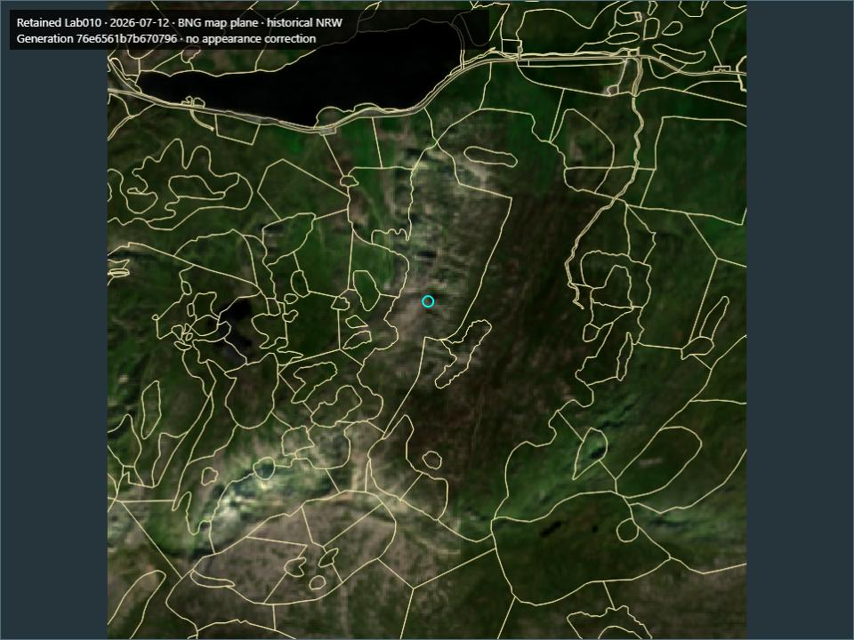
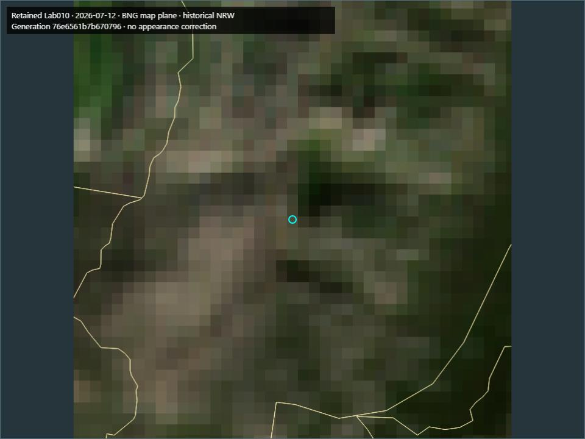

# Tryfan pilot S4 — generation-pinned serving and isolated consumer

2026-10-07. Fourth bounded regional-pilot slice.

## 1. Executive result

**C - S4 SUCCESS.** A read-only loopback service exposes qualified native evidence, retained derived understanding, portrayal artifacts and provenance through generation-addressed routes. A separate consumer process stays on G1 while a separate S1 writer publishes G2; a new consumer pins G2. The Canvas2D consumer uses only the serving boundary. No scientific applicability update, recomputation, production integration or S5 implementation occurs.

[Results](tryfan-pilot-s4-results.json), [validation](tryfan-pilot-s4-validation.json), [scenario matrix](../../pilots/atlas/tryfan/serving-matrix.json) and [developer instructions](../../pilots/atlas/tryfan/README-S4.md) provide reproducibility. S1/S2/S3 remain successful. This closes the bounded integrated-serving implementation test, not mixed-family publication or full pilot exit.

## 2. Starting checkpoint

Clean `main` at `337a3c4c2408ee9e471b37b92b8a23b6e0088b42`; fetched origin and verified existing `origin/main`,0/0 divergence. No newer legitimate work or local changes required reconciliation. Starting G0 was `e0e2d20a1d065c713e954283443c8a7762dd91ab00fa5856b1fe75d1860a51be`. Nothing was discarded.

## 3. S4 objective

Make an independent consumer read one coherent retained generation through a versioned local boundary. Evidence, derivations, freshness context and portrayal must remain pinned even while the mutable publication pointer changes. Storage internals remain service responsibilities.

## 4. Scope

Exactly [planned S4](tryfan-regional-pilot-plan.md#30-implementation-slices): Node builtin HTTP, one shared bounded native worker, immutable delivery manifest/materializations, finite read queries/provenance, exact terrain/image delivery and isolated Canvas2D/browser/process consumers. Core remains9km² EPSG:27700 `[264900,357800,267900,360800]`; five families,310 retained artifacts/42,473,107 bytes. The prospective24-scenario matrix and display recipe were written before evaluation.

## 5. Explicit exclusions

No U1/U2 applicability publication, mixed-family scientific update, new method or derived result, silent recomputation, scheduler, HTTP writes, authentication/accounts/billing, public service, cloud/database decision, Weather/Traverse/production Atlas change, new evidence or private access. No imagery correction, normalization, shadow recovery, albedo, physical lighting or terrain research. No S5/S6 implementation. Public Git/R&D, licensing and repository boundaries are unchanged.

## 6. Authoritative foundations

Reuse the [pilot plan](tryfan-regional-pilot-plan.md), [admission](atlas-regional-pilot-acceptance.md), [S1](tryfan-pilot-s1.md), [S2](tryfan-pilot-s2.md), [S3](tryfan-pilot-s3.md), [world-model synthesis](atlas-world-model-architecture-synthesis.md), [persistent proof](tryfan-local-persistent-proof.md), [qualified proof](tryfan-qualified-query-proof.md), [Semantic Evidence Contract](../atlas/semantic-evidence-contract.md) and [Terrain Hierarchy Contract](../atlas/terrain-hierarchy-contract.md). Frozen scientific/semantic functions are reused. A transport projection converts retained locators/proof filenames into opaque service references without changing native codes, physical values, method/result identity, mapping loss or temporal meaning.

## 7. Serving boundary

[server.mjs](../../pilots/atlas/tryfan/server.mjs) is loopback-only `127.0.0.1:4191`, with an explicit override. [delivery.mjs](../../pilots/atlas/tryfan/delivery.mjs) owns generation-pinned contexts, portrayal and finite provenance. Query/current use `no-store`; immutable assets use SHA256 ETags, generation headers and rights links. No wildcard CORS, remote fallback or arbitrary path route. Body limit64KiB, worker queue32/30s watchdog, read buffer64MiB and16 retained service contexts; restart explicitly at the finite context limit. No query or byte cache.

Routes follow the plan: current bootstrap; generation manifest; POST generation query; generation provenance; generation asset bytes; generation terrain family/z/x/y PNG; same-origin static consumer. Only bootstrap/static code are unpinned. The service accepts complete generations on the current publication ancestry; a staged or pre-switch orphan is not served as published truth. Explicit rollback ancestry semantics are bounded; detached orphan/later-branch publication history is not a public archive API.

## 8. Generation-pinning semantics

Bootstrap selects current once. All subsequent consumer data URLs embed that immutable generation. Node opens S2/S3 with the exact generation, never with a later independently read current root. Every combined Q21 component echoes the same generation; freshness is computed against that pinned context. Refresh builds the entire next scene before swapping it; late old-scene/query responses are ignored. Refresh does not mutate an existing generation.

The genuine current serving generation is `76e6561b7b670796d111c36981ccb976cb101dbeeacddf7301ca83dc91f80431`. Its parent `6d8a127e4924d3b165f143fbeaab39467e4b0e45addf706e648e9c2c2bc948b6` retains the initial serving materialization registration; the successor adds explicit298 XYZ bindings. Both administrative serving states preserve identical catalogue, knowledge and four-result understanding. All earlier S1/S3 generations remain immutable. No new scientific source release is fabricated.

## 9. Consumer-visible query model

Use the finite `atlas-tryfan-query/v1` place/property/time/policy/evidence/resultRef request and existing qualified envelopes. Serving schema is `atlas-tryfan-serving/v1`. Consumers know generations, source/product/representation refs, native claims, supports, times, methods, freshness and service URLs. They never open catalogue/generation/data files. Native support/record hrefs remain string references, now resolvable through the service; physical identifiers and selectors survive. There is no general language, public SDK or forever-public compatibility promise.

For retained derived-slope/area-ratio only, an optional explicit `methodRevision` requests S3's existing policy-relative assessment. A named prospective, unimplemented policy fixture produces stale status without executing that method, changing a result or publishing anything.

## 10. Qualified native evidence serving

WorldCover native2021 code30/Grassland and lazy cell/support bindings survive; inherited400m summit counts are3096 (10:29,30:3039,60:28). Southern/northern counts remain the S2 cases. NRW feature486832/D.1.1 retains source identity, native attributes, original vector support, historical/unknown survey time and qualified mappings. Coexistence returns both families without ranking or category merge. Unsupported current cover/geology/physical appearance do not borrow unrelated evidence. Native source gaps remain distinct from infrastructure failure.

## 11. Derived-result serving

Serve the original two-probe slope/area-ratio chain, explicit Horn method revision and actual-use/dependency receipts. Summit values remain11.837956999552308 degrees and1.0217304696061646; southern8.811499729681492 and1.011943302930815. Historical exact result refs remain explicit. S3 freshness remains policy-relative, stale does not mean false, and query never recomputes. Missing dependencies cannot become falsely fresh.

## 12. Consumer isolation

[client/view.mjs](../../pilots/atlas/tryfan/client/view.mjs) has no Atlas/storage/domain imports. The browser owns camera, screen positioning and presentation; the service owns CRS transforms, selection, qualified answers and provenance. The separate process consumers import only Node readline where needed and use built-in fetch. Dependency tests reject internal readers/stores/file access. No production MapLibre/App/Weather/Traverse imports or changes.

## 13. Process isolation

Focused tests start a fresh HTTP service process, a boundary-only persistent consumer process and a separate writer process. Another fresh service plus one-shot consumer reproduce Q21 and exact148,616-byte Lab010 delivery. Five independent service/consumer starts produce identical answer hashes. No module globals or construction history cross this boundary.

## 14. Publication-transition scenario

Consumer A pins G1 and queries. A separate S1 writer publishes a same-evidence administrative successor G2 by the existing atomic root switch. A then queries again and all six Q21 components remain G1; B bootstraps after publication and all components are G2. A cannot repin itself silently. Tests also serve real generation-addressed assets and compare exact hashes. This proves pinned-reader continuity; it deliberately does not exercise S5 U1/U2 mixed-family scientific changes.

## 15. Historical-generation behaviour

Explicit G1 requests continue returning G1 after G2 becomes current. An unknown generation returns404; incomplete/staged candidates are not adopted. A historical registration/G0 generation without a serving closure returns explicit serving-unavailable rather than silently upgrading. Published ancestors and original derived results remain inspectable through their respective S1/S3 tooling. Source/serving history is not deleted.

## 16. Provenance and qualification

Generation manifests expose family/source/product/representation IDs, rights URLs, native grid/footprint/time and immutable asset hashes. Finite provenance routes expose contributor/source/product/representation references and four retained derivation receipt/lineage records; source artifacts remain hash-identifiable. Proof/source references resolve to service references rather than filenames. No catalogue dump, source ranking, current truth or calibrated appearance claim.

WorldCover portrayal is deterministic334×554 RGBA, fixed palette, nearest sampling and core-support alpha. NRW export contains193 CRS84 features plus unchanged native BNG support geometry/fields; no clipping/repair/rasterization. Exact Lab010 bytes retain the existing fixed recipe. There are298 registered terrain PNG bindings:295 Welsh plus three common; common z13 is unavailable. Registered Welsh tiles do not become applicable merely because bytes can be inspected.

Matched960×720 views use equal BNG map scale and letterboxing. Full-core and400m summit/south/north checks preserve source pixels/footprint, date, outlines, legend and generation labels. Manual inspection verified those views and the native-grid/terrain inspectors; dense historical outlines can obscure small image detail and can be toggled. This does not close the original pending Lab010 Unreal fixed-camera gate.

These small JPEG QA views are illustrative, not primary radiometric evidence. Exact PNG QA and hashes remain outside Git and are reproducible.

## 17. Failure and status semantics

400 malformed request/CRS/policy/body/origin;404 unknown generation/ref/asset;503 registered evidence/serving bytes unavailable, checksum/state/worker failure. A valid semantic unsupported/outside/mapping/nodata gap returns200 and retains its native qualification. A503 query may retain a qualified unavailable envelope. There is no null fallback. Native zero is not-classified rather than non-detection; actual retained WorldCover has no zero cells, so labelled native fixtures/previous S2 tests establish that branch without inventing real observations. Method-policy staleness remains an explicit retained answer, not an error or correction.

Errors returned to consumers omit internal physical paths. Missing assets are not acquired, repaired or replaced. Conditional ETag requests still verify bytes before304. A worker failure requires explicit service restart; there is no hidden recovery/source substitution.

## 18. Determinism

SHA256 canonical generation/manifests and deterministic PNG/GeoJSON recipes persist outside Git. Rebuilding from the same evidence/recipe gives identical serving content; parent lineage deliberately affects generation identity. HTTP repeats and projected CLI answers are semantically identical. Clocks, memory and latency samples stay outside identity. The source/product/result IDs are not storage paths. Worker sharing keys use registered content/support, not movable locators.

## 19. Fresh-process reproduction

Five independent service loads/consumer starts agree. Focused tests restart against an explicitly historical generation after publication and verify both qualified query and artifact delivery. The independent measurement rerun checks logical response, manifest, recipe, matrix and source hashes. Consumers need only a loopback URL and optional generation. Required retained artifacts and registered scientific environment must still exist; immutable identity alone does not ensure availability.

## 20. Measurements

Full generation1,212,494 bytes; serving manifest118,600; two rebuildable artifacts3,057,491 (WC PNG6,158, NRW GeoJSON3,051,333). Existing Lab010 PNG148,616 bytes is referenced rather than duplicated. Catalogue/knowledge/understanding identities and all310 sources remain unchanged.

Five fresh service+consumer runs3.448–3.606s. Warm20-run medians: WorldCover213.41ms, NRW222.67ms, slope244.22ms, Q21304.72ms.100 requests total in each controlled workload: one reader median224.44ms/p95274.06; four readers median904.72ms/p951152.02, zero errors. Node RSS338,264,064 bytes after that workload, excluding Python. Full raw samples, response hashes/sizes and server read counts are in the receipt. OS caches were warm, no query/byte cache, and repeated conservative whole-metadata/integrity checks are visible costs. These are local observations, not SLAs, internet capacity or full S6 performance acceptance.

## 21. Tests and validation

Twenty-one focused HTTP tests cover the24 prospective scenarios plus rebuild/source checks, separate-process publication/consumption and byte delivery. Actual browser checks cover pan/zoom/click/layers/provenance/refresh and all generation-addressed data reads, with no page errors. Established29 S3,33 S2,22 S1,9 native Python,22 planning and64 frozen domain tests, retained qualified/persistent proofs, semantic TypeScript, lint/build and stage-aware integrity/navigation checks are recorded in the validation receipt. Historical reports,42 statuses,113 protected production hashes and all retained datasets remain intact. Earlier stage-specific receipts are preserved rather than rewritten as current-stage gates.

## 22. Plan deviations

One reversible pilot-level correction: planned port4190 is on Fetch's unsafe-port list; the shipped Node24 Fetch runtime rejects it before transport with `bad port`. A Chromium navigation probe instead reached connection refusal on the closed port, so no browser unsafe-port rejection is claimed. Default4191 is usable, still loopback and explicitly overridable. No foundational contract/architecture or scientific change. This is a protocol/runtime detail, not a production technology decision. Existing S1 validation gains serving closure, S2 gains one shareable worker with per-read integrity, S3 closes its Vite loader after imports and exposes existing read-only assessment; scientific/query/lifecycle meaning is preserved.

## 23. Risks discovered

Repeated full-generation/ancestor and integrity validation adds measurable latency and whole-file read amplification. The3.05MB vector display export duplicates coordinates for honest native/display supports; it is bounded/rebuildable, not canonical knowledge. Finite16-context service and32-request worker queue require explicit restart/overload responses, not production scaling claims. Current-ancestry history does not serve arbitrary detached branches. Partial missing native evidence can be inspected honestly, but changing worker initialization availability requires restart. Physical geometry/semantic age/appearance uncertainties remain. No distributed consistency, public security/authentication, global serving or production performance is established.

## 24. Remaining pilot work

S5: retained U1 scoped and separate U2 mixed-family applicability publication, interruption/retry and reader continuity. S6: integrated A–P measured exit, independent rebuild and complete workload/replay accounting. S4 serves the accepted common-only scientific G0; it does not activate Welsh or revise NRW eligibility. Appearance unresolved/non-blocking; Swiss multiview parked.

## 25. Decision A/B/C/D

**C - S4 SUCCESS.** Generation-pinned qualified serving, storage-isolated consumer, publication transition, history, explicit failure states and fresh-process reproduction work within the planned reversible local boundary. No foundational blocker for S5 was demonstrated. This is not public API readiness, production integration or complete pilot acceptance.

## 26. Exactly one next bounded task

**Tryfan pilot scoped and mixed-family publication with interruption - S5 only.** Implement the fifth planned slice with actual U1/U2 retained applicability scenarios, coherent publication and failure/restart tests. S5 has not begun.
