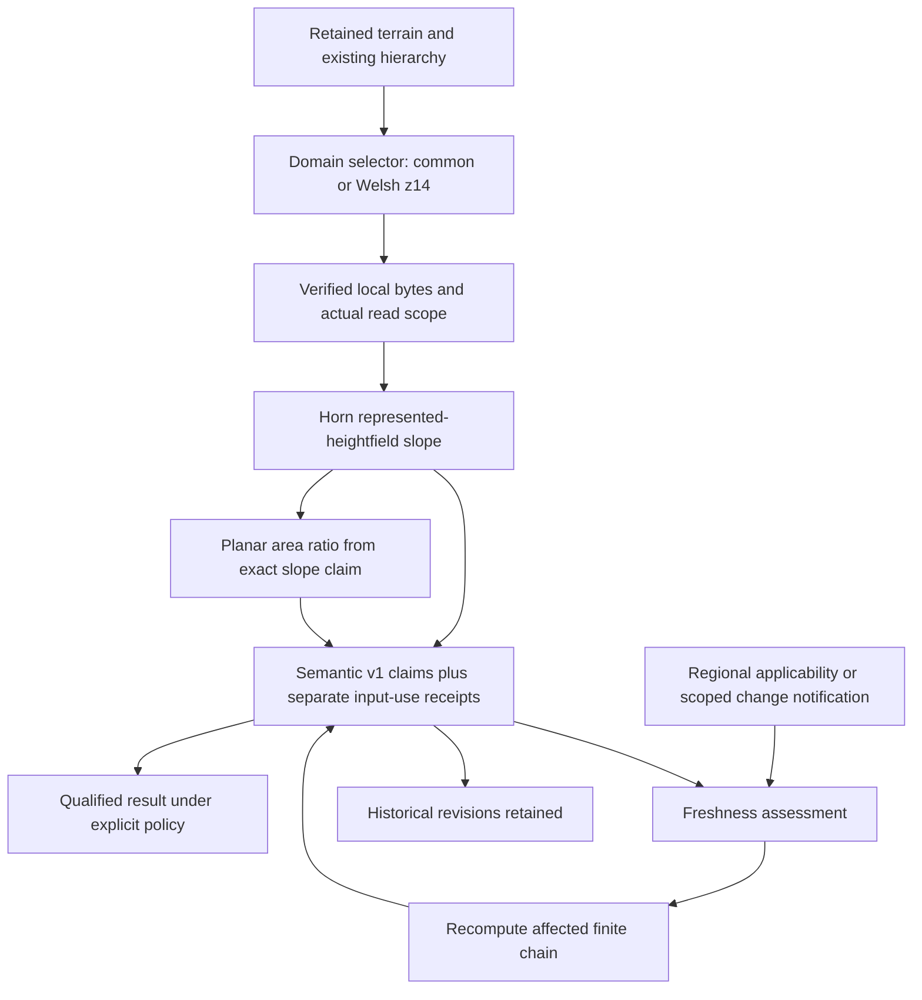

# Retained Tryfan proof of qualified queries and revision lifecycle

2026-10-06. Research-only integrated vertical proof after `6e17e79`, [Atlas world-model architecture synthesis](atlas-world-model-architecture-synthesis.md). Starting HEAD `6e17e7923f2130b2cfce3671e026fe56b6397f5f`, clean `main`; `git fetch origin` completed and `main...origin/main` was **0/0**. No newer commit or unrelated work required reconciliation; nothing was discarded.

## 1. Executive result

**Decision C — SUCCESS.** Retained terrain, the existing TerrainHierarchy selector, frozen Semantic Evidence Contract v1 and a small separate dependency receipt compose in a working local proof. Two fixed Tryfan queries initially use AWS terrain. When the existing Welsh regional hierarchy becomes applicable, only the summit slope and its dependent planar area ratio recompute. The southern pair remains fresh. All four original AWS results remain referenceable and reproducible; two Welsh revisions become preferred under the explicit current-applicable policy.

This is operational evidence for the bounded architecture slice, not a production world model, terrain-accuracy result, universal source ranking or global lifecycle engine. No foundation or frozen contract change was needed. Actual changed-input notifications are tested synthetically; retained terrain is never edited. Temporal change, semantic inference and general feature resolution are not exercised numerically.

Artifacts: [frozen plan](tryfan-qualified-query-plan.json), [pinned inputs](tryfan-qualified-query-inputs.json), [deterministic results](tryfan-qualified-query-results.json), [validation receipt](tryfan-qualified-query-validation.json), [research implementation](../../scripts/atlas/qualified-query-proof/proof.ts), [offline runner](../../scripts/atlas/qualified-query-proof/run.mjs) and [focused tests](../../scripts/atlas/test_qualified_query_proof.mjs) and [integrity/reproduction checker](../../scripts/atlas/qualified-query-proof/validate.py).

## 2. Purpose and scope

The question is whether qualified queries, reproducible understanding and scoped revision handling cooperate using retained real evidence. The foundations are [synthesis](atlas-world-model-architecture-synthesis.md), [lifecycle assessment](atlas-derived-understanding-lifecycle.md), [semantic v1](../atlas/semantic-evidence-contract.md), [TerrainHierarchy](../atlas/terrain-hierarchy-contract.md), [generic selection](../atlas/terrain-runtime-selection.md), [Welsh proof](../atlas/tryfan-second-region-proof.md) and [information limits](../atlas/information-aware-display-selection.md). Their closures remain authoritative.

Only two locations, one delivery level, one ordinary slope method, one transparent downstream quantity and two freshness policies are implemented. There is no general query API, graph scheduler, persistent store, server, semantic ingestion pipeline, inference or rendering. No datasets, imagery or Swiss frames were acquired. Production, analytical AWS z15, exaggeration 1.45, IGOR, MapTiler/satellite behaviour, Weather, Traverse and lifecycle remain unchanged.

Evidence classifications: **retained fact** comes from linked prior reports/metadata; **measured proof result** is produced here; **synthetic test** exercises a stipulated change or mathematical case; **interpretation** is an architectural consequence within this proof's limits.

## 3. Retained Tryfan evidence

The existing 9 km² source window is `[264900,357800,267900,360800]`, EPSG:27700. Inputs are retained AWS Terrarium tiles and `tryfan-welsh-regional-v2`, a coherent Welsh-source terrain pyramid. The Welsh source subset SHA256 is `49c131d7de62e0df35f8e02c2f8db3161bfd37f24fea56060fcbb9e6d109b326`; prepared product revision is `db8e4d87b5fa609d455d1e0f8ec3fdebc834579a7e102f69f4d0b0283efa690c`; manifest SHA256 is `b254a21b1ec346cc07b43d269d937b059851e95ac168565359a81d3872c69e54`. All are checked without rewriting those files.

The [plan](tryfan-qualified-query-plan.json) froze at `2026-10-06T16:23:43.442342+00:00`, before terrain pixel inspection. It reuses established locations rather than choosing an interesting numerical difference:

| Probe | EPSG:27700 centre (E,N) | Request support | Purpose |
|---|---|---|---|
| summit | `(266405,359387)` | 48 m square about centre | Existing summit/semantic benchmark; regional z14 support applies |
| southern-observer | `(265876.05347833806,358339.7631202109)` | Same 48 m square | Existing observer location; regional z14 complete support does not apply, providing an unaffected common control |

Eligibility envelopes are densified and transformed to CRS84 for the existing selector. Numerical coordinates are reproduction inputs, not a claim of centimetre survey accuracy. The pinned PROJ diagnostic does not report a resolved operation/accuracy (`declaredAccuracyM = -1`); roundtrip and snapshot consistency checks establish computational alignment, not geodetic accuracy. Source observations, effective resolution and cell epochs are not inferred from these coordinates.

Only three retained PNGs are sampled: AWS `14/8010/5328` and `14/8009/5329`, Welsh `14/8010/5328`. Together they are **320,857 bytes**. The pinned input record holds 27 interpolated height values, geometry, exact PNG hashes and consumed scopes. No large source raster/pyramid is copied. The 15,639,072-byte Welsh subset is read for integrity hashing, not regenerated or duplicated. Frozen Welsh manifest/selected tile hashes are checked; AWS exact *local retained bytes* are pinned here, without inventing an upstream global release.

## 4. World-model slice exercised



TerrainHierarchy retains eligibility, support and fallback responsibilities. V1 retains claim meaning, space/time, evidence lineage and rights. The companion receipt records actual input use, exact revisions and process details. Policy assessments choose current usability without rewriting any of those historical objects. There is no universal terrain/semantic/rendering object.

## 5. Query/resolution model

The research request fixes location/support, delivery scheme and z14, an 8 m BNG analysis grid, the requested physical quantity and freshness policy. The representation purpose is a numerical quantity of the *represented heightfield*, not visual mesh lighting or route analysis. Exact epoch is unknown; no current-world state claim is fabricated.

The before-context is the registered Tryfan declaration with regional families removed, representing retained common-only applicability. The after-context is the unchanged `createTryfanTerrainProof()` registry. Both call the existing `selectTerrain()` function with the same footprint/scale. No alternative source-ranking mechanism is introduced. The after trace selects Welsh at the summit and falls back to AWS at the southern observer because complete regional level support is absent there.

Returned research records resolve to a v1 claim and shared context: quantity/value/unit, support/grain, observation-time unknown reason, exact evidence/processing references, limitations, root assets and input-use receipt. Current-result entries identify `preferredUnder: current-applicable-terrain-v1`; the accompanying assessments retain policy revision, hierarchy baseline, expected method revision, change-notification digest and reason. Preference is policy-specific, not intrinsic truth or confidence.

## 6. Derived quantities and methods

Nine heights are sampled on a north-first 3×3 BNG grid at ±8 m. The offline adapter transforms each sample to Web Mercator and bilinearly interpolates decoded pixel-centre Terrarium values, `h = R*256 + G + B/256 - 32768`. Encoding quantization is 1/256 m, not measurement precision. No displayed geometry or immutable product is modified.

Ordinary Horn weighted differences use 8 m horizontal spacing:

`gx = ((NE + 2E + SE) - (NW + 2W + SW)) / (8d)`

`gy = ((NW + 2N + NE) - (SW + 2S + SE)) / (8d)`

`slope = atan(hypot(gx,gy))`, reported in degrees. The downstream quantity is `1/cos(slope)`, the area ratio of a **locally planar represented surface** to its map-plane projection. This dimensionless ratio can exceed 1; it is not a fractional cover, probability, observed rough-surface area, exposure or application judgement. Standard slope methods were already reviewed in [terrain literature](literature/terrain-representation.md); no algorithm comparison is made here.

The 8 m analysis spacing and 16 m stencil span are method scale, not source information resolution. Welsh 1 m is distributed/source-grid sampling; delivered z14 sampling is coarser. AWS local effective resolution, surface contributors and vertical meaning remain unknown. BNG grid distance approximates physical horizontal distance; no datum fusion or vertical correction occurs. AWS and Welsh results therefore concern the same qualified *representation question*, not an established common bare-earth truth.

## 7. Dependency description

A finite research companion sits beside v1, which is unchanged. Each receipt records:

- process identity/revision and scientific parameters;
- one exact resource or upstream-claim identity/revision, with dependency role;
- actual consumed spatial scope and explicitly unknown temporal scope;
- a scalar computational-artifact checksum separate from claim identity.

Slope directly depends on the retained selected input subset. Area ratio directly depends on the exact slope claim revision, not a vague terrain-source name. Its transitive terrain use is recovered through that slope receipt. Complete immediate inputs do not imply complete upstream measurement lineage: v1 limitations explicitly retain that distinction.

The companion uses existing known/unknown entity-reference concepts where applicable. Its spatial bounds, method/input-use and policy-assessment records are research-only. It neither extends v1 nor freezes a second contract. Focused checks reject missing exact inputs, invalid bounds and a self/cyclic area-to-area dependency in this explicit two-stage chain. A generic DAG engine is not implemented.

## 8. Actual input-use scopes

Output support is a point derivative; input use is larger. At each sample bilinear interpolation consumes neighbour cells. The adapter records their native pixel window/count and the bounding rectangle of all source-cell footprints. That rectangle is densified into BNG with a 0.01 m numerical guard; the full rectangle remains inside the frozen 48 m eligibility envelope.

| Input subset | Consumed cells | Conservative BNG bounds, rounded here to 0.01 m |
|---|---:|---|
| AWS summit | 22 | `[266387.76,359370.77,266417.30,359400.24]` |
| Welsh summit | 22 | Same delivered-grid footprint |
| AWS southern observer | 20 | `[265864.09,358324.54,265887.89,358353.86]` |

Full-precision reproduction bounds are in [pinned inputs](tryfan-qualified-query-inputs.json). Full-PNG I/O and asset hashing are distinguished from logical pixel consumption. Bounding rectangles are conservative: they may include unused cells. This is a scientifically sufficient coarse scope for this proof, not pixel-perfect influence tracking or a geodetic accuracy assertion.

A synthetic notification outside the Welsh read envelope leaves the slope and ratio fresh. A notification inside that conservative interpolation envelope but outside the output point marks both stale. Southern results remain fresh in both cases. Unknown change scope produces **indeterminate**, not a claimed non-impact. These notifications do not edit terrain, demonstrate physical change or prove a particular changed pixel's numerical influence.

## 9. AWS/common baseline scenario

Before regional applicability, the existing selector resolves both requests to common AWS z14. Four derived claims are computed in explicit dependency order. Each exact local root is pinned by its height encoding and PNG checksum, while the hosted product release, local contributors, cell epoch, surface semantics and effective resolution remain unknown.

| Probe | Baseline slope (degrees) | Baseline planar area ratio |
|---|---:|---:|
| summit | 11.837957 | 1.021730 |
| southern-observer | 8.811500 | 1.011943 |

These are reproducible calculations on delivered retained terrain, not independent measurements. Rounded displayed digits aid comparison; serialized digits preserve deterministic replay rather than scientific precision. No quality/confidence number is attached.

## 10. Welsh regional refinement scenario

The unchanged regional registry selects Welsh z14 only for the summit envelope. The old summit chain is stale under current applicability; the runner recomputes slope then its ratio. The southern chain is reused without recalculation.

| Probe | Current representation | Current slope (degrees) | Current planar area ratio | Work |
|---|---|---:|---:|---|
| summit | Welsh regional z14 | 32.918524 | 1.191264 | Two new derived revisions |
| southern-observer | AWS common z14 | 8.811500 | 1.011943 | Two original results reused |

Six derived revisions are retained, four currently preferred; **two of four baseline results recompute**. This numerical change exercises refinement. The prior Welsh proof established source-family improvement; this task neither reassesses accuracy nor defines how large a slope difference is better. Global source information is not automatically fused with regional samples.

## 11. Freshness-policy comparison

| Historical result after refinement | Fixed-input replay | Current applicable terrain |
|---|---|---|
| AWS summit slope | fresh: exact retained bytes/method replayable | stale: selected regional representation differs |
| AWS summit ratio | fresh through exact slope dependency | stale transitively through slope |
| AWS southern slope/ratio | fresh | fresh: common fallback remains selected |
| New Welsh summit slope/ratio | fresh | fresh and preferred |

**Stale is not false; fresh is not scientifically validated.** Fixed replay is restricted to verified retained snapshots and available method/receipts, not a claim that upstream AWS observations are recoverable. Current applicability is evaluated among retained registered evidence under a declared hierarchy; it does not assert that the live world's most recent terrain has been discovered.

Unavailable input or upstream claim makes assessment indeterminate. Unknown scoped change also makes it indeterminate. A tested hypothetical method-v2 requirement makes v1 stale only under the explicit current-method policy; fixed replay remains possible. That label-only synthetic test demonstrates coexistence/revision handling, not a better algorithm or an actual method correction.

## 12. Derived-on-derived lifecycle

`retained terrain subset → exact slope claim revision → planar area-ratio claim revision` is the entire implemented chain. Direct dependencies and revisions remain explicit. Current-policy staleness propagates from the historical summit slope to its dependent ratio. Recompute occurs in that order; no other result is scheduled. Removing the exact slope dependency cannot silently substitute another revision: assessment returns indeterminate and receipt validation rejects it.

The unrelated southern chain remains fresh. Transitivity is exercised for two levels, not claimed as an implemented arbitrary graph, cyclic physical model or distributed recomputation system. Further depth can reuse this boundary later, but has not been measured here.

## 13. Unknown/unavailable behaviour

Two distinct queries expose honest limits:

1. **Current exposed mineral fraction:** v1 returns a gap with reason `unsupported`. Terrain derivatives and the retained coarse habitat/cover comparison do not establish a validated fine/current fraction. It is not zero, non-detection or physical absence.
2. **Terrain requiring spatial contributor provenance at the southern observer:** the existing selector returns `unavailable`, with a spatial-contributors-unavailable trace. It does not fabricate AWS contributor metadata or silently satisfy a stricter query with an incompatible source.

The retained [semantic comparison](../atlas/source-native-semantic-comparison.md) supplies native context, without fresh data ingestion or classification. Its summit 400 m window contains WorldCover 2021 counts: tree cover 29 cells, grassland 3,039, bare/sparse vegetation 28. These remain source-native *window classifications*, not labels at the slope point or mineral fractions. The context record carries the original result file/hash and bounds. This is a read of existing diagnostics, not a populated semantic raster binding.

## 14. Provenance and identity

The qualified question identifies property, fixed location, analysis scale and represented-heightfield meaning. AWS and Welsh versions share that question and stable claim ID; their claim revisions, exact input revisions, processing receipts and scalar artifacts differ. Native physical property definitions are only the proof's two quantities and one unsupported question, not a terrain ontology.

V1 preserves native property, quantity/unit, evidence mode `derived`, exact root/upstream claim references, processing revision/parameters, point support, unknown observation time, limitations and shared rights. Each derived collection is bound to its derived product, with recoverable root-product obligations. AWS delivered-mosaic rights and Welsh source/product rights are reused from existing metadata; no new licence claims or survey are made. Uncertainty/epoch/height limitations survive selection and derivation.

The method revision hashes all three implementation files, frozen plan and sampler versions. Individual receipts identify methods and actual input use. Exact local content hashes are distinct from upstream product revision knowledge. The proof does not silently replace unknown AWS measurement history with its new local checksum.

## 15. Materialization behaviour

Question/claim identity does not contain a cache path. A receipt identifies the process invocation, its exact input and method revision; claim revision identifies qualified evidence/value; scalar artifact checksum identifies numeric bytes. These are separate roles even when one run yields one result.

The full deterministic proof is **92,034 bytes**, serialized in Git as lightweight diagnostics and as a separate content-addressed research artifact under `meridian-data/derived/atlas/tryfan/qualified-query-proof-v1/`. Reload returns identical qualified records; historical recomputation returns identical claims/receipts. No original source payload is duplicated, and no immutable retained product is changed. This bounded file materialization is not the persistent-world build, an artifact lifecycle manager or a storage architecture choice.

## 16. Determinism/reproducibility

Result SHA256: `871be961f6df0ff479c4ec935980eb35070e5a9363bcddc5fe73bfd6051fc3f2`. Input snapshot SHA256: `ab2062b81b7e84b749700cae13c499e837e0705de96c22192ef9ad2f6d13a9a7`. Full method revision: `7fe3f0c3ed6152177dfcb97b7be190dcda8fd45ddb18b27c2a8eb2b2b398f8d9`. Source asset hashes and code hashes are retained in the input/result records. Timings are printed separately and excluded from identity/deterministic output.

A representative checked run took approximately 1.33 s end-to-end, including interpreter/module startup, integrity checks and materialization comparison; the sampling phase was approximately 0.10 s. Tile input bytes were 320,857. These are one-machine, warm retained-file measurements, not memory, concurrency, network latency, large-scale throughput or cloud cost benchmarks. The source TIFF is hashed for integrity separately from reported tile bytes.

Reproduction from the repository root, with existing dependencies and retained data:

```powershell
node scripts/atlas/qualified-query-proof/run.mjs C:/Users/gbsam/Documents/Projects/meridian-data --check
node --test scripts/atlas/test_qualified_query_proof.mjs
node --test scripts/atlas/test_semantic_evidence_contract.mjs scripts/atlas/test_terrain_hierarchy_contract.mjs scripts/atlas/test_terrain_runtime.mjs scripts/atlas/test_tryfan_terrain.mjs
npx.cmd tsc -p scripts/atlas/qualified-query-proof/tsconfig.json
npx.cmd eslint scripts/atlas/qualified-query-proof/proof.ts scripts/atlas/qualified-query-proof/run.mjs scripts/atlas/test_qualified_query_proof.mjs
C:/Users/gbsam/Documents/Projects/meridian-data/earth-lab/.venv/Scripts/python.exe scripts/atlas/qualified-query-proof/validate.py
git diff --check
```

The runner has no acquisition path; PROJ network grid retrieval is explicitly disabled. A missing/changed tile, changed frozen manifest/source, changed software snapshot or changed pinned sample raises an error rather than reacquiring or silently refreezing inputs. `--freeze-inputs` is a first-freeze action that refuses an existing snapshot; do not use it for replay. Focused tests use small checked-in numerical records without access to large source data. Synthetic plane/flat/constant-offset and ratio checks validate mathematics; exact reruns validate numerical reproduction, not scientific accuracy.

## 17. Architecture evaluation

| Criterion | Observed proof | Limit |
|---|---|---|
| Composition | Existing selector, v1 validator and separate receipt cooperate | Research-only two-property coordinator |
| Identity | Same question/ID, distinct AWS/Welsh revisions | Qualified represented surface, not certified bare-earth identity |
| Provenance | Exact local bytes, method/code revision, upstream claim and root obligations retained | AWS original lineage/epoch remains unknown |
| Refinement | New Welsh summit pair preferred; old pair retained | Applicability policy, no universal evidence ranking |
| Freshness | Historical/current/stale/indeterminate/unavailable distinguished | Policy-specific retained context, not a live catalogue monitor |
| Scope | Outside notification no effect; read-envelope intersection propagates | Conservative bounds; no automatic changed-pixel detection |
| Transitivity | Exact two-level chain propagates and recomputes in order | No generic scheduler/cyclic model |
| Materialization independence | Serialization/replay preserves qualified identities | Small local artifact only |
| Extensibility | Domain selection stays domain-specific; v1 evidence stays independent | Semantic/time-varying derivations not operationally proven |

The **17 proof tests**, **64 frozen semantic/hierarchy/runtime/Tryfan tests**, strict proof TypeScript and scoped lint pass. The [validation receipt](tryfan-qualified-query-validation.json) records deterministic reruns, links, source/frozen-contract hashes, 113 protected production hashes, preservation of historical reports and the 42 unchanged status columns. Broader application build/tests are unnecessary because no shared runtime or dependency changes.

## 18. Contradictions or required changes

No foundational contradiction or failure criterion was encountered. V1 remains frozen and TerrainHierarchy remains unchanged. The companion description is sufficient for this two-level proof, supporting lifecycle conclusion C without creating a replacement semantic model.

Important limits remain: exact local artifact identity is not global source-release identity; asset hashing alone cannot tell where changed pixels lie; policy identity does not validate policy science; scalar derivative support is not an entire terrain patch; conservative input bounds can cause extra reassessment; nominal sampling is not effective information; source epochs/dynamic context can remain unknown. Temporal invalidation, optional context gains and arbitrary downstream graphs remain future implementation-validation cases, not contradictions or reasons to repeat closed terrain methods.

## 19. Implications for Atlas maturity

The synthesized architecture has now composed operationally through a retained evidence-to-query/update path. No unresolved foundational blocker was exposed. This justifies examining measured engineering requirements, rather than starting broad ingestion or directly building permanent infrastructure.

The [42-thread register](atlas-research-state.md) remains intact. Terrain, multiscale, physical-surface semantics and lifecycle foundations stay closed. H3 morphology interpretation and S4 LIMITED semantic-inference recoverability are not proven by slope calculations. S6 feature/state resolution and general runtime/catalogue materialization remain unimplemented. Appearance A6–A11 correction/illumination/reflectance/physical lighting and A14–A15 view selection/registration remain partial, parked or advanced under their existing gates. **A13 Swiss 2026 pixels remain PARKED**. No proof result depends on completing those branches, and none is silently closed.

Architecture maturity is not production maturity or global coverage. Broader source support, regional boundaries, operational dependency discovery, temporal products, rights at serving time and scale/cost validation must be tested before claiming those capabilities. Weather and Traverse consume separate qualified interfaces later; this proof introduces no atmospheric/application judgement.

## 20. Exactly one recommended next bounded task

**Atlas bounded storage, processing and serving requirements assessment informed by the retained Tryfan proof.** This follows the synthesis's measured-proof-before-storage sequence, not an automatic persistent-world build.

Use this proof's actual terrain read granularity, shared claim/provenance records, exact dependency uses, unchanged/result-revision sizes, historical replay, selective refinement and unknowns to identify engineering requirements. Inspect established adjacent approaches only where a concrete requirement needs them. Separate immutable evidence/revisions, mutable preference/freshness assessments, on-demand/cached/persistent materialization and payload-versus-metadata serving. Specify what minimum future regional implementation must measure; these tiny timings cannot select global infrastructure.

Exit when a small requirement/ownership/trade-off table and one bounded subsequent implementation-proof specification explain how qualified queries, local recomputation, historical provenance and rights can be stored/processed/served without changing physical identity. Do not choose or implement cloud services, a database, APIs, workflow engine, broad ingestion or production changes in that assessment. Begin only when separately authorized. No other new experiment or benchmark is recommended here.
