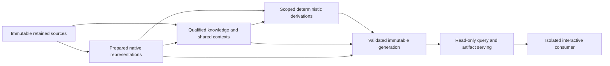

# Bounded retained Tryfan regional-pilot architecture and implementation plan

2026-10-07. Planning starts from clean `main` at **f16ce63e7c8fd85b6465b0e2cdcd1d872e36df54**. Repository inspection and `git fetch origin` confirmed the expected commit, `origin/main` upstream and **0/0** divergence. No newer legitimate commit or uncommitted work required reconciliation. No work was discarded.

## 1. Executive decision

**C - IMPLEMENTABLE AS PLANNED.** Implement a local, single-writer retained Tryfan catalogue with immutable metadata generations, external immutable evidence, a generation-pinned read-only HTTP service and an isolated interactive consumer. Six bounded slices advance it to exit acceptance. These are reversible pilot choices, not the final Atlas infrastructure.

The [admission assessment](atlas-regional-pilot-acceptance.md#33-regional-pilot-definition) passed all nine gates. It did **not** prove integrated serving or mixed-family coherent publication. This plan defines those tests; it does not claim they passed. The [machine-readable plan](tryfan-regional-pilot-plan.json) freezes inputs, queries, updates, interfaces, slices and acceptance. [Validation](tryfan-regional-pilot-plan-validation.json) checks the plan and retained evidence, not a working pilot. **No pilot implementation has begun.**

Exactly one next task: **Tryfan pilot retained catalogue and immutable generation foundation** (S1). Do not begin later slices in that task.

## 2. Pilot objective

Make one coherent regional world model operational across terrain, native raster classification, historical vector inventory, dated source-derived appearance and a small derivation chain. It must register, persist, qualify, publish, query, serve, update and replay those representations together, and measure the resulting work. It is neither a data showcase nor a small global production platform.

Implementation should reveal concrete integration errors while they remain cheap to change. Scientific ambiguity is represented explicitly; it is not resolved by choosing a store, a source winner or a rendering convention.

## 3. Relationship to f16ce63

Admission **C - READY FOR BOUNDED REGIONAL PILOT** remains authoritative. The [50-capability coverage matrix](atlas-regional-pilot-acceptance.md#7-proof-coverage-matrix), 42 historical thread dispositions and nine gate outcomes are preserved. This plan takes the programme into implementation planning, without closing research debt or treating designed serving as demonstrated.

The accepted common-to-Welsh scenario remains U1: summit slope and downstream area ratio change; the southern chain, semantic evidence and appearance remain unchanged. U2 separately tests simultaneous terrain/vector registration in an isolated controlled branch. This extra transaction is necessary because terrain-to-derived processing alone does not demonstrate publication across independent evidence families.

## 4. Authoritative foundations

Use the [world-model synthesis](atlas-world-model-architecture-synthesis.md), [requirements assessment](atlas-storage-processing-serving-requirements.md), [lifecycle assessment](atlas-derived-understanding-lifecycle.md), [qualified Tryfan proof](tryfan-qualified-query-proof.md), [persistent proof](tryfan-local-persistent-proof.md), [WorldCover binding proof](tryfan-worldcover-binding-proof.md), [Exe query proof](exe-water-query-proof.md), [Semantic Evidence Contract v1](../atlas/semantic-evidence-contract.md), [Terrain Hierarchy Contract](../atlas/terrain-hierarchy-contract.md), [generic terrain runtime](../atlas/terrain-runtime-selection.md), [Wales/Tryfan proof](../atlas/tryfan-second-region-proof.md), [appearance assessment](riffelhorn-appearance-assessment.md) and [Lab010 preparation](../earth-lab/tryfan-010-observed-natural-colour.md).

The plan pins report hashes/checkpoints, registration metadata/dictionary receipts (`metadataReceipts`) and existing scientific method/input revisions. Reuse the frozen `registerTerrainHierarchy`/`selectTerrain`, v1 declarations/validator and original derivation functions through isolated wrappers. Do not import a research store's hard-coded proof stages/counts as the pilot's entire architecture. Exe supplies temporal/reference/fallback precedent; it does not supply local Tryfan water claims.

## 5. Pilot geographic support

**EPSG:27700 [264900,357800,267900,360800], 9 km²**, exactly the admitted footprint. Core query membership is half-open: west/south included, east/north excluded. This convention applies to pilot coverage, independently of native raster indexing (west/north included; east/south excluded). Explicit CRS and xy axis order are required.

No query silently expands to neighbouring retained data. Retained parent/common tiles can extend outside the core for delivery/input neighbourhoods. Their delivered extent is not extra pilot scientific coverage. Within the core each family still uses its actual support: incomplete terrain levels, WorldCover native cells, original NRW polygons, dated imagery and no-data qualifications.

Native inputs retain EPSG:27700 terrain/vector, EPSG:4326 WorldCover and EPSG:32630 Sentinel grids. Terrain delivery uses EPSG:3857 XYZ. Coordinate transforms use the existing pyproj `always_xy` operation and record its runtime/operation and accuracy qualification; this does not establish physical registration. Native support is retained with any transformed query/display support. Do not harmonize unknown Welsh vertical datum into an invented ODN field.

Frozen inherited probes: summit `[266405,359387]`; southern observer `[265876.05347833806,358339.7631202109]`; northern context `[266400,360450]`. Use their original 400 m rectangles plus the previous summit 20 m rectangle. Outside probe `[264800,357700]` is the inherited geographic miss. Derivations remain limited to the original two terrain probes, not the northern point or an arbitrary regional analysis grid.

## 6. Included evidence families

| Family | New behaviour exercised | Frozen scope and qualification |
|---|---|---|
| Common AWS terrain | Historical/common identity, qualified fallback with incomplete upstream lineage | Exactly two retained z14 probe tiles plus one z5 broad-context tile; no live provider request |
| Welsh regional-v2 | Regional support/parents, prepared representation, scoped applicability | Unchanged 1 m 3000² source and 295 complete Terrarium tiles at z14–17; 1/10/52/232 level counts |
| WorldCover2021v200 | Dense categorical assignments without per-pixel metadata objects | Native 334×554 angular window (185,036 cells), 1/12000 degree; parent window `[23753,10464,554,334]`; eight code templates including labelled no-data fixture |
| NRW Phase1 | Inventory geometry, feature identity and old survey semantics | All 193 retained native features; 28 code strings including opaque `NA`/`mosaic`; original fields/nulls/geometry remain authoritative |
| July Sentinel-2 / Lab010 | Dated continuous observation, source/prepared/display distinction | One retained July observation, B02/B03/B04 and SCL; existing three Lab010 products; no other season |
| Derived understanding | Exact dependencies, transitivity, scoped freshness and replay | Two 8 m Horn slope → planar area-ratio chains; four AWS historical revisions, two later Welsh summit revisions |

Each family has a distinct behavioural purpose. Additional land-cover datasets, other imagery seasons, Copernicus prepared terrain, Exe water and Swiss pixels add no necessary pilot class. Do not bring them into the pilot merely because they exist elsewhere.

Exact file identities and sizes are in the plan. The following table is a retained input reference, not new payload storage:

| External asset (relative to `meridian-data`) | Bytes | SHA256 |
|---|---:|---|
| `sources/atlas/tryfan/welsh-lidar-1m/rasters/tryfan-004-dtm-1m.tif` | 15639072 | `49c131d7de62e0df35f8e02c2f8db3161bfd37f24fea56060fcbb9e6d109b326` |
| `derived/atlas/tryfan/tryfan-welsh-regional-v2/manifest.json` | 87014 | `b254a21b1ec346cc07b43d269d937b059851e95ac168565359a81d3872c69e54` |
| `cache/atlas/tryfan/second-region-proof/aws/14/8009/5329.png` | 105706 | `56728a2c278801c3aea6cf9d1e7c513c829636404696472819640c4581e70a12` |
| `cache/atlas/tryfan/second-region-proof/aws/14/8010/5328.png` | 102230 | `cb81fc13e12e530cbdb5bdb899a665f70e2f740430102498c0a276d99d1b0ef9` |
| `cache/atlas/tryfan/second-region-proof/aws/5/15/10.png` | 65306 | `9b661bb849997f0e07d9a0cb865d13487080922c80196cc59f1d434cfa889e5c` |
| `cache/atlas/tryfan/second-region-proof/aws/5/15/10.json` | 706 | `b9aa2c5bd91f91342f5f38b19d415a26edf0047ec8aa4b2da43fac9d5bfe4b54` |
| `derived/atlas/semantic-comparison-v1/tryfan-worldcover.tif` | 4918 | `9a0ad7162b1fb5fdc276a90c219c8d1d1daa0e83650ccd22d1dfbb51cbe98f6d` |
| `derived/atlas/semantic-comparison-v1/nrw-vegetation-full-features.json` | 558917 | `d6d389a7c2a853a15e5a592c08d06f81d500c8778b7370144d246c62c2b7fab8` |
| `earth-lab/tryfan-005b/sentinel2-surface-evidence/source-native/B02_10m-native-window.tif` | 233812 | `dba087002d85ee85c1772f570acefd60d2eaabe33fd8dba63e17d38505a34ee9` |
| `earth-lab/tryfan-005b/sentinel2-surface-evidence/source-native/B03_10m-native-window.tif` | 237936 | `79684a3055429b256d351ee22563b3770709063b71cb2cadf1bc874c0898bb79` |
| `earth-lab/tryfan-005b/sentinel2-surface-evidence/source-native/B04_10m-native-window.tif` | 239636 | `8fbfa498771db35f60698b7dcfc2e0c89b3d0fd75d55a41332051ce72b596f86` |
| `earth-lab/tryfan-005b/sentinel2-surface-evidence/source-native/SCL_20m-native-window.tif` | 3160 | `050f4f3a9671d134e3a8e613ae93f252018ba963114172a4acec9d8280d9ad9f` |
| `experiments/earth-lab/tryfan-010/observed-natural-colour-v1/lab010-rgb-reflectance-10m.tif` | 948848 | `89304e0045bc72b49c360c20bb62acd977673897c170ed5ee73b5920e1fb70b2` |
| `experiments/earth-lab/tryfan-010/observed-natural-colour-v1/lab010-natural-colour-10m.tif` | 207657 | `f682f4a52af3f5d5f1c635f0d3800ba6bfefad186157c4795ff530adf4d4bd75` |
| `experiments/earth-lab/tryfan-010/observed-natural-colour-v1/lab010-natural-colour-10m.png` | 148616 | `4d618ab2f0c8ab5dfc6ae0c7f5e99d27f2fa91d0d5f9cba0b1776327094add52` |

The pinned Welsh manifest identifies all 295 files (23,889,573 bytes) and their hashes; no tile payload is copied into Git. The plan's `registrationBindings` pins concrete source/product IDs, known/unknown revision shape, representation, vocabulary and metadata source for all five families. AWS source `aws-hosted-delivery` and product `aws-terrarium` retain unknown global revision. WorldCover uses existing `worldcover-source`/`worldcover` v200/2021; NRW uses `nrw-phase1-source`/`nrw-phase1` retained-2026-10-06 (retention revision, not survey date). The pilot-only mission reference `source:copernicus-sentinel-2-msi` groups the exact July product without claiming an unprovided global source release.

AWS global product revision is unknown. Local byte hashes establish exactly which retained tiles were used, not a complete immutable AWS release. The z5 receipt identifies an ETOPO contributor label; that label must not be applied to the two z14 inputs.

## 7. Explicit exclusions

No global deployment/ingestion, final production database/cloud/vendor, production SLA, user accounts/social/billing/Prime Meridian, final mobile/offline packaging or private/user data. No Weather rebuild/integration, atmospheric modelling, GFS change, Traverse route logic, current hydraulic state, hydrological simulation, universal land-cover truth or new classification.

No true-3D terrain, multiview, Swiss frame acquisition, albedo/intrinsic colour, illumination normalization, shadow removal, physical relighting, universal imagery correction or adoption of the Riffelhorn display toe. No mutation of retained source/prepared products or frozen contracts. Production Atlas and MapLibre configuration remain unchanged. No public redistribution/access-policy engine, concurrent-writer/distributed or power-loss guarantee.

## 8. Conceptual architecture

Six responsibilities fit in one CLI writer, one read service and a small Python adapter worker; they are not six services/databases.

The generation contains catalogue/knowledge/dependency metadata and a serving manifest referencing artifact hashes. It does not contain terrain/imagery archives. Each derivation graph is acyclic; diagram arrows express responsibility and lineage, not a general scheduler or cyclic dependency model. Rendering/cache artifacts do not become new physical claims.

## 9. Source/archive responsibility

Register exact source/product/revision knowledge, file hash, rights, native CRS/support/quantity and acquisition/survey/publication distinctions. Retained files are read-only inputs under a configured external data root. A locator is a binding to an asset ID, never its scientific identity.

Verify registration hashes against the pinned existing receipts. Missing evidence fails registration explicitly; missing/corrupt files during later reads produce operational unavailability/integrity failure, not a claim of physical absence. No implicit acquisition, silent product upgrade or destructive repair. Native upstream revision may be unknown even though the retained subset has a known SHA256.

AWS source-specific rights remain unknown at the universal-product level; retain the Tilezen/Joerd attribution link and do not infer public redistribution permission.

Known Welsh catalogue lineage is delivery11 dated2021-03-02 within the 2020–2023 distribution. Exact cell survey epoch/vertical datum remain unknown. WorldCover annual2021 epoch/publication2022 and NRW historical survey lineage are different time roles. Sentinel's acquisition/product/mirror identities remain separate. Preserve the original native dictionaries/source receipts and unknown fields.

## 10. Prepared representations

Address `tryfan-welsh-regional-v2` by its existing product identity `db8e4d87b5fa609d455d1e0f8ec3fdebc834579a7e102f69f4d0b0283efa690c`, hierarchy family/level and manifest hash. Tile `(z,x,y)` is a partition within that representation, not a claim ID. Serve only manifest-complete tiles; do not pad boundaries or recreate the pyramid.

WorldCover remains native. If an overlay is required, make one small 334×554 categorical RGBA display image using a fixed code palette, original assignment grid and support alpha, then nearest-only native-grid portrayal. It is a rebuildable materialization, not a reclassified raster; query reads the native TIFF. The exact palette/recipe is versioned in S4 before generation, with no semantic inference from colours.

NRW delivery may be bounded CRS84 GeoJSON transformed from the 193 original records for display. Keep native geometry and source-scoped objectid references; avoid embedding a large geometry copy in every metadata claim. Record transform/version and never use a clipped display polygon as the original inventory boundary.

Appearance serves existing Lab010 PNG and declared BNG footprint. Source RGB DN, float BOA preparation and display RGB remain separate assets. A relocation/re-encoding can change artifact identity without changing the native evidence meaning.

## 11. Qualified knowledge

Store shared v1 resources, definitions, mappings, collection contexts and bindings. Preserve WorldCover's eight native-code templates and lazy cell assignment pattern from the proof. Instantiate cell claims on demand with exact parent row/column and cell footprint; do not persist 185,036 heavyweight objects.

NRW uses source/product-scoped `FeatureRef` and exact native field records. Use a native definition only when the retained source dictionary establishes it. Preserve `NA` and `mosaic` as opaque source values with unresolved meaning/common interpretation, rather than declaring them a particular habitat or physical absence. Do not apply the proof's D.1.1 definition to every feature. Exact local survey/validity remains unknown; historic inventory is not a contemporaneous2026 label.

Only the existing small crosswalk supplies common interpretations, with relationship/direction/loss/method revision. Unmapped codes retain native meaning. WorldCover30 and NRW D.1.1 coexist at the summit. Catalogue registration may reference all records before query capability exists; S1 cannot advertise a completed semantic query layer.

Use v1 `ClaimResult`, time roles, evidence modes, support/quality/reference conditions unchanged. Operational `unavailable`, request errors and registration eligibility live in a surrounding service envelope, not a new contract gap synonym. Non-detection is an asserted detection outcome when a source supplies it; this pilot must not invent one from WorldCover/NRW.

## 12. Derived understanding

Reuse `derive`, `assess`, `validateSlice`, the original retained-pixel sampler and pinned scientific method revision `7fe3f0c3ed6152177dfcb97b7be190dcda8fd45ddb18b27c2a8eb2b2b398f8d9`. Source checks and wrapper execution metadata can be new; the unchanged scientific receipt basis remains exactly the previous proof's basis. If the scientific sampler/formula changes, stop and explicitly revise the plan/method rather than silently retaining old revisions.

Initial G0 recomputes two AWS slopes and their ratios from actual retained pixels. U1 appends Welsh summit slope and ratio, yielding six total revisions/four current results. Preserve original question/claim/revision/value/qualification; compare canonical records to the [original results](tryfan-qualified-query-results.json). No whole-region derivative raster or new analysis catalogue.

Freeze the original selector request: scheme `XYZ Web Mercator zoom (delivery)`, `z14`, 24 m eligibility half-width (48 m square). This is why the southern chain stays common under U1 even though finer Welsh tiles may exist there. A different requested scale is a different qualified representation question, not permission to change the historical derivative input. Publication/generation metadata stays outside the immutable scientific claim/context/receipt body.

Slope is an 8 m sampled represented-heightfield property; ratio is `sec(slope)` planar surface-area ratio, not true cliff/overhang surface area. Quantized prepared heights and native height uncertainty remain in the context. Historical replay invokes sampling and methods, not merely reading stored scalar values.

## 13. Identity model

| Object | Concrete rule | Identity class |
|---|---|---|
| Source/product | Reuse existing domain IDs (`aws-terrarium`, Welsh source/product, v1 WorldCover/NRW resources, official Sentinel product); known revision or explicit unknown | Logical, domain-specific |
| Source asset | SHA256 exact retained bytes plus source/product relation, no absolute path in ID | Immutable content/integrity |
| Prepared representation | Product revision + native grid/level/encoding/binding revision; reuse existing terrain/WC/Lab010 IDs | Logical revision-aware |
| Definition/mapping | Existing v1 `id,revision`; new native opaque-code definitions explicitly source scoped, method/crosswalk version pinned | Semantic revision-aware |
| WC cell claim | Existing `claim:wc2021v200-N51W006-parent-r{row}-c{column}`, revision bindingRevision@rasterSHA | Deterministic semantic assignment |
| NRW claim/feature | Product-scoped `objectid`; reuse existing `claim:nrw-record-{objectid}`/revision1 records exactly; extend pattern for new records with native record/context hash; geometry asset selector, no cross-source matching | Source-scoped logical + immutable revision |
| Derivation | Existing question key/property/support/8m/represented-heightfield; claim ID hashes question; revision hashes body/context; method revision exact pinned receipt basis | Deterministic physical question/result |
| Invocation/dependency receipt | Hash method/revision, parameters and ordered input uses including revisions/scopes; no process PID | Immutable processing identity |
| Materialization | Byte SHA + representation/result/process ref + MIME/encoding; identical bytes may have multiple provenance relations | Storage/integrity identity, not semantic truth |
| Publication generation | SHA256 canonical complete logical payload, including parent generation and serving artifact hashes | Immutable published state |
| Operation/temporary files | Explicit run ID/PID/time permitted in logs, locks/staging names only | Execution/storage-specific |

Canonical JSON is UTF8 with sorted object keys. Sort only domain-declared unordered collections by stable reference; preserve semantically ordered arrays (RGB bands, dependency/process order). Reject nonfinite values, duplicate identity/revision collisions and dangling references. Physical host locator maps/timings are external to logical hash. Existing symbolic asset/receipt aliases can remain in frozen scientific records; resolve them to immutable asset hashes through the catalogue, then to the configured physical data root. Changing the physical root does not change those aliases or claim IDs. Rebuild in a different root and shuffle unordered registration order as identity tests. Format/schema/proof revision is not Semantic Evidence Contract version.

## 14. Dependency/freshness model

Persist the existing small input-use description: direct identity/exact revision/role, spatial native CRS/bounds/meaning, temporal support, representation/field selector, method/revision/parameters and upstream derived claim where used. Dependency scope is actual consumed input, not output point, eligibility rectangle or whole-file read.

The previous summit consumed scope is approximately `[266387.76,359370.77,266417.30,359400.24]` (22 cells); southern approximately `[265864.09,358324.54,265887.89,358353.86]` (20 cells). Persist full precision from inputs. The 48 m selector support, actual use, adapter whole-PNG I/O and output point stay distinct.

Rebuild small forward/reverse maps at load. Traverse the finite slope→ratio graph in topological order. Reject missing upstream revisions/cycles before publication. Applicable scoped changes identify candidates by input-use intersection/domain selector, never hard-coded summit IDs. Unknown change scope yields indeterminate assessment, not assured fresh.

`fixed-input-replay-v1` and `current-applicable-terrain-v1` remain separate. Freshness is computed from immutable receipts plus generation evidence/method policy, never stored as an unquestionable `fresh=true`. Stale results remain historically valid/replayable; missing exact evidence is unavailable/indeterminate, not merely stale. Applicability/NRW registration is administrative context, not new scientific source revision. Semantic inventory does not become a slope dependency without actual use.

## 15. Persistence design

**Pilot choice: single-writer whole-metadata JSON snapshots, external files and one atomic publication root.** Current measured metadata is about100–134 KB for terrain proof, about49 KB for raster bindings and a559 KB source vector extract. The finite mixed catalogue warrants an inspectable local approach; no measured workload yet requires a database/index server.

Use new research schema `atlas-tryfan-pilot-store/v1` and reuse canonical hash/flush/atomic-rename mechanics from the existing proof with an isolated pilot wrapper. Do not pretend its `tryfan-local-persistent-store/v1` pointer or hard-coded4/6 validation is the new schema. Shared frozen files are not edited.

Prospective runtime directory: `meridian-data/experiments/atlas/tryfan-regional-pilot-v1/`. Layout: `generations/{sha}.json`, `artifacts/{sha}.{ext}`, `current.json`, `staging/{operation}/`, `logs/`, `writer.lock` and a configurable local asset locator map. A generation contains schema/capabilities/core, catalogue/v1 knowledge, hierarchy/applicability, results/receipts, active result refs, parent, serving manifest and validation basis. Physical paths/measurements are not generation identity.

S1 publishes a **registration-only** seed with explicit capability flags. S2/S3 construct the full G0 progressively, validating the capabilities each advertises. A partially built seed is never passed off as accepted complete pilot state. Unknown schema is rejected; no migration framework. All accepted generations/reference closure retained for this pilot; no automatic GC.

Enforce one CLI writer with `writer.lock` created exclusively (`wx`), owner PID/operation nonce outside generation. Never reclaim by age. `recover-lock --operation <id>` requires confirmed dead PID; alive/unknown refuses recovery. Stale lock recovery is explicit; readers do not write. This is process-termination/restart discipline, not a guarantee against power loss, hostile filesystem races or concurrent writers.

## 16. Publication-generation design

Writer sequence is fixed: lock → stage immutable artifacts → find affected closure → compute slope then ratio → assemble catalogue plus serving manifest → validate complete candidate → write/flush immutable generation → write/flush temporary pointer in same directory → atomically rename over `current.json` → unlock. No other mutable current manifest/index may independently switch.

Validate schema, v1 compatibility, identity/reference closure, DAG, actual scopes, time/rights, asset existence/hashes, serving routes and active results' policy freshness before switching. Reuse unchanged artifacts by hash. A prepared artifact on disk is not published merely because it exists. Failed validation preserves current and history.

A reader takes current once or an explicit generation. All query, provenance, tile, vector/raster overlay and appearance requests are pinned to that root. A request begun on G0 completes on G0 even after publication of G1. No automatic switch halfway through a scene. Client refresh bootstraps a new root then replaces the complete scene together. Generations/asset references are immutable.

## 17. Mixed-family publication

**U1 (canonical regression):** G0 already registers and enables WorldCover/NRW/appearance, with common-only terrain applicability. Stage Welsh applicability, assess using the original selector, recompute only summit slope/ratio, publish G1. Four AWS historical records survive; southern two current answers and all unrelated semantic/appearance records remain byte/logically identical. No invented terrain survey.

**U2 (additional mixed-family acceptance transaction):** an isolated test store/branch M0 registers the same immutable source records as G0 but prospectively withholds Welsh and NRW applicability. M1 activates both existing Welsh terrain and retained NRW inventory over the same core, together with recomputed summit chain, catalogue/provenance and serving manifest. No source bytes, native NRW records, survey dates or WorldCover mappings are revised. This is controlled registration, not environmental change or a fabricated new NRW release.

Old M0 reader: common summit chain; NRW operational `excluded-by-context`, with registered historical inventory still inspectable. New M1 reader: Welsh summit chain; native D.1.1 inventory claim at summit; WorldCover/appearance unchanged. Southern chain unchanged; native NRW activation does not trigger a terrain recompute beyond Welsh's actual scope. Expected two recomputations, six total derived revisions, four historical AWS, exactly as U1.

Validate whole candidate including both families before root switch. Reader-race tests accept only complete M0 or M1 combinations; specifically reject new NRW applicability with old active summit derivation/provenance/serving closure. U2 supplements U1; it does not change the earlier proof's requirement that U1 semantic/appearance state remain unchanged.

## 18. Failure/interruption semantics

Freeze F1 after staged artifacts; F2 after recomputation before complete validation/publication; F3 after closed generation write before pointer rename. Each injection abruptly terminates a real writer subprocess. Independent service/CLI restart must recover the previous root, equivalent qualified results, asset hashes and history. Staging/orphan snapshots are never adopted by scanning. Retry revalidates exact candidate and can reuse matching immutable artifacts.

Also reject invalid schema/record, missing dependency, invalid serving reference, corrupt candidate and double writer. Simulated asset loss/corruption uses copied tiny test stores/locator overrides, never moved/edited retained evidence. Corrupt accepted root/snapshot fails visibly, rather than returning a different generation without acknowledgement. Explicit validated rollback can restore a retained prior root.

Logs/measurements may record failed work; they are not scientific knowledge. Cleanup is explicit and limited to verified staging under the pilot root; retain all accepted generations and source files. Interrupted publication acceptance promises process-failure safety on this local filesystem only.

## 19. Query interface

Versioned finite request envelope: `{property, place:{crs,point|bounds}, time?, policy?, evidence?, resultRef?}`. No SQL/general expression language. Points allow explicit EPSG:27700 or CRS84 xy; rectangular support stays within the core. Other shapes/unknown properties return invalid-request rather than implied support. Omitted time returns native context, never an implicit assertion of current state. An exact historical claim/result ref takes precedence only for that requested historical context.

Q21 is a fixed `place-evidence` coordinator, not a general query language: one request asks the six declared questions and returns separate terrain/derived/cover/habitat/appearance answers at the inherited summit. It must retain their different dates/scopes/evidence modes and does not infer one contemporaneous world state.

Responses: `{protocol,generation,request,status,answers,selection?,freshness?,provenanceRefs,limitations}`. Answers reuse v1 claims/resolved collection contexts: native meaning, common mapping/loss, support/grain, time roles, evidence mode/reference conditions, rights/quality and exact result/dependencies. Operational status is separate from v1 physical gap/rejected interpretation. No universal best-source function.

Derived queries support only inherited two probes and8m method; another requested location returns unsupported derivation. Terrain representation queries use the frozen domain selector. Appearance requests distinguish ordinary source-derived display from unsupported illumination-independent physical appearance. Unavailable WorldCover never falls back to NRW habitat, terrain, flood or RGB classification. Contract no-data/unknown/unsupported/outside-support states remain distinct after persistence.

The following matrix is frozen before implementation. It is an acceptance expectation, not a new measured result:

| ID | Question / inherited probe | Time | Expected qualification |
|---|---|---|---|
| Q01 | terrain-selection / summit | native context | XYZ z14 current selection with support/information trace |
| Q02 | derived-slope / summit | native context | 8m Horn quantity and computed freshness |
| Q03 | derived-area-ratio / summit | native context | Planar secant ratio with exact upstream claim |
| Q04 | derived-slope / southern-observer | native context | Unchanged common result |
| Q05 | worldcover-native / summit | 2021 | Native30 Grassland; whole-cell classification |
| Q06 | worldcover-common / summit | 2021 | Existing mapping relationship/loss, never habitat identity |
| Q07 | worldcover-support / summit | 2021 | Inherited400m and20m native-centre assignment counts, not fractions |
| Q08 | nrw-native / summit | native context | Feature486832 D.1.1 with historic/unknown survey qualification |
| Q09 | coexisting-semantic / summit | native context | Both native claims; no winner or simultaneity |
| Q10 | appearance / summit | 2026-07-12 | Existing Lab010 representation and native July lineage |
| Q11 | worldcover-native / northern-context | 2021 | Code80 annual persistence, not current water |
| Q12 | historical-derived / summit | native context | Four AWS records referenced and pixel/method replayed |
| Q13 | current-cover / summit | current | Unsupported; no historical inventory fallback |
| Q14 | physical-appearance / summit | native context | Unsupported illumination-independent appearance; no RGB substitution |
| Q15 | geological-substrate / summit | native context | Unmappable interpretation; preserve native claim |
| Q16 | worldcover-native / outside | 2021 | Outside pilot support, not physical absence |
| Q17 | worldcover-native / summit | 2021 | Test-local unavailable asset; no NRW fallback |
| Q18 | provenance / summit | native context | Source/product/representation/method/revisions/scopes/rights |
| Q19 | worldcover-support / southern-observer | 2021 | Inherited400m native counts |
| Q20 | worldcover-support / northern-context | 2021 | Inherited400m native counts |
| Q21 | place-evidence / summit | Separate native contexts | One pinned request: z14 terrain,8m slope/ratio,WorldCover2021,qualified historical NRW and July2026 appearance metadata; no combined current-world state |

For Q07/Q19/Q20 retain previous400m counts: summit3096 (10:29,30:3039,60:28), south3090 (10:9,30:2668,50:77,60:336), north3092 (10:18,30:794,50:46,80:2234); summit20m10 assignments of30. Recompute from native centres for acceptance. Counts describe raster assignments, never physical cover fractions.

## 20. Serving interface

Use existing Node builtin HTTP, loopback `127.0.0.1:4190` (explicit override), same-origin isolated static client. A single persistent Python JSON-lines worker handles bounded native raster/vector/transform reads; Node owns immutable catalogue/publication/domain selection. Existing Vite SSR loads frozen TS modules, then closes its loader server. No new dependency/cloud/service mesh is required; stop and revisit if existing runtime cannot support this modest boundary.

| Method / route | Purpose |
|---|---|
| GET `/pilot/v1/current` | Bootstrap generation/schema/capabilities/core; `no-store` |
| GET `/pilot/v1/g/{generation}/manifest` | Accepted representations/asset IDs/support/levels/date/rights/URLs |
| POST `/pilot/v1/g/{generation}/query` | Read-only finite query; echo root and qualified envelope |
| GET `/pilot/v1/g/{generation}/provenance/{refKey}` | URLsafe hashed reference lookup and lineage closure |
| GET `/pilot/v1/g/{generation}/assets/{assetKey}` | Allowlisted retained/materialized bytes, MIME/length/SHA256 ETag/rights link |
| GET `/pilot/v1/g/{generation}/terrain/{family}/{z}/{x}/{y}.png` | Exact available manifest tile; domain query chooses family/level |
| GET `/` | Isolated consumer code; all scene data use generation routes |

Only bootstrap/static code are unpinned. Request body max64 KiB, one adapter worker/queue32 (overflow503), read buffers bounded64 MiB. No HTTP write operations, public auth system, wildcard CORS, external network fallback or arbitrary path route. Locators resolve only pinned assets within declared data root; no `meridian-private` access. Verify artifact bytes before returning them; immutable cached content keys include hash/root and external integrity/availability checks must not silently convert changed files into accepted evidence.

400 means invalid/protocol request;404 unknown generation/ref/asset address;503 registered evidence unavailable/checksum failure/corrupt current/worker overload. Valid semantic gaps return200 with explicit qualification. These distinctions apply to JSON and artifact responses. Immutable local responses may use private long-lived ETag caching; query/current responses no-store. No query cache initially; record decoded-read/cache hits instead.

Common terrain is not a complete offline service: local z5 context and two z14 samples only. z13 or any other missing common tile is explicitly unavailable, even when the domain selector legitimately prefers common terrain. Never silently stretch z5 bytes and call them a z14 source. Welsh support/parent/handoff semantics are unchanged. Availability is not semantic eligibility or physical accuracy.

## 21. Client/service boundary

The isolated consumer lives prospectively under `pilots/atlas/tryfan/client/`. Use a small map-plane Canvas2D viewer, pan/zoom, click queries, layer controls and a provenance panel. This meets interactive-consumer acceptance without importing the production MapLibre/App/Weather/Traverse composition or demanding a new3D renderer.

Use a BNG map plane for Lab010 and native NRW overlays; the service provides transformed coordinates/footprint descriptors. WorldCover uses a linked native-grid categorical inspector with the service-returned cell row/column and native/transformed query support. The primary BNG map does not stretch its corner coordinates into a false common grid. Show exact terrain XYZ bytes in a separate linked native-Mercator tile inspector, with selection/support/height information and service-returned native/XYZ probe markers. Do not pretend an affine corner stretch is exact cross-CRS registration. This avoids a new reprojection/terrain product while demonstrating tile access from the same generation. The service owns coordinate transforms and selection; the client owns pixel positioning/camera/presentation. A later renderer can consume the same published representations without changing evidence identity.

The consumer never imports result JSON from research files or determines current source preference. It displays qualified answers, time, unavailable states, support/rights and generation. It does not derive weather, routes, physical lighting or semantic truth. Normal scene refresh is explicit, not a live independently changing source collection. S4 fixed-view checks use full core and inherited400m crops, identical source bytes/display recipe/output dimensions; record manual legibility/footprint/label QA. This is local pilot portrayal, not acceptance of the original pending Unreal fixed-camera Lab010 comparison.

## 22. Storage mapping

Measured retained sizes below come from the pinned receipts and current hash/size verification. New catalogue/index/cache sizes are **to be measured**, not invented capacity predictions.

| Class | Canonical/rebuildable; size | Access/update/index/persistence/history/serving |
|---|---|---|
| Source/archive | Externally authoritative retained Welsh15,639,072; WC4,918; NRW558,917; July RGB/SCL714,544 bytes | Window/native feature reads; immutable revisions; locator/hash table durable; exact historical inputs retained; read-only inspection, no broad distribution |
| Prepared terrain | Rebuildable from pinned source/method;295 files23,889,573 bytes +87,014-byte manifest | XYZ/family/level manifest lookup, immutable; source-specific regeneration not required now; previous revision refs retained; byte-serving |
| Common terrain | Three retained PNGs273,242 bytes plus706-byte coarse receipt | Native XYZ lookup; global source release unknown; immutable selected evidence; missing tiles unavailable; no remote acquisition |
| Raster semantics | Native4,918-byte TIFF plus about49 KB prior binding proof metadata | Read native window once/on demand;8templates; cell indexing by affine/native support; bindings durable, cached arrays disposable; optional <=740,144 uncompressed RGBA bytes, encoded size measured |
| Vector semantics |193 records558,917 bytes external, metadata/source references additional | Bounding-box candidates then native exact polygon test incl holes; linear scan adequate initially; native features immutable; rebuild spatial index at load; bounded display export optional and rebuildable |
| Appearance | Native inputs above;3 Lab010 files1,305,121 bytes, including148,616-byte PNG | Source/read-only date-qualified lookup; PNG/footprint byte serving, no new imagery pyramid; separate native/float/display identities; keep exact original inputs |
| Catalogue/v1 claims | Durable qualified metadata; mixed size not yet measured | Whole generation read/validate; shared contexts/dictionaries; native cell claims lazy; scalar/vector claims/references durable; repeat immutable generation on publication |
| Dependencies/results | Prior initial/update snapshots100,440/133,709 bytes include other metadata, not additive estimates | Six eventual results/direct/upstream receipts; small rebuilt reverse maps; immutable history, finite topological updates; query/provenance serving |
| Publication manifests | Durable canonical root payload + small pointer; new size measured | Current bootstrap / exact generation lookup; only pointer mutates; parent chain/history retained; manifest and state served together |
| Serving caches/logs | Disposable, bounded read cache64 MiB; operation logs measured separately | Hash/generation keys, evictable; no canonical freshness/query truth; clocks/PID/latencies excluded from IDs; no initial query cache |

There are15 selected asset files plus295 manifest payloads, **310 unique files /42,473,107 bytes**. This bounded required subset excludes the Welsh working fields, the rest of the existing AWS cache and other regions; it is not the complete retained-data footprint. Do not sum existing proof snapshots or duplicated receipt classes as new unique source information. Bulk stays outside Git; whole-metadata rewrite cost is deliberately measured before more complex storage is chosen.

## 23. Processing/rebuild model

A CLI writer is sufficient. Prospective commands under `pilots/atlas/tryfan/cli.mjs`: `register --data-root ... --store ...`, `inspect --generation ...`, `build-base`, `update --scenario U1|U2`, `replay --generation ...`, `validate`, `recover-lock --operation ...`, `rollback --generation ...`. These names are the planned command surface; **they do not exist yet**. No HTTP update endpoint or general job scheduler.

Each operation pins inputs/method/parameters/masks/actual-use scopes, writes immutable outputs/manifest and external diagnostics, then validates the candidate before publication. Idempotent input+method+context reproduces the same logical generation and artifact hashes; duplicate registration must compare exact existing body instead of silently overwriting. Meaningful parent-generation lineage is included in identity, so independent rebuild compares the same deterministic sequence, not unrelated histories.

Rebuild small WorldCover bindings/native term definitions/NRW references, generation metadata, serving overlays/manifests and derivations from retained canonical inputs. Existing Welsh/Lab010 preparation is referenced rather than regenerated unnecessarily. Their prior deterministic recipe/hash evidence is retained; if needed later an independent build writes only a separate scratch output root. Exact artifacts compare SHA256; physical qualified result records compare canonical semantic/provenance equality with timings/locators omitted. No transient raster/query buffers or UI state persisted.

## 24. Rights/provenance

At every source/product/prepared/derived/materialized result attach retained rights/attribution and provenance references. Welsh/NRW OGL3 notices and OS/JNCC obligations, ESA WorldCover CC BY4.0 and modified Copernicus credits, Sentinel legal notices and the AWS source/provider attribution record survive delivery. Unknown rights detail remains unknown; no source licence upgrade from a content hash.

Service manifests and result provenance expose a rights reference; the consumer shows applicable credit text and product/year. Derived-result rights are traceable to contributors, not replaced by a generic Meridian licence. Local/internal delivery is the pilot's use; no external packaging, sublicensing conclusion or full access-control engine. Hash-based artifact sharing does not erase distinct source obligations. No MapTiler data acquisition or redistribution is involved.

## 25. Appearance decision

**Include the admitted July2026 observation and existing Lab010 preparation.** Excluding them would remove the dated continuous-observation/prepared-display boundary that admission explicitly selected. Do not include SWISSIMAGE, MapTiler imagery, other Sentinel seasons or Riffelhorn display transfer.

Exact official product: `S2A_MSIL2A_20260712T113331_N0512_R080_T30UVD_20260712T174812`; mirror `S2A_T30UVD_20260712T113332_L2A`. Official acquisition `2026-07-12T11:33:31.024Z` is not a new per-pixel time model. Native B02/B03/B04 are10m EPSG:32630; SCL20m is qualification, not vegetation truth/training. BOA post-L2A encoding `DN*0.0001-0.1`, DN0 no-data, valid negatives retained. Product-level atmospheric processing does not prove local physical accuracy, topographic/BRDF/shadow correction or illumination independence.

Lab010 product identity `95da30643ea0d7b25408182cbea11adc2dd842ae1557b545d1de8e77c39c3dce` covers300×30010m BNG cells. One bilinear reprojection; RGB orderB04/B03/B02; fixed display `round(255*clip((reflectance-0.02)/0.28,0,1))`, gamma1. Source observation, prepared float field, display bytes and later render operations remain separate. No arbitrary shadow lift. Original manual fixed-camera acceptance remains pending; the pilot does only its declared local display QA, not silently closing that historical gate.

## 26. Terrain integration

Consume the existing opt-in Tryfan hierarchy and generic selector unchanged. Whole hierarchy/request policy/support/provenance is durable; tile templates in pilot manifests point to generation routes rather than replacing source identity. Returned selection explains direct/parent/common/overzoom and legacy-unassessed common support; unavailable retained bytes are a separate operational result.

Welsh source-grid1m versus z17 delivery~0.72m, coarse parents, finite complete support and unknown native vertical reference remain honest. There is no z13 complete regional tile. Source-family handoff is unresolved; no synthetic reconciliation or terrain fusion. The two scientific sampling roots/revisions and original scopes remain pinned. No production analytical AWS z15, exaggeration, IGOR or renderer change follows.

## 27. Semantic integration

WorldCover native assignment comes first; qualified common interpretation is optional. Class60 does not become bedrock;30 does not become a habitat. Counts over supports are categorical assignment statistics. No per-cell confidence inferred from product validation or nominal10m sampling. Unsupported2026/current state does not borrow another family's label.

Freeze native vector support: `covers(point)` includes a mapped boundary with an explicit `onBoundary` flag; hole interiors are excluded; overlaps return all source records. Support queries test exact polygon intersection after bounding-box candidates. Invalid native geometry is an explicit failure/unavailable preparation, never silently repaired. These geometry rules do not imply physically sharp habitat edges and do not alter the inherited interior-point answers.

NRW historical polygons can overlap2021 classification while answering another question. Native feature identity/fields/geometry remain inspectable even when a query's context excludes inventory eligibility (U2). Registration is not scientific currency. No universal feature matching/land-cover raster, classifier, material inference or current habitat declaration. The source dictionaries/unknowns and mapping loss are frozen semantic boundaries, not renderer styling choices.

## 28. Performance instrumentation

Plan measurements before implementation: catalogue bytes and records by class; all retained/new artifact counts/bytes; startup and snapshot load; cold/warm query/provenance; tile/representation response time/bytes; publication time/whole-metadata rewrite; derivation time/count; dependency traversal/fan-out; history replay; Node/Python RSS; staging/orphan bytes; cache hits/misses/read amplification.

Use the frozen query matrix. Record five genuinely fresh process runs,20 warm query batches, then controlled1-reader and4-reader workloads of100 requests each over the same generation. Record raw samples and empirical median/p95, machine/runtime, OS/read-cache condition, response bytes/errors and adapter/HTTP overhead separately. The small sample is workload evidence, not a production capacity percentile. No arbitrary SLA or optimization gate. Instrumentation lives outside semantic/generation identity. Unexpected whole-file reads and metadata rewrite cost must remain visible.

## 29. Pilot acceptance suite

The following acceptance cases are frozen now. Slices may initially demonstrate only their declared capabilities; final exit requires all A-P. A partial skeleton passing registration tests is not full pilot acceptance.

| Case | Requirement | Pass condition |
|---|---|---|
| A | Cold restart | New CLI process recovers identical qualified results and identities |
| B | Integrated query | Q21 one-request coordinator resolves actual terrain/derived/semantic/appearance answers from one generation with separate times/scopes; no source ranking; Q09 coexistence retained |
| C | Terrain serving | Exact Terrarium bytes and unchanged hierarchy eligibility; missing tile explicit |
| D | Dense semantic serving/query | Q05-Q07/Q11/Q19/Q20 native grid, code, mapping and assignment counts |
| E | Vector semantic serving/query | Q08;193 native records, source-scoped identity, holes/boundaries and survey qualifiers |
| F | Coexistence | Q09 both qualified claims, no winner |
| G | Derived result | Q02-Q03 match original method/values/scopes and exact upstream dependency |
| H | Scoped update | U1 recomputes2 summit revisions only, retains4 historical AWS; southern/semantic/appearance unchanged |
| I | Historical replay | Recalculate4 AWS and2 Welsh records from retained pixels/method; old generation identical |
| J | Mixed-family publication | U2 terrain+NRW registration changes atomically, no impossible intermediate reader view |
| K | Interrupted publication | F1-F3 abrupt subprocess exit before root switch leaves old root queryable after restart; retry coherent |
| L | Provenance trace | Q18 exact source/product/representation/method/dependencies/rights and honest unknowns |
| M | Unsupported query | Q13-Q17 plus labelled synthetic no-data binding; distinct contract gaps, rejected mapping, infrastructure unavailable; no invented real non-detection |
| N | Fresh process | Independent HTTP service loads only accepted generation, retained assets and declared runtime; equals CLI results |
| O | Source immutability | All pinned assets and295 Welsh payload hashes unchanged before/after acceptance |
| P | Pinned reader and display QA | Publish between bootstrap/query/tile reads; pinned old generation stays old. Fixed full-core/400m views use identical Lab010 pixels, footprints, legends/date/rights; no extra transfer. Do not claim pending original Lab010 camera gate complete |

The source/proof equivalence basis is the original qualified/persistent/native results and exact hashes. Tests must fail if scientific records, temporal role, reference/mapping loss or consumed scope is lost, even when the displayed scalar looks plausible. Serving/reader-race tests must use separate processes and real HTTP/artifact reads, not only mocks of a shared object graph. New error/no-data fixtures are tiny labelled operational fixtures; no fabricated new environmental evidence.

Final test receipt includes query output/generation hashes and real writer/service process starts/exits. Retain screenshots only as small matched QA evidence, not as primary data. Broader application build/tests are necessary only if future authorized work touches shared production code; these slices are designed not to do so.

## 30. Implementation slices

| Slice / prerequisites | Objective / prospective modules | Tests and stop condition |
|---|---|---|
| S1 / none | Retained catalogue and immutable generation foundation; `pilots/atlas/tryfan/catalogue.mjs`, `pilots/atlas/tryfan/identity.mjs`, `pilots/atlas/tryfan/generations.mjs`, `pilots/atlas/tryfan/cli.mjs`, `pilots/atlas/tryfan/tests/catalogue.test.mjs` | A,O; Register all5 families and15 pinned assets/295 Welsh payloads with native references, support/time/rights; registration-only generation and capability marker. CLI register/inspect, schema/hash/reference validation and real restart. No query, derivation, HTTP or client. |
| S2 / S1 | Qualified native evidence readers and queries; `pilots/atlas/tryfan/adapters/native.py`, `pilots/atlas/tryfan/semantic.mjs`, `pilots/atlas/tryfan/query.mjs`, `pilots/atlas/tryfan/tests/query.test.mjs` | B,D,E,F,L,M; WorldCover8 templates/lazy cell binding;193 NRW feature references28 opaque native codes including NA/mosaic; source dictionary only where retained. Q05-Q11/Q13-Q20 and dated appearance metadata. No new truth raster. |
| S3 / S2 | Retained derivation and lifecycle integration; `pilots/atlas/tryfan/derivations.mjs`, `pilots/atlas/tryfan/dependencies.mjs`, `pilots/atlas/tryfan/tests/lifecycle.test.mjs` | A,B,G,I; Freshly sample two probes; original science basis and4 AWS IDs/revisions/values; G0, reverse uses/policy freshness/replay. No update publication yet. Q21 fixed place-evidence coordinator keeps separate answer contexts. |
| S4 / S3 | Generation-pinned serving and isolated consumer; `pilots/atlas/tryfan/server.mjs`, `pilots/atlas/tryfan/delivery.mjs`, `pilots/atlas/tryfan/client/index.html`, `pilots/atlas/tryfan/client/view.mjs`, `pilots/atlas/tryfan/tests/http.test.mjs` | C,D,E,L,M,N,P; Read-only loopback HTTP and bounded Python worker; Canvas2D map-plane pan/zoom/click/native overlays. CLI/HTTP equality, fixed views/date/rights. No production MapLibre changes. |
| S5 / S4 | Scoped and mixed-family publication with interruption; `pilots/atlas/tryfan/updates.mjs`, `pilots/atlas/tryfan/tests/publication.test.mjs`, `pilots/atlas/tryfan/tests/restart.test.mjs` | H,I,J,K,N,P; U1 and isolated U2 branch, F1-F3 real exits and reader races; validated closure then one atomic root switch; historical replay unchanged. |
| S6 / S5 | Measured pilot exit acceptance; `pilots/atlas/tryfan/measure.mjs`, `pilots/atlas/tryfan/tests/acceptance.test.mjs`, `pilots/atlas/tryfan/README.md` | A,B,C,D,E,F,G,H,I,J,K,L,M,N,O,P; A-P in fresh processes and empty independent rebuild; local measured load/cache/memory/bytes/replay; report pass/fail/limits, no arbitrary SLA or production attachment. |

Modules listed are **prospective paths**, not files created by this planning task. S1 creates genuine pilot infrastructure, but deliberately stops before query/derivation/serving. S2 adds source-specific native readers; S3 makes accepted scientific/lifecycle behaviour operational; S4 addresses serving; S5 addresses mixed-family publication; S6 measures complete exit. Each slice supplies focused tests and an append-only development checkpoint. Failures stop advancement to dependent slices. Do not bundle all six into the next task.

## 31. Repository organization

Future implementation: `pilots/atlas/tryfan/`, with separate `adapters/`, `client/` and `tests/`, an explicit entry CLI/read service and README. No `src/atlas` reorganization or production entry import. Read frozen functions from their established modules with isolated adapters; do not duplicate domain contracts into pilot types.

Retained source/prepared bulk remains `meridian-data`, not Git. New pilot generations/artifacts/staging/logs stay in the separate external runtime directory from section15. Git may contain tiny deterministic seed/query/failure fixtures, manifests/recipes/metrics and small QA views, not full imagery/corrected rasters/runtime stores. Paths in receipts use logical asset refs/data-root-relative locators; absolute paths are local runtime configuration only.

This planning task creates only `scripts/atlas/regional-pilot-plan/` read-only assessment/validation tooling, report/plan/results/validation and canonical navigation. It creates neither `pilots/atlas/tryfan` nor the external pilot store. No inspection of `meridian-private`.

## 32. Pilot-level architecture decisions

| ADR | Requirement / options | Selected pilot choice and reason | Reconsideration trigger / level |
|---|---|---|---|
| P01 | Finite mixed catalogue persistence: structured files, embedded SQL, distributed store | Immutable canonical JSON generations + external assets; current finite catalogue has no measured need for SQL/distribution | Metadata load/rewrite/index cost or required concurrency becomes material; **pilot-only** storage choice |
| P02 | Coherent mixed publication: record mutation vs validated generation | Staged immutable closure plus one same-directory atomic pointer switch; every read pins generation | Proven filesystem failure/unsupported rename semantics, multiple writers or power-loss requirement; mechanism pilot-only, coherence **architecture-level** |
| P03 | Read boundary: research-file client, static files only, local service | Node HTTP static immutable delivery + finite read-only query/provenance service; static-only cannot own qualified selection/freshness | Measured native-adapter/request overhead, protocol inadequacy or portability; **pilot-only** protocol/runtime |
| P04 | Native I/O: rewrite in JS, repeated subprocesses, one worker | Existing Python geospatial runtime with one bounded worker; scientific functions/frozen TS validators reused | Reliability/memory/serialization overhead is measured excessive; **pilot-only**, native semantic preservation architecture-level |
| P05 | Consumer: modify production MapLibre, new3D renderer, isolated map-plane client | Canvas2D with linked native terrain tile inspector and generation pin; smallest real interactive consumer | An accepted question actually requires3D portrayal or client performance unavailable; **pilot-only**, production unchanged |
| P06 | Domain coverage: terrain only, semantic-only, every dataset | Exactly admitted five families and two chains; each exercises a distinct behaviour | Missing accepted input or uncovered foundational behaviour; bounded scope choice, not universal catalogue |
| P07 | Update scope: terrain alone, fabricated releases, controlled cross-family registration | Keep U1 + separate U2 terrain/NRW applicability branch; immutable source/native meanings unchanged | Cannot separate administrative eligibility from scientific identity or reader coherence fails; reassess exact model; no fake source release |
| P08 | Cache/index: general spatial DB/scheduler vs rebuilt finite structures | Rebuilt bbox/native grid/reverse-use maps; no query cache; finite topological jobs and bounded read buffers | Measured selectivity/fan-out/latency or repeated workload justifies index/cache; **pilot-only** |

Each ADR is bounded by the accepted foundation. A later technology substitution must preserve logical identity/context/actual-use/provenance/policy/coherent-publication tests, not the current file layout. No technology decision is permanent merely because the pilot uses it.

## 33. Deferred production decisions

Decide now: local schema/layout, finite identities/capabilities/queries, single CLI writer, current root protocol, source adapters, local HTTP/consumer, bounded masks/updates and acceptance. Already constrained: immutable evidence, native semantics/v1 qualifications, source/process/artifact distinction, domain eligibility, scoped dependencies, policy-relative freshness, coherent publication and application boundaries.

Defer until measured pilot workloads: final database, object-store/cloud/CDN vendor, distributed jobs/concurrent writers, national/global spatial indexing and tile archive packaging, query cache policy at scale, power-loss recovery, public licensing/access policy, mobile/offline design and SLAs. The pilot does not preselect these by naming Node/JSON/Python. No new production infrastructure, credentials, paid services or personal data.

## 34. Risks and mitigations

| Risk | Concrete mitigation |
|---|---|
| Pilot technology becomes production through inertia | Mark P01/P03-P05/P08 pilot-only; independent directory/consumer, no production import; measured acceptance before any later migration |
| Duplicate metadata/identity systems | Reuse domain refs/v1 validators/selector/science basis; source-specific adapters output shared records, not parallel universal truth types |
| Paths become semantic IDs | Asset hash/logical source IDs and stable symbolic asset aliases; external locator map; shuffled order/different-root rebuild tests |
| Mutable generations or partial mixed publication | Exclusive writer, write-once hash objects, full closure validation, one root switch, U2/F1-F3 plus reader-race test |
| Derivation cache mistaken for canonical knowledge | Durable receipt/question/revision independent from payload/cache; compute policy freshness from dependencies; history always inspectable |
| Source mutation | Read-only adapters, no network/write acquisition path; before/after all pinned hashes; failure injection in separate copies/overrides |
| Semantic flattening | Native WorldCover/NRW context preserved; mapping loss/unknowns tested; no universal winner or current-state substitution |
| Unbounded query abstraction | Finite properties/probes and bounded support/body/worker queue; explicit unsupported/outside limits; no generic time-series/query language |
| Overengineering | One writer/read service/worker, existing runtimes; finite graphs/indexes, no new service stack |
| Insufficient measurements | S6 fixed runs/load/cache/byte/rewrite instrumentation required; operational time outside IDs; report unexpected costs |
| Historical replay lost | Retain accepted root chain/exact inputs/method revision and reference closure; recompute original pixels and compare full records |
| Incomplete offline common coverage | Explicit available-tile manifest; no live fallback or fake coarse-to-fine source identity; selection and asset availability separate |
| Pending portrayal interpreted as science success | Date/rights/capability display and explicit manual QA receipt; no closure of Lab010 original camera gate or physical appearance debt |

## 35. Rollback/reversibility

No production route is changed. Stop the isolated service to remove any consumer effect. Keep current and all accepted generation files. An explicit CLI rollback verifies schema/hash/reference/asset closure then atomically points current to an earlier root; record the operation outside immutable knowledge. A pinned reader's historical root remains available independently of current.

Incomplete work stays orphan/staging until explicit inspected cleanup; never automatically scan/adopt/delete it. Rebuild in a fresh pilot runtime directory, compare logical equivalence and only then replace the publication pointer if requested. Any recursive removal must verify the resolved target is exactly the isolated pilot directory, not retained source/prepared paths. No data migration/deletion or rollback command is executed here.

## 36. Decision A/B/C/D

**C - IMPLEMENTABLE AS PLANNED.** No major foundational or final production-technology choice is needed before S1. Exact retained evidence exists; minimum reversible local persistence/publication/serving boundaries and ordered tests are specified. The original admission remains C; this is implementability, not an implemented-pilot success claim. Serving/mixed-family coherent publication remain open acceptance tests until S4/S5/S6 produce evidence.

Open appearance remains non-blocking research debt: illumination, shadow causality, albedo, physical relighting, registration/steep visibility and multiview remain unresolved. Preserve `1842008` INCONCLUSIVE, `e276d81` NOT JUSTIFIED for its tested vegetation protocols, `9dc4445` SCALE-CONDITIONAL, `20461af` PARTIAL RETAINED SIGNAL and `b85c296` PARTIAL display transfer. Swiss multiview remains parked. All42 historical status columns unchanged; no science is marked solved by planning.

## 37. Exactly one next bounded task

**Tryfan pilot retained catalogue and immutable generation foundation.** This first implementation task has not begun.

Execute only S1: create isolated pilot catalogue/identity/generation modules and CLI; register the five admitted families against15 pinned assets and the295-file manifest; keep source/product/grid/time/rights and unknowns exact; persist a registration-only capability seed with atomic root publication. Test deterministic reordered/different-root rebuild, compatible source/domain refs, duplicate/missing/corrupt/schema rejection, exclusive-writer failure and genuinely fresh-process load/inspection. Do not add semantic query execution, scientific derivations, HTTP serving, a client or updates yet. Stop with focused validation and a checkpoint; later slices remain separate.

This task creates real retained pilot state and addresses ownership/persistence early, instead of another research/planning document. The current task stops after this plan/navigation/validation and commit/push. No implementation or source acquisition follows automatically.
