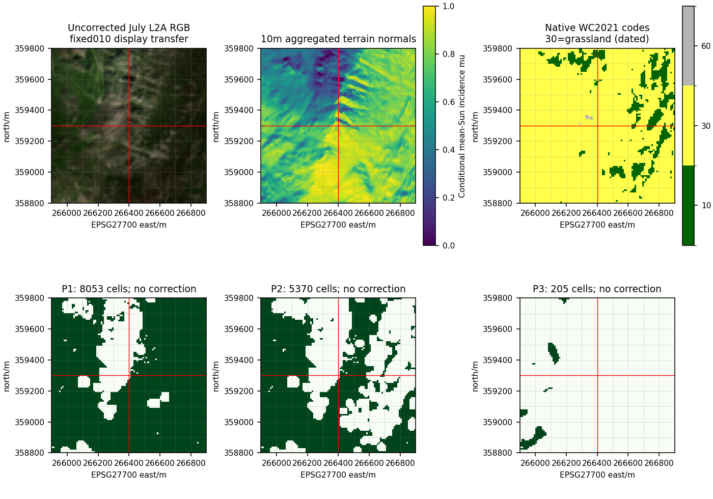
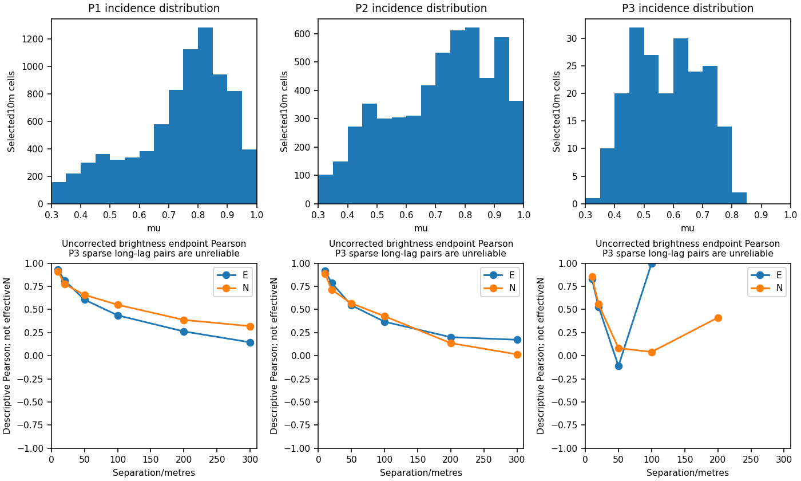

# Retained Tryfan vegetation-only residual-normalization protocol assessment

2026-10-07. Starting checkpoint **9dc4445d491fd59bab2b8e1b613ef62a4bf486b6**, clean main.
`git fetch origin` confirmed origin/main divergence **0/0**; no newer work or discarded changes.

## 1. Executive result

**A - NOT JUSTIFIED** for the three tested populations and fixed spatial generalization design.
Retained evidence supplies many vegetation-labelled cells, but does not establish a sufficiently
controlled, well-supported fit/evaluation population for the proposed next correction experiment.
The broad populations fail the prospectively declared central-incidence coverage gate; the
historically stricter population additionally lacks support in two quadrants. Native label
agreement is not demonstrated contemporary physical homogeneity. **No normalization model,
coefficient, gain field or corrected band was produced.**

This is a protocol no-go, not proof that C-correction fails or that every possible vegetation
experiment is impossible. No threshold, boundary width, study area, class or split was changed
in response to the results. The previous 1842008 trial remains **D - INCONCLUSIVE**.
No executable future correction protocol is published. The next bounded task is a different
appearance question, specified in section27; it has not begun.

## 2. Purpose

Determine whether dated source classification, annual cover and historical habitat can constrain
a meaningful empirical residual-normalization population. Sample number alone cannot separate
terrain illumination from real vegetation, canopy/soil mixture, phenology, moisture, view response
or prior processing. This task assesses eligibility and baseline structure, not correction benefit.

Authoritative entry points: [canonical register](atlas-research-state.md), [registration/epoch
assessment](riffelhorn-registration-epoch.md), [identifiability](illumination-identifiability.md),
[world-model synthesis](atlas-world-model-architecture-synthesis.md) and [revision lifecycle](atlas-derived-understanding-lifecycle.md).
Closed terrain/multiscale/semantic foundations remain closed; no generic vegetation truth or new method is defined.

## 3. Previous inconclusive experiment

The unchanged [old protocol](../../scripts/atlas/illumination-assessment/future-evaluation.json)
(SHA256 `0e1b884bd64c94effffeb1cb024f01c6f385d87eda73f20fa134f0a2add5ca28`),
[execution plan](../../scripts/atlas/tryfan-illumination-normalization/execution-plan.json),
[report](tryfan-illumination-normalization.md) and [baseline](tryfan-illumination-normalization-baseline.json)
required separate SCL4/5 strata:100 total cells,20 heldout cells per500m quadrant,
training incidence P95-P05>=0.2. SE SCL5 supplied12. The whole-design stop preceded fitting.

The present read-only reconstruction reproduces that failure and all four SCL4/5 fold counts.
A vegetation-only design changes the scientific population and needs its own prospective rules.
It cannot retroactively omit the failing old stratum or convert the old stop into a result.

## 4. Retained observation

Exact product: `S2A_MSIL2A_20260712T113331_N0512_R080_T30UVD_20260712T174812`;
mirror `S2A_T30UVD_20260712T113332_L2A`. Sentinel-2A MSI, baseline05.12.
The [010 source/encoding audit](../earth-lab/tryfan-010-observed-natural-colour.md),
[temporal receipt](../earth-lab/tryfan-005c-temporal-evidence.json) and previous report remain authoritative.
B04/B03/B02 are decoded `DN*0.0001-0.1`; DN0 is nodata. L2A represents a processed
surface-reflectance estimate after atmospheric processing and orthoprojection, not raw radiance,
perfect reflectance, albedo or guaranteed illumination independence. Local prior terrain/BRDF
settings, orthorectification geometry revision and exact per-pixel time are unavailable.

Native RGB405x405 at10m, SCL203x203 at20m, EPSG:32630, common origin
`[431200,5887460]`. As in the old implementation, float64 RGB is reprojected bilinearly once
and SCL nearest onto300x300 ten-metre BNG cells. Study
`[264900,357800,267900,360800]`; central100x100 core
`[265900,358800,266900,359800]`. No new observation, region, band or resampling strategy.
The [results](tryfan-vegetation-protocol-results.json) list four exact raster hashes, sizes and grids;
all verify against retained receipts. No PNG supplies analysis values.

Welsh 2021 DTM SHA256 `49c131d7de62e0df35f8e02c2f8db3161bfd37f24fea56060fcbb9e6d109b326`
([terrain proof](../atlas/tryfan-second-region-proof.md)) is read at native1m, mean-aggregated to10m
before finite-difference normals. Vertical/epoch qualifications remain those of that proof; no
exaggerated render terrain or AWS delivery tile is used. Geometry does not prove contemporaneous
canopy normals. Exact terrain support read is the retained3km square.

## 5. Vegetation evidence sources

| Evidence | Native proposition / role | Limitation |
|---|---|---|
| July 2026 SCL4 | Processor vegetation category; mandatory dated eligibility |20m classification, not species/material purity or local confidence |
| WorldCover 2021v200 code30 | Annual grassland classification, native angular grid | Older herbaceous-cover context, not same-day canopy or homogeneous grass |
| NRW Phase1 D.1.1 / other codes | Historical habitat survey interpretation/component geometry | Older ecological context; not current pixel state or measured spectral material |

The [native semantic comparison](../atlas/source-native-semantic-comparison.md) and
[WorldCover binding proof](tryfan-worldcover-binding-proof.md) preserve independent claims.
Native WorldCover crop4918bytes SHA256
`9a0ad7162b1fb5fdc276a90c219c8d1d1daa0e83650ccd22d1dfbb51cbe98f6d`;
NRW vegetation response558917bytes SHA256
`d6d389a7c2a853a15e5a592c08d06f81d500c8778b7370144d246c62c2b7fab8`.
The [source manifest](../atlas/semantic-comparison-sources.json) also supplies verified survey-area,
manual, handbook and NRW metadata hashes. No reacquisition or altered source payload.

## 6. Semantic and time qualifications

WorldCover uses2021 annual classification, publication2022, Sentinel-derived classification mode.
NRW intersecting survey areas record Arfon/Dwyfor1987-1989 and Aberconwy1995-1996;
these are area-context dates, not exact dates for every upland component. Portal publication2023
is not observation time. Both precede July 2026; none is silently promoted to contemporaneous truth.

[WorldCover PUM table3](https://esa-worldcover.s3.eu-central-1.amazonaws.com/v200/2021/docs/WorldCover_PUM_V2.0.pdf)
defines code30 by natural herbaceous dominance and at least10% cover; sparse woody presence and
managed/grazed contexts can occur. It is not an exact species, canopy, moisture or pure-material label.
Product overall validation is not cell confidence. [NRW/JNCC source interpretations](../atlas/source-native-semantic-comparison.md#native-claims-time-observation-lineage-and-grain)
remain recoverable; a common vegetation interpretation must preserve semantic loss and dates.

## 7. Candidate population construction

The [assessment plan](../../scripts/atlas/tryfan-vegetation-protocol/assessment-plan.json) was recorded
before new population statistics, SHA256
`1754a4cddc32d1b7ed76032f9009e813475c542ab0d2514f1e13596aad32394c`.
Three motivated candidates only; no combinatorial search. D.1.1 was selected from the pre-existing
summit habitat case, not from current correlation or yield. Eligibility:

1. Finite strictly positive decoded RGB, SCL4, mean-Sun incidence mu>=0.3, fully supported
   native terrain Sun ray to1km, no model blocker.
2. **P1:** also>=20m inside native SCL4 support.
3. **P2:** P1 also>=20m inside native WorldCover code30 support.
4. **P3:** P2 also>=20m inside union of exact NRW D.1.1 labels with no `mosaicpoly` parent marker.

Native raster class polygons are transformed to BNG for metric boundary distance. Core query
centres retain native half-open cell assignments; no interpolated categorical codes. Complete
retained geometries extend beyond the core; the artificial core edge is not eroded. WorldCover
is still EPSG:4326 with1/12000degree cells. The map is a view of native assignments at analysis
centres, not a new authoritative classification raster. Logical eligibility masks are hashed;
no duplicate mask/source raster or store is written.

## 8. Spatial support

Red lines mark fixed500m quadrants; light grid marks100m counting blocks. All panels use the
same core. RGB uses the previous fixed010 display transfer `(rho-.02)/.28`, gamma1 and display
clipping only. No corrected panel. Source-native WorldCover colours/codes remain separate.

| Candidate | Cells | Unique native SCL cells | Occupied100m blocks (>=20 cells) | Four-connected groups / largest |
|---|---:|---:|---:|---|
| P1 |8053 |2142 |90 |13 /8002 |
| P2 |5370 |1535 |72 |28 /5099 |
| P3 |205 |75 |4 |7 /101 |

Cell counts denote selected analysis supports, not physical vegetation area/fraction or independent
observations. Repeated SCL labels and resampled RGB are not new evidence. Groups can contain
heterogeneous surfaces. P1/P2 are dominated by one connected support; P3 is spatially restricted.

## 9. Spatial dependence

For P2, brightness endpoint Pearson at10m is E0.920/N0.888, at100m E0.368/N0.427,
at200m E0.201/N0.136 and300m E0.173/N0.015. Incidence remains correlated at300m
(E0.233/N0.408). These describe selected endpoint pairs, not stationary variograms,
residual correlations, significance tests or effective sample size. Sparse P3 long-lag pairs
(e.g. two at100m east) have no reliable dependence interpretation.

A100m block is a support/counting unit, not demonstrably independent. Even the predeclared100m
train/test buffer does not guarantee independence. Random pixels would exaggerate support.
[Roberts et al.2017](https://nsojournals.onlinelibrary.wiley.com/doi/10.1111/ecog.02881)
justify structure-aware validation and warn that blocking can itself restrict predictor coverage.
This assessment checks both issues; their paper supplies no numerical threshold for this protocol.
No effective-N estimate or inferential precision is invented.

## 10. Terrain distribution

| Candidate | Slope P05/median/P95 degrees | Elevation P05/median/P95 metres |
|---|---|---|
| P1 |9.68 /29.86 /48.52 |510.00 /650.64 /774.90 |
| P2 |11.00 /30.21 /50.37 |538.24 /681.05 /786.73 |
| P3 |11.61 /24.27 /34.90 |531.18 /691.65 /734.25 |

Aspect is the model downslope azimuth relative to BNG grid north, not true-north camera view.
Eight45degree bins are in the results. P2 spans all bins but unequally (e.g.1430 cells90-135degrees
versus104 at180-225degrees); P3 has none90-225degrees. Whole-population terrain variation does
not establish balanced within-habitat variation or heldout transfer. Terrain/observation epochs
and visible-canopy-versus-DTM semantics remain qualifications.

## 11. Illumination distribution

Documented source scene mean Sun: true-north azimuth160.700929790374degrees,
elevation58.062309162853degrees. Reuse the exact prior grid-convergence transform and NOAA
reconstruction at core centre. Product/datatake UTC `2026-07-12T11:33:31.024Z` yields
158.954117/57.665038degrees; granule field `2026-07-12T11:36:51.535Z` yields
160.367627/57.839018degrees. These are field-role checks, not pixel-time bounds or replacements
for the documented mean. No fitted Sun direction or inferred pixel illumination.

P1 mu P05/median/P95=0.404/0.777/0.950; P2=0.404/0.745/0.958;
P3=0.394/0.588/0.781. Useful whole-core variation exists. Yet P2 NW heldout P05/median/P95
is0.353/0.500/0.783 versus complementary guarded training0.533/0.806/0.967.
Only40.24% of NW support falls inside training's central P05-P95 interval. SE has70.50%,
below predeclared80%. These are central-distribution coverage measures, **not proof that full
training/test ranges are disjoint**, nor a corrected-output finding. We did not search another split.

## 12. Mask and exclusion assessment

Overlapping core counts: invalid/nonpositive RGB: 0; non-SCL4: 752; mu<0.3: 676;
incomplete 1 km ray: 0; conditional model blockers: 132. Before geometric exclusions SCL4=9248;
after original positive/mu/ray/blocker rules=8741; after native SCL20m boundary guard=8053.
Native SCL lookup and prior nearest-grid classification agree at all10000 core centres.

[Official SCL processing semantics](https://sentiwiki.copernicus.eu/web/s2-processing)
identify4 vegetation,5 not-vegetated,2 cast-shadow category,3 cloud-shadow,
0 nodata,1 saturated/defective,6 water,7 unclassified,8/9 cloud,10 cirrus,11 snow/ice.
Requiring4 excludes all others. Historical reports' older class2 wording stays historical;
its exclusion is unchanged. This is a processor classification, not a validated pixel posterior.
No separate cloud probability, spectral purity or noise-floor product is manufactured.
Model blocker results are conditional1km heightfield diagnostics: no blocker is not proven solar
visibility beyond that horizon, nor absence of canopy/non-terrain/overhang shadow. No shadow pixels
are brightened or treated as recovered information.

## 13. Semantic-boundary treatment

Fixed20m is one native SCL cell width, reducing boundary mixtures and preventing direct edge
selection; it does not establish ground homogeneity or compensate unknown registration accuracy.
Metric distances use native class geometry, not a post-resampling boolean erosion.
The results retain CRS operation descriptions/stated accuracy and numerical library versions;
operation accuracy is not measured local image/semantic registration accuracy. It is not
optimized by sample count, correlation or future corrected output. Native Voronoi/mosaic component
boundaries may be prepared subdivisions rather than ecological edges.

P2 has7227 eligible WorldCover30 centres before its guard,5370 after. P3 has494 centres in
strict non-mosaic-labelled D.1.1 support before the NRW guard,205 after. Most historically
D.1.1-associated P2 cells do not satisfy that strict component-parent condition; this is documented
support loss, not evidence of vegetation absence. P2 distance to SCL boundary P05/median/P95
29.41/109.51/286.00m, WC30 boundary24.24/93.83/304.33m. Distances to core-or-invalid geometry
boundaries are additional diagnostics only and include the artificial core edge; they do not define
new eligibility. No guard-width sensitivity search was performed.

## 14. Candidate protocols

| Candidate | Qualification / advantage | Limitations / prospective gate result |
|---|---|---|
| P1 SCL4 buffered | Most dated processor-vegetation support; comparator | Broad physical mixture; NW27.88%,SW78.67%,SE71.74% central-training coverage<80% |
| P2 plus WC30 buffered | Removes other dated annual cover classes; not independent material validation | Annual/current meaning mismatch; NW40.24%,SE70.50% coverage fail |
| P3 plus strict historical heath buffered | One native historical habitat label / no mosaic-parent marker |205 total<400; NW76,NE0,SW129,SE0 heldout; only4 occupied blocks overall; training support/spread failures |

All 3 fail at least one prospectively fixed gate. Exact fixed-quadrant P2 counts are
1327/896/1974/1173; P1=1467/2153/2016/2417; P3=76/0/129/0. The compact
[results](tryfan-vegetation-protocol-results.json) retain every individual gate comparison.
Do not rank candidates by weakest correlation or strongest count. P3's apparent low whole-population
correlation does not make it an eligible or preferable correction population.

## 15. Spectral baseline

| Candidate | Uncorrected brightness versus mu r | Brightness std | Median R/G; B/G |
|---|---:|---:|---|
| P1 |-0.3896 |0.01769 |0.9140;0.6413 |
| P2 |-0.3015 |0.01664 |0.8943;0.6359 |
| P3 |-0.0210 |0.01157 |0.8171;0.5919 |

Brightness uses fixed Rec.709 weights0.2126/0.7152/0.0722, descriptive only. All selected RGB
values are finite/positive with none>1. P2 per-band Pearson R/G/B=-0.0991/-0.3608/-0.1676;
P3=+0.2208/-0.1383/+0.0730. No regression coefficient or correction parameter is estimated.
P2 quadrant brightness r=-0.458/+0.065/-0.138/+0.172. Sign/magnitude changes and band differences
warn against one causal illumination interpretation, but do not identify causes or test method failure.

Adjacent-pair normalized absolute gradient medians R/G/B: P2=0.06869/0.05099/0.08297,
9959 pairs; P3=0.07356/0.04112/0.07041,320 pairs. These are baseline recorded variation,
not after-correction texture retention, calibrated signal-to-noise or recovered hidden information.
No population was selected by these radiometric statistics.

## 16. SCL role

SCL4 is useful as dated coarse eligibility and for excluding known processor cloud/shadow/snow/water
categories. It cannot establish one physical vegetation material, canopy orientation, species,
moisture or invariant radiometry. It is derived using [spectral/auxiliary processing](https://sentiwiki.copernicus.eu/web/s2-processing) and is not
independent truth for the same observation. Repeated20m labels and once-resampled10m radiometry
must not be counted as independent ecological observations. SCL alone is the broad comparator,
not the preferred normalization protocol.

## 17. WorldCover role

Code30 remains native grassland, not a generic vegetation ground-truth label. Its broad thresholds
permit within-class heterogeneity; classification, acquisition period, support and processing differ
from July 2026. It can qualify annual cover context and screen other native categories. It cannot
certify current canopy purity or erase disagreement with NRW. Centre lookup plus20m native-support
guard supplies a reproducible rule, not new physical information or a physical-cover fraction.
Contract v1's existing source-native/mapping-loss treatment remains adequate.

## 18. NRW role

P2 historical native incidences: D.1.1 dry acid heath3809, D.5 native heath/grass mosaic757,
B.1.1 unimproved acid grassland213, E.2.1=30, I.1.2 scree75, I.1.2.1 acid/neutral scree25,
`mosaic`461. All have returned native support, with no multiple centre memberships here.
These sum to5370 but are support incidence counts, not current physical composition.
The D.5 Welsh/JNCC wet/dry-name discrepancy remains unresolved. Mosaic proportions/component
parentage survive in retained feature records; this task does not redistribute them among pixels.

B.1.1 subgroup brightness-mu r=+0.330, D.1.1=-0.215, D.5=-0.435, scree I.1.2=+0.216;
spatial, date and class differences confound interpretation. Subgroup diagnostics are descriptive,
not a search for a correction-worthy habitat. Historical ecological context reveals mixture but
cannot guarantee homogeneous current material. Requiring stronger NRW consistency contracts the
population and loses whole quadrants. It is not justified to force historical agreement as truth.

## 19. Physical-homogeneity assessment

The unchanged [method-requirement review](illumination-identifiability.md#14-topographic-correction-method-requirements)
permits only a constrained empirical **C-family residual** test, not novel algorithms. Its two fitted
coefficients per band describe radiometry versus incidence; interpretation needs sufficiently
comparable surfaces and illumination coverage. Vegetation-only is not itself that condition.
Species, density, soil exposure, phenology, management, moisture, diffuse illumination and BRDF
can covary with aspect/elevation. Unknown earlier L2A terrain processing can alter the same relation.

Neither broad dated classification nor historical habitat supports proving one physically
homogeneous contemporary reflectance population. Separate vegetation subclasses might be
scientifically preferable if independently contemporaneously supported, but that evidence is not
established here. We do not fit subclasses opportunistically or label residual covariance causal.
This limitation reinforces the support no-go; it is not a claim that empirical normalization must fail.

## 20. Sample-support requirement

The old 20-cell minimum was a fold guard for its old two-stratum design, not a power calculation. Two regression
parameters mathematically need few nondegenerate points; that says nothing about independent
support, physical comparability or heldout transfer. The new assessment fixed conservative design
safeguards before diagnostics:

- >=400 eligible cells overall; >=100 heldout cells per quadrant.
- >=4 occupied100m blocks in each holdout; >=12 in training after100m guard;
  occupied means>=20 eligible analysis centres; >=300 guarded training cells.
- Training mu P95-P05>=0.2; heldout>=0.15; occupied training block-median mu P95-P05>=0.1.
- >=80% heldout cells inside the guarded training mu P05-P95 interval.

These are prospective design thresholds, **not validated universal statistical sample minima**.
Counting dispersed blocks and meaningful input variation is preferable to retaining20 autocorrelated
pixels as a sufficient experiment. The80% rule tests central support for a constrained interpolative
residual experiment; deliberate low-incidence extrapolation would be a different question.
NW deficits are large, not just threshold-rounding effects. No criterion is softened after inspection.
Independence and material homogeneity would still require qualification even if every gate passed.

## 21. Train/evaluation design

Assessed four leave-one500m-quadrant-out folds, NW/NE/SW/SE. Exclude training centres within100m
Euclidean distance of the closed heldout square. Keep100m blocks intact for support accounting.
No heldout radiometry selects the population, buffer, thresholds or coefficient.
The100m separation reduces immediate spatial leakage but does not prove independence; dependence
persists farther. Training and heldout central incidence support are checked separately.

For P2 the four guarded training sets contain3552/4213/2655/3601 cells and49/54/39/46 occupied
blocks; heldout contains16/13/24/19. Counts/spreads pass while NW/SE central coverage fails.
This is a characterized **rejected candidate design**, not an executable future fitting protocol.
No new fitting population is nominated. Conditional method mechanics remain as reviewed in the old
protocol (per-band C family with invalid-fit no-change and gain safeguards), but are not authorized
or implemented here. Do not randomize/repartition quadrants merely to make the gate pass.

## 22. Frozen evaluation criteria

The old frozen residual criteria remain byte-identical: heldout brightness/incidence dependence
and within-stratum spread, texture, ratios, extreme gains/clipping, excluded-cell preservation,
matched visuals and five fixed Sun sensitivity scenarios. Their thresholds and qualitative vetoes
are not amended by this task. They were never applied to a corrected output here.

No candidate passes this assessment, so **no new executable correction evaluation protocol is frozen**.
The assessment's count/coverage gates are frozen for reproducing this no-go, not a permit to fit.
A future newly justified protocol would need distinct prospective tests of illumination reduction,
local/spectral preservation, spatial generalization, numerical/spatial parameter stability and failure
behaviour. Decorrelation alone cannot establish physical correctness. No success/improvement claim
or post-hoc correction metric follows from a baseline.

## 23. Frozen stopping conditions

For the assessed design: stop before fitting if any cell/block/illumination/coverage gate in
section20 fails; if exact retained inputs/hashes or grids differ; if valid radiometry/terrain/Sun
support is unavailable; or if source semantics cannot justify the intended population.
Do not drop a fold, historical qualification or problematic stratum, loosen a buffer, lower a count,
extend support or change observations in response. A gate pass would require a separate scientific
homogeneity assessment, not automatic fitting. All tested candidates stopped; no fit is pending.
No parameter degeneracy was empirically evaluated because no model was fitted.

## 24. Allowed and prohibited claims

Allowed: retained dated native labels can reproducibly constrain appearance eligibility;
these particular candidate populations have measured support/dependence/radiometric distributions;
the fixed design does not meet its prospective requirements; unchanged old experiment is inconclusive.

Prohibited: current vegetation/material ground truth, independent sample size from pixel count,
validated local class confidence, correction success/failure, albedo/intrinsic colour,
recovered shadow/hidden-surface signal, first-pass illumination removal, improved Riffelhorn imagery,
physical relighting or general normalization pipeline. No before/after, fitted C, corrected bands,
classification training or new ontology is produced.

## 25. World-model lineage consequence

Semantic evidence can constrain a derivation's eligibility **as dated qualified inputs**, rather than
becoming physical truth. A hypothetical future corrected representation would depend on exact
observation/bands, Welsh terrain, documented Sun plus calculation revision, semantic raster/polygon
revisions and actual queried supports, masks/guard, method, parameters and fitting/evaluation plan.
The [lifecycle companion description](atlas-derived-understanding-lifecycle.md) can retain these uses;
[Contract v1](../atlas/semantic-evidence-contract.md) preserves source-native meaning and interpretation.
No parallel claim model or contract extension is needed for this assessment.

Source credits/obligations remain those of the retained audits: Contains modified Copernicus
Sentinel data 2026; ESA WorldCover 2021 (CC BY4.0); Contains Welsh Government information
licensed under OGLv3.0, with original NRW/OS notices retained in the source records.
This assessment establishes no new redistribution or serving permission.

Logical eligibility-mask hashes identify a derived research artifact, not vegetation identity or a
physical claim. A source/terrain/semantic revision could require eligibility/current-use reassessment
without rewriting original observations or historical results. No corrected representation exists to
publish or invalidate. [Appearance taxonomy](riffelhorn-appearance-assessment.md) remains unchanged.

## 26. Decision A/B/C/D

**A - NOT JUSTIFIED.** The tested retained candidates cannot supply the proposed controlled
vegetation-only fit/heldout protocol under the predeclared conditions. Broad masks have ample
counts but shifted incidence support, strong dependence and unresolved material mixture. The
strict historical candidate lacks east-quadrant support. Do not start another normalization trial.
This is narrower than a theorem of impossibility: alternative scientific questions/designs could
require separate justification; no arbitrary subset search is recommended now.

[Validation](tryfan-vegetation-protocol-validation.json) checks deterministic metrics/mask hashes/figures,
source/terrain/semantic receipts,16 focused safeguards, frozen domain declarations/tests, links/anchors,
all 42 unchanged status columns, historical reports/tooling and 113 production hashes. No acquisition,
source mutation, Weather/Traverse/production/frozen-contract change. No unrelated app build is needed.
Appearance maturity now includes an explicit rejected eligibility design; it does not include successful
normalization, hidden-surface recovery, albedo or relighting. Swiss multiview stays parked.

## 27. Exactly one next bounded task

**Retained Riffelhorn dark-source signal and texture-support assessment.** This next task has not begun.
Return to A5's surviving question about usable recorded dark-source detail, with A3 projection and
A6 acquisition uncertainty preserved. Use only the same retained source orthophotos/prepared baseline
and ordinary/steep/dark/summit supports already identified; no new imagery or alternate scene.

First recover existing source/display range and texture results to avoid duplicating them. The distinct
remaining question is whether dark-source variation is supported by source digital-number occupancy,
clipping/quantization and reproducible spatial/spectral structure, or merely supports a qualified
unknown about useful signal. Compare source and prepared encodings, not correction outcomes; no
brightening, shadow removal, parameter fitting, relighting or cause/albedo inference.

Sufficient output: bounded source-encoding/detail-support diagnostics and a limitations table deciding
what signal-preservation tests, if any, future processing can meaningfully evaluate. Stop when recorded
variation versus unknown noise/physical information can be distinguished, including an explicit
indeterminate result if calibration prevents it. Registration/epoch/steep sampling limitations must
travel with every answer. This addresses a different unresolved appearance evidence boundary rather
than searching another mask to force C-fitting. It does not restart Swiss pixels or close A6-A11/A14.
