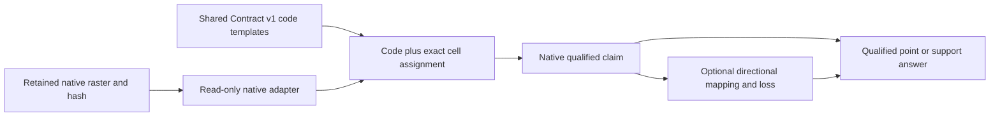

# Retained Tryfan WorldCover native-raster binding proof

2026-10-06. **C — SUCCESS** for the bounded categorical-raster intake/query path.
Starting clean `main`: `691450ff540e0e15ade58cba8464d221e89dc119`; fetch succeeded,
`main...origin/main` **0/0**. No newer commit or legitimate work was discarded.
This is research-only implementation validation, not a new semantic foundation.

## 1. Executive result

Atlas can read the retained native WorldCover grid, select a shared native-code
claim template, bind its exact cell support, and return qualified semantic answers.
Native classification, optional common interpretation and infrastructure availability
remain distinct. Contract v1 and production are unchanged. A genuine subprocess
restart re-reads the same raster and reproduces equivalent semantic queries.

The summit query retains WorldCover **30 / Grassland** alongside NRW **D.1.1 / dry
acid heath**. Neither becomes a universal winner. All three frozen patch counts
match the original comparison. A request for current 2026 cover returns an
unsupported-time gap while preserving the historical 2021 evidence.

## 2. Purpose and scope

Test retained raster → native assignment → qualified claim → optional interpretation
→ spatial query, using one source and the already-retained NRW coexistence case.
No classifier, imagery interpretation, new data, runtime consumer, database,
public API or ontology service. No terrain-quality comparison or reopening of
closed foundations. This does not test every semantic storage form.

Authority: [canonical 42-thread register](atlas-research-state.md),
[world-model synthesis](atlas-world-model-architecture-synthesis.md),
[preceding persistent proof](tryfan-local-persistent-proof.md),
[Semantic Evidence Contract v1](../atlas/semantic-evidence-contract.md),
[native comparison](../atlas/source-native-semantic-comparison.md) and
[domain review](../atlas/physical-surface-semantics.md).

## 3. Retained WorldCover evidence

Read-only assets in `meridian-data/derived/atlas/semantic-comparison-v1`:

| Asset | Bytes | SHA256 / qualification |
|---|---:|---|
| tryfan-worldcover.tif | 4,918 | `9a0ad7162b1fb5fdc276a90c219c8d1d1daa0e83650ccd22d1dfbb51cbe98f6d` |
| nrw-vegetation-full-features.json | 558,917 | `d6d389a7c2a853a15e5a592c08d06f81d500c8778b7370144d246c62c2b7fab8` |

The [original source receipts](../atlas/semantic-comparison-sources.json) retain
parent URL, angular window, operation, retrieval time and rights. The TIFF is a
losslessly encoded native window from ESA WorldCover 2021 v200 N51W006, not the
entire authoritative parent. Parent whole-file hash and actual acquisition wire
bytes remain unknown; the ETag is not a whole-file cryptographic checksum.
No payload is copied to Git or a new archive.

WorldCover is CC-BY4 with ESA WorldCover 2021 and modified Copernicus Sentinel
attribution. NRW is OGL3 with retained NRW/OS/JNCC notices. Shared resources carry
rights/references and source/product identities; source obligations are not erased
by binding. This task relies on the earlier rights gate, not a new clearance survey.

## 4. Native source semantics

Native PUM v2 table3 definitions remain referenced, with retained summaries. The
crop contains codes **10,20,30,50,60,80,100**. Code 0 is supported as a no-data
adapter fixture but is not encountered in this real crop.

| Code | Native category | Important limitation retained |
|---|---|---|
| 10 | Tree cover | Native tree-cover criterion; does not specify underlying ground |
| 20 | Shrubland | Woody growth form/thresholds, not forest equivalence |
| 30 | Grassland | Herbaceous/cover criteria; not a specific habitat |
| 50 | Built-up | Artificial cover; not residential use/function |
| 60 | Bare / sparse vegetation | Soil/sand/rock plus sparse vegetation; not exposed bedrock or scree specifically |
| 80 | Permanent water bodies | Annual persistence criterion; not instantaneous extent, depth or feature identity |
| 100 | Moss and lichen | Native vegetation category; not a complete ecological identity |

The proof preserves native numeric codes, labels, term references, property
`wc:cover`, vocabulary/version and category values. It does not infer substrate,
physical fractions, roughness, traversability or current surface truth.

## 5. Raster support and grain

Native **EPSG:4326**, **334 rows × 554 columns =185,036 assignments**;
step **1/12000 degree** in both angular axes. Affine origin
`[-4.020583333333334,53.128]`, north-up negative latitude step. Bounds:
`[-4.020583333333334,53.10016666666667,-3.974416666666667,53.128]`.
Parent window column/row offsets **23753/10464**, width/height **554/334**.
Nominal 10 m is a classification-product statement, not square10m native cells.
The previous diagnostic reports about **5.578 ×9.274m** at the top row.

Sentinel-1/2 input observations differ from classification sampling. Exact local
information resolution, semantic MMU and local accuracy remain unestablished.
No prepared delivery sampling replaces the angular grid. A point retrieves a
whole-cell assignment, not an independently observed point or homogeneous ground.

BNG transforms use explicit xy axis order. The actual PROJ operation is the
inverse OSGB36-to-WGS84(6) plus BNG, with declared **2m** operation accuracy;
roundtrip consistency is not 2m physical registration validation.

## 6. Binding model

Eight shared templates (seven encountered classes plus no-data0) bind native
codes to immutable template revisions. The metadata declares the TIFF/hash and
assignment rule; it contains no raster values or per-cell objects. Only requested
point answers materialize cell claims. Their IDs contain source product/tile and
parent row/column; revisions reference binding revision and retained raster hash.

Source parent identity, retained subset representation, binding and semantic
claim are separate. No claim is asserted blanket-wise across the crop merely
because its template occurs in the registry.

## 7. Contract v1 representation

The [research harness](../../scripts/atlas/worldcover-binding-proof/runtime.mjs)
reuses the frozen fixture conventions, resource/definition/mapping/collection
interfaces and unchanged `validateSemanticEvidence`. Classification templates
use category terms; no-data uses an explicit `not-classified` gap. Bound cell
support uses existing `native-rectangle`; NRW support references exact retained
feature geometry rather than duplicating polygon payloads.

Definitions, source/product rights, shared context and mappings are stored once.
The owned WorldCover property requires classification mode. Lazily generated cell
claims also validate under frozen v1, with collection bindings removed when
validating that requested-instance collection. No contract extension was needed.

## 8. Prepared representation

No reprojected raster, resampled class grid, tile pyramid or spatial index is
prepared. The retained185k-cell crop is small enough for a direct read and a
transient transformed-centre array. These arrays are discarded, not persisted.
The only preparation is a49KB metadata binding snapshot referencing original
assets. Its lineage identifies template binding as interpretation/preparation,
not new physical evidence. Categorical values are never interpolated.

## 9. Query model

A bounded research harness uses frozen probe IDs, explicit `native`, `common` or
`substrate` questions and a requested year. It is not a general geospatial/public
query engine. Native point lookup transforms coordinates then floors inverse
native affine row/column. West/north grid edges are included; east/south excluded.

The logical result registry supplies source/product identities/rights, definitions,
native grid/hash and shared qualifications. Point answers include exact cell
support, template, native claim, time, classification mode and product quality.
Support answers retain counts, native terms, optional mappings, selection rule
and shared time/evidence/quality. An evidence query is inspection of those qualified
records and the original receipt, rather than a new provenance service.

## 10. Native classification queries

Use the original **EPSG:27700 study `[264900,357800,267900,360800]`**. Frozen
patch centres and400m sides come unchanged from the
[original plan](../atlas/semantic-comparison-plan.json).

| Probe | BNG point | Crop row/column | Parent row/column | Native answer |
|---|---|---|---|---|
| summit | 266405,359387 | 157/277 | 10621/24030 | 30 Grassland |
| southern-observer | 265876.05347833806,358339.7631202109 | 271/187 | 10735/23940 | 30 Grassland |
| northern-context | 266400,360450 | 42/270 | 10506/24023 | 80 Permanent water bodies |

These are measured assignments from the retained raster, not new classification
or validation. The [logical results](tryfan-worldcover-binding-results.json)
retain each exact geographic cell footprint and transformed point coordinates.

## 11. Qualified common interpretation

Reuse the earlier small crosswalk: woody vegetation, nonwoody vegetation,
artificial cover, broad mineral/sparse-cover proposition and persistent water
cover. These are fixture concepts, not a frozen production ontology. Shared
concept IDs do not differ merely because different codes map to them.

Native tree/shrub/grass/moss classes map **narrower**; artificial, broad
mineral/sparse and persistent water concepts are **compatible** with qualifications.
Direction is native extension relative to target. All mappings retain method,
revision, qualification and explicit loss. Compatible does not mean accuracy or
exact equivalence. Code 60 retains soil/sand/rock and loose/solid ambiguity;
class 80 does not establish a waterbody object or current wetness.

A request for geological substrate preserves the known native cover claim but
returns an **unmappable/rejected interpretation**, following the earlier cover
versus substrate distinction. No target material assertion is manufactured.

## 12. Point versus support queries

Centre-selection in BNG intentionally matches the earlier comparison. Counts
are **raster assignments**, not physical fractional cover or area-weighted
estimates. Cells intersecting a boundary without their centre inside are excluded;
selected cells can extend beyond the requested rectangle. No statement of exact
polygon-edge cover is made. The retained rectangular crop is slightly larger
than the study; queries below remain inside the established benchmark.

| Frozen support | Selected cells | Native-code counts |
|---|---:|---|
| summit400m | 3,096 | 10:29;30:3039;60:28 |
| southern400m | 3,090 | 10:9;30:2668;50:77;60:336 |
| northern400m | 3,092 | 10:18;30:794;50:46;80:2234 |
| summit20m | 10 | 30:10 |

The 20 m square `[266395,359377,266415,359397]` is a smaller support centred on the
pre-existing summit, declared in the reader before its first execution. It is
not a newly selected disagreement benchmark. Ten equal codes do not demonstrate
homogeneous grassland over that square. A smaller support containing no cell
centres would need a declared alternative selection rule, not invented cover.

## 13. Time qualification

WorldCover annual nominal epoch **2021**, v200 publication **2022**, retained
retrieval **2026-10-06** are distinct. Exact acquisition times contributing to an
individual cell are explicitly unknown; the lineage says annual Sentinel-1/2
observations without inventing an instant. The proof does not assert continued
validity through 2026. A current/other-year request returns unsupported time with
historical native evidence still inspectable. Historical source-backed evidence
is not erased because it cannot answer the current-state question.

## 14. Evidence mode and quality

WorldCover is **classification**, not direct observation or a Meridian inference.
Shared lineage references the product/source and documented Sentinel-1/2 basis;
local contributing acquisitions/algorithm internals remain incomplete. NRW is
survey-inventory plus classification, with native historical habitat meaning.

The inherited WorldCover overall validation value **76.7%** remains product
scoped. The retained report also states ±0.5%; this is not a Tryfan posterior.
No local confidence, quality winner or semantic accuracy derived from nominal 10 m
is added. Omitted/unknown local quality remains honest.

## 15. Unknown/no-data/unmappable behaviour

| Situation | Result |
|---|---|
| Native assertion exists; substrate interpretation unsupported | Unresolved interpretation with rejected unmappable mapping; native assertion retained |
| Geographic point264800,357700 outside retained grid | `outside-support` evidence gap; no physical absence |
| Retained input files cannot be read | `unavailable` infrastructure outcome; not an assertion or nodata code |
| Native code 0 | `not-classified` native gap, distinct from source unavailability |
| Synthetic unbound code 255 | Unclassified adapter outcome, no substitute category |
| Current 2026 cover requested | Unsupported-time gap plus inspectable2021 native evidence |
| Unregistered proof probe | Unsupported bounded query, not a geographic absence inference |

**Code 0/255 are synthetic adapter tests, not encountered real observations.**
Corrupt or differently hashed retained files fail visibly; no automatic source
replacement. No-data, unsupported property, unavailable input and physical
absence are not collapsed into null/zero. Non-detection is not invented here.

## 16. Coexisting WorldCover/NRW evidence

Three retained dry-acid-heath features intersect the frozen summit patch:
object IDs **486814,486820,486832**, overlap areas approximately 7451.775,
8616.302 and 124419.356m². Feature 486832 contains the frozen summit point.
Its native D.1.1 and WorldCover 30 remain independent source claims with different
vocabularies, supports, modes and temporal qualification.

NRW geometry remains an asset reference to the complete retained Voronoi feature;
converted component boundaries are not new observed edges. Exact feature survey
epoch and local MMU remain unknown. No mosaic percentages are transferred into
this point/cell. The proof is not a repeat accuracy contest or conflict resolver.

## 17. Provenance and identity

Source/resource IDs and product revisions are distinct from the TIFF SHA-backed
native-window representation. Nomenclature version is PUM 2.0/v200 / 2021; owned
term/template revisions are1. Binding revision is `native-code-cell/v1`; mappings
refer to retained c4da565 crosswalk and explicit owned revision1. Instance claim
identity includes native product/tile and parent row/column. Its revision references
binding plus exact retained bytes. A result/materialization hash does not identify
the physical property; changing serialization order or UI labels cannot create a
new physical location. The [results](tryfan-worldcover-binding-results.json) pin
method-file hashes and full logical answers.

## 18. Persistence/restart behaviour

Reuse the preceding proof's unchanged [snapshot mechanism](../../scripts/atlas/local-persistent-proof/store.mjs),
with separate `worldcover-native-binding-proof/v1` schema and store directory in
meridian-data. Persist shared v1 declarations plus raster references, not query
objects, pixel arrays, prepared index or per-pixel claims. There are two collections:
8 WorldCover templates and3 retained NRW claims; source/definitions/mappings shared.

Build subprocess exits → query subprocess loads only snapshot plus declared
retained assets → equivalent queries. A third fresh build produces the identical
metadata snapshot and logical answers. Queries re-read raster assignments rather
than merely returning serialized old numbers. This tests semantic roundtrip;
it does not repeat the previous publication/crash/invalidation programme.

## 19. Determinism

[Runner](../../scripts/atlas/worldcover-binding-proof/run-proof.mjs) records stable
snapshot/logical SHA256s; timing fields are outside logical identity. Rebuild and
restart compare exact canonical logical encoding, including native definitions,
quality, time, mappings and NRW claims. [Tests](../../scripts/atlas/test_worldcover_binding_proof.mjs)
validate retained hashes, counts, lazy instances, frozen v1, synthetic gaps,
coexistence and real subprocess isolation. Reproducibility is not semantic truth.

## 20. Measurements

Current accepted metadata snapshot **48,708 bytes**, pointer 133 bytes; eight
WorldCover templates rather than185,036 metadata objects. No prepared query index
or new raster payload. Local read/transform/hash/NRW overlap phase approximately
**113–121ms**; complete fresh process/build or restart approximately**1.46–1.65s**;
qualified answer assembly after inputs are read approximately**0.7–0.8ms**.
The external scratch store currently contains 2 metadata revisions totalling **98,602bytes**, including development/rebuild snapshots; the current accepted logical snapshot is the measured 48,708 bytes above. Startup includes Python/Vite/validation, not remote serving latency. These are
single local proof runs, no warmed benchmark, tuning or global extrapolation.
Latest exact measurements and hashes are authoritative in the results receipt;
repeat runs can vary wall times while logical state remains identical.

## 21. Architecture evaluation

| Criterion | Finding |
|---|---|
| Native meaning | Preserved numeric code, term, property, label, vocabulary and definition reference |
| Binding | Shared templates and native assignment; lazy requested claims, no contract change |
| Spatial support | Explicit cell bounds and centre-selected support composition; no homogeneity claim |
| Interpretation | Directional narrower/compatible mappings plus loss; unsupported material remains rejected |
| Time | Historical epoch retained; current-state request cannot silently succeed |
| Evidence/quality | Classification mode and product validation stay scoped |
| Unknowns | Infrastructure availability, geographic support, native nodata and interpretation gaps separate |
| Coexistence | Same-location NRW/WorldCover native claims retained without winner |
| Provenance | Exact subset hashes, product/vocabulary/mapping revisions and native cell addressing inspectable |
| Composition | Raster I/O → binding → v1 → qualified lookup; TerrainHierarchy is not a semantic selector |

Materialized metadata is replaceable. This native adapter does not hard-code
Tryfan concepts into v1 or production. Tryfan coordinates belong only to the
bounded test case. Frozen foundations have no demonstrated contradiction.

## 22. Limitations

Only one retained categorical source/window and fixed point/rectangle queries.
No general ingestion, arbitrary polygon intersection service, global source
selection or resolution of heterogeneous truth. The centre rule is not complete
geometric intersection/all-touched support. No actual code 0 occurrence was present.
NRW coexistence is narrow evidence inspection, not a vector-ingestion proof.

No empirical implementation proof for continuous/fractional/probabilistic rasters,
time-series, event records, dynamic state or imagery-derived claims is gained.
V1's conceptual support for them remains distinct. Persistence is single-writer
whole-metadata snapshots, not a production technology choice. Rights clearance,
load/performance scaling and changing native source versions remain later work.

## 23. Decision

**C — SUCCESS.** The real raster can be bound/queried with recoverable native
meaning, time/grain/provenance/mapping loss and honest gaps without changing v1,
creating per-pixel metadata, fabricating confidence/fractions or selecting a
universal truth winner. A/B are not supported by the exercised slice. The
limitations define its acceptance boundary rather than claims of broader coverage.

## 24. Implications for Atlas maturity

A categorical-raster native binding is now empirically demonstrated alongside
the previously proved terrain/lifecycle/persistence path. This completes the
previous next recommendation, not the physical-world runtime or semantic coverage.
No new foundational blocker is demonstrated. All 42 canonical status columns and
historical reports remain unchanged; current navigation records this separate
engineering proof. Multiscale and physical semantics remain closed. A2 appearance
metadata/resolution remains partial; A6–A11 illumination/correction/albedo/BRDF/
lighting, A14 fusion and A15 registration retain their recorded limitations.
A13 Swiss frame pixels remain **PARKED**. Weather and Traverse remain unchanged.

[Validation](tryfan-worldcover-binding-validation.json) records focused tests,
frozen contracts/tooling, historical preservation, protected production hashes,
local links/anchors, deterministic reconstruction and source integrity.

## 25. Exactly one recommended next bounded task

**Retained Riffelhorn appearance identity, provenance and qualified-resolution assessment.**
The full register's A2/A15 and implementation boundary retain a distinct open
architecture/engineering gap: prepared RGB identity/support exists, but qualified
appearance resolution and provenance expectations have not been exercised as a
coherent world-model boundary. This matters independently of more semantic adapters.

Use only existing SWISSIMAGE/source-derived appearance and common MapTiler
metadata/retained records. Assess which question/context can resolve a prepared
appearance representation, while preserving source versus prepared identity,
coverage/grain, acquisition versus publication, registration and per-location
mosaic/projection unknowns. Explicitly keep photographed RGB separate from albedo,
corrected appearance and renderer lighting. State the minimum compatible domain
responsibilities/validation requirements, rather than implementing a universal
AppearanceHierarchy or new frozen contract. No pixels need acquisition.

Exit with one bounded readiness/limitation decision, exact source/provenance
requirements and one next task; stop before rendering, correction, fusion,
illumination inference, runtime or provisioning. A13 remains parked. This is an
assessment of the retained appearance boundary, not an automatically launched
experiment or production programme. **This next task has not begun.**
