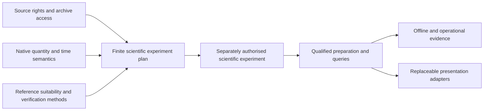

# Weather research programme and evidence gates

WR001, 10 October 2026. This is a dependency-informed programme, not a fixed sequence, schedule, architecture or instruction to implement every taxonomy entry. [Register](research-register.md) separates discovery from validation. [Source rights](source-access-rights.md) can veto an experiment before technical work. Weather remains scientifically independent of Atlas, presentation and future Guide.

## Programme design

Three parallel tracks are useful: **source/access/reference feasibility** (W10/W38/W40), **quantity/time/support semantics** (W11/W31), and **validation/uncertainty methods** (W30/W36). Their intersection chooses a lawful, bounded scientific experiment. Specialist mountain, nowcasting, ML, coupled and warning work can change priorities; it is not necessary to finish every atmospheric discipline before testing one well-defined field. Preparation/query engineering follows demonstrated semantics, not an inherited tile format. Offline/operational work needs actual product identity/horizon/rights and measured costs.

The arrows show evidence dependencies, not current implementation or compulsory completion of every topic.

| Stage / entry evidence | Bounded deliverable and acceptance | Stop / alternatives |
|---|---|---|
| WR001 broad discovery — independent primary research before legacy assessment | Landscape, taxonomy, preliminary access register, legacy inventory and programme; distinguish evidence from identified subjects. Completed documentation here | No scientific readiness or source selection implied |
| Source and reference feasibility — WR001 gaps | Exact forecast/observation product documentation, overlapping region/history/intervals, QC/exposure, access/rights and resource estimates. Show an attainable comparison or precise blocker | Stop if inaccessible/rights ambiguous/unmatched reference; change region/variable/source rather than obtain data without authorisation |
| Semantic and validation design — feasible sources | Finite field/time/grid/member profile, source/decoder oracle, independent observations, evaluation baselines and immutable experiment plan; define missingness and error cases | Rights and reference work may proceed in parallel. No numerical implementation until a justified bounded profile/resource approval exists |
| Controlled scientific experiments — approved inputs/plan | Independently checked decoding/units/grids/time; then separately interpretation/derivation and empirical skill where evidence permits; preserve failed/negative cases and uncertainty | Exact success scope; no provider ranking beyond evaluated region/lead/variable/sample. Reconsider sources or methods when assumptions fail |
| Scientific preparation/publication/query engineering — accepted finite findings | Reproducible records/products, versioned provenance, finite query contract, coherent snapshots and reference cases. Compare representations against semantics | A tile/chunk/array/API is a replaceable representation. Do not clone Atlas's record schema or engine without Weather evidence |
| Offline and operational delivery — qualified products/rights/cost measurements | Forecast freshness/expiry, explicit snapshot identity, complete packages, recovery, storage/compute/egress limits and sustainability gate | Target-specific durability/performance await later platform tests; no premature service. Older forecast can remain accessible with age/limitations, never silently current |
| Presentation and Atlas/Guide integration — stable narrow scientific boundary | Labelled queries/render adapters and inspection; route/time/exposure context remains separate from hazard/navigation suitability | New UI/platform decisions separate. No implied shared safety score or redesign of scientific systems |

Review at each bounded result: did the answer change source feasibility, the scientific question, validation method or platform/resource requirements? Document the change instead of forcing it into these stages. No calendar or requirement to finish every stage before useful engineering. External testing/beta entry still follows [maturity gates](../../foundations/roadmap.md), not a single weather experiment.

## Candidate investigations and information value

**First:** source + observation/archive feasibility has high dependency value and can be researched without hardware or data downloads. It reveals whether a credible skill study is possible and what rights constrain delivery. **Parallel after scoping:** native forecast-time/accumulation and verification design prevent invalid comparisons. **Then:** wind/precipitation/temperature and complex-terrain representativeness are plausible early finite experiments because they connect general physical semantics to useful questions; not mandated by legacy coverage. **Alternatives:** ML/physical comparison if comparable historical products and independent observations exist; radar nowcasting if latency/rights/reference availability justify it; ensemble calibration if accessible members and sufficient history make it scientifically stronger than deterministic ranking. Rare hazards, surface conditions and health indices require specialist evidence and should not displace basic semantic integrity by default.

The legacy publication supplies engineering examples and historical decoder/packing receipts. It does not supply a validated prediction benchmark or complete reference observations. Two retained cycles cannot establish seasonal/local skill. Missing long forecast archives or exposed station metadata may be more consequential than choosing another renderer or numerical format.

## Scientific boundaries and architecture alternatives

Long-lived responsibilities: source/model/product identity; raw input and preparation lineage; distinct cycle/reference/issue/valid/observation/interval times; native quantity/grid/vertical/member support; missingness/QC; methods/uncertainty; immutable experimental evidence; explicit query errors; forecast horizon/expiry and qualified revisions. Preparation is independent of UI. Atlas contributes terrain/provenance context; Guide may request route/time context; neither supplies atmospheric truth. Rendering resources and animated blends must not become scientific authority. No universal Weather schema frozen.

| Alternative | Potential use / limitations / evidence needed |
|---|---|
| Direct prepared-provider query | Small point needs, less local preparation; provider interpolation/blending, quotas, privacy, provenance/retention/offline licence limits. Needs explicit provider meaning and service failure handling |
| Server/local prepared scientific products | Reproducible decode/qualification and queryable data; compute, retention, egress and operational ownership. Does not require a network service for every eventual offline reader |
| Downloadable native model subsets | Preserve model metadata/levels/members with finite volume; source grids/formats/native dependencies and redistribution need evidence |
| Precomputed numerical/raster tiles | Efficient map access for selected fields; resampling/quantisation/mercator support can alter meaning; not universal vertical/ensemble/observation representation |
| Chunked multidimensional arrays | Levels/times/members and selective access; chunks/codecs/metadata/version/IO costs. Zarr/NetCDF roles are provisional, not chosen |
| Hybrid online/offline products | Different freshness/availability needs; coherent identity/expiry, complete offline closure and explicit unavailable states required |

Choose representations per justified profile using semantic conformance, measured resources, rights and maintenance. Provider adapters should translate documented meanings, not hide incompatible quantities behind one friendly field name. Raw source, decoded scientific product, query result and renderer cache have different authority and retention.

## Exactly one recommended subsequent bounded task

**WEATHER RESEARCH 002 — FORECAST AND OBSERVATION SOURCE FEASIBILITY FOR A BOUNDED UK/ALPINE VALIDATION STUDY — NOT BEGUN.**

**Objective:** determine whether one finite future forecast-validation question can obtain lawful forecasts and suitable, sufficiently independent reference observations with compatible support/history. No model/provider selection is presumed.

**Starting evidence:** S01/S03/S05/S08 forecast opportunities; S11/S12/national observation archives; W10/W11/W30/W38/W40 and documented access gaps. UK and Alpine coverage are candidate evaluation settings related to retained Meridian regions, not a requirement to run both or to manufacture local station coverage.

**Scope:** documentation-only investigation of at most three forecast product families and two reference-observation families, chosen with recorded reasons from the broad landscape. Pin exact products, fields/levels/intervals, cycles/leads, geographical/temporal overlap, forecast archive versus reanalysis, QC/exposure/elevation, assimilation/training dependence, access/authentication/quotas, licence/derived/offline terms and bounded future volume estimates. Prefer a basic quantity whose definition and reference are defensible. No downloads, accounts, API implementation, benchmarking, provider contract, final architecture or private access.

**Deliverables:** product-level access/rights evidence ledger; forecast–reference compatibility matrix; one proposed finite validation protocol and acquisition prerequisite, or exact blockers/alternatives. Specify what claims it could and could not test, and resource assumptions requiring later measurement/approval.

**Acceptance:** sources tied to current authoritative terms; no assumed unlimited archive or observational ground truth; honest negative results; at least one feasible pair/question or a reproducible reason none is established within scope. Separate decoding/interpretation/skill/decision suitability. Preserve all existing science/publications and future device/platform gates.

**Direction-change trigger:** no lawful overlapping forecast/observation archive, inadequate reference exposure/QC, source-dependent interpretation, prohibitive volume or uncertain redistribution can change region, variable, methods or candidate source. If no meaningful empirical comparison is feasible, design a narrower semantic/decoder investigation rather than pretend to assess skill.

**Stop:** after that documentary feasibility decision and one next task; no acquisition or experiment begins automatically. This subsequent task has not begun in WR001.

## WR002 completed: refined programme dependencies

10 October 2026. [WR002 findings](global-regional-source-feasibility.md) complete a bounded documentary global/regional/reference comparison under the actual authorised 3/3/3 ceilings (3/2/3 used). This refines the narrower historical WR001 proposal above; its no-acquisition/implementation and scientific-preservation boundaries remain.

A candidate UK GFS/UKV/MIDAS temperature comparison moves the next gate to **source-specific quantity/reference semantics and preregistered verification design**. Exact historical rights/access and file/metadata closure remain parallel acquisition prerequisites, not facts silently deemed satisfied. Alpine retrospective ICON work is blocked within the selected public feed; prospective capture or separate archive research can be reconsidered later. ISD supersession requires explicit reference-edition work before expansion. Neither negative finding forces abandonment of the whole programme.

The stages remain dependency-informed. Design can stop with a reference/height/QC blocker and redirect the experiment; later acquisition still needs its own authority, rights and bounded resource plan. No empirical comparison, provider ranking, blending, preparation system, offline package or production architecture follows automatically.

Exactly one current next task: **WEATHER RESEARCH 003 — NEAR-SURFACE TEMPERATURE SEMANTICS AND FORECAST–REFERENCE VERIFICATION DESIGN — NOT BEGUN**. The [complete task definition](forecast-reference-compatibility.md#exactly-one-next-bounded-task) specifies evidence, scope, dependencies, deliverables, acceptance and stopping criteria. The old WR002 next-task definition is preserved as historical scoping evidence; it is not another active task.

## WR003 completed: reference-metadata closure before execution

10 October 2026. [WR003](temperature-semantics.md) supplies a qualified temperature estimand and [draft verification design](temperature-verification-protocol.md), not an executed or fully preregistered experiment. It refines WR002's candidate exact-hour cohort through actual physical-time/message support, documented height differences and element QC. Equal-lead pairing, station weighting, dependence-aware uncertainty and deviations are specified; unresolved parameters and rights remain explicit.

The next finite gate is reference measurement/QC/history and historical-product metadata closure. It is higher-value than automatic numerical work or another provider survey. If the reference cannot be justified, revise cohort/reference before errors; if only regional archive rights fail, global validation remains a separate conditional track. Too few effective blocks can restrict the next experiment proposal to descriptive decoding/interpretation. No universal Weather schema, provider, model or delivery format follows.

The broad atmospheric/global/regional/ensemble/observations/nowcast/ML/mountain/uncertainty/engineering/offline/Atlas–Guide programme stays intact. Exactly one next task: **WEATHER RESEARCH 004 — REFERENCE MEASUREMENT METADATA AND HISTORICAL TEMPERATURE PRODUCT CLOSURE — NOT BEGUN**, with [objective, evidence, dependencies, acceptance and stopping conditions](temperature-acquisition-gates.md#exactly-one-next-bounded-task). No acquisition, error calculation or subsequent programme stage has begun.

## WR004 completed: interpretation pilot before skill comparison

10 October 2026. [WR004](reference-metadata-and-historical-product-closure.md) records **OUTCOME B — PARTIAL CLOSURE**. Current guide/QC component and selected historical-object evidence improve documentary feasibility, while authorised station-era/dictionary/header inspection is now the highest-value gate. Another provider survey, model ranking or urgent rolling-archive acquisition would not resolve that common reference uncertainty.

The broader global/regional, ensemble, nowcast, ML/hybrid, mountains, uncertainty, engineering, offline and Atlas/Guide tracks remain. No broad topic is experimentally validated and no final provider/format/architecture is selected. A negative reference pilot may revise the reference/question; a nominal-time or network-proxy comparison requires explicit pre-error change. Historic stages and next-task definitions above remain records, not concurrent instructions.

Exactly one current next task: **WEATHER RESEARCH 005 — MIDAS OPEN REFERENCE INTERPRETATION AND ERROR-BLIND ELIGIBILITY PILOT — NOT BEGUN**, [objective, required evidence, scope, dependencies, acceptance, resource boundaries and stops](reference-metadata-and-historical-product-closure.md#13-programme-implication-and-exactly-one-next-bounded-task). No acquisition or implementation begins here.

## WR005 completed: real metadata and a failed strict-eligibility gate

10 October 2026. [WR005](midas-reference-interpretation-pilot.md) inspects real supplied metadata with a reproducible isolated utility. **OUTCOME B — PARTIAL INTERPRETATION**: 390 year-range nominations match release-listed qcv-1 IDs, but no actual January 2025 station-era is characterised. Zero observation files opened. Current location/year-range metadata cannot supply historical sensor/clock/QC facts. This is an actionable evidence insufficiency, not a weather negative result or a justification to relax the strict protocol silently.

Prioritise one historical-support/reference-target decision before asking for an arbitrary annual file. The global/regional, ensemble, observations/nowcast, ML, mountain, wind/cloud/precipitation, uncertainty, engineering and offline tracks remain; no provider or architecture is selected. Exactly one next task: **WEATHER RESEARCH 006 — MIDAS HISTORICAL MEASUREMENT SUPPORT AND REFERENCE-TARGET DECISION — NOT BEGUN**, [scope, dependencies, acceptance, resources and stops](midas-reference-interpretation-pilot.md#9-exactly-one-subsequent-task--not-begun).

## WR006 completed: close the reference decision, separate decoding from skill

10 October 2026. [WR006](midas-historical-measurement-support.md) reaches **Outcome C —
EVIDENCE BLOCKED / reference-target Decision C** for one error-blind Wick audit nominee.
The strict protocol stays BLOCKED; nominal-report/unknown-height alternatives remain
PROPOSED, not adopted. Historical QC/J documentation retrieval improved, but this
cannot substitute for dated instrument/clock support and actual record interpretation.

Refinement to stage dependencies: **source-format and numerical-integrity experiments
can proceed without a qualified observation reference**, once lawful finite acquisition,
semantic identity, independent decoding and resource gates are satisfied. Forecast
verification still requires that reference; internal numerical consistency cannot
prove skill. Do not create another indefinite MIDAS-only documentary chain. The small
manual evidence checklist remains recorded, without sending a request or making it
a prerequisite for all global work. Global/regional/ensemble/nowcast/ML/mountain and
other quantity research remain first-class; no architecture or provider is frozen.

Exactly one current next task: **bounded historical GFS temperature-field acquisition,
decoding and integrity pilot — NOT BEGUN**, [objective, evidence, scope, dependencies,
acceptance, resources and stops](midas-historical-measurement-support.md#9-programme-consequence-and-exactly-one-next-task).
Historical task definitions remain records, not concurrent instructions.
